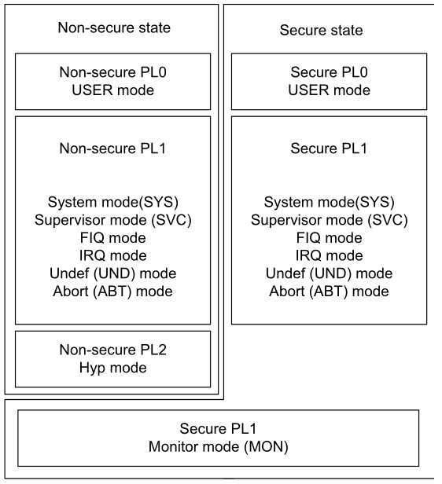
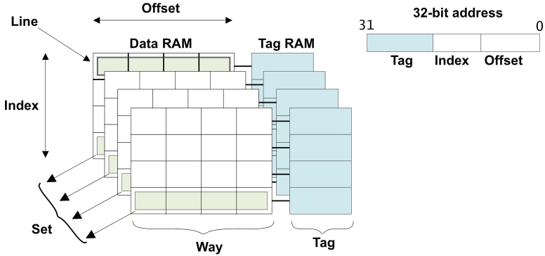
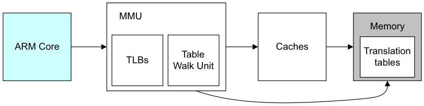
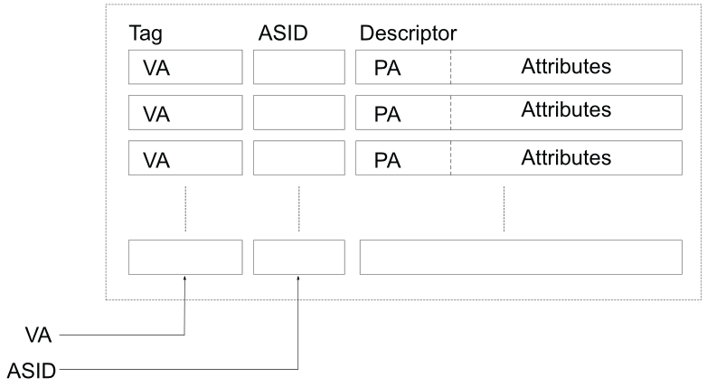
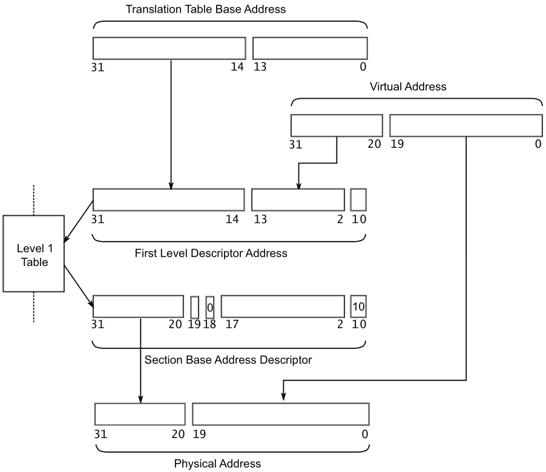

#+title: ARMv7 软件开发梳理
#+subtitle: Cortex-A9
#+author: Soc Team
#+latex_class: org-latex-pdf 
#+toc: tables 
#+toc: listings 
#+latex: \clearpage\pagenumbering{arabic} 
#+latex: \AddToShipoutPicture{\BackgroundPicture} 
#+options: h:4 ^:{} 
#+startup: overview

* 核模式
#+caption: 核模式
#+attr_latex: :placement [H]
|---------+-------------------------------------------------+-------------+-----------|
| Mode    | Function                                        | Security    | Privilege |
|---------+-------------------------------------------------+-------------+-----------|
|---------+-------------------------------------------------+-------------+-----------|
| User    | Most applications run                           | Both        | PL0       |
| FIQ     | Entered on an FIQ interrupt exception           | Both        | PL1       |
| IRQ     | Entered on an IRQ interrupt exception           | Both        | PL1       |
| SVC     | Entered on reset or SVC instruction is executed | Both        | PL1       |
| Abort   | Entered on a memory access exception            | Both        | PL1       |
| Undef   | Entered when an undefined instruction executed  | Both        | PL1       |
| System  | Sharing the register view with User mode        | Both        | PL1       |
|---------+-------------------------------------------------+-------------+-----------|
| Hyp     | Implemented with Virtualization Extensions      | Non-secure  | PL2       |
| Monitor | Implemented with TZ                             | Secure only | PL1       |
|---------+-------------------------------------------------+-------------+-----------|
- Linux 内核 和 APP运行在 Non-secure状态, 如图 [[img-processpriv]];
- Secure状态主要放置vendor-specific固件, 安全敏感的软件;
- CPSR寄存器包含当前核模式和执行状态

#+caption: 核优先级
#+name: img-processpriv
#+attr_latex: :placement [H] :width 0.45\textwidth

** 核寄存器
#+caption: 核寄存器
#+attr_latex: :placement [H]
|----------+-----+----------+----------+----------+----------+----------+----------+----------|
| User     | Sys | FIQ      | IRQ      | ABT      | SVC      | UND      | MON      | HYP      |
|----------+-----+----------+----------+----------+----------+----------+----------+----------|
|----------+-----+----------+----------+----------+----------+----------+----------+----------|
| R0       | -   | -        | -        | -        | -        | -        | -        | -        |
| R1       | -   | -        | -        | -        | -        | -        | -        | -        |
| R2       | -   | -        | -        | -        | -        | -        | -        | -        |
| R3       | -   | -        | -        | -        | -        | -        | -        | -        |
| R4       | -   | -        | -        | -        | -        | -        | -        | -        |
| R5       | -   | -        | -        | -        | -        | -        | -        | -        |
| R6       | -   | -        | -        | -        | -        | -        | -        | -        |
| R7       | -   | -        | -        | -        | -        | -        | -        | -        |
| R8       | -   | R8_fiq   | -        | -        | -        | -        | -        | -        |
| R9       | -   | R9_fiq   | -        | -        | -        | -        | -        | -        |
| R10      | -   | R10_fiq  | -        | -        | -        | -        | -        | -        |
| R11      | -   | R11_fiq  | -        | -        | -        | -        | -        | -        |
| R12      | -   | R12_fiq  | -        | -        | -        | -        | -        | -        |
| R13 (sp) | -   | SP_fiq   | SP_svc   | SP_abt   | SP_svc   | SP_und   | SP_mon   | SP_hyp   |
| R14 (lr) | -   | LR_fiq   | LR_svc   | LR_abt   | LR_svc   | LR_und   | LR_mon   | -        |
| R15 (pc) | -   | -        | -        | -        | -        | -        | -        | -        |
| (A/C)PSR | -   | -        | -        | -        | -        | -        | -        | -        |
|----------+-----+----------+----------+----------+----------+----------+----------+----------|
|          |     | SPSR_fiq | SPSR_irq | SPSR_abt | SPSR_svc | SPSR_und | SPSR_mon | SPSR_hyp |
|          |     |          |          |          |          |          |          | ELR_hyp  |
|----------+-----+----------+----------+----------+----------+----------+----------+----------|
- CPSR: is used to store
  + N: Negative result from ALU.
  + Z: Zero result from ALU.
  + C: ALU operation Carry out.
  + V: ALU operation oVerflowed.
  + Q: cumulative saturation (also described as sticky).
  + J: indicates whether the core is in Jazelle state.
  + GE[3:0](>=): used by some SIMD instructions.
  + IT [7:2]: If-Then conditional execution of Thumb-2 instruction groups.
  + E: controls load/store endianness.
  + A: disables asynchronous aborts.
  + I: disables IRQ.
  + F: disables FIQ.
  + T: indicates whether the core is in Thumb state.
  + M[4:0]: specifies the processor mode (USR, SYS, FIQ, IRQ...)

** 协处理器CP15寄存器
*** 处理器寄存器
#+caption: 处理器寄存器
#+attr_latex: :placement [H]
|------------------------------------------+------------------------------------------------------------------------|
| Register                                 | Description                                                            |
|------------------------------------------+------------------------------------------------------------------------|
|------------------------------------------+------------------------------------------------------------------------|
| Main ID Register (MIDR)                  | Gives identification information for the processor                     |
| Multiprocessor Affinity Register (MPIDR) | Provides a way to uniquely identify individual cores within a cluster. |
|------------------------------------------+------------------------------------------------------------------------|
*** C1 System Control registers
#+caption: System Control registers
#+attr_latex: :placement [H]
|---------------------------------------------+-----------------------------------------------------------|
| Register                                    | Description                                               |
|---------------------------------------------+-----------------------------------------------------------|
|---------------------------------------------+-----------------------------------------------------------|
| System Control Register (SCTLR)             | The main processor control register                       |
| Auxiliary Control Register (ACTLR)          | Additional control and configuration options.             |
| Coprocessor Access Control Register (CPACR) | Controls access to all coprocessors except CP14 and CP15. |
| Secure Configuration Register (SCR)         | Used by TrustZone                                         |
|---------------------------------------------+-----------------------------------------------------------|

- SCTLR:
  + TE: Thumb exception enable. This controls whether exceptions are
    taken in ARM or Thumb state.
  + NMFI: Non-maskable FIQ (NMFI) support.
  + EE(Exception endianness): This defines the value of the CPSR.E bit
    on entry to an exception.
  + U: Indicates use of the alignment model.
  + F: FIQ configuration enable.
  + V: This bit selects the base address of the exception vector table.
  + I: Instruction cache enable bit.
  + Z: Branch prediction enable bit.
  + C: CACHE enable bit.
  + A: Alignment check enable bit.
  + M: MMU enable bit.

*** C2 and C3, memory protection and control registers
#+caption: Memory Protection and Control Registers
#+attr_latex: :placement [H]
|-------------------------------------------------+-------------------------------------------|
| Register                                        | Description                               |
|-------------------------------------------------+-------------------------------------------|
|-------------------------------------------------+-------------------------------------------|
| Translation Table Base Register 0 (TTBR0)       | Base address of level 1 translation table |
| Translation Table Base Register 1 (TTBR1)       | Base address of level 1 translation table |
| Translation Table Base Control Register (TTBCR) | Controls use of TTB0 and TTB1             |
|-------------------------------------------------+-------------------------------------------|
*** C5 and C6, memory system fault registers
#+caption: Memory System Fault Registers
#+attr_latex: :placement [H]
|-------------------------------------------+-----------------------------------------------------------|
| Register                                  | Description                                               |
|-------------------------------------------+-----------------------------------------------------------|
|-------------------------------------------+-----------------------------------------------------------|
| Data Fault Status Register (DFSR)         | Gives status information about the last data fault        |
| Instruction Fault Status Register (IFSR)  | Gives status information about the last instruction fault |
| Data Fault Address Register (DFAR)        | Gives the virtual address of the access that              |
|                                           | caused the most recent precise data abort                 |
| Instruction Fault Address Register (IFAR) | Gives the virtual address of the access that              |
|                                           | caused the most recent precise prefetch abort             |
|-------------------------------------------+-----------------------------------------------------------|
*** C7, cache maintenance and other functions
#+caption: Cache Maintenance
#+attr_latex: :placement [H]
|--------------------------------------------------+-------------|
| Register                                         | Description |
|--------------------------------------------------+-------------|
|--------------------------------------------------+-------------|
| Cache and branch predictor maintenance functions |             |
| Data and instruction barrier operations          |             |
|--------------------------------------------------+-------------|
*** C8, TLB maintenance operations
*** C9, performance monitors
*** C12, Security Extensions registers
#+caption: Security Extensions Registers
#+attr_latex: :placement [H]
|----------------------------------------------+-----------------------------------------------------|
| Register                                     | Description                                         |
|----------------------------------------------+-----------------------------------------------------|
|----------------------------------------------+-----------------------------------------------------|
| Vector Base Address Register (VBAR)          | Provides the exception base address for exceptions  |
|                                              | that are not handled in Monitor mode.               |
| Monitor Vector Base Address Register (MVBAR) | Holds the exception base address for all exceptions |
|                                              | that are taken to Monitor mode.                     |
|----------------------------------------------+-----------------------------------------------------|
*** C13, process, context and thread ID registers
#+caption: Process, Context and Thread ID Registers
#+attr_latex: :placement [H]
|----------------------------------+-------------|
| Register                         | Description |
|----------------------------------+-------------|
|----------------------------------+-------------|
| Context ID Register (CONTEXTIDR) |             |
| Software thread ID registers     |             |
|----------------------------------+-------------|
*** C15, IMPLEMENTATION DEFINED registers
#+caption: IMPLEMENTATION DEFINED Registers
#+attr_latex: :placement [H]
|--------------------------------------------+-----------------------------------------|
| Register                                   | Description                             |
|--------------------------------------------+-----------------------------------------|
|--------------------------------------------+-----------------------------------------|
| Configuration Base Address Register (CBAR) | Provides a base address for the GIC and |
|                                            | Local timer type peripherals.           |
|--------------------------------------------+-----------------------------------------|
* 异常(核)
** 异常模式
#+caption: 异常模式
#+attr_latex: :placement [H]
|-----------------------+------------+---------------------------|
| Exception             | Mode       | CPSR interrupt mask(auto) |
|-----------------------+------------+---------------------------|
|-----------------------+------------+---------------------------|
| Reset                 | Supervisor | F = 1; I = 1              |
| Supervisor Call       | Supervisor | I = 1                     |
|-----------------------+------------+---------------------------|
| Prefetch Abort        | Abort      | I = 1                     |
| Data Abort            | Abort      | I = 1                     |
|-----------------------+------------+---------------------------|
| UNDEFINED instruction | Undef      | I = 1                     |
| IRQ interrupt         | IRQ        | I = 1                     |
| FIQ interrupt         | FIQ        | F = 1; I = 1              |
|-----------------------+------------+---------------------------|
| Not used              | HYP        | -                         |
|-----------------------+------------+---------------------------|
** 异常处理流程
当发生异常时，ARM 核会自动的进行下列处理:
1. 备份CPSR到目标异常模式的SPSR_<mode>.
2. 保存当前返回地址到目标异常模式的LR寄存器.
3. 修改CPSR 模式bit为目标异常类型.
4. 设置PC指向向量表的异常（跳转）指令.
** 退出异常
退出异常有2个操作会自动处理:
1. 从异常模式的SPSR恢复CPSR.
2. 从异常模式的LR恢复PC.
** 异常指令
- SVC: enables User mode programs to request an Operating System service.
- HVC: available if the Virtualization Extensions are implemented,
  enables the guest OS to request Hypervisor services.
- SMC: available if the Security Extensions are implemented, enables
  the Normal world to request Secure world services.
** 异常向量表                                                     :noexport:
The situation is more complicated for cores with Security
Extensions. Here there are three vector tables, Non-secure, Secure and
Secure Monitor (CP15.VBAR). For cores with the Virtualization Extension there are
four, adding a Hypervisor vector table. For cores with an MMU, all
these vector addresses are virtual(CP15.MVBAR).
** 异常优先级
当有多个异常同时发生时，每个异常将会等上一个处理完成后，再轮流被处理.

所有的异常都会自动禁能IRQ, 只有FIQ和Reset异常才会自动禁能FIQ（查询CPSR
可看到）

** 中断处理
1. 以下为核自动处理
   - 备份当前模式PC到IRQ模式的LR_IRQ;
   - 备份CPSR到IRQ模式的SPSR_IRQ;
   - 更新CPSR的模式bit到IRQ模式;
   - 更新CPSR的I bit禁能IRQ;
   - 设置PC为向量表的IRQ项;
2. 软件行为：
   - 中断服务函数保存上下文到IRQ模式的栈上(SP_IRQ)
   - 中断服务函数选择处理相应的中断源;
   - 从SPSR_IRQ恢复CPSR；
   - 从IRQ模式的栈上恢复上下文;
   - 从IRQ模式的LR_IRQ恢复PC;
*** Interrupt type                                               :noexport:
- Software Generated Interrupt (SGI): This is generated explicitly by
  software by writing to a dedicated distributor register, the
  Software Generated Interrupt Register (ICDSGIR). It is most commonly
  used for inter-core communication. SGIs can be targeted at all, or a
  selected group of cores in the system. Interrupt numbers 0-15 are
  reserved for this. The exact interrupt number used for communication
  is at the discretion of software.
- Private Peripheral Interrupt (PPI): This is generated by a
  peripheral that is private to an individual core. Interrupt numbers
  16-31 are reserved for this. These identify interrupt sources
  private to the core, and is independent of the same source on
  another core, for example, per-core timer.
- Shared Peripheral Interrupt (SPI): This is generated by a peripheral
  that the Interrupt Controller can route to more than one
  core. Interrupt numbers 32-1020 are used for this. SPIs are used to
  signal interrupts from various peripherals accessible across the
  whole the system.
  
* 中断控制器(GIC)
* Cache
#+caption: Cache基本结构
#+name: img-cachestr
#+attr_latex: :placement [H] :width 0.6\textwidth

- line(index): cache最小操作单位
- set: 相同index的line整合到1个set里面
- tag:
- way: cache子块；
** Cache实现
*** 直接映射型Cache
只有1个way，n个set，容易引起抖动；
*** 全映射型Cache
只有1个set，n个way；
*** Set关联型Cache
n个set，m个way；
** Cache策略
*** Allocation策略
- read allocate策略
- write allocate策略
*** 替换策略
- round-robin
- pseudo-random
- least recently used(LRU)
*** 写策略
- write-through: cache和主存同时更新;
- write-back: 只更新cache;

* MMU
MMU在芯片架构中的位置如图 [[img-mmuarch]] .
#+caption: MMU拓扑图
#+name: img-mmuarch
#+attr_latex: :placement [h] :width 0.6\textwidth

** TLB(快表)
Translation Lookaside Buffer (TLB) 是MMU中缓存(cache)近期使用过的
页转换，如图 [[img-tlb-str]].
#+caption: TLB结构
#+name: img-tlb-str
#+attr_latex: :placement [H] :width 0.5\textwidth

- Translation Table Base Address: 通过CP15 C2 寄存器来设置
- Translation Table Entry

#+caption: Translation Table Entry搜索
#+name: img-l1tte
#+attr_latex: :placement [H] :width 0.8\textwidth
[[./pic/img-l1tbl-tte.png]]

** Translation Table Entry格式
#+caption: Translation Table Entry
#+name: img-tteformat
#+attr_latex: :placement [H] :width 0.85\textwidth
[[./pic/img-tte-format.png]]
** VA到PA
#+caption: VA到PA 
#+name: img-va2pa
#+attr_latex: :placement [H] :width 0.7\textwidth

- Section Base Address Descriptor: 该描述符可以参考[[img-tteformat][Translation Table Entry格式]].
* 安全(Trust Zone)
** TF-A
* 虚拟化
* 功耗控制
* BootROM(BIOS/UEFI)
Boot主要处理流程
1. Reset Handler;
2. 如果是多核系统，将非主核进行睡眠;
3. 初始化异常向量表;
4. 初始化存储系统，包括MMU;
5. 初始化每个异常模式下的SP和寄存器;
6. 初始化关键IO外设;
7. 初始化必要的 NEON 和 VFP寄存器;
8. 使能中断;
9. 切换核模式和状态(CPSR/CP15.C1);
10. 初始化Secure world;
11. 调用main().
 
* Bootloader第一级(Uboot/Apex/Blob/Bootldr/Redboot)
BootROM引导到BootLoader(如Uboot). Bootloader 初始化主存并拷贝压缩了的
Linux内核到主存，传递一些初始化参数给Linux内核, Linux内核解压自己开始
运行，基本步骤如下：
1. 初始化存储系统和外设.
2. 加载内核image到合适的memory.
3. 生成boot参数(dts文件)并传递给内核.
4. 设置console.
5. 进入(Linux)内核.
* Bootloader第二级(GRUB)
* 操作系统内核(Linux)
内核代码是位置无关的，可以被加载任何memory执行
   
* 工具链
** GNU工具链
*** 编译工具(armgcc)
*** 分析工具
- GProf: GProf是GNU工具，用于分析C/C++ 程序.
- OProfile: OProfile是一个全系统分析工具，运行在Linux.
** ARM Compiler Toolchain
*** 编译工具(armcc)
*** 分析工具
- DS-5 Streamline: DS-5 Streamline是一个图形化性能分析工具，用于分析
  Linux 或Android系统的性能.

* 调试和跟踪
- Software breakpoint: BKPT;
- Hardware breakpoint: 4 个比较器;
** DS-5 debug and trace

* 性能分析工具
性能分析工具是通过分析CP15 Performance Monitoring Unit(PMU) 寄存器 和
TRM模块.

- Ftrace: Ftrace是一个Linux上运行的trace工具，通过跟踪每个函数调用，提供
  内核执行的可视化分析
  
* IDE
** ARM DS-5
ARM DS-5 可以开发Linux,Android 和 裸机程序，覆盖了所有开发阶段，包括
boot code和内核移植和应用调试等. ARM DS-5包含下列组件
- 基于Eclipse的IDE;
- 编译工具，支持 GCC 和 ARM Compiler
- 调试工具，支持调试裸机代码, Linux 和 Android内核, Android 内核模块
- DS-5 Streamline: 
** IAR
** VSCode
** CMake
