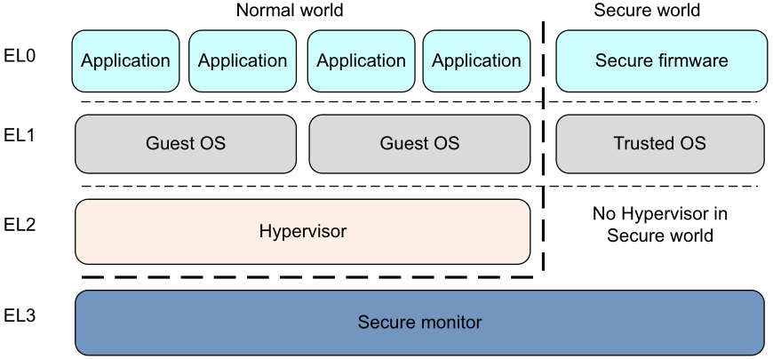
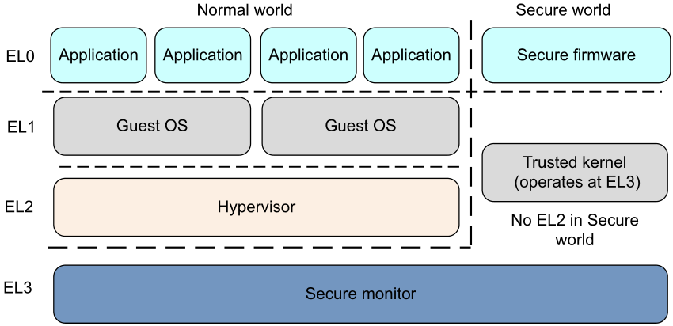
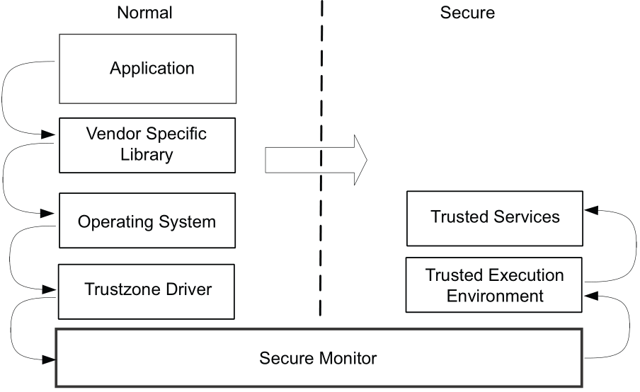

#+title: ARMv7/8 Guide
# #+subtitle: 
#+author: Soc Team
#+latex_class: org-latex-pdf 
#+toc: tables 
#+toc: listings 
#+latex: \clearpage\pagenumbering{arabic} 
#+latex: \AddToShipoutPicture{\BackgroundPicture} 
#+options: h:4 ^:{} 
#+startup: overview

* ARM Cortex Feature
** Cortex-M
|------------+---------+-----------+-------------+----------------------------------------------------------------------|
| Name       | Release | Pipe Line | Memory Arch | Description                                                          |
|------------+---------+-----------+-------------+----------------------------------------------------------------------|
|------------+---------+-----------+-------------+----------------------------------------------------------------------|
| Cortex-M3  |    2004 | 3 level   | Harvard     | 面向标准嵌入式市场的高性能低成本的ARM处理器                          |
| Cortex-M1  |    2007 | 3 level   | Harvard     | 专门面向FPGA中设计实现的ARM处理器                                    |
| Cortex-M0  |    2009 | 3 level   | Von.Neumann | 面积最小和能耗极低的ARM处理器                                        |
| Cortex-M4  |    2010 | 3 level   | Harvard     | 在M3基础上增加单精度浮点、DSP功能以满足数字信号控制市场              |
| Cortex-M0+ |    2012 | 2 level   | Von.Neumann | 在M0基础上进一步降低功耗                                             |
| Cortex-M7  |    2014 | 6 level   | Harvard     | 超标量设计，配备分支预测单元，不仅支持单精度浮点，还增加了硬件双精度 |
|            |         |           |             | 浮点能力，进一步提升计算性能和DSP处理能力，主要面向高端嵌入式市场    |
| Cortex-M23 |    2016 | 2 level   | Von.Neumann | 可简单理解为在Cortex-M0+的基础上增加了硬件整数除法器与TZ             |
| Cortex-M33 |    2016 | 3 level   | Harvard     | 可以简单理解为在Cortex-M4的基础上增加了TZ                            |
|------------+---------+-----------+-------------+----------------------------------------------------------------------|
- Von.Neumann：仅提供1个AHB-Lite存储器访问接口,供数据和指令存储器访问共享；
- Harvard: 提供分开的指令和数据存储器访问接口，

** Cortex-A
|------------+---------+------+-----------+------------+------------------+----------+------|
| Name       | Release | Size | Arch Type | Pipe Line  | Instruction Type | 乱序执行 | Core |
|------------+---------+------+-----------+------------+------------------+----------+------|
|------------+---------+------+-----------+------------+------------------+----------+------|
| Cortex-A8  |    2005 |   32 | ARMv7-A   | 13 Level   | 双发射(issue)    | 乱序执行 | 1    |
| Cortex-A9  |    2007 |   32 | ARMv7-A   | 8 Level    | 双发射           | 乱序执行 | 1~4  |
| Cortex-A5  |    2009 |   32 | ARMv7-A   | 8 Level    | 单发射           | 顺序执行 | 1~4  |
| Cortex-A15 |    2010 |   32 | ARMv7-A   | 15 Level   | 三发射           | 乱序执行 | 1~4  |
| Cortex-A7  |    2011 |   32 | ARMv7-A   | 8 Level    | 部分双发射       | 顺序执行 | 1~8  |
|------------+---------+------+-----------+------------+------------------+----------+------|
| Cortex-A53 |    2011 |   64 | ARMv8-A   | 可以理解为 | A7的64位版       |          |      |
| Cortex-A57 |    2010 |   64 | ARMv8-A   | 可以理解为 | A15的64位版      |          |      |
| Cortex-A12 |    2013 |   32 | ARMv7-A   | 可以理解为 | A9的性能提升     | 优化版本 |      |
| Cortex-A17 |    2014 |   32 | ARMv7-A   | 可以理解为 | Al2的性能提升    | 优化版本 |      |
|------------+---------+------+-----------+------------+------------------+----------+------|
| Cortex-A35 |    2015 |   64 | ARMv8-A   | 8 Level    | 部分双发射       | 顺序执行 | 1~8  |
|------------+---------+------+-----------+------------+------------------+----------+------|
| Cortex-A72 |    2015 |   64 | ARMv8-A   | 可以理解为 | A57的性能提升    | 优化版本 |      |
| Cortex-A73 |    2015 |   64 | ARMv8-A   | 可以理解为 | A72的性能提升    | 优化版本 |      |
| Cortex-A32 |    2016 |   32 | ARMv8-A   | 可以理解为 | A35的32位版      |          |      |
| Cortex-A55 |    2017 |   64 | ARMv8.2-A | 可以理解为 | A53的功耗提升    | 优化版本 |      |
| Cortex-A75 |    2017 |   64 | ARMv8.2-A | 可以理解为 | A72的性能提升    | 优化版本 |      |
|------------+---------+------+-----------+------------+------------------+----------+------|

* ARMv7 Processor Mode
#+caption: ARMv7 Processor Mode
#+attr_latex: :placement [H]
|---------+-------------------------------------------------------+-------------+-----------|
| Mode    | Function                                              | Security    | Privilege |
|---------+-------------------------------------------------------+-------------+-----------|
|---------+-------------------------------------------------------+-------------+-----------|
| User    | Most applications run                                 | Both        | PL0       |
| FIQ     | Entered on an FIQ interrupt exception                 | Both        | PL1       |
| IRQ     | Entered on an IRQ interrupt exception                 | Both        | PL1       |
| SVC     | Entered on reset or SVC instruction is executed       | Both        | PL1       |
| Abort   | Entered on a memory access exception                  | Both        | PL1       |
| Undef   | Entered when an undefined instruction executed        | Both        | PL1       |
| System  | Sharing the register view with User mode              | Both        | PL1       |
|---------+-------------------------------------------------------+-------------+-----------|
| Hyp     | HVC instruction is executed (visualization extension) | Non-secure  | PL2       |
| Monitor | SMC instruction is executed (TZ extension)            | Secure only | PL1       |
|---------+-------------------------------------------------------+-------------+-----------|
- Linux kernel & applications run in Non-secure state, showed in
  figure [[img-processpriv]];
- The Secure state is expected to be occupied by vendor-specific
  firmware, or security-sensitive software;
- The current processor mode and execution state is contained in CPSR;

#+caption: ARMv7 Processor Privilege levels
#+name: img-processpriv
#+attr_latex: :placement [H] :width 0.45\textwidth
[[./pic/img-processor-pri.png]]

** Registers
#+caption: ARMv7 Core Registers
#+attr_latex: :placement [H]
|----------+-----+----------+----------+----------+----------+----------+----------+----------|
| User     | Sys | FIQ      | IRQ      | ABT      | SVC      | UND      | MON      | HYP      |
|----------+-----+----------+----------+----------+----------+----------+----------+----------|
|----------+-----+----------+----------+----------+----------+----------+----------+----------|
| R0       | -   | -        | -        | -        | -        | -        | -        | -        |
| R1       | -   | -        | -        | -        | -        | -        | -        | -        |
| R2       | -   | -        | -        | -        | -        | -        | -        | -        |
| R3       | -   | -        | -        | -        | -        | -        | -        | -        |
| R4       | -   | -        | -        | -        | -        | -        | -        | -        |
| R5       | -   | -        | -        | -        | -        | -        | -        | -        |
| R6       | -   | -        | -        | -        | -        | -        | -        | -        |
| R7       | -   | -        | -        | -        | -        | -        | -        | -        |
| R8       | -   | R8_fiq   | -        | -        | -        | -        | -        | -        |
| R9       | -   | R9_fiq   | -        | -        | -        | -        | -        | -        |
| R10      | -   | R10_fiq  | -        | -        | -        | -        | -        | -        |
| R11      | -   | R11_fiq  | -        | -        | -        | -        | -        | -        |
| R12      | -   | R12_fiq  | -        | -        | -        | -        | -        | -        |
| R13 (sp) | -   | SP_fiq   | SP_svc   | SP_abt   | SP_svc   | SP_und   | SP_mon   | SP_hyp   |
| R14 (lr) | -   | LR_fiq   | LR_svc   | LR_abt   | LR_svc   | LR_und   | LR_mon   | -        |
| R15 (pc) | -   | -        | -        | -        | -        | -        | -        | -        |
| (A/C)PSR | -   | -        | -        | -        | -        | -        | -        | -        |
|----------+-----+----------+----------+----------+----------+----------+----------+----------|
|          |     | SPSR_fiq | SPSR_irq | SPSR_abt | SPSR_svc | SPSR_und | SPSR_mon | SPSR_hyp |
|          |     |          |          |          |          |          |          | ELR_hyp  |
|----------+-----+----------+----------+----------+----------+----------+----------+----------|
- CPSR: is used to store
  + N: Negative result from ALU.
  + Z: Zero result from ALU.
  + C: ALU operation Carry out.
  + V: ALU operation oVerflowed.
  + Q: cumulative saturation (also described as sticky).
  + J: indicates whether the core is in Jazelle state.
  + GE[3:0](>=): used by some SIMD instructions.
  + IT [7:2]: If-Then conditional execution of Thumb-2 instruction groups.
  + E: controls load/store endianness.
  + A: disables asynchronous aborts.
  + I: disables IRQ.
  + F: disables FIQ.
  + T: indicates whether the core is in Thumb state.
  + M[4:0]: specifies the processor mode (USR, SYS, FIQ, IRQ...)

** Coprocessor 15 Register
*** CP15 Processor Register
#+caption: CP15 Processor Register
#+attr_latex: :placement [H]
|------------------------------------------+------------------------------------------------------------------------|
| Register                                 | Description                                                            |
|------------------------------------------+------------------------------------------------------------------------|
|------------------------------------------+------------------------------------------------------------------------|
| Main ID Register (MIDR)                  | Gives identification information for the processor                     |
| Multiprocessor Affinity Register (MPIDR) | Provides a way to uniquely identify individual cores within a cluster. |
|------------------------------------------+------------------------------------------------------------------------|
*** CP15 c1 System Control registers
#+caption: CP15 System Control registers
#+attr_latex: :placement [H]
|---------------------------------------------+-----------------------------------------------------------|
| Register                                    | Description                                               |
|---------------------------------------------+-----------------------------------------------------------|
|---------------------------------------------+-----------------------------------------------------------|
| System Control Register (SCTLR)             | The main processor control register                       |
| Auxiliary Control Register (ACTLR)          | Additional control and configuration options.             |
| Coprocessor Access Control Register (CPACR) | Controls access to all coprocessors except CP14 and CP15. |
| Secure Configuration Register (SCR)         | Used by TrustZone                                         |
|---------------------------------------------+-----------------------------------------------------------|

- SCTLR:
  + TE: Thumb exception enable. This controls whether exceptions are
    taken in ARM or Thumb state.
  + NMFI: Non-maskable FIQ (NMFI) support.
  + EE(Exception endianness): This defines the value of the CPSR.E bit
    on entry to an exception.
  + U: Indicates use of the alignment model.
  + F: FIQ configuration enable.
  + V: This bit selects the base address of the exception vector table.
  + I: Instruction cache enable bit.
  + Z: Branch prediction enable bit.
  + C: CACHE enable bit.
  + A: Alignment check enable bit.
  + M: MMU enable bit.

*** CP15 c2 and c3, memory protection and control registers
#+caption: CP15 Memory Protection and Control Registers
#+attr_latex: :placement [H]
|-----------------------------------------------------+-------------------------------------------|
| Register                                            | Description                               |
|-----------------------------------------------------+-------------------------------------------|
|-----------------------------------------------------+-------------------------------------------|
| Translation Table Base Register 0 (TTBR0_EL1)       | Base address of level 1 translation table |
| Translation Table Base Register 1 (TTBR1_EL1)       | Base address of level 1 translation table |
| Translation Table Base Control Register (TTBCR_EL1) | Controls use of TTB0 and TTB1             |
|-----------------------------------------------------+-------------------------------------------|
- TTBR0_EL1和TTBR1_EL1负责翻译虚拟地址空间不同的地址段，负责的地址范围
  由另一个控制寄存器（TTBCR_EL1）决定。
- 操作系统中常见的配置为TTBRR0_EL1负责[0, 2^48)的地址映射,作为user空间，
  TTBRR1_EL1负责[2^48, 2^64)的地址映射，作为kernel空间。

在AArch64体系结构上，通常应用程序和操作系统使用不同的页表，不过由于硬
件提供了TTBR0_ELl和TTBRl_EL1两个不同的页表基地址寄存器可供它们分别使用，
在系统调用过程中不需妥切换页表，因此也就避免了TLB刷新约开销。x86-64体
系结构只提供一个页表基地址寄存器CR3，操作系统通常不伎用单独的页表，而
把自己映射到应用程序页表中的高地址部分,从而在系统调用过程中也不需要切
换页表，也能避免TLB刷新的升销。但是，操作系统在迸行应用程序切换的时候
（在AArch64体系结构上一般是切换TTBR0_EL1寄存器，在x86-64体系结构上是切
换CR3寄存器），都需要刷新TLB。 
*** CP15 c5 and c6, memory system fault registers
#+caption: CP15 Memory System Fault Registers
#+attr_latex: :placement [H]
|-------------------------------------------+-----------------------------------------------------------|
| Register                                  | Description                                               |
|-------------------------------------------+-----------------------------------------------------------|
|-------------------------------------------+-----------------------------------------------------------|
| Data Fault Status Register (DFSR)         | Gives status information about the last data fault        |
| Instruction Fault Status Register (IFSR)  | Gives status information about the last instruction fault |
| Data Fault Address Register (DFAR)        | Gives the virtual address of the access that              |
|                                           | caused the most recent precise data abort                 |
| Instruction Fault Address Register (IFAR) | Gives the virtual address of the access that              |
|                                           | caused the most recent precise prefetch abort             |
|-------------------------------------------+-----------------------------------------------------------|
*** CP15 c7, cache maintenance and other functions
#+caption: CP15 Cache Maintenance
#+attr_latex: :placement [H]
|--------------------------------------------------+-------------|
| Register                                         | Description |
|--------------------------------------------------+-------------|
|--------------------------------------------------+-------------|
| Cache and branch predictor maintenance functions |             |
| Data and instruction barrier operations          |             |
|--------------------------------------------------+-------------|
*** CP15 c8, TLB maintenance operations
*** CP15 c9, performance monitors
*** CP15 c12, Security Extensions registers
#+caption: CP15 Security Extensions Registers
#+attr_latex: :placement [H]
|----------------------------------------------+-----------------------------------------------------|
| Register                                     | Description                                         |
|----------------------------------------------+-----------------------------------------------------|
|----------------------------------------------+-----------------------------------------------------|
| Vector Base Address Register (VBAR)          | Provides the exception base address for exceptions  |
|                                              | that are not handled in Monitor mode.               |
| Monitor Vector Base Address Register (MVBAR) | Holds the exception base address for all exceptions |
|                                              | that are taken to Monitor mode.                     |
|----------------------------------------------+-----------------------------------------------------|
*** CP15 c13, process, context and thread ID registers
#+caption: CP15 Process, Context and Thread ID Registers
#+attr_latex: :placement [H]
|----------------------------------+-------------|
| Register                         | Description |
|----------------------------------+-------------|
|----------------------------------+-------------|
| Context ID Register (CONTEXTIDR) |             |
| Software thread ID registers     |             |
|----------------------------------+-------------|
*** CP15 c15, IMPLEMENTATION DEFINED registers
#+caption: CP15 IMPLEMENTATION DEFINED Registers
#+attr_latex: :placement [H]
|--------------------------------------------+-----------------------------------------|
| Register                                   | Description                             |
|--------------------------------------------+-----------------------------------------|
|--------------------------------------------+-----------------------------------------|
| Configuration Base Address Register (CBAR) | Provides a base address for the GIC and |
|                                            | Local timer type peripherals.           |
|--------------------------------------------+-----------------------------------------|
* ARMv7 Exception(Core)
** Exception mode
The processor modes are mapped onto the Exception levels.
#+caption: ARMv7 Exception Mode
#+attr_latex: :placement [H]
|-----------------------+------------+---------------------------|
| Exception             | Mode       | CPSR interrupt mask(auto) |
|-----------------------+------------+---------------------------|
|-----------------------+------------+---------------------------|
| Reset                 | Supervisor | F = 1; I = 1              |
| Supervisor Call       | Supervisor | I = 1                     |
|-----------------------+------------+---------------------------|
| Prefetch Abort        | Abort      | I = 1                     |
| Data Abort            | Abort      | I = 1                     |
|-----------------------+------------+---------------------------|
| UNDEFINED instruction | Undef      | I = 1                     |
| IRQ interrupt         | IRQ        | I = 1                     |
| FIQ interrupt         | FIQ        | F = 1; I = 1              |
|-----------------------+------------+---------------------------|
| Not used              | HYP        | -                         |
|-----------------------+------------+---------------------------|
- An exception cannot be taken to a lower Exception level.
- There is no exception handling at level EL0, exceptions must be
  handled at a higher Exception level.
- Returning from an exception can stay at the same Exception level or
  enter a lower Exception level. It cannot move to a higher Exception
  level.
- To change between execution states(32bit or 64bit) at the same
  Exception level, you have to switch to a higher Exception level then
  return to the original Exception level;
** Exception handling
When an exception occurs, the ARM core automatically does the following:
1. Copies the CPSR to the SPSR_<mode>, the banked register specific to
   the (non-user) mode of operation.(e.g. CPSR_EL0 -> SPSR_EL1);
2. Stores a return address in the Link Register (LR) of the new
   mode.(e.g. PC_EL0->ELR_EL1);
3. Modifies the CPSR mode bits to a mode associated with the exception
   type.
   - The other CPSR mode bits are set to values determined by bits in
     the CP15 System Control Register.
   - The T bit is set to the value given by the CP15 TE bit.
   - The J bit is cleared and the E bit (Endianness) is set to the
     value of the EE (Exception Endianness) bit.
4. Sets the PC to point to the relevant instruction from the exception
   vector table.(e.g. set PC by handler via VBAR_EL1);
5. Change SP to SP_<mode>(e.g. change SP from SP_EL0 to SP_EL1);
*** Reset
The following pseudocode describes how RESET exception is taken.
#+begin_src c -n 1
  TakeReset()
  {
      // Enter Supervisor mode and (if relevant) Secure state, and reset CP15. This affects
      // the banked versions and values of various registers accessed later in the code.
      // Also reset other system components.
      CPSR.M = ‘10011’; // Supervisor mode
      if HaveSecurityExt() then SCR.NS = ‘0’;

      ResetCP15Registers();
      ResetDebugRegisters();
      if HaveAdvSIMDorVFP() then FPEXC.EN = ‘0’; SUBARCHITECTURE_DEFINED further resetting;

      if HaveThumbEE() then TEECR.XED = ‘0’;

      if HaveJazelle() then JMCR.JE = ‘0’; SUBARCHITECTURE_DEFINED further resetting;

      // Further CPSR changes: all interrupts disabled, IT state reset, instruction set
      // and endianness according to the SCTLR values produced by the above call to
      // ResetCP15Registers().
      CPSR.I = ‘1’; CPSR.F = ‘1’; CPSR.A = ‘1’;
      CPSR.IT = ‘00000000’;
      CPSR.J = ‘0’; CPSR.T = SCTLR.TE; // TE=0: ARM, TE=1: Thumb
      CPSR.E = SCTLR.EE; // EE=0: little-endian, EE=1: big-endian
      // All registers, bits and fields not reset by the above pseudocode or by the
      // BranchTo() call below are UNKNOWN bitstrings after reset. In particular, the
      // return information registers R14_svc and SPSR_svc have UNKNOWN values, so that
      // it is impossible to return from a reset in an architecturally defined way.
      // Branch to Reset vector.
      BranchTo(ExcVectorBase() + 0);
  }
#+end_src
*** Undefined Instruction exception
The following pseudocode describes how this exception is taken.
#+begin_src c -n 1
  TakeUndefInstrException()
  {
      // Determine return information. SPSR is to be the current CPSR, and LR is to be the
      // current PC minus 2 for Thumb or 4 for ARM, to change the PC offsets of 4 or 8
      // respectively from the address of the current instruction into the required return
      // address offsets of 2 or 4 respectively.
      new_lr_value = if CPSR.T == ‘1’ then PC-2 else PC-4;

      new_spsr_value = CPSR;
      // Enter Undefined (‘11011’) mode, and ensure Secure state if initially in Monitor
      // (‘10110’) mode. This affects the banked versions of various registers accessed later
      // in the code.
      if CPSR.M == ‘10110’ then SCR.NS = ‘0’;

      CPSR.M = ‘11011’;
      // Write return information to registers, and make further CPSR changes: IRQs disabled,
      // IT state reset, instruction set and endianness to SCTLR-configured values.
      SPSR[] = new_spsr_value;
      R[14] = new_lr_value;
      CPSR.I = ‘1’;
      CPSR.IT = ‘00000000’;
      CPSR.J = ‘0’; CPSR.T = SCTLR.TE; // TE=0: ARM, TE=1: Thumb
      CPSR.E = SCTLR.EE; // EE=0: little-endian, EE=1: big-endian
      // Branch to Undefined Instruction vector.
      BranchTo(ExcVectorBase() + 4);
  }
#+end_src
*** SVC exception
The following pseudocode describes how SVC exception is taken
#+begin_src c -n 1
  TakeSVCException()
  {
      // Determine return information. SPSR is to be the current CPSR, after changing the IT[]
      // bits to give them the correct values for the following instruction, and LR is to be
      // the current PC minus 2 for Thumb or 4 for ARM, to change the PC offsets of 4 or 8
      // respectively from the address of the current instruction into the required address of
      // the next instruction (the SVC instruction having size 2 or 4 bytes respectively).
      ITAdvance();
      new_lr_value = if CPSR.T == ‘1’ then PC-2 else PC-4;
      new_spsr_value = CPSR;
      // Enter Supervisor (‘10011’) mode, and ensure Secure state if initially in Monitor
      // (‘10110’) mode. This affects the banked versions of various registers accessed later
      // in the code.
      if CPSR.M == ‘10110’ then SCR.NS = ‘0’;
      CPSR.M = ‘10011’;
      // Write return information to registers, and make further CPSR changes: IRQs disabled,
      // IT state reset, instruction set and endianness to SCTLR-configured values.
      SPSR[] = new_spsr_value;
      R[14] = new_lr_value;
      CPSR.I = ‘1’;
      CPSR.IT = ‘00000000’;
      CPSR.J = ‘0’; CPSR.T = SCTLR.TE; // TE=0: ARM, TE=1: Thumb
      CPSR.E = SCTLR.EE; // EE=0: little-endian, EE=1: big-endian
      // Branch to SVC vector.
      BranchTo(ExcVectorBase() + 8);
  }
#+end_src
*** Secure Monitor Call (SMC) exception
The following pseudocode describes how SMC exception is taken:
#+begin_src c -n 1 
  TakeSMCException()
  {
      // Determine return information. SPSR is to be the current CPSR, after changing the IT[]
      // bits to give them the correct values for the following instruction, and LR is to be
      // the current PC minus 0 for Thumb or 4 for ARM, to change the PC offsets of 4 or 8
      // respectively from the address of the current instruction into the required address of
      // the next instruction (with the SMC instruction always being 4 bytes in length).
      ITAdvance();
      new_lr_value = if CPSR.T == ‘1’ then PC else PC-4;
      new_spsr_value = CPSR;
      // Enter Monitor (‘10110’) mode, and ensure Secure state if initially in Monitor mode.
      // This affects the banked versions of various registers accessed later in the code.
      if CPSR.M == ‘10110’ then SCR.NS = ‘0’;
      CPSR.M = ‘10110’;
      // Write return information to registers, and make further CPSR changes: interrupts
      // disabled, IT state reset, instruction set and endianness to SCTLR-configured values.
      SPSR[] = new_spsr_value;
      R[14] = new_lr_value;
      CPSR.I = ‘1’; CPSR.F = ‘1’; CPSR.A = ‘1’;
      CPSR.IT = ‘00000000’;
      CPSR.J = ‘0’; CPSR.T = SCTLR.TE; // TE=0: ARM, TE=1: Thumb
      CPSR.E = SCTLR.EE; // EE=0: little-endian, EE=1: big-endian
      // Branch to SMC vector.
      BranchTo(MVBAR + 8);
  }
#+end_src
*** Prefetch Abort exception
The following pseudocode describes how this exception is taken.
#+begin_src c -n 1
  TakePrefetchAbortException()
  {
      // Determine return information. SPSR is to be the current CPSR, and LR is to be the
      // current PC minus 0 for Thumb or 4 for ARM, to change the PC offsets of 4 or 8
      // respectively from the address of the current instruction into the required address
      // of the current instruction plus 4.
      new_lr_value = if CPSR.T == ‘1’ then PC else PC-4;
      new_spsr_value = CPSR;
      // Determine whether this is an external abort to be trapped to Monitor mode.
      trap_to_monitor = HaveSecurityExt() && SCR.EA == ‘1’ && IsExternalAbort();
      // Enter Abort (‘10111’) or Monitor (‘10110’) mode, and ensure Secure state if
      // initially in Monitor mode. This affects the banked versions of various registers
      // accessed later in the code.
      if CPSR.M == ‘10110’ then SCR.NS = ‘0’;
      CPSR.M = if trap_to_monitor then ‘10110’ else ‘10111’;
      // Write return information to registers, and make further CPSR changes: IRQs disabled,
      // other interrupts disabled if appropriate, IT state reset, instruction set and
      // endianness to SCTLR-configured values.
      SPSR[] = new_spsr_value;
      R[14] = new_lr_value;
      CPSR.I = ‘1’;
      if trap_to_monitor then
      CPSR.F = ‘1’; CPSR.A = ‘1’;
      else
      if !HaveSecurityExt() || SCR.NS == ‘0’ || SCR.AW == ‘1’ then CPSR.A = ‘1’;
      CPSR.IT = ‘00000000’;
      CPSR.J = ‘0’; CPSR.T = SCTLR.TE; // TE=0: ARM, TE=1: Thumb
      CPSR.E = SCTLR.EE; // EE=0: little-endian, EE=1: big-endian
      // Branch to correct Prefetch Abort vector.
      if trap_to_monitor then
      BranchTo(MVBAR + 12);
      else
      BranchTo(ExcVectorBase() + 12);
  }
#+end_src
*** Data Abort exception
The following pseudocode describes how this exception is taken
#+begin_src c -n 1
  TakeDataAbortException()
  {
      // Determine return information. SPSR is to be the current CPSR, and LR is to be the
      // current PC plus 4 for Thumb or 0 for ARM, to change the PC offsets of 4 or 8
      // respectively from the address of the current instruction into the required address
      // of the current instruction plus 8. For an asynchronous abort, the PC and CPSR are
      // considered to have already moved on to their values for the instruction following
      // the instruction boundary at which the exception occurred.
      new_lr_value = if CPSR.T == ‘1’ then PC+4 else PC;
      new_spsr_value = CPSR;
      // Determine whether this is an external abort to be trapped to Monitor mode.
      trap_to_monitor = HaveSecurityExt() && SCR.EA == ‘1’ && IsExternalAbort();
      // Enter Abort (‘10111’) or Monitor (‘10110’) mode, and ensure Secure state if
      // initially in Monitor mode. This affects the banked versions of various registers
      // accessed later in the code.
      if CPSR.M == ‘10110’ then SCR.NS = ‘0’;
      CPSR.M = if trap_to_monitor then ‘10110’ else ‘10111’;
      // Write return information to registers, and make further CPSR changes: IRQs disabled,
      // other interrupts disabled if appropriate, IT state reset, instruction set and
      // endianness to SCTLR-configured values.
      SPSR[] = new_spsr_value;
      R[14] = new_lr_value;
      CPSR.I = ‘1’;
      if trap_to_monitor then
      CPSR.F = ‘1’; CPSR.A = ‘1’;
      else
      if !HaveSecurityExt() || SCR.NS == ‘0’ || SCR.AW == ‘1’ then CPSR.A = ‘1’;
      CPSR.IT = ‘00000000’;
      CPSR.J = ‘0’; CPSR.T = SCTLR.TE; // TE=0: ARM, TE=1: Thumb
      CPSR.E = SCTLR.EE; // EE=0: little-endian, EE=1: big-endian
      // Branch to correct Data Abort vector.
      if trap_to_monitor then
      BranchTo(MVBAR + 16);
      else
      BranchTo(ExcVectorBase() + 16);
  }
#+end_src 
*** IRQ Exception
The following pseudocode describes how this exception is taken
#+begin_src c -n 1
  TakeIRQException()
  {
      // Determine return information. SPSR is to be the current CPSR, and LR is to be the
      // current PC minus 0 for Thumb or 4 for ARM, to change the PC offsets of 4 or 8
      // respectively from the address of the current instruction into the required address
      // of the instruction boundary at which the interrupt occurred plus 4. For this
      // purpose, the PC and CPSR are considered to have already moved on to their values
      // for the instruction following that boundary.
      new_lr_value = if CPSR.T == ‘1’ then PC else PC-4;
      new_spsr_value = CPSR;
      // Determine whether IRQs are trapped to Monitor mode.
      trap_to_monitor = HaveSecurityExt() && SCR.IRQ == ‘1’;
      // Enter IRQ (‘10010’) or Monitor (‘10110’) mode, and ensure Secure state if initially
      // in Monitor mode. This affects the banked versions of various registers accessed
      // later in the code.
      if CPSR.M == ‘10110’ then SCR.NS = ‘0’;
      CPSR.M = if trap_to_monitor then ‘10110’ else ‘10010’;
      // Write return information to registers, and make further CPSR changes: IRQs disabled,
      // other interrupts disabled if appropriate, IT state reset, instruction set and
      // endianness to SCTLR-configured values.
      SPSR[] = new_spsr_value;
      R[14] = new_lr_value;
      CPSR.I = ‘1’;
      if trap_to_monitor then
      CPSR.F = ‘1’; CPSR.A = ‘1’;
      else
      if !HaveSecurityExt() || SCR.NS == ‘0’ || SCR.AW == ‘1’ then CPSR.A = ‘1’;
      CPSR.IT = ‘00000000’;
      CPSR.J = ‘0’; CPSR.T = SCTLR.TE; // TE=0: ARM, TE=1: Thumb
      CPSR.E = SCTLR.EE; // EE=0: little-endian, EE=1: big-endian
      // Branch to correct IRQ vector.
      if trap_to_monitor then
      BranchTo(MVBAR + 24);
      elsif SCTLR.VE == ‘1’ then
      IMPLEMENTATION_DEFINED branch to an IRQ vector;
      else
      BranchTo(ExcVectorBase() + 24);
  }
#+end_src 
*** FIQ Exception
#+begin_src c -n 1
  TakeFIQException()
  {
      // Determine return information. SPSR is to be the current CPSR, and LR is to be the
      // current PC minus 0 for Thumb or 4 for ARM, to change the PC offsets of 4 or 8
      // respectively from the address of the current instruction into the required address
      // of the instruction boundary at which the interrupt occurred plus 4. For this
      // purpose, the PC and CPSR are considered to have already moved on to their values
      // for the instruction following that boundary.
      new_lr_value = if CPSR.T == ‘1’ then PC else PC-4;
      new_spsr_value = CPSR;
      // Determine whether FIQs are trapped to Monitor mode.
      trap_to_monitor = HaveSecurityExt() && SCR.FIQ == ‘1’;
      // Enter FIQ (‘10001’) or Monitor (‘10110’) mode, and ensure Secure state if initially
      // in Monitor mode. This affects the banked versions of various registers accessed
      // later in the code.
      if CPSR.M == ‘10110’ then SCR.NS = ‘0’;
      CPSR.M = if trap_to_monitor then ‘10110’ else ‘10001’;
      // Write return information to registers, and make further CPSR changes: IRQs disabled,
      // other interrupts disabled if appropriate, IT state reset, instruction set and
      // endianness to SCTLR-configured values.
      SPSR[] = new_spsr_value;
      R[14] = new_lr_value;
      CPSR.I = ‘1’;
      if trap_to_monitor then
      CPSR.F = ‘1’; CPSR.A = ‘1’;
      else
      if !HaveSecurityExt() || SCR.NS == ‘0’ || SCR.FW == ‘1’ then CPSR.F = ‘1’;
      if !HaveSecurityExt() || SCR.NS == ‘0’ || SCR.AW == ‘1’ then CPSR.A = ‘1’;
      CPSR.IT = ‘00000000’;
      CPSR.J = ‘0’; CPSR.T = SCTLR.TE; // TE=0: ARM, TE=1: Thumb
      CPSR.E = SCTLR.EE; // EE=0: little-endian, EE=1: big-endian
      // Branch to correct FIQ vector.
      if trap_to_monitor then
      BranchTo(MVBAR + 28);
      elsif SCTLR.VE == ‘1’ then
      IMPLEMENTATION_DEFINED branch to an FIQ vector;
      else
      BranchTo(ExcVectorBase() + 28);
  }
#+end_src
** Exit from an exception handler
To return from an exception handler, two separate operations must take
place atomically with ERET instruction:
1. Restore the CPSR from the saved SPSR.
2. Set the PC to the return address offset
** Exception Instruction
- SVC: enables User mode programs to request an Operating System service.
- HVC: available if the Virtualization Extensions are implemented,
  enables the guest OS to request Hypervisor services.
- SMC: available if the Security Extensions are implemented, enables
  the Normal world to request Secure world services.
** Exception vector table
The situation is more complicated for cores with Security
Extensions. Here there are three vector tables, Non-secure, Secure and
Secure Monitor (CP15.VBAR). For cores with the Virtualization Extension there are
four, adding a Hypervisor vector table. For cores with an MMU, all
these vector addresses are virtual(CP15.MVBAR).
** Exception priority
When exceptions occur simultaneously, each exception is handled in
turn before returning to the original application.

All exceptions disable IRQ, only FIQ and reset disable FIQ. This is
done by the core automatically setting the CPSR I (IRQ) and F (FIQ)
bits.
** Interrupt handling
1. An IRQ exception is raised by external hardware. The core performs
   several steps automatically. The contents of the PC in the current
   execution mode are stored in LR_IRQ. The CPSR register is copied to
   SPSR_IRQ. The CPSR content is updated so that the mode bits
   reflects the IRQ mode, and the I bit is set to mask additional
   IRQs. The PC is set to the IRQ entry in the vector table.
2. The instruction at the IRQ entry in the vector table (a branch to
   the interrupt handler) is executed.
3. The interrupt handler saves the context of the interrupted program,
   that is, it pushes onto the stack any registers that will be
   corrupted by the handler. These registers will be popped from stack
   when the handler finishes execution.
4. The interrupt handler determines which interrupt source must be
   processed and calls the appropriate device driver.   
5. Prepare the core to switch to previous execution state by copying
   the SPSR_IRQ to CPSR, and restoring the context saved earlier, and
   finally the PC is restored from LR_IRQ.
*** Interrupt type   
- Software Generated Interrupt (SGI): This is generated explicitly by
  software by writing to a dedicated distributor register, the
  Software Generated Interrupt Register (ICDSGIR). It is most commonly
  used for inter-core communication. SGIs can be targeted at all, or a
  selected group of cores in the system. Interrupt numbers 0-15 are
  reserved for this. The exact interrupt number used for communication
  is at the discretion of software.
- Private Peripheral Interrupt (PPI): This is generated by a
  peripheral that is private to an individual core. Interrupt numbers
  16-31 are reserved for this. These identify interrupt sources
  private to the core, and is independent of the same source on
  another core, for example, per-core timer.
- Shared Peripheral Interrupt (SPI): This is generated by a peripheral
  that the Interrupt Controller can route to more than one
  core. Interrupt numbers 32-1020 are used for this. SPIs are used to
  signal interrupts from various peripherals accessible across the
  whole the system.
  
* ARMv8 Processor Mode
** Execution state
For EL2 and EL1, the execution state is controlled by the SCR_EL3.RW
and HCR_EL2.RW bits. The SCR_EL3.RW bit is programmed in EL3 (Secure
monitor) and sets the state of the next lower level (EL2). The
HCR_EL2.RW bit may be programmed in EL2 or EL3, and sets the state of
EL1/0.
- AArch32
- AArch64
** Exception level
Exception level can be controlled by SPSR when return from other
exception level(SPSR->PSTATE).
- EL0
- EL1
- EL2
- EL3: On powerup and on reset, the processor enters EL3
** Instruction set
- A32 instruction set: previously called ARM instruction set,
  word-aligned A32 instructions.
- T32 instruction set：previously called Thumb instruction set,The
  processor executes 16-bit and 32-bit, halfword-aligned T32
  instructions.
- A64 instruction set
** Registers
*** General-purpose Registers
The AArch64 execution state provides 31 general-purpose
registers(64bit: X/W0~X/W30) accessible at all times and in all
Exception levels, register usage is showed in table [[tbl-reg-abi]].
- Argument registers: X0-X7,ARMv7 only supports 4 parameters passed by
  register(R0~R3) when function call, ARMv8 supports 8
  parameters(X/W0~X/W7);
- Caller-saved temporary registers: X9-X15(调用者负责保存和恢复的寄存
  器)；
- Callee-saved registers: X19-X29(被调用者负责保存和恢复的寄存器)；
- X8: is the indirect result register. This is used to pass the address
  location of an indirect result, for example, where a function
  returns a large structure.
- X16 and X17: are IP0 and IP1, intra-procedure-call temporary
  registers. These can be used by call veneers and similar code, or as
  temporary registers for intermediate values between subroutine
  calls. They are corruptible by a function. Veneers are small pieces
  of code which are automatically inserted by the linker, for example
  when the branch target is out of range of the branch instruction.
- X18: is the platform register and is reserved for the use of
  platform ABIs. This is an additional temporary register on platforms
  that don't assign a special meaning to it.
- X29: is used as Frame Pointer(FP) register to save the stack top
  address when call function
- X30: is used as LP register (in conjunction with the RET
  instruction) to return from subroutines. Its value is updated with
  the address of the instruction to return back to, whenever we
  execute a branch with link instruction (BL or BLR.)

#+caption: Register used in the ABI
#+name: tbl-reg-abi
#+attr_latex: :placement [H]
|----------+--------------------------------|
| Register | Description                    |
|----------+--------------------------------|
|----------+--------------------------------|
| X0~X7    | Parameter and result registers |
|----------+--------------------------------|
| X8(XR)   | indirect location register     |
|----------+--------------------------------|
| X9~X15   | Caller saved registers         |
|----------+--------------------------------|
| X16(IP0) | intra-procedure call scratch   |
| X17(IP1) | registers                      |
|----------+--------------------------------|
| X18(PR)  | Platform register              |
|----------+--------------------------------|
| X19~X28  | Callee saved register          |
|----------+--------------------------------|
| X29(FP)  | Frame pointer                  |
|----------+--------------------------------|
| X30(LR)  | procedure link register        |
|----------+--------------------------------|

- V0-V7: are used to pass argument values into a subroutine and to
  return result values from a function. They may also be used to hold
  intermediate values within a routine (but, in general, only between
  subroutine calls).
- V8-V15: must be preserved by a callee across subroutine calls.Only
  the bottom 64 bits of each value stored in V8-V15 need to be
  preserved.
- V16-V31 do not need to be preserved (or should be preserved by the
  caller).
  

#+caption: SIMD and floating-point registers in the ABI
#+name: tbl-vreg-abi
#+attr_latex: :placement [H]
|----------+--------------------------------------------------------|
| Register | Description                                            |
|----------+--------------------------------------------------------|
|----------+--------------------------------------------------------|
| V0~V7    | Parameter and result registers                         |
|----------+--------------------------------------------------------|
| V8~V15   | Callee preserve lower 64 bits across subrountine calls |
|----------+--------------------------------------------------------|
| V16~V31  | Caller preserve                                        |
|----------+--------------------------------------------------------|

*** Special Function Registers
#+caption:  ARMv8 Special Registers in AArch64
#+name: tbl-sfr64
#+attr_latex: :placement [H]
|-------+------------+-----------------------|
| Name  | Size       | Description           |
|-------+------------+-----------------------|
|-------+------------+-----------------------|
| X/WZR | 64/32 bits | Zero register         |
| W/SP  | 32/64 bits | Current stack pointer |
| PC    | 64 bits    | Program counter       |
|-------+------------+-----------------------|
- The SP cannot be referenced by most instructions except some
  instructions like ADD, SUB;
- Removing direct access to the PC in ARMv8 makes return prediction
  easier and simplifies the ABI specification;

#+caption: ARMv8 Special Registers by Exception level
#+name: tbl-sfrexception
#+attr_latex: :placement [H]
|------+--------+----------+----------+----------|
| Reg  | EL0    | EL1      | EL2      | EL3      |
|------+--------+----------+----------+----------|
|------+--------+----------+----------+----------|
| SP   | SP_EL0 | SP_EL1   | SP_EL2   | SP_EL3   |
| ELR  |        | ELR_EL1  | ELR_EL2  | ELR_EL3  |
| SPSR |        | SPSR_EL1 | SPSR_EL2 | SPSR_EL3 |
|------+--------+----------+----------+----------|
- When in AArch64 at an Exception level other than EL0, the processor
  can use either:
  + A dedicated 64-bit stack pointer associated with that Exception
    level (SP_ELn).
  + The stack pointer associated with EL0 (SP_EL0).
- The SPSR holds the value of PSTATE before taking an exception and is
  used to restore the value of PSTATE when executing an exception
  return.
*** Processor State(PSTATE)
In AArch64, the components of the traditional CPSR are supplied as
fields that can be made accessible independently. These are referred
to collectively as Processor State (PSTATE).
- SPSR.N: Negative result (N flag).
- SPSR.Z: Zero result (Z) flag.
- SPSR.C: Carry out (C flag).
- SPSR.V: Overflow (V flag).
- SPSR.SS: Indicates whether software step was enabled when an
  exception was taken.
- SPSR.IL: Illegal Execution State bit. Shows the value of PSTATE.IL
  immediately before the exception was taken.
- SPSR.D: Process state Debug mask. Indicates whether debug exceptions
  from watchpoint, breakpoint, and software step debug events that are
  targeted at the Exception level the exception occurred in were
  masked or not.
- SPSR.A: SError (System Error) mask bit.
- SPSR.I: IRQ mask bit.
- SPSR.F: FIQ mask bit.
- SPSR.M[4]: Execution state that the exception was taken from. A
  value of 0 indicates AArch64.
- SPSR.M[3:0]: Mode or Exception level that an exception was taken
  from.
- PSTATE.nRW: corresponding to SPSR.M[4];
- PSTATE.EL: exception level, no corresponding in SPSR;
*** System Registers
#+caption: ARMv8 System Registers
#+attr_latex: :placement [H]
|---------------+------------------------------------------------------+-----------------------|
| Name          | Description                                          |   Allowed values of n |
|---------------+------------------------------------------------------+-----------------------|
|---------------+------------------------------------------------------+-----------------------|
| ACTLR_ELn     | Controls processor-specific features                 |               1, 2, 3 |
| CCSIDR_ELn    | Current Cache Size ID Register                       |                     1 |
| CLIDR_ELn     | Cache Level ID Register                              |                 1,2,3 |
| CNTFRQ_ELn    | Reports the frequency of the system timer            |                     0 |
|---------------+------------------------------------------------------+-----------------------|
| CNTPCT_ELn    | Counter-timer Physical Count Register,               |                     0 |
|               | Holds the 64-bit current count value                 |                       |
|---------------+------------------------------------------------------+-----------------------|
| CNTKCTL_ELn   | Counter-timer Kernel Control Register,               |                     1 |
|               | Controls the generation of an event stream from the  |                       |
|               | virtual counter                                      |                       |
|---------------+------------------------------------------------------+-----------------------|
| CNTP_CVAL_ELn | Holds the compare value for the EL1 physical timer   |                     0 |
| CPACR_ELn     | Controls access to Trace, floating-point, and NEON   |                     1 |
| CSSELR_ELn    | Cache Size Selection Register                        |                     1 |
|---------------+------------------------------------------------------+-----------------------|
| CNTP_CTL_ELn  | Counter-timer Physical Control Register              |                     0 |
|               | Control register for the EL1 physical timer          |                       |
|---------------+------------------------------------------------------+-----------------------|
| CTR_ELn       | Cache Type Register                                  |                     0 |
| DCZID_ELn     | Data Cache Zero ID Register                          |                     0 |
| ELR_ELn       | Exception Link Register                              |                 1,2,3 |
| ESR_ELn       | Exception Syndrome Register                          |                 1,2,3 |
|---------------+------------------------------------------------------+-----------------------|
| FAR_ELn       | Fault Address Register                               |                 1,2,3 |
|               | Holds the virtual faulting address                   |                       |
|---------------+------------------------------------------------------+-----------------------|
| FPCR          | Floating-point Control Register(FPSCR in AArch32)    |                     - |
| FPSR          | Floating-point status Register(FPSCR in AArch32)     |                     - |
| HCR_ELn       | Hypervisor Configuration Register                    |                     2 |
| MAIR_ELn      | Memory Attribute Indirection Register                |               1, 2, 3 |
|---------------+------------------------------------------------------+-----------------------|
| MIDR_ELn      | Main ID Register                                     |                     1 |
|               | The type of processor the code is running on         |                       |
|---------------+------------------------------------------------------+-----------------------|
| MPIDR_ELn     | Multiprocessor Affinity Register                     |                     1 |
|               | The processor and cluster IDs, in multi-core systems |                       |
|---------------+------------------------------------------------------+-----------------------|
| SCR_ELn       | Secure Configuration Register                        |                     3 |
|               | Controls Secure state and exceptions to EL3          |                       |
|---------------+------------------------------------------------------+-----------------------|
| SCTLR_ELn     | System Control Register(MMU,Cache...)                |               0,1,2,3 |
| SPSR_ELn      | Saved Program Status Register                        | ABT/FIQ/IRQ/UND,1,2,3 |
| TCR_ELn       | Translation Control Register                         |               1, 2, 3 |
| TPIDR_ELn     | User Read/Write Thread ID Register                   |            0, 1, 2, 3 |
| TPIDRRO_ELn   | User Read-Only Thread ID Register                    |                     0 |
| TTBR0_ELn     | Translation Table Base Register 0                    |               1, 2, 3 |
| TTBR1_ELn     | Translation Table Base Register 1                    |                     1 |
| VBAR_ELn      | Vector Based Address Register                        |               1, 2, 3 |
| VTCR_ELn      | Virtualization Translation Control Register          |                     2 |
| VTTBR_ELn     | VirtualizationTranslation TableBase Register         |                     2 |
|---------------+------------------------------------------------------+-----------------------|

- SCTLR_ELn
  + UCI: (only EL1),1 enables EL0 access in AArch64 for DC CVAU, DC
    CIVAC, DC,CVAC,IC,IVAU instructions
  + EE: Exception endianness.
  + EOE: Endianness of explicit data accesses at EL0.
  + WXN: Write permission implies XN (eXecute Never).
    1. L: Regions with write permission are not forced to XN.
    2. H: Regions with write permission are forced to XN.
  + nTWE: Not trap WFE. 1 means that WFE instructions are executed as normal.
  + nTWI: Not trap WFI. 1 means that WFI instructions are executed as normal.
  + UCT: When set, enables EL0 access in AArch64 to the CTR_EL0 register.
  + DZE: Access to DC ZVA instruction at EL0. 1 means Execution allowed.
  + I: Instruction cache enable bit for instruction caches at EL0 and EL1.
  + UMA: User Mask Access. Controls access to interrupt masks from EL0
  + SED: SETEND Disable. Disables SETEND instructions at EL0 using AArch32.
  + ITD: IT instruction Disable.
  + CP15BEN: enable bit for the AArch32 CP15 DMB, DSB, ISB barrier operations.
  + SA0: Stack Alignment Check Enable for EL0.
  + SA: Stack Alignment Check Enable.
  + C: Data cache enable.
  + A: Alignment check enable bit.
  + M: Enable the MMU.

** Architecture Extension
All of the following extensions is optional.
- Advanced SIMD
- Floating-point extension
- Cryptography extension
* ARMv8 Exception
** Synchronous exceptions 
- Instruction aborts from the MMU: For example, by reading an
  instruction from a memory location marked as Execute Never.
- Data Aborts from the MMU: For example, Permission failure or
  alignment checking.
- SP and PC alignment checking.
- Synchronous external aborts: For example, an abort when reading
  translation table.
- Unallocated instructions.
  + An instruction opcode that is not allocated.
  + An instruction that requires a higher level of privilege than the
    current Exception level.
  + An instruction that has been disabled.
  + Any instruction when the PSTATE.IL field is set.
- Debug exceptions.
- Service Calls (SVCs, SMCs and HVCs)
** Exception Level
*** AArch64
#+caption: ARMv8 Exception Level in AArch64
#+attr_latex: :placement [H] :width 0.6\textwidth

- No EL2 in secure world;
- Guest OS: such kernels include Linux or Windows running in
  Non-secure EL1;
- Hypervisor: only in Non-secure world;
- Secure firmware: this firmware must be the first thing that runs at
  boot time. It provides several services, including platform
  initialization, the installation of the trusted OS, and routing of
  Secure monitor calls;
- Trust OS: provides Secure services to the Normal world and provides
  a runtime environment for executing Secure or trusted applications;
- Code at EL3 cannot take an exception to a higher exception level, so
  cannot change execution state, except by going through a reset.
- If, when taking an exception or returning from an exception, the
  Exception level remains the same, the execution state cannot change.
- OS running in AArch64 can host both AArch32 and AArch64
  applications. Similarly, an AArch64 hypervisor can host both AArch32
  and AArch64 guest operating systems. However, a 32-bit operating
  system cannot host a 64-bit application and a 32-bit hypervisor
  cannot host a 64-bit guest operating system.
*** AArch32
#+caption: ARMv8 Exception Level in AArch32
#+attr_latex: :placement [H] :width 0.6\textwidth

- In AArch32 state, Trusted OS software executes in Secure EL3, and in
  AArch64 state it primarily executes in Secure EL1;
** Exception Action
*** Exception handling
When an event which causes an exception occurs, the processor hardware
automatically performs certain actions. 
- The SPSR_ELn is updated to store the PSTATE information required to
   correctly return at the end of the exception.
- PSTATE is updated to reflect the new processor status.
- The return address to be used at the end of the exception is stored
  in ELR_ELn.
- ESR_ELn is also updated with a value which indicates the cause of
  the exception.(only synchronous exception and SError), Exception
  class is showed in table [[tbl-excres]]
- FAR_ELn:The Fault Address Register holds the faulting virtual
  address for all synchronous instruction and Data Aborts and
  alignment faults.

*** Exception exit
The processor has to be told when to return from an exception by the
ERET instruction.
1. This restores the pre-exception PSTATE from SPSR_ELn;
2. Returns program execution back to the original location by
   restoring the PC from ELR_ELn.
** Vector Table
The base address is given by VBAR_EL1/2/3 and then each entry has a
defined offset from this base address. Each table has 16 entries, with
each entry being 128 bytes (32 instructions) in size. The table
effectively consists of 4 sets of 4 entries.Which entry is used
depends upon a number of factors:
- The type of exception (SError, FIQ, IRQ or Synchronous);
- If the exception is being taken at the same Exception level, the
  Stack Pointer to be used (SP0 or SPx);
- If the exception is being taken at a lower Exception level, the
  execution state of the next lower level (AArch64 or AArch32);

#+caption: ARMv8 Vector Table
#+attr_latex: :placement [H]
|------------------+----------------+------------------------|
| Address          | Exception type | Description            |
|------------------+----------------+------------------------|
|------------------+----------------+------------------------|
| VBAR_ELn + 0x000 | Synchronous    | Current EL with SP0    |
| + 0x080          | IRQ/vIRQ       |                        |
| + 0x100          | FIQ/vFIQ       |                        |
| + 0x180          | SError/vSError |                        |
|------------------+----------------+------------------------|
| + 0x200          | Synchronous    | Current EL with SPx    |
| + 0x280          | IRQ/vIRQ       |                        |
| + 0x300          | FIQ/vFIQ       |                        |
| + 0x380          | SError/vSError |                        |
|------------------+----------------+------------------------|
| + 0x400          | Synchronous    | Lower EL using AArch64 |
| + 0x480          | IRQ/vIRQ       |                        |
| + 0x500          | FIQ/vFIQ       |                        |
| + 0x580          | SError/vSError |                        |
|------------------+----------------+------------------------|
| + 0x600          | Synchronous    | Lower EL using AArch32 |
| + 0x680          | IRQ/vIRQ       |                        |
| + 0x700          | FIQ/vFIQ       |                        |
| + 0x780          | SError/vSError |                        |
|------------------+----------------+------------------------|
- 如果发生异常并不会导致EL切换，并且使用的是SP_EL0，那么使用第一组向量
  表。
- 如果发生异常并不会导致EL切换，并且使用的是SP_EL1/2/3，那么使用第二组
  向量表。
- 如果发生异常并导致EL切换，并且比目的EL低一级的EL运行在AArch64模式，
  那使用第三组向量表。
- 如果发生异常并导致EL切换，并且比目的EL低一级的EL运行在AArch32模式，
  那么使用第三组向量表。

* Security(Trust Zone)
#+caption: Interaction with TrustZone
#+attr_latex: :placement [H] :width 0.6\textwidth

- TZ Driver will use SMC instruction to enter into secure world.
- Data Share: The Secure world can use the NS-bit in its translation
  table descriptors to ensure that it used non-secure accesses to read
  the data.
  
  
** TF-A
* Virtualization
* Consumption
** WFE&SEV
*** WFE wake-up events
The following events are WFE wake-up events:
- the execution of an SEV instruction on any processor in the
  multiprocessor system
- an IRQ/FIQ interrupt, unless masked by the CPSR.I/CPSR.F bit
- an asynchronous abort, unless masked by the CPSR.A bit
- a debug event, if invasive debug is enabled and the debug event is
  permitted.
*** Event Register
The Event Register is a single bit register for each processor. When
set, an event register indicates that an event has occurred, since the
register was last cleared, that(event register=1) might prevent the
processor needing to suspend operation on issuing a WFE instruction.
- The Event Register is set by any WFE wake-up event or by the
  execution of an exception return instruction.
- The Event Register is cleared only by a Wait For Event instruction.
- Cannot read or write the value of the Event Register directly.
*** WFE
The action of the WFE instruction depends on the state of the Event
Register:
- If the Event Register is 1, the instruction clears the register
  and returns immediately. Normally, if this happens the processor
  makes another attempt to claim the lock.
- If the Event Register is 0 the processor can suspend execution and
  enter a low-power state. It can remain in that state until the
  processor detects a WFE wake-up event or a reset. When the processor
  detects a WFE wake-up event, the WFE instruction completes.
** WFI
*** WFI wake-up events
- an IRQ/FIQ interrupt, regardless of the value of the CPSR.I/CPSR.F bit
- an asynchronous abort, regardless of the value of the CPSR.A bit
- a debug event, when invasive debug is enabled and the debug event is
  permitted.
  
* BootROM(BIOS/UEFI)
Boot task
1. Reset Handler
2. In a multi-core system, enable non-primary cores to sleep
3. Initialize exception vectors
4. Initialize the memory system, including the MMU.
5. Initialize core mode stacks and registers(each mode).
6. Initialize any critical I/O devices.
7. Perform any necessary initialization of NEON or VFP.
8. Enable interrupts.
9. Change core mode or state.
10. Handle any set-up required for the Secure world
11. Call the main() application.
** Booting SMP System
Initialization of the external system might have to be synchronized
between cores. Typically,only one of the cores in the system has to
run code that initializes the memory system and
peripherals. Similarly, the SMP operating system initialization
typically runs on only one core(primary core). When the system is
fully booted, the remaining cores are brought online and this
distinction between the primary core and the others (secondary cores)
is lost.

If all of the cores come out of reset at the same time, they will
normally all start executing from the same reset vector. The boot code
will then read the cluster ID to determine which core is the
primary. The primary core will perform the initialization and then
signal to the secondary ones that everything is ready. An alternative
method is to hold the secondary cores in reset while the primary core
does the initialization. This requires hardware support to co-ordinate
the reset.
** Booting AMP System
In an AMP system, the bootloader code will determine the suitable
start address for the individual cores, based on their cluster ID (as
each core will be running different code). Care might be required to
ensure correct boot order in the case where there are dependencies
between the various applications running on different cores.
* Bootloader First-stage(Uboot/Apex/Blob/Bootldr/Redboot)
BootROM launches the bootloader (for example U-Boot). This initializes
main memory and copies the compressed Linux kernel image into main
memory (from a flash device,memory on a board, MMC, host PC or
elsewhere).

The bootloader passes certain initialization parameters to the
kernel. The Linux kernel then decompresses itself and initializes its
data structures and running user processes, before starting the
command shell environment.

This performs the basic tasks required for the kernel to boot:
1. Initializing the memory system and peripherals.
2. Loading the kernel image to an appropriate location in memory (and
   possibly also an initial RAM disk).
3. Generate the boot parameters to be passed to the kernel (including
   machine type).
4. Set up a console (video or serial) for the kernel.
5. Enter the (linux)kernel.
* Bootloader Second-stage(GRUB)
* OS Kernel(Linux)
The kernel code is position independent and can be located anywhere in
memory, Kernel start-up code:
1. IRQ interrupts are disabled with local_irq_disable(), while
   lock_kernel() is used to stop FIQ interrupts from interrupting the
   kernel. It initializes the tick control, memory system and
   architecture-specific subsystems and deals with the command line
   options passed by the bootloader.
2. Stacks are set up and the Linux scheduler is initialized.
3. The various memory areas are set-up and pages allocated.
4. The interrupt and exception table and handlers are setup, along with the GIC.
5. The system timer is setup and at this point IRQs are
   enabled. Additional memory system initialization occurs and then a
   value called BogoMips is used to calibrate the core clock speed.
6. Internal components of the kernel are set up, including the
   filesystem and the initialization process, followed by the thread
   daemon that creates kernel threads.
7. The kernel is unlocked (FIQ enabled) and the scheduler started.
8. The function do_basic_setup() is called to initialize drivers,
   sysctl, work queues and network sockets. At this point, the switch
   to User mode is performed.
   
* Toolchain
** GNU Toolchain
*** Profiling Tool
- GProf: GProf is a GNU tool that provides an easy way to profile your
  C/C++ application and find the locations that require work.
- OProfile: OProfile is a whole system profiling tool that runs on
  Linux and includes the kernel in its metrics.
** ARM Compiler Toolchain
*** Profiling Tool
- DS-5 Streamline: DS-5 Streamline is a graphical performance analysis
  tool that can be used to analyze the performance of an Linux or
  Android system.

* Debug&Trace
- Software breakpoint: BKPT;
- Hardware breakpoint: 4 comparators;
** DS-5 debug and trace

* Performance Tool
Through the CP15 Performance Monitoring Unit(PMU) registers and TRM.

- Ftrace: Ftrace is an increasingly widely used trace tool on
  Linux. It provides visualization of the flow within the kernel by
  tracing each function call.
  
* IDE
** ARM DS-5
ARM DS-5 is a professional software development solution for Linux,
Android and bare-metal embedded systems running on on ARM
processor-based hardware platforms. DS-5 covers all the stages in
development, from boot code and kernel porting to application
debug. ARM DS-5 includes the following components
- Eclipse-based IDE
- DS-5 Compilation Tools. Both GCC and the ARM Compiler are provided
- DS-5 Debugger: support debug target, enables debugging of bare-metal
  applications, Linux or Android kernels, Linux or Android
  applications and Linux or Android kernel modules
- DS-5 Streamline: a system-wide software profiling and performance
  analysis tool for ARM processor based Linux and Android platforms.
** IAR
** VSCode
** CMake
* Bus Interconnect                                                 :noexport:
总线拓扑类型
- Bus
- Point to Point connection
- Crossbar
- Ring
- Tree
- Omega
- Hypercube
- Mesh
- Torus
- Butterfly
  

ARM总线类型
- NIC：CrossBar类型，特点是全互联Switch，容量高，Latency小，并发性好；
  缺点是扩展性差，适用于输入输出数目小的情况，不支持一致性。
- NOC：Network on Chip，Mesh类型，特点是可扩展性好，缺点是并行性差，结
  构复杂，需要路由协议。适用于连接非常多个处理单元的情况，支持一致性。
- NIU(BIU)：Bus Interface Unit，用于连接网络节点和处理单元，非必须，如
  果两个协议一致，就不需要这个。
- CCI：采用CrossBar结构，是保证多核单元之间Cache内容一致性的互联结构，
  支一致性；
- CCN：Ring类型，通过固定交叉点连成一个环，延迟大，频率高，支持一致性；
- CMN：Mesh结构，通过固定交叉点形成MxN网络

总线应用方向
- 面向单核系统：有APB协议，采用总线(Bus)结构，用于低速外设；AHB/AXI协
  议，采用总线结构，用于高速外设连接
- 面向多核系统：有
  + NIC
  + NOC
  + CCI
  + CCN
  + CMN
- 众核系统：采用多Die扩展的技术路线，Die内IP互联仍然沿用多核时代的互联
  技术，Die间互联则通过在物理层，接口层，协议层的一系列标准实现
  + 物理层：基板封装技术(MCM)
    1. SerDes
    2. HBM：硅中介层技术；
    3. EMIB：嵌入式多芯互联桥技术Embed Multi-Die Interconnect Bridge；
    4. AIB：advanced interface bus
  + 接口层：
    1. XSR、USR
    2. OpenHBI
  + 通信层
  + 协议层
    1. CXL：Compute Express Link，计算表示连接协议；
    2. CCIX：Cache Coherent Interconnect for Accelerator
    3. CMN

** CCI500
ARM CoreLink technical, Cache Coherent Interconnect(CCI)，解决多Master
之间Cache一致性的互联总线技术，大体上，是某个Master需要更新某个数据时，
传到总线上的动作会被其他Master上的Cache监听到(Snoop)，从而更新自己的
Cache，从而使得多个Master的内存视角都一致。
** NIC400
CoreLink NIC-400, Network Inter Connect，网络互联，是CrossBar结构的总
线互联。一般用在主从设备较少的情况下，这样效率很高，1~2个时钟周期可以
到达从设备。
** NOC
Network on Chip，Mesh类型

