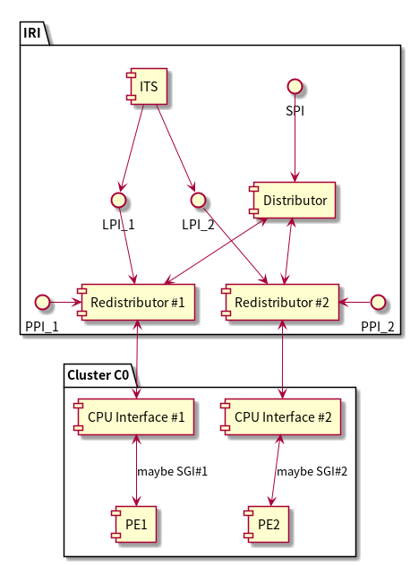
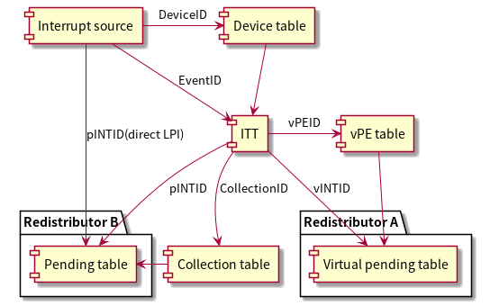
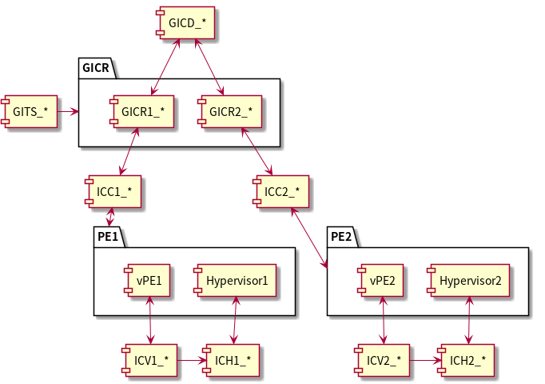

#+title: GIC
# #+subtitle: 
#+author: Joe
#+latex_class: org-latex-pdf 
#+toc: tables 
#+toc: listings 
#+latex: \clearpage\pagenumbering{arabic} 
#+latex: \AddToShipoutPicture{\BackgroundPicture} 
#+options: h:4 ^:{} 
#+startup: overview

* GIC
GIC经历了多个版本的演进：v2、v3、v4；
#+caption: GICv2&GICv3对比
#+name: tbl-gicv23
#+attr_latex: :placement [H] :width 0.6\textwidth
|---------+---------------------+-------------------------+---------------------|
| 特性     | GICv2（GIC-400）     | GICv3（GIC-500/600）     | GICv4               |
|---------+---------------------+-------------------------+---------------------|
|---------+---------------------+-------------------------+---------------------|
| 发布时间 | 2011                | 2014                    | 2016                |
| 支持架构 | ARMv7-A             | ARMv8-A及以上            | ARMv8.1及以上        |
| 虚拟化   | 软件模拟，支持有限   | 硬件虚拟化(GICv3.1)      | 增强虚拟化(直接注入) |
| 中断数量 | 最多1020个           | 最多1020个               | 最多1020个（可扩展） |
| 安全性   | 不支持安全隔离       | 支持安全隔离             | 增强安全隔离         |
| 功能性能 | 性能一般延迟高       | 更低延迟支持大规模系统    | 最低延迟             |
| CPU接口  | GICC,每个CPU独立MMIO | RD,一组RD服务多个CPU     |                     |
| 中断路由 | CPU掩码(最多8核)     | 精准CPU编号,支持超多核心  |                     |
| 消息中断 | 不支持               | 支持ITS,PCIe/MSI消息中断 |                     |
| 架构     | 32位寄存器为主       | 原生适配AArch64          | 原生适配AArch64      |
| DTS     | arm,gic-400         | arm,gic-v3              |                     |
| 应用场景 | 消费级设备           | 服务器、手机、高性能设备  | 云计算虚拟化并发场景  |
|---------+---------------------+-------------------------+---------------------|

GICv3之后架构组件构成如下，呈现的结构为，Distributor和ITS连接
Redistributor，Redistributor再接CPU Interface然后再连接到PE。
- 1个Distributor，控制寄存器构成：GICD_prefix;
- 1个ITS组件，用以支持基于LPI的消息事件翻译；
- 每个PE 1个Redistributor， 控制寄存器构成：GICR_prefix;
- 每个PE 1个CPU interface，寄存器构成；
  + ICC_prefix：处理物理中断;
  + ICV_prefix：处理虚拟中断；
  + ICH_prefix：处理Hypervisior的中断；

#+begin_src plantuml :exports results :file ./pic/drw-gicarch.png
  @startuml
  package "IRI" {
    SPI -down-> [Distributor]
    [Distributor] <-down-> [Redistributor #1]
    [Distributor] <-down-> [Redistributor #2]
    [ITS] -down-> LPI_1
    [ITS] -down-> LPI_2
    LPI_1 -down-> [Redistributor #1]
    LPI_2 -down-> [Redistributor #2]
    PPI_1 -right-> [Redistributor #1]
    PPI_2 -left-> [Redistributor #2]
  }
  package "Cluster C0" {
    [Redistributor #1] <-down-> [CPU Interface #1]
    [Redistributor #2] <-down-> [CPU Interface #2]
    [CPU Interface #1] <-down-> [PE1]: maybe SGI#1
    [CPU Interface #2] <-down-> [PE2]: maybe SGI#2
  }
  @enduml
#+end_src
#+caption: 中断路由架构
#+name: drw-gicarch
#+attr_latex: :placement [H] :width 0.6\textwidth
#+results:

各自中断的分发规则如下。
- SPI：由外部模块触发经由Distributor分发给Redistributor；
- SGI则源自PE发出经由CPUInterface和Redistributor到Distributor再到其他
  的Redistributor和CPU Interface再到其他的PE回路;
- PPI则直接提供给Redistributor分发；
- LPI则
  + 由ITS收到事件消息，再发出LPI给Redistributor分发；
  + 也可以不来自ITS，由其他地方直接给Redistributor。
** 名词
- INTID：Interrupt ID；
- SPI：Shared peripheral Interrupt
- PPI：private peripheral Interrupt
- LPI：locality-specific Peripheral Interrupt，局部外设中断
- SGI：software generated Interrupt，核间中断（IPI）
- IPI：Inter-processor Interrupt，核间中断
- IRI: Interrupt routing infrastructure
- ITS: Interrupt translation service，中断转换服务
- ITT：Interrupt Translation Table，中断转换表
- DTE：Device table entry，设备表项
- ITE：Interrupt translation entry，中断转换项
- ICID：Interrupt Collection number
- CT：Collection table，集合表
- vPE：Virtual PE
 
** 中断号（INTID）
#+caption: 中断号分布
#+name: tbl-irqid
#+attr_latex: :placement [H] :width 0.6\textwidth
|-----------+------+----------------|
|     INTID | Type | Detail         |
|-----------+------+----------------|
|-----------+------+----------------|
|       0-7 | SGI  | Non-secure SGI |
|      8-15 | SGI  | Secure SGI     |
|-----------+------+----------------|
|     16-31 | PPI  | 本地中断        |
|-----------+------+----------------|
|   32-1019 | SPI  |                |
|-----------+------+----------------|
| 1024-1055 |      | Reserve        |
|-----------+------+----------------|
| 1056-1119 | PPI  |                |
|-----------+------+----------------|
| 1120-4095 |      | Reserve        |
|-----------+------+----------------|
| 4096-5119 | ESPI | Extend SPI     |
|-----------+------+----------------|
| 5120-8191 |      | Reserve        |
|-----------+------+----------------|
|    8192-~ | LPI  |                |
|-----------+------+----------------|

** 中断组（Grouping）
中断组是GIC配合TZ安全扩展机制，给每路中断打上安全标签，没有TZ，则没有
组的功能。中断组决定中断信号类型和安全访问权限。
- 中断最终以IRQ/FIQ哪路信号送给CPU；
- 安全域/非安全域能否读写该中断配置；
- 中断应该路由到哪个异常等级(EL3/EL1 Sec/EL1 Non-Sec)

GICv3每个中断都可以分为2个大组（G0、G1）或3个更细的组。
- G0：Group 0的中断属于Secure中断，输出FIQ，去往EL3(Secure
  monitor:ATF)处理；
- G1S：Secure Group 1,安全OS中断。跨安全域的中断时，强制触发FIQ，进入
  EL3做安全监控，防止非安全系统直接劫持安全中断；
  + CPU处于sec态，使用IRQ handler处理该中断；
  + 处于Non-sec态，升级为FIQ，进入EL3的FIQ handler处理；
- G1NS：Non-secure Group 1，普通Linux中断,输出IRQ,CPU处于Non-sec时处理；

#+caption: 中断组状态
#+name: tbl-intgrp
#+attr_latex: :placement [H]
|----------------+-----+-----+------|
| 当前异常等级    | G0  | G1S | G1NS |
|----------------+-----+-----+------|
|----------------+-----+-----+------|
| Secure EL0/1/2 | FIQ | IRQ | FIQ  |
| NS EL0/1/2     | FIQ | FIQ | IRQ  |
| EL3            | FIQ | FIQ | FIQ  |
|----------------+-----+-----+------|
** 中断路由（Routing）
中断路由管控SPI和SGI中断。
*** 掩码路由（Mask routing）
仅仅GICv2使用。
- 配置寄存器：GICD_ITARGETSRn（Interrupt Targets Register），每个SPI占
  用8bit，每个bit对应1个PE；PPI/SGI 忽略此寄存器。如
  GICD_ITARGETSR=0x1(仅PE0可接收)，GICD_ITARGETSR=0x5(PE0/PE2)，
  GICD_ITARGETSR=0xF(全部PE)。
  + Bit N = 1 -> 允许中断路由到 PE N
  + Bit N = 0 -> 禁止路由到 PE N
- 路由算法
  + GICD收到SPI pending中断；
  + 读取该中断ITARGETSR得到允许的PE集合；
  + 如果集合内存在多个PE，GIC硬件使用内部轮询算法，动态挑选1个PE投递，
    注意，多个掩码bit不表示同时广播给这些PE，GICv2默认单播投递，某刻只
    会送到某个PE，然后轮询投递，需要广播投递，只能SGI，SPI没有硬件广播
    投递。
*** 亲和性路由（Affinity routing）
GICv3、GICv4使用该算法，SPI使用GICD_IROUTERn寄存器路由，SGI使用
ICC_SGIxR_EL1路由。affinity决定送给哪个CPU；LPI、PPI不受GICD_IROUTERn
控制。
- MPIDR PE身份格式:PE由4级亲和编号标识，每个PE的MPIDR_EL1 寄存器存放自
  身 Aff3.Aff2.Aff1.Aff0：
  + Aff0：Cluster内核心号
  + Aff1：Cluster集群号
  + Aff2：Die/Socket
  + Aff3：多扩展节点
- IROUTERn：每个中断的IROUTER寄存器存放目标PE的完整亲和地址，外加1个路
  由模式位RoutingMode（bit31）
  + 0=Direct（直接模式）：中断固定投递到唯一指定PE，IROUTER写入目标
    PE完整Aff地址。
  + 1=Any（任意模式）：指定一个亲和组（例如 Aff2.Aff1 = 0.0 整个集群），
    GIC硬件在该亲和组内，自动选择一个在线PE投递（负载均衡）。
** 中断优先级（Priority）
GIC的中断优先级是一个8bit的无符号二进制数，数值越小优先级越大。
- SPI/SGI/PPI的优先级数值在寄存器GICD_IPRIORITYR<n>中设置，设计上还可
  以将某个中断的优先级固定，不可软件修改,该寄存器配置的优先级属于全局
  分发器配置的静态优先级。
- LPI的优先级在内存中LPI Pending表里面配置和查询。
*** 优先级组
优先级组用于控制中断如何提交给PE执行和抢占相关。优先级组使用Binary
Point寄存器配置。优先级组寄存器分2个部分组优先级（group priority）和子
优先级（subpriority）。
- ICC_BPR0_EL1： 用于控制G0中断
- ICC_BPR1_EL1：用于控制G1中断

*** NMI优先级
Secure的NMI比优先级为0的non-NMI中断优先级还高。
#+caption: NMI优先级
|-------------+-----------|
|  Secure NMI | 优先级最高 |
|-------------+-----------|
|        0x00 |           |
|         ... |           |
|        0x7F |           |
|-------------+-----------|
| Non-sec NMI |           |
|-------------+-----------|
|        0x80 |           |
|         ... |           |
|        0xFF | 优先级最低 |
|-------------+-----------|

*** 优先级抢占（Preemption）
更高group Priority的中断将会抢占当前执行的中断，大概处理流程如下
- 外设产生SPI -> GICD置Pending；
- GICD仲裁：选出本PE目标中最高优先级Pending的中断；
- 送到对应PE的GICC/GICR；
- GICC/GICR对比中断优先级 vs ICC_PMR_EL1的优先级；
  + 低于阈值：丢弃，保持Pending；
  + 高于阈值：向PE发起IRQ；
- PE读IAR(ACK) -> 中断变为Active态；
- 若此时再来更高优先级，则形成中断嵌套；
- 处理完，写EOIR，清除Active态；

*** 优先级掩盖（Masking）
掩盖定义了目标PE的优先级门限，如果被pending的中断的最高优先级小于或等
于（优先级数值大于或等于）掩盖寄存器（ICC_PMR_EL1）配置的掩码，这个最
高优先级的中断将会被掩盖，不会发射给目标PE。
** 共享中断（SPI）
SPI由PE掩码或affinity 路由到具体的GICC/GICR再投递给具体的PE。

** 私有中断（PPI）
PPI固定归属本地PE，无路由投递。
** 软件生成中断（SGI）
也叫核间中断（IPI，Inter-processor Interrupt），全局可见，由CPU软件主
动触发，没有硬件外设引脚。常用于多核SMP系统中，CPU间互相发送消息，触发
对方的中断服务程序。
- SGI 和PPI区别
  + PPI：硬件产生，每个CPU私有中断（定时器、PMU）
  + SGI：软件产生，可以定向发送给任意一个/多个CPU；
- SGI 和SPI区别：
  + SPI：外设硬件触发（UART等），信号线进GIC
  + SGI：CPU写寄存器触发，无外部硬件；

SGI中断使用如下寄存器产生。
- ICC_SGI0R_EL1;
- ICC_SGI1R_EL1;
- ICC_ASGI1R_EL1;
** 局部外设中断（LPI）
LPI由ITS的Collection Table决定目标PE，绕过GICD。
- LPI是纯消息触发，没有物理中断引脚，PCIe 设备 MSI/MSI-X 本质就是向
  GITS_TRANSLATER 地址做一次内存写；写入数据 = EventID。
- 边沿触发，无电平语义
- 只能路由到单个 PE（CPU 核），不支持广播、多核心接收
- 中断状态保存在内存（LPI Pending Table），不在GIC寄存器,SPI/PPI 配置
  全部存在MMIO寄存器；LPI所有配置和Pending状态放在内存表格里面，GICR的
  寄存器指向这些表格。所以LPI包含两张内存表
  + LPI配置表：被寄存器GICR_PROPBASER/GICR_VPROPBASER(虚拟LPI)指向，这
    些配置制定一个4KB对齐的物理内存，对于每个LPI n，其配置在表中的位置
    为（base address + N-8192），其值为1个8bit的值；
    1. bit7~2： 该LPI的静态优先级配置；
    2. bit1：Reserve；
    3. bit0：该LPI的使能位；
  + LPI Pending表：被寄存器GICR_PENDBASER/GICR_VPENDBASER(虚拟LPI)指
    向，每个LPI的位置为（base address+N/8），每个LPI只占该位置的1个
    bit，具体位置计算（N%8），1表示pending态，0表示没有pending；
    Pending表的前1KB（0~1023字节）必须初始化为0，因为INTID<8192不属于
    LPI。
- 固定为 Non-Secure Group1（G1NS），不能配置为 Group0/Group1S
- 没有 Active 状态，不需要传统EOIR去激活
  + SPI/PPI 流程：IAR (ACK) -> 处理 -> EOI；
  + LPI 只需要 ACK，不需要写 EOIR。
** 中断翻译服务（ITS）
GICv3和GICv4才有。ITS支持MSI消息型中断，典型用于PCIe设备。PCIe设备没有
物理中断引脚，通过PCIe总线发送一段MSI消息，ITS负责接收这条事务消息，翻
译成GIC内部标准中断事件，再送入Distributor/RD参与中断调度。ITS输出LPI
中断。ITS翻译后输出的LPI直达Redistributor然后路由到单个PE,而不经过
Distributor。ITS服务可以有多个实现，每个ITS都有一套GITS寄存器。ITS服务
涉及多张表。
- ITS table：ITS表
- Device table：设备表
- Interrupt translation table：中断转换表
- Collection table：集合表
- vPE table：对于虚拟中断的表；

ITS作用：ITS是一种翻译服务，它将来自device的EventID作为输入，输出对应
的INTID，引向目标Redistributor，进一步去往目标PE，而这个device在芯片内
部通常由DeviceID识别。
- PCIe设备发送MSI消息，只携带两个信息，GIC硬件无法直接识别这两个值。
  + DeviceID（设备编号）
  + EventID（该设备内中断向量号）
- ITS负责查表翻译：DeviceID+EventID -> LPI中断号+目标Redistributor->目
  标PE。
- GICv3的ITS使用三张内存表，v4还有vPE表。
  + Device Table：每个PCIe设备对应一条表项（DTE），以DeviceID索引；指
    向该设备专属ITT。
  + ITT：以EventID索引，找到ITE，得到LPI的INTID(vINTID)+ICID。
  + Collection Table（集合表）：以 ICID 索引，找到集合表项，确定这个
    LPI最终投递到哪个Redistributor和PE。

#+begin_src plantuml :exports results :file ./pic/drw-itstbl.png
  [Interrupt source] -right-> [Device table]: DeviceID
  [Interrupt source] -down-> [ITT]: EventID
  [Device table] -down-> [ITT]
  [ITT] -> [vPE table]: vPEID
  package "Redistributor A"{
    [ITT] -down-> [Virtual pending table]: vINTID
  }
  [ITT] -down-> [Collection table]: CollectionID
  package "Redistributor B"{
    [ITT] -> [Pending table]: pINTID
  }
  [Collection table] -> [Pending table]
  [vPE table] -> [Virtual pending table]
  [Interrupt source] -> [Pending table]: pINTID(direct LPI)
#+end_src
#+caption: ITS表间关系
#+name: drw-itstbl
#+attr_latex: :placement [H] :width 0.6\textwidth
#+results:

*** ITS命令队列
- ITS的命令项是32字节；
- 命令队列基地址总是64KB对齐；
- 命令队列的大小总是4KB的倍数；
- 当GITS_CWRITER等于GITS_CREADR表示命令队列是空的；
- 当GITS_CWRITER指向GITS_CREADR后面一个32字节地址；
- GITS_CREADR.Stalled=1表示没有命令在处理；
*** ITS命令
#+caption: ITS命令表
#+name: tbl-itscmds
#+attr_latex: :placement [H] 
|---------+-------------------------------------+---------|
| 命令     | 参数                                 | 说明     |
|---------+-------------------------------------+---------|
|---------+-------------------------------------+---------|
| CLEAR   | DeviceID/EventID                    |         |
| DISCARD | DeviceID/EventID                    |         |
| INT     | DeviceID/EventID                    |         |
| INV     | DeviceID/EventID                    |         |
| INVALL  | ICID                                |         |
| INVDB   | vPEID                               | GICv4.1 |
| MAPC    | ICID/RDbase                         |         |
| MAPD    | DeviceID/ITT_Addr/Size              |         |
| MAPI    | DeviceID/EventID/ICID               |         |
| MAPTI   | DeviceID/EventID/pINTID/ICID        |         |
| MOVALL  | RDbase/RDbase2                      |         |
| MOVI    | DeviceID/EventID/ICID               |         |
| SYNC    | RDbase                              |         |
| VINVALL | vPEID                               |         |
| VMAPI   | DeviceID/EventID/Dbell_pINTID/vPEID |         |
| VMAPP   | ...                                 | GICv4.x |
| VMAPTI  | ...                                 |         |
| VMOVI   | DeviceID/EventID/vPEID              |         |
| VMOVP   | ...                                 | GICv4.x |
| VSGI    | vPEID/Priority/G/C/E                | GICv4.1 |
| VSYNC   | vPEID                               |         |
|---------+-------------------------------------+---------|

- CLEAR：命令Redistributor清除指定(ICID/pINTID)中断的Pending状态；
- DISCARD：命令Redistributor remove指定(ICID/pINTID)中断的Pending状态，
  和CLEAR的差别是DISCARD会删掉ITT里面的对应条目；
- INT：命令Redistributor设置指定(ICID/pINTID)中断的Pending状态；
- INV：要求ITS 对指定(ICID/pINTID)中断的内存配置和Redistributor Cache
  里面的配置一致；
- INVALL：要求ITS对所有中断内存配置和Redistributor Cache里面的配置一致；
- INVDB：GICv4.1才有，命令ITS对默认doorbell的配置做invalid操作；
- MAPC：这个命令映射ICID指向的Collection table到RDbase指向的目标
  Redistributor；
- MAPD：这个命令映射DeviceID指向的Device table到ITT_addr/Size指向的ITT；
- MAPI：这个命令映射EventID/DeviceID指向的事件到ICID和pINTID指向的ITT
  项；
- MAPTI：和MAPI类似；
- MOVALL：这个命令要求被RDbase1指向的Redistributor把它的中断转移到
  RDbase2指向的Redistributor；
- MOVI：该命令更新被DeviceID/EventID指向的ITT项的ICID域；
- SYNC：这个命令要求在后续命令指向前能全局看到所有的ITS操作；
** 中断虚拟化
支持虚拟化的ARMv8和ARMv9场景下，执行在EL2的Hypervisor使用ICH_x系统寄存
器接口来配置和控制vPE，vPE使用ICC_x_EL1系统寄存器接口来和GIC通信交互。
- GICv3通过往list寄存器ICH_LR<n>_EL2中写vINTID来产生vLPI，vINTID大于8191。
- GICv4则可以直接注入vLPI，具体是注入GICR_*寄存器使用内存给每个vPE保存的
  LPI配置和Pending信息表，和pLPI差不多。

*** 中断门铃（Doorbell）
当给目标vPE的中断已经Pending了，但是目标vPE还没调度到，那ITS可以配置一
个pLPI给PE（这个PE会调度运行vPE），这个pLPI就是LPI门铃。
* 编程接口
编程接口通过两个方式做配置。
- Memory-mapped寄存器前缀
  + GICC：CPU Interface Register；
  + GICD：Distributor Register；
  + GICH：hypervisor可访问的虚拟中断相关接口寄存器；
  + GICR：Redistributor Register；
  + GICV：虚拟中断相关的CPU Interface Register；
  + GITS：ITS寄存器；
- 系统寄存器前缀
  + ICC：物理中断相关的CPU Interface系统寄存器；
  + ICV：虚拟中断相关的CPU Interface系统寄存器；
  + ICH：虚拟中断相关的系统接口寄存器；

#+begin_src plantuml :exports results :file ./pic/drw-gitprog.png
  package "GICR" {
    [GICR1_*]
    [GICR2_*]
  }
  [GICD_*] <-down-> [GICR1_*]
  [GICD_*] <-down-> [GICR2_*]
  [GICR1_*] <-down-> [ICC1_*]
  [GICR2_*] <-down-> [ICC2_*]
  [GITS_*] -right-> GICR
  package "PE1" {
    [ICC1_*] <-down-> PE1
    [vPE1] 
    [Hypervisor1]
  }
  [vPE1] <-down-> [ICV1_*]
  [Hypervisor1] <-down-> [ICH1_*]
  [ICV1_*] -right-> [ICH1_*]
  package "PE2" {
    [ICC2_*] <-down-> PE2
    [vPE2] 
    [Hypervisor2]
  }
  [vPE2] <-down-> [ICV2_*]
  [Hypervisor2] <-down-> [ICH2_*]
  [ICV2_*] -right-> [ICH2_*]
#+end_src
#+caption: GIC编程拓扑图
#+name: drw-gicprog
#+attr_latex: :placement [H] :width 0.6\textwidth
#+results:

** GICD
GICD，GIC distributor处理。
- SPI中断的路由处理和配置；
- 保持和处理所有中断相关路由和优先级信息；
** GICR
GICR，GIC redistributor提供PPI和SGI中断的配置处理。
*** GIC中断的生命周期
- 中断信号到达GICD:硬件拉高电平/产生脉冲送入GICD对应的SPI输入引脚。
- GICD检查配置:
  + 该中断是否使能
  + 触发方式匹配（边沿/电平）
  + 读取优先级，参与仲裁
- GICD路由转发：根据ITARGETSR掩码，把中断请求发送到目标CPU的GICC或RD。
- GICC或RD仲裁与上报CPU：GICC对比中断优先级和GICC_PMR阈值；如果优先级
  更高->拉高CPU内核IRQ信号，CPU 进入异常向量。
- CPU进入异常，执行中断底层入口：Linux内核跳转到irq向量。
- CPU读取GICC_IAR（ACK阶段）：动作意义：告知GIC“我已经捕获这个中断”；
  GIC会临时屏蔽该中断，防止重复上报。返回值：中断号。
- 内核调用对应驱动中断服务函数（snps_accel ISR），ISR工作：
  + 读取Mailbox状态寄存器
  + 清除硬件侧中断标志（非常关键，硬件不清标志，电平中断会持续上报）
  + 唤醒等待推理完成的线程（不要在ISR做耗时运算）
- 中断处理完毕，写GICC_EOIR，通知GIC：本次中断处理结束，GIC解除该中
  断锁定，允许再次触发。
- 等待下一次硬件中断。两个清除动作不要混淆：
  + 外设寄存器清除硬件中断标志（Mailbox模块）
  + GICC_EOIR通知GIC中断结束（中断控制器层面）只做其中一个，一定会
    出现异常。
    
** GITS
ITS的控制和配置使用memory-mapped接口进行。
- GITS_IIDR、GITS_PIDR2：可以读取ITS的版本信息；
- GITS_TYPER：可以确定ITS支持的功能；
- GITS_CTLR：控制ITS的操作，比如ITS的使能；
- GITS_TRANSLATER：接收和处理EventID；
- GITS_BASER<n>：存放ITS表的基址、尺寸和访问属性；
- GITS_CBASER：指向ITS命令队列的基址和尺寸；
- GITS_CREADR：指向ITS下个要读取和处理的命令；
- GITS_CWRITER：指向命令队列中下个由软件可写入的空命令位置。
