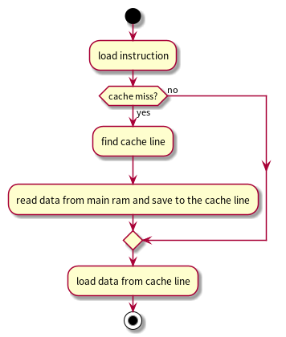
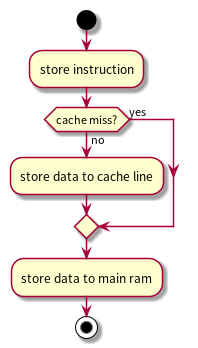
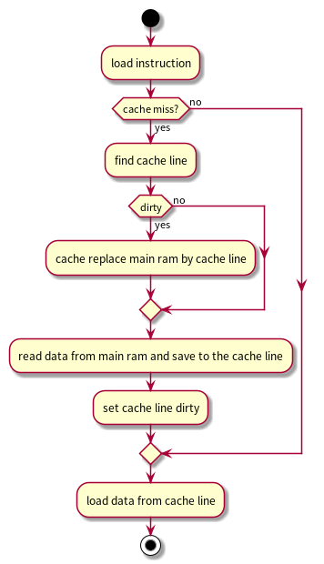
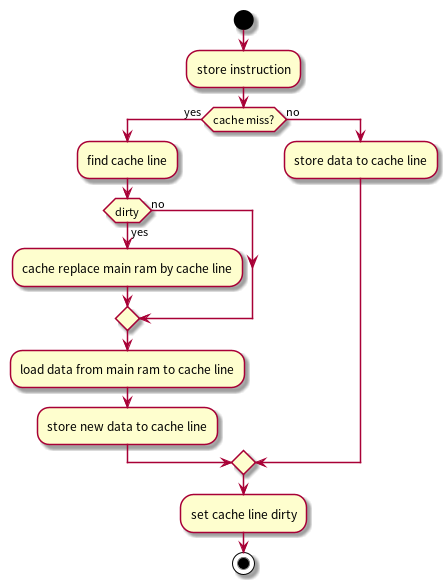
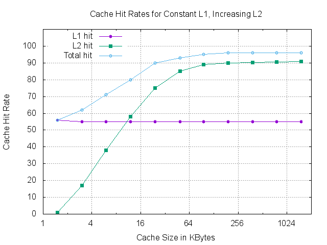

#+title: Cache
# #+subtitle: 
#+author: Joe
#+latex_class: org-latex-pdf 
#+toc: tables 
#+toc: listings 
#+latex: \clearpage\pagenumbering{arabic} 
#+latex: \AddToShipoutPicture{\BackgroundPicture} 
#+options: h:4 ^:{} 
#+startup: overview

* 简介
各级Cache的性价比如表[[tbl-cachelevel]]所示。
#+caption: CPU Access Latency
#+name: tbl-cachelevel
#+attr_latex: :placement [H]
|------------------------------+----------------+------------|
| Access Type                  | Access Latency | Cost($/MB) |
|------------------------------+----------------+------------|
|------------------------------+----------------+------------|
| Register                     | 1 Cycle        |            |
| L1 hit                       | 4 Cycles       |          7 |
| L2 hit                       | 10 Cycles      |          7 |
| L3 hit(no share)             | 40 Cycles      |          7 |
| L3 hit(share with other cpu) | 65 Cycles      |          7 |
| L3 hit(update by other cpu)  | 75 Cycles      |          7 |
| Local DDR                    | 60ns           |      0.015 |
| SSD                          | 150us          |     0.0004 |
| Harddisk                     | 10ms           |    0.00004 |
|------------------------------+----------------+------------|

* Cache结构
Cache视角可以理解为一个3维数组，如图[[img-cachestr]]所示，
cache[set][way][offset],当CPU需要访问一个内存物理地址在逻辑上分为三段.
- block offset：块（行）偏移量，确定一个缓存行（line）内的哪个字节或字
  中包含了需要的数据，字或字节取决于按字节还是字寻址；
- index：索引，也称为set，index段能表示的最大数目称为组(Set)。同一组
  (即set段相等)下，支持的最大tag数称为路（Way），即同一组下的缓存行数
  目，用于确定数据应该存储在哪个缓存集合中或者应该在哪个缓存集合中查找
  数据；
- tag：标签，用于确定数据是否真的在缓存中，将这个tag和缓存line中的tag
  比较，如果匹配，表示命中，可以直接从缓存中获取数据，否则需要去主内存
  中查找；

#+caption: Cache结构
#+name: img-cachestr
#+attr_latex: :placement [H] :width 0.6\textwidth
[[./pic/img-cache-terminology.png]]

基本仿存流程用数组描述为。
- 从物理地址取出index，即set号，得到一个二维数组空间。
- 物理地址的tag和Tag RAM对比，命中后，找到line；
- 物理地址的offset，确定line里面的数据；
- 如果tag都不能匹配，表示cache miss，需要从内存读取完整的cache line数
  据量将牺牲的line替换掉，并更新tag；

Cache实际硬件分成两部分物理存储阵列，在实际读cache数据时，是将cache
line全部读出，在通过多路选择器根据offset选出其中的字节/半字/字，offset
实际上不是Data RAM的选择线，而是后面选择器的选择信号。
- Tag RAM阵列：tag[set][way]，存tag、valid、dirty、替换位等元数据；
- Data RAM阵列：data[set][way]，每项存整条Cache line的全部字节。

* Cache实现
** direct mapped（直接相联）
n set and only 1 way，每个set只有一条line（路）; 如此，每个物理地址都
对应一个固定的缓存line位置。但不同的物理地址容易映射到相同的line中，
容易导致cache颠簸。

** full mapped（全相联）
only 1 set and n way;在全相连cache中，只有1个set，该set包含了cache中的
所line，在此模式下，set index参数被取消或永远是0，只剩下tag和offset。

全相连能够将cache的颠簸降到最小，cache的任何位置都可以保存main ram的任
何部分，但是成本更高，因为必须并行搜索cache的所有行，除特殊情况下，很
少用。
** set associative（组相联）
组相联是直接和全相联的折中，纯正的3维模型，m路组相连，n set and m way;
每个集合set包含一定数量的缓存行line，每个line又包含多个字节或字。每个
set中的line数量被称为关联度。

比如，32KB 4路（line）组相连，line大小为64字节。
- 总cache大小：32*1024=32768;
- line大小为64字节->offset需要6bit寻址；
- 每set总数据：4 * 64 = 256字节；
- set数目S=32K字节/(4*64字节)= 128个set->index需要7bit寻址；

* Cache策略
** Allocation Policies（分配策略）
- read allocate policy: CPU读数据时，发生cache miss, 会先分配一个cache
  line缓存从main ram读取数据到cache line中。
- write allocate policy: CPU写数据时，发生cache miss，从main ram中load
  数据到cache line中，然后会更新cache line中的数据。相当于先做了一个从
  mian ram中read的操作，然后再分配一个cache line去将读到的数据写入到分
  配的cache line中。  
- not-write allocate: CPU写数据时，发生cache miss，直接将数据写入到
  main ram中。
  
** Replacement Policy（替换策略） 
缓存容量有限，当缓存满后，如果新数据要进入缓存，则需要随时更新缓存中的
数据，但是删除谁、保留谁需要抉择，所以数据替换策略是缓存设计的核心问题。
- round-robin：
- FIFO：先进先出；
- pseudo-random：随机替换；
- least recently used(LRU)：最近最少使用，实际实现时用这个的较多；
- least frequently used（LFU）：最不经常使用；
- most recently used（MRU）：最近最多使用；
- most frequently used（MFU）：最经常使用；
- clock：时钟替换策略；
** Write Policy（写策略）

|--------------------+------------+-------|
|                    | Cache      | DDR   |
|--------------------+------------+-------|
| Write through      | W-hit-1st  | W-2ed |
| Write back         | W          | 0     |
| Write around       | 0-hit      | W     |
|--------------------+------------+-------|
| Write allocate     | W-miss-2ed | W-1st |
| Non-Write allocate | 0-miss     | W     |
|--------------------+------------+-------|

*** Write through
cpu访问内存，cache hit后，更新cache line的同时会更新内存中变量的数值，
保证cache与内存中的数据始终一致，在这种模式下不会标记dirty bit，类似
not-write-allocate。
#+begin_src plantuml :exports results :file ./pic/drw-wthrough.png
  start
  :load instruction;
  if (cache miss?) then (yes)   
    :find cache line;
    :read data from main ram and save to the cache line;
  else (no)
  endif
  :load data from cache line;
  stop
#+end_src
#+caption: Load by Write-through & Not-Write-Allocate Policy
#+attr_latex: :placement [H] :width 0.4\textwidth
#+results:

#+begin_src plantuml :exports results :file ./pic/drw-wthrough-store.png
  start
  :store instruction;
  if (cache miss?) then (yes)   
  else (no)
    :store data to cache line;
  endif
  :store data to main ram;
  stop
#+end_src

#+caption: Store by Write-through & Not-Write-Allocate Policy
#+attr_latex: :placement [H] :width 0.2\textwidth
#+results:

*** Write back
cpu访问内存，cache hit后，此时只更新cache line中的数据，并标记cache
line的dirty bit，此时并不会将修改的数据直接保存到内存中，只有当cache
line修改的数据发生replace，clean操作时才会将cache line中修改的数据写入
内存中，类似write-allocate。
#+begin_src plantuml :exports results :file ./pic/drw-wback-load.png
  start
  :load instruction;
  if (cache miss?) then (yes)   
    :find cache line;
    if (dirty) then (yes)
      :cache replace main ram by cache line;
    else (no)
    endif
    :read data from main ram and save to the cache line;
    :set cache line dirty;
  else (no)
  endif
  :load data from cache line;
  stop
#+end_src

#+caption: Load by Write-back & Write-Allocate Policy
#+attr_latex: :placement [H] :width 0.4\textwidth
#+results:

#+begin_src plantuml :exports results :file ./pic/drw-wback-store.png
  start
  :store instruction;
  if (cache miss?) then (yes)   
    :find cache line;
    if (dirty) then (yes)
      :cache replace main ram by cache line;
    else (no)
    endif
    :load data from main ram to cache line;
    :store new data to cache line;
  else (no)
    :store data to cache line;
  endif
  :set cache line dirty;
  stop
#+end_src

#+caption: Store by Write-back & Write-Allocate Policy
#+attr_latex: :placement [H] :width 0.5\textwidth
#+results:

*** Write around
这是一种针对 Write-through 和 Write-back 策略的改进，将写操作直接发送
到主存储器，而不更新缓存。这种方法可以减少缓存中不被读取的数据项所占用
的空间，提高缓存的利用率。
*** Write allocate
在写失效的情况下，先将主存中的数据块加载到缓存中，再进行写操作。与之相
对的是非写分配(Non-write allocate)策略，直接将数据写到主存中，而不加
载到缓存。写分配策略在有连续多次写操作的情况下会有利，但是在仅有单次写
操作的情况下可能会造成不必要的缓存加载。和Write through的区别是，Write
allocate是先将内存的数据加载到cache中。
* Cache&MMU
总体而言，CPU发出VA需要先经过MMU翻译为PA，PA再走上面的Cache寻址流程寻
找Cache数据。Cache和MMU基本上是一起使用的，会同时开启或关闭，因为MMU页
表中的entry属性，控制着内存的权限和cache的策略。
- PIPT: CPU在访问DDR时用的地址是虚拟地址，经MMU将VA映射成物理地址，然后使用
  物理地址查询cache，这种cache叫物理cache，主要缺点是，CPU查询TLB或MMU
  后才访问cache，增加了流水线的延时，流程如图[[img-phycacheflow]]所示。
  #+begin_src plantuml :exports results :file ./pic/drw-phycache.png
    [CPU] -right-> [TLB]: VA
    [TLB] --> [Cache]: PA
    [Cache] --> [DDR]: cache miss,read DDR
    [Cache] -left-> [CPU]: cache hit
    [TLB] -right-> [MMU]: TLB miss
    [MMU] --> [Cache]: PA
  #+end_src
  #+caption: Physcal Cache Flow
  #+name: img-phycacheflow
  #+attr_latex: :placement [H] :width 0.3\textwidth
  #+results:
  [[file:./pic/drw-phycache.png]]

- VIVT: CPU使用虚拟地址寻址Cache，被称为虚拟Cache。CPU在寻址时，先把虚
  拟地址发给Cache，若Cache hit，就不再访问TLB和DDR，如图
  [[img-vacacheflow]]所示，这种方式会导致cache重名问题，如一个PA的内容可以
  出现在多个cache line中，当系统改变了VA到PA的映射时，需要清空这些
  cache并使之失效，会导致系统性能下降。
  
  #+begin_src plantuml :exports results :file ./pic/drw-vacache.png
    [CPU] -right-> [Cache]: VA
    [Cache] -left-> [CPU]: cache hit
    [Cache] -right-> [TLB]: cache miss
    [TLB] --> [DDR]: PA
    [TLB] -right-> [MMU]: TLB miss
    [MMU] --> [DDR]: PA
  #+end_src
  #+caption: Virtual Cache Flow
  #+name: img-vacacheflow
  #+attr_latex: :placement [H] :width 0.5\textwidth
  #+results:
  [[file:./pic/drw-vacache.png]]

- VIPT: 使用虚拟地址的索引域和物理地址的标记域，即CPU发出的VA会同时发
  送给TLB/MMU，进行地址翻译，在cache中进行索引并查询，在TLB/MMU中会把
  VPN翻译成PFN，同时用VA的index域和offset量来查询cache。cache和TLB/MMU
  可以同时工作，当TLB/MMU完成地址翻译后，再用物理tag域来匹配cache line，
  好处之一是在多任务操作系统中，修改了VA到PA的映射关系，不需要使相应的
  cache失效。
* Cache性能
#+begin_src gnuplot :exports results :file ./pic/drw-cacheperf.png
  set title "Cache Hit Rates for Constant L1, Increasing L2"
  set xlabel "Cache Size in KBytes"
  set ylabel "Cache Hit Rate"
  set grid
  set key left

  set yrange [0:110]
  set ytics 0,10,100

  set logscale x 2
  set xrange [1:2048]
  set xtics format "{%0.f}"
  plot "img/tbl-cacheperformance.txt"  using 1:2 w lp pt 7 t "L1 hit",\
    "img/tbl-cacheperformance.txt"  using 1:3 w lp pt 5 t "L2 hit",\
    "img/tbl-cacheperformance.txt"  using 1:4 w lp pt 6 t "Total hit"
#+end_src
#+caption: Cache Hit Rates for Constant L1, Increasing L2
#+name: drw-cachehitrate
#+attr_latex: :placement [H] :width 0.6\textwidth
#+results:

* Cache一致性
CPU缓存一致性大致有以下解决方式。
- Directory协议；
- Snoopy协议；
- MESI协议；
** Directory
采用集中管理的方式来处理缓存一致性问题。在这个协议中，存在一个中央目录，
保存着主存储器中每个区块的状态，以及拥有该区块副本的所有处理器的信息。
当某个处理器需要访问某个数据块时，先去查询这个中央目录，然后根据目录中
的信息做出相应的处理。比如，如果其他处理器也有这个数据块的副本，那么就
需要发出通知，让它们的副本变为无效。由于 Directory 协议需要维护中央目
录，所以可能带来一定的开销。Directory 协议的优点是能够很好地处理大规模
多处理器系统，可以支持更大数量的处理器，因为它监听总线并不依赖于所有处
理器。
** Snoopy
是一种分布式的处理方式，没有中央目录，而是让每个处理器都能“窥探”或“监
听”总线上的信息，根据总线上的读写操作自行更新自己的缓存状态。

Snoopy协议中的各个处理器通过监听总线上的数据传输和命令，来决定自己的缓
存行的状态。比如，如果某个处理器在总线上发出了写操作，那么其他所有的处
理器都会看到这个操作，然后更新自己的缓存行状态。这种协议非常适用于小规
模多处理器系统，但在大规模系统中可能会面临总线带宽的问题。Snoopy协议的
优点是实现相对简单，无须维护中央目录，处理器能够立即响应总线上的命令，
因此响应速度快。而且，它是基于总线的，当处理器数量不多时，它能有效利用
总线带宽。
** MESI
MESI协议实际是Snoopy的一种实现，There are a number of standard ways by
which cache coherency schemescan operate. Most ARM processors use the
MOESI protocol, while theCortex-A9 uses the MESI protocol.
- Modified(M): The most up-to-date version of the cache line is within
  this cache. No other copies of the memory location exist within
  other caches. The contents of the cache line are no longer coherent
  with main memory.
- Owned(O): This describes a line that is dirty and in possibly more
  than one cache. A cache line in the owned state holds the most
  recent, correct copy of the data. Only one core can hold the data in
  the owned state. The other cores can hold the data in the shared
  state.
- Exclusive(E): The cache line is present in this cache and coherent
  with main memory. No other copies of the memory location exist
  within other caches.
- Shared(S): The cache line is present in this cache and coherent with
  main memory. Copies of it can also exist in other caches in the
  coherency scheme.
- Invalid(I): The cache line is invalid.

The rules for the standard implementation of the protocol are as
follows:
- A write can only be done if the cache line is in the Modified or
  Exclusive state. If it is in the Shared state, all other cached
  copies must be invalidated first. A write moves the line into the
  Modified State.
- A cache can discard a Shared line at any time, changing to the
  Invalid state. A Modified line is written back first.
- If a cache holds a line in the Modified state, reads from other
  caches in the system will get the updated data from the
  cache. Conventionally, this is done by first writing the data to
  main memory and then changing the cache line to the Shared state,
  before performing a read.
- A cache that has a line in the Exclusive state must move the line to
  the Shared state when another cache reads that line.
- The Shared state might not be precise. If one cache discards a
  Shared line, another cache might not be aware that it could now move
  the line to Exclusive status.

