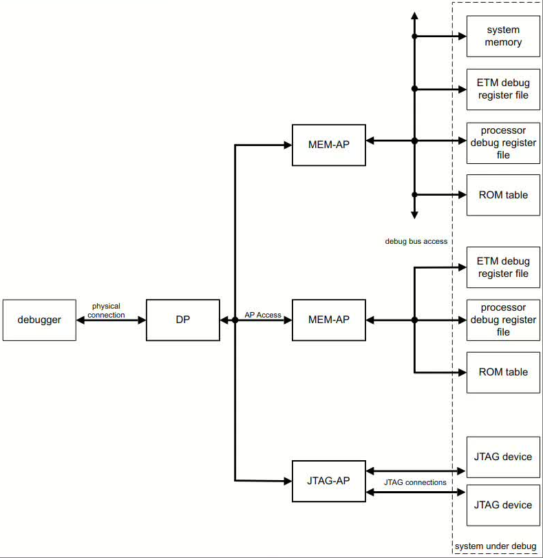
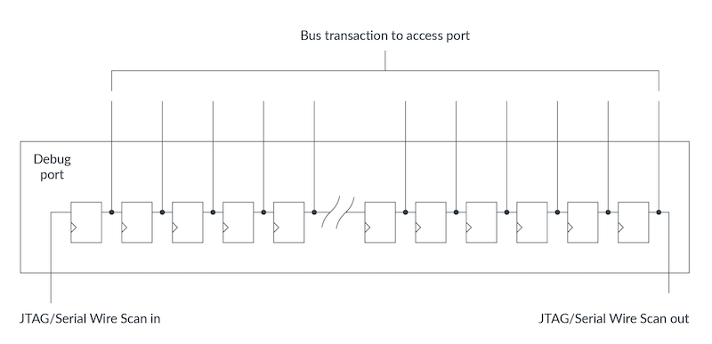

#+title: ARM Debug Interface
# #+subtitle: 
#+author: Joe
#+latex_class: org-latex-pdf 
#+toc: tables 
#+toc: listings 
#+latex: \clearpage\pagenumbering{arabic} 
#+latex: \AddToShipoutPicture{\BackgroundPicture} 
#+options: h:4 ^:{} 
#+startup: overview
* Overview
#+caption: ADI Overview
#+name: img-dp-ap
#+attr_latex: :placement [H] :width 0.6\textwidth

- dp负责解析jtag/swd接口的信号,并对接ap,支持的dp有.
  + JTAG-DP: 可以通过IEEE1149.1的DBGTAP扫描链做读写访问.
  + SW-DP.
  + SWJ-DP
- ap分为多个类型.
  + MEM-AP
    1. 可以使用memory-map的debug总线直接连接调试寄存器;
    2. 可以使用memory-map的system总线连接到系统中的system-bus,提供对调
       试寄存器的连接;
  + JTAG-AP: 可以直接连接JTAG device;

  
ap负责对接dp传过来的指令,并访问后接的ahb/apb/axi等总线,进而访问各种调
试资源,如;
+ core的调试寄存器;
+ ETM或trace port调试寄存器;
+ ROM table;
+ memory/peripherals: 使用MEM-AP;
+ jtag device: 使用JTAG-AP; 

#+caption: DP
#+name: img-dp
#+attr_latex: :placement [H] :width 0.6\textwidth

