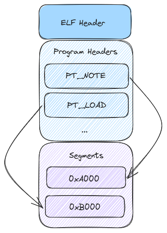
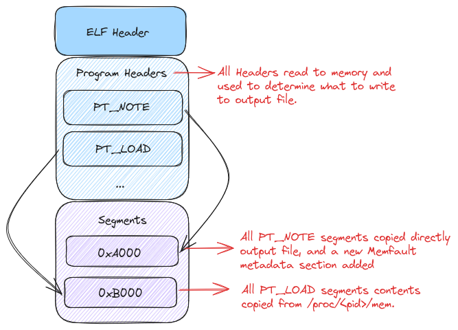

#+title: Linux Coredump
# #+subtitle: 
#+author: Joe
#+latex_class: org-latex-pdf 
#+toc: tables 
#+toc: listings 
#+latex: \clearpage\pagenumbering{arabic} 
#+latex: \AddToShipoutPicture{\BackgroundPicture} 
#+options: h:4 ^:{} 
#+startup: overview

这篇文章, 将开始着眼于Linux coredump的格式,如何抓,如何用.
* Linux Coredump是什么
一个Linux Coredump是崩溃进程存储区的快照.它可以被加载到像GDB的调试工具
中来调查进程在崩溃那一刻的状态.它被制作成ELF文件格式.
* 什么触发出Coredump
Coredump被一些信号触发出来,这些信号是产生自这些程序或发往这些程序.完整
的信号列表可以在信号的man帮助中找到,下面的信号可以触发Coredump
- SIGABRT: 程序的异常中止,比如调用abort;
- SIGBUS: 总线错误 (非法内存访问).
- SIGFPE: 浮点异常.
- SIGILL: 非法指令.
- SIGQUIT: 从按键退出.
- SIGSEGV: 无效内存引用.
- SIGSYS: 非法系统调用.
- SIGTRAP: Trace/breakpoint trap.

当然, 最常见的信号原因是SIGSEGV/SIGBUS/SIGABRT.这些信号会在如下一些情
况产生, 典型的,它们都指示出要么你的程序要么它的库有严重的bug.
- 当程序尝试访问它不具有权限的内存区域;
- 当尝试解引用空指针;
- 当程序调用abort;

通常, Coredump在你想调查进程在崩溃那一刻的运行状态是非常有用的. 从
Coredump中,可以得到崩溃线程的backtrace, 崩溃那一刻的寄存器值,
backtrace的每个帧上的本地变量.
* Coredump如何使能和收集
在Linux设备上使能Coredump需要一些配置选项.首先, 在内核上的最小配置如下.
#+begin_src shell
  CONFIG_COREDUMP=y
  CONFIG_CORE_DUMP_DEFAULT_ELF_HEADERS=y
#+end_src
这些配置会使能内核产生coredump,并且设置默认映射来展示coredump. 当配置
coredump时, "man core"提供了一个很好的可用选项概览. 值的注意的是, 在多
数发行版中,这些选项是默认开启的.

不仅内核的配置, 对想抓取coredump的进程还需要设置它的"ulimit", ulimit命
令用来给进程设置资源门限. core的资源门限是比较感兴趣的地方, 这个值设置
来表示一个进程产生的最大coredump量. 为了做起来简便,可以使用下面的命令
设置为无限.
#+begin_src shell
  ulimit -c unlimited
#+end_src
** core_pattern
内核提供了一个接口来控制coredump在哪里和如何产生.文件
"/proc/sys/kernel/core_pattern"提供了2个方法来抓取崩溃进程的coredump
.coredump可以直接写到提供的路径下.比如, 如果想把文件写到"/tmp"目录并带
上进程名称和PID,可以将下面的规则写入"/proc/sys/kernel/core_pattern".
#+begin_src shell
  /tmp/core.%e.%p
#+end_src
在这个例子中, %e会扩展为崩溃进程的名字, %p扩展为它的PID. 更多的使用信
息,可以查看"man core"页面.

也可以直接pipe coredump到进程, 当想运行时修改coredump是很有用的.
这样coredump可以通过stdin引流到进程. 这个配置和直接保存到文件很像, 除
了需要一个"|". 
** procfs浅析
使用"core_pattern"pip接口的额外好处就是直到pip去的程序退出前, 都有权限
访问崩溃进程的procfs. 那, procfs是什么呢?在coredump上如何提供帮助呢?

procfs可以直接提供访问内核数据的权限(通常是只读的), 可以是系统级的信息
或进程的信息. 最感兴趣的就是当前崩溃的进程信息. 可以从
"/proc/<pid>/mem" 直接通过地址以只读方式访问所有映射的内存, 或通过
"/proc/<pid>/cmdline"查看进程的命令行参数.
* ELF Core文件布局
Linux coredump文件使用一部分ELF格式,具体布局见图[[img-elflayout]]所示, 在
这篇文章中,只涉及到core文件最重要的格式,不会深挖ELF文件格式.
#+caption: ELF文件布局
#+name: img-elflayout
#+attr_latex: :placement [H] :width 0.6\textwidth

** ELF Header
图[[img-elflayout]]的提供了coredump布局的一个高层视角. 首先, ELF Header概
览了文件布局和来源. 由此可以看到系统是32-bit还是64-bit,大小端以及系统
架构信息.另外,展示了program header们的偏移地址.下面是ELF header的布局.
#+begin_src c
  typedef struct {
    unsigned char e_ident[EI_NIDENT];
    Elf32_Half e_type;
    Elf32_Half e_machine;
    Elf32_Word e_version;
    Elf32_Addr e_entry;
    Elf32_Off e_phoff;
    Elf32_Off e_shoff;
    Elf32_Word e_flags;
    Elf32_Half e_ehsize;
    Elf32_Half e_phentsize;
    Elf32_Half e_phnum;
    Elf32_Half e_shentsize;
    Elf32_Half e_shnum;
    Elf32_Half e_shstrndx;
  } Elf32_Ehdr;
#+end_src
这里包含了很多域,但是我们讨论的最重要的域分解如下
- e_ident: 这是一个字节数组,标识该文件是ELF文件.
- e_type: 这个域告诉这个文件是哪种类型,对于dump文件,总是ET_CORE.
- e_machine:  这个域告诉产生这个文件的系统架构,一般32-bit的ARM是
  EM_ARM, 64-bit ARM是EM_AARCH64.
- e_phoff: 这个域告诉program headers的偏移.
- e_phentsize: 这个域告诉每个program headers的大小.
*** Program Headers和Segments
Coredump的有用信息在program headers里面. 各种类型的program header在ELF
文件格式中定义, 从coredump视角,主要关注PT_NOTE和PT_LOAD类program
header. program header的布局如下.
#+begin_src c 
  typedef struct {
    Elf32_Word p_type;
    Elf32_Off p_offset;
    Elf32_Addr p_vaddr;
    Elf32_Addr p_paddr;
    Elf32_Word p_filesz;
    Elf32_Word p_memsz;
    Elf32_Word p_flags;
    Elf32_Word p_align;
  } Elf32_Phdr;
#+end_src
program header需要关注的点分解如下.
- p_type: 这个域告诉在查找的段的类型,它要么是PT_NOTE要么是PT_LOAD.
- p_offset: 这个域告诉段从文件开始的offset.
- p_vaddr: 这个域告诉段加载的虚拟地址.
- p_paddr: 这个域告诉段加载的物理地址.
- p_filesz: 这个域告诉段在ELF文件中的大小.
- p_memsz: 这个域告诉段在内存中的大小.
- p_align: 这个域告诉段的对齐值.

下面开始研究PT_NOTE类段的格式. 表[[tbl-seglayout]]是PT_NOTE 段的
布局.
#+caption: PT_NOTE段布局
#+name: tbl-seglayout
#+attr_latex: :placement [H]
|--------|
| namesz |
| descsz |
| type   |
| name   |
| ...    |
| desc   |
| ...    |
|--------|

- 这个段的前两个域名字可以自解释, 他们代表name和descriptor的大小.
- name域是个字符串代表note的类型, 可以作为一种该类型域的命名空间.
- desc域是个结构体包含note的实际数据.
- type域表示note类型,是个uint类型, 两个具有相同type域的note可以有不同
  的name域.

  
PT_LOAD段比较直接.它代表了在崩溃时被加载进进程的段内存.他们要么表示栈/
堆要么加载到进程的其他段内存.
* Memfault之于Coredump
我们利用Memfault处理Coredump的一个目标是:利用现有工具来抓取崩溃进程的
信息.为了校验这些来自己于MCU或Android的信息,需要一些基本的东西.
- 对崩溃进程的每个运行线程的符号化的backtrace;
- 崩溃时的寄存器值;
- 每个栈帧上的符号化本地变量;

自此,基于以上的关于Linux core文件的了解, 明显,它很适合这些需求.我们可
以使用已有的系统来路由崩溃进程的信息, 添加元数据来帮助提供问题设备的信
息并且不会修改系统上任何运行程序的源码. 由此,可以对比(由Memfault)生成
的Coredump和内核产生的Coredump. (相比)唯一添加的是一个note, 它包含了用
来识别设备和所运行程序版本的元数据. 它利用了一个事实, 即PT_NOTE段可以
自由的添加我们想要的元数据信息.这样可以收集关于崩溃进程的额外信息并且
导流内存.

这样就转化出了所有的背景信息, 就可以深入挖掘"memfault-core-handler"了.
首先, 使用pipe操作. 下面有一个写入"/proc/sys/kernel/core_pattern"的模
式用来pipe Coredump到我们的处理handler.
#+begin_src shell
  |/usr/sbin/memfault-core-handler -c /path/to/config %P %e %I %s
#+end_src
这条语句让内核pipe Coredump信息到我们的处理handler并且提供了崩溃进程的
PID(%P),名字name(%e),UID(%I)以及导致崩溃的信号量(%s).

当崩溃发生时, 内核会把coredump写到handler的stdin, handler会读取所有的
program header并存到内存中.由此完成里2件事, 首先, 可以读取所有的
PT_NOTE段并保存到内存中.handler在第一轮迭代时, 只会这些段写入文件,对
handler的后续使用这个很重要. 下一步,handler读取Coredump的所有的PT_LOAD
段, 读取后不是写入内存,而是直接引流存入文件"/proc/<pid>/mem". 这样做可
以尽可能减少handler对内存的印记干扰并且阻止任何对流潜在的后向搜索. 如
前所述,stdin是一路流,不能对它进行后向探寻.

把所有的PT_LOAD段都写入文件后, 会得到一个如内核生成的Coredump文件一般
大小的ELF Coredump文件.唯一的不同是,添加里note到里面.如前所属可以参见
图[[img-elfannote]].
#+caption: ELF文件布局注解
#+name: img-elfannote
#+attr_latex: :placement [H]

到此,我们可能会想, 为什么要费劲的得到一个和内核生成的一般大小的
Coredump文件. 因为这样做允许我们添加一些元数据到Coredump文件,可以做更
多的处理.
* 最小Coredump
对于嵌入式设备,存储空间有限,通常都需要缩小Coredump文件的体积.若想减少
体积, 首先必须要定义需要收集的最小信息集合. 对程序来讲主要部分就是被堆
消耗的映射内存,如果能把这部分剔除, 我们已经发现Coredump文件体积减少非
常有限. 对于独立线程栈空间也可能会很大. 如果仅抓取每个栈的最新N字节,
不仅会得到一个很小的Coredump而且文件体积还更具有可预测性. 最后, 为了在
gdb中更有效的使用Coredump, 我们需要加入一些元数据来辅助解开Coredump文
件.对于这个最小Coredump文件,浓缩起来几点要求如下
- 抓取的每个栈数据仅限前N个字节;
- 剔除分配的堆空间;
- 抓取gdb调试器便于使用的元数据;

满足以上要求后,可以把Coredump文件最大可能减小. 但是,这里面有两个主要的
平衡点.

- 第一, 任何堆上分配的值会找不到, 这是个可接受的舍弃, 正如大多数可被调
  试分析的崩溃问题都仅仅只有stacktrace和栈上分配的变量.
- 第二, 抓取的每个栈限制里大小, 这确实限制里stacktrace的深度,但是通常,
  对于Coredump有2个重要的性质,首先一般栈都不是很深,其次只有最新的一些
  栈帧是关键.
* 寻找栈数据
如果我们又要抓取栈,又要限制抓取的字节数,我们必须要找到他们. 如上所述,
Coredump文件的PT_LOAD段是如何表述映射的内存, 若想找到包含线程栈空间的
PT_LOAD段,需要找到它的PC值, 通过线程的当前PC值, 可以搜寻所有的段找到它
落在哪个段里面.那如何得到每个线程的当前PC值呢?

如前所述, 我们简单的过了一遍PT_NOTE段的所有不同类型. 一种NOTE比较特殊,
NT_PRSTATUS类型. 这种类型的NOTE包含每个进程的信息.如下是NOTE段的布局.
#+begin_src c 
  struct elf_prstatus_common
  {
      struct elf_siginfo pr_info; /* Info associated with signal */
      short pr_cursig;  /* Current signal */
      unsigned long pr_sigpend; /* Set of pending signals */
      unsigned long pr_sighold; /* Set of held signals */
      pid_t pr_pid;
      pid_t pr_ppid;
      pid_t pr_pgrp;
      pid_t pr_sid;
      struct __kernel_old_timeval pr_utime; /* User time */
      struct __kernel_old_timeval pr_stime; /* System time */
      struct __kernel_old_timeval pr_cutime; /* Cumulative user time */
      struct __kernel_old_timeval pr_cstime; /* Cumulative system time */
  };
  struct elf_prstatus
  {
      struct elf_prstatus_common common;
      elf_gregset_t pr_reg; /* GP registers */
      int pr_fpvalid;  /* True if math co-processor being used.  */
  };
#+end_src
这里的pr_reg成员比较重要. 它包含了崩溃时的所有通用寄存器数据.由此, 我
们可以抓到这个线程的PC值,并搜寻所有映射的内存区域.为了搜寻所有映射的内
存区域, 我们可以查询"/proc/<pid>/maps"里的每一项. 其中包含起始结束地址.
#+begin_src shell
  77837a402000-77837a404000 rw-p 00000000 00:00 0
#+end_src
如果PC在这个范围里面, 我们就找到了栈区域. 现在, 我们可以简单的拷贝从PC
往下到要么栈的开始地址,或到最大的N字节处.

现在,我们仅仅有里每个线程的内存数据, 如果把它加载到gdb中, 工作不起来.
因为, 确实一些很重要的调试信息. 下面将看看这些section.
* r_debug(Debug Rendevous结构)
动态链接允许程序调用系统中的共享库. 因为我们的调用栈最终会去这些链接的
库, 若要正确重构建stacktrace,我们需要一些关于他们的信息.

一个关键信息是编译地址和运行地址的转换信息. 基于安全考虑,Linux内核在运
行时会把程序加载到一个随机的地址上,即特性Address Space Layout
Randomization(ASLR), 这个可以阻止恶意嗅探栈地址值以及重定向程序运行流
程.如果每次加载时地址是随机的, 如何将debug info中的固定地址转换为加载
时的随机地址呢?

这就是r_debug结构的出处.它有很多功能, 我们需要它的主要原因是可以提供对
编译期地址到运气时的地址映射转换. 下面是r_debug结构的布局.
#+begin_src c 
  struct r_debug
  {
      /* Version number for this protocol.  It should be greater than 0.  */
      int r_version;
      struct link_map *r_map; /* Head of the chain of loaded objects.  */
      /* This is the address of a function internal to the run-time linker,
         that will always be called when the linker begins to map in a
         library or unmap it, and again when the mapping change is complete.
         The debugger can set a breakpoint at this address if it wants to
         notice shared object mapping changes.  */
      ElfW(Addr) r_brk;
      enum
      {
          /* This state value describes the mapping change taking place when
             the `r_brk' address is called.  */
          RT_CONSISTENT,  /* Mapping change is complete.  */
          RT_ADD,   /* Beginning to add a new object.  */
          RT_DELETE  /* Beginning to remove an object mapping.  */
      } r_state;
      ElfW(Addr) r_ldbase; /* Base address the linker is loaded at.  */
  };
  struct link_map
  {
      /* These first few members are part of the protocol with the debugger.
         This is the same format used in SVR4.  */
      ElfW(Addr) l_addr;    /* Difference between the address in the ELF
                               file and the addresses in memory.  */
      char *l_name;         /* Absolute file name object was found in.  */
      ElfW(Dyn) *l_ld;      /* Dynamic section of the shared object.  */
      struct link_map *l_next, *l_prev; /* Chain of loaded objects.  */
  };
#+end_src
其中的link_map成员l_addr告诉gdb如何映射在运行时我们看到的地址到编译出
的ELF中呈现的地址.为此, 查看PT_DYNAMIC program header. 这个头的结构如
下,包含里一个tag列表,对64-bit系统布局如下.
#+begin_src c
  typedef struct {
      Elf64_Sxword    d_tag;
      union {
          Elf64_Xword d_val;
          Elf64_Addr  d_ptr;
      } d_un;
  } Elf64_Dyn;
  extern Elf64_Dyn _DYNAMIC[];
#+end_src
r_debug结构在这个动态tag列表中. 可以在DT_DEBUG tag下找到. 我们可以轮询
所有的tag,提取每个r_debug结构的内存范围,并添加到Coredump文件中.
* 查找构建ID和动态库的Header
为了正确获取到主程序和动态库的符号表,需要搜集一些关于他们的元数据. 我
们需要对每个映射的文件获取3个东西
- ELF头
- 所有的program header
- build ID note

这可以让gdb正确获取到程序被加载到动态映射区的stacktrace部分.那如何找到
这个信息呢?由此,必须探查"/proc/<pid>/maps"中的值. 它包含里给定PID的所
有映射的内存, 栈/堆的映射地址和动态链接库的地址.对每个列表中映射的ELF
文件,可以提取3种上面提到的信息.
* 构建的是什么
在我们仔细审查从收集到的Coredump文件进行设备的栈回溯展开时, 会发现对于
一些敏感设备会泄漏个人信息(PII, Personally Identifiable Information),
这些信息可能存储在栈/堆内存中. 而通过在设备上本地在线展开栈, 我们不需
要把任何内存区推到其他设备或服务器,仅仅将PC所在的每个栈帧进行单独符号
化, 后面将会看到用gcc/llvm编译的程序处理栈展开的方法机制, 以及如何利用
这个进行本地栈展开.

下面的目标就是拿到我们的Coredump文件,然后剔除所有抓取到的内存数据,达到
2个目标
- 用户敏感数据无风险, 如果不抓取内存数据, 这些数据就不会离开用户设备.
- 有效减少文件体积, 大多数Coredump文件都是由一大片裸内存数据构成.

所以, 我们需要抓取什么信息呢?如果我们不保存本地变量或任何的堆内存, 至
少, 我们需要PC所在的每个栈帧信息, 虽然, 这仅仅只是一个裸地址. 如果我们
想让它发挥实际的用处, 我们需要抓取一些信息,它能让每个PC符号化出实际的
函数名字/位置.

首先, 需要知道哪个文件包含正在使用的符号. 回想一个可运行的单独的Linux
程序, 不止是主体代码,任何链接的动态库代码也会用到, 要做到这点, 调试器
通常会联合使用gnu 构建ID和路径, 所以需要抓取这两者.

这里有个有趣点, 编译文件中呈现的地址范围和程序实际运行的地址范围不同,
且还是随机的, 这是Linux的一个安全特性ASLR(Address Space Load
Randomization).以一个更高的视角看, 它把加载到内存的起始地址随机化了这
样攻击者就不易看到这个程序并通过改变栈上的值来翻译出程序的执行. 因此,
要正确解码出地址, 我们需要找到PC地址范围,尽管有编译期和运行期的偏移.所
以, 需要一个最小信息集来抓取一个完整的回溯.
- 每个线程的栈帧PC值.
- 对于主代码区和动态库
  + PC 范围;
  + gnu构建ID;
  + 编译期和运行期的偏移;
  + 路径;

一个展开的栈如下面的json结构.
#+begin_src html
  {
    "symbols": [
      {
        "pc_range": {
          "start": "0x555dbc0000",
          "end": "0x555dc4c000"
        },
        "build_id": "4929ac8cb3c174c113cafc7250efe12eee45cd25",
        "compiled_offset": "0x0",
        "runtime_offset": "0x555dbc0000",
        "path": "/usr/bin/memfaultd"
      },
      {
        "pc_range": {
          "start": "0x7f957b0000",
          "end": "0x7f957c4000"
        },
        "build_id": "6068e30747634b6fe61b667bba7f5964da192a3e",
        "compiled_offset": "0x0",
        "runtime_offset": "0x7f957b0000",
        "path": "/lib/libgcc_s.so.1"
      }
    ],
    "threads": [
      {
        "pcs": [
          "0x7f95862508"
          "0x7f95894b80"
        ]
      },
      {
        "pcs": [
          "0x7f95894b80"
          "0x7f9585cf3c"
        ]
      }
    ]
  }
#+end_src
由此, 对线程的每个PC做如下操作,可以生成栈回溯.
- 通过每个PC范围(pc range)找到相关符号;
- 通过构建ID或路径拿到符号文件;
- 通过PC减去运行期偏移(runtime_offset),然后加上编译期偏移
  (compiled_offset)得到ASLR;
- 用转换后的地址和相关符号文件来运行"addr2line";

完成以上步骤后, 应该会得到我们程序在崩溃时的一个完整的栈回溯.
* 理解GNU Unwind Info
既然已经知道了最终目标, 我们如何用Linux core handler来得到这些呢?要回
到上面的问题, 我们需要了解类似gdb和perf这样的程序是如何遍历栈的.要注意
的是生成回溯实际上有2部分. 明显,需要把裸地址转换为函数名和本地变量名,
也需要知道每个栈帧是如何构成的.

当展开栈时, 有关于之前栈帧的信息, 这些是调试器或其他分析工具需要知道的.
- 栈上保存的寄存器的位置;
- 栈上本地变量的位置;

我们第一个想到的就是拿到栈指针寄存器. 这个理论上可以告诉我们之前的栈帧
从哪儿开始, 但是这里有一些问题, 不是每个平台都有栈指针,如x86-64. 另外,
一些最新的编译器出于性能考虑已经开始把栈帧指针寄存器用于通用寄存器. 即
使我们可以依靠栈指针寄存器, 如何知道这些寄存器指向哪里?

幸运的是, 现代编译器有一些内建的机制来解决这些问题. ".eh_frame"节和它
的兄弟节".eh_frame_hdr"一起再加上当前的PC值可以得到之前的栈帧结构. 我
们将很快就能把这些节的结构挖得更深, 但是他们满足之前说的布局要求. 当处
理一个崩溃场景时, 我们可以拿到PC并推导出之前的栈帧结构, 然后重复这个过
程直到栈底.
** .eh_frame内容
如上所述, 用现代编译器编译出的程序大部分都包含".eh_frame"ELF节. 它包含
了一套规则来允许我们重建栈信息,它们都隐含编码在我们程序的汇编中. 这个
规则叫CFI(Call Frame Information)记录, 并且每个".eh_frame"至少都有一个.用
readelf工具先看看".eh_frame"节.
#+begin_src shell
  $ readelf --debug-dump=frames memfaultd

  Contents of the .eh_frame section:

  00000000 0000000000000014 00000000 CIE
    Version:               1
    Augmentation:          "zR"
    Code alignment factor: 1
    Data alignment factor: -8
    Return address column: 16
    Augmentation data:     1b
    DW_CFA_def_cfa: r7 (rsp) ofs 8
    DW_CFA_offset: r16 (rip) at cfa-8
    DW_CFA_nop
    DW_CFA_nop

  00000018 00000014 0000001c FDE cie=00000000 pc=001c1180..001c11a6
    DW_CFA_advance_loc: 4 to 00000000001c1184
    DW_CFA_undefined: r16 (rip)
    DW_CFA_nop
    DW_CFA_nop
    DW_CFA_nop
    DW_CFA_nop

  00000030 00000024 00000034 FDE cie=00000000 pc=001bd020..001bd130
    DW_CFA_def_cfa_offset: 16
    DW_CFA_advance_loc: 6 to 00000000001bd026
    DW_CFA_def_cfa_offset: 24
    DW_CFA_advance_loc: 10 to 00000000001bd030
    DW_CFA_def_cfa_expression (DW_OP_breg7 (rsp): 8; DW_OP_breg16 (rip): 0; DW_OP_lit15; xxx
    DW_CFA_nop
    DW_CFA_nop
    DW_CFA_nop
    DW_CFA_nop
  ...
#+end_src
FDE/CFI/CIE/CFA这些晦涩的管理单元,需要一层一层进行剥离理解分析.前3部分
CFI/CIE/FDE,都和每个栈帧有关. CFI扩展出Common Frame Information, 它代
表了栈帧的多个bit也是层级结构中的最高一级. 每个CFI会包含一个或多个CIE
和FDE.CIE(Common Information Entry)是一套CFI中的FDE可以用的指令集.
*** Common Information记录(CIE)
下面是一个CIE记录.
#+begin_src shell
  00000000 00000014 00000000 CIE
    Version:               1
    Augmentation:          "zR"
    Code alignment factor: 1
    Data alignment factor: -8
    Return address column: 16
    Augmentation data:     1b
    DW_CFA_def_cfa: r7 (rsp) ofs 8
    DW_CFA_offset: r16 (rip) at cfa-8
    DW_CFA_nop
    DW_CFA_nop
#+end_src
这是一个CIE entry0, 由CIE标记前面的0表示. 当我们看看FDE如何和CIE关联时
就很有趣了. 接下来,会看到一些版本和对齐信息,可以先忽略那些行.后面有一
些以"DW_*"开头的行,这些行告诉如何找到我们的寄存器,类似CFA. 最后开始找
到如何满足之前的要求:找到每个栈上保存的寄存器位置.
*** Frame Description Entry(FDE)记录
接下来是FDE, 代表了Frame Description Entry. 和CIE类似但更特殊,它代表了
重建栈帧结构所需要的指令. 下面是FDE的梳理.
#+begin_src shell
  00000018 00000014 0000001c FDE cie=00000000 pc=001c1180..01c11a6
    DW_CFA_advance_loc: 4 to 001c1184
    DW_CFA_undefined: r16 (rip)
    DW_CFA_nop
    DW_CFA_nop
    DW_CFA_nop
    DW_CFA_nop
#+end_src
一步一步看,可以看到正在使用刚刚分析的CIE 0. 下一个有意思的信息是PC范围.
每个PC范围代表一整个函数可能的PC值范围. 这很重要, 因为这个函数决定了寄
存器是如何被推到栈上的. 如果在当前的函数不涉及到他们, 之前的那些都不用
保存. 后面的都是和CIE里面差不多的指令.
*** Cannonical Frame Address(CFA)记录
CFA表示Cannonical Frame Address,是展开规则中最重要的部分. 它代表了我们
打算重建的栈帧的基地址,如下面表示CFA等于rsp(x86-64的栈指针)+8.
#+begin_src shell
  DW_CFA_def_cfa: r7 (rsp) ofs 8
#+end_src
继续解码CIE的下一行,可以知道如何得到单独的寄存器组
#+begin_src shell
  DW_CFA_offset: r16 (rip) at cfa-8
#+end_src
这里可以看到rip(x86-64 program counter)等于上面得到的CFA-8.如果想知道
更多不同栈帧类型的规则,可以参考"DWARF"规格书.由此可以知道如何构建栈帧.
让我们看看如何把这些和Linux core handler挂钩在设备上来展开栈.
** 抓住当前Thread Info
通过以上的深挖后,我们知道了如何展开栈, 但是还需要抓取一些其他的东西.
回想前面, 栈回溯需要2个输入. 需要通用寄存器的当前状态和信息来帮助
debugger/addr2line处理. 先看看如何得到每个线程的通用寄存器的状态.

前面叙述中涉及到一些关于"prstatus" ELF note的东西, 这个note包含里进程
的当前状态. 注意pr_reg成员能得到每个线程崩溃时的通用寄存器状态.从这里
提取到通用寄存器状态信息后, 就可以用他们作为栈帧展开逻辑的起始点. 还有
个问题, 如何得到主代码和动态库的映射数据抓取.
** 映射栈
现在需要抓取这些信息:这些被正在崩溃的程序加载的信息,以及他们的构建ID和
路径.如前所述, 利用这样一个事实即procfs依然还被挂载在当前正在导出到
pipe core handler的PID. 继续查看"/proc/<pid>/maps"
#+begin_src shell
  $ cat /proc/261/maps
  00430000-00873000 r-xp 00000000 b3:02 3172       /usr/bin/memfaultd
  00882000-008bd000 r--p 00442000 b3:02 3172       /usr/bin/memfaultd
  008bd000-008be000 rw-p 0047d000 b3:02 3172       /usr/bin/memfaultd
  ...
  b6c70000-b6c76000 r-xp 00000000 b3:02 544        /lib/libcap.so.2.66
  b6c76000-b6c86000 ---p 00006000 b3:02 544        /lib/libcap.so.2.66
  b6c86000-b6c87000 r--p 00006000 b3:02 544        /lib/libcap.so.2.66
  b6c87000-b6c88000 rw-p 00007000 b3:02 544        /lib/libcap.so.2.66
  b6c90000-b6cff000 r-xp 00000000 b3:02 3494       /usr/lib/libzstd.so.1.5.2
  b6cff000-b6d0e000 ---p 0006f000 b3:02 3494       /usr/lib/libzstd.so.1.5.2
  b6d0e000-b6d0f000 r--p 0006e000 b3:02 3494       /usr/lib/libzstd.so.1.5.2
  b6d0f000-b6d10000 rw-p 0006f000 b3:02 3494       /usr/lib/libzstd.so.1.5.2
#+end_src
这里有很多有用信息, 首先看看地址范围,给里我们运行时地址,用来计算ASLR偏
移. 地址范围右边的是每个映射段的权限标志. 这很有用, 因为我们想找到这个
范围,我们的程序挂载处, 来知道这个代码的".eh_frame"信息. 因为我们正在找
可执行程序, 我们需要抓取一段带有x权限的内存映射的范围和路径.既然有了程
序路径, 我们可以抓取".eh_frame/.eh_frame_hdr"的展开信息, 就像
.note.gnu.build-id节的gnu构建ID.

到此,我们过一遍有了什么.
- 从prstatus note来的通用寄存器;
- 代码/动态库的地址范围;
- 运行时偏移;
- 代码路径;
- 每个程序的.eh_frame/.eh_frame_hdr节;
- 来自.note.gnu.build-id节的gnu构建ID;

来看一个完整的例子,用memfaultctrl trigger-coredump触发的一个崩溃场景.
#+begin_src html
  {
    "version": "1",
    "signal": "SIGSEGV",
    "cmdline": "memfaultctl\u0000trigger-coredump\u0000",
    "symbols": [
      {
        "pc_range": {
          "start": "0x55ea82cc4000",
          "end": "0x55ea839d3000"
        },
        "build_id": "4dfbaf904988c2cf8277f93d7adbf183884f8ed0",
        "compiled_offset": "0x1bd000",
        "runtime_offset": "0x55ea82cc4000",
        "path": "/home/blake/memfaultd/target/debug/memfaultd"
      },
      {
        "pc_range": {
          "start": "0x789a8e828000",
          "end": "0x789a8e9bd000"
        },
        "build_id": "d5197096f709801829b118af1b7cf6631efa2dcd",
        "compiled_offset": "0x28000",
        "runtime_offset": "0x789a8e828000",
        "path": "/usr/lib/x86_64-linux-gnu/libc.so.6"
      }
    ],
    "threads": [
      {
        "active": true,
        "pcs": [
          "0x55ea82cff77c",
          "0x55ea82cff4a7",
          "0x55ea82cff46f",
          "0x55ea82e2e73f"
          ...
        ]
      }
    ]
  }
#+end_src
从栈顶开始, 可以看到地址:0x55ea82cff77c. 看看地址范围, 正好在其中. 所
以它在这个代码中. 
#+begin_src html
  "pc_range": {
    "start": "0x55ea82cc4000",
    "end": "0x55ea839d3000"
  },
#+end_src
为了能够喂给addr2line, 需要首先考虑ASLR偏移. 注意栈回溯的这些成员
#+begin_src html
  "compiled_offset": "0x1bd000",
  "runtime_offset": "0x55ea82cc4000",
#+end_src
add2line希望被喂一个在编译代码的地址空间的地址, 也就是这个数学关系
$$address-runtime_offset+compile_offset$$, 算完后,得到1f877c.
#+begin_src shell
  $ addr2line -Cf -e /xxx/memfaultd/files/target/debug/memfaultd 1f877c
  core::ptr::write
  /rustc/xxx/library/core/src/ptr/mod.rs:1377
#+end_src
由此可知, 找到了可能导致崩溃的行. 如预想, 是一个NULL指针写. 要得到完整
的栈回溯, 对栈上每个函数重复以上过程.

