#+title: OpenOCD源码解读
# #+subtitle: 
#+author: Joe
#+latex_class: org-latex-pdf 
#+toc: tables 
#+toc: listings 
#+latex: \clearpage\pagenumbering{arabic} 
#+latex: \AddToShipoutPicture{\BackgroundPicture} 
#+options: h:4 ^:{} 
#+startup: overview

* 通信流
- debugger(gdb) <-> openocd(translator) <-> jlink <->
- TAP controller <-> dtm(transport) <->
  1. TAP的IR寄存器至少5bits宽,意味着至少支持32个dtm的registers;
- dmi(apb bus) <-> dm
  1. dmi的地址总线宽度7~32 address bit宽,意味着支持2^7~2^32个dm 
- <->core hart: 通过abstract command或progbuf控制hart
- <->progbuf
- <->sysbus <-> 直接访问mem不经过hart;
* OpenOCD源码框架
OpenOCD的代码结构整体分成两大部分:
1. 对于输入的configure文件的解析.该文件用来配置JTAG通信中各个参数,甚至
   包括对目标板的一些初始化操作也在文件中预先定义好,比如对于FLASH以及
   RAM的一些初始化操作等.该文件的语法是TCL的一个子集,OpenOCD集成了一个
   C语言编写的TCL的解释器(Jim). OpenOCD在启动后会解析该TCL语法的
   configure文件,然后调用相应的预先注册好的command handler函数执行特定
   的命令(下文会涉及handler函数的注册).
2. OpenOCD是通过socket的方式和GDB进行通信的.在初始化阶段也包含了socket
   的建立.初始化完成后,就会进入server_loop()函数中,在这个函数的大循环
   中,接收来自GDB的命令(GDB命令的解析下文会涉及).对每个命令字串,调用相
   应的函数进行特定的处理.比如设置断点,单步运行等等. 通过一层层的call
   stack,最终将命令发送给MCU的Debug Module模块中. 当然在处理完成后会通
   过socket将response的消息反馈给GDB.
** Configure文件的解析部分
OpenOCD的初始化部分的call stack如图[[img-openocdmain]]所示.
command_registrants[]表中存放的是需要进行注册的所有command handler函数.
当configure文件在解析处理的过程中会最终调用这些handler函数进行处理.
#+caption: OpenOCD初始化
#+name: img-openocdmain
#+attr_latex: :placement [H] :width 0.6\textwidth
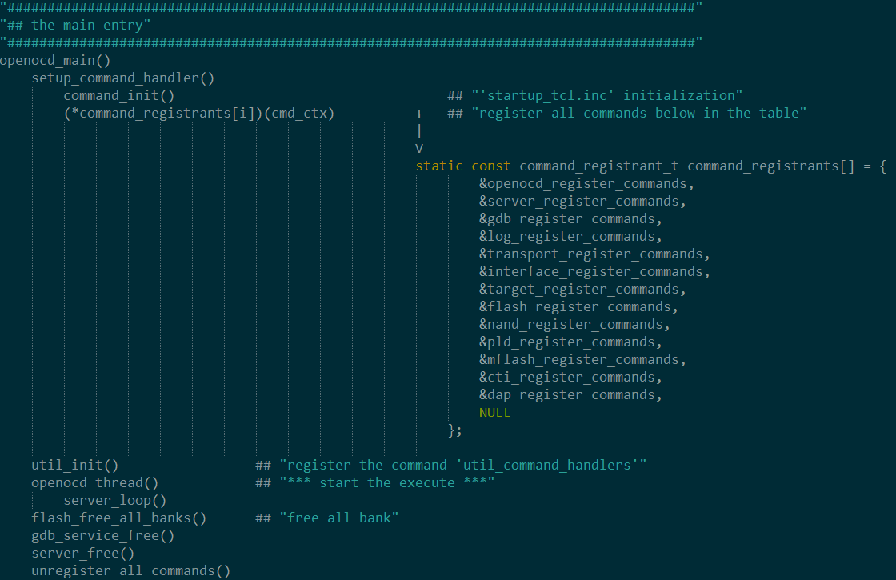

我们以注册trace的handler为例,图[[img:openocd-trace-hdl]]是trace handler的
结构.注意其中的name项与handler项是对应的,Jim模块在查找特定handler的时
候就是通过name来定位.
- 如果 .mode = COMMAND_EXEC 则表明该handler函数是在命令窗中通过输入命
  令才会触发的预注册函数.
- 如果 .mode = COMMAND_CONFIG 则表明该handler函数是在OpenOCD在启动阶段
  解析cfg文件的时候才会触发的预注册函数.
- 如果 .mode = COMMAND_ANY 则表明以上两种情况下都会触发的预注册handler
  函数.
#+caption: OpenOCD Trace Handler
#+name: img:openocd-trace-hdl
#+attr_latex: :placement [H] :width 0.6\textwidth
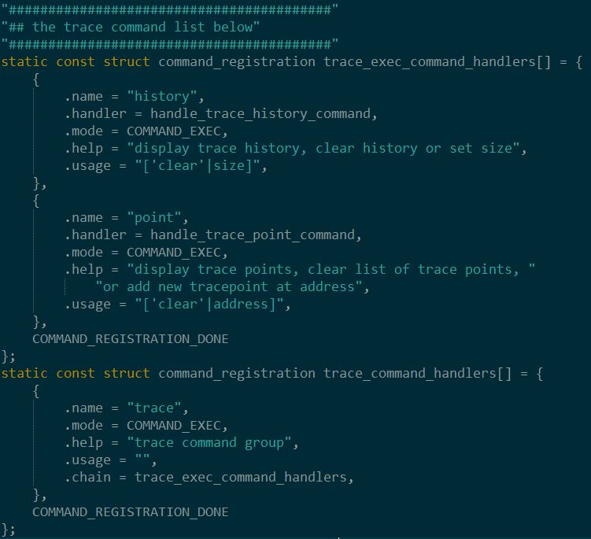
  

图[[img:openocd-hdl-chain]]是command handler经过注册后的拓扑结构图,其中
command_context是一个全局量.如图[[img:openocd-hdl-chain]]所示,所有的
handler是分组链接在一起的.Jim在查找handler的时候,比如查找mflash中的
init,先找到mflash,然后再找到init的.
#+caption: OpenOCD Handler链
#+name: img:openocd-hdl-chain
#+attr_latex: :placement [H] :width 0.6\textwidth
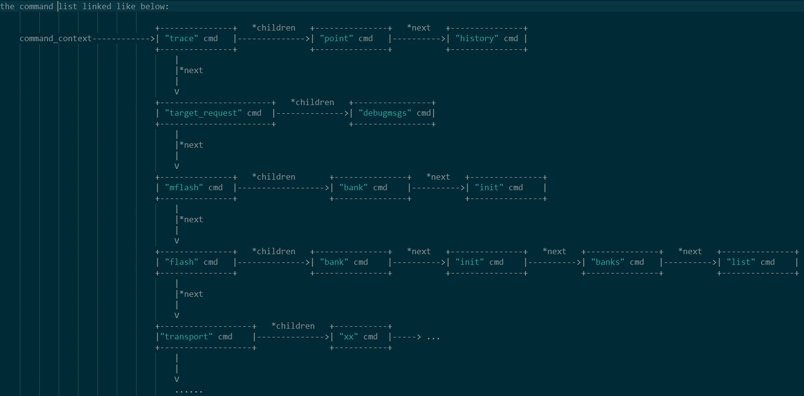

** OpenOCD与GDB的通信
函数server_loop() 调用结构如图[[img-openocd-comm-gdb]]所示, 本身是一个大循
环,接收来自GDB或Telnet等通过socket传过来的数据.调用server->input()对接
收到的数据进行解析,然后再调用特定的函数进行处理.
#+caption: OpenOCD GDB通信
#+name: img-openocd-comm-gdb
#+attr_latex: :placement [H] :width 0.6\textwidth
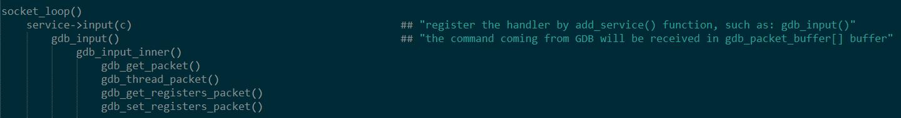

这里可以举几个例子来分析GDB的命令是如何得到执行的:
- 图[[img-openocd-gdb-cmdin]]是设置软件断点的处理逻辑: 其中 "Z0,100310,4"
  是来自GDB发送过来的命令字符串,其中"Z0"表示设置软断点,"0"表示软断点
  (若为"1"则表示硬断点);"100310"为16进制值,表示断点设置的地址,"4"表示
  该地址处的机器码长度为4个字节. "$OK#9a"表示OpenOCD处理完该命令后要反
  馈给GDB的消息. 本文章是基于RISC-V的平台,通过如下图的调用栈可以看到,对
  于软断点的设置,OpenOCD会做两个步骤:首先将要设置的断点处的地址的机器
  码指令读取到OpenOCD中保存起来(通过调用函数riscv_read_memory); 然后将
  软断点的机器码写入到目标系统的内存中去,在RISC-V系统中是将ebreak(4字节)或
  c.ebreak(2字节)的机器码来写入到目标内存中去的(通过调用函数
  riscv_write_memory实现). 当Core运行代码的时候,执行到替换后的break指
  令,就会触发Core会halt住,此时Core就进入debug状态停止下来,等待来自
  OpenOCD的轮询. OpenOCD在处理完来自GDB的命令后,一般都会调用
  gdb_put_packet()函数将处理结果反馈给GDB,反馈的字符串也需要满足GDB对
  于命令格式的要求.
  #+caption: OpenOCD GDB命令处理
  #+name: img-openocd-gdb-cmdin
  #+attr_latex: :placement [H] :width 0.6\textwidth
  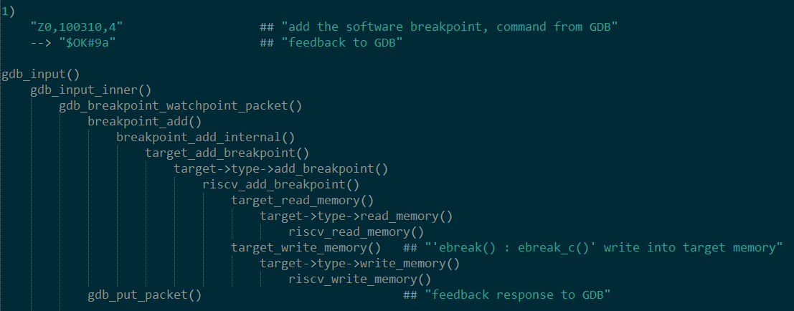
- 删除软件断点的处理逻辑: 如图[[img-openocd-gdb-delb]]是删除软件断点的调用
  栈逻辑,OpenOCD收到来自GDB的命令"z0,100310,4".其中"z0"表示要删除软件
  断点.删除软件断点的处理与添加软件断点的处理逻辑相反.需要将保存在
  OpenOCD中的原地址处的机器码写回到MCU的原位置(通过调用函数
  riscv_remove_breakpoint实现).
  #+caption: OpenOCD GDB删除断点
  #+name: img-openocd-gdb-delb
  #+attr_latex: :placement [H] :width 0.6\textwidth
  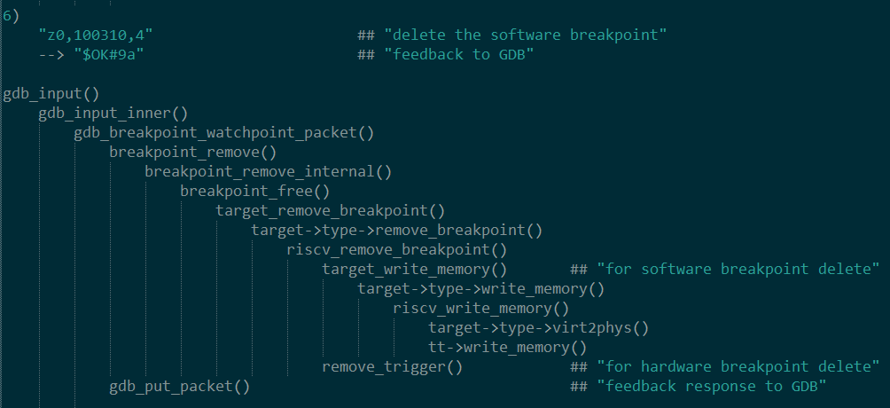
- 这是单步step走的命令处理逻辑.可以根据图[[img-openocd-gdb-step]]中调用栈
  自行分析其代码结构.有一点需要注意的是,在处理代码的最底层,实际调用的
  是dmi_write()或dmi_read()函数.该函数涉及到的是OpenOCD对MCU中Debug
  Module的内部寄存器的访问.
  #+caption: OpenOCD GDB单步
  #+name: img-openocd-gdb-step
  #+attr_latex: :placement [H] :width 0.6\textwidth
  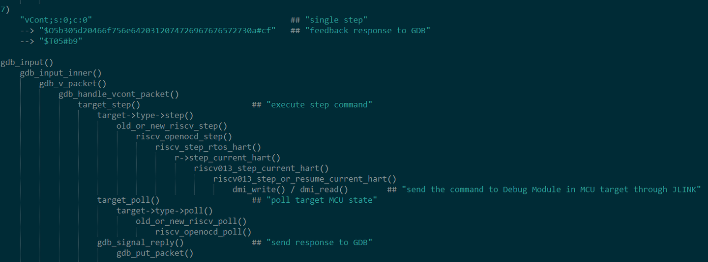
- 读取risc-v的Vector寄存器的值，通过构造两条汇编指令的机器码的方式，将
  结果暂时读取到CPU的s0寄存器中，最终通过DATAn寄存器将数据获取出来,如
  图[[img-openocd-gdb-rreg]]所示。
  #+caption: OpenOCD GDB读寄存器
  #+name: img-openocd-gdb-rreg
  #+attr_latex: :placement [H] :width 0.6\textwidth
  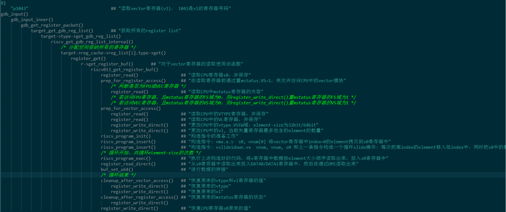
 
** OpenOCD访问Debug Module寄存器
这一部分涉及的内容是与处理器平台相关的,本文主要基于RISC-V平台,但是原理
都是相通的. 一般来讲所有的debug逻辑的处理都是基于对MCU内部寄存器的访问
来实现的.
1. OpenOCD对于RISC-V内部的CSR等寄存器的访问需要借助DTM寄存器来进行访问的.
  当需要访问JTAG寄存器的时候,需要使用如表[[tbl-dtmreg]]中Debug Module
  Interface Access寄存器(addr=0x11)来进行访问.
  #+caption: DTM寄存器
  #+name: tbl-dtmreg
  #+attr_latex: :placement [H]
  |------------------------------------+---------|
  | Name                               | Address |
  |------------------------------------+---------|
  |------------------------------------+---------|
  | BYPASS                             |    0x00 |
  | IDCODE                             |    0x01 |
  | DTM Control&Status(dtmcs)          |    0x10 |
  | Debug Module Interface Access(dmi) |    0x11 |
  | Reserved(BYPASS)                   |    0x12 |
  | Reserved(BYPASS)                   |    0x13 |
  | Reserved(BYPASS)                   |    0x14 |
  | Reserved(BYPASS)                   |    0x15 |
  | Reserved(BYPASS)                   |    0x16 |
  | Reserved(BYPASS)                   |    0x17 |
  | BYPASS                             |    0x1F |
  |------------------------------------+---------|
2. OpenOCD对于DMI寄存器的写访问通过如图[[img-openocd-dmi-form]]所示命令格式.
   #+caption: OpenOCD DMI写格式
   #+name: img-openocd-dmi-form
   #+attr_latex: :placement [H] :width 0.6\textwidth
   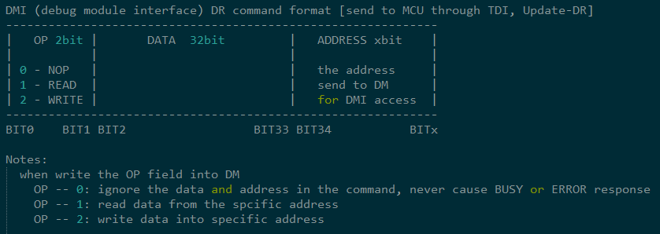
3. 对于DMI寄存器的读访问通过如图[[img-openocd-dmi-rform]]所示命令格式,比如
   要访问RISC-V的mstatus寄存器,首先需要按照下面4,5,6项所描述的那样构造
   abstruct command, 该command中包含mstatus寄存器的index值. 将abstruct
   command寄存器的地址0x17以及刚构造好的abstruct command按照上图显示的
   DR command format重新构造.然后就可以通过transport_write()函数将数据
   发送到MCU的Debug Module中了.
   #+caption: OpenOCD DMI读格式
   #+name: img-openocd-dmi-rform
   #+attr_latex: :placement [H] :width 0.6\textwidth
   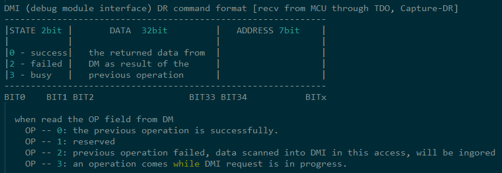
4. 要访问Bus Registers中任一一个寄存器,必须通过上面讲述的Debug Module
   Interface Access来进行间接的访问. 其Bus Register列表如图
   [[img-openocd-busreg]]所示.
   #+caption: OpenOCD Bus寄存器
   #+name: img-openocd-busreg
   #+attr_latex: :placement [H] :width 0.6\textwidth
   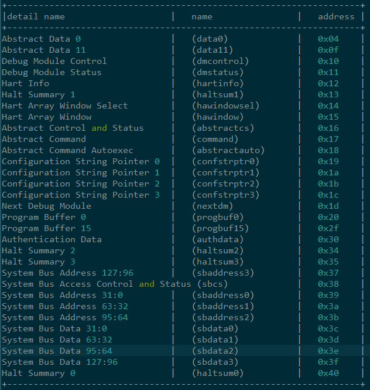
5. 其中"Abstract Command"寄存器在访问其他MCU内部寄存器时比较关键.其结
   构如图[[img-openocd-abs-reg]]所示
   #+caption: OpenOCD Abstract CMD
   #+name: img-openocd-abs-reg
   #+attr_latex: :placement [H] :width 0.6\textwidth
   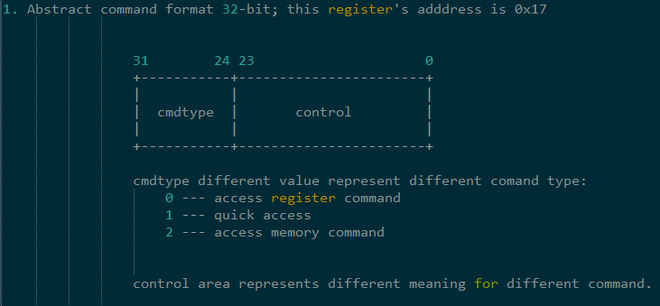
6. 当需要访问MCU内部的特定寄存器的时候,比如需要访问mstatus(RISC-V内部的
   状态寄存器)时,需要首先构造abstract command字段,该字段32位,其中包含
   了要访问的寄存器的index的值. OpenOCD发送给Debug Module后,会触发硬件
   将该寄存器值存放到"Abstract Data 0"寄存器中. OpenOCD只需要直接读取
   即可. 如图[[img-openocd-bugreg-call]]所示是借助Bus Register读取特定寄存
   器的函数调用关系.
   #+caption: OpenOCD Bus寄存器读调用关系
   #+name: img-openocd-bugreg-call
   #+attr_latex: :placement [H] :width 0.6\textwidth
   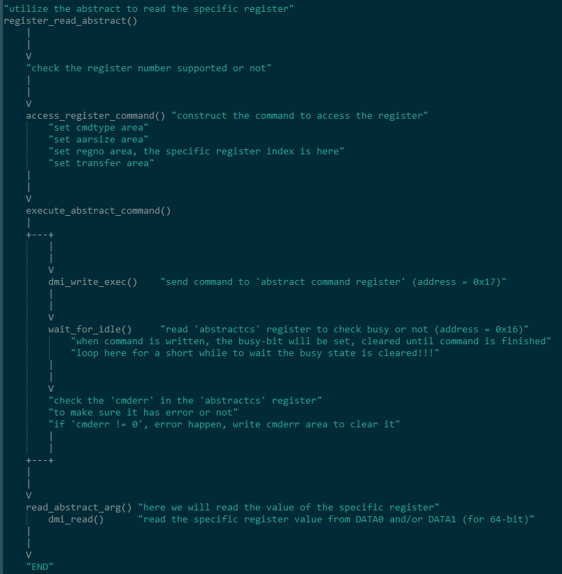
7. 图[[img-openocd-bugreg-wcall]]是写寄存器的调用栈关系.
   #+caption: OpenOCD Bus寄存器写调用关系
   #+name: img-openocd-bugreg-wcall
   #+attr_latex: :placement [H] :width 0.6\textwidth
   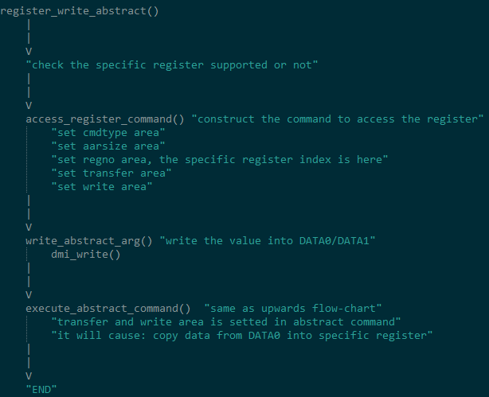
8. 当正常访问MCU内部寄存器的逻辑处理失败后,OpenOCD会启动异常处理流程来
   达到目的.
   

限于篇幅的原因就不再贴调用流程图,简单描述如下:
- 首先OpenOCD需要构造一条汇编指令,该指令的作用是读取寄存器的内容到一个
  特定的MCU寄存器中,比如 csrr s0,mstatus. 该条指令的含义是将RISC-V的
  mstatus寄存器内容读取到s0寄存器中, 它是一个机器码,该机器码包含了源操
  作数和目的操作数.
- 将该机器码发送到Debug Module的bus寄存器progbufn(program buffer
  [n=0~15])中.
- 构造abstract command字段,将该字段发送到"Abstract Comand"寄存器中,触
  发存放在program buffer中的机器码被MCU core获取,从而得到执行,数据存放
  到了s0寄存器中.
- 构造abstract command字段,将该字段发送到"Abstract Comand"寄存器中,触
  发将s0寄存器中的数据拷贝到 "Abstract Data 0"寄存器中.
- OpenOCD直接读取 "Abstract Data 0"寄存器中的数据,从而获取最终需要的寄
  存器中的数据.
** JTAG物理信号的解析
上述所有对寄存器的访问都是通过JTAG的物理引脚来传递信号的.一般的JTAG物
理信号主要包含四个pin脚:
- TCK: 移位时钟引脚
- TMS: TAP (test access point) 的状态机切换信号引脚
- TDI: 数据移位输入
- TDO: 数据移位输出

  
在OpenOCD与Debug Module两侧各维护着一个状态一致的状态机,如图
[[img-openocd-jtagsm]]所示,数据的真正输入输出是在 "SHIFT-DR" 和 "SHIFT-IR"
状态完成的.
#+caption: Jtag状态机
#+name: img-openocd-jtagsm
#+attr_latex: :placement [H] :width 0.6\textwidth
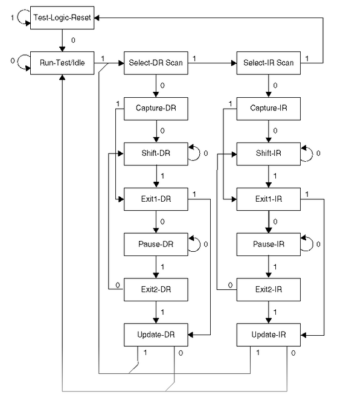

图[[img-openocd-jtag2dm]]是一个传输的例子: 发送0x01地址给Debug Module.
#+caption: Jtag传输DM命令
#+name: img-openocd-jtag2dm
#+attr_latex: :placement [H] :width 0.6\textwidth
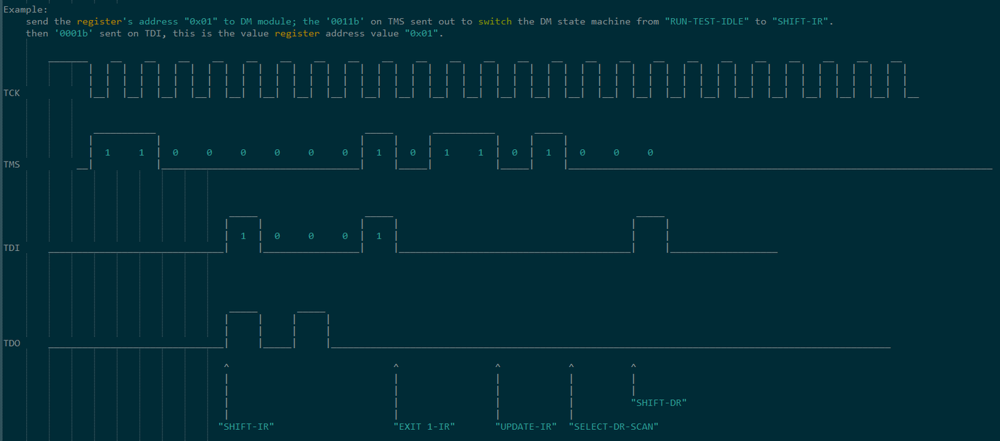
** OpenOCD源代码调试环境的在Ubuntu中的搭建
- 要编译OpenOCD源码需要使用如下命令安装软件包
  #+begin_src shell
    sudo apt-get install gawk gperf grep gettext\
         python python-dev automake bison flex \
         texinfo help2man libtool libtool-bin
  #+end_src
- 使用如下命令下载OpenOCD源代码
  #+begin_src shell
    git clone https://github.com/riscv/riscv-openocd.git
  #+end_src
- 使用如下命令安装ddd调试器
  #+begin_src shell
    sudo apt-get install ddd
  #+end_src
- 按照OpenOCD源代码文件夹下的步骤进行编译,从而生成需要的elf文件,位置在
  xx/riscv-openocd/src/openocd
- 打开一个终端,启动gdbserver运行OpenOCD,命令行如下,其中openocd就是存放
  在src文件下刚刚编译出来的elf文件,此时终端中会显示监听的端口号,该端口
  号需要待会使用.这个监听号是随机的,每次都不一样,这点需要注意
  #+begin_src shell
    gdbserver:0  ./openocd  -f  openocd.cfg
  #+end_src
- 另起一个终端,启动ddd,命令行如下,此时会跳出ddd的调试窗口如图
  [[img-openocddebug]]所示,其中target remote :39097就是刚才的监听端口号.
  
  #+begin_src shell
    ddd --debugger gdb
  #+end_src

  #+caption: OpenOCD软件调试
  #+name: img-openocddebug
  #+attr_latex: :placement [H] :width 0.6\textwidth
  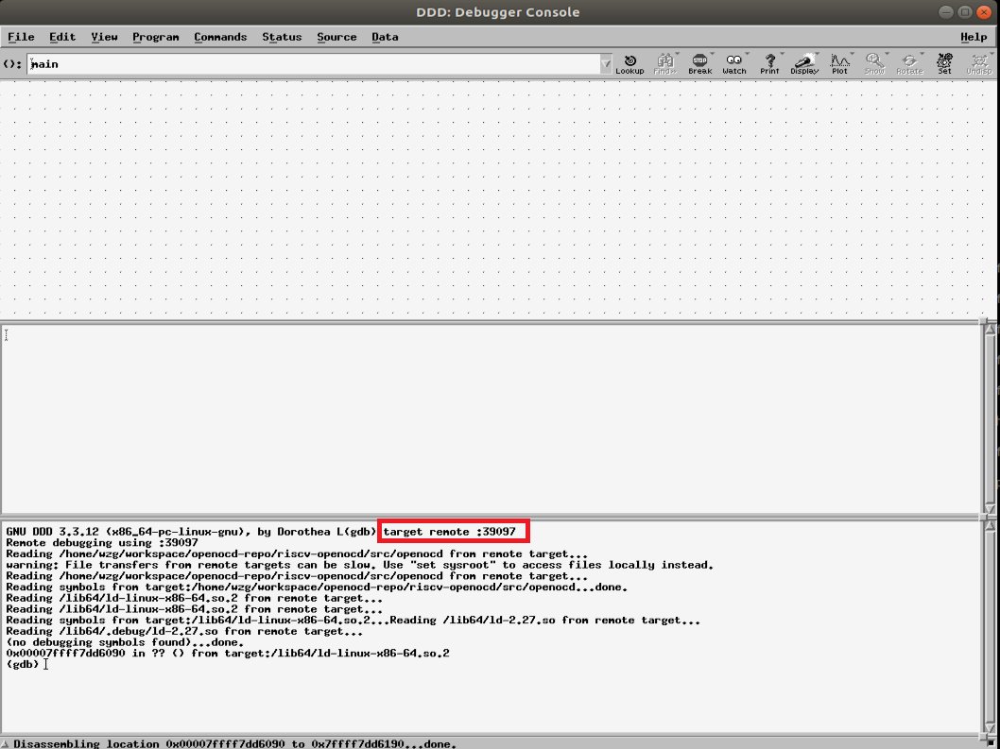
- 在ddd的这个调试窗口中可以输入gdb的各种调试命令
  1. b <line number> 在代码中的某一行设置断点
  2. si 单步调试一行汇编代码
  3. s 单步调试一行C代码
  4. n 继续走下一行
  5. i b 查看设置了多少个断点
  6. d <断点号> 删除特定的断点
  7. c continue继续运行
- 在ddd中调试源代码如图[[img-openocd-ddd-window]]所示,右键点击某个变量,选
  中下拉菜单中的display项,就可以在变量窗口显示某个变量的值.这比在gdb的
  黑漆漆的窗口中使用p命令强多了.而且ddd可以将结构体变量中成员的链接关
  系以图形化的方式显示出来,非常的直观,这是笔者喜欢该调试工具一个地方.
  让寄存器窗口弹出来,选择工具栏中: Status->Registers;查看函数调用栈的
  方式,选择工具栏: Status->Backtrace
  #+caption: OpenOCD ddd调试窗
  #+name: img-openocd-ddd-window
  #+attr_latex: :placement [H] :width 0.6\textwidth
  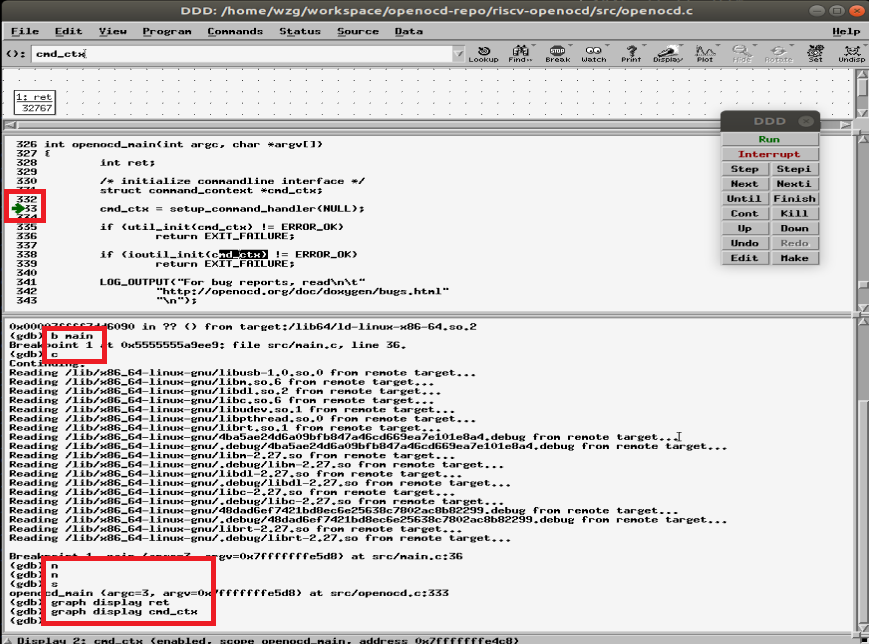
- 上述的步骤只是将OpenOCD启动起来了,在ddd的命令行窗口中输入continue将
  其启动起来,就可以看到OpenOCD的listening端口已经显示出来了.此时需要启
  动risc-v对应的gdb,也就是risc-v的tool-chain中的gdb工具.启动方式很简单,
  直接在新打开的命令行窗口中输入特定的命令,如: riscv32-xxx-elf-gdb即可.
  然后使用target remote :3333就可以建立好GDB和OpenOCD的socket通信了.
  通过riscv-xxx-elf-gdb调试不停的发送特定的调试命令,在ddd中就可以调试
  OpenOCD中收到该命令时的处理动作了.
** 小结
对于OpenOCD源码的分析到这里就基本结束了.其实最关键的部分还是需要对于特
定处理器的Debug Module中各个控制逻辑的熟悉程度.比如设置一个断点到CPU中,需
要设置哪些DM中的寄存器以及按照什么样的逻辑顺序来操作.这些都需要了然于
胸,才能写出健壮的,适配于特定处理器的OpenOCD.

但大部分情况下,我们只需要了解OpenOCD的基本工作原理即可.在了解的基础上,
当JTAG通信工作不正常时可以定位到问题的原因就可以了.在这里扩展的谈谈GDB
与OpenOCD以及Debug-Module之间的互动关系: 在OpenOCD建立起了GDB与
DebugModule之间的通信链路以后,在调试的时候,需要使用GDB将所要调试的ELF
文件进行加载,GDB的加载过程其实分两个主要部分,一个是将ELF文件中的符号表
信息进行提取,这些信息会保留在GDB内部,GDB后续进行单步调试就是依赖与这些
信息的.另一个是将去掉了符号表等信息剩下的binary通过已经建立好的链路下
载到CPU侧. 在开始进行调试的时候,由于GDB内部已经得到了所有符号的信息,代
码从哪个地址开始执行,每行代码所在的地址这些都是知道的.比如单步运行,GDB
只需要发送单步运行的命令即可，单步运行前的起始位置GDB是知道的，单步运
行只不过是运行到下一个位置而已；还比如设置断点到某行代码处，该行代码所
处的地址GDB根据所保留的符号信息是很清楚的，只需要将要设置的断点处的地
址发送给OpenOCD即可，OpenOCD就会将后续的事情处理完毕；OpenOCD其实在整
个过程中除了建立链路外，还起到了一个转译命令的作用，将通信链路两端发送
来的数据通过转译再传递出去.
* OpenOCD 重要结构
** 数据结构
- struct command_context
  #+begin_src c 
    struct command_context {
            Jim_Interp *interp;
            enum command_mode mode;
            struct target *current_target;
        /* The target set by 'targets xx' command or the latest created */
            struct target *current_target_override;
        /* If set overrides current_target
         ,* It happens during processing of
         ,*	1) a target prefixed command
         ,*	2) an event handler
         ,* Pay attention to reentrancy when setting override.
         ,*/
            command_output_handler_t output_handler;
            void *output_handler_priv;
            struct list_head *help_list;
    };
  #+end_src
- enum command_mode
  #+begin_src c 
    enum command_mode {
            COMMAND_EXEC,
            COMMAND_CONFIG,
            COMMAND_ANY,
        /* error condition */
            COMMAND_UNKNOWN = -1, 
    };
  #+end_src
- struct target
  #+begin_src c 
    struct target {
        struct target_type *type; /* target type definition (name, access functions) */
        char *cmd_name;           /* tcl Name of target */
        struct jtag_tap *tap;   /* where on the jtag chain is this */
        int32_t coreid;         /* which device on the TAP? */
        char *current_target_name;

        /** Should we defer examine to later */
        bool defer_examine;

        /**
         ,* Indicates whether this target has been examined.
         ,*
         ,* Do @b not access this field directly, use target_was_examined()
         ,* or target_set_examined().
         ,*/
        bool examined;

        /**
         ,* true if the  target is currently running a downloaded
         ,* "algorithm" instead of arbitrary user code. OpenOCD code
         ,* invoking algorithms is trusted to maintain correctness of
         ,* any cached state (e.g. for flash status), which arbitrary
         ,* code will have no reason to know about.
         ,*/
        bool running_alg;

        struct target_event_action *event_action;

        bool reset_halt; /* attempt resetting the CPU into the halted mode? */
        target_addr_t working_area; /* working area (initialised RAM). Evaluated
                                     ,* upon first allocation from virtual/physical address. */
        bool working_area_virt_spec; /* virtual address specified? */
        target_addr_t working_area_virt; /* virtual address */
        bool working_area_phys_spec; /* physical address specified? */
        target_addr_t working_area_phys; /* physical address */
        uint32_t working_area_size;      /* size in bytes */
        bool backup_working_area; /* whether the content of the working area has to be preserved */
        struct working_area *working_areas; /* list of allocated working areas */
        enum target_debug_reason debug_reason;/* reason why the target entered debug state */
        enum target_endianness endianness;	/* target endianness */
        /* also see: target_state_name() */
        enum target_state state; /* the current backend-state (running, halted, ...) */
        struct reg_cache *reg_cache; /* the first register cache of the target (core regs) */
        struct breakpoint *breakpoints; /* list of breakpoints */
        struct watchpoint *watchpoints; /* list of watchpoints */
        struct trace *trace_info; /* generic trace information */
        struct debug_msg_receiver *dbgmsg; /* list of debug message receivers */
        bool dbg_msg_enabled;              /* debug message status */
        void *arch_info;       /* architecture specific information */
        void *private_config; /* pointer to target specific config data (for jim_configure hook) */
        struct target *next;  /* next target in list */
        bool verbose_halt_msg; /* display async info in telnet session. Do not display
                                ,* lots of halted/resumed info when stepping in debugger. */
        bool halt_issued;     /* did we transition to halted state? */
        int64_t halt_issued_time; /* Note time when halt was issued */

        /* ARM v7/v8 targets with ADIv5 interface */
        bool dbgbase_set;   /* By default the debug base is not set */
        uint32_t dbgbase;	/* Really a Cortex-A specific option, but there is no
                             ,* system in place to support target specific options
                             ,* currently. */
        bool has_dap;        /* set to true if target has ADIv5 support */
        bool dap_configured; /* set to true if ADIv5 DAP is configured */
        bool tap_configured; /* set to true if JTAG tap has been configured
                              ,* through -chain-position */

        struct rtos *rtos; /* Instance of Real Time Operating System support */
        bool rtos_auto_detect; /* A flag that indicates that the RTOS has been specified as "auto"
                                ,* and must be detected when symbols are offered */
        /* Track when next to poll(). If polling is failing, we don't want to
         ,* poll too quickly because we'll just overwhelm the user with error
         ,* messages. */
        struct backoff_timer backoff;
        unsigned int smp;  /* Unique non-zero number for each SMP group */
        struct list_head *smp_targets; /* list all targets in this smp group/cluster
                                        ,* The head of the list is shared between the
                                        ,* cluster, thus here there is a pointer */
        bool smp_halt_event_postponed; /* Some SMP implementations (currently Cortex-M) stores
                                        ,* 'halted' events and emits them after all targets of
                                        ,* the SMP group has been polled */

        /* the gdb service is there in case of smp, we have only one gdb server
         ,* for all smp target
         ,* the target attached to the gdb is changing dynamically by changing
         ,* gdb_service->target pointer */
        struct gdb_service *gdb_service;
        /* file-I/O information for host to do syscall */
        struct gdb_fileio_info *fileio_info;
        char *gdb_port_override; /* target-specific override for gdb_port */
        int gdb_max_connections; /* max number of simultaneous gdb connections */

        /* The semihosting information, extracted from the target. */
        struct semihosting *semihosting;
        bool resethalt_during_init;
        unsigned int etrace_trigger_index;
    };
  #+end_src
- struct command
  #+begin_src c
    struct command {
        char *name;
        command_handler_t handler;
        Jim_CmdProc *jim_handler;
        void *jim_handler_data;
        /* Command handlers can use it for any handler specific data */
        struct target *jim_override_target;
        /* Used only for target of target-prefixed cmd */
        enum command_mode mode;
    };
  #+end_src
- command_handler_t
  #+begin_src c 
    typedef __COMMAND_HANDLER((*command_handler_t));
    #define __COMMAND_HANDLER(name, extra ...) \
                    int name(struct command_invocation *cmd, ## extra)
  #+end_src

** 函数 

* OpenOCD Flash操作
** Flash配置命令
openocd的源码库在“[[https://gitee.com/riscv-mcu/riscv-openocd.git]]”。
我们一般在使能OpenOCD的刷写功能的时候,需要在OpenOCD的cfg文件中添加如下
两条语句:
#+begin_src shell
  $_TARGETNAME configure -work-area-phys 0xaaaaaaaa -work-area-size 0xbbbbbbbb -work-area-backup 0
  flash bank spi_flash fespi 0xcccccccc 0 0 0 $_TARGETNAME 0xdddddddd
#+end_src

这两条语句会在配置参数的同时,注册一系列的handler函数.
对于第一条语句的解析:图[[img-ooflashpara]]是OpenOCD中的代码调用栈
- -work-area-phys字符串后的数字会被解析出来,放入
  target->working_area_phys变量中,该变量存放的是Core上一个物理起始地址,
- -work-area-size后面跟的是未来要以这个物理起始地址开始分配的一个空间
  的大小;
- -work-area-backup决定了是否要对Core上那个空间的数据进行备份(但感觉没
  有大的用处,OpenOCD一般都会做备份动作).

#+caption: Flash配置参数解析
#+name: img-ooflashpara
#+attr_latex: :placement [H] :width 0.6\textwidth
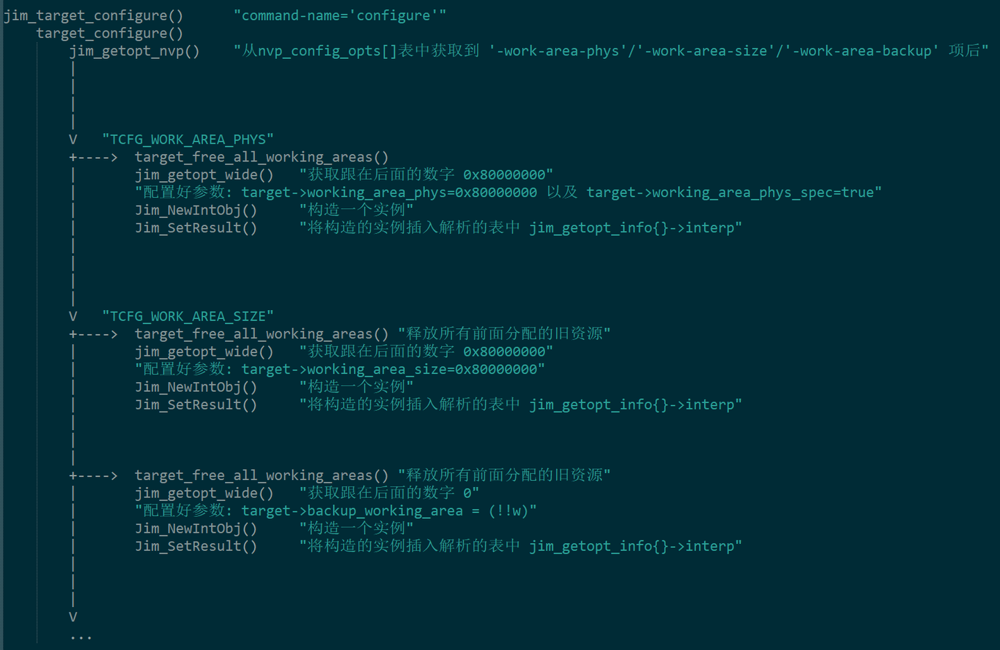

对于第二条语句的解析:OpenOCD在启动的时候注册了一系列的函数handler,主要
分两大类:一类是为了解析config文件中的语句而注册的handler函数,另一类是
为了在OpenOCD运行阶段解析输入进来的命令而注册的handler函数. 可以看到由
于第二条语句中包含"flash bank"字串,因此通过遍历图[[img-ooflashcmdreg]]显示
的定义关系,预先注册的handler函数handle_flash_bank_command()就会被调用
到. 用它来解析第二条语句后续的字段.
#+caption: Flash命令注册
#+name: img-ooflashcmdreg
#+attr_latex: :placement [H] :width 0.6\textwidth
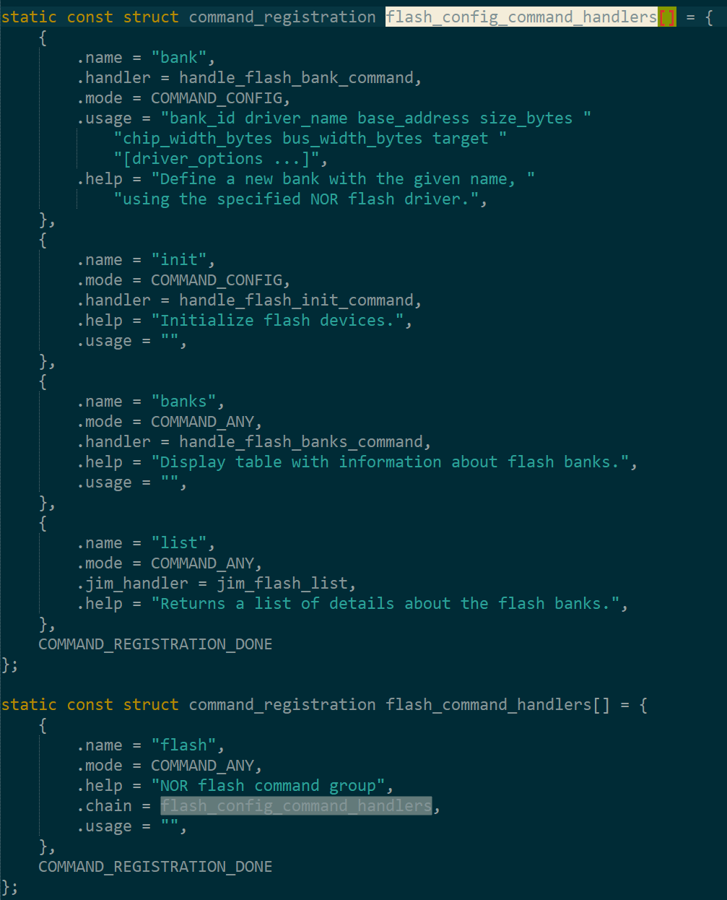

图[[img-ooflashfespi]]是函数handle_flash_bank_command()的调用关系,这里
CMD_ARGV[]中保存的就是第二条语句中的后续字段.依靠字符串"fespi"从全局表
flash_drivers[]中找到对应的flash driver,这个表中包含各种的
flash-driver,是根据名称进行查找的,其中的"&fespi_flash"项就是工作在
RISC-V平台上的项. 找到该项后,通过register_commands()函数将其中的函数进
行注册.在函数的最后,将新建立的flash_bank{}实例加入到全局变量
flash_banks链表中,它的name就是我们在命令里面定义好的"spi_flash",后续要
搜索这个链表时,就是通过name来查找的.
#+caption: FESPI解析
#+name: img-ooflashfespi
#+attr_latex: :placement [H] :width 0.6\textwidth
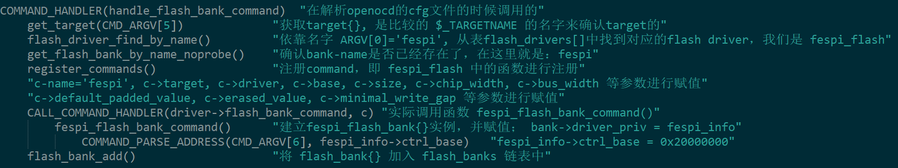
** Flash Handler函数注册
在OpenOCD中会有两类handler函数会被注册,刚才讲的config类的handler函数部
分,到这里就该涉及到flash相关的执行类handler函数的注册了. 因为
flash_exec_command_handlers[]实在太长,只能截取一部分放在这里,而且大
家也注意到了图[[img-hdlreg]]是flash_init_drivers()函数,它里面会对这个数组
进行注册.
#+caption: Handler注册
#+name: img-hdlreg
#+attr_latex: :placement [H] :width 0.6\textwidth
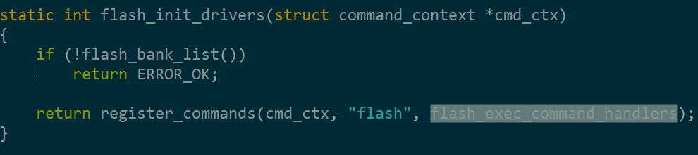

那么flash_init_drivers()函数在哪里被调用呢? 看图[[img-hdltopreg]],
openocd_main()函数已经属于比较顶层的函数了,属于比较早的启动代码了.它做
了两件事情: 一个就是调用setup_command_handler()函数,主要完成对于config
类handler的注册;另一个就是调用openocd_thread()函数开始主线程循环,同时
进行执行handler函数的注册.它会调用handle_init_command()函数,在该函数中
会有专门调用"flash init"字符串相关的handler函数.
#+caption: Handler顶层注册
#+name: img-hdltopreg
#+attr_latex: :placement [H] :width 0.6\textwidth
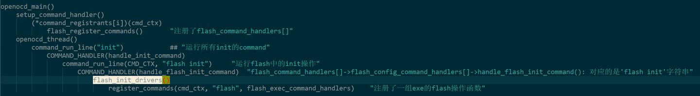

关于handle_flash_init_command()怎么进行注册的一个关系,当然它是在config
类的handler函数注册时就完成的工作.openocd_thread()-->
handle_init_command() --> command_run_line("flash init")的调用关系使得
flash_exec_command_handlers[]中的函数都得到了注册.
** FLASH刷写准备
在开始将image文件中的数据刷写到flash上之前,OpenOCD自己需要完成一个重要
的工作,那就是编译出一个可以运行在目标处理器上的小程序,这个小程序很简单,主
要的逻辑就是操作处理器中关于SPI的一组寄存器,将来自OpenOCD的image数据通
过SPI总线写入到FLASH中. 对于RISC-V平台来讲,目前它是放在这个路径下
的:"riscv-openocd/contrib/loaders/flash/fespi/",它最终会生成两个版本的
binary文件: riscv32_fespi.inc与riscv64_fespi.inc分别对应32位与64位的版
本.这两个bin文件可以在编译OpenOCD工具的时候自动生成,也可以在该目录下手
动编译生成. 打开它里面的Makefile文件,很多的疑问迎刃而解:首先它使用了
"-fPIC"的编译选项,保证了生成出来的代码是与地址无关的,那么不管这个代码
下载到哪个地址边界处,它都是可以正常运行的. 其次它使用了"-Obinary"的选
项,将ELF文件不需要的垃圾信息都清除掉,只留下最小最干净的binary. 最后它
使用了 "-nostdlib"以及"-nostartfiles",因此它自己写了一个很小的入口汇编
文件"riscv_wrapper.S"作为替代.

这样一个干净小巧的可运行在RISC-V平台上代码就完成了.再多说几句关于这个运
行在处理器上的小程序的处理逻辑. 打开它的文件"riscv_wrapper.S"如下图所
示, 因为代码很短我就直接全部贴出来并加以说明: 首先stack的空间它是已经
开辟好了,在程序的入口首先设置好了栈寄存器sp的值,为以后进行函数调用做准
备;在下面截图的第15行进行了函数调用,进入到函数flash_fespi()中,这个函数
是这个片上小程序唯一的主体函数,刷写FLASH的工作就是在这里完成的.注意它
的入口参数有六个,一定要记住,后面我们会讲到. 在图[[img-flstart]]的第16行有
个ebreak指令,这个非常关键. 因为flash_fespi()函数不是个死循环,在完成
flash的刷写工作后,它会从该函数中返回(当然返回时,"a0"寄存器中带回了刷写
过程中的状态). 为了让OpenOCD知道这个刷写的动作已经完成,也为了防止片上
程序乱飞,此处ebreak指令的执行会将当前Core给Halt住,同时切换当前模式为
Debug模式,并等待OpenOCD的垂询.
#+caption: Flashloader启动文件
#+name: img-flstart
#+attr_latex: :placement [H] :width 0.6\textwidth
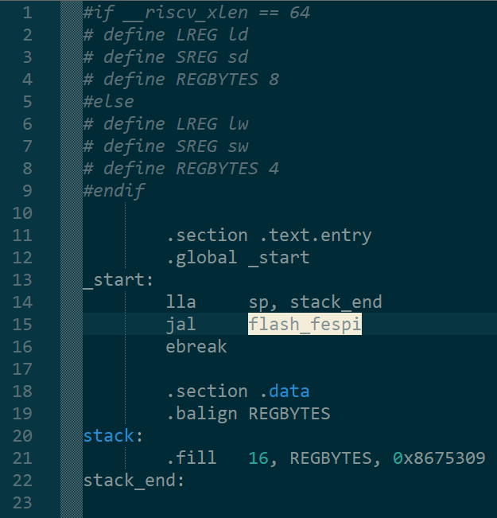

在OpenOCD启动之后,在它的启动Terminal窗口,会显示出
3333/4444/5555三个端口,我们需要使用的是Telnet端口,也就是4444端口.如果
读者不喜欢这个数字,其实是可以自行修改的(如下所示),修改完成后,重新编译
生成OpenOCD即可."riscv-openocd/src/server/telnet_server.c"文件中的
telnet_register_commands()中:telnet_port = strdup("4444");

启动Telnet的命令步骤如下，即可将telnet与OpenOCD建立起通信来,他们之间的
通信连接方式也是socket的方式,同GDB与OpenOCD之间的方式一样的.
- 新开启一个Terminal窗口
- 在窗口中输入命令: "telnet localhost 4444"或者"telnet 127.0.0.1 4444"
** Telnet刷写flash
*** PROBE命令:
首先,需要在Telnet的Terminal窗口中输入如下命令:
#+begin_src shell
  flash probe <bank-number>
#+end_src

此时如果FLASH设备上有对应的bank号,那么就会打印出对应的flash设备的信息.
由该命令的前两个字符串"flash probe", OpenOCD可以找到已注册的handler函
数handle_flash_probe_command(). 该函数的调用栈如图[[img-flashprobe]]所示.
通过CMD_ARGV[0]中存放的bank-name从全局变量flash_banks[]中查找对应的
flash_bank{}实例. 然后从预定义数组target_devices[]中找到对应的项,该项
包含了重要的信息:在CPU-Core上SPI寄存器空间的基地址,后续需要访问CPU上的
SPI总线寄存器都需要根据该基地址.
#+caption: Flash Probe解析
#+name: img-flashprobe
#+attr_latex: :placement [H] :width 0.6\textwidth
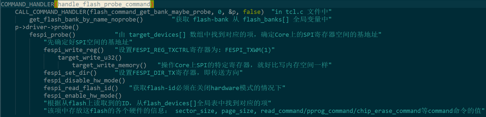

要从target_devices[]数组中找到对应的表项,主要是通过"tap idcode"来查找
的,这个IDCODE就是存放在Debug-Module寄存器中的一个ID寄存器(在RISC-V平台
上,就是IDCODE 0x01寄存器), 存放在target_devices[]数组中的值要与该
IDCODE寄存器中的值一致才可以被搜索到.图[[img-spiflashbanck]]是该数组的内容,
它每一行属于一项内容,每项又有三个element,我们刚才讲的是指第二个element
的值要匹配.那么第三个element就是我们说的"ctrl_base",它就是SPI寄存器域
的基地址,这个信息需要查询相应的CPU的手册才能获得到.该表存放在
riscv-openocd/src/flash/nor/fespi.c文件中.
#+caption: SPIFLASH数据结构
#+name: img-spiflashbanck
#+attr_latex: :placement [H] :width 0.6\textwidth
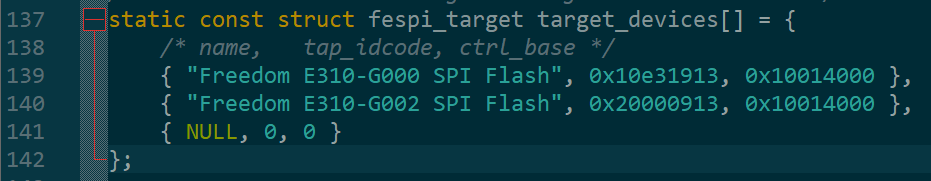

在确定好了SPI的基地址寄存器后,可以看到后续又通过SPI总线访问到FLASH设备
上的信息"flash-id".通过该ID信息与下图表(全局预配置表"flash_devices[]")
中的device_id进行匹配. 该表的内容包含各种FLASH设备的信息,该表存放在
riscv-openocd/src/flash/nor/spi.c文件中,如图[[img-flshinfo]]所示.
#+caption: Flash设备信息
#+name: img-flshinfo
#+attr_latex: :placement [H] :width 0.6\textwidth
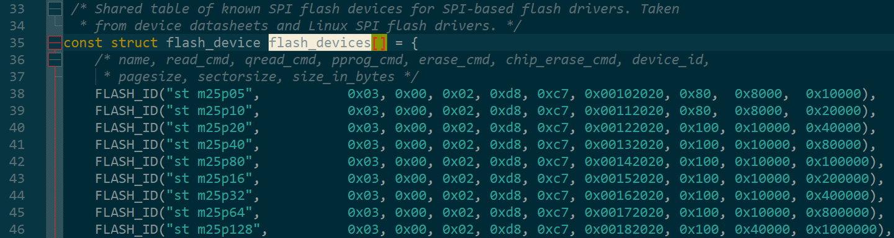
*** WRITE-FLASH命令
在完成第一步的probe后, 就可以开始进行写flash的操作了,它的命令如下:
#+begin_src shell
  flash write_image erase <your-image-file> <address> bin
  # or
  flash write_bank <bank_id> <your-image-file> <offset>
#+end_src
我们就分析 "flash write_bank" 这条命令,另一条命令多了erase的操作,写的
动作其实是一样的. 通过这条命令字串,OpenOCD可以很顺利的找到预注册的
handler函数handle_flash_write_bank_command(),图[[img-fwbank]]是该函数的调
用栈截图,
#+caption: Flash Write Bank调用栈
#+name: img-fwbank
#+attr_latex: :placement [H] :width 0.6\textwidth
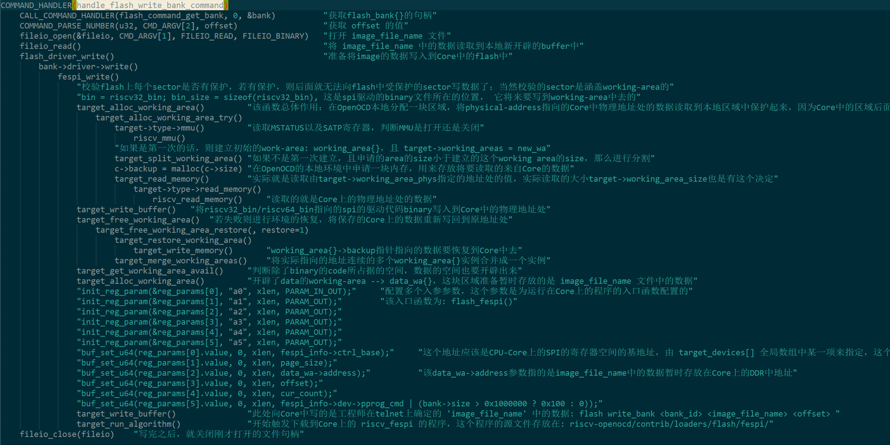

对于函数handle_flash_write_bank_command(),详细分析如下:
- 首先根据传递进来的bank_id通过查找flash_banks[]数组找到匹配项.
- 获取offset的值,该值是相对于bank的offset,未来作为一个目的地址使用的.
- 打开输入的image-file的句柄,并读取到本地新分配的buffer中
- 然后调用flash_driver_write()函数,开始将存放好的image-file中的数据写
  入到特定的flash-bank中.
  

对于flash_driver_write()->fespi_write()函数,详细分析如下:
- 校验flash要写入的bank中的每个sector是否被保护了,若是则无法继续写则返
  回
- 确定好后面要下载的片上运行小程序及其大小: riscv32_bin/riscv64_bin,
  就是预备知识里面讲到的程序
- 调用target_alloc_working_area()函数: 先在OpenOCD中开辟一个buffer,大
  小是要下载的bin的大小.建立相应的管理结构体. 调用函数
  target_read_memory()将Core上由target->working_area_phys指定的地址,由
  target->working_area_size指定大小的这块区域的数据读取到本地刚开辟的
  buffer中,备份起来.
- 调用target_write_buffer()函数,将小程序bin(SPI的驱动代码)写入到
  target->working_area_phys指定的起始地址处.如果写的过程中发生失败,那
  么调用target_free_working_area()函数将备份的数据恢复到Core中去.
- 调用target_get_working_area_avail()函数中,将最终要写入的image-file那
  么大的一块数据这样的空间对应的一个管理实例给开辟出来.
- 再次调用target_alloc_working_area()函数,这次开辟的数据区是为了要下载
  image-file中的数据到FLASH中而分配的,因为先由OpenOCD下载数据到Core的
  working-area中,最后才有片上小程序将working-area中存放的image-file中
  的数据写入到FLASH中去的. 所以Core中的working-area上的这块区间的数据
  也需要备份到OpenOCD的本地buffer中.
- 在调用target_write_buffer()函数写入image-file中的数据之前,首先需要配
  置片上小程序在运行时的那六个入参(这个在预备知识中已经提及).
- 这里就开始调用target_write_buffer()将image-file中的数据写入到Core中
  由configue文件中指定的working-area中了.
- 调用target_run_algorithm()函数,同时把预先配置好的含有六个入参的结构
  发送到Core中去,写入到Core中的a0~a5这六个寄存器中,作为片上小程序在
  "jal flash_fespi"时的入参. 这六个参数包含了SPI寄存器域的基地址,要访
  问的image-file临时存放的物理地址以及它的大小.
- 当片上小程序完成将image-file的数据由working-area通过SPI总线写入到
  FLASH这个过程后,就会从flash_fespi()函数返回后,就会执行"ebreak"指令而
  Halt住.
- 其实target_write_buffer()以及target_run_algorithm()函数都是多次被调
  用的, OpenOCD写入一部分数据到Core中的DDR中,就会触发片上小程序将这一
  部分数据搬移写入到FLASH中,这也是为了避免如果image文件过大,尝试在一次
  搬移中就完成的话,那么写入的时间就会过长,那样可能会出现问题,所以不得
  不切割成多次来处理.
- 在每次运行target_run_algorithm()函数时,OpenOCD都会持续的polling当前
  Debug-Module的状态,如果polling到的状态是"RISCV_HALT_BREAKPOINT",那么
  就表示当前的这次传输完毕了.就可以调整参数进行下一次的传输了. (其实这
  部分在<<RISCV上Semihosting功能浅析>>文章已经涉及到了)
- 完成所有的传输后,分别调用两次target_free_working_area()对备份到
  OpenOCD本地的两个数据区恢复到Core上对应的区间中去. 等于片上小程序以
  及image的缓存区的数据就被覆盖掉了.
*** 校验数据
完成上述的写入操作之后,就是最后一步校验的工作,它的命令如下:  
#+begin_src shell
  flash verify_bank <bank_number> <your-image-file> <offset>
#+end_src
OpenOCD通过命令字串"flash verify_bank"可以找到预注册的handler函数
handle_flash_verify_bank_command(). 它实际的操作很简单就是重新打开
image-file,读出其中的数据,将其与从FLASH中读取的数据进行比较即可.
** 脚本
*** 下载
在Linux下使用c选项可以直接启动openocd后就下载elf文件，Windows下，也可
以同理改成批处理下载elf文件。
#+begin_src shell
  /path/to/openocd -f /path/to/openocd_config.cfg\
  		 -c "program /path/to/file.elf verify exit"
#+end_src
*** 擦除
擦除同理，只是执行的命令不同，如下擦除起始为0x80000000，长度为65536字
节的flash区域。
#+begin_src shell
  /path/to/openocd -f /path/to/openocd_config.cfg\
  		 -c "init;halt;flash erase_address 0x80000000 65536; exit"
#+end_src

** 小结
以上就是对OpenOCD所支持的FLASH烧写逻辑的分析. 可以看到它主要采用了下载
一个片上小程序到CPU上去的方式,由小程序来完成数据的搬移工作. OpenOCD先
将要烧写的image写入到CPU中由cfg文件指定的working-area中,然后由小程序通
过SPI总线写入到FLASH中,所有烧写工作完成后,擦除痕迹!
* OpenOCD脚本
** flash编程
#+begin_src shell
  /bin/openocd -f /xx/openocd.cfg\
  	     -c "init"\
  	     -c "halt"\
  	     -c "echo \"===start program===\""\
  	     -c "program /xxx/xxx.elf"\
  	     -c "verify"\
  	     -c "exit"
#+end_src
** ram编程
#+begin_src shell
  /bin/openocd -f /xx/openocd.cfg\
  	     -c "init"\
  	     -c "halt"\
  	     -c "echo \"===start load===\""\
  	     -c "load_image /xxx/xxx.elf"\
  	     -c "exit"
#+end_src
** mem显示
#+begin_src shell
  /bin/openocd -f /xx/openocd.cfg\
  	     -c "init"\
  	     -c "halt"\
  	     -c "echo \"===display mem===\""\
  	     -c "mdw 0x80000000 8"\
  	     -c "echo \"===display reg===\""\
  	     -c "reg pc"\
  	     -c "exit"
#+end_src
* OpenOCD复位
** SRST
SRST = System Reset，拉低后整机硬件复位；必须先在配置里声明 SRST 硬件
连接，才能手动 / 自动控制引脚电平。使用前必须，先声明 SRST 硬件模式。
- 常用配置
  + 选择复位信号类型
    #+begin_src tcl
      # 只接了SRST（最常用，SWD基本都用这个）
      reset_config srst_only
  
      # SRST + TRST 都接
      # reset_config trst_and_srst
  
      # 没接SRST，只能软件复位
      # reset_config none
    #+end_src
  + 电气驱动模式
    #+begin_src tcl
      # 绝大多数板子：上拉电阻，开漏输出（默认）
      reset_config srst_only srst_open_drain
  
      # 适配器直接推挽驱动，外部无上拉电阻才用
      # reset_config srst_only srst_push_pull
    #+end_src
  + 时序参数: 该设置可以防止复位不稳定
    #+begin_src tcl
      # SRST拉低保持时间（复位脉宽ms）
      adapter srst pulse_width 100
      # SRST释放后等待多久再通信（防抖）
      adapter srst delay 50
    #+end_src
  + 连接方式：常用于复位下连接烧录
    #+begin_src tcl
      # 先拉SRST再连接调试（解决锁死、读不出ID）
      reset_config srst_only srst_nogate connect_assert_srst
      # 默认：先释放SRST再连接
      # srst_nogate：SRST 拉低时依然可以走 JTAG/SWD 通信，必须搭配connect_assert_srst
      # reset_config srst_only connect_deassert_srst
    #+end_src
- 复位命令
  + 复位并立刻暂停 CPU：烧录必备
    #+begin_src tcl
      # 流程：拉低 SRST-> 延时释放->连接调试->CPU 停下
      reset halt
    #+end_src
  + 复位+初始化，不暂停。
    #+begin_src tcl
      reset init
    #+end_src
  + 复位后直接运行
    #+begin_src tcl
      reset run
    #+end_src
*** 控制SRST电平
底层手动控制SRST电平，可以比较精细的控制。
- 通用底层 JTAG 复位接口，所有适配器通用
  #+begin_src tcl
    # 参数：jtag_reset trst srst  1=拉低(assert) 0=释放(deassert)
    # 拉低SRST，保持复位
    jtag_reset 0 1
    sleep 200
    # 释放SRST，退出复位
    jtag_reset 0 0
  #+end_src
- FTDI 类适配器（FT2232/FT4232/DAPLink-FTDI）直接操作信号
  #+begin_src tcl
    # 拉低SRST（assert复位）
    ftdi set_signal nSRST 0
    sleep 100
    # 释放SRST
    ftdi set_signal nSRST 1
    # 高阻态
    # ftdi set_signal nSRST z
  #+end_src
- GPIO 适配器（sysfsgpio）
  #+begin_src tcl
    # 直接控制复位GPIO高低
    gpio set nSRST 0
    sleep 100
    gpio set nSRST 1
  #+end_src
*** 常用配置模板
以下为对于ARM/STM32类SWD，常用配置模板
#+begin_src tcl
  adapter speed 4000
  # SRST配置：开漏、复位可通信、复位下连接
  reset_config srst_only srst_open_drain srst_nogate connect_assert_srst
  adapter srst pulse_width 100
  adapter srst delay 50

  # 手动复位脚本示例
  proc hard_reset {} {
      jtag_reset 0 1
      sleep 150
      jtag_reset 0 0
      sleep 50
  }
#+end_src

