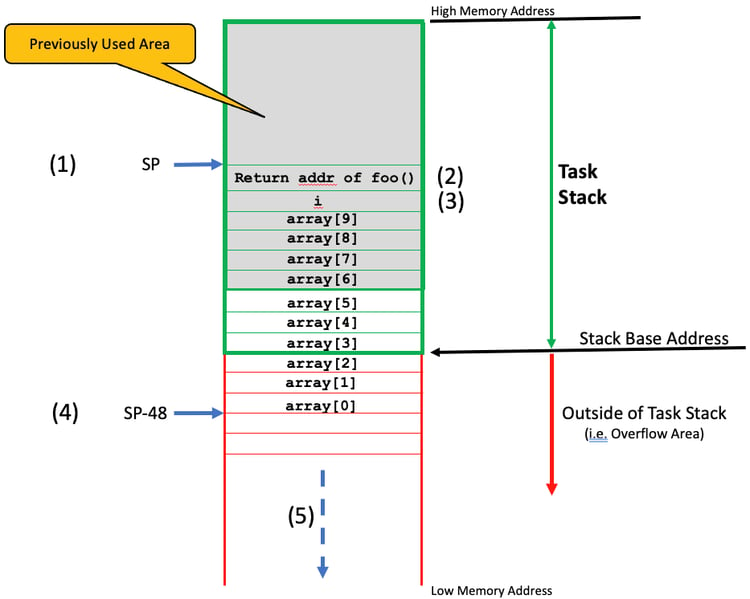

#+title: 基于RTOS的栈溢出
# #+subtitle: 
#+author: Joe
#+latex_class: org-latex-pdf 
#+toc: tables 
#+toc: listings 
#+latex: \clearpage\pagenumbering{arabic} 
#+latex: \AddToShipoutPicture{\BackgroundPicture} 
#+options: h:4 ^:{} 
#+startup: overview

在基于RTOS应用的每个task都要求它自己的栈空间,它的大小取决于task的要求,
如函数调用嵌套,传参多少,本地变量等. 为了防止栈溢出,开发者通常需要过分
配栈空间,当然不用太多,以免浪费RAM空间.
* 什么是栈溢出
图[[img-soflow]]是一个栈溢出的展示,这里假定栈增长是从高地址到低地址.
#+caption: 栈溢出图
#+name: img-soflow
#+attr_latex: :placement [H] :width 0.6\textwidth

1. CPU的SP寄存器指向分配给task的栈内部地址,task即将调用的函数foo()如下.
   #+begin_src c 
     void  foo (void)
     {
         int  i;
         int  array[10];
         // Code
     }
   #+end_src

2. 调用foo()时会触发CPU保存调用者的返回地址到栈空间上,当然取决于CPU和
   编译器.

3. 然后编译器调整SP来适配本地变量(i,array).不幸的是,此时,栈溢出了(SP指
   向了分配给task的栈空间外面),并且foo()函数做的任何事情将损坏超过
   stack base外的任何数据.实际中,依赖于代码的执行流,这个array变量可能
   不会被用到,这种情况下问题不会立即显现.然而, 如果foo()函数调用另外一
   个函数,那将高度可能会触发一些栈外的操作.

4. 如此,当foo()函数开始执行代码时, SP有一个从调用foo()函数时的48字节偏
   移(假定,栈元素是4字节).

5. 我们通常不知道栈外面贮存了什么.它可以是另一个task的栈空间,可以是变
   量,数据结构,数组.复写这里贮存的任何数据会导致奇怪的行为.我们不知道
   且很难预测.实际上, 具体行为可能会没修改代码都不同.
* 如何决定task栈大小
task要求的栈大小是场景决定的,手动计算出栈空间大小是可能的.
1. 所有函数嵌套调用的存储空间;
   + 依赖于CPU架构,一些CPU实际上保存返回地址到一个特定的寄存器(LR),然
     而,这个函数进一步调用其他函数,LR必须让调用者保存到栈上;
   + 函数调用时发生的传参空间要求.参数通常通过CPU寄存器传递, 但是如上,
     如果函数进一步调用其他函数,这些CPU寄存器需要保存到栈上;
   + 函数的本地变量空间要求;
   + 函数内部状态保存操作所需的额外的栈空间;
2. 一个完整的CPU上下文存储空间加FPU寄存器空间;
3. ISR嵌套的完整CPU上下文空间;
4. 这些嵌套ISR需要的本地变量空间.

下面公式可以用于计算一个给定task的栈大小,额外33%的余量空间, 并且此计算
是假定代码实际执行路径是已知的,这通常不太可能.
$$Task_{TotalStackSize}=1.33*(Task_{CallStackSize}+CPU_{Context}+FPU_{Context})$$

特别是, 当想知道调用printf()函数时消耗的栈空间, 是很困难的. 同时, 非直
接的函数调用,如通过函数指针进行调用时更困难.

最后, 应该避免写递归调用的代码, 因为对于这类代码,栈消耗是非确定的或很
难计算.
