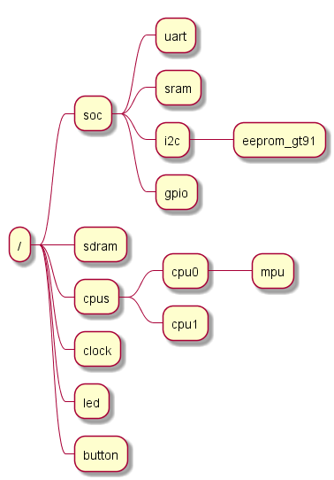

#+title: DTS详解
#+subtitle: Zephyr
#+author: Joe
#+latex_class: org-latex-pdf 
#+toc: tables 
#+toc: listings 
#+latex: \clearpage\pagenumbering{arabic} 
#+latex: \AddToShipoutPicture{\BackgroundPicture} 
#+options: h:4 ^:{} 
#+startup: overview

Devicetree起源于Open Firmware（OF），最开始主要应用于PowerPC架构的计算
机。之后Devicetree在Linux内核中逐渐被采纳，并在各种硬件平台上⼴泛应用。
Devicetree的主要优势在于它可以将硬件描述与驱动程序解耦，使得驱动程序可
以在不同的硬件平台上重用，从而降低了开发和维护成本。嵌⼊式系统通常具有
丰富的硬件设备和定制化的硬件配置，因此Devicetree对于嵌⼊式系统尤为重要。
对于Zephyr这种⽀持多架构和丰富硬件的RTOS来说使用Devicetree也是不⼆选择。
* 概述
Devicetree是一种分层数据结构,主要用于描述硬件，Zephyr将Devicetree作为
其标准组件，在以下两个方面使用Devicetree:
- 向设备驱动模型描述硬件；
- 提供该硬件的初始配置；

  
因此Devicetree既是 Zephyr 的硬件描述语⾔，也是配置语⾔。Zephyr的
Devicetree符合Devicetree的标准spec。Zephyr的Devicetree有两类文件：
- Devicetree源文件：.dts, .dtsi, .overlay，源文件是Devicetree本⾝向设
  备驱动描述硬件和硬件的初始化配置；
- Devicetree绑定文件：.yaml，绑定文件用来描述Devicetree应该有那些内容，
  以及这些内容的数据类型。

Zephyr的构建系统使用 Devicetree 源和绑定来⽣成C宏，⽣成的宏由
devicetree.h 中提供的API 进⾏访问，在驱动和应用中使用这些API就可从
Devicetree中获取硬件信息，如图[[drw-dtstrans]]所示。Zephyr 的驱动程序、应
用程序、测试、内核等代码文件都可以包含和使用devicetree.h
#+begin_src plantuml :exports results :file ./pic/drw-dtstrans.png
  [Devicetree sources] --> [Generated C header]
  [Devicetree bindings] --> [Generated C header]
  [Generated C header] --> [devicetree.h]
  [devicetree.h] --> [zephyr&application source code files]
#+end_src
#+caption: DTS转换
#+name: drw-dtstrans
#+attr_latex: :placement [H] :width 0.6\textwidth
#+results:

* 与Linux Devicetree的差异
两者都使⽤Devicetree作为硬件描述语⾔，基本的Devicetree语法结构⼀致。不
同点如下：
- 处理⼯具和结果：Zephyr使⽤python脚本⽣存C宏, Linux使⽤DTC⽣成DTB。
- 处理时机：Zephyr在编译时处理Devicetree，Linux在运⾏时解析Devicetree
  ⼆进制⽂件。
- 内存使⽤：Zephyr设计⽬标是最小化内存使⽤，编译时优化，没使⽤的信息编
  译时就被去除。Linux内存使⽤相对较⼤，运⾏时保持完整的Devicetree结构。
- 绑定：Zephyr使⽤专⻔的yaml绑定⽂件，解析时⾃动检查，Linux使⽤绑定⽂
  档进⾏描述。
- 动态性：Zephyr主要⽤于静态配置，运⾏时修改能⼒有限。Linux可在运⾏时
  修改Devicetree。
- 配置集成：Zephyr的Devicetree和Kconfig关联。Linux则相对独⽴。
- 访问⽅法：Zephyr通过⽣成C宏访问。Linux使⽤API访问。
* 设计⽬标
Devicetree是Zephyr硬件信息的单⼀来源，Zephyr 的内置设备驱动程序和⽰例
应⽤程序只应从 Devicetree 获取可配置的硬件描述。
- 新的设备驱动程序应使⽤ devicetree.h中的 API 来确定要创建哪些设备。
- Zephyr ⾃带的内⽰例应⽤程序应按照Devicetree中的aliases来使⽤设备。
- 新 SoC 的启动时引脚复⽤和引脚控制应通过基于 Devicetree 的 pinctrl 描
  述来进⾏。

Zephyr中使⽤解析处理Devicetree的⼯具是通⽤的，同样适⽤于其它Devicetree
⽤⼾（例如Linux）
- Zephyr 的 Devicetree 源解析器 dtlib.py 与 dtc 等其他⼯具都源兼容：
  dtlib.py 可以解析 dtc 输出， dtc 也可以解析 dtlib.py 输出。
- Zephyr 的“扩展 dtlib”库 edtlib.py 不应包含 Zephyr 特定的功能。

Zephyr的Devicetree绑定语⾔允许定义Zephyr独有的属性，但不应该⽤来表达仅
在Zephyr中存在的特殊关系。
- 只有构建在 edtlib.py 之上的 gen_defines.py 脚本包含 Zephyr 特定的知
  识和功能。
- 由于绑定语⾔不灵活，Zephyr ⽆法⽀持 Linux ⽀持的全套绑定。
* Devicetree层次结构
Zephyr遵守Devicetree spec，但Devicetree spec涵盖太⼴，这⾥列出理解和创
建Zephyr Devicetree的重点内容，细节再去看spec既可。

Devicetree按照树状结构展开，节点之间的层级关系按下⾯原则安排：
- 硬件的拓扑对应关系（主要参考）
  + led和button连在gpio上，但gpio不是总线，因此led和button都放在/下⾯
  + sdram0是独⽴设备，但不是挂在外设设备总线上，因此也放到/下
  + i2c总线上⼜挂了gt911，因此i2c下有gt911
  + cpu0⾥有mpu，因此mpu的节点放到cpu0下
  + uart,gpio,i2c这些⽚上外设在soc的内部，因此这些节点放到soc下
  + sram在soc内部，因此放到soc下
- 按照硬件从属关系
  + 有外设设备总线从属关系的按总线从属关系
  + 没有设备总线从属关系的设备放根节点下
- 设备的初始化时机
对于clock和cpu来说都要先于soc下其他外设进⾏初始化启动，因此放到/下⾯和
soc同级，如图[[drw-dtslevel]]所示.
#+begin_src plantuml :exports results :file ./pic/drw-dtslevel.png
  @startmindmap
  * /
  ** soc
  *** uart
  *** sram
  *** i2c
  **** eeprom_gt91
  *** gpio
  ** sdram
  ** cpus
  *** cpu0
  **** mpu
  *** cpu1
  ** clock
  ** led
  ** button
  @endmindmap
#+end_src
#+name: drw-dtslevel
#+attr_latex: :placement [H] :width 0.6\textwidth
#+results:

* Devicetree语法基础
** Devicetree基本语法结构
在Zephyr中有三种⽂件都是Devicetree:
- .dts
- .dtsi
- .overlay
.dts会include, .dtsi, Zephyr的脚本会将overlay融合进dts，⼀个典型的dts
⽂件格式如下。
#+begin_src shell
  /dts-v1/
  /{
      a-node{
          a_node_label: a-sub-node {
              foo = <3>;
          };
          b-sub-node {
              foo = <3>;
              bar = <&a_node_label>;
          };
      };
  };
#+end_src

- /dts-v1/ ，指明DeviceTree的版本；Zephyr⽬前
- Devicetree具有唯⼀的根节点 / ；
- 节点的名称写在⼤括号之前。如 a-node 、 a-sub-node 和 another-sub-node ；
- 节点的属性写在⼤括号内，是键值对（Key-Value Pair）的形式。例如 foo = <3>; ；
- ⼦节点写在⽗节点的⼤括号内，以表达树状的层次关系；
- 通过节点路径来唯⼀标识⼀个节点 /a-node/a-sub-node
- 节点⽀持标签，例如 a_node_label ，标签与节点之间⽤冒号 : 连接。
- 标签的作⽤：
  + 简化引⽤：可以⽤a_node_label替代，而不需要使⽤全路径
    /a-node/a-sub-node
  + 引⽤节点：标签允许在Devicetree的其他部分引⽤特定节点
    bar=<&a_node_label>
- ⼀个节点可以有多个标签，例如
  #+begin_src shell
    label1: label2: label3: node-name {
        /* 节点属性 */
    };
  #+end_src
** 节点名
节点命名规则： name@address
- name ：必须以字⺟开头。⻓度在1~31字节。允许⼤小写字⺟、数字、英⽂逗
  号、小数点、加号、减号、下划线；
- @address ：称为「Unit Address」，描述当前节点在其⽗节点的地址空间中
  的地址。如果节点有 reg 属性，则address的值必须与 reg 描述的第⼀个寄
  存器地址相等，可以理解为该设备在总线上的基地址。如果节点没有reg属性，
  节点名中不能出现 @address 。address和reg都是16进制。address不需要写
  0x 前缀，reg的16进制值需要写 0x 前缀。

⽰例:
#+begin_src shell
  #有address
  sram0: memory@3ffb0000 {
      compatible = "mmio-sram";
      reg = < 0x3ffb0000 0x2c200 >;
  };
  #无address
  button0: button_0 {
      gpios = < &gpio0 0x0 0x11 >;
      label = "BOOT Button";
      zephyr,code = < 0xb >;
  };
#+end_src
** 属性
⼀个节点可以有多个属性，属性以键值对的形式存在。属性名可以含⼤小写字⺟、
数字、逗号、小数点、下划线，加号、减号、问号、"#"号。属性的值有各种类
型，Zephyr使⽤表[[tbl-proptype]]中⼏种.
#+caption: 属性类型
#+name: tbl-proptype
#+attr_latex: :placement [H]
|---------------+--------------------------------+------------------------------------------|
| 类型          | 属性⽰例                       | 说明                                     |
|---------------+--------------------------------+------------------------------------------|
|---------------+--------------------------------+------------------------------------------|
| string        | a-string="hello world!";       | 双引号表⽰字符串                         |
|---------------+--------------------------------+------------------------------------------|
| string-array  | a-string-array="string one",   | 字符串数组，字符串之间⽤逗号隔开         |
|               | "string two", "string three";  |                                          |
|---------------+--------------------------------+------------------------------------------|
| int           | 10进制：an-int = <1>;          | 32bit整型，放在尖括号内                  |
|               | 16进制：an-int = <0xab>;       |                                          |
|---------------+--------------------------------+------------------------------------------|
| array         | foo = <0xdeadbeef 1234 0>;     | 数组，值的类型相同，值之间⽤空格隔开     |
|---------------+--------------------------------+------------------------------------------|
| uint8-array   | a-byte-array = [00 01 ab];     | 字节数组，以⼗六进制表⽰，不带0x ，      |
|               |                                | 位于⽅括号之间，值之间以空格隔开         |
|---------------+--------------------------------+------------------------------------------|
| boolean       | my-true-boolean;               | 布尔型。没有值，属性存在时表⽰true，     |
|               |                                | 不存在则表⽰false                        |
|---------------+--------------------------------+------------------------------------------|
| phandle       | a-phandle = <&mynode>;         | 节点引⽤，尖括号中放&节点标签）          |
|---------------+--------------------------------+------------------------------------------|
| phandles      | some-phandles = <&mynode0      | 节点引⽤数组，引⽤之间⽤空格隔开         |
|               | &mynode1 &mynode2>;            |                                          |
|---------------+--------------------------------+------------------------------------------|
| phandle-array | a-phandle-array=<&mynode0 1 2> | 含节点引⽤的混合数组，数组中值的类型不同 |
|               | , <&mynode1 3 4>;              |                                          |
|---------------+--------------------------------+------------------------------------------|

- 64bit的整型⽤array来实现：64 位整数按⼤端顺序写⼊两个 32 bit单元。值
  0xaaaa0000bbbb1111 将被写⼊ <0xaaaa0000 0xbbbb1111>
- 允许使⽤算术表达式： bar = <(2 * (1 << 5))>; 注意：表达式必须⽤括号
  括起来
- 数组，phandles, phandle-array的类型也可以再次作为数组的值，类似于
  string-array，例如：
  #+begin_src shell
    foo = <1 2>, <3 4>; // Okay for 'type: array'
    foo = <&label1 &label2>, <&label3 &label4>; // Okay for 'type: phandles'
    foo = <&label1 1 2>, <&label2 3 4>; // Okay for 'type: phandle-arra
  #+end_src
** 别名和选择节点
通过别名或选择节点也可以达到引⽤指定节点而不需要使⽤节点的全路径
#+begin_src shell
  /dts-v1/;
  / {
      chosen {
          zephyr,console = &uart0;
      };
      aliases {
          my-uart = &uart0;
      };
      soc {
          uart0: serial@12340000 {
              ...
          };
      };
  };
#+end_src

- / 下的 /aliases 和 /chosen 节点并不表⽰实际的硬件设备。
- aliases 的⼦节点⽤于表⽰别名，标签为 uart0 的节点别名为 my-uart
- chosen 的字节点⽤于表⽰选择节点，标签为 uart0 的节点被选作
  zephyr,console 的设备
- 在Zephyr中可以理解chosen是Zephyr OS内预设好的别名，而aliases可以由⽤
  ⼾⾃⼰起名。
** ⽂件包含
为了更好的结构化Devicetree源⽂件，将共⽤的部分抽离出来形成单个dtsi⽂件，
通过include可以直接使⽤，例如对于不同的板级Devicetree:
esp32c3_devkitm.dts 和 esp32c3_luatos_core.dts 由于都使⽤了相同的芯⽚
esp32c3，因此对esp32c3 soc的Devicetree描述被独⽴为⼀个⽂件
esp32c3_mini_n4.dtsi ,⼤家通过include这个⽂件就可以在Devicetree中得到
esp32c3所有的硬件描述了
#include <espressif/esp32c3/esp32c3_mini_n4.dtsi>
此外为了让dts/dtsi更具可读性，Devicetree中属性的值也可以直接引⽤.h中的
宏，例如在ili9xxxx.h中定义了#define ILI9XXX_PIXEL_FORMAT_RGB565 0U ，
通过include这个h⽂件.就可以在Devicetree中引⽤该宏, ⽐起直接写
pixel-format = <0>; 要易读多了。
#+begin_src shell
  #include <zephyr/dt-bindings/display/ili9xxx.h>
  ili9342c: ili9342c@0 {
      compatible = "ilitek,ili9342c";
      mipi-max-frequency = <30000000>;
      reg = <0>;
      vin-supply = <&lcd_bg>;
      pixel-format = <ILI9XXX_PIXEL_FORMAT_RGB565>;
      display-inversion;
      width = <320>;
      height = <240>;
      rotation = <0>;
  };
#+end_src
* Devicetree绑定语法                                                   :TODO:
Zephyr Devicetree绑定是Zephyr特有的，和其它OS不能通⽤。Zephyr
Devicetree绑定⽂件的结构也是树形结构，⼤致如下
* 常⽤标准属性
** compatible
compatible 指定节点所代表硬件设备的名称。推荐的格式是 "vendor,device"，
它的值是⼀个字符串或⼀个字符串数组。 例如
- "avago,apds9960"
- "ti,hdc", "ti,hdc1010"

vendor 是供应商的缩写名称。 zephyr/dts/bindings/vendor-prefixes.txt 中
含有普遍使⽤的 vendor 名称列表。device 部分通常取⾃设备的规格书。有时
候也不⼀定是"vendor,device"，当是通⽤硬件的时候 compatible 可能是下⾯
的值：
- gpio-keys
- mmio-sram
- fixed-clock

Zephyr构建系统通过 compatible 的值来找查找该节点正确的绑定⽂件，例如
compatible= "espressif,esp32-timer" 就会找到
zephyr/dts/bindings/counter/espressif,esp32-timer.yaml 绑定⽂件。同时
Zephyr的驱动会与compatible关联，当compatible是数组时，Zephyr会按顺序寻
找关联驱动，并使⽤最先找到的驱动。
** reg
reg 给出设备的寻址信息，其值由⼀个或多个“register block”组成，
“register block”的格式为 (address, length) 这⾥address和length都是由
32bit数组成,具体有多少个32bit单元取决于其⽗节点的 #address-cells 和
#size-cells 属性。
#+begin_src shell
  soc {
      #address-cells = < 0x1 >;
      #size-cells = < 0x1 >;
      compatible = "simple-bus";
      interrupt-parent = < &nvic >;
      ranges;
      i3c0: i3c@36000 {
          compatible = "nxp,mcux-i3c";
          reg = < 0x36000 0x1000 >;
          interrupts = < 0x31 0x0 >;
          clocks = < &clkctl1 0x600 >;
          clk-divider = < 0xc >;
          clk-divider-slow = < 0x1 >;
          clk-divider-tc = < 0x1 >;
          status = "okay";
          #address-cells = < 0x3 >;
          #size-cells = < 0x0 >;
          pinctrl-0 = < &pinmux_i3c >;
          pinctrl-names = "default";
          i2c-scl-hz = < 0x61a80 >;
          i3c-scl-hz = < 0x61a80 >;
          i3c-od-scl-hz = < 0x61a80 >;
          lps22hh0: lps22hh@5d0000020800b30000 {
              compatible = "st,lps22hh";
              reg = < 0x5d 0x208 0xb30000 >;
              status = "okay";
          };
      };
  }
#+end_src

- soc的#address-cells为1,size-cells为1,其⼦节点i3c0的reg为<0x36000
  0x1000>
  + 1个单元的address，i3c0的寄存器组基地址为0x36000
  + 1个单元的size，i3c0的寄存器组⻓度为0x1000
- i3c0 的#address-cells为3, size-cells为0, 其⼦节点lps22hh0的reg为
  <0x5d 0x208 0xb30000>
  + 3个单元的address,表⽰ lps22hh0 在i3c上的地址为
    0x5d0000020800b30000, 按⼤端⽅式组合
  + 0个单元的size

reg 的值也可以是多个 (address, length) 对,例如
#+begin_src shell
  soc {
      #address-cells = < 0x1 >;
      #size-cells = < 0x1 >;
      compatible = "simple-bus";
      pcc: clock-controller@4000d000 {
          compatible = "nuvoton,npcx-pcc";
          /* Cells for bus type, clock control reg and bit */
          #clock-cells = <3>;
          /* First reg region is Power Management Controller */
          /* Second reg region is Core Domain Clock Generator */
          reg = <0x4000d000 0x2000 0x400b5000 0x2000>;
          reg-names = "pmc", "cdcg";
      };
  }
#+end_src

- soc的#address-cells为1,size-cells为1,其⼦节点pcc的reg为
  <0x4000d000 0x2000 0x400b5000 0x2000>表⽰ppc在soc的总线上占有两个寄
  存器组
  + ⼀组的寄存器基地址为0x4000d000,⻓度为0x2000
  + 另⼀组的寄存器基地址为0x400b5000,⻓度为0x2000

以下是常⻅reg的adress和size模式
- 内存映射 I/O 寄存器访问的设备: address是该设备在⽗节点的基地址，
  length 是寄存器占⽤的字节数
- I2C 设备：address就算I2C 设备的地址，length为0
- SPI 设备：address是⽚选的index，length为0
** ranges
ranges 属性是⽤来定义地址映射，描述了⼦地址空间如何映射到⽗地址空间，
使⽤ranges后，⼦节点就可以使⽤相对地址。ranges 有两种格式:
- 当 ranges 属性存在但没有值，表⽰⼦地址空间和⽗地址空间是⼀对⼀映射，
  也就是⽤绝对地址
- ranges=<子地址 父地址 长度> 表⽰⼦地址被映射到⽗地址上。
  + ranges = <0x0 0x50000000 0x10000000>; 表所⼦地址0~0x10000000被映
    射到了0x50000000~0x60000000
  + ranges 中也允许描述多个映射关系 ranges =
    <0x0 0x10000000 0x500000 0x20000000 0x30000000 0x500000 >; 表⽰⼦
    地址0x0~0x500000被映射到⽗地址0x10000000~0x10500000，⼦地址
    0x20000000~0x20500000被映射到0x30000000~0x30500000

    
实例如下
#+begin_src shell
  peripheral: peripheral@50000000 {
      ranges = < 0x0 0x50000000 0x10000000 >;
      #address-cells = < 0x1 >;
      #size-cells = < 0x1 >;
      clkctl0: clkctl@1000 {
          compatible = "nxp,lpc-syscon";
          reg = < 0x1000 0x1000 >;
          #clock-cells = < 0x1 >;
      };
  };
#+end_src

peripheral的⼦节点地址从0~0x10000000映射到0x50000000~0x60000000，因此
clkctl0寄存器基地址绝对地址应该时0x500001000，寄存器组⻓度时0x1000.
** status
status 属性⽤于描述节点是否启⽤,Devicetree 规范允许此属性具有值
- okay
- disabled
- reserved
- fail
- fail-sss

⽬前Zephyr只会使⽤ okay 和 disabled ；使⽤其他值当前会导致未定义的⾏为。
如果节点的 status 属性为 okay 或未定义（不存在于Devicetree 源中），则
该节点被视为已启⽤.

** intterrupts
interrupts属性是⽤来描述设备的中断信息，格式为interrupts=<中断说明符>。
基本的中断说明符格式：
- interrupts=<中断号> ：例如 interrupts = <3>;
- interrupts=<中断号 触发类型> ：例如 interrupts = <72 4>; ，触发类型
  的取值如下：
  + 上升沿触发
  + 下降沿触发
  + 边沿触发（上升和下降）
  + ⾼电平触发
  + 低电平触发
- 当设备有多个中断时可以写成这样： interrupts = <72 4>, <73 4>, <85 1>;

对于不同的体系结构⼜有不同的说明符格式, 更多可以参考Devicetree 规范版
本 v0.3 中的第2.4 节“中断和中断映射”.
* Zephyr特殊节点
在Zephyr中有⼀些特殊节点，并不是简单的描述硬件信息，其⽤法更像是配置选择。
** chosen
在Zephyr Devicetree详解 Devicetree语法基础⼀⽂提到过 chosen 节点，并不
表⽰实际硬件，⽤于表⽰选择节点。如下：
#+begin_src shell
  chosen {
      zephyr,sram = &sram0;
      zephyr,console = &uart0;
      zephyr,shell-uart = &uart0;
      zephyr,flash = &flash0;
      zephyr,code-partition = &slot0_partition;
      zephyr,bt-hci = &esp32_bt_hci;
  };
#+end_src
在Zephyr的内核，测试程序，⽰例程序中会使⽤预定好的节点名，例如在代码中
shell uart都会使⽤ zephyr,shell-uart , 当相改变shell uart使⽤uart1时只
⽤修改Devicetree为如下即可.
#+begin_src shell
  chosen {
      zephyr,sram = &sram0;
      zephyr,console = &uart0;
      zephyr,shell-uart = &uart1;
      zephyr,flash = &flash0;
      zephyr,code-partition = &slot0_partition;
      zephyr,bt-hci = &esp32_bt_hci;
  };
#+end_src

Zephyr⽀持特定的选择属性如表[[tbl-zspcprop]]所示。
#+caption: Zephyr特定的选择属性
#+name: tbl-zspcprop
#+attr_latex: :placement [H]
|---------------------------+-------------------------------------------------------------------|
| Type 类型                 | Description 描述                                                  |
|---------------------------+-------------------------------------------------------------------|
|---------------------------+-------------------------------------------------------------------|
| zephyr,bt-c2h-uart        | 选择蓝⽛中⽤于主机通信的 UART：HCI UART                           |
| zephyr,bt-mon-uart        | 设置⽤于蓝⽛监控记录的 UART 设备                                  |
| zephyr,bt-hci             | 选择蓝⽛主机堆栈使⽤的 HCI 设备                                   |
| zephyr,canbus             | 设置默认 CAN 控制器                                               |
| zephyr,ccm                | 某些 STM32 SoC 上的Core-Coupled内存节点                           |
| zephyr,code-partition     | Zephyr Image的text section链接到的Flash分区                       |
| zephyr,console            | 设置控制台使⽤的 UART 设备                                        |
| zephyr,display            | 设置默认显⽰控制器                                                |
| zephyr,keyboard-scan      | 设置默认键盘扫描控制器                                            |
| zephyr,dtcm               | 某些 Arm SoC 上的DTCM内存节点                                     |
| zephyr,entropy            | ⽤作系统范围熵源的设备                                            |
| zephyr,flash              | 其reg⽤于设置CONFIG_FLASH_BASE_ADDRESS和CONFIG_FLASH_SIZE的默认值 |
| zephyr,flash-controller   | zephyr,flash对应flash控制器设备的节点                             |
| zephyr,gdbstub-uart       | 设置GDB STUB⼦系统使⽤的 UART 设备                                |
| zephyr,ieee802154         | 为⽹络⼦系统设置 IEEE 802.15.4 设备                               |
| zephyr,ipc                | 为OpenAMP ⼦系统指定 IPC 设备                                     |
| zephyr,ipc_shm            | OpenAMP⼦系统使⽤其reg来确定可⽤于IPC的共享内存的基址和⼤小的节点 |
| zephyr,itcm               | 某些 Arm SoC 上的ITCM内存节点                                     |
| zephyr,log-uart           | 设置⽇志⼦系统的 UART 后端使⽤的 UART 设备                        |
| zephyr,ocm                | Xilinx Zynq-7000 和 ZynqMP SoC 上的⽚上存储器节点                 |
| zephyr,osdp-uart          | 设置 OSDP ⼦系统使⽤的 UART 设备                                  |
| zephyr,ot-uart            | 为 OpenThread Spinel 协议指定 UART 设备                           |
| zephyr,pcie-controller    | PCIe Controller对应的节点                                         |
| zephyr,ppp-uart           | 设置 PPP 使⽤的 UART 设备                                         |
| zephyr,settings-partition | Fixed partition节点。定义后，NVS 和 FCB 使⽤该分区                |
| zephyr,shell-uart         | 设置串⾏ shell 后端使⽤的 UART 设备                               |
| zephyr,sram               | 其reg设置 Zephyr 可⽤的 SRAM 内存的基址和⼤小，在链接期间使⽤     |
| zephyr,tracing-uart       | 设置tracing⼦系统使⽤的 UART 设备                                 |
| zephyr,uart-mcumgr        | 设置Device Management使⽤的 UART 设备                             |
| zephyr,uart-pipe          | 设置串⾏管道pipe使⽤的 UART 设备                                  |
|---------------------------+-------------------------------------------------------------------|
| zephyr,usb-device         | USB设备节点。如果定义并具有vbus-gpios属性,                        |
|                           | 则USB⼦系统将使⽤它们来启⽤/禁⽤ VBUS                             |
|---------------------------+-------------------------------------------------------------------|

** aliases
如果说chosen是Zephyr限定好的节点别名，那么 aliases 就是开放给⽤⼾⾃定
义的节点别名，好处就是硬件修改后只需要变动Devicetree。例如应⽤中通过
sw0访问硬件，按下⾯写法访问的是user_button1
#+begin_src shell
  aliases {
      sw0 = &user_button1;
      i2c-0 = &i2c0;
      watchdog0 = &wdt0;
  };
#+end_src
当我希望使⽤user_button2作为sw0时，修改为sw0 =&user_button2; 即可，而
⽆需改动代码.
** zephyr,user
Zephyr 的 Devicetree 脚本将 zephyr,user 节点作为特殊情况处理：该节点不
⽤绑定（⽆compatible属性），⽤⼾可以在其中放⼊任意的属性并访问它们的值。
当需要⼀些简单的属性时，可以⽤到它。值的注意的是，没有绑定就没有约束，
Devicetree 脚本⽆法检查其属性的正确性，这就隐含的要求⽤⼾知道⾃⼰写的
zephyr,user 中属性和代码中访问该属性之间的约定。zephyr,user ⽀持各种类
型的属性
- 简单值
  #+begin_src shell
    /{
        zephyr,user {
            boolean;
            bytes = [81 82 83];
            number = <23>;
            numbers = <1>, <2>, <3>;
            string = "text";
            strings = "a", "b", "c";
        };
    };
  #+end_src
- 设备
  #+begin_src shell
    / {
        zephyr,user {
            handle = <&gpio0>;
            handles = <&gpio0>, <&gpio1>;
        };
    };
  #+end_src
- GPIOs
  #+begin_src shell
    #include <zephyr/dt-bindings/gpio/gpio.h>
    / {
        zephyr,user {
            signal-gpios = <&gpio0 1 GPIO_ACTIVE_HIGH>;
        };
    };
  #+end_src
* U-BOOT API
** device.h
#+begin_src c 
  /* Returns the operations for a device */
  #define device_get_ops(dev)	((dev)->driver->ops)

  u32 dev_get_flags(const struct udevice *dev);
  void dev_or_flags(const struct udevice *dev, u32 or);
  void dev_bic_flags(const struct udevice *dev, u32 bic);

  static inline __attribute_const__ ofnode dev_ofnode(const struct udevice *dev)

  #define device_active(dev)	(dev_get_flags(dev) & DM_FLAG_ACTIVATED)

  #define dev_set_dma_offset(_dev, _offset)	_dev->dma_offset = _offset
  #define dev_get_dma_offset(_dev)		_dev->dma_offset

  int dev_of_offset(const struct udevice *dev)
  /** 
   ,* @brief 检查node是否存在
   ,* @param dev 
   ,*/
  bool dev_has_ofnode(const struct udevice *dev)
  void dev_set_ofnode(struct udevice *dev, ofnode node)
  int dev_seq(const struct udevice *dev)

  /**
   ,* dev_get_plat() - Get the platform data for a device
   ,*
   ,* This checks that dev is not NULL, but no other checks for now
   ,*
   ,* @dev:	Device to check
   ,* Return: platform data, or NULL if none
   ,*/
  void *dev_get_plat(const struct udevice *dev);

  /**
   ,* dev_get_parent_plat() - Get the parent platform data for a device
   ,*
   ,* This checks that dev is not NULL, but no other checks for now
   ,*
   ,* @dev:	Device to check
   ,* Return: parent's platform data, or NULL if none
   ,*/
  void *dev_get_parent_plat(const struct udevice *dev);

  /**
   ,* dev_get_uclass_plat() - Get the uclass platform data for a device
   ,*
   ,* This checks that dev is not NULL, but no other checks for now
   ,*
   ,* @dev:	Device to check
   ,* Return: uclass's platform data, or NULL if none
   ,*/
  void *dev_get_uclass_plat(const struct udevice *dev);

  /**
   ,* dev_get_priv() - Get the private data for a device
   ,*
   ,* This checks that dev is not NULL, but no other checks for now
   ,*
   ,* @dev:	Device to check
   ,* Return: private data, or NULL if none
   ,*/
  void *dev_get_priv(const struct udevice *dev);

  /**
   ,* dev_get_parent_priv() - Get the parent private data for a device
   ,*
   ,* The parent private data is data stored in the device but owned by the
   ,* parent. For example, a USB device may have parent data which contains
   ,* information about how to talk to the device over USB.
   ,*
   ,* This checks that dev is not NULL, but no other checks for now
   ,*
   ,* @dev:	Device to check
   ,* Return: parent data, or NULL if none
   ,*/
  void *dev_get_parent_priv(const struct udevice *dev);

  /**
   ,* dev_get_uclass_priv() - Get the private uclass data for a device
   ,*
   ,* This checks that dev is not NULL, but no other checks for now
   ,*
   ,* @dev:	Device to check
   ,* Return: private uclass data for this device, or NULL if none
   ,*/
  void *dev_get_uclass_priv(const struct udevice *dev);

  /**
   ,* dev_get_attach_ptr() - Get the value of an attached pointed tag
   ,*
   ,* The tag is assumed to hold a pointer, if it exists
   ,*
   ,* @dev: Device to look at
   ,* @tag: Tag to access
   ,* @return value of tag, or NULL if there is no tag of this type
   ,*/
  void *dev_get_attach_ptr(const struct udevice *dev, enum dm_tag_t tag);

  /**
   ,* dev_get_attach_size() - Get the size of an attached tag
   ,*
   ,* Core tags have an automatic-allocation mechanism where the allocated size is
   ,* defined by the device, parent or uclass. This returns the size associated
   ,* with a particular tag
   ,*
   ,* @dev: Device to look at
   ,* @tag: Tag to access
   ,* @return size of auto-allocated data, 0 if none
   ,*/
  int dev_get_attach_size(const struct udevice *dev, enum dm_tag_t tag);

  /**
   ,* dev_get_parent() - Get the parent of a device
   ,*
   ,* @child:	Child to check
   ,* Return: parent of child, or NULL if this is the root device
   ,*/
  struct udevice *dev_get_parent(const struct udevice *child);

  /**
   ,* dev_get_driver_data() - get the driver data used to bind a device
   ,*
   ,* When a device is bound using a device tree node, it matches a
   ,* particular compatible string in struct udevice_id. This function
   ,* returns the associated data value for that compatible string. This is
   ,* the 'data' field in struct udevice_id.
   ,*
   ,* As an example, consider this structure::
   ,*
   ,*  static const struct udevice_id tegra_i2c_ids[] = {
   ,*      { .compatible = "nvidia,tegra114-i2c", .data = TYPE_114 },
   ,*      { .compatible = "nvidia,tegra20-i2c", .data = TYPE_STD },
   ,*      { .compatible = "nvidia,tegra20-i2c-dvc", .data = TYPE_DVC },
   ,*      { }
   ,*  };
   ,*
   ,* When driver model finds a driver for this it will store the 'data' value
   ,* corresponding to the compatible string it matches. This function returns
   ,* that value. This allows the driver to handle several variants of a device.
   ,*
   ,* For USB devices, this is the driver_info field in struct usb_device_id.
   ,*
   ,* @dev:	Device to check
   ,* Return: driver data (0 if none is provided)
   ,*/
  ulong dev_get_driver_data(const struct udevice *dev);

  /**
   ,* dev_get_driver_ops() - get the device's driver's operations
   ,*
   ,* This checks that dev is not NULL, and returns the pointer to device's
   ,* driver's operations.
   ,*
   ,* @dev:	Device to check
   ,* Return: void pointer to driver's operations or NULL for NULL-dev or NULL-ops
   ,*/
  const void *dev_get_driver_ops(const struct udevice *dev);

  /**
   ,* device_get_uclass_id() - return the uclass ID of a device
   ,*
   ,* @dev:	Device to check
   ,* Return: uclass ID for the device
   ,*/
  enum uclass_id device_get_uclass_id(const struct udevice *dev);

  /**
   ,* dev_get_uclass_name() - return the uclass name of a device
   ,*
   ,* This checks that dev is not NULL.
   ,*
   ,* @dev:	Device to check
   ,* Return:  pointer to the uclass name for the device
   ,*/
  const char *dev_get_uclass_name(const struct udevice *dev);

  /**
   ,* device_get_child() - Get the child of a device by index
   ,*
   ,* Returns the numbered child, 0 being the first. This does not use
   ,* sequence numbers, only the natural order.
   ,*
   ,* @parent:	Parent device to check
   ,* @index:	Child index
   ,* @devp:	Returns pointer to device
   ,* Return:
   ,* 0 if OK, -ENODEV if no such device, other error if the device fails to probe
   ,*/
  int device_get_child(const struct udevice *parent, int index,
                       struct udevice **devp);

  /**
   ,* device_get_child_count() - Get the child count of a device
   ,*
   ,* Returns the number of children to a device.
   ,*
   ,* @parent:	Parent device to check
   ,*/
  int device_get_child_count(const struct udevice *parent);

  /**
   ,* device_get_decendent_count() - Get the total number of decendents of a device
   ,*
   ,* Returns the total number of decendents, including all children
   ,*
   ,* @parent:	Parent device to check
   ,*/
  int device_get_decendent_count(const struct udevice *parent);

  /**
   ,* device_find_child_by_seq() - Find a child device based on a sequence
   ,*
   ,* This searches for a device with the given seq.
   ,*
   ,* @parent: Parent device
   ,* @seq: Sequence number to find (0=first)
   ,* @devp: Returns pointer to device (there is only one per for each seq).
   ,* Set to NULL if none is found
   ,* Return: 0 if OK, -ENODEV if not found
   ,*/
  int device_find_child_by_seq(const struct udevice *parent, int seq,
                               struct udevice **devp);

  /**
   ,* device_get_child_by_seq() - Get a child device based on a sequence
   ,*
   ,* If an active device has this sequence it will be returned. If there is no
   ,* such device then this will check for a device that is requesting this
   ,* sequence.
   ,*
   ,* The device is probed to activate it ready for use.
   ,*
   ,* @parent: Parent device
   ,* @seq: Sequence number to find (0=first)
   ,* @devp: Returns pointer to device (there is only one per for each seq)
   ,* Set to NULL if none is found
   ,* Return: 0 if OK, -ve on error
   ,*/
  int device_get_child_by_seq(const struct udevice *parent, int seq,
                              struct udevice **devp);

  /**
   ,* device_find_child_by_of_offset() - Find a child device based on FDT offset
   ,*
   ,* Locates a child device by its device tree offset.
   ,*
   ,* @parent: Parent device
   ,* @of_offset: Device tree offset to find
   ,* @devp: Returns pointer to device if found, otherwise this is set to NULL
   ,* Return: 0 if OK, -ve on error
   ,*/
  int device_find_child_by_of_offset(const struct udevice *parent, int of_offset,
                                     struct udevice **devp);

  /**
   ,* device_get_child_by_of_offset() - Get a child device based on FDT offset
   ,*
   ,* Locates a child device by its device tree offset.
   ,*
   ,* The device is probed to activate it ready for use.
   ,*
   ,* @parent: Parent device
   ,* @of_offset: Device tree offset to find
   ,* @devp: Returns pointer to device if found, otherwise this is set to NULL
   ,* Return: 0 if OK, -ve on error
   ,*/
  int device_get_child_by_of_offset(const struct udevice *parent, int of_offset,
                                    struct udevice **devp);

  /**
   ,* device_find_global_by_ofnode() - Get a device based on ofnode
   ,*
   ,* Locates a device by its device tree ofnode, searching globally throughout
   ,* the all driver model devices.
   ,*
   ,* The device is NOT probed
   ,*
   ,* @node: Device tree ofnode to find
   ,* @devp: Returns pointer to device if found, otherwise this is set to NULL
   ,* Return: 0 if OK, -ve on error
   ,*/

  int device_find_global_by_ofnode(ofnode node, struct udevice **devp);

  /**
   ,* device_get_global_by_ofnode() - Get a device based on ofnode
   ,*
   ,* Locates a device by its device tree ofnode, searching globally throughout
   ,* the all driver model devices.
   ,*
   ,* The device is probed to activate it ready for use.
   ,*
   ,* @node: Device tree ofnode to find
   ,* @devp: Returns pointer to device if found, otherwise this is set to NULL
   ,* Return: 0 if OK, -ve on error
   ,*/
  int device_get_global_by_ofnode(ofnode node, struct udevice **devp);

  /**
   ,* device_get_by_ofplat_idx() - Get a device based on of-platdata index
   ,*
   ,* Locates a device by either its struct driver_info index, or its
   ,* struct udevice index. The latter is used with OF_PLATDATA_INST, since we have
   ,* a list of build-time instantiated struct udevice records, The former is used
   ,* with !OF_PLATDATA_INST since in that case we have a list of
   ,* struct driver_info records.
   ,*
   ,* The index number is written into the idx field of struct phandle_1_arg, etc.
   ,* It is the position of this driver_info/udevice in its linker list.
   ,*
   ,* The device is probed to activate it ready for use.
   ,*
   ,* @idx: Index number of the driver_info/udevice structure (0=first)
   ,* @devp: Returns pointer to device if found, otherwise this is set to NULL
   ,* Return: 0 if OK, -ve on error
   ,*/
  int device_get_by_ofplat_idx(uint idx, struct udevice **devp);

  /**
   ,* device_find_first_child() - Find the first child of a device
   ,*
   ,* @parent: Parent device to search
   ,* @devp: Returns first child device, or NULL if none
   ,* Return: 0
   ,*/
  int device_find_first_child(const struct udevice *parent,
                              struct udevice **devp);

  /**
   ,* device_find_next_child() - Find the next child of a device
   ,*
   ,* @devp: Pointer to previous child device on entry. Returns pointer to next
   ,*		child device, or NULL if none
   ,* Return: 0
   ,*/
  int device_find_next_child(struct udevice **devp);

  /**
   ,* device_find_first_inactive_child() - Find the first inactive child
   ,*
   ,* This is used to locate an existing child of a device which is of a given
   ,* uclass.
   ,*
   ,* The device is NOT probed
   ,*
   ,* @parent:	Parent device to search
   ,* @uclass_id:	Uclass to look for
   ,* @devp:	Returns device found, if any, else NULL
   ,* Return: 0 if found, else -ENODEV
   ,*/
  int device_find_first_inactive_child(const struct udevice *parent,
                                       enum uclass_id uclass_id,
                                       struct udevice **devp);

  /**
   ,* device_find_first_child_by_uclass() - Find the first child of a device in uc
   ,*
   ,* @parent: Parent device to search
   ,* @uclass_id:	Uclass to look for
   ,* @devp: Returns first child device in that uclass, if any, else NULL
   ,* Return: 0 if found, else -ENODEV
   ,*/
  int device_find_first_child_by_uclass(const struct udevice *parent,
                                        enum uclass_id uclass_id,
                                        struct udevice **devp);

  /**
   ,* device_find_child_by_namelen() - Find a child by device name
   ,*
   ,* @parent:	Parent device to search
   ,* @name:	Name to look for
   ,* @len:	Length of the name
   ,* @devp:	Returns device found, if any
   ,* Return: 0 if found, else -ENODEV
   ,*/
  int device_find_child_by_namelen(const struct udevice *parent, const char *name,
                                   int len, struct udevice **devp);

  /**
   ,* device_find_child_by_name() - Find a child by device name
   ,*
   ,* @parent:	Parent device to search
   ,* @name:	Name to look for
   ,* @devp:	Returns device found, if any
   ,* Return: 0 if found, else -ENODEV
   ,*/
  int device_find_child_by_name(const struct udevice *parent, const char *name,
                                struct udevice **devp);

  /**
   ,* device_first_child_ofdata_err() - Find the first child and reads its plat
   ,*
   ,* The of_to_plat() method is called on the child before it is returned,
   ,* but the child is not probed.
   ,*
   ,* @parent: Parent to check
   ,* @devp: Returns child that was found, if any
   ,* Return: 0 on success, -ENODEV if no children, other -ve on error
   ,*/
  int device_first_child_ofdata_err(struct udevice *parent,
                                    struct udevice **devp);

  /*
   ,* device_next_child_ofdata_err() - Find the next child and read its plat
   ,*
   ,* The of_to_plat() method is called on the child before it is returned,
   ,* but the child is not probed.
   ,*
   ,* @devp: On entry, points to the previous child; on exit returns the child that
   ,*	was found, if any
   ,* Return: 0 on success, -ENODEV if no children, other -ve on error
   ,*/
  int device_next_child_ofdata_err(struct udevice **devp);

  /**
   ,* device_first_child_err() - Get the first child of a device
   ,*
   ,* The device returned is probed if necessary, and ready for use
   ,*
   ,* @parent:	Parent device to search
   ,* @devp:	Returns device found, if any
   ,* Return: 0 if found, -ENODEV if not, -ve error if device failed to probe
   ,*/
  int device_first_child_err(struct udevice *parent, struct udevice **devp);

  /**
   ,* device_next_child_err() - Get the next child of a parent device
   ,*
   ,* The device returned is probed if necessary, and ready for use
   ,*
   ,* @devp: On entry, pointer to device to lookup. On exit, returns pointer
   ,* to the next sibling if no error occurred
   ,* Return: 0 if found, -ENODEV if not, -ve error if device failed to probe
   ,*/
  int device_next_child_err(struct udevice **devp);

  /**
   ,* device_has_children() - check if a device has any children
   ,*
   ,* @dev:	Device to check
   ,* Return: true if the device has one or more children
   ,*/
  bool device_has_children(const struct udevice *dev);

  /**
   ,* device_has_active_children() - check if a device has any active children
   ,*
   ,* @dev:	Device to check
   ,* Return: true if the device has one or more children and at least one of
   ,* them is active (probed).
   ,*/
  bool device_has_active_children(const struct udevice *dev);

  /**
   ,* device_is_last_sibling() - check if a device is the last sibling
   ,*
   ,* This function can be useful for display purposes, when special action needs
   ,* to be taken when displaying the last sibling. This can happen when a tree
   ,* view of devices is being displayed.
   ,*
   ,* @dev:	Device to check
   ,* Return: true if there are no more siblings after this one - i.e. is it
   ,* last in the list.
   ,*/
  bool device_is_last_sibling(const struct udevice *dev);

  /**
   ,* device_set_name() - set the name of a device
   ,*
   ,* This must be called in the device's bind() method and no later. Normally
   ,* this is unnecessary but for probed devices which don't get a useful name
   ,* this function can be helpful.
   ,*
   ,* The name is allocated and will be freed automatically when the device is
   ,* unbound.
   ,*
   ,* @dev:	Device to update
   ,* @name:	New name (this string is allocated new memory and attached to
   ,*		the device)
   ,* Return: 0 if OK, -ENOMEM if there is not enough memory to allocate the
   ,* string
   ,*/
  int device_set_name(struct udevice *dev, const char *name);

  /**
   ,* device_set_name_alloced() - note that a device name is allocated
   ,*
   ,* This sets the DM_FLAG_NAME_ALLOCED flag for the device, so that when it is
   ,* unbound the name will be freed. This avoids memory leaks.
   ,*
   ,* @dev:	Device to update
   ,*/
  void device_set_name_alloced(struct udevice *dev);

  /**
   ,* device_is_compatible() - check if the device is compatible with the compat
   ,*
   ,* This allows to check whether the device is comaptible with the compat.
   ,*
   ,* @dev:	udevice pointer for which compatible needs to be verified.
   ,* @compat:	Compatible string which needs to verified in the given
   ,*		device
   ,* Return: true if OK, false if the compatible is not found
   ,*/
  bool device_is_compatible(const struct udevice *dev, const char *compat);

  /**
   ,* of_machine_is_compatible() - check if the machine is compatible with
   ,*				the compat
   ,*
   ,* This allows to check whether the machine is comaptible with the compat.
   ,*
   ,* @compat:	Compatible string which needs to verified
   ,* Return: true if OK, false if the compatible is not found
   ,*/
  bool of_machine_is_compatible(const char *compat);

  /**
   ,* dev_disable_by_path() - Disable a device given its device tree path
   ,*
   ,* @path:	The device tree path identifying the device to be disabled
   ,* Return: 0 on success, -ve on error
   ,*/
  int dev_disable_by_path(const char *path);

  /**
   ,* dev_enable_by_path() - Enable a device given its device tree path
   ,*
   ,* @path:	The device tree path identifying the device to be enabled
   ,* Return: 0 on success, -ve on error
   ,*/
  int dev_enable_by_path(const char *path);

  /**
   ,* device_is_on_pci_bus - Test if a device is on a PCI bus
   ,*
   ,* @dev:	device to test
   ,* Return:	true if it is on a PCI bus, false otherwise
   ,*/
  static inline bool device_is_on_pci_bus(const struct udevice *dev)
  {
          return dev->parent && device_get_uclass_id(dev->parent) == UCLASS_PCI;
  }

  /**
   ,* device_foreach_child_safe() - iterate through child devices safely
   ,*
   ,* This allows the @pos child to be removed in the loop if required.
   ,*
   ,* @pos: struct udevice * for the current device
   ,* @next: struct udevice * for the next device
   ,* @parent: parent device to scan
   ,*/
  #define device_foreach_child_safe(pos, next, parent)	\
          list_for_each_entry_safe(pos, next, &parent->child_head, sibling_node)

  /**
   ,* device_foreach_child() - iterate through child devices
   ,*
   ,* @pos: struct udevice * for the current device
   ,* @parent: parent device to scan
   ,*/
  #define device_foreach_child(pos, parent)	\
          list_for_each_entry(pos, &parent->child_head, sibling_node)

  /**
   ,* device_foreach_child_of_to_plat() - iterate through children
   ,*
   ,* This stops when it gets an error, with @pos set to the device that failed to
   ,* read ofdata.
   ,*
   ,* This creates a for() loop which works through the available children of
   ,* a device in order from start to end. Device ofdata is read by calling
   ,* device_of_to_plat() on each one. The devices are not probed.
   ,*
   ,* @pos: struct udevice * for the current device
   ,* @parent: parent device to scan
   ,*/
  #define device_foreach_child_of_to_plat(pos, parent)	\
          for (int _ret = device_first_child_ofdata_err(parent, &pos); !_ret; \
               _ret = device_next_child_ofdata_err(&pos))

  /**
   ,* device_foreach_child_probe() - iterate through children, probing them
   ,*
   ,* This creates a for() loop which works through the available children of
   ,* a device in order from start to end. Devices are probed if necessary,
   ,* and ready for use.
   ,*
   ,* This stops when it gets an error, with @pos set to the device that failed to
   ,* probe
   ,*
   ,* @pos: struct udevice * for the current device
   ,* @parent: parent device to scan
   ,*/
  #define device_foreach_child_probe(pos, parent)	\
          for (int _ret = device_first_child_err(parent, &pos); !_ret; \
               _ret = device_next_child_err(&pos))

  /**
   ,* dm_scan_fdt_dev() - Bind child device in the device tree
   ,*
   ,* This handles device which have sub-nodes in the device tree. It scans all
   ,* sub-nodes and binds drivers for each node where a driver can be found.
   ,*
   ,* If this is called prior to relocation, only pre-relocation devices will be
   ,* bound (those marked with bootph-all in the device tree, or where
   ,* the driver has the DM_FLAG_PRE_RELOC flag set). Otherwise, all devices will
   ,* be bound.
   ,*
   ,* @dev:	Device to scan
   ,* Return: 0 if OK, -ve on error
   ,*/
  int dm_scan_fdt_dev(struct udevice *dev);
#+end_src 
** ofnode.h
#+begin_src c
  /**
   ,* oftree_reset() - reset the state of the oftree list
   ,*
   ,* Reset the oftree list so it can be started again. This should be called
   ,* once the control FDT is in place, but before the ofnode interface is used.
   ,*/
  void oftree_reset(void);

  /**
   ,* ofnode_to_fdt() - convert an ofnode to a flat DT pointer
   ,*
   ,* This cannot be called if the reference contains a node pointer.
   ,*
   ,* @node: Reference containing offset (possibly invalid)
   ,* Return: DT offset (can be NULL)
   ,*/
  void *ofnode_to_fdt(ofnode node);

  /**
   ,* ofnode_to_offset() - convert an ofnode to a flat DT offset
   ,*
   ,* This cannot be called if the reference contains a node pointer.
   ,*
   ,* @node: Reference containing offset (possibly invalid)
   ,* Return: DT offset (can be -1)
   ,*/
  int ofnode_to_offset(ofnode node);

  /**
   ,* oftree_from_fdt() - Returns an oftree from a flat device tree pointer
   ,*
   ,* If @fdt is not already registered in the list of current device trees, it is
   ,* added to the list.
   ,*
   ,* @fdt: Device tree to use
   ,*
   ,* Returns: reference to the given node
   ,*/
  oftree oftree_from_fdt(void *fdt);

  /**
   ,* noffset_to_ofnode() - convert a DT offset to an ofnode
   ,*
   ,* @other_node: Node in the same tree to use as a reference
   ,* @of_offset: DT offset (either valid, or -1)
   ,* Return: reference to the associated DT offset
   ,*/
  ofnode noffset_to_ofnode(ofnode other_node, int of_offset);

  /**
   ,* ofnode_to_np() - convert an ofnode to a live DT node pointer
   ,*
   ,* This cannot be called if the reference contains an offset.
   ,*
   ,* @node: Reference containing struct device_node * (possibly invalid)
   ,* Return: pointer to device node (can be NULL)
   ,*/
  static inline struct device_node *ofnode_to_np(ofnode node)

  /**
   ,* ofnode_valid() - check if an ofnode is valid
   ,*
   ,* @node: Reference containing offset (possibly invalid)
   ,* Return: true if the reference contains a valid ofnode, false if not
   ,*/
  static inline bool ofnode_valid(ofnode node)

  /**
   ,* oftree_lookup_fdt() - obtain the FDT pointer from an oftree
   ,*
   ,* This can only be called when flat tree is enabled
   ,*
   ,* @tree: Tree to look at
   ,* @return FDT pointer from the tree
   ,*/
  static inline void *oftree_lookup_fdt(oftree tree)
  /**
   ,* offset_to_ofnode() - convert a DT offset to an ofnode
   ,*
   ,* @of_offset: DT offset (either valid, or -1)
   ,* Return: reference to the associated DT offset
   ,*/
  static inline ofnode offset_to_ofnode(int of_offset)
  /**
   ,* np_to_ofnode() - convert a node pointer to an ofnode
   ,*
   ,* @np: Live node pointer (can be NULL)
   ,* Return: reference to the associated node pointer
   ,*/
  static inline ofnode np_to_ofnode(struct device_node *np)
  /**
   ,* ofnode_is_np() - check if a reference is a node pointer
   ,*
   ,* This function associated that if there is a valid live tree then all
   ,* references will use it. This is because using the flat DT when the live tree
   ,* is valid is not permitted.
   ,*
   ,* @node: reference to check (possibly invalid)
   ,* Return: true if the reference is a live node pointer, false if it is a DT
   ,* offset
   ,*/
  static inline bool ofnode_is_np(ofnode node)
  /**
   ,* ofnode_equal() - check if two references are equal
   ,*
   ,* @ref1: first reference to check (possibly invalid)
   ,* @ref2: second reference to check (possibly invalid)
   ,* Return: true if equal, else false
   ,*/
  static inline bool ofnode_equal(ofnode ref1, ofnode ref2)
  /**
   ,* oftree_valid() - check if an oftree is valid
   ,*
   ,* @tree: Reference containing oftree
   ,* Return: true if the reference contains a valid oftree, false if node
   ,*/
  static inline bool oftree_valid(oftree tree)
  /**
   ,* oftree_null() - Obtain a null oftree
   ,*
   ,* This returns an oftree which points to no tree. It works both with the flat
   ,* tree and livetree.
   ,*/
  static inline oftree oftree_null(void)
  /**
   ,* ofnode_null() - Obtain a null ofnode
   ,*
   ,* This returns an ofnode which points to no node. It works both with the flat
   ,* tree and livetree.
   ,*/
  static inline ofnode ofnode_null(void)
  static inline ofnode ofnode_root(void)
  /**
   ,* ofprop_valid() - check if an ofprop is valid
   ,*
   ,* @prop: Pointer to ofprop to check
   ,* Return: true if the reference contains a valid ofprop, false if not
   ,*/
  static inline bool ofprop_valid(struct ofprop *prop)
  /**
   ,* oftree_default() - Returns the default device tree (U-Boot's control FDT)
   ,*
   ,* Returns: reference to the control FDT
   ,*/
  static inline oftree oftree_default(void)
  /**
   ,* oftree_from_np() - Returns an oftree from a node pointer
   ,*
   ,* @root: Root node of the tree
   ,* Returns: reference to the given node
   ,*/
  static inline oftree oftree_from_np(struct device_node *root)
  /**
   ,* ofnode_name_eq() - Check if the node name is equivalent to a given name
   ,*                    ignoring the unit address
   ,*
   ,* @node:	valid node reference that has to be compared
   ,* @name:	name that has to be compared with the node name
   ,* Return: true if matches, false if it doesn't match
   ,*/
  bool ofnode_name_eq(ofnode node, const char *name);

  /**
   ,* ofnode_read_u8() - Read a 8-bit integer from a property
   ,*
   ,* @node:	valid node reference to read property from
   ,* @propname:	name of the property to read from
   ,* @outp:	place to put value (if found)
   ,* Return: 0 if OK, -ve on error
   ,*/
  int ofnode_read_u8(ofnode node, const char *propname, u8 *outp);

  /**
   ,* ofnode_read_u8_default() - Read a 8-bit integer from a property
   ,*
   ,* @node:	valid node reference to read property from
   ,* @propname:	name of the property to read from
   ,* @def:	default value to return if the property has no value
   ,* Return: property value, or @def if not found
   ,*/
  u8 ofnode_read_u8_default(ofnode node, const char *propname, u8 def);

  /**
   ,* ofnode_read_u16() - Read a 16-bit integer from a property
   ,*
   ,* @node:	valid node reference to read property from
   ,* @propname:	name of the property to read from
   ,* @outp:	place to put value (if found)
   ,* Return: 0 if OK, -ve on error
   ,*/
  int ofnode_read_u16(ofnode node, const char *propname, u16 *outp);

  /**
   ,* ofnode_read_u16_default() - Read a 16-bit integer from a property
   ,*
   ,* @node:	valid node reference to read property from
   ,* @propname:	name of the property to read from
   ,* @def:	default value to return if the property has no value
   ,* Return: property value, or @def if not found
   ,*/
  u16 ofnode_read_u16_default(ofnode node, const char *propname, u16 def);

  /**
   ,* ofnode_read_u32() - Read a 32-bit integer from a property
   ,*
   ,* @node:	valid node reference to read property from
   ,* @propname:	name of the property to read from
   ,* @outp:	place to put value (if found)
   ,* Return: 0 if OK, -ve on error
   ,*/
  int ofnode_read_u32(ofnode node, const char *propname, u32 *outp);

  /**
   ,* ofnode_read_u32_index() - Read a 32-bit integer from a multi-value property
   ,*
   ,* @node:	valid node reference to read property from
   ,* @propname:	name of the property to read from
   ,* @index:	index of the integer to return
   ,* @outp:	place to put value (if found)
   ,* Return: 0 if OK, -ve on error
   ,*/
  int ofnode_read_u32_index(ofnode node, const char *propname, int index,
                            u32 *outp);

  /**
   ,* ofnode_read_s32() - Read a 32-bit integer from a property
   ,*
   ,* @node:	valid node reference to read property from
   ,* @propname:	name of the property to read from
   ,* @outp:	place to put value (if found)
   ,* Return: 0 if OK, -ve on error
   ,*/
  static inline int ofnode_read_s32(ofnode node, const char *propname,s32 *outp)
  /**
   ,* ofnode_read_u32_default() - Read a 32-bit integer from a property
   ,*
   ,* @node:	valid node reference to read property from
   ,* @propname:	name of the property to read from
   ,* @def:	default value to return if the property has no value
   ,* Return: property value, or @def if not found
   ,*/
  u32 ofnode_read_u32_default(ofnode node, const char *propname, u32 def);

  /**
   ,* ofnode_read_u32_index_default() - Read a 32-bit integer from a multi-value
   ,*                                   property
   ,*
   ,* @node:	valid node reference to read property from
   ,* @propname:	name of the property to read from
   ,* @index:	index of the integer to return
   ,* @def:	default value to return if the property has no value
   ,* Return: property value, or @def if not found
   ,*/
  u32 ofnode_read_u32_index_default(ofnode node, const char *propname, int index,u32 def);

  /**
   ,* ofnode_read_s32_default() - Read a 32-bit integer from a property
   ,*
   ,* @node:	valid node reference to read property from
   ,* @propname:	name of the property to read from
   ,* @def:	default value to return if the property has no value
   ,* Return: property value, or @def if not found
   ,*/
  int ofnode_read_s32_default(ofnode node, const char *propname, s32 def);

  /**
   ,* ofnode_read_u64() - Read a 64-bit integer from a property
   ,*
   ,* @node:	valid node reference to read property from
   ,* @propname:	name of the property to read from
   ,* @outp:	place to put value (if found)
   ,* Return: 0 if OK, -ve on error
   ,*/
  int ofnode_read_u64(ofnode node, const char *propname, u64 *outp);

  /**
   ,* ofnode_read_u64_default() - Read a 64-bit integer from a property
   ,*
   ,* @node:	valid node reference to read property from
   ,* @propname:	name of the property to read from
   ,* @def:	default value to return if the property has no value
   ,* Return: property value, or @def if not found
   ,*/
  u64 ofnode_read_u64_default(ofnode node, const char *propname, u64 def);

  /**
   ,* ofnode_read_prop() - Read a property from a node
   ,*
   ,* @node:	valid node reference to read property from
   ,* @propname:	name of the property to read
   ,* @sizep:	if non-NULL, returns the size of the property, or an error code
   ,*              if not found
   ,* Return: property value, or NULL if there is no such property
   ,*/
  const void *ofnode_read_prop(ofnode node, const char *propname, int *sizep);

  /**
   ,* ofnode_read_string() - Read a string from a property
   ,*
   ,* @node:	valid node reference to read property from
   ,* @propname:	name of the property to read
   ,* Return: string from property value, or NULL if there is no such property
   ,*/
  const char *ofnode_read_string(ofnode node, const char *propname);

  /**
   ,* ofnode_read_u32_array() - Find and read an array of 32 bit integers
   ,*
   ,* @node:	valid node reference to read property from
   ,* @propname:	name of the property to read
   ,* @out_values:	pointer to return value, modified only if return value is 0
   ,* @sz:		number of array elements to read
   ,* Return: 0 on success, -EINVAL if the property does not exist,
   ,* -ENODATA if property does not have a value, and -EOVERFLOW if the
   ,* property data isn't large enough
   ,*
   ,* Search for a property in a device node and read 32-bit value(s) from
   ,* it.
   ,*
   ,* The out_values is modified only if a valid u32 value can be decoded.
   ,*/
  int ofnode_read_u32_array(ofnode node, const char *propname,u32 *out_values, size_t sz);

  /**
   ,* ofnode_read_bool() - read a boolean value from a property
   ,* 读取node下的属性propname，如果有返回true，否则false
   ,* 如ofnode_read_bool(node, "gpio-controller")
   ,* @node:	valid node reference to read property from
   ,* @propname:	name of property to read
   ,* Return: true if property is present (meaning true), false if not present
   ,*/
  bool ofnode_read_bool(ofnode node, const char *propname);
  /**
   ,* ofnode_find_subnode() - find a named subnode of a parent node
   ,*
   ,* @node:	valid reference to parent node
   ,* @subnode_name: name of subnode to find
   ,* Return: reference to subnode (which can be invalid if there is no such
   ,* subnode)
   ,*/
  ofnode ofnode_find_subnode(ofnode node, const char *subnode_name);
  /**
   ,* ofnode_is_enabled() - Checks whether a node is enabled.
   ,* This looks for a 'status' property. If this exists, then returns true if
   ,* the status is 'okay' and false otherwise. If there is no status property,
   ,* it returns true on the assumption that anything mentioned should be enabled
   ,* by default.
   ,*
   ,* @node: node to examine
   ,* Return: false (not enabled) or true (enabled)
   ,*/
  bool ofnode_is_enabled(ofnode node);

  /**
   ,* ofnode_first_subnode() - find the first subnode of a parent node
   ,*
   ,* @node:	valid reference to a valid parent node
   ,* Return: reference to the first subnode (which can be invalid if the parent
   ,* node has no subnodes)
   ,*/
  ofnode ofnode_first_subnode(ofnode node);

  /**
   ,* ofnode_next_subnode() - find the next sibling of a subnode
   ,*
   ,* @node:	valid reference to previous node (sibling)
   ,* Return: reference to the next subnode (which can be invalid if the node
   ,* has no more siblings)
   ,*/
  ofnode ofnode_next_subnode(ofnode node);

  /**
   ,* ofnode_get_parent() - get the ofnode's parent (enclosing ofnode)
   ,*
   ,* @node: valid node to look up
   ,* Return: ofnode reference of the parent node
   ,*/
  ofnode ofnode_get_parent(ofnode node);

  /**
   ,* ofnode_get_name() - get the name of a node
   ,* 读取node名字，不是读取flag的名字
   ,* @node: valid node to look up
   ,* Return: name of node (for the root node this is "")
   ,*/
  const char *ofnode_get_name(ofnode node);

  /**
   ,* ofnode_get_path() - get the full path of a node
   ,*
   ,* @node: valid node to look up
   ,* @buf: buffer to write the node path into
   ,* @buflen: buffer size
   ,* Return: 0 if OK, -ve on error
   ,*/
  int ofnode_get_path(ofnode node, char *buf, int buflen);

  /**
   ,* ofnode_get_by_phandle() - get ofnode from phandle
   ,*
   ,* This uses the default (control) device tree
   ,*
   ,* @phandle:	phandle to look up
   ,* Return: ofnode reference to the phandle
   ,*/
  ofnode ofnode_get_by_phandle(uint phandle);

  /**
   ,* oftree_get_by_phandle() - get ofnode from phandle
   ,*
   ,* @tree:	tree to use
   ,* @phandle:	phandle to look up
   ,* Return: ofnode reference to the phandle
   ,*/
  ofnode oftree_get_by_phandle(oftree tree, uint phandle);

  /**
   ,* ofnode_read_size() - read the size of a property
   ,*
   ,* @node: node to check
   ,* @propname: property to check
   ,* Return: size of property if present, or -EINVAL if not
   ,*/
  int ofnode_read_size(ofnode node, const char *propname);

  /**
   ,* ofnode_get_addr_size_index() - get an address/size from a node
   ,*				  based on index
   ,*
   ,* This reads the register address/size from a node based on index
   ,*
   ,* @node: node to read from
   ,* @index: Index of address to read (0 for first)
   ,* @size: Pointer to size of the address
   ,* Return: address, or FDT_ADDR_T_NONE if not present or invalid
   ,*/
  fdt_addr_t ofnode_get_addr_size_index(ofnode node, int index,
                                        fdt_size_t *size);

  /**
   ,* ofnode_get_addr_size_index_notrans() - get an address/size from a node
   ,*					  based on index, without address
   ,*					  translation
   ,*
   ,* This reads the register address/size from a node based on index.
   ,* The resulting address is not translated. Useful for example for on-disk
   ,* addresses.
   ,*
   ,* @node: node to read from
   ,* @index: Index of address to read (0 for first)
   ,* @size: Pointer to size of the address
   ,* Return: address, or FDT_ADDR_T_NONE if not present or invalid
   ,*/
  fdt_addr_t ofnode_get_addr_size_index_notrans(ofnode node, int index,
                                                fdt_size_t *size);

  /**
   ,* ofnode_get_addr_index() - get an address from a node
   ,*
   ,* This reads the register address from a node
   ,*
   ,* @node: node to read from
   ,* @index: Index of address to read (0 for first)
   ,* Return: address, or FDT_ADDR_T_NONE if not present or invalid
   ,*/
  fdt_addr_t ofnode_get_addr_index(ofnode node, int index);

  /**
   ,* ofnode_get_addr() - get an address from a node
   ,*
   ,* This reads the register address from a node
   ,*
   ,* @node: node to read from
   ,* Return: address, or FDT_ADDR_T_NONE if not present or invalid
   ,*/
  fdt_addr_t ofnode_get_addr(ofnode node);

  /**
   ,* ofnode_get_size() - get size from a node
   ,*
   ,* This reads the register size from a node
   ,*
   ,* @node: node to read from
   ,* Return: size of the address, or FDT_SIZE_T_NONE if not present or invalid
   ,*/
  fdt_size_t ofnode_get_size(ofnode node);

  /**
   ,* ofnode_stringlist_search() - find a string in a string list and return index
   ,*
   ,* Note that it is possible for this function to succeed on property values
   ,* that are not NUL-terminated. That's because the function will stop after
   ,* finding the first occurrence of @string. This can for example happen with
   ,* small-valued cell properties, such as #address-cells, when searching for
   ,* the empty string.
   ,*
   ,* @node: node to check
   ,* @propname: name of the property containing the string list
   ,* @string: string to look up in the string list
   ,*
   ,* Return:
   ,*   the index of the string in the list of strings
   ,*   -ENODATA if the property is not found
   ,*   -EINVAL on some other error
   ,*/
  int ofnode_stringlist_search(ofnode node, const char *propname,
                               const char *string);

  /**
   ,* ofnode_read_string_index() - obtain an indexed string from a string list
   ,*
   ,* Note that this will successfully extract strings from properties with
   ,* non-NUL-terminated values. For example on small-valued cell properties
   ,* this function will return the empty string.
   ,*
   ,* If non-NULL, the length of the string (on success) or a negative error-code
   ,* (on failure) will be stored in the integer pointer to by lenp.
   ,*
   ,* @node: node to check
   ,* @propname: name of the property containing the string list
   ,* @index: index of the string to return (cannot be negative)
   ,* @outp: return location for the string
   ,*
   ,* Return:
   ,*   0 if found or -ve error value if not found
   ,*/
  int ofnode_read_string_index(ofnode node, const char *propname, int index,
                               const char **outp);

  /**
   ,* ofnode_read_string_count() - find the number of strings in a string list
   ,*
   ,* @node: node to check
   ,* @property: name of the property containing the string list
   ,* Return:
   ,*   number of strings in the list, or -ve error value if not found
   ,*/
  int ofnode_read_string_count(ofnode node, const char *property);

  /**
   ,* ofnode_read_string_list() - read a list of strings
   ,*
   ,* This produces a list of string pointers with each one pointing to a string
   ,* in the string list. If the property does not exist, it returns {NULL}.
   ,*
   ,* The data is allocated and the caller is reponsible for freeing the return
   ,* value (the list of string pointers). The strings themselves may not be
   ,* changed as they point directly into the devicetree property.
   ,*
   ,* @node: node to check
   ,* @property: name of the property containing the string list
   ,* @listp: returns an allocated, NULL-terminated list of strings if the return
   ,*	value is > 0, else is set to NULL
   ,* Return:
   ,* number of strings in list, 0 if none, -ENOMEM if out of memory,
   ,* -EINVAL if no such property, -EENODATA if property is empty
   ,*/
  int ofnode_read_string_list(ofnode node, const char *property,
                              const char ***listp);

  /**
   ,* ofnode_parse_phandle_with_args() - Find a node pointed by phandle in a list
   ,*
   ,* This function is useful to parse lists of phandles and their arguments.
   ,* Returns 0 on success and fills out_args, on error returns appropriate
   ,* errno value.
   ,*
   ,* Caller is responsible to call of_node_put() on the returned out_args->np
   ,* pointer.
   ,*
   ,* Example:
   ,*
   ,* .. code-block::
   ,*
   ,*   phandle1: node1 {
   ,*       #list-cells = <2>;
   ,*   };
   ,*   phandle2: node2 {
   ,*       #list-cells = <1>;
   ,*   };
   ,*   node3 {
   ,*       list = <&phandle1 1 2 &phandle2 3>;
   ,*   };
   ,*
   ,* To get a device_node of the `node2' node you may call this:
   ,* ofnode_parse_phandle_with_args(node3, "list", "#list-cells", 0, 1, &args);
   ,*
   ,* @node:	device tree node containing a list
   ,* @list_name:	property name that contains a list
   ,* @cells_name:	property name that specifies phandles' arguments count
   ,* @cell_count: Cell count to use if @cells_name is NULL
   ,* @index:	index of a phandle to parse out
   ,* @out_args:	optional pointer to output arguments structure (will be filled)
   ,* Return:
   ,*   0 on success (with @out_args filled out if not NULL), -ENOENT if
   ,*   @list_name does not exist, -EINVAL if a phandle was not found,
   ,*   @cells_name could not be found, the arguments were truncated or there
   ,*   were too many arguments.
   ,*/
  int ofnode_parse_phandle_with_args(ofnode node, const char *list_name,
                                     const char *cells_name, int cell_count,
                                     int index,
                                     struct ofnode_phandle_args *out_args);

  /**
   ,* ofnode_count_phandle_with_args() - Count number of phandle in a list
   ,*
   ,* This function is useful to count phandles into a list.
   ,* Returns number of phandle on success, on error returns appropriate
   ,* errno value.
   ,*
   ,* @node:	device tree node containing a list
   ,* @list_name:	property name that contains a list
   ,* @cells_name:	property name that specifies phandles' arguments count
   ,* @cell_count: Cell count to use if @cells_name is NULL
   ,* Return:
   ,*   number of phandle on success, -ENOENT if @list_name does not exist,
   ,*   -EINVAL if a phandle was not found, @cells_name could not be found.
   ,*/
  int ofnode_count_phandle_with_args(ofnode node, const char *list_name,
                                     const char *cells_name, int cell_count);

  /**
   ,* ofnode_path() - find a node by full path
   ,*
   ,* This uses the control FDT.
   ,*
   ,* @path: Full path to node, e.g. "/bus/spi@1"
   ,* Return: reference to the node found. Use ofnode_valid() to check if it exists
   ,*/
  ofnode ofnode_path(const char *path);

  /**
   ,* oftree_path() - find a node by full path from a root node
   ,*
   ,* @tree: Device tree to use
   ,* @path: Full path to node, e.g. "/bus/spi@1"
   ,* Return: reference to the node found. Use ofnode_valid() to check if it exists
   ,*/
  ofnode oftree_path(oftree tree, const char *path);

  /**
   ,* oftree_root() - get the root node of a tree
   ,*
   ,* @tree: Device tree to use
   ,* Return: reference to the root node
   ,*/
  ofnode oftree_root(oftree tree);

  /**
   ,* ofnode_read_chosen_prop() - get the value of a chosen property
   ,*
   ,* This looks for a property within the /chosen node and returns its value.
   ,*
   ,* This only works with the control FDT.
   ,*
   ,* @propname: Property name to look for
   ,* @sizep: Returns size of property, or  `FDT_ERR_...` error code if function
   ,*	returns NULL
   ,* Return: property value if found, else NULL
   ,*/
  const void *ofnode_read_chosen_prop(const char *propname, int *sizep);

  /**
   ,* ofnode_read_chosen_string() - get the string value of a chosen property
   ,*
   ,* This looks for a property within the /chosen node and returns its value,
   ,* checking that it is a valid nul-terminated string
   ,*
   ,* This only works with the control FDT.
   ,*
   ,* @propname: Property name to look for
   ,* Return: string value if found, else NULL
   ,*/
  const char *ofnode_read_chosen_string(const char *propname);

  /**
   ,* ofnode_get_chosen_node() - get a referenced node from the chosen node
   ,*
   ,* This looks up a named property in the chosen node and uses that as a path to
   ,* look up a code.
   ,*
   ,* This only works with the control FDT.
   ,*
   ,* @propname: Property name to look for
   ,* Return: the referenced node if present, else ofnode_null()
   ,*/
  ofnode ofnode_get_chosen_node(const char *propname);

  /**
   ,* ofnode_read_aliases_prop() - get the value of a aliases property
   ,*
   ,* This looks for a property within the /aliases node and returns its value
   ,*
   ,* This only works with the control FDT.
   ,*
   ,* @propname: Property name to look for
   ,* @sizep: Returns size of property, or `FDT_ERR_...` error code if function
   ,*	returns NULL
   ,* Return: property value if found, else NULL
   ,*/
  const void *ofnode_read_aliases_prop(const char *propname, int *sizep);

  /**
   ,* ofnode_get_aliases_node() - get a referenced node from the aliases node
   ,*
   ,* This looks up a named property in the aliases node and uses that as a path to
   ,* look up a code.
   ,*
   ,* This only works with the control FDT.
   ,*
   ,* @propname: Property name to look for
   ,* Return: the referenced node if present, else ofnode_null()
   ,*/
  ofnode ofnode_get_aliases_node(const char *propname);

  struct display_timing;
  /**
   ,* ofnode_decode_display_timing() - decode display timings
   ,*
   ,* Decode display timings from the supplied 'display-timings' node.
   ,* See doc/device-tree-bindings/video/display-timing.txt for binding
   ,* information.
   ,*
   ,* @node:	'display-timing' node containing the timing subnodes
   ,* @index:	Index number to read (0=first timing subnode)
   ,* @config:	Place to put timings
   ,* Return: 0 if OK, -FDT_ERR_NOTFOUND if not found
   ,*/
  int ofnode_decode_display_timing(ofnode node, int index,
                                   struct display_timing *config);

  /**
   ,* ofnode_decode_panel_timing() - decode display timings
   ,*
   ,* Decode panel timings from the supplied 'panel-timings' node.
   ,*
   ,* @node:	'display-timing' node containing the timing subnodes
   ,* @config:	Place to put timings
   ,* Return: 0 if OK, -FDT_ERR_NOTFOUND if not found
   ,*/
  int ofnode_decode_panel_timing(ofnode node,
                                 struct display_timing *config);

  /**
   ,* ofnode_get_property() - get a pointer to the value of a node property
   ,* 获取node下的属性，如“ofnode_get_property(node, "compatible", &ret)”
   ,* @node: node to read
   ,* @propname: property to read
   ,* @lenp: place to put length on success,如果没有这个属性，*lenp=-1
   ,* Return: pointer to property, or NULL if not found
   ,*/
  const void *ofnode_get_property(ofnode node, const char *propname, int *lenp);
  /**
   ,* ofnode_first_property()- get the reference of the first property
   ,*
   ,* Get reference to the first property of the node, it is used to iterate
   ,* and read all the property with ofprop_get_property().
   ,*
   ,* @node: node to read
   ,* @prop: place to put argument reference
   ,* Return: 0 if OK, -ve on error. -FDT_ERR_NOTFOUND if not found
   ,*/
  int ofnode_first_property(ofnode node, struct ofprop *prop);

  /**
   ,* ofnode_next_property() - get the reference of the next property
   ,*
   ,* Get reference to the next property of the node, it is used to iterate
   ,* and read all the property with ofprop_get_property().
   ,*
   ,* @prop: reference of current argument and place to put reference of next one
   ,* Return: 0 if OK, -ve on error. -FDT_ERR_NOTFOUND if not found
   ,*/
  int ofnode_next_property(struct ofprop *prop);

  /**
   ,* ofnode_for_each_prop() - iterate over all properties of a node
   ,*
   ,* @prop:	struct ofprop
   ,* @node:	node (lvalue, ofnode)
   ,*
   ,* This is a wrapper around a for loop and is used like this::
   ,*
   ,*   ofnode node;
   ,*   struct ofprop prop;
   ,*
   ,*   ofnode_for_each_prop(prop, node) {
   ,*       ...use prop...
   ,*   }
   ,*
   ,* Note that this is implemented as a macro and @prop is used as
   ,* iterator in the loop. The parent variable can be a constant or even a
   ,* literal.
   ,*/
  #define ofnode_for_each_prop(prop, node) \
          for (ofnode_first_property(node, &prop); \
               ofprop_valid(&prop); \
               ofnode_next_property(&prop))

  /**
   ,* ofprop_get_property() - get a pointer to the value of a property
   ,*
   ,* Get value for the property identified by the provided reference.
   ,*
   ,* @prop: reference on property
   ,* @propname: If non-NULL, place to property name on success,
   ,* @lenp: If non-NULL, place to put length on success, or error code on failure
   ,* Return: pointer to property, or NULL if not found
   ,*/
  const void *ofprop_get_property(const struct ofprop *prop,
                                  const char **propname, int *lenp);

  /**
   ,* ofnode_get_addr_size() - get address and size from a property
   ,*
   ,* This does no address translation. It simply reads an property that contains
   ,* an address and a size value, one after the other.
   ,*
   ,* @node: node to read from
   ,* @propname: property to read
   ,* @sizep: place to put size value (on success)
   ,* Return: address value, or FDT_ADDR_T_NONE on error
   ,*/
  fdt_addr_t ofnode_get_addr_size(ofnode node, const char *propname,
                                  fdt_size_t *sizep);

  /**
   ,* ofnode_read_u8_array_ptr() - find an 8-bit array
   ,*
   ,* Look up a property in a node and return a pointer to its contents as a
   ,* byte array of given length. The property must have at least enough data
   ,* for the array (count bytes). It may have more, but this will be ignored.
   ,* The data is not copied.
   ,*
   ,* @node:	node to examine
   ,* @propname:	name of property to find
   ,* @sz:		number of array elements
   ,* Return:
   ,* pointer to byte array if found, or NULL if the property is not found or
   ,* there is not enough data
   ,*/
  const uint8_t *ofnode_read_u8_array_ptr(ofnode node, const char *propname,
                                          size_t sz);

  /**
   ,* ofnode_read_pci_addr() - look up a PCI address
   ,*
   ,* Look at an address property in a node and return the PCI address which
   ,* corresponds to the given type in the form of fdt_pci_addr.
   ,* The property must hold one fdt_pci_addr with a lengh.
   ,*
   ,* @node:	node to examine
   ,* @type:	pci address type (FDT_PCI_SPACE_xxx)
   ,* @propname:	name of property to find
   ,* @addr:	returns pci address in the form of fdt_pci_addr
   ,* Return:
   ,* 0 if ok, -ENOENT if the property did not exist, -EINVAL if the
   ,* format of the property was invalid, -ENXIO if the requested
   ,* address type was not found
   ,*/
  int ofnode_read_pci_addr(ofnode node, enum fdt_pci_space type,
                           const char *propname, struct fdt_pci_addr *addr);

  /**
   ,* ofnode_read_pci_vendev() - look up PCI vendor and device id
   ,*
   ,* Look at the compatible property of a device node that represents a PCI
   ,* device and extract pci vendor id and device id from it.
   ,*
   ,* @node:	node to examine
   ,* @vendor:	vendor id of the pci device
   ,* @device:	device id of the pci device
   ,* Return: 0 if ok, negative on error
   ,*/
  int ofnode_read_pci_vendev(ofnode node, u16 *vendor, u16 *device);

  /**
   ,* ofnode_read_eth_phy_id() - look up eth phy vendor and device id
   ,*
   ,* Look at the compatible property of a device node that represents a eth phy
   ,* device and extract phy vendor id and device id from it.
   ,*
   ,* @node:	node to examine
   ,* @vendor:	vendor id of the eth phy device
   ,* @device:	device id of the eth phy device
   ,* Return:	 0 if ok, negative on error
   ,*/
  int ofnode_read_eth_phy_id(ofnode node, u16 *vendor, u16 *device);

  /**
   ,* ofnode_read_addr_cells() - Get the number of address cells for a node
   ,*
   ,* This walks back up the tree to find the closest #address-cells property
   ,* which controls the given node.
   ,*
   ,* @node: Node to check
   ,* Return: number of address cells this node uses
   ,*/
  int ofnode_read_addr_cells(ofnode node);

  /**
   ,* ofnode_read_size_cells() - Get the number of size cells for a node
   ,*
   ,* This walks back up the tree to find the closest #size-cells property
   ,* which controls the given node.
   ,*
   ,* @node: Node to check
   ,* Return: number of size cells this node uses
   ,*/
  int ofnode_read_size_cells(ofnode node);

  /**
   ,* ofnode_read_simple_addr_cells() - Get the address cells property in a node
   ,*
   ,* This function matches fdt_address_cells().
   ,*
   ,* @node: Node to check
   ,* Return: value of #address-cells property in this node, or 2 if none
   ,*/
  int ofnode_read_simple_addr_cells(ofnode node);

  /**
   ,* ofnode_read_simple_size_cells() - Get the size cells property in a node
   ,*
   ,* This function matches fdt_size_cells().
   ,*
   ,* @node: Node to check
   ,* Return: value of #size-cells property in this node, or 2 if none
   ,*/
  int ofnode_read_simple_size_cells(ofnode node);

  /**
   ,* ofnode_pre_reloc() - check if a node should be bound before relocation
   ,*
   ,* Device tree nodes can be marked as needing-to-be-bound in the loader stages
   ,* via special device tree properties.
   ,*
   ,* Before relocation this function can be used to check if nodes are required
   ,* in either SPL or TPL stages.
   ,*
   ,* After relocation and jumping into the real U-Boot binary it is possible to
   ,* determine if a node was bound in one of SPL/TPL stages.
   ,*
   ,* There are 4 settings currently in use
   ,* - bootph-some-ram: U-Boot proper pre-relocation only
   ,* - bootph-all: all phases
   ,* Existing platforms only use it to indicate nodes needed in
   ,* SPL. Should probably be replaced by bootph-pre-ram for new platforms.
   ,* - bootph-pre-ram: SPL and U-Boot pre-relocation
   ,* - bootph-pre-sram: TPL and U-Boot pre-relocation
   ,*
   ,* @node: node to check
   ,* Return: true if node is needed in SPL/TL, false otherwise
   ,*/
  bool ofnode_pre_reloc(ofnode node);

  /**
   ,* ofnode_read_resource() - Read a resource from a node
   ,*
   ,* Read resource information from a node at the given index
   ,*
   ,* @node: Node to read from
   ,* @index: Index of resource to read (0 = first)
   ,* @res: Returns resource that was read, on success
   ,* Return: 0 if OK, -ve on error
   ,*/
  int ofnode_read_resource(ofnode node, uint index, struct resource *res);

  /**
   ,* ofnode_read_resource_byname() - Read a resource from a node by name
   ,*
   ,* Read resource information from a node matching the given name. This uses a
   ,* 'reg-names' string list property with the names matching the associated
   ,* 'reg' property list.
   ,*
   ,* @node: Node to read from
   ,* @name: Name of resource to read
   ,* @res: Returns resource that was read, on success
   ,* Return: 0 if OK, -ve on error
   ,*/
  int ofnode_read_resource_byname(ofnode node, const char *name,
                                  struct resource *res);

  /**
   ,* ofnode_by_compatible() - Find the next compatible node
   ,*
   ,* Find the next node after @from that is compatible with @compat
   ,*
   ,* @from: ofnode to start from (use ofnode_null() to start at the beginning)
   ,* @compat: Compatible string to match
   ,* Return: ofnode found, or ofnode_null() if none
   ,*/
  ofnode ofnode_by_compatible(ofnode from, const char *compat);

  /**
   ,* ofnode_by_prop_value() - Find the next node with given property value
   ,*
   ,* Find the next node after @from that has a @propname with a value
   ,* @propval and a length @proplen.
   ,*
   ,* @from: ofnode to start from. Use ofnode_null() to start at the
   ,* beginning, or the return value from oftree_root() to start at the first
   ,* child of the root
   ,* @propname: property name to check
   ,* @propval: property value to search for
   ,* @proplen: length of the value in propval
   ,* Return: ofnode found, or ofnode_null() if none
   ,*/
  ofnode ofnode_by_prop_value(ofnode from, const char *propname,
                              const void *propval, int proplen);

  /**
   ,* ofnode_for_each_subnode() - iterate over all subnodes of a parent
   ,*
   ,* @node:       child node (ofnode, lvalue)
   ,* @parent:     parent node (ofnode)
   ,*
   ,* This is a wrapper around a for loop and is used like so::
   ,*
   ,*   ofnode node;
   ,*   ofnode_for_each_subnode(node, parent) {
   ,*       Use node
   ,*       ...
   ,*   }
   ,*
   ,* Note that this is implemented as a macro and @node is used as
   ,* iterator in the loop. The parent variable can be a constant or even a
   ,* literal.
   ,*/
  #define ofnode_for_each_subnode(node, parent) \
          for (node = ofnode_first_subnode(parent); \
               ofnode_valid(node); \
               node = ofnode_next_subnode(node))

  /**
   ,* ofnode_for_each_compatible_node() - iterate over all nodes with a given
   ,*				       compatible string
   ,*
   ,* @node:       child node (ofnode, lvalue)
   ,* @compat:     compatible string to match
   ,*
   ,* This is a wrapper around a for loop and is used like so::
   ,*
   ,*   ofnode node;
   ,*   ofnode_for_each_compatible_node(node, parent, compatible) {
   ,*      Use node
   ,*      ...
   ,*   }
   ,*
   ,* Note that this is implemented as a macro and @node is used as
   ,* iterator in the loop.
   ,*/
  #define ofnode_for_each_compatible_node(node, compat) \
          for (node = ofnode_by_compatible(ofnode_null(), compat); \
               ofnode_valid(node); \
               node = ofnode_by_compatible(node, compat))

  /**
   ,* ofnode_get_child_count() - get the child count of a ofnode
   ,*
   ,* @parent: valid node to get its child count
   ,* Return: the number of subnodes
   ,*/
  int ofnode_get_child_count(ofnode parent);

  /**
   ,* ofnode_translate_address() - Translate a device-tree address
   ,*
   ,* Translate an address from the device-tree into a CPU physical address. This
   ,* function walks up the tree and applies the various bus mappings along the
   ,* way.
   ,*
   ,* @node: Device tree node giving the context in which to translate the address
   ,* @in_addr: pointer to the address to translate
   ,* Return: the translated address; OF_BAD_ADDR on error
   ,*/
  u64 ofnode_translate_address(ofnode node, const fdt32_t *in_addr);

  /**
   ,* ofnode_translate_dma_address() - Translate a device-tree DMA address
   ,*
   ,* Translate a DMA address from the device-tree into a CPU physical address.
   ,* This function walks up the tree and applies the various bus mappings along
   ,* the way.
   ,*
   ,* @node: Device tree node giving the context in which to translate the
   ,*        DMA address
   ,* @in_addr: pointer to the DMA address to translate
   ,* Return: the translated DMA address; OF_BAD_ADDR on error
   ,*/
  u64 ofnode_translate_dma_address(ofnode node, const fdt32_t *in_addr);

  /**
   ,* ofnode_get_dma_range() - get dma-ranges for a specific DT node
   ,*
   ,* Get DMA ranges for a specifc node, this is useful to perform bus->cpu and
   ,* cpu->bus address translations
   ,*
   ,* @node: Device tree node
   ,* @cpu: Pointer to variable storing the range's cpu address
   ,* @bus: Pointer to variable storing the range's bus address
   ,* @size: Pointer to variable storing the range's size
   ,* Return: translated DMA address or OF_BAD_ADDR on error
   ,*/
  int ofnode_get_dma_range(ofnode node, phys_addr_t *cpu, dma_addr_t *bus,
                           u64 *size);

  /**
   ,* ofnode_device_is_compatible() - check if the node is compatible with compat
   ,*
   ,* This allows to check whether the node is comaptible with the compat.
   ,*
   ,* @node:	Device tree node for which compatible needs to be verified.
   ,* @compat:	Compatible string which needs to verified in the given node.
   ,* Return: true if OK, false if the compatible is not found
   ,*/
  int ofnode_device_is_compatible(ofnode node, const char *compat);

  /**
   ,* ofnode_write_prop() - Set a property of a ofnode
   ,*
   ,* Note that if @copy is false, the value passed to the function is *not*
   ,* allocated by the function itself, but must be allocated by the caller if
   ,* necessary. However it does allocate memory for the property struct and name.
   ,*
   ,* @node:	The node for whose property should be set
   ,* @propname:	The name of the property to set
   ,* @value:	The new value of the property (must be valid prior to calling
   ,*		the function)
   ,* @len:	The length of the new value of the property
   ,* @copy: true to allocate memory for the value. This only has any effect with
   ,*	live tree, since flat tree handles this automatically. It allows a
   ,*	node's value to be written to the tree, without requiring that the
   ,*	caller allocate it
   ,* Return: 0 if successful, -ve on error
   ,*/
  int ofnode_write_prop(ofnode node, const char *propname, const void *value,
                        int len, bool copy);

  /**
   ,* ofnode_write_string() - Set a string property of a ofnode
   ,*
   ,* Note that the value passed to the function is *not* allocated by the
   ,* function itself, but must be allocated by the caller if necessary.
   ,*
   ,* @node:	The node for whose string property should be set
   ,* @propname:	The name of the string property to set
   ,* @value:	The new value of the string property (must be valid prior to
   ,*		calling the function)
   ,* Return: 0 if successful, -ve on error
   ,*/
  int ofnode_write_string(ofnode node, const char *propname, const char *value);

  /**
   ,* ofnode_write_u32() - Set an integer property of an ofnode
   ,*
   ,* @node:	The node for whose string property should be set
   ,* @propname:	The name of the string property to set
   ,* @value:	The new value of the 32-bit integer property
   ,* Return: 0 if successful, -ve on error
   ,*/
  int ofnode_write_u32(ofnode node, const char *propname, u32 value);

  /**
   ,* ofnode_set_enabled() - Enable or disable a device tree node given by its
   ,*			  ofnode
   ,*
   ,* This function effectively sets the node's "status" property to either "okay"
   ,* or "disable", hence making it available for driver model initialization or
   ,* not.
   ,*
   ,* @node:	The node to enable
   ,* @value:	Flag that tells the function to either disable or enable the
   ,*		node
   ,* Return: 0 if successful, -ve on error
   ,*/
  int ofnode_set_enabled(ofnode node, bool value);

  /**
   ,* ofnode_get_phy_node() - Get PHY node for a MAC (if not fixed-link)
   ,*
   ,* This function parses PHY handle from the Ethernet controller's ofnode
   ,* (trying all possible PHY handle property names), and returns the PHY ofnode.
   ,*
   ,* Before this is used, ofnode_phy_is_fixed_link() should be checked first, and
   ,* if the result to that is true, this function should not be called.
   ,*
   ,* @eth_node:	ofnode belonging to the Ethernet controller
   ,* Return: ofnode of the PHY, if it exists, otherwise an invalid ofnode
   ,*/
  ofnode ofnode_get_phy_node(ofnode eth_node);

  /**
   ,* ofnode_read_phy_mode() - Read PHY connection type from a MAC node
   ,*
   ,* This function parses the "phy-mode" / "phy-connection-type" property and
   ,* returns the corresponding PHY interface type.
   ,*
   ,* @mac_node:	ofnode containing the property
   ,* Return: one of PHY_INTERFACE_MODE_* constants, PHY_INTERFACE_MODE_NA on
   ,*	   error
   ,*/
  phy_interface_t ofnode_read_phy_mode(ofnode mac_node);

  /**
   ,* ofnode_conf_read_bool() - Read a boolean value from the U-Boot config
   ,* This reads a property from the /config node of the devicetree.
   ,*
   ,* This only works with the control FDT.
   ,*
   ,* See doc/device-tree-bindings/config.txt for bindings
   ,*
   ,* @prop_name:	property name to look up
   ,* Return: true, if it exists, false if not
   ,*/
  bool ofnode_conf_read_bool(const char *prop_name);

  /**
   ,* ofnode_conf_read_int() - Read an integer value from the U-Boot config
   ,*
   ,* This reads a property from the /config node of the devicetree.
   ,*
   ,* See doc/device-tree-bindings/config.txt for bindings
   ,*
   ,* @prop_name: property name to look up
   ,* @default_val: default value to return if the property is not found
   ,* Return: integer value, if found, or @default_val if not
   ,*/
  int ofnode_conf_read_int(const char *prop_name, int default_val);

  /**
   ,* ofnode_conf_read_str() - Read a string value from the U-Boot config
   ,*
   ,* This reads a property from the /config node of the devicetree.
   ,*
   ,* This only works with the control FDT.
   ,*
   ,* See doc/device-tree-bindings/config.txt for bindings
   ,*
   ,* @prop_name: property name to look up
   ,* Return: string value, if found, or NULL if not
   ,*/
  const char *ofnode_conf_read_str(const char *prop_name);

  /**
   ,* of_add_subnode() - add a new subnode to a node
   ,*
   ,* @parent:	parent node to add to
   ,* @name:	name of subnode
   ,* @nodep:	returns pointer to new subnode (valid if the function returns 0
   ,*	or -EEXIST)
   ,* Returns 0 if OK, -EEXIST if already exists, -ENOMEM if out of memory, other
   ,* -ve on other error
   ,*/
  int ofnode_add_subnode(ofnode parent, const char *name, ofnode *nodep);

  /**
   ,* ofnode_copy_props() - copy all properties from one node to another
   ,*
   ,* Makes a copy of all properties from the source note in the destination node.
   ,* Existing properties in the destination node remain unchanged, except that
   ,* any with the same name are overwritten, including changing the size of the
   ,* property.
   ,*
   ,* For livetree, properties are copied / allocated, so the source tree does not
   ,* need to be present afterwards.
   ,*
   ,* @src: Source node to read properties from
   ,* @dst: Destination node to write properties too
   ,*/
  int ofnode_copy_props(ofnode src, ofnode dst);
#+end_src 
** lists.h
#+begin_src c 
  /**
   ,* lists_driver_lookup_name() - Return u_boot_driver corresponding to name
   ,* 根据name查找driver结构体（U_BOOT_DRIVER(pinconfig_generic)）
   ,* This function returns a pointer to a driver given its name. This is used
   ,* for binding a driver given its name and plat.
   ,*
   ,* @name: Name of driver to look up
   ,* Return: pointer to driver, or NULL if not found
   ,*/
  struct driver *lists_driver_lookup_name(const char *name);

  /**
   ,* lists_uclass_lookup() - Return uclass_driver based on ID of the class
   ,*
   ,* @id:		ID of the class
   ,*
   ,* This function returns the pointer to uclass_driver, which is the class's
   ,* base structure based on the ID of the class. Returns NULL on error.
   ,*/
  struct uclass_driver *lists_uclass_lookup(enum uclass_id id);

  /**
   ,* lists_bind_drivers() - search for and bind all drivers to parent
   ,*
   ,* This searches the U_BOOT_DRVINFO() structures and creates new devices for
   ,* each one. The devices will have @parent as their parent.
   ,*
   ,* @parent: parent device (root)
   ,* @pre_reloc_only: If true, bind only drivers with the DM_FLAG_PRE_RELOC flag.
   ,* If false bind all drivers.
   ,*/
  int lists_bind_drivers(struct udevice *parent, bool pre_reloc_only);

  /**
   ,* lists_bind_fdt() - bind a device tree node
   ,*
   ,* This creates a new device bound to the given device tree node, with
   ,* @parent as its parent.
   ,*
   ,* @parent: parent device (root)
   ,* @node: device tree node to bind
   ,* @devp: if non-NULL, returns a pointer to the bound device
   ,* @drv: if non-NULL, force this driver to be bound
   ,* @pre_reloc_only: If true, bind only nodes with special devicetree properties,
   ,* or drivers with the DM_FLAG_PRE_RELOC flag. If false bind all drivers.
   ,*
   ,* Return: 0 if device was bound, -EINVAL if the device tree is invalid,
   ,* other -ve value on error
   ,*/
  int lists_bind_fdt(struct udevice *parent, ofnode node, struct udevice **devp,
                     struct driver *drv, bool pre_reloc_only);

  /**
   ,* device_bind_driver() - bind a device to a driver
   ,*
   ,* This binds a new device to a driver.
   ,*
   ,* @parent:	Parent device
   ,* @drv_name:	Name of driver to attach to this parent
   ,* @dev_name:	Name of the new device thus created
   ,* @devp:	If non-NULL, returns the newly bound device
   ,* Return: 0 if OK, -ve on error
   ,*/
  int device_bind_driver(struct udevice *parent, const char *drv_name,
                         const char *dev_name, struct udevice **devp);

  /**
   ,* device_bind_driver_to_node() - bind a device to a driver for a node
   ,*
   ,* This binds a new device to a driver for a given device tree node. This
   ,* should only be needed if the node lacks a compatible strings.
   ,*
   ,* @parent:	Parent device
   ,* @drv_name:	Name of driver to attach to this parent
   ,* @dev_name:	Name of the new device thus created
   ,* @node:	Device tree node
   ,* @devp:	If non-NULL, returns the newly bound device
   ,* Return: 0 if OK, -ve on error
   ,*/
  int device_bind_driver_to_node(struct udevice *parent, const char *drv_name,
                                 const char *dev_name, ofnode node,
                                 struct udevice **devp);
#+end_src
** device-internal.h
#+begin_src c
  struct device_node;
  struct driver_info;
  struct udevice;

  /**
   ,* DM_DEVICE_INST() - Declare a bound device ready for run-time use
   ,*
   ,* This adds an actual struct udevice to a list which is found by driver model
   ,* on start-up.
   ,*
   ,* For example:
   ,*
   ,* extern U_BOOT_DRIVER(sandbox_fixed_clock);
   ,* extern DM_UCLASS_INST(clk);
   ,*
   ,* DM_DEVICE_INST(clk_fixed) = {
   ,*	.driver		= DM_DRIVER_REF(sandbox_fixed_clock),
   ,*	.name		= "sandbox_fixed_clock",
   ,*	.plat_		= &_sandbox_fixed_clock_plat_clk_fixed,
   ,*	.uclass		= DM_UCLASS_REF(clk),
   ,*	...
   ,*	.seq_		= 0,
   ,* };
   ,*
   ,* @_name: Name of the udevice. This must be a valid C identifier, used by the
   ,*	linker_list.
   ,*/
  #define DM_DEVICE_INST(_name)						\
          ll_entry_declare(struct udevice, _name, udevice)

  /**
   ,* DM_DEVICE_REF() - Get a reference to a device
   ,*
   ,* This is useful in data structures and code for referencing a udevice at
   ,* build time. Before this is used, an extern DM_DEVICE_INST() must have been
   ,* declared.
   ,*
   ,* For example:
   ,*
   ,* extern DM_DEVICE_INST(clk_fixed);
   ,*
   ,* struct udevice *devs[] = {
   ,*	DM_DEVICE_REF(clk_fixed),
   ,* };
   ,*
   ,* @_name: Name of the udevice. This must be a valid C identifier, used by the
   ,*	linker_list
   ,* @returns struct udevice * for the device
   ,*/
  #define DM_DEVICE_REF(_name)						\
          ll_entry_ref(struct udevice, _name, udevice)

  /**
   ,* DM_DEVICE_GET() - Get a pointer to a given device
   ,*
   ,* This is similar to DM_DEVICE_REF() except that it does not need the extern
   ,* declaration before it. However it cannot be used in a data structures, only
   ,* in code within a function.
   ,*
   ,* For example:
   ,*
   ,* void some_function() {
   ,*	struct udevice *dev = DM_DEVICE_GET(clk_fixed);
   ,* ...
   ,* }
   ,*/
  #define DM_DEVICE_GET(__name)						\
          ll_entry_get(struct udevice, __name, udevice)

  /**
   ,* device_bind() - Create a device and bind it to a driver
   ,*
   ,* Called to set up a new device attached to a driver. The device will either
   ,* have plat, or a device tree node which can be used to create the
   ,* plat.
   ,*
   ,* Once bound a device exists but is not yet active until device_probe() is
   ,* called.
   ,*
   ,* @parent: Pointer to device's parent, under which this driver will exist
   ,* @drv: Device's driver
   ,* @name: Name of device (e.g. device tree node name)
   ,* @plat: Pointer to data for this device - the structure is device-
   ,* specific but may include the device's I/O address, etc.. This is NULL for
   ,* devices which use device tree.
   ,* @ofnode: Devicetree node for this device. This is ofnode_null() for
   ,* devices which don't use devicetree or don't have a node.
   ,* @devp: if non-NULL, returns a pointer to the bound device
   ,* Return: 0 if OK, -ve on error
   ,*/
  int device_bind(struct udevice *parent, const struct driver *drv,
                  const char *name, void *plat, ofnode node,
                  struct udevice **devp);

  /**
   ,* device_bind_with_driver_data() - Create a device and bind it to a driver
   ,*
   ,* Called to set up a new device attached to a driver, in the case where the
   ,* driver was matched to the device by means of a match table that provides
   ,* driver_data.
   ,*
   ,* Once bound a device exists but is not yet active until device_probe() is
   ,* called.
   ,*
   ,* @parent: Pointer to device's parent, under which this driver will exist
   ,* @drv: Device's driver
   ,* @name: Name of device (e.g. device tree node name)
   ,* @driver_data: The driver_data field from the driver's match table.
   ,* @node: Device tree node for this device. This is invalid for devices which
   ,* don't use device tree.
   ,* @devp: if non-NULL, returns a pointer to the bound device
   ,* Return: 0 if OK, -ve on error
   ,*/
  int device_bind_with_driver_data(struct udevice *parent,
                                   const struct driver *drv, const char *name,
                                   ulong driver_data, ofnode node,
                                   struct udevice **devp);
  /**
   ,* device_bind_by_name: Create a device and bind it to a driver
   ,*
   ,* This is a helper function used to bind devices which do not use device
   ,* tree.
   ,*
   ,* @parent: Pointer to device's parent
   ,* @pre_reloc_only: If true, bind the driver only if its DM_FLAG_PRE_RELOC flag
   ,* is set. If false bind the driver always.
   ,* @info: Name and plat for this device
   ,* @devp: if non-NULL, returns a pointer to the bound device
   ,* Return: 0 if OK, -ve on error
   ,*/
  int device_bind_by_name(struct udevice *parent, bool pre_reloc_only,
                          const struct driver_info *info, struct udevice **devp);

  /**
   ,* device_reparent: reparent the device to a new parent
   ,*
   ,* @dev: pointer to device to be reparented
   ,* @new_parent: pointer to new parent device
   ,* Return: 0 if OK, -ve on error
   ,*/
  int device_reparent(struct udevice *dev, struct udevice *new_parent);

  /**
   ,* device_of_to_plat() - Read platform data for a device
   ,*
   ,* Read platform data for a device (typically from the device tree) so that
   ,* the information needed to probe the device is present.
   ,*
   ,* This may cause some others devices to be probed if this one depends on them,
   ,* e.g. a GPIO line will cause a GPIO device to be probed.
   ,*
   ,* All private data associated with the device is allocated.
   ,*
   ,* @dev: Pointer to device to process
   ,* Return: 0 if OK, -ve on error
   ,*/
  int device_of_to_plat(struct udevice *dev);

  /**
   ,* device_probe() - Probe a device, activating it
   ,*
   ,* Activate a device (if not yet activated) so that it is ready for use.
   ,* All its parents are probed first.
   ,*
   ,* @dev: Pointer to device to probe
   ,* Return: 0 if OK, -ve on error
   ,*/
  int device_probe(struct udevice *dev);

  /**
   ,* device_remove() - Remove a device, de-activating it
   ,*
   ,* De-activate a device so that it is no longer ready for use. All its
   ,* children are deactivated first.
   ,*
   ,* @dev: Pointer to device to remove
   ,* @flags: Flags for selective device removal (DM_REMOVE_...)
   ,* Return: 0 if OK, -EKEYREJECTED if not removed due to flags, -EPROBE_DEFER if
   ,*	this is a vital device and flags is DM_REMOVE_NON_VITAL, other -ve on
   ,*	error (such an error here is normally a very bad thing)
   ,*/
  int device_remove(struct udevice *dev, uint flags);

  /**
   ,* device_unbind() - Unbind a device, destroying it
   ,*
   ,* Unbind a device and remove all memory used by it
   ,*
   ,* @dev: Pointer to device to unbind
   ,* Return: 0 if OK, -ve on error
   ,*/
  int device_unbind(struct udevice *dev);
  void device_free(struct udevice *dev);

  /**
   ,* device_chld_unbind() - Unbind all device's children from the device if bound
   ,*			  to drv
   ,*
   ,* On error, the function continues to unbind all children, and reports the
   ,* first error.
   ,*
   ,* @dev:	The device that is to be stripped of its children
   ,* @drv:	The targeted driver
   ,* Return: 0 on success, -ve on error
   ,*/
  int device_chld_unbind(struct udevice *dev, struct driver *drv);
  /**
   ,* device_chld_remove() - Stop all device's children
   ,*
   ,* This continues through all children recursively stopping part-way through if
   ,* an error occurs. Return values of -EKEYREJECTED are ignored and processing
   ,* continues, since they just indicate that the child did not elect to be
   ,* removed based on the value of @flags. Return values of -EPROBE_DEFER cause
   ,* processing of other children to continue, but the function will return
   ,* -EPROBE_DEFER.
   ,*
   ,* @dev:	The device whose children are to be removed
   ,* @drv:	The targeted driver
   ,* @flags:	Flag, if this functions is called in the pre-OS stage
   ,* Return: 0 on success, -EPROBE_DEFER if any child failed to remove, other
   ,*	-ve on error
   ,*/
  int device_chld_remove(struct udevice *dev, struct driver *drv,uint flags);
  /**
   ,* dev_set_priv() - Set the private data for a device
   ,*
   ,* This is normally handled by driver model, which automatically allocates
   ,* private data when an 'auto' size if provided by the driver.
   ,*
   ,* Use this function to override normal operation for special situations, such
   ,* as needing to allocate a variable amount of data.
   ,*
   ,* If OF_PLATDATA_RT is enabled, this function cannot be used out of core driver
   ,* model code, since the pointer must be within the gd->dm_priv_base region.
   ,*
   ,* @dev		Device to check
   ,* @priv	New private-data pointer
   ,*/
  void dev_set_priv(struct udevice *dev, void *priv);

  /**
   ,* dev_set_parent_priv() - Set the parent-private data for a device
   ,*
   ,* This is normally handled by driver model, which automatically allocates
   ,* parent-private data when an 'auto' size if provided by the driver.
   ,*
   ,* Use this function to override normal operation for special situations, such
   ,* as needing to allocate a variable amount of data.
   ,*
   ,* If OF_PLATDATA_RT is enabled, this function cannot be used out of core driver
   ,* model code, since the pointer must be within the gd->dm_priv_base region.
   ,*
   ,* @dev:	Device to update
   ,* @parent_priv: New parent-private data
   ,*/
  void dev_set_parent_priv(struct udevice *dev, void *parent_priv);

  /**
   ,* dev_set_uclass_priv() - Set the uclass private data for a device
   ,*
   ,* This is normally handled by driver model, which automatically allocates
   ,* uclass-private data when an 'auto' size if provided by the driver.
   ,*
   ,* Use this function to override normal operation for special situations, such
   ,* as needing to allocate a variable amount of data.
   ,*
   ,* If OF_PLATDATA_RT is enabled, this function cannot be used out of core driver
   ,* model code, since the pointer must be within the gd->dm_priv_base region.
   ,*
   ,* @dev:	Device to update
   ,* @uclass_priv: New uclass private data
   ,*/
  void dev_set_uclass_priv(struct udevice *dev, void *uclass_priv);

  /**
   ,* dev_set_plat() - Set the platform data for a device
   ,*
   ,* This is normally handled by driver model, which automatically allocates
   ,* platform data when an 'auto' size if provided by the driver.
   ,*
   ,* Use this function to override normal operation for special situations, such
   ,* as needing to allocate a variable amount of data.
   ,*
   ,* If OF_PLATDATA_RT is enabled, this function cannot be used out of core driver
   ,* model code, since the pointer must be within the gd->dm_priv_base region.
   ,*
   ,* @dev		Device to check
   ,* @plat	New platform-data pointer
   ,*/
  void dev_set_plat(struct udevice *dev, void *priv);

  /**
   ,* dev_set_parent_plat() - Set the parent platform data for a device
   ,*
   ,* This is normally handled by driver model, which automatically allocates
   ,* parent platform data when an 'auto' size if provided by the driver.
   ,*
   ,* Use this function to override normal operation for special situations, such
   ,* as needing to allocate a variable amount of data.
   ,*
   ,* If OF_PLATDATA_RT is enabled, this function cannot be used out of core driver
   ,* model code, since the pointer must be within the gd->dm_priv_base region.
   ,*
   ,* @dev:	Device to update
   ,* @parent_plat: New parent platform data
   ,*/
  void dev_set_parent_plat(struct udevice *dev, void *parent_plat);

  /**
   ,* dev_set_uclass_plat() - Set the uclass platform data for a device
   ,*
   ,* This is normally handled by driver model, which automatically allocates
   ,* uclass platform data when an 'auto' size if provided by the driver.
   ,*
   ,* Use this function to override normal operation for special situations, such
   ,* as needing to allocate a variable amount of data.
   ,*
   ,* If OF_PLATDATA_RT is enabled, this function cannot be used out of core driver
   ,* model code, since the pointer must be within the gd->dm_priv_base region.
   ,*
   ,* @dev:	Device to update
   ,* @uclass_plat: New uclass platform data
   ,*/
  void dev_set_uclass_plat(struct udevice *dev, void *uclass_plat);

  /**
   ,* simple_bus_translate() - translate a bus address to a system address
   ,*
   ,* This handles the 'ranges' property in a simple bus. It translates the
   ,* device address @addr to a system address using this property.
   ,*
   ,* @dev:	Simple bus device (parent of target device)
   ,* @addr:	Address to translate
   ,* Return: new address
   ,*/
  fdt_addr_t simple_bus_translate(struct udevice *dev, fdt_addr_t addr);

  /* Cast away any volatile pointer */
  #define DM_ROOT_NON_CONST		(((gd_t *)gd)->dm_root)
  #define DM_UCLASS_ROOT_NON_CONST	(((gd_t *)gd)->uclass_root)
  #define DM_UCLASS_ROOT_S_NON_CONST	(((gd_t *)gd)->uclass_root_s)

  /**
   ,* devres_release_probe - Release managed resources allocated after probing
   ,* @dev: Device to release resources for
   ,*
   ,* Release all resources allocated for @dev when it was probed or later.
   ,* This function is called on driver removal.
   ,*/
  void devres_release_probe(struct udevice *dev);

  /**
   ,* devres_release_all - Release all managed resources
   ,* @dev: Device to release resources for
   ,*
   ,* Release all resources associated with @dev.  This function is
   ,* called on driver unbinding.
   ,*/
  void devres_release_all(struct udevice *dev);

  static inline int device_notify(const struct udevice *dev, enum event_t type)
#+end_src
