#+title: 文件系统
#+subtitle: 
#+author: Joe
#+latex_class: org-latex-pdf 
#+toc: tables 
#+toc: listings 
#+latex: \clearpage\pagenumbering{arabic} 
#+latex: \AddToShipoutPicture{\BackgroundPicture} 
#+options: h:4 ^:{} 
#+startup: overview
* 简介
文件系统的一些术语如表[[tbl-fsabbs]]所示.
#+caption: 文件系统术语
#+name: tbl-fsabbs
#+attr_latex: :placement [H]
|------+--------------------------------------+-------------------|
| 缩写  | 英文                                  | 中文               |
|------+--------------------------------------+-------------------|
|------+--------------------------------------+-------------------|
| MBR  | Master Boot Record                   | 主引导记录          |
| GPT  | GUID Partition Table                 | 全局唯一标识符分区表 |
| DPT  | Disk Partition Table                 | 磁盘分区表          |
| MBL  | Master Boot Loader                   | 主引导加载程序       |
| UEFI | Unified Extension Firmware Interface | 统一可扩展固件接口   |
| EBR  | Extended Boot Record                 | 扩展引导记录        |
|------+--------------------------------------+-------------------|
- 主引导扇区: 是磁盘0号柱面,0号磁头,1号扇区,共512Byte,其记录叫MBR;
- MBR=MBL(0~0x1BD=446字节)+DPT(4个主分区
  *16Byte=64Byte)+"55AA"=512Byte;
- 主分区: 是由主引导扇区中DPT分区表64字节所定义,最多有4个主分区;
- 扩展分区: 为了满足更多分区需求, 便产生了扩展分区,如果产生一个扩展分
  区, 就必须牺牲一个主分区, 扩展分区并不可以直接使用.
- 逻辑分区: 扩展分区必须以逻辑分区形式出现, 即扩展分区包含了若干逻辑分
  区,至少包含1个逻辑分区,扩展分区中的逻辑分区是以链式存在.每个逻辑分区
  都记录着下个逻辑分区的位置信息,一次串联.每个逻辑分区都有一个类似主引
  导扇区的引导扇区,也有类似的分区表.该分区表记录了该分区的信息和一个指
  针,指向下个逻辑分区的引导扇区.由此, 一旦某个逻辑分区损坏, 则根在它后
  面的逻辑分区都将丢失.
- 扇区:逻辑上可操作的最小单位,一般都设置为512Byte.
- 簇: 文件系统按一定数目的扇区为单位进行划分,这样的单位就是簇,通常情况
  下,每扇区512字节是不变的. 簇的大小一般为2^{n}个扇区的大小.如
  512B/1K/2K/4K/8K/16K/32K/64K.之所以以簇为单位而不是扇区进行磁盘分配,
  是因为当分区容量较大时,采用512B的扇区管理会增加FAT表的项数不利于大文
  件的存取,文件系统效率不高.FAT文件系统之所以有12/16/32不同的版本之分,
  其根本在于FAT表用来记录任意1簇的二进制位数,如FAT16, 每1簇在FAT表中占
  据2字节, 所以FAT16最大可以表示簇号为0xFFFF, 如果32K为簇,则FAT16可以
  管理的最大磁盘空间是:32K*0xFFFF=2048MB=2GB,这就是为什么FAT16不支持超
  过2G分区的原因.
* MBR分区
PC机上的分区方式主要有MBR、GPT和动态磁盘卷三种，用得比较多的是MBR和GPT
分区方式.
*** MBR分区方式
MBR分区的数据信息是存储在磁盘的第一个扇区，也就是第0扇区，存储设备一个
扇区大小一般为512Byte.实际使用MBR方式分区，在没有扩展分区的条件下，分
区只需要操作存储设备的第0扇区512个字节就可以了.通过winhex我们可以看到
第0扇区的详细信息,如图[[img-mbrdata]]所示. 
#+caption: MBR分区数据
#+name: img-mbrdata
#+attr_latex: :placement [H]
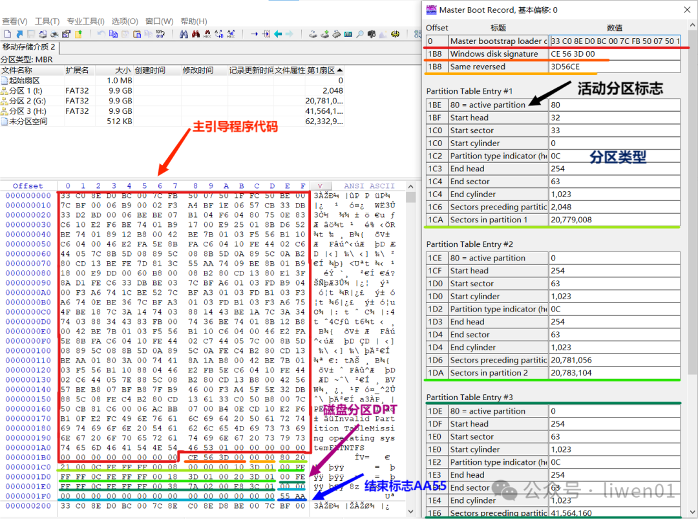
它主要分为4部分.
- MBL主引导程序代码(440Bytes)
- 磁盘签名(4Byte)
- DPT分区表(4*16Byte=64Byte)
- 结束标志(55AAH)
*** MBL代码
MBL引导程序占用其中的前440字节，其地址在偏移0～0x1B7.首先需要清楚的一
点是,这440个字节是一段程序,这段程序的功能如下,如图[[img-mbldata]]所示.
- 先将第0扇区的512字节复制到内存的一个安全区域去执行;
- 判断第0扇区的最后两个字节是否为"55 AA",如果不是，提示出错;
- 查找DPT分区表中是否有活动分区(0x80标志);
- 如果有活动分区，判断活动分区所在的扇区位置(Start Sector);
- 将活动分区的引导扇区读入内存中，并判断数据是否合法;
- 如果活动扇区数据合法，就将引导权交给活动扇区;
- 活动扇区去引导操作系统启动，MBR引导程序退出;

#+caption: MBL引导代码
#+name: img-mbldata
#+attr_latex: :placement [H] :width 0.6\textwidth
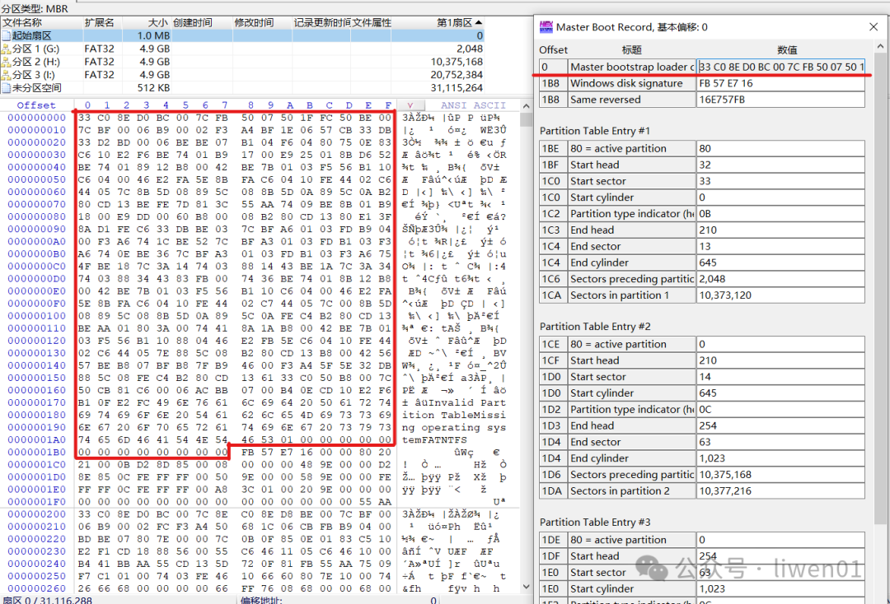

活动分区: 一个磁盘中只能有一个活动扇区，活动分区中包含引导加载程序，它
负责引导计算机启动操作系统.活动分区是通过分区表项的第一字节来判断，分
区表项的第一个字节，只能是0x00(非活动分区)或者0x80(活动分区).
*** 磁盘签名
它是磁盘格式化时写入的标签，如果把这个位置的数据清除，系统会提示磁盘未
初始化,如图[[img-mbldata]]所示的0x1B8位置的4字节数据"FB57E716".
*** DPT磁盘分区表
DPT分区表结构如图[[img-dptdata]]所示.
#+caption: DPT分区表数据
#+name: img-dptdata
#+attr_latex: :placement [H] :width 0.6\textwidth
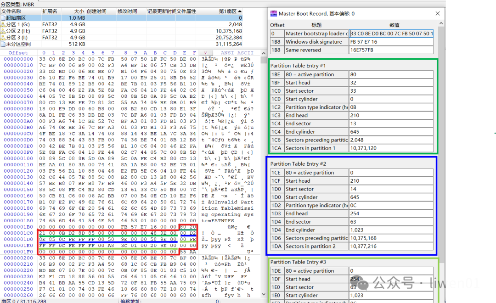
- MBR磁盘分区表的结构是固定的，总共包含4个表项，每个表项16个字节.
- 每个表项对应一个主分区，其中可以存储主分区或者扩展分区的信息.
- 如果不使用扩展分区，一个磁盘最多就只能支持4个分区

DPT磁盘分区表有如下概念, 其定义如表[[tbl-dptdef]]所示.
#+caption: 分区表字段含义
#+name: tbl-dptdef
#+attr_latex: :placement [H]
|--------+-------+------------+-----------------------------------------|
| Offset | Size  |      Value | Description                             |
|--------+-------+------------+-----------------------------------------|
|--------+-------+------------+-----------------------------------------|
| 0x01BE | 1Byte |       0x80 | 引导指示符,指明是否活动分区                 |
| 0x01BF | 1Byte |       0x20 | 开始磁头(Start head)                      |
| 0x01C0 | 6bit  |       0x21 | 开始扇区(Start sector)                    |
| 0x01C1 | 10bit |       0x00 | 开始柱面(Start Cylinder),                 |
| 0x01C2 | 1Byte |       0x0B | 系统ID或分区类型(Partition type indicator) |
| 0x01C3 | 1Byte |       0xD2 | 结束磁头(End Head)                        |
| 0x01C4 | 6bit  |       0x0D | 结束扇区(End Sector)                      |
| 0x01C5 | 10bit |      0x285 | 结束柱面(End Cylinder)                    |
| 0x01C6 | 4Byte | 0x00000800 | 相对扇区数(Relative Sector)               |
| 0x01CA | 4Byte | 0x009E4800 | 总扇区数(Total Sector)                    |
|--------+-------+------------+-----------------------------------------|
- Start/End sector: 6bit,这个字节只用6bit,bit6/7被下个字段所用,所以一个盘
  面,只有64个sector,每个sector,512byte.
- Start/End Cylinder: 10bit,柱面共1024个, 实际上用这种方式表示的分区容
  量是有限的, 柱面和磁头从0开始编号,扇区从1开始编号,所以最多只能表示
  1024柱面*63个扇区*256个磁头*512byte = 8455716864byte=8.4GB(实际上应
  该是7.8GB左右), 实际磁头数通常只用到255个(汇编语言的寻址寄存器决定).
- Relative sector: 相对扇区数,从磁盘的开始到该分区的开始的位移量,以扇
  区来计算,如表中0x800,即Offset为2048个扇区.
- Total Sector: 该分区种的扇区总数.
- 分区表项格式:每个分区表项包含了有关分区的信息，包括分区的起始位置、
  大小、文件系统类型等.此外，每个分区表项还包含一个用于标识分区状态
  (活动/非活动)的标志.
- 活动分区:活动分区是一个特殊的主分区，被标记为活动.只有活动分区上的
  引导加载程序才会被计算机BIOS或UEFI加载，从而启动操作系统.
- 结束标志:当计算机引导时，BIOS或UEFI会检查这个结束标志，以确认MBR分区
  表的有效性.如果这个标志不存在或不等于0x55AA，计算机可能无法正确识别
  和引导操作系统.
- 主分区：MBR分区表最多支持4个主分区.如果需要更多的分区，可
  以使用其中一个主分区作为扩展分区，然后在扩展分区内创建逻辑分区.逻辑
  分区的信息存储在扩展分区的扩展分区记录中.
- 扩展分区:严格地讲它不是一个实际意义的分区，它仅仅是一个指向下一个用
  来定义分区的参数的指针，这种指针结构形成一个单向链表.通过MBR上的扩
  展分区，逐个遍历就可以找到磁盘上的所有扩展分区.

将一个16G的U盘分成4个分区，两个主分区，两个扩展分区，分区参数如图
[[img-udiskpartition]]所示.
#+caption: U盘分区
#+name: img-udiskpartition
#+attr_latex: :placement [H]
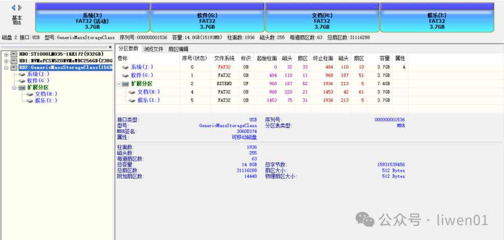

它的在磁盘中的数据结构如图[[img-udiskdata]]所示.
#+caption: U盘分区格式
#+name: img-udiskdata
#+attr_latex: :placement [H]
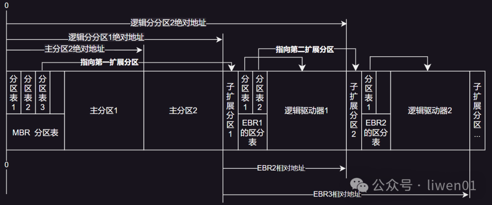

有几个比较重要的点.
- MBR理论可以放置4个分区表项，实际只使用了3个;
- MBR的第三分区表项为逻辑分区，它指向第一扩展分区的位置;
- 扩展分区的分区表里只有两个有效分区表项，一个指向自己，另外一个指向下
  一个扩展分区;
- 如果是最后一个扩展分区，它可以只有一个分区表项;
- 在逻辑分区中，它们使用的是相对地址，相对于第一扩展分区的地址，而不是
  使用绝对地址;
  

可以查看第0扇区数据进行核对，第4分区表项位置数据全是空，另外第一二分区
类型为0x0B为FAT32分区，第三分区类型为0x0F，表示为扩展分区,如图
[[img-fat32typedata]]所示, 定义如图[[tbl-parttypedef]]所示.
#+caption: 分区表类型定义
#+name: tbl-parttypedef
#+attr_latex: :placement [H] :width 0.5\textwidth
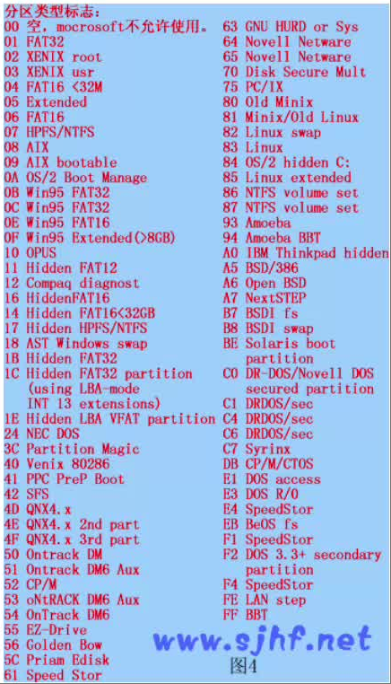
- Windows常见的类型标志有:
  0x00/0x01/0x04/0x05/0x07/0x0B/0x0C/0x0E/0x42/0x80;
- Linux常见的类型标志有:0x82/0x83/0x85/0xa50/0xa6;
- 其他操作系统类型标志有:0xA0/0xBE/0xEB;
  

#+caption: 分区类型图
#+name: img-fat32typedata
#+attr_latex: :placement [H] :width 0.6\textwidth
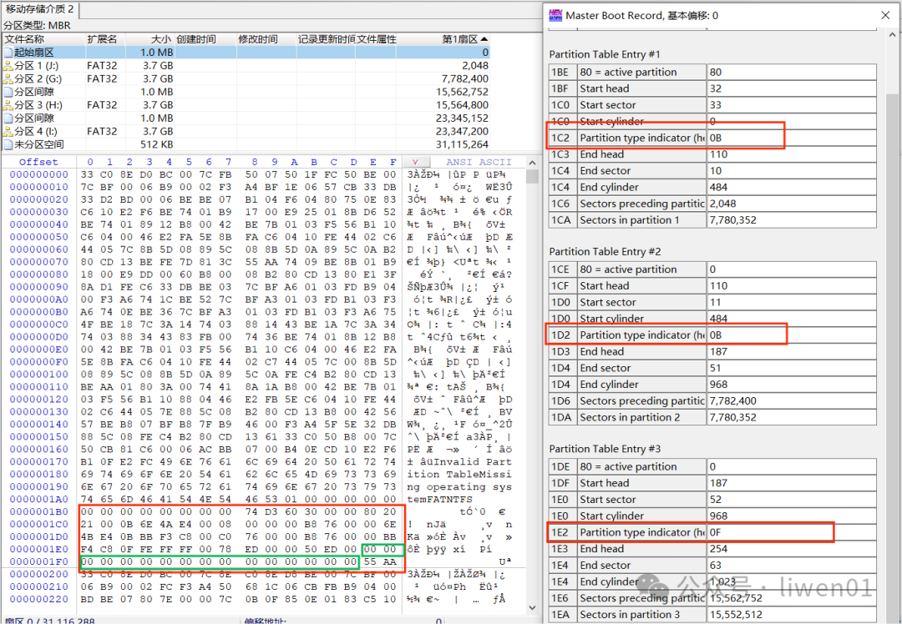

MBR分区的局限性,MBR是一种比较老旧的分区格式，它有比较多的局限性.
- 最多支持4个主分区,MBR分区表最多支持4个主分区，其中一个可以是扩展分区;
- 扩展分区和逻辑分区结构复杂,MBR通过扩展分区来克服主分区数量的限制，但
  使用扩展分区和逻辑分区引入了一些复杂性;
- 2TB以上硬盘的限制,MBR使用32位的逻辑块地址(LBA)来表示分区的起始位置和
  大小，因此存在2TB(2^41字节)的硬盘大小限制;
- 不支持UEFI启动,MBR是基于传统BIOS引导的，不支持新一代的UEFI引导方式;
- 不具备数据完整性校验,MBR分区表中没有内置的数据完整性校验机制，因此在
  一些情况下，分区表损坏或错误可能导致数据丢失或系统启动问题;

* FAT
FAT32是从FAT12、FAT16发展而来，目前主要应用在移动存储设备中，比如SD卡、
TF卡.隐藏的FAT文件系统现在也有被大量使用在UEFI启动分区中.
** FAT布局
拿一个FAT32文件系统的存储设备，可以看到，它整个存储设备大概可以分
为5个部分,如图[[img-fat32diskp]]所示.
#+caption: FAT32磁盘布局
#+name: img-fat32diskp
#+attr_latex: :placement [H] :width 0.6\textwidth
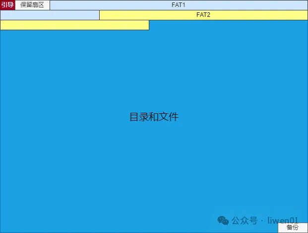
- 引导和保留扇区: 会因为分区方式的不同(MBR与GPT)而不同，同时也会因为存
  储设备分区个数的不同也会有差异.图[[img-fat32gptp]]这个是使用GPT方式将存
  储设备分为1个分区并格式化为FAT32文件系统格式的数据分布示意图.
  #+caption: FAT32 GPT分区方式
  #+name: img-fat32gptp
  #+attr_latex: :placement [H] :width 0.6\textwidth
  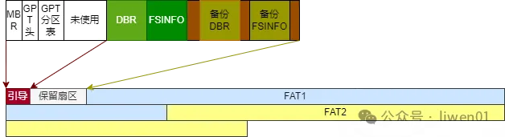

- FAT表和目录/文件: 在FAT32文件系统的使用过程中，FAT表和目录项是其核心部分;
- 备份:在磁盘末尾的备份区域，主要是使用GPT方式分区的时候，会将分区表信
  息备份到存储设备的最后区域.对于MBR分区方式，并没有这部分.

FAT文件系统还有一种视角,如图[[img-fat32partitionstr]]所示, FAT分区格式是
Microsoft最早提出的分区格式.依据FAT表中每个簇链的所占位数分为
FAT12/FAT16/FAT32三种格式.
#+caption: FAT32分区结构视角
#+name: img-fat32partitionstr
#+attr_latex: :placement [H] :width 0.3\textwidth
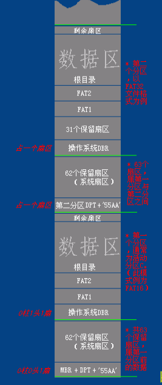
*** DBR
DBR区(DOC Boot Record)即操作系统引导记录区,通常占用该分区的第0扇区共
512字节(特殊情况下也会占用其他保留扇区).如图[[img-fat32dbrdata]]所示是一个
DBR数据示例.
#+caption: FAT32 DBR数据
#+name: img-fat32dbrdata
#+attr_latex: :placement [H] :width 0.6\textwidth

DBR数据各字段解析如图[[img-fat32dbrdef]]所示.
#+caption: FAT32 DBR解析
#+name: img-fat32dbrdef
#+attr_latex: :placement [H]
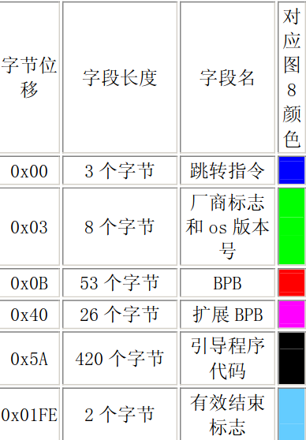
- 跳转指令;
- 厂商标志;
- 操作系统版本号;
- BPB(Bios Parameter Block);
- 扩展BPB;
- OS引导程序;
- 结束标志.

  
进一步解析如图[[img-fat32bootsecdef]]所示. 
#+caption: FAT32 DBR详细解析
#+name: img-fat32bootsecdef
#+attr_latex: :placement [H] :width 0.6\textwidth
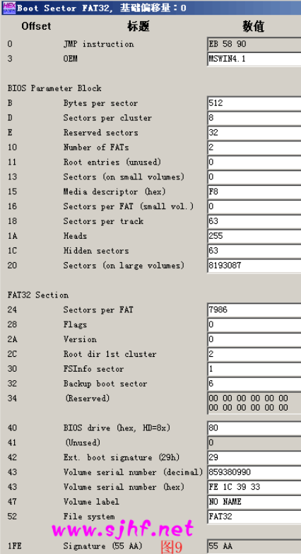
- JMP instruction: MBR将CPU执行转移给引导扇区,由此,引导扇区的前3个字节
  必须是合法的基于x86/ARM/RISCV的CPU指令,通常是一条跳转指令, 该指令负
  责跳过接下来的几个不可执行的字节(BPB和扩展BPB), 跳到OS引导程序部分.
- OEM: 8字节长的OEM ID,一个字符串, 它标识了格式化该分区的操作系统的名
  称和版本号.
  + 为了保留与DOS的兼容性, 通常Win2000格式化该盘是在FAT16和FAT32磁盘上
    的该字段记录了"MSDOS5.0";
  + 在NTFS磁盘上,Win2000记录的是"NTFS";
  + 在被Win95格式化的是"MSWIN4.0";
  + 在被Win95 OSR2和Win98格式化的是"MSWIN4.1".
- BPB区(Bios Parameter Block),下面以(偏移,长度,值)进行描述.
  + (0x0B,2Byte,0x0200):扇区字节数(BytesPerSector) 硬件扇区
    的大小.本字段合法的十进制值有512、1024、2048 和 4096.对大多数磁
    盘来说，本字段的值为512;
  + (0x0D, 1Byte,0x08):每簇扇区数(SectorsPerCluster),一簇中的扇区数.
    由于FAT32文件系统只能跟踪有限个簇(最多为4294967296个)，因此，通过
    增加每簇扇区数，可以使FAT32文件系统支持最大分区数.一个分区缺省的
    簇大小取决于该分区的大小.本字段的合法十进制值有1、2、4、8、16、32、
    64和128.Win2000的FAT32实现只能创建最大为32GB的分区.但是，Win2000
    能够访问由其他操作系统(Win95、OSR2及其以后的版本)所创建的更大的分区;
  + (0x0e, 2Byte,0x0020):保留扇区数(ReservedSector)第一个FAT开始之前的
    扇区数，包括引导扇区.本字段的十进制值一般为32;
  + (0x10,1Byte,0x02): FAT数(Number of FAT)该分区上FAT的副本数.本字段
    的值一般为2;
  + (0x11,2Byte,0x0000): 根目录项数(RootEntries)只有FAT12/FAT16使用此
    字段.对FAT32分区而言,本字段必须设置为 0;
  + (0x13, 2Byte,0x0000):小扇区数(SmallSector)(只有FAT12/FAT16使用此字
    段)对FAT32分区而言，本字段必须设置为0;
  + (0x15, 1Byte,0xF8): 媒体描述符(MediaDescriptor)提供有关媒体被使用
    的信息.值0xF8表示硬盘，0xF0表示高密度的3.5寸软盘.媒体描述符要用
    于MS-DOS FAT16磁盘，在Win2000中未被使用
  + (0x16, 2Byte,0x0000): 每FAT扇区数(SectorsPerFAT)只被FAT12/FAT16所
    使用,对FAT32分区而言，本字段必须设置为 0
  + (0x18, 2Byte, 0x003F):每道扇区数(Sectors PerTrack)包含使用 INT13h
    的磁盘的“每道扇区数”几何结构值.该分区被多个磁头的柱面分成了多个磁道;
  + (0x1A,2Byte,0x00FF): 磁头数(Number of Head)本字段包含使用 INT 13h
    的磁盘的“磁头数”几何结构值.例如，在一张1.44MB 3.5英寸的软盘上，本
    字段的值为2;
  + (0x1C, 4Byte,0x0000003F): 隐藏扇区数(Hidden Sector)该分区上引导扇
    区之前的扇区数.在引导序列计算到根目录的数据区的绝对位移的过程中使
    用了该值.本字段一般只对那些在中断 13h 上可见的媒体有意义.在没有
    分区的媒体上它必须总是为0;
  + (0x20, 4Byte,0x007D043F): 总扇区数(Large Sector)本字段包含FAT32分
    区中总的扇区数;
  + (0x24, 4Byte,0x00001F32):每FAT扇区数(Sectors PerFAT)(只被 FAT32 使
    用)该分区每个 FAT 所占的扇区数.计算机利用这个数和 FAT 数以及隐藏
    扇区数(本表中所描述的)来决定根目录从哪里开始.该计算机还可以从目录
    中的项数决定该分区的用户数据区从哪里开始;
  + (0x28, 2Byte, 0x00): 扩展标志(Extended Flag)(只被 FAT32 使用)该两
    个字节结构中各位的值为：
    1. 位0-3：活动 FAT 数(从0开始计数，而不是 1).只有在不使用镜像时才有效
    2. 位4-6：保留
    3. 位7: 0值意味着在运行时FAT被映射到所有的FAT 1值表示只有一个FAT是活动的
    4. 位8-15：保留
  + (0x2A, 2Byte,0x0000):文件系统版本(File ystemVersion)只供FAT32使用,
    高字节是主要的修订号，而低字节是次要的修订号.本字段支持将来对该
    FAT32 媒体类型进行扩展.如果本字段非零，以前的 Windows 版本将不支
    持这样的分区;
  + (0x2C, 4Byte,0x00000002): 根目录簇号(Root ClusterNumber)(只供FAT32
    使用)根目录第一簇的簇号.本字段的值一般为 2，但不总是如此;
  + (0x30, 2Byte, 0x0001):文件系统信息扇区号(FileSystem
    InformationSectorNumber)(只供 FAT32 使用)FAT32分区的保留区中的文件
    系统信息(File SystemInformation, FSINFO)结构的扇区号.其值一般为1.
    在备份引导扇区(Backup BootSector)中保留了该FSINFO结构的一个副本，
    但是这个副本不保持更新;
  + (0x34, 2Byte, 0x0006):备份引导扇区(只供 FAT32 使用) 为一个非零值，
    这个非零值表示该分区保存引导扇区的副本的保留区中的扇区号.本字段的
    值一般为 6，建议不要使用其他值;
  + (0x36, 12Byte, 12个字节均为0x00):保留(只供FAT32使用)供以后扩充使用
    的保留空间.本字段的值总为0;
  + (0x40, 1Byte,0x80): 物理驱动器号(PhysicalDriveNumber)与BIOS物理驱
    动器号有关.软盘驱动器被标识为 0x00，物理硬盘被标识为 0x80，而与物
    理磁盘驱动器无关.一般地，在发出一个 INT13h BIOS 调用之前设置该值，
    具体指定所访问的设备.只有当该设备是一个引导设备时，这个值才有意义;
  + (0x41, 1Byte,0x00): 保留(Reserved) FAT32 分区总是将本字段的值设置
    为0;
  + (0x42, 1Byte, 0x29):扩展引导标签(ExtendedBoot Signature) 本字段必
    须要有能被Win2000所识别的值0x28或0x29;
  + (0x43, 4Byte, 0x33391CFE):分区序号(Volume SerialNumber)在格式化磁
    盘时所产生的一个随机序号，它有助于区分磁盘
  + (0x47, 11Byte, "NO NAME"):卷标(Volume Label) 本字段只能使用一次，
    它被用来保存卷标号.现在，卷标被作为一个特殊文件保存在根目录中
  + (0x52, 8Byte,"FAT32"): 系统ID(System ID)FAT32文件系统中一般取为
    "FAT32";

DBR的偏移 0x5A开始的数据为操作系统引导代码.这是由偏移0x00开始的跳转指
令所指向的.在图[[img-fat32dbrdata]]所列出的偏移0x00~0x02的跳转指令
"EB5890"清楚地指明了OS引导代码的偏移位置.jump 58H加上跳转指令所需的位
移量，即开始于0x5A.此段指令在不同的操作系统上和不同的引导方式上，其内
容也是不同的.大多数的资料上都说win98,构建于fat基本分区上的Win2000,
Winxp所使用的DBR只占用基本分区的第0扇区.他们提到，对于Fat32，一般的32
个基本分区保留扇区只有第0扇区是有用的.实际上，以FAT32构建的操作系统如
果是Win98,系统会使用基本分区的第0扇区和第2扇区存储os引导代码；以FAT32
构建的操作系统如果是Win2000或Winxp,系统会使用基本分区的第0扇区和第0xC
扇区(Win2000或Winxp,其第0xC的位置由第0扇区的0xAB偏移指出)存储os引导代
码.所以，在Fat32分区格式上，如果DBR一扇区的内容正确而缺少第2扇区
(Win98系统)或第0xC扇区(Win2000或Winxp系统)，系统也是无法启动的.如果
自己手动设置NTLDR双系统，必须知道这一点.

DBR扇区的最后两个字节一般存储值为0x55AA的DBR有效标志，对于其他的取值，
系统将不会执行DBR相关指令.上面提到的其他几个参与os引导的扇区也需以
0x55AA为合法结束标志.
*** 保留扇区
在FAT文件系统DBR的偏移0x0E处，用2个字节存储保留扇区的数目.所谓保留扇
区(有时候会叫系统扇区，隐藏扇区)，是指从分区DBR扇区开始的仅为系统所有
的扇区，包括DBR扇区.在FAT16文件系统中，保留扇区的数据通常设置为1，即
仅仅DBR扇区.而在FAT32中，保留扇区的数据通常取为32，有时候用
PartitionMagic分过的FAT32分区会设置36个保留扇区，有的工具可能会设置63
个保留扇区.

FAT32中的保留扇区除了磁盘总第0扇区用作DBR，总第2扇区(win98系统)或总第
0xC扇区(Win2000,Winxp)用作OS引导代码扩展部分外，其余扇区都不参与操作系
统管理与磁盘数据管理，通常情况下是没作用的.操作系统之所以在FAT32中设
置保留扇区，是为了对DBR作备份或留待以后升级时用.FAT32中，DBR偏移0x34
占2字节的数据指明了DBR备份扇区所在，一般为0x06，即第6扇区.当FAT32分区
DBR扇区被破坏导致分区无法访问时.可以用第6扇区的原备份替换第0扇区来找
回数据.
*** FAT表
FAT表(File Allocation Table文件分配表)，是 Microsoft在FAT文件系统中用
于磁盘数据(文件)索引和定位引进的一种链式结构.假如把磁盘比作一本书，
FAT表可以认为相当于书中的目录，而文件就是各个章节的内容.但FAT表的表示
方法却与目录有很大的不同.在FAT文件系统中，文件的存储依照FAT表制定的簇
链式数据结构来进行.同时，FAT文件系统将组织数据时使用的目录也抽象为文
件，以简化对数据的管理.

FAT表实际上是一个数据表，以2个字节为单位，我们暂将这个单位称为FAT记录
项，通常情况其第1、2个记录项(前4个字节)用作介质描述.从第3个记录项开
始记录除根目录外的其他文件及文件夹的簇链情况.根据簇的表现情况FAT用相
应的取值来描述,以FAT16记录项为例,见表[[tbl-fat16tblitm]]所示的定义.
#+caption: FAT16记录项定义
#+name: tbl-fat16tblitm
#+attr_latex: :placement [H]
|---------------+---------------|
| 簇号           | 对应簇的表现情况 |
|---------------+---------------|
|---------------+---------------|
| 0x0000        | 未分配的簇      |
| 0x0002~0xFFEF | 已分配的簇      |
| 0xFFF0~0xFFF6 | 系统保留        |
| 0xFFF7        | 坏簇           |
| 0xFFF8~0xFFFF | 文件结束簇      |
|---------------+---------------|

如图[[tbl-fat16fatdata]]，FAT表以"F8 FF FF FF" 开头，此2字节为介质描述单
元，并不参与FAT表簇链关系.
#+caption: FAT16 FAT表数据
#+name: tbl-fat16fatdata
#+attr_latex: :placement [H]
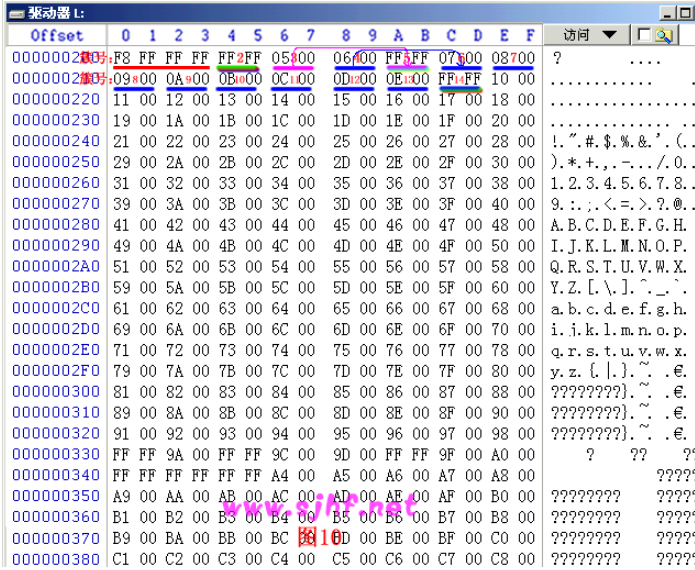
- 相对偏移0x4~0x5 偏移为第2簇(顺序上第1簇)，此处为FF,表示存储在第2簇上
  的文件(目录)是个小文件，只占用1个簇便结束了.
- 第3簇中存放的数据是0x0005，这是一个文件或文件夹的首簇.其内容为第5簇，
  就是说接下来的簇位于第5簇->FAT表指引我们到达FAT表的第5簇指向，上面写
  的数据是"FF FF",意即此文件已至尾簇.
- 第4簇中存放的数据是0x0006，这又是一个文件或文件夹的首簇.其内容为第6
  簇，就是说接下来的簇位于第6簇->FAT表指引我们到达FAT表的第6簇指向，上
  面写的数据是0x0007，就是说接下来的簇位于第7簇->FAT表指引我们到达FAT
  表的第7簇,....直到根据FAT链读取到扇区相对偏移0x1A~0x1B，也就是第13簇，
  上面写的数据是0x000E，也就是指向第14簇->14簇的内容为"FFFF"，意即此文
  件已至尾簇.
  

FAT表记录了磁盘数据文件的存储链表，对于数据的读取而言是极其重要的，以
至于Microsoft为其开发的FAT文件系统中的FAT表创建了一份备份，就是我们看
到的FAT2.FAT2与FAT1的内容通常是即时同步的，也就是说如果通过正常的系统
读写对FAT1做了更改，那么FAT2也同样被更新.如果从这个角度来看，系统的这
个功能在数据恢复时是个天灾.
*** FAT根目录
FAT文件系统的目录结构其实是一颗有向的从根到叶的树，这里提到的有向是指
对于FAT分区内的任一文件(包括文件夹)，均需从根目录寻址来找到.可以这样
认为,目录存储结构的入口就是根目录.FAT 文件系统根据根目录来寻址其他文
件(包括文件夹)，故而根目录的位置必须在磁盘存取数据之前得以确定.FAT文
件系统就是根据分区的相关DBR参数与DBR中存放的已经计算好的FAT表(2 份)的
大小来确定的.格式化以后，根目录的大小和位置其实都已经确定下来了,位置
紧随FAT2之后，大小通常为32个扇区.根目录之后便是数据区第2簇.

FAT文件系统的一个重要思想是把目录(文件夹)当作一个特殊的文件来处
理，FAT32甚至将根目录当作文件处理(旁：NTFS将分区参数、安全权限等好多
东西抽象为文件更是这个思想的升华)，在FAT16中，虽然根目录地位并不等同
于普通的文件或者说是目录，但其组织形式和普通的目录(文件夹)并没有不
同.FAT分区中所有的文件夹(目录)文件，实际上可以看作是一个存放其他文
件(文件夹)入口参数的数据表.所以目录的占用空间的大小并不等同于其下所
有数据的大小，但也不等同于0.通常是占很小的空间的，可以看作目录文件
是一个简单的二维表文件.其具体存储原理是,不管目录文件所占空间为多少簇，
一簇为多少字节.系统都会以32个字节为单位进行目录文件所占簇的分配.这
32个字节以确定的偏移来定义本目录下的一个文件(或文件夹)的属性，实际上
是一个简单的二维表,这个32字节的定义如表[[tbl-fat1632bdef]]所示.
#+caption:FAT16目录项32个字节定义
#+name: tbl-fat1632bdef
#+attr_latex: :placement [H]
|-----------+------+---------------|
| Offset    | Size | Description   |
|-----------+------+---------------|
|-----------+------+---------------|
| 0x0~0x7   |    8 | 文件名         |
| 0x8~0xA   |    3 | 扩展名         |
|-----------+------+---------------|
|           |      | 0x00:读写      |
|           |      | 0x01:只读      |
| 0xB       |    1 | 0x02:隐藏      |
|           |      | 0x04:系统      |
|           |      | 0x10:子目录    |
|           |      | 0x20:归档      |
|-----------+------+---------------|
| 0xC~0x15  |   10 | 系统保留        |
| 0x16~0x17 |    2 | 文件最近修改时间 |
| 0x18~0x19 |    2 | 文件最近修改日期 |
| 0x1A~0x1B |    2 | 文件的首簇号    |
| 0x1C~0x1F |    4 | 文件长度        |
|-----------+------+---------------|
- 对于短文件名，系统将文件名分成两部分进行存储，即主文件名+扩展名.
  0x0~0x7字节记录文件的主文件名，0x8~0xA记录文件的扩展名，取文件名中的
  ASCII码值.不记录主文件名与扩展名之间的"." 主文件名不足8个字符以空白
  符(20H)填充，扩展名不足3个字符同样以空白符(20H)填充.0x0偏移处的取值
  若为00H，表明目录项为空；若为E5H，表明目录项曾被使用，但对应的文件或
  文件夹已被删除.(这也是误删除后恢复的理论依据).文件名中的第一个字符
  若为“.”或“..”表示这个簇记录的是一个子目录的目录项.“.”代表当前目录；
  “..”代表上级目录(和我们在dos或windows中的使用意思是一样的，如果磁盘
  数据被破坏，就可以通过这两个目录项的具体参数推算磁盘的数据区的起始位
  置，猜测簇的大小等等，故而是比较重要的);
- 0xB的属性字段：可以看作系统将0xB的一个字节分成8位，用其中的一位代表
  某种属性的有或无.这样，一个字节中的8位每位取不同的值就能反映各个属
  性的不同取值了.如00000101就表示这是个文件，属性是只读、系统.
- 0xC~0x15: 在原FAT16的定义中是保留未用的.在高版本的WINDOWS系统中有时
  也用它来记录修改时间和最近访问时间.那样其字段的意义和FAT32的定义是
  相同的，见后边FAT32.
- 0x16~0x17:中的时间=小时*2048+分钟*32+秒/2.得出的结果换算成16进制填
  入即可.也就是：0x16字节的0~4位是以2秒为单位的量值；0x16字节的5~7位
  和0x17字节的0~2位是分钟；0x17字节的3~7位是小时.
- 0x18~0x19:中的日期=(年份-1980)*512+月份*32+日.得出的结果换算成16进
  制填入即可.也就是：0x18字节0~4位是日期数；0x18字节5~7位和0x19字节0
  位是月份；0x19字节的1~7位为年号，原定义中0~119 分别代表1980~2099，目
  前高版本的Windows允许取0~127，即年号最大可以到2107年.
- 0x1A~0x1B:存放文件或目录的表示文件的首簇号，系统根据掌握的首簇号在FAT
  表中找到入口，然后再跟踪簇链直至簇尾，同时用0x1C~0x1F处字节判定有效
  性.就可以完全无误的读取文件(目录)了.
- 普通子目录的寻址过程也是通过其父目录中的目录项来指定的，与数据文件
  (指非目录文件)不同的是目录项偏移0xB的第4位置1，而数据文件为0.

对于整个FAT分区而言，簇的分配并不完全总是分配干净的.如一个数据区为99
个扇区的FAT系统，如果簇的大小设定为2扇区，就会有1个扇区无法分配给任何
一个簇.这就是分区的剩余扇区，位于分区的末尾.有的系统用最后一个剩余扇
区备份本分区的DBR，这也是一种好的备份方法.早的FAT16 系统并没有长文件
名一说，Windows操作系统已经完全支持在FAT16上的长文件名了.FAT16的长文
件名与FAT32 长文件名的定义是相同的.

** 文件在哪里
图[[img-fat32files]]在一个TF卡中创建了test1、test2、test3、test4 四个文件
夹和一个0000.media媒体文件.System Volume Information 目录及其下面的文
件是在Windows系统格式化的时候系统写入的系统文件.
#+caption: FAT32文件示例
#+name: img-fat32files
#+attr_latex: :placement [H]
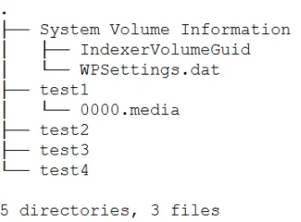
*** 目录项
FAT1/2表后面的区域，是根目录的存储区域，目录和文件以及文件中的实际数据
都存储在这个一个大的区域.根目录是在该区域最开始的位置.从根文件所在扇
区的数据我们可以看到根目录的目录项信息.
#+caption: FAT32文件数据
#+name: img-fat32filedata
#+attr_latex: :placement [H] :width 0.6\textwidth
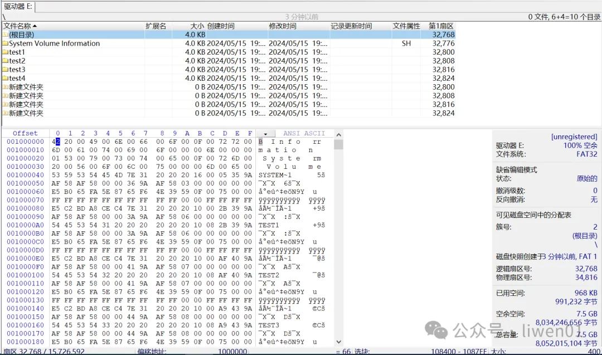
从WinHex工具上，根目录所在位置的还有4个“新建文件夹”项.这个是因为在
Windows创建文件夹的时候，开始的名字是“新建文件夹”，后面被我重命名成了
test1~4,如图[[img-fat32filedata]]所示.

目录项分为长文件名和短文件名,如果一个文件它的名字大于11个字节，那它就
至少有两个目录项，一个短文件名项和一个长文件名项.文件名长度小于等于11
个字节的话，就只有一个短文件名项.短文件名目录项长度为32个字节，各字节
的定义如图[[img-diritmdata]]所示.
#+caption: FAT32目录项定义
#+name: img-diritmdata
#+attr_latex: :placement [H] :without 0.6\textwidth
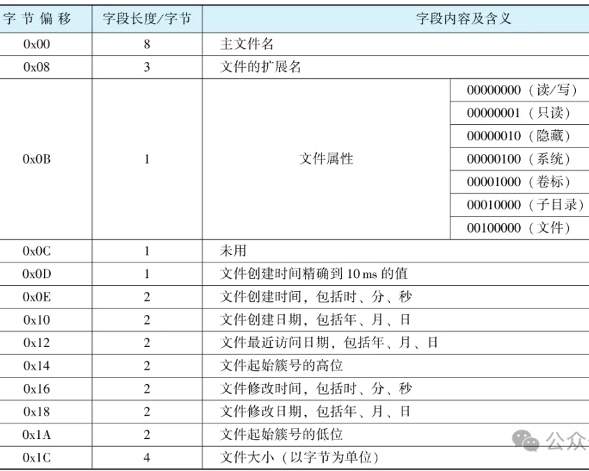

根据图[[img-diritmdata]]定义可以对根目录下的目录项进行解析,如图
[[img-fat32dirdata]]所示.
#+caption: FAT32目录项数据
#+name: img-fat32dirdata
#+attr_latex: :placement [H] :width 0.6\textwidth
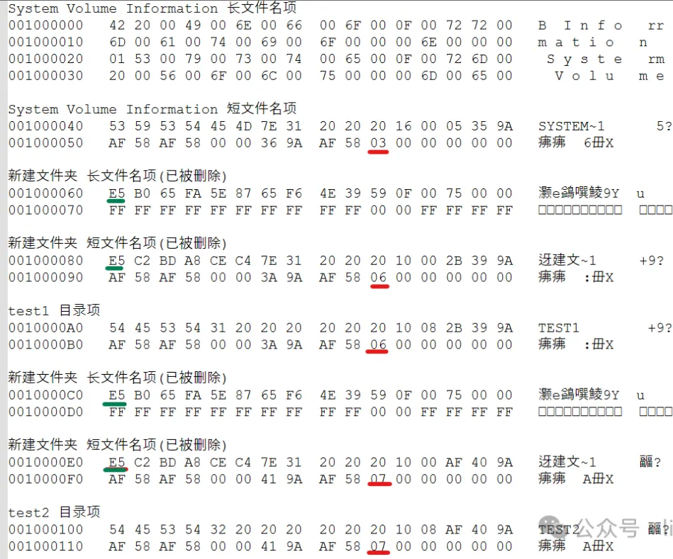
以test2目录项举例，我们可以看到.
- 文件名为test2 (短文件名);
- 文件属性为10 (子目录 ), 偏移0x0B;
- 这里时间需要转换，2字节用不同的位表示年月日和时分秒;
- 起始簇号为07号;
- 如果目录项是以E5开头，那表示该项是无效的或是已经删除了的目录项，比如
  上面的四个"新建文件夹"目录项;
- 通过目录项，我们可以知道存储设备上都有哪些文件和目录，相应的子目录也
  是一样的实现，只不过子目录下面的目录项是在子目录所在的簇中记录;
*** 文件磁盘空间分配
在FAT32文件系统中，它是以簇为单位进行空间分配和管理.一般一个簇的大小
为4KB(下面均以4KB做参考).一个文件或是一个目录，它是通过目录项知道它在
存储设备上存放的的开始位置，也就是开始簇号，而簇号信息，是存储在FAT表
上，一个FAT32文件系统有两个FAT表，一个正常使用，另外一个为备份FAT表通
过分区上的DBR和FSINFO信息可以知道FAT表的大小和所在位置等信息,具体数据
如图[[img-fat32filesdata]]所示.
#+caption: FAT32文件簇数据
#+name: img-fat32filesdata
#+attr_latex: :placement [H] :width 0.6\textwidth
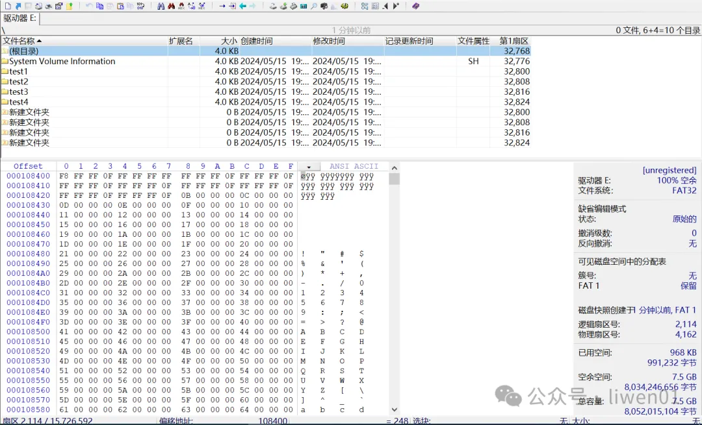

FAT32是以32位(4Byte)来定义一个FAT表项，也就是一个簇的状态，表
[[tbl-fat32cudef]]是FAT表项中值的含义.
#+caption: FAT32簇定义
#+name: tbl-fat32cudef
#+attr_latex: :placement [H] :width 0.6\textwidth
|-----------------------+---------------|
| FAT项值(32位)          | 含义           |
|-----------------------+---------------|
|-----------------------+---------------|
| 0000 0000H            | 未使用的簇      |
| 0000 0002H~0FFF FFFEH | 一个已分配的簇号 |
| 0FFF FFF0H~0FFF FFF6H | 保留           |
| 0FFF FFF7H            | 坏簇           |
| 0FFF FFFFH            | 文件结束簇      |
|-----------------------+---------------|
对于FAT表，第0号簇是固定的0x0FFFFFF8，第1号簇项0xFFFFFFFF是被系统使用,
第3号簇是根目录的开始簇，如果其值是0x0FFFFFFF,表示根目录只占用一个簇的
空间，也就是4KB大小空间，如果其值是0x00000002~0x0FFFFFFE，表示根目录的
下一个簇号，直到出现文件结束簇0x0FFFFFFF，也就是根目录大于4KB的大小.图
[[img-fat32cuparse]]是对FAT表现的一个解析.
#+caption: FAT表解析
#+name: img-fat32cuparse
#+attr_latex: :placement [H] :width 0.6\textwidth
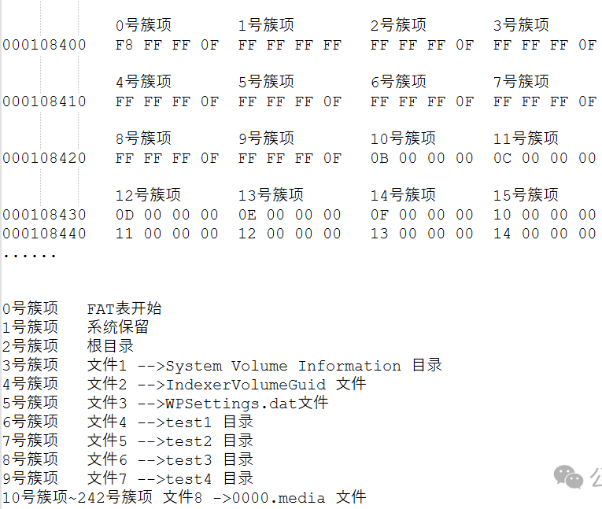

从图[[img-fat32cuparse]]可以看出.
- 如果文件或是目录小于4K(一个簇)，那它所占用的空间就是目录项中起始簇号
  所分配的空间，该簇号的值为结束簇号的值(0x0FFFFFFF);
- 如果一个文件大于4K(一个簇)，目录项中的起始簇号所在位置的值，就是下一
  个位置存储的簇号值，比如0000.media 文件，它的起始簇号是10，第10簇号
  (0x0000000B)->第11簇号(0x0000000C)->......第241簇号(0x0x00000F2)->第
  242簇号(0x0FFFFFFF 结束簇号);
- 上面这个0000.media文件是以连续的方式存储在磁盘中，当磁盘满了或是使用
  久了之后，会存在磁盘碎片，有可能就不是连续的空间了.
** 实现原理
我们从文件的创建、数据写入、文件删除等操作流程看文件系统的基本实现原理
*** 文件创建
- 创建文件或是目录时候，会先在当前目录所在位置的目录项中添加一个目录项
- 会记录文件的起始簇号，创建、修改时间，文件属性等信息
*** 文件增删数据
- 如果起始簇空间写满了，系统会查找一个空闲簇，数据将继续写入到该空闲簇
  中，FAT表中该空闲簇会被标记已经被使用，同时，该文件的结束簇号也会往
  后移动一个簇.
- 更新该目录项中的修改时间、文件大小等信息
- 删除或是修改文件里面的数据，就是一个反向的过程
*** 文件数据读取
- 通过目录项，找需要读取文件所在的开始簇位置
- 如果文件大于一个簇，开始簇位置的值为下一个簇的位置，可以顺着这个簇链
  一直查找，直到结束簇出现.
*** 文件删除
- 文件删除的时候，根目录中该目录项的信息并不会被删除，而是将该目录项标
  记为删除状态;
- FAT表中该文件所占用的簇号，会被标记为0，表示该簇为未使用的簇.
- 该文件所在簇号所对应扇区的实际文件数据不会被擦除，文件里面的数据还是
  存储在删除上.
  

文件删除，实际上也就是将该文件在FAT表中的簇信息标记为可使用，然后将目
录项标记为已删除，实际数据不会做删除处理

如果要恢复被删除的文件，可以根据目录项中的信息进行恢复，前提是不要再创
建新文件和写入新数据，因为新的数据容易将原来文件所在扇区的数据覆盖或是
擦除.
*** 基本原理
FAT32文件系统的基本原理，是通过目录项来管理磁盘的文件目录结构，然后通
过FAT表来管理磁盘文件所使用的簇(扇区)空间.

FAT32文件系统的FAT表是通过单向链式的方法来管理扇区，这种方式在小文件和
小容量的储存设备上使用比较方便，但不适合于大文件和大容量的存储设备.目
前大于32GB的SDXC卡，SD协会已采用exFAT作为默认的文件系统.

* GPT分区
