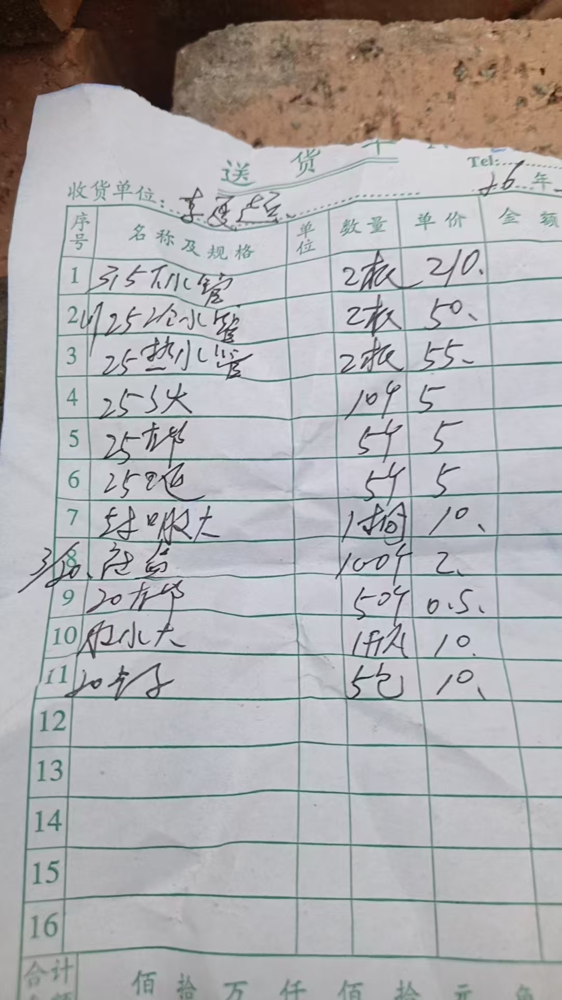
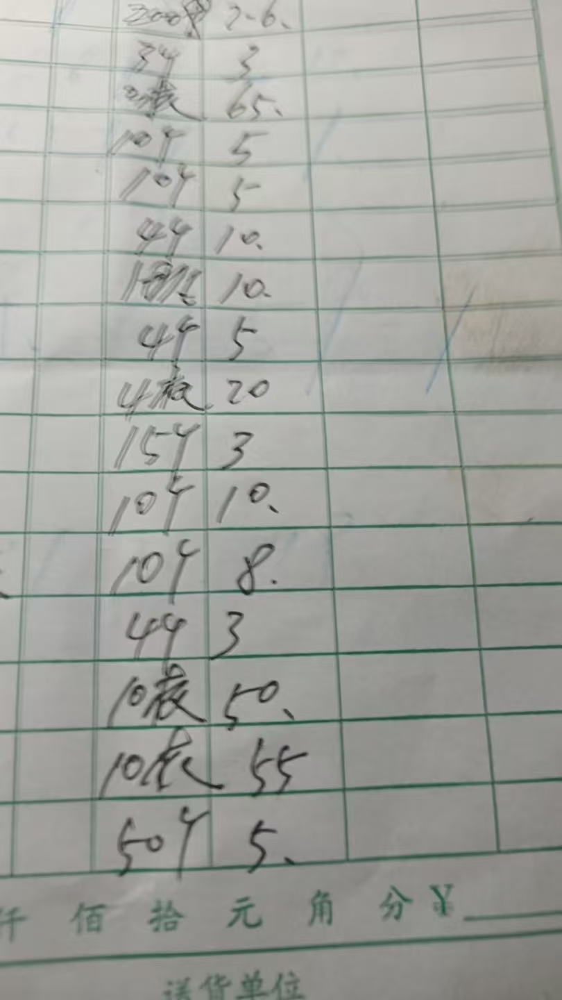
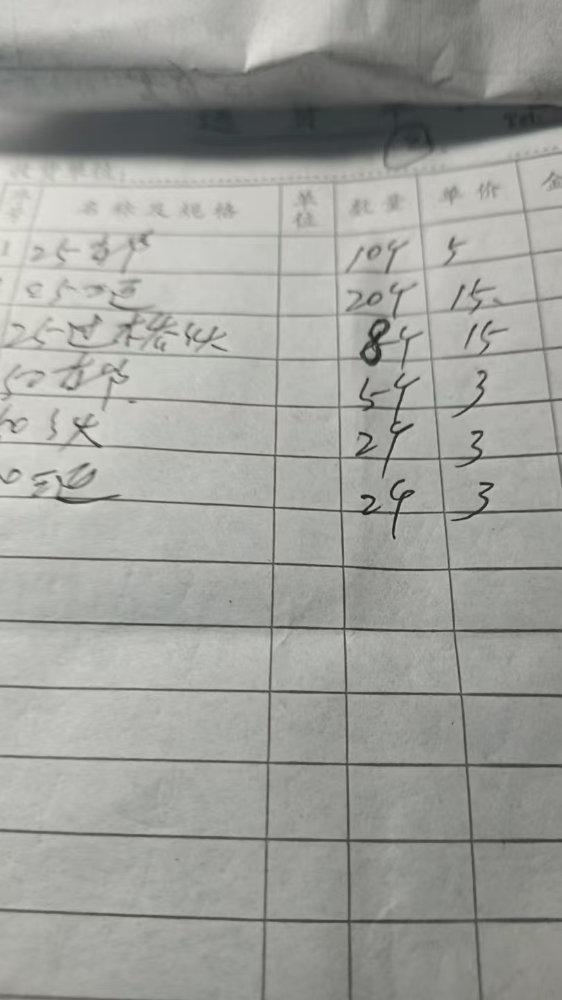

#+title: 建房日记
# #+subtitle: 
# #+author: Joe
#+latex_class: org-latex-pdf 
#+toc: tables 
#+toc: listings 
#+latex: \clearpage\pagenumbering{arabic} 
#+latex: \AddToShipoutPicture{\BackgroundPicture} 
#+options: h:4 ^:{} 
#+startup: overview

* 新房需求
- 卧室编号:依据"house-fun.pdf"标注.
- 一楼卧室风格,依赖爷爷选择.

|------------+------+----------------+----------------+---------|
|            | 位置  | 风格            | 材料            | 材料价格 |
|------------+------+----------------+----------------+---------|
| 入户        | ?    | ?              | ?              |         |
|------------+------+----------------+----------------+---------|
| 围墙        | 图纸  | 柱形/高度?      | 罗马柱?         |         |
|------------+------+----------------+----------------+---------|
| 停车间      | DONE | -              | 彩钢            |         |
|------------+------+----------------+----------------+---------|
| 外墙        | -    | 瓷砖            | 颜色?/尺寸?     |         |
|------------+------+----------------+----------------+---------|
| 内墙        | -    | 磨平            | 水泥            |         |
|------------+------+----------------+----------------+---------|
| 屋顶        | -    | 人字            | 琉璃瓦          |         |
|------------+------+----------------+----------------+---------|
| 化粪池      | 西向  |                | 底管?           |         |
|------------+------+----------------+----------------+---------|
| 楼梯        | 图纸  | 转角楼梯        | ?              |         |
|------------+------+----------------+----------------+---------|
|------------+------+----------------+----------------+---------|
| 一楼堂屋    | 图纸  | 抹白灰          | 石灰?           |         |
|------------+------+----------------+----------------+---------|
| 一楼卫生间  | 图纸  | ?              | 浴缸?           |         |
|------------+------+----------------+----------------+---------|
| 一楼餐厅    | 图纸  | 抹白灰          | 石灰?           |         |
|------------+------+----------------+----------------+---------|
| 一楼厨房    | 图纸  | - 四周:瓷砖     | 颜色?/尺寸?     |         |
|            |      | - 底面:瓷砖     | 颜色?/尺寸?     |         |
|------------+------+----------------+----------------+---------|
| 一楼卧室1   | 图纸  | - 四周?         | ?              |         |
|            |      | - 地面?         |                |         |
|------------+------+----------------+----------------+---------|
| 一楼卧室2   | 图纸  | - 四周?         | ?              |         |
|            |      | - 地面?         |                |         |
|------------+------+----------------+----------------+---------|
| 一楼卧室3   | 图纸  | - 四周?         | ?              |         |
|            |      | - 地面?         |                |         |
|------------+------+----------------+----------------+---------|
| 二楼露台    | 图纸  | 遮盖?/露天?     | 彩钢?/钢化玻璃? |         |
|------------+------+----------------+----------------+---------|
| 二楼客厅    | 图纸  | 落地窗向马路    |                |         |
|------------+------+----------------+----------------+---------|
| 二楼卫生间  | 图纸  | - 四周:瓷砖     | 颜色?/尺寸?     |         |
|            |      | - 地面:瓷砖     | 颜色?/尺寸?     |         |
|------------+------+----------------+----------------+---------|
| 二楼卫生间2 | 图纸  | - 四周:瓷砖     | 颜色?/尺寸?     |         |
|            |      | - 地面:瓷砖     | 颜色?/尺寸?     |         |
|------------+------+----------------+----------------+---------|
| 二楼卧室1   | 图纸  | - 四周:水泥抹平 |                |         |
|            |      | - 地面:瓷砖     | 颜色?/尺寸?     |         |
|------------+------+----------------+----------------+---------|
| 二楼卧室2   | 图纸  | - 四周:水泥抹平 |                |         |
|            |      | - 地面:瓷砖     | 颜色?/尺寸?     |         |
|------------+------+----------------+----------------+---------|
| 二楼卧室3   | 图纸  | - 四周:水泥抹平 |                |         |
|            |      | - 地面:瓷砖     | 颜色?/尺寸?     |         |
|            |      | - 落地窗向后山  |                |         |
|------------+------+----------------+----------------+---------|
| 二楼卧室4   | 图纸  | - 四周:水泥抹平 |                |         |
|            |      | - 地面:瓷砖     | 颜色?/尺寸?     |         |
|------------+------+----------------+----------------+---------|

* 新房建造
#+name: tbl-paydone
#+attr_latex: :placement [H]
|-----+--------|
| 工价 |  53300 |
| 其他 |      0 |
| 生活 |    444 |
| 建材 |  74713 |
|-----+--------|
| 总计 | 128457 |
|-----+--------|
#+TBLFM: @5$2=vsum(@1..@-1)
#+TBLFM: @1$2=remote(tbl-implcost, @15$5)
#+TBLFM: @2$2=remote(tbl-othercost, @9$5)
#+TBLFM: @3$2=remote(tbl-dailylife, @10$5)
#+TBLFM: @4$2=30000+remote(tbl-cement-commerce, @4$5)+remote(tbl-cement, @7$5)+remote(tbl-sand, @8$5)+remote(tbl-steel, @8$5)+remote(tbl-brick, @9$5)+remote(tbl-stone, @6$5)+remote(tbl-vit, @6$5)+remote(tbl-timber, @6$5)+remote(tbl-elwater, @12$5)+remote(tbl-doorwin, @16$5)

- 造价预估（8/9）:
  |---------------+--------|
  | 工价（待付）   |  31000 |
  | 任材料（待付） |  40000 |
  | 水电（待付）   |  25000 |
  | 门窗（待付）   |  45000 |
  |---------------+--------|
  | 待付造价       | 141000 |
  |---------------+--------|
  | 建造造价       | 269457 |
  |---------------+--------|
  | 粉刷           |  20000 |
  | 马桶           |    400 |
  | 蹲便           |    600 |
  |---------------+--------|
  | 入住造价       | 290457 |
  |---------------+--------|
  | 空调（4）      |   8000 |
  | 油烟机         |   2000 |
  |---------------+--------|
  | 舒适造价       | 300457 |
  |---------------+--------|
  #+TBLFM: @5$2=+vsum(@1..@4)
  #+TBLFM: @6$2=remote(tbl-paydone, @5$2)+@5$2
  #+TBLFM: @10$2=+vsum(@6..@9)
  #+TBLFM: @13$2=+vsum(@10..@12)

** 施工工价
#+name: tbl-implcost
#+attr_latex: :placement [H]
|---------+-----+-------+-------+-------+-------------+------|
|         | 单价 | 数量   |   预估 |   实际 | 说明         | 时间  |
|---------+-----+-------+-------+-------+-------------+------|
|---------+-----+-------+-------+-------+-------------+------|
| 审批押金 |     |       |       | 20000 | 可退         |      |
|---------+-----+-------+-------+-------+-------------+------|
| 拆房工价 |     |       |  1500 |  1500 | 挖机含化粪池 | 4/21 |
|         |     |       |   800 |     0 | 舅不收       |      |
|---------+-----+-------+-------+-------+-------------+------|
| 回填工价 | 150 |       |       |       | 150/h       |      |
|         |     |       |       |   900 | 苏嘴师傅     | 4/28 |
|---------+-----+-------+-------+-------+-------------+------|
| 建房工价 | 270 | 150*2 | 81000 |       | 露台不算     |      |
|         |     |       |       | 10000 | 第1笔        | 4/21 |
|         |     |       |       | 10000 | 第2笔        | 5/18 |
|         |     |       |       | 10000 | 第3笔        | 6/6  |
|         |     |       |       | 20000 | 第4笔        | 8/8  |
|---------+-----+-------+-------+-------+-------------+------|
| 电工工价 |  15 | 150*2 |  4500 |       | 造价估算2W   |      |
| 建房保险 |   6 | 1800  |   900 |   900 | 和包工头平摊 | 4/13 |
| 地皮补偿 |   0 | 0     |     0 |     0 | 取消         |      |
|---------+-----+-------+-------+-------+-------------+------|
| Total   |     |       | 88700 | 53300 |             |      |
|---------+-----+-------+-------+-------+-------------+------|
#+TBLFM: @15$5=vsum(@3..@-1)
#+TBLFM: @15$4=vsum(@3..@-1)

** 建材开销
*** 商混（胡）
#+name: tbl-cement-commerce
#+attr_latex: :placement [H]
|-----+---+-----+------+-------+-------+------|
|     | 胡 | 预估 |  到货 |   实际 | 说明   | 时间  |
|-----+---+-----+------+-------+-------+------|
|-----+---+-----+------+-------+-------+------|
| 层1  |   |     | 20.5 |  7995 | 390/方 | 5/13 |
| 层2  |   |     | 20.5 |  7892 | 385/方 | 6/3  |
|-----+---+-----+------+-------+-------+------|
| 小计 |   |   0 |      | 15887 |       |      |
|-----+---+-----+------+-------+-------+------|
#+TBLFM: @4$5=vsum(@2..@-1)
#+TBLFM: @4$3=vsum(@2..@-1)

*** 水泥（任）
#+name: tbl-cement
#+attr_latex: :placement [H]
|---------+--------+-------+------+-----+-----------|
|         | 任      |   预估 | 到货  | 实际 | 说明       |
|---------+--------+-------+------+-----+-----------|
|---------+--------+-------+------+-----+-----------|
| 水泥(普) | 340*30 | 11625 |      |   0 | 30T(胡)    |
| 水泥(优) | 435*30 |     0 |      |   0 | 总价取平均 |
|---------+--------+-------+------+-----+-----------|
|         |        |       | 4.5T |     | N0374901  |
|         |        |       | 13T  |     | N0374904  |
|         |        |       | 6T   |     |           |
|---------+--------+-------+------+-----+-----------|
| 小计     |        | 11625 |      |   0 |           |
|---------+--------+-------+------+-----+-----------|
#+TBLFM: @7$5=vsum(@2..@-1)
#+TBLFM: @7$3=vsum(@2..@-1)
 *说明* ： 大约需要30T；
- 普通水泥：340/T
- 优质水泥：435/T
*** 沙子（任）
#+attr_latex: :placement [H]
#+name: tbl-sand
|---------+--------+-----+-----+-----+----------|
|         | 任      | 预估 | 到货 | 实际 | 说明      |
|---------+--------+-----+-----+-----+----------|
|---------+--------+-----+-----+-----+----------|
| 沙(小车) | 1800*? |   0 |     |   0 | 160方(康) |
| 沙(大车) | 2340*? |   0 |     |   0 |          |
|---------+--------+-----+-----+-----+----------|
|         |        |     | 14方 |     | N0374903 |
|         |        |     | 14方 |     | N0374905 |
|         |        |     | 14方 |     | N0374906 |
|         |        |     | 14方 |     |          |
|---------+--------+-----+-----+-----+----------|
| 小计     |        |   0 |     |   0 |          |
|---------+--------+-----+-----+-----+----------|
#+TBLFM: @8$5=vsum(@2..@-1)
#+TBLFM: @8$3=vsum(@2..@-1)
 *说明* ：
 - 沙子大车：2340元
 - 沙子小车：1800元
*** 钢筋（任）
#+attr_latex: :placement [H]
#+name: tbl-steel
|------+---------+-------+------+-----+----------|
|      | 任       |   预估 | 到货  | 实际 | 说明      |
|------+---------+-------+------+-----+----------|
|------+---------+-------+------+-----+----------|
| 钢筋  | 3150*7T | 22050 |      |   0 | 7T(胡)    |
| 10#  |         |       | 300根 |     | N0397161 |
| 8#   |         |       | 200根 |     | N0397161 |
| 12#  |         |       | 50根  |     | N0397161 |
| 6.5# |         |       | 230根 |     | N0397161 |
| 16#  |         |       | 4根   |     | N0397161 |
|------+---------+-------+------+-----+----------|
| 小计  |         | 22050 |      |   0 |          |
|------+---------+-------+------+-----+----------|
#+TBLFM: @8$5=vsum(@2..@-1)
#+TBLFM: @8$3=vsum(@2..@-1)
 *说明* ：
 - 单价：3150元/T
 - 用量预估（胡）：7T；
*** 砖（任）
#+name: tbl-brick
#+attr_latex: :placement [H]
|-----+---------+-------+------+-----+----------|
|     | 任       |   预估 | 到货  | 实际 | 说明      |
|-----+---------+-------+------+-----+----------|
|-----+---------+-------+------+-----+----------|
| 砖   | 0.27*6W | 16200 |      |   0 | 6W(胡)    |
|     |         |       | 1W   |     | N0374905 |
|     |         |       | 0.8W |     | N0397162 |
|     |         |       | 1W   |     | N0374906 |
|     |         |       | 1W   |     |          |
|     |         |       | 0.7W |     |          |
|     |         |       | 1W   |     |          |
|-----+---------+-------+------+-----+----------|
| 小计 |         | 16200 |      |   0 |          |
|-----+---------+-------+------+-----+----------|
#+TBLFM: @9$5=vsum(@2..@-1)
#+TBLFM: @9$3=vsum(@2..@-1)
 *说明* ：
 - 单价：0.27/块
 - 用量预估（胡）：6W；
*** 石子（任）
#+name: tbl-stone
#+attr_latex: :placement [H]
|-----+---------+------+-----+-----+----------|
|     | 任       |  预估 | 到货 | 实际 | 说明      |
|-----+---------+------+-----+-----+----------|
|-----+---------+------+-----+-----+----------|
| 石子 | 160*20方 | 3200 |     |   0 | 20方(任)  |
|     |         |      | 14方 |     | N0374902 |
|     |         |      | 14方 |     | N0374904 |
|     |         |      | 3方  |     |          |
|-----+---------+------+-----+-----+----------|
| 小计 |         | 3200 |     |   0 |          |
|-----+---------+------+-----+-----+----------|
#+TBLFM: @6$5=vsum(@2..@-1)
#+TBLFM: @6$3=vsum(@2..@-1)
 *说明* ：
 - 单价：160/方
 - 用量预估（任）：20方；
*** 瓷砖瓦（夹江）
#+name: tbl-vit
#+attr_latex: :placement [H]
|--------+---+-----+-----+-------+-----------|
|        | 任 | 预估 | 到货 |   实际 | 说明       |
|--------+---+-----+-----+-------+-----------|
|--------+---+-----+-----+-------+-----------|
| 瓷砖+瓦 |   |   0 |     |  6300 |           |
|        |   |     |     | 16700 |           |
|        |   |     |     |  -668 | 退费(多算) |
| 搬运费  |   |     |     |  1380 |           |
|--------+---+-----+-----+-------+-----------|
| 小计    |   |   0 |     | 23712 |           |
|--------+---+-----+-----+-------+-----------|
#+TBLFM: @6$5=vsum(@2..@-1)
#+TBLFM: @6$3=vsum(@2..@-1)

*** 木材（李仕伦+陈）
#+name: tbl-timber
#+attr_latex: :placement [H]
|-----+-------+------+------+------+---------+------|
|     | 李师   |  预估 | 到货  |  实际 | 说明     | 时间  |
|-----+-------+------+------+------+---------+------|
|-----+-------+------+------+------+---------+------|
| 领子 |       |    0 | 30根  | 2000 |         | 5/4  |
| 格子 | 218*7 | 1540 | 220片 | 1526 | 7元/10cm | 5/6  |
| 领子 |       |    0 | 13根  |  868 |         | 7/29 |
|-----+-------+------+------+------+---------+------|
| 木材 |       |      |      |  720 | 老表     | 8/8  |
|-----+-------+------+------+------+---------+------|
| 小计 |       | 1540 |      | 5114 |         |      |
|-----+-------+------+------+------+---------+------|
#+TBLFM: @6$5=vsum(@2..@-1)
#+TBLFM: @6$3=vsum(@2..@-1)

*** 水电管（朱）
#+name: tbl-elwater
#+attr_latex: :placement [H]
|----------+-------+-----+-----+-----+-----------|
|          | 任     | 预估 | 到货 | 实际 | 说明       |
|----------+-------+-----+-----+-----+-----------|
|----------+-------+-----+-----+-----+-----------|
| 315下水管 | 210*2 | 420 | 2根  |     |           |
| 125冷水管 | 50*2  | 100 | 2根  |     |           |
| 25热水管  | 55*2  | 110 | 2根  |     |           |
| 253火     | 5*10  |  50 | 10个 |     |           |
| 25左节    | 5*5   |  25 | 5个  |     |           |
| 25道      | 5*5   |  25 | 5个  |     |           |
| 封口胶大  | 10*1  |  10 | 1统  |     |           |
| 20钉子    | 5*10  |  50 |     |     | [[img-e1][参考img-e1]] |
|          |       |     |     |     | [[img-e2][参考img-e2]] |
|          |       |     |     |     | [[img-e3][参考img-e3]] |
|----------+-------+-----+-----+-----+-----------|
| 小计      |       | 790 |     |   0 |           |
|----------+-------+-----+-----+-----+-----------|
#+TBLFM: @12$5=vsum(@2..@-1)
#+TBLFM: @12$3=vsum(@2..@-1)

*** 门窗（洪雅李）
#+name: tbl-doorwin
#+attr_latex: :placement [H]
|----------+---+---------+-----+-----+----------|
|          | 任 |     预估 | 到货 | 实际 | 说明      |
|----------+---+---------+-----+-----+----------|
|----------+---+---------+-----+-----+----------|
| 门(堂屋)  |   |    2500 |     |   0 |          |
| 门(卧室)  |   |    7000 |     |   0 | 1000*7个  |
| 门(浴室)  |   |    2400 |     |   0 | 800*3个   |
| 门(餐厅)  |   |    2500 |     |   0 | 1500*1个  |
| 门(其他)  |   |    7000 |     |   0 | 600*4个   |
|----------+---+---------+-----+-----+----------|
| 窗(卧室A) |   |    2400 |     |   0 | 上下2/上4 |
| 窗(卧室B) |   |    1500 |     |   0 | 上下1     |
| 窗(卧室C) |   |    2400 |     |   0 | 上3       |
| 窗(卧室D) |   |    850. |     |   0 | 下3       |
| 窗(客厅)  |   |   4895. |     |   0 | 上客厅    |
| 窗(厕所)  |   |     500 |     |   0 | 上下      |
| 窗(楼梯)  |   |     500 |     |   0 | 上下      |
| 窗(餐厅)  |   |   977.5 |     |   0 | 下        |
| 窗(厨房)  |   |    1000 |     |   0 | 2个       |
|----------+---+---------+-----+-----+----------|
| 小计      |   | 36422.5 |     |   0 |          |
|----------+---+---------+-----+-----+----------|
#+TBLFM: @16$5=vsum(@2..@-1)
#+TBLFM: @16$3=vsum(@2..@-1)
- 窗(卧室A)/窗(卧室C)/窗(客厅): 离地30cm/前后推拉, 宽1.7m,高2.3m,面积
  3.9m^2,增加1个推拉窗加1m^2.约500~600/m^2;
- 窗(卧室B): 离地?cm/左右推拉: 约400~500/m^2;
- 窗(卧室D): 离地?cm/左右推拉: 约200~300/m^2;
- 窗(厕所)/窗(楼梯): 按照标准施工/前后推拉, 200~300每个
- 窗(厨房)/窗(餐厅): 按照标准施工/左右推拉, 约200~300/m^2;

*** 其他
#+name: tbl-othercost
#+attr_latex: :placement [H]
|-------+---+-----+-------+-----+----------|
|       | 任 | 预估 | 到货   | 实际 | 说明      |
|-------+---+-----+-------+-----+----------|
|-------+---+-----+-------+-----+----------|
| 薄膜   |   |     | 19.5斤 |     | N0374901 |
| 邦扎丝 |   |     | 2把    |     |          |
| 钉子   |   |     | 2箱    |     | 1.8寸     |
| 铁丝   |   |     | 1圈    |     | 12号      |
| 吊模丝 |   |     | 5斤    |     |          |
|-------+---+-----+-------+-----+----------|
| 沙浆王 |   |     | 2包    |     | N0374905 |
|       |   |     | 2包    |     |          |
|-------+---+-----+-------+-----+----------|
| 小计   |   |   0 |       |   0 |          |
|-------+---+-----+-------+-----+----------|
#+TBLFM: @9$5=vsum(@2..@-1)
#+TBLFM: @9$3=vsum(@2..@-1)

*** 备份（截止2026-8-8）
|----------+---------+---------+-------+-------+-----------|
|          | 任       |     预估 | 到货   |   实际 | 说明       |
|----------+---------+---------+-------+-------+-----------|
|----------+---------+---------+-------+-------+-----------|
| 水泥(普)  | 340*30  |   11625 |       |     0 | 30T(胡)    |
| 水泥(优)  | 435*30  |       0 |       |     0 | 总价取平均 |
|          |         |         | 4.5T  |       | N0374901  |
|          |         |         | 13T   |       | N0374904  |
|          |         |         | 6T    |       |           |
|----------+---------+---------+-------+-------+-----------|
| 商混      |         |       0 |       |     0 |           |
| 层1       |         |         | 20.5  |  7995 | (胡)390/方 |
| 层2       |         |         | 20.5  |  7892 | (胡)385/方 |
|----------+---------+---------+-------+-------+-----------|
| 沙(小车)  | 1800*?  |       0 |       |     0 | 160方(康)  |
| 沙(大车)  | 2340*?  |       0 |       |     0 |           |
|          |         |         | 14方   |       | N0374903  |
|          |         |         | 14方   |       | N0374905  |
|          |         |         | 14方   |       | N0374906  |
|          |         |         | 14方   |       |           |
|----------+---------+---------+-------+-------+-----------|
| 钢筋      | 3150*7T |   22050 |       |     0 | 7T(胡)     |
| 10#      |         |         | 300根  |       | N0397161  |
| 8#       |         |         | 200根  |       | N0397161  |
| 12#      |         |         | 50根   |       | N0397161  |
| 6.5#     |         |         | 230根  |       | N0397161  |
| 16#      |         |         | 4根    |       | N0397161  |
|----------+---------+---------+-------+-------+-----------|
| 砖        | 0.27*6W |   16200 |       |     0 | 6W(胡)     |
|          |         |         | 1W    |       | N0374905  |
|          |         |         | 0.8W  |       | N0397162  |
|          |         |         | 1W    |       | N0374906  |
|          |         |         | 1W    |       |           |
|          |         |         | 0.7W  |       |           |
|          |         |         | 1W    |       |           |
|----------+---------+---------+-------+-------+-----------|
| 石子      | 160*20方 |    3200 |       |     0 | 20方(康)   |
|          |         |         | 14方   |       | N0374902  |
|          |         |         | 14方   |       | N0374904  |
|          |         |         | 3方    |       |           |
|----------+---------+---------+-------+-------+-----------|
| 瓷砖+瓦   |         |       0 |       |  6300 |           |
|          |         |         |       | 16700 |           |
|          |         |         |       |  -668 | 退费(多算) |
| 搬运费    |         |         |       |  1380 |           |
|----------+---------+---------+-------+-------+-----------|
| 木材领子  |         |       0 | 30根   |  2000 |           |
| 木材领子  |         |       0 | 13根   |   868 |           |
| 木材格子  | 218*7   |    1540 | 220片  |  1526 | 10公分7元  |
|----------+---------+---------+-------+-------+-----------|
| 315下水管 | 210*2   |     420 | 2根    |       |           |
| 125冷水管 | 50*2    |     100 | 2根    |       |           |
| 25热水管  | 55*2    |     110 | 2根    |       |           |
| 253火     | 5*10    |      50 | 10个   |       |           |
| 25左节    | 5*5     |      25 | 5个    |       |           |
| 25道      | 5*5     |      25 | 5个    |       |           |
| 封口胶大  | 10*1    |      10 | 1统    |       |           |
| 20钉子    | 5*10    |      50 |       |       | [[img-e1][参考img-e1]] |
|          |         |         |       |       | [[img-e2][参考img-e2]] |
|          |         |         |       |       | [[img-e3][参考img-e3]] |
|----------+---------+---------+-------+-------+-----------|
| 电        |         |       0 |       |     0 |           |
|----------+---------+---------+-------+-------+-----------|
| 薄膜      |         |         | 19.5斤 |       | N0374901  |
| 邦扎丝    |         |         | 2把    |       |           |
| 钉子      |         |         | 2箱    |       | 1.8寸      |
| 铁丝      |         |         | 1圈    |       | 12号       |
| 吊模丝    |         |         | 5斤    |       |           |
|----------+---------+---------+-------+-------+-----------|
| 沙浆王    |         |         | 2包    |       | N0374905  |
|          |         |         | 2包    |       |           |
|----------+---------+---------+-------+-------+-----------|
| 门(堂屋)  |         |    2500 |       |     0 |           |
| 门(卧室)  |         |    7000 |       |     0 | 1000*7个   |
| 门(浴室)  |         |    2400 |       |     0 | 800*3个    |
| 门(餐厅)  |         |    2500 |       |     0 | 1500*1个   |
| 门(其他)  |         |    7000 |       |     0 | 600*4个    |
|----------+---------+---------+-------+-------+-----------|
| 窗(卧室A) |         |    2400 |       |     0 | 上下2/上4  |
| 窗(卧室B) |         |    1500 |       |     0 | 上下1      |
| 窗(卧室C) |         |    2400 |       |     0 | 上3        |
| 窗(卧室D) |         |    850. |       |     0 | 下3        |
| 窗(客厅)  |         |   4895. |       |     0 | 上客厅     |
| 窗(厕所)  |         |     500 |       |     0 | 上下       |
| 窗(楼梯)  |         |     500 |       |     0 | 上下       |
| 窗(餐厅)  |         |   977.5 |       |     0 | 下         |
| 窗(厨房)  |         |    1000 |       |     0 | 2个        |
|----------+---------+---------+-------+-------+-----------|
| 任付款    |         |         |       | 30000 |           |
|----------+---------+---------+-------+-------+-----------|
| 总价      |         | 91827.5 |       | 73993 |           |
|----------+---------+---------+-------+-------+-----------|
#+TBLFM: @64$3=2500*1::@65$3=1000*7::@66$3=800*3::@67$3=1500*1::@68$3=600*4
#+TBLFM: @69$3=((1.7*(2+0.3))+1)*550*3::@70$3=(1.7*2)*450*2::@71$3=((1.7*(2+0.3))+1)*550*1::@72$3=(1.7*2)*250*1::@74$3=((3*(2+0.3))+2)*550*1::@75$3=(1)*250*2::@76$3=(1)*250*2::@77$3=((1.7*(2+0.3)))*250*1::@78$3=(2)*250*2
#+TBLFM: @73$3=vsum(@2..@-1)
#+TBLFM: @73$5=vsum(@2..@-1)

- 窗(卧室A)/窗(卧室C)/窗(客厅): 离地30cm/前后推拉, 宽1.7m,高2.3m,面积
  3.9m^2,增加1个推拉窗加1m^2.约500~600/m^2;
- 窗(卧室B): 离地?cm/左右推拉: 约400~500/m^2;
- 窗(卧室D): 离地?cm/左右推拉: 约200~300/m^2;
- 窗(厕所)/窗(楼梯): 按照标准施工/前后推拉, 200~300每个
- 窗(厨房)/窗(餐厅): 按照标准施工/左右推拉, 约200~300/m^2;
- 水电料1：
  #+caption: 水电料1
  #+name: img-e1
  
- 水电料2：
  #+caption: 水电料2
  #+name: img-e2
  
- 水电料3：
  #+caption: 水电料3
  #+name: img-e3
  
** 日常开销
#+name: tbl-dailylife
|-----+-----+------+------+-----+-----|
|     | 单价 | 数量  | 支付  | 总价 | 说明 |
|-----+-----+------+------+-----+-----|
|-----+-----+------+------+-----+-----|
| 油   |  69 | 1桶   | wx   |  69 | 桶装 |
| 米   | 125 | 25kg | wx   | 125 | 带装 |
| 盐   |     |      |      |     |     |
|-----+-----+------+------+-----+-----|
| 菜   |     |      |      |     |     |
| 肉   |     |      |      |     |     |
| 面   |     |      |      |     |     |
|-----+-----+------+------+-----+-----|
| 烟   | 125 | 2条   | cash | 250 | 紫云 |
|-----+-----+------+------+-----+-----|
| 酒   |     |      |      |     |     |
|-----+-----+------+------+-----+-----|
| 小计 |     |      |      | 444 |     |
|-----+-----+------+------+-----+-----|
#+TBLFM: @10$5=vsum(@2..@-1)

** 合同
甲方（发包方）：______________

乙方（承揽方）：______________

甲方在 ________ 建 ___ 层私人楼房一栋；建筑总面积约
____ 平方米，由乙方承包施工；

依据《中华人民共和国合同法》、《建筑法》的有关规定，结合本房屋修建的具
体情况，为明确甲乙双方的权力和义务，经双方协商同意，特签订如下合同：
*** 承包方式
1. 工程采用包工不包料方式承包；
2. 甲方提供建房所需的建筑材料. +包括：砖、河沙、碎石、石灰、水泥、钢材、+
   +水管、下水管、铁钉、扎丝、水电等。乙方提供劳务、建筑技术、模板、撑
   树、脚手架等用材。+
*** 承建项目
1. 乙方按照设计图纸和甲方提出的要求承建；
2. +甲方房屋主体工程的建筑，包括墙体、梁、柱、楼梯、楼面、屋顶、阳台、+
   +露台、装模、拆模、扎钢筋、现浇混凝土及地面、门前台阶砼垫层；装饰室+
   +内外、所有墙面粉水泥砂浆；地面、房间、顶房底和每层隔房间和卫生间贴+
   +瓷砖、贴顶层层面加浆磨光，同时作好防渗处理。+
*** 承包价格
1. 整栋楼房建设包工费，按照建筑面积定价，每平米 ___ 元（包括人工工
   资及施工工具），建筑面积按每层楼外层屋檐计算，各楼层不重叠计算，露
   台和阳台算只算一次占地面积；
2. 施工期间甲方提供生活物资包括米/盐/油;其他由乙方自行解决;
3. 建筑总面积待主体建筑完工后以实际测量面积为准；
4. 除非合同中另有规定的以外，承包价格适用于合同文件中规定或包括任何项
   目的任何实施方法，承揽方不得因施工方法不同或改变施工方法而提出任何
   追加费用的要求。
*** 付款方式
1. 乙方进场甲方预付启动资金人民币 _________;
2. 乙方完成第一层砖砌并现浇捣制好楼面，甲方支付乙方人民币 _________;
3. 乙方完成第二层砖砌并现浇捣制好楼面，甲方支付乙方人民币 _________;
4. 乙方工程全部完工，经甲方验收合格后支付乙方剩余工程款；
*** 双方责任
1. 甲方负责水电供给及原材料及时进场；
2. 乙方必须保证工程质量并按设计图纸和甲方要求施工，节约材料，并保管好
   材料，不得丢失；
3. 水电线路采取切槽/预埋施工，乙方必须配合水电工（强弱电）进行线路预埋，
   水电工由甲方负责。
*** 质量要求
1. 乙方根据甲方提供图纸和甲方要求施工，若发现图纸不合理或未明确要求的
   部分，应经甲乙双方共同协商，在取得明确一致的施工方案后乙方方可再进
   行施工；
2. 工程质量应达到《抗震安居房屋建设评定标准》的合格条件，建房后的门窗
   洞口平整、光滑，墙壁无空鼓；
3. 因乙方原因致使工程质量达不到合格条件的，乙方应按甲方或其委派人员的
   要求返工、修改或重做，并承担返工、修改或重做的相关费用，乙方拒不履
   行返工、修改或重做义务的，甲方有权解除本合同并拒绝支付未付款项。
4. 房屋主体自竣工甲方验收合格时起，
   +乙方保值期为 _____ 年,质保期内，+
   如果房屋出现漏水，沙灰墙体开裂等施工问题，乙方在接到甲方房屋问题反
   馈后，应迅速及时的进行处理维修妥善。
*** 施工安全要求
1. 乙方施工人员必须具备一定的房屋建筑施工经验，以确保乙方承揽建设的工
   程符合建设施工所要求的质量和技术要求，所有施工人员技能素质和施工资
   格要求由乙方确认和保证；
2. 乙方必须重点保障工程的质量和安全施工，严格按照《抗震安居房屋建设评
   定标准》建房，在施工期间应确保工程质量和安全，控制好可能存在的各种
   危险因素，消除安全事故的隐患，随时对工程的质量、进度、安全三大要素
   加强全面检查和监督；
3. 乙方必须按照安全施工规范和技术要求，采取严格的安全防范措施，在施工
   过程中要特别注意施工安全，杜绝一切事故，如果乙方施工人员出现伤亡，
   或因施工造成他人人身、财产损伤等事故，一切赔偿责任由乙方负责，甲方
   不承担任何赔偿责任和费用。
4. 乙方必须文明施工，讲究职业道德，讲究清洁卫生。
*** 工期要求
1. 主体工程工期为 ____ 个月，从乙方进场之日起计算；
2. 乙方必须在 ___ 年 ___ 月 ___ 日（阳历）前完成主体工程建设，乙方不能
   因各种原因拖延甲方建房完工时间；
3. 乙方所需材料，应 ___ 天前向甲方提出计划，以便迅速筹备；
*** 其他约定
1. 甲方应按政府要求工程施工购买保险；
2. 乙方应为其施工员工购买人身意外伤害保险；
* 旧房拆除
废弃物,就地填埋.
** 燃气
- 专业人员拆除/断气;
** 水管
|-------+-------+-----|
| 类别   | 处理   | 说明 |
|-------+-------+-----|
|-------+-------+-----|
| 金属管 | 勇哥家 |     |
|-------+-------+-----|
| 塑料管 | 废弃   |     |
|-------+-------+-----|
** 电路
|-----+-------+-----|
| 类别 | 处理   | 说明 |
|-----+-------+-----|
|-----+-------+-----|
| 线   | 勇哥家 |     |
| 灯   | 勇哥家 |     |
|-----+-------+-----|
** 旧物
存放位置: 可以杨碟家/娟姐菜地/大伯家/勇哥家
*** 厨房
|--------+----------+--------|
| 类别    | 处理      | 说明    |
|--------+----------+--------|
|--------+----------+--------|
| 餐桌    | 杨碟家    | 也可废弃 |
| 洗衣机  | 杨碟家    |        |
| 燃气灶  | 杨碟家    |        |
| 餐具    | 部分杨碟家 | 部分废弃 |
|--------+----------+--------|
| 门/窗   | 废弃      |        |
| 2个橱柜 | 废弃      |        |
| 灶台    | 废弃      |        |
| 2个水缸 | 废弃      |        |
|--------+----------+--------|

*** 托坯
|-----------+-------+------------|
| 类别       | 处理   | 说明        |
|-----------+-------+------------|
|-----------+-------+------------|
| 浴室热水器  | 杨碟家 |            |
| 浴室盆     | 杨碟家 | 修建时会使用 |
| 浴室水龙头  | 杨碟家 |            |
| 其他木材/砖 | 勇哥家 |            |
|-----------+-------+------------|
| 门         | 废弃   |            |
| 浴室浴霸    | 废弃   |            |
| 打谷桶     | 废弃   |            |
| 晒垫       | 废弃   |            |
| 鞋柜       | 废弃   |            |
| 其他       | 废弃   |            |
|-----------+-------+------------|
*** 厕所
|----------+-------+--------|
| 类别      | 处理   | 说明    |
|----------+-------+--------|
|----------+-------+--------|
| 浴室热水器 | 杨碟家 |        |
| 空调内外机 | 杨碟家 |        |
| 木材      | 勇哥家 |        |
| 猪圈圈材   | 勇哥家 |        |
| 闲置瓦    | 勇哥家 |        |
|----------+-------+--------|
| 28杠自行车 | 废弃   |        |
| 材草      | 废弃   |        |
| 猪圈底石材 | 废弃   | 就地填埋 |
| 其他      | 废弃   |        |
|----------+-------+--------|

*** 正房下左1
|-----+-------+-------|
| 类别 | 处理   | 说明   |
|-----+-------+-------|
|-----+-------+-------|
| 床   | 杨碟家 | 需要拆 |
| 被褥 | 杨碟家 |       |
| 书柜 | 杨碟家 |       |
|-----+-------+-------|
| 门窗 | 废弃   |       |
| 沙发 | 废弃   |       |
| 其他 | 废弃   |       |
|-----+-------+-------|
*** 正房下左2
|-----+-------+-----|
| 类别 | 处理   | 说明 |
|-----+-------+-----|
|-----+-------+-----|
| 凳子 | 杨碟家 |     |
|-----+-------+-----|
| 门   | 废弃   |     |
| 其他 | 废弃   |     |
|-----+-------+-----|

*** 正房下左3
|-------+-------+-----|
| 类别   | 处理   | 说明 |
|-------+-------+-----|
|-------+-------+-----|
| 冰箱   | 杨碟家 |     |
| 茶桌椅 | 杨碟家 |     |
| 石坛罐 | 勇哥家 |     |
| 圆桌   | 勇哥家 |     |
| 铁桶   | 勇哥家 |     |
|-------+-------+-----|
| 门窗   | 废弃   |     |
| 其他   | 废弃   |     |
|-------+-------+-----|
*** 正房上左1
|--------+-------+-------|
| 类别    | 处理   | 说明   |
|--------+-------+-------|
|--------+-------+-------|
| 衣柜    | 杨碟家 | 需拆除 |
| 床      | 杨碟家 | 需拆除 |
| 被褥衣物 | 杨碟家 |       |
| 梳妆台  | 杨碟家 |       |
| 鞋      | 杨碟家 |       |
|--------+-------+-------|
| 门窗    | 废弃   |       |
| 沙发    | 废弃   |       |
| 其他    | 废弃   |       |
|--------+-------+-------|

*** 正房上左2
|--------+-------+-----|
| 类别    | 处理   | 说明 |
|--------+-------+-----|
|--------+-------+-----|
| 电视机  | 杨碟家 |     |
| 电脑主机 | 杨碟家 |     |
| 制氧机  | 杨碟家 |     |
| 茶几    | 勇哥家 |     |
|--------+-------+-----|
| 门窗    | 废弃   |     |
| 书桌    | 废弃   |     |
| 沙发    | 废弃   |     |
| 其他    | 废弃   |     |
|--------+-------+-----|
*** 正房上左3
|-----+-------+--------|
| 类别 | 处理   | 说明    |
|-----+-------+--------|
|-----+-------+--------|
| 衣柜 | 杨碟家 | 转运?   |
| 衣物 | 杨碟家 | 部分废弃 |
|-----+-------+--------|
| 门窗 | 废弃   |        |
| 床   | 废弃   |        |
| 柜子 | 废弃   |        |
| 木箱 | 废弃   |        |
| 铁架 | 废弃   |        |
| 其他 | 废弃   |        |
|-----+-------+--------|

*** 院坝
|--------+-----+-----|
| 类别    | 处理 | 说明 |
|--------+-----+-----|
|--------+-----+-----|
| 角落沙料 | 废弃 |     |
| 其他    | 废弃 |     |
|--------+-----+-----|
*** 房顶
|-----+-------+-----|
| 类别 | 处理   | 说明 |
|-----+-------+-----|
|-----+-------+-----|
| 木材 | 勇哥家 |     |
|-----+-------+-----|
| 瓦   | 废弃   |     |
| 其他 | 废弃   |     |
|-----+-------+-----|
* 新房装修                                                         :noexport:
** 安全合同   
本单位(人)承接___项目___单元___号房的装修工程,在进行施工作业前，本单位
(人)已认真阅读以下注意事项，并已知晓成都庭明物业管理有限公司关于下述施
工作业的管理要求，并在此向成都庭明物业管理有限公司承诺:如因下述施工作
业而导致的安全事故或因违规操作而损及他人或自身利益的，本单位(人)愿承担
全部责任.

*** 室内装饰装修施工作业注意事项:
1. 室内装饰装修施工，必须坚持安全第一，预防为主的方针，经常对施工人员
   进行安全教育.
2. 严禁施工人员在施工现场吸烟、生火做饭或动用明火.
3. 施工现场应配置两具以上4kg级MFZ/ABC3型手提式灭火器.
4. 施工现场负责人为施工安全的第一责任人，保证作业人员、相邻人的人身和
   财产安全。
5. 施工现场应确保电、气施工安全，各类电器设备、线路严禁超负荷使用，接
   头必须劳固.
6. 禁止带电作业，确需带电作业时，应有专人监护，所有工具应有绝缘把手，
   按规定穿戴绝缘手套，绝缘鞋.
7. 临时用电线路应架空铺设，避开易燃、易爆物品堆放地.
8. 油漆施工要注意通风，严禁烟火，防止静电起火和工具碰撞打火.
9. 及时清理施工现场，做到工完场清.
10. 防止高空坠落和物体打击，加强防护.
11. 装饰装修材料分类堆放整齐，做好成品保护工作，保障财产安全.
*** 室外、高空作业注意事项(离地3米及3米以上称为高空作业)
1. 必须由高空作业单位或高空作业的现场负责人和作业人一起签署本责任书.
2. 个人或单位进行高空作业前，应指定高空作业监护人员及责任人.
3. 高空作业时应用警戒带圈划隔离区域，在明显位置放置“高空作业，请勿靠近”的
   警示标牌，将高空作业现场范围附近的车辆、设施、物品移走或采取保护措
   施，指挥车辆、行人绕行.
4. 操作过程中作业人员应做好一切防护措施，如系安全带、挂安全钩、戴安全
   帽、穿胶鞋等，作业人员不准将吊绳、电缆等工作回线缠在身上.
5. 作业完毕后应及时对现场进行清理，撤回警戒带和标识.
6. 有下列情况应禁止高空作业:
   + 没有签定高空作业责任书.
   + 现场没有监护人员.
   + 雷雨大雾天气.
   + 风力超过四级或气温超过35摄氏度.
*** 如业主自行装饰房屋，则责任人为业主本人.

承诺单位/人: (盖章)___________     联系方式:_____________________
施工作业现场负责人:____________     施工作业人:___________________     
* 附件
** 一楼设计图
#+caption: 一楼设计图
#+name: pdf-house-1st
#+attr_latex: :placement [H] :width 1.0\textwidth
[[./house-1st.pdf]]
** 二楼设计图
#+caption: 二楼设计图
#+name: pdf-house-2st
#+attr_latex: :placement [H] :width 1.0\textwidth
[[./house-2ed.pdf]]
** 功能图
#+caption: 功能图
#+name: pdf-house-fun
#+attr_latex: :placement [H] :width 1.0\textwidth
[[./house-fun.pdf]]
