#+title: Linux Kernel
# #+subtitle: 
#+author: Joe
#+latex_class: org-latex-pdf 
#+toc: tables 
#+toc: listings 
#+latex: \clearpage\pagenumbering{arabic} 
#+latex: \AddToShipoutPicture{\BackgroundPicture} 
#+options: h:4 ^:{} 
#+startup: overview

* kernel引导
** kernel构建
kernel构建,一般3大步.构建完成后,Linux内核会在arch/arm(或arm64)/boot目
录下生成Image(zImage/uImage)镜像文件，如果使用设备树的话还会在
arch/arm(或arm64)/boot/dts 目录下生成开发板对应的.dtb(设备树)文件.
- 清理环境:make clean
- 配置参数:make xxx_defconfig
- 构建: make -j4

** kernel加载
*** jtag加载
在gdb中用jtag方式将构建出来的二进制Image加载到ddr.
#+begin_src shell
  # in gdb
  restore ~/hwd/hwd10909_a53/linux/build/arch/arm64/boot/Image                   binary 0x08400000
  restore ~/hwd/hwd10909_a53/linux/build/arch/arm64/boot/dts/hwd/hwd-a53.dtb     binary 0x0b400000
  restore ~/hwd/hwd10909_a53/linux/binge/ramdisk.img                             binary 0x15000000
#+end_src

相关最小需求3个模块
- kernel二进制文件本身Image(vmlinux去掉符号表和调试信息后的二进制文
  件),这个地址可以restore时任意定;
- kernel设备树二进制文件, 这个也可以加载时任意定,但是受到"fdt_high"的
  环境变量影响;
- initrd模块,一般为ramdisk二进制文件, 这个地址加载时任意定,但是需要和
  bootargs一致;
** kernel引导
kernel和相关配套模块加载到ddr后,就可以在u-boot中引导其运行,几种引导方
式都大同小异.
*** booti方式
booti引导Image,引导需要3个模块地址(booti [kernel_addr] [initrd_addr]
[dtb_addr]);
#+begin_src shell
  # in u-boot
  booti 0x8400000 0x10400000 0xb400000
#+end_src
*** bootz方式
*** ram文件系统
ram文件系统是引导必不可少的组成部分.有initramfs和initrd方式, 注意,使⽤
initramfs，命令⾏参数将不需要”initrd=”和”root=”命令.
- initramfs概述:initramfs与initrd类似，也是初始化好了且存在于ram中的，
  可以压缩也可以不压缩。但是⽬前initramfs只⽀持cpio包格式，它会被
  populate_rootfs->unpack_to_rootfs(&__initramfs_start,
  &__initramfs_end - &__initramfs_start, 0)函数(解压缩、)解析、安装。
- initramfs与initrd区别
  + Linux内核只认cpio格式的initramfs⽂件包(因为unpack_to_rootfs只能解
    析cpio格式⽂件)，⾮cpio格式的 initramfs⽂件包将被系统抛弃，⽽
    initrd可以是cpio包也可以是传统的镜像(image )⽂件，实际使⽤中initrd
    都是传统镜像⽂件。
  + initramfs在编译内核的同时被编译并与内核连接成⼀个⽂件，它被链接到
    地址__initramfs_start处，与内核同时被 bootloader加载到ram中，⽽
    initrd是另外单独编译⽣成的，是⼀个独⽴的⽂件，它由bootloader单独加
    载到ram中内核空间外的地址，⽐如加载的地址为addr(是物理地址⽽⾮虚拟
    地址)，⼤⼩为8MB，那么只要在命令⾏加⼊”initrd=addr,8M”命令，系统就
    可以找到 initrd(当然通过适当修改Linux的⽬录结构，makefile⽂件和相
    关代码，以上两种情况都是可以相通的)。
  + initramfs被解析处理后原始的cpio包(压缩或⾮压缩)所占的空间
    (&__initramfs_start - &__initramfs_end)是作为系统的⼀部分直接保留
    在系统中，不会被释放掉，⽽对于initrd镜像⽂件，如果没有在命令⾏中设
    置”keepinitd”命令，那么initrd镜像⽂件被处理后其原始⽂件所占的空间
    (initrd_end - initrd_start)将被释放掉。
  + initramfs可以独⽴ram disk单独存在，⽽要⽀持initrd必须要先⽀持ram
    disk，即要配置CONFIG_BLK_DEV_INITRD选项 – ⽀持initrd，必须先要配置
    CONFIG_BLK_DEV_RAM – ⽀持ram disk ，因为initrd image实际就是初始化
    好了的ramdisk镜像⽂件，最后都要解析、写⼊到ram disk设备/dev/ram或
    /dev/ram0中。
* kernel调试
** gdb
kernel调试可以使用gdb进行源码级调试,如图[[img-kernel-dbg]]所示.
#+caption: Kernel GDB调试方案
#+name: img-kernel-dbg
#+attr_latex: :placement [H] :width 0.6\textwidth
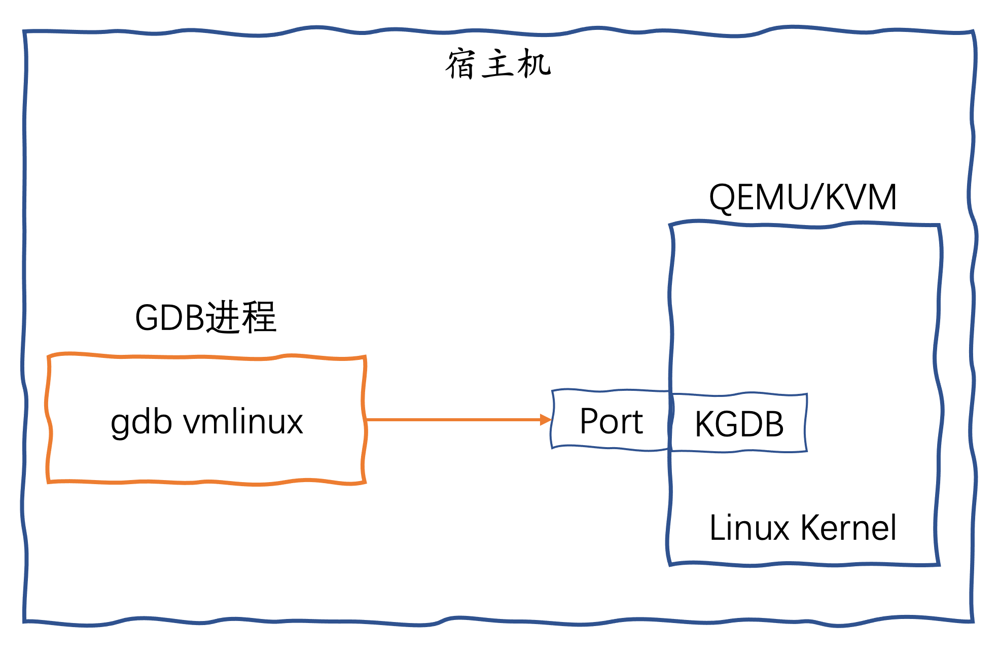
- 使用主机的gdb作为kernel调试前端;
- 使用KGDB作为kernel调试的后端,即gdbserver端.

为了构建能够调试的内核,即具有符号信息，我们需要几个配置。
- CONFIG_DEBUG_KERNEL
- CONFIG_DEBUG_INFO:在内核和内核模块中包含调试信息，这个选项在幕后为
  gcc使用的编译器参数增加了-g选项。这个选项的菜单路径如下;
  #+begin_example
    Kernel hacking  --->
    Compile-time checks and compiler options  ---> 
     [*] Compile the kernel with debug info
  #+end_example
- CONFIG_FRAME_POINTER: 这个选项会将调用帧信息保存在寄存器或堆栈上的不
  同位置，使gdb在调试内核时可以更准确地构造堆栈回溯跟踪(stack back
  traces);
- 启用CONFIG_GDB_SCRIPTS，但要关闭CONFIG_DEBUG_INFO_REDUCED;
- CONFIG_KGDB: 启用内置的内核调试器，该调试器允许进行远程调试;
- 关闭CONFIG_RANDOMIZE_BASE设置: KASLR会更改引导时放置内核代码的基地址。
  如果你在内核配置中启用了KASLR(CONFIG_RANDOMIZE_BASE=y)，则无法从
  gdb设置断点。
  

为了能让gdb在启动时能够加载Linux helper脚本，需要在~/.gdbinit文件中添
加如下内容, "/path/to/linux-build"就是Linux源码目录。
#+begin_example
  add-auto-load-safe-path /path/to/linux-build
#+end_example

在主机的linux-source目录下执行如下命令.
#+begin_src shell
  gdb vmlinux
#+end_src

然后在gdb的交互环境下使用如下命令attach到linux内核。
#+begin_src shell
  target remote :1234
#+end_src

在串口没有启动前,可以使用如下gdb命令导出串口缓存的日志.
#+begin_src shell
  # 直接输出
  p (char*) &__log_buf[log_start]
  # 定义gdb函数dmesg输出
  define dmesg
      set $__log_buf = $arg0
      set $log_start = $arg1
      set $log_end = $arg2
      set $x = $log_start
      echo "
      	 while ($x < $log_end)
      	        set $c = (char)(($__log_buf)[$x++])
            	printf "%c" , $c
  	 end
           echo "\n
  end

  document dmesg
  dmesg __log_buf log_start log_end
  Print the content of the kernel message buffer
  end
#+end_src

而动态模块在被kernel运行前是不知道自己的运行地址的,可以通过如下gdb函数
得到ko模块的地址,然后使用add-symbol-file加载符号表到对应地址,进行源码
级调试,注意加载符号表用的是o文件,不是ko文件,关于调试方法,这里有详细[[https://gracker.gitbooks.io/elinux/content/en/dbg_portal/kernel_dbg/Debugging_The_Linux_Kernel_Using_Gdb/Debugging_The_Linux_Kernel_Using_Gdb.html][网页]].
#+begin_src shell
  lsmod

  cat /sys/module/mydriver/sections/.text

  #gdb implementation of the linux lsmod
  define lsmod
      set $current = modules.next
      set $offset =  ((int)&((struct module *)0).list)
      printf "Module\tAddress\n"

      while($current.next != modules.next)
           printf "%s\t%p\n",  \
                  ((struct module *) (((void *) ($current)) - $offset ) )->name ,\
                  ((struct module *) (((void *) ($current)) - $offset ) )->module_core
           set $current = $current.next
      end
  end
  # Loading Symbols of a loaded module
  add-symbol-file drivers/mydrivers/mydriver.o 0xbf098000
#+end_src
*** vmlinux-gdb.py
这个脚本出现在编译后的编译目录下,要生成这个脚本,需要做几个配置.
- CONFIG_GDB_SCRIPTS: 打开, 生成vmlinux-gdb.py的开关;
- CONFIG_DEBUG_INFO_REDUCED: 关闭;
- CONFIG_FRAME_POINTER: 打开, 它会产生更清晰的回溯信息.

这个脚本可以提供很多更便利的kernel调试接口, 要使用这个脚本,调试器需要
使用xxx-gdb-py的gdb工具,如"aarch64-none-linux-gnu-gdb-py", 加载脚本,可
以在gdb环境下,用source命令,然后就可以使用里面的命令接口.
#+begin_src shell
  source xxx/build/vmlimux-gdb.py
#+end_src

可以使用如下命令获得这些辅助命令接口
#+begin_src shell
  (gdb) apropos lx 
  function lx_clk_core_lookup -- Find struct clk_core by name
  function lx_current -- Return current task.
  function lx_device_find_by_bus_name -- Find struct device by bus and name (both strings)
  function lx_device_find_by_class_name -- Find struct device by class and name (both strings)
  function lx_module -- Find module by name and return the module variable.
  function lx_per_cpu -- Return per-cpu variable.
  function lx_rb_first -- Lookup and return a node from an RBTree
  function lx_rb_last -- Lookup and return a node from an RBTree.
  function lx_rb_next -- Lookup and return a node from an RBTree.
  function lx_rb_prev -- Lookup and return a node from an RBTree.
  function lx_task_by_pid -- Find Linux task by PID and return the task_struct variable.
  function lx_thread_info -- Calculate Linux thread_info from task variable.
  function lx_thread_info_by_pid -- Calculate Linux thread_info from task variable found by pid
  lx-clk-summary -- Print clk tree summary
  lx-cmdline -- Report the Linux Commandline used in the current kernel.
  lx-configdump -- Output kernel config to the filename specified as the command
  lx-cpus -- List CPU status arrays
  lx-device-list-bus -- Print devices on a bus (or all buses if not specified)
  lx-device-list-class -- Print devices in a class (or all classes if not specified)
  lx-device-list-tree -- Print a device and its children recursively
  lx-dmesg -- Print Linux kernel log buffer.
  lx-fdtdump -- Output Flattened Device Tree header and dump FDT blob to the filename
  lx-genpd-summary -- Print genpd summary
  lx-iomem -- Identify the IO memory resource locations defined by the kernel
  lx-ioports -- Identify the IO port resource locations defined by the kernel
  lx-list-check -- Verify a list consistency
  lx-lsmod -- List currently loaded modules.
  lx-mounts -- Report the VFS mounts of the current process namespace.
  lx-ps -- Dump Linux tasks.
  lx-symbols -- (Re-)load symbols of Linux kernel and currently loaded modules.
  lx-timerlist -- Print /proc/timer_list
  lx-version -- Report the Linux Version of the current kernel.
#+end_src
*** lx-symbols
可以加载符号表.
#+begin_src shell
  (gdb) cd <kernel_build_directory_path>
  (gdb) lx-symbols [specific_module_symbol_path1] 
#+end_src
*** lx-dmesg
可以显示调试messages;
#+begin_example
  (gdb) lx-dmesg
  [    0.000000] Booting Linux on physical CPU 0x0
  [    0.000000] Linux version 4.14.48 (oe-user@oe-host) 
  [    0.000000] CPU: ARMv7 Processor [410fc075] 
  [    0.000000] CPU: div instructions available: patching division code
  [    0.000000] CPU: PIPT / VIPT nonaliasing data cache
  [    0.000000] OF: fdt: Machine model: STMicroelectronics
  [    0.000000] bootconsole [earlycon0] enabled
#+end_example
*** lx-lsmod
可以显示加载的模块
#+begin_example
  (gdb) lx-lsmod 
   Address    Module                  Size  Used by
   0xbf0ba000 galcore               294912  0
   0xbf0ad000 stm32_dcmi             28672  0
   0xbf0a4000 videobuf2_dma_contig    20480  1 stm32_dcmi
   0xbf09d000 videobuf2_memops       16384  1 videobuf2_dma_contig
   0xbf094000 videobuf2_v4l2         20480  1 stm32_dcmi
   0xbf086000 videobuf2_core         36864  2 stm32_dcmi,videobuf2_v4l2
#+end_example
*** lx-ps
可以显示当前内核进程
#+begin_example
  (gdb) lx-ps
   0xc1007580 <init_task> 0 swapper/0
   0xee8b8000 1 systemd
   0xee8b8680 2 kthreadd
   0xee8b9380 4 kworker/0:0H
   0xee8b9a00 5 kworker/u4:0
#+end_example

** printk
printk定义了8个消息级别，分为级别0~7，级别越低（数值越大），消息越不重要，第0级是紧急
事件级，第7级是调试级
#+begin_src c
  #define KERN_EMERG "<0>" /* 紧急事件，一般是系统崩溃之前提示的消息*/
  #define KERN_ALERT "<1>" /* 必须立即采取行动*/
  #define KERN_CRIT "<2>" /* 临界状态，通常涉及严重的硬件或软件操作失败*/
  #define KERN_ERR "<3>" /* 用于报告错误状态，设备驱动程序会经常使用KERN_ERR来报告来自硬件的问题*/
  #define KERN_WARNING "<4>" /* 对可能出现问题的情况进行警告，这类情况通常不会对系统造成严重的问题*/
  #define KERN_NOTICE "<5>" /* 有必要进行提示的正常情形，许多与安全相关的状况用这个级别进行汇报*/
  #define KERN_INFO "<6>" /* 内核提示性信息，很多驱动程序在启动的时候，用这个级别打印出它们找到的硬件信息*/
  #define KERN_DEBUG "<7>" /* 用于调试信息*/
#+end_src

要注意的是，/proc/sys/kernel/printk并不控制内核消息进入__log_buf的门槛，
因此无论消息级别是多少，都会进入__log_buf中，但是最终只有高于当前打印
级别的内核消息才会从控制台打印，__log_buf可以通过dmesg输出，也可以使用
cat /proc/kmsg命令来显示内核信息；printk有很多预定义的宏.
- pr_xxx族:可以预设一些标志；
  + pr_debug
  + pr_info
  + pr_err
- dev_xxx族：设备名称会被自动加到打印消息的前头；
  + dev_err
  + dev_info
** strace
strace可以监视系统调用.它会给出每次系统调用的“左边=右边”信息，等号左边
是系统调用的函数名及其参数，右边是该调用的返回值。
** kgdb
为了支持KGDB，串口驱动应该实现纯粹的轮询收发单一字符的成员函数。以供
drivers/tty/serial/kgdboc.c调用。

对于目标板而言，需要在bootargs中设置与KGDB对应的串口等信息，如
kgdboc=ttyS0，115200kgdbcon。如果想一开机内核就直接进入等待GDB连接的调
试状态，可以在bootargs中设置kgdbwait，kgdbwait的含义是启动时就等待主机
的GDB连接。而若想在内核启动后进入GDB调试模式，可运行echo g >
/proc/sysrq_trigger命令给内核传入一个键值是g的magic_sysrq。在调试PC上，
依次运行如下命令就可以启动调试并连接至目标机（假设串口在PC上对应的设备
节点是/dev/ttyS0）
#+begin_src shell
  # arm-eabi-gdb ./vmlinux
  (gdb) set remotebaud 115200
  (gdb) target remote /dev/ttyS0
#+end_src
** 性能工具
*** top
top命令用于显示处理器的活动状况，每隔5s做一次刷新.
*** vmstat
用于报告关于内核线程、虚拟内存、磁盘、陷阱和CPU活动的统计信息。
*** iostat
用于分析各个磁盘的传输闲忙状况。
*** sysctl
用于改变正在运行中的Linux系统的接口，用sysctl可以读取几百个以上的系统
变量。
*** netstat
用来检测网络信息的工具。
*** sar
用于收集、报告或者保存系统活动信息，其中，sar用于显示数据，sar1和sar2
用于收集和保存数据。
*** OProfile
可以帮助用户识别诸如模块的占用时间、循环的展开、高速缓存的使用率低、低
效的类型转换和冗余操作、错误预测转移等问题。它收集有关处理器事件的信息，
其中包括TLB的故障、停机、存储器访问及缓存命中和未命中的指令的攫取数量。
*** gprof
gprof可以打印出程序运行中各个函数消耗的时间，以帮助程序员找出众多函数
中耗时最多的函数；还可产生程序运行时的函数调用关系，包括调用次数，以帮
助程序员分析程序的运行流程。gprof的基本用法如下。
- 使用-pg编译和链接应用程序。
- 执行应用程序并使它生成供gprof分析的数据。
- 使用gprof程序分析应用程序生成的数据。
*** LTTng 
用于跟踪系统详细运行状态和流程的工具，它可以跟踪记录系统中的特定事件。
这些事件包括，而对于这些记录，我们可以通过图形的方式经由lttv-gui查看，。
- 系统调用的进入和退出；
- 陷阱/中断（Trap/Irq）的进入和退出；
- 进程调度事件；
- 内核定时器；
- 进程管理相关事件——创建、唤醒、信号处理等；
- 文件系统相关事件——open/read/write/seek/ioctl等；
- 内存管理相关事件——内存分配/释放等；
- 其他IPC/套接字/网络等事件。
** benchmark
- lmbench
- UnixBench
- AIM9
- Netperf
- SSLperf
- dbench
- Bonnie
- Bonnie++
- Iozone
- BYTEmark
* kernel编译
- vmlinux: 依据arch/arm/kernel/vmlinux.lds 生成linux内核源码根目录下的
  vmlinux，这个vmlinux属于未压缩，带调试信息、符号表的最初的内核，大小
  约从几十到几百兆；  
  #+begin_src shell
    xxx-ld -o vmlinux -T arch/arm/kernel/vmlinux.lds  \
                     arch/arm/kernel/head.o  \
                     init/built-in.o  \
                     --start-group   \
                     arch/arm/mach-s3c2410/built-in.o  \
                     kernel/built-in.o          \
                     mm/built-in.o   \
                     fs/built-in.o   \
                     ipc/built-in.o   \
                     drivers/built-in.o   \
                     net/built-in.o  \
                     --end-group\
                     .tmp_kallsyms2.o 
  #+end_src
- Image: 将上面的vmlinux去除调试信息、注释、符号表等内容，生成
  arch/arm/boot/Image，这是不带多余信息的linux内核，Image的大小约3.2MB；
  #+begin_src shell
    xxx-objcopy -O binary -S  vmlinux arch/arm/boot/Image 
  #+end_src
- piggy.gz将arch/arm/boot/Image 用gzip -9 压缩生成
  arch/arm/boot/compressed/piggy.gz大小约1.5MB；
  #+begin_src shell
    gzip -f -9 < arch/arm/boot/Image > arch/arm/boot/compressed/piggy.gz 
  #+end_src
- 编译arch/arm/boot/compressed/piggy.S 生成
  arch/arm/boot/compressed/piggy.o大小约1.5MB，这里实际上是将piggy.gz
  通过piggy.S编译进piggy.o文件中。而piggy.S文件仅有6行，只是包含了文件
  piggy.gz;
  #+begin_src shell
    xxx-gcc -o arch/arm/boot/compressed/piggy.o \
            arch/arm/boot/compressed/piggy.S 
  #+end_src
- 依据arch/arm/boot/compressed/vmlinux.lds 将arch/arm/boot/compressed/
  目录下的文件head.o 、piggy.o 、misc.o链接生成
  arch/arm/boot/compressed/vmlinux，这个vmlinux是经过压缩且含有自解压
  代码的内核,大小约1.5MB;
  #+begin_src shell
    xxx-ld zreladdr=0x30008000 params_phys=0x30000100 \
           -T arch/arm/boot/compressed/vmlinux.lds \
           arch/arm/boot/compressed/head.o\
           arch/arm/boot/compressed/piggy.o \
           arch/arm/boot/compressed/misc.o \
           -o arch/arm/boot/compressed/vmlinux 
  #+end_src
- 将arch/arm/boot/compressed/vmlinux去除调试信息、注释、符号表等内容，
  生成arch/arm/boot/zImage大小约1.5MB;这已经是一个可以使用的linux内核
  映像文件了；
  #+begin_src shell
    xxx-objcopy -O binary -S arch/arm/boot/compressed/vmlinux\
                arch/arm/boot/zImage 
  #+end_src
- 将arch/arm/boot/zImage添加64Bytes的相关信息打包为
  arch/arm/boot/uImage大小约1.5MB;
  #+begin_src shell
    ./mkimage -A arm -O linux -T kernel -C none\
              -a 0x30008000 -e 0x30008000 \
              -n 'Linux-2.6.35.7' \
              -d arch/arm/boot/zImage arch/arm/boot/uImage
  #+end_src

借用biscuitos的一张图直观的描述下压缩内核生成过程：
#+caption: 内核编译过程
#+name: img-kernel-build
#+attr_latex: :placement [H] :width 0.6\textwidth
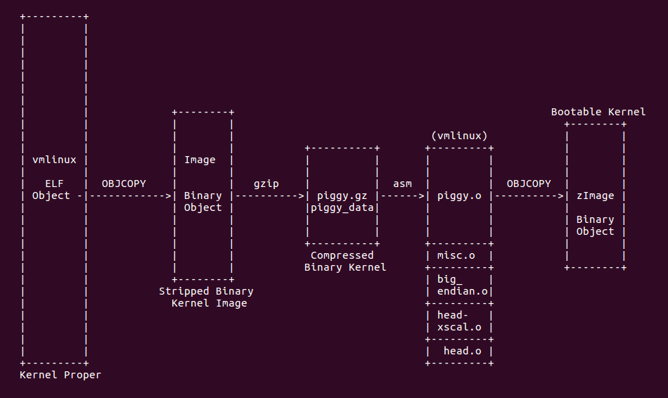

- uImage格式: 压缩的vmlinux+u-boot header；
- vmlinux：Linux kernel的核心资产，elf格式，包含信息如下，包含的主要部
  件见表[[tbl-vmlinuxcomp]]所示。
  + symbols；
  + comments
  + debug info
  + architecture-generic components

  #+caption: vmlinux主要部件
  #+name: tbl-vmlinuxcomp
  #+attr_latex: :placement [H]
  |---------------------------------+------------------------------------------------|
  | Component                       | Description                                    |
  |---------------------------------+------------------------------------------------|
  |---------------------------------+------------------------------------------------|
  | arch/arm/kernel/head.o          | Kernel arch-specific startup code.             |
  | init_task.o                     | Initial thread & task structs.                 |
  | init/built-in.o                 | Main kernel-initialization code.               |
  | usr/built-in.o                  | Built-in initramfs image.                      |
  | arch/arm/kernel/built-in.o      | Arch-specific kernel code.                     |
  | arch/arm/mm/built-in.o          | Arch-specific memory-management code.          |
  | arch/arm/common/built-in.o      | Arch-specific generic code. Varies by arch.    |
  | arch/arm/mach-ixp4xx/built-in.o | Machine-specific code, usually initialization. |
  | arch/arm/nwfpe/built-in.o       | Arch-specific floating point-emulation code.   |
  | kernel/built-in.o               | Common components of the kernel itself.        |
  | mm/built-in.o                   | Common components of memory-management code.   |
  | ipc/built-in.o                  | Interprocess communications, such as SysV IPC. |
  | security/built-in.o             | Linux security components.                     |
  | lib/lib.a                       | Archive of miscellaneous helper functions.     |
  | arch/arm/lib/lib.a              | Arch-specific common facilities.               |
  | lib/built-in.o                  | Common kernel helper functions.                |
  | drivers/built-in.o              | All the built-in driversnot loadable modules.  |
  | sound/built-in.o                | Sound drivers.                                 |
  | net/built-in.o                  | Linux networking.                              |
  | .tmp_kallsyms2.o                | Symbol table.                                  |
  |---------------------------------+------------------------------------------------|

- System.map： 基于文本的内核vmlinux模块符号表；
- Image：二进制的内核，剥离了symbols，notes，comments
- piggy.gz: 将二进制的Image进行gzip压缩后的结果。
- piggy.s: 包含对piggy.gz的引用指令。
  #+begin_src asm
    .section .piggydata,#alloc
    .globl input_data
    input_data:
    .incbin "arch/arm/boot/compressed/piggy.gz"
    .globl input_data_end
    input_data_end:
  #+end_src
  
- zImage：最终的内核镜像，被bootloader引导；
- .version: 该文件用于记录编译序号，每编译一次，scripts/mkversion脚本
  会将里面的数字增加1次；
- 内核镜像构造过程见图[[drw-kernelconstruct]]。
  #+begin_src plantuml :exports results :file ./pic/drw-kernelconstruct.png
    vmlinux -right-> Image: objcopy
    vmlinux: + elf object  
    vmlinux: + kernel proper  
    Image: + stripped binary kernel image    
    Image -right-> piggy.gz: gzip
    piggy.gz: compressed binary kernel
    piggy.gz --> zImage: asm
    zImage: Bootable kernel image
  #+end_src
  #+caption: Composite Kernel Image Construction
  #+name: drw-kernelconstruct
  #+attr_latex: :placement [H] :width 0.6\textwidth
  #+results:
  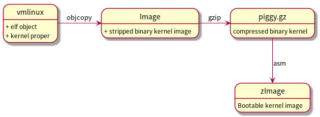

对于64位的内核则和32位的有所不同.具体参见图[[img-kernel-armxx]]所示.
#+caption: 64位内核编译
#+name: img-kernel-armxx
#+attr_latex: :placement [H] :width 0.8\textwidth
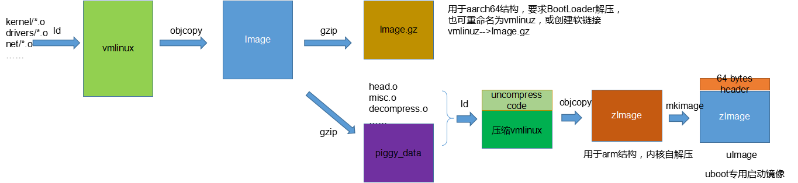
* 代码分析 
** 内核引导过程
Linux 内核启动是 “BootROM->U-Boot->内核->用户空间” 的控制权移交过程，
核心链路为“上电->固件自检->U-Boot加载内核/initramfs->内核早期初始
化->start_kernel->挂载根文件系统->启动1号进程->进入用户态”, 如图
[[drw-btctlflow]]。
#+begin_src plantuml :exports results :file ./pic/drw-kernelboot.png
  BootROM -right-> UBoot: PowerOn
  UBoot -right-> BootstrapLoader.head: start()
  BootstrapLoader.head -right-> vmlinux.head: start()
  vmlinux.head -->vmlinux.main: start_kernel()
#+end_src
#+caption: ARM Boot Control Flow
#+name: drw-btctlflow
#+attr_latex: :placement [H] :width 0.6\textwidth
#+results:
file:./pic/drw-kernelboot.png]]
** zImage入口函数
zImage初始化阶段源码位于 arch/arm/boot/compressed/ 目录下。根据之前分
析的原理可知， 压缩之后的内核会添加 bootstrap 功能之后生成 vmlinux，再
经过 OBJCOPY 工具处理生成 zImage。所以可以通过查看 vmlinux 的链接脚本
确定zImage的入口地址。zImage 使用的链接脚本位于
arch/arm/boot/compressed/vmlinux.lds.S, 具体内容如下
#+begin_src shell
  OUTPUT_ARCH(arm)
  ENTRY(_start)
  SECTIONS
  {
    /DISCARD/ : {
      *(.ARM.exidx*)
      *(.ARM.extab*)
      /*
       * Discard any r/w data - this produces a link error if we have any,
       * which is required for PIC decompression.  Local data generates
       * GOTOFF relocations, which prevents it being relocated independently
       * of the text/got segments.
       */
      *(.data)
    }

    . = TEXT_START;
    _text = .;

    .text : {
      _start = .;
      *(.start)
      *(.text)
      *(.text.*)
      *(.fixup)
      *(.gnu.warning)
      *(.glue_7t)
      *(.glue_7)
    }
#+end_src  

从链接脚本可以知道vmlinux链接过程，使用ENTRY关键字指定了vmlinux的入口
地址， 也就是第一行运行的代码，这里设置为 _start, 从上面可以看出
_start 位于 .text section 的首地址，所以这里链接脚本告诉开发者，
vmlinux 运行的第一行代码就是 vmlinux .text section 的第一行代码。继续
查看链接脚本， .text section 的布局是所有目标文件的 .start section 位
于 vmlinux .text section 的最前部，所以开发者只需找到目标文件 中函数
.start section 的文件即可。由arch/arm/boot/compressed/Makefile可知，
head.o第一个被链接进vmlinx， start段为heads中的start section
#+begin_src makefile
  HEAD    = head.o
  $(obj)/vmlinux: $(obj)/vmlinux.lds $(obj)/$(HEAD) $(obj)/piggy.o \
          $(addprefix $(obj)/, $(OBJS)) $(lib1funcs) $(ashldi3) \
          $(bswapsdi2) $(efi-obj-y) FORCE
      @$(check_for_multiple_zreladdr)
      $(call if_changed,ld)
      @$(check_for_bad_syms)
#+end_src

找到start开始的代码如下
#+begin_src asm
  .section ".start", #alloc, #execinstr     //属性是可分配和可执行的
  /**
   * sort out different calling conventions
   */
     .align
     /**
      * Always enter in ARM state for CPUs that support the ARM ISA.
      * As of today (2014) that's exactly the members of the A and R
      * classes.
      */
   AR_CLASS(.arm)	//.align 伪指令和 .arm 伪指令告诉汇编器，这是一个使用 arm32 指令集并 要求对齐的 section
  start:
          .type    start,#function
          .rept    7 @重复空操作7次
          __nop
          .endr
     ARM(mov  r0, r0)
     ARM(b    1f)  @跳转到1处
   THUMB(badr r12, 1f)
   THUMB(bx    r12)

          .word    _magic_sig    @ Magic numbers to help the loader  
                                 @ 魔数0x016f2818是在uboot中用于判断zImage的存在
                                 @ 这个是内核和uboot约定好的。
          .word    _magic_start  @ absolute load/run zImage address 用于指定zImage的加载和运行的绝对地址
          .word    _magic_end    @ zImage end address
          .word    0x04030201    @ endianness flag 表示字节序标志

   THUMB(.thumb)
  1:        __EFI_HEADER  //指向 EFI 头

   ARM_BE8(setend    be)         @ go BE8 if compiled for BE8
   AR_CLASS(mrs    r9, cpsr)
  #ifdef CONFIG_ARM_VIRT_EXT
          bl __hyp_stub_install  @ get into SVC mode, reversibly
  #endif
          @ r1和r2中分别存放着由uboot传递过来的
          @ architecture ID和指向标记列表的指针。
          mov r7, r1 @ save architecture ID
          mov r8, r2 @ save atags pointer

  #ifndef CONFIG_CPU_V7M
          /**
           * Booting from Angel - need to enter SVC mode and disable
           * FIQs/IRQs (numeric definitions from angel arm.h source).
           * We only do this if we were in user mode on entry.
           */
          mrs    r2, cpsr   @get current mode
          tst    r2, #3     @not user?
          bne    not_angel
          mov    r0, #0x17  @angel_SWIreason_EnterSVC
   ARM(swi 0x123456) @ angel_SWI_ARM  angel_SWI_ARM 0x123456是arm指令集的半主机操作编号
   THUMB(svc 0xab)   @ angel_SWI_THUMB
  not_angel:
          safe_svcmode_maskall r0  @进入svc模式
          msr  spsr_cxsf, r9       @ Save the CPU boot mode in
                                   @ SPSR
  #endif
#+end_src

接下来，head.S将找到物理地址的起始地址，这个时候MMU是没有打开的，这个
时候是忽略任何地址对齐和偏移。head.S选择最开始的128MB处作为对齐地址，
然后将zImage放在这物理地址起始处，这128MB就是用来专门存放zImage镜像的。
具体 代码如下：
#+begin_src asm
  #ifdef CONFIG_AUTO_ZRELADDR
      /**
       * Find the start of physical memory.  As we are executing
       * without the MMU on, we are in the physical address space.
       * We just need to get rid of any offset by aligning the
       * address.
       *
       * This alignment is a balance between the requirements of
       * different platforms - we have chosen 128MB to allow
       * platforms which align the start of their physical memory
       * to 128MB to use this feature, while allowing the zImage
       * to be placed within the first 128MB of memory on other
       * platforms.  Increasing the alignment means we place
       * stricter alignment requirements on the start of physical
       * memory, but relaxing it means that we break people who
       * are already placing their zImage in (eg) the top 64MB
       * of this range.
       */
      mov    r4, pc
      and    r4, r4, #0xf8000000
      /* Determine final kernel image address. */
      add    r4, r4, #TEXT_OFFSET
  #else
      ldr    r4, =zreladdr
  #endif
#+end_src

这段代码主要用于计算内核的解压地址，并将解压地址存储到r4寄存器中。首先
调用代码“mov, r4, pc”，将当前CPU执行的地址存储到r4，然后在将
0xf8000000的值与r4相与达到对齐的作用，确保之后的内核解压地址按128M对齐，
然后将r4寄存器的值加上TEXT_OFFSET，TEXT_OFFSET代表内核的解压地址，这样
r4寄存器就存储了内核的解压 地址。EXT_OFFSET 定义在 arch/arm/Makefile
中，如下：
#+begin_src makefile
  # Text offset. This list is sorted numerically by address in order to
  # provide a means to avoid/resolve conflicts in multi-arch kernels.
  textofs-y    := 0x00008000
  # We don't want the htc bootloader to corrupt kernel during resume
  textofs-$(CONFIG_PM_H1940)      := 0x00108000
  # SA1111 DMA bug: we don't want the kernel to live in precious DMA-able memory
  ifeq ($(CONFIG_ARCH_SA1100),y)
          textofs-$(CONFIG_SA1111) := 0x00208000
  endif
          textofs-$(CONFIG_ARCH_MSM8X60) := 0x00208000
          textofs-$(CONFIG_ARCH_MSM8960) := 0x00208000
          textofs-$(CONFIG_ARCH_AXXIA) := 0x00308000
  # The byte offset of the kernel image in RAM from the start of RAM.TEXT_OFFSET := $(textofs-y)
#+end_src

这里根据自己环境的芯片类型选择offset(：=表示覆盖之前的赋值)。这里分析
按照0x00008000进行计算。接着执行如下代码
#+begin_src asm
  /**
   * Set up a page table only if it won't overwrite ourself.
   * That means r4 < pc || r4 - 16k page directory > &_end.
   * Given that r4 > &_end is most unfrequent, we add a rough
   * additional 1MB of room for a possible appended DTB.
   */
   mov    r0, pc
   cmp    r0, r4 //此操作影响状态寄存器中的C状态位.
   ldrcc    r0, LC0+32
   addcc    r0, r0, pc
   cmpcc    r4, r0
   orrcc    r4, r4, #1        @ remember we skipped cache_on
   blcs    cache_on //如果pc>r4则直接执行这里
#+end_src

其中LC0定义如下
#+begin_src asm
  .align    2
      .type    LC0, #object
  LC0:
      .word  LC0            @r1
      .word  __bss_start    @r2
      .word  _end           @r3
      .word  _edata         @r6
      .word  input_data_end - 4    @ r10 (inflated size location)
      .word  _got_start     @r11
      .word  _got_end       @ip
      .word  .L_user_stack_end    @ sp
      //LC0+32位置，zImage 需要重定位的长度再加上 “16K + 1M” 的长度
      .word  _end - restart + 16384 + 1024*1024   
      .size  LC0, . - LC0
#+end_src

这段代码的主要任务就是确认 zImage 自己建立的页表会不会被 zImage 镜像的
重定位给覆盖掉。从原理可以知道，zImage被加载到内存运行之后，会将自己
重定位到新的物理地址运行，这就会出现要创建的页表可能被 zImage重定位之
后覆盖。zImage镜像如果不被自己给覆盖，需要满足两个条件中的任意一个：
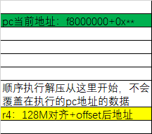

这种情况下，内核的解压地址小于当前 PC 运行物理地址。
$$r4 - 16k page directory > &_end$$

这种情况下，内核的解压地址大于zImage结束地址之后的16KB。一般情况下解压
内核的地址大于zImage的结束地址是不太寻常的。这种情况下需要添加1MB的空
间与链接在zImage中的DTB隔开。

运行到这里，首先获得PC寄存器的值，然后调用“cmp r0, r4”, 从之前的代码可
知，r4寄存器存储着解压内核的地址，这里执行这条命令的含义是，如果r0>r4，
那么代表当前 PC 执行地址大于内核解压地址，这种情况符合之前的讨论，
所以那么就执行 cache_on 宏； 如果 r0 < r4, 那么 zImage 的运行范围包含
了要解压内核的地址，因此需要继续进行检测。 这里执行命令 “ldrcc r0,
LC0+32”, 通过这个命令，将 LC0 偏移 32 个字节地址对应的内容 拷贝到 r0
寄存器。这里再加上 PC 的值，确保当前运行的代码也不会被覆盖。 接着执行
命令 “cmpcc r4, r0”, 重新确定解压内核的物理地址与 zImage 重定位的物理
地址 是否存在重叠。如果存在，那么将 r4 寄存器的值加 1，以此标记
cache_on 被跳过；否则 执行 “blcs cache_on” 打开缓存。cache_on代码如下
#+begin_src asm
  /**
   * Turn on the cache.  We need to setup some page tables so that we
   * can have both the I and D caches on.
   *
   * We place the page tables 16k down from the kernel execution address,
   * and we hope that nothing else is using it.  If we're using it, we
   * will go pop!
   *
   * On entry,
   *  r4 = kernel execution address
   *  r7 = architecture number
   *  r8 = atags pointer
   * On exit,
   *  r0, r1, r2, r3, r9, r10, r12 corrupted
   * This routine must preserve:
   *  r4, r7, r8
   */
      .align    5
  cache_on:    mov    r3, #8 @ cache_on function
      b    call_cache_fn
#+end_src

cache_on 用于打开 ARM 的 cache 功能，cache 包括 I-Cache (指令 cache)
和 D-cache (数据 cache)。为了正常使用 cache，需要建立一个页表供 MMU 使
用。zImage 会将这个页表 放在真正内核开始执行地址之前的 16K 位置，希望
这个地址不要被非法使用。在执行 cache_on 之前， r4 寄存器里存储值内核解
压地址，这个地址也被成为正真内核开始执行的地址。r7 寄存器存储这体系 相
关的数据；r8 寄存器存储着 uboot 传递给内核 ATAG 参数的地址。cache_on
使用伪指令 .align 指定了对齐方式为 5 字节对齐。由于 ARM 将所有家族芯片
关于 cache 的操作都放在一个表里维护， 因此 armv7 的 cache 操作也在这个
表内，并且 cache_on 操作在表中的偏移是 8，因此代码 将立即数 8 存储到
r3 寄存器，并跳转到 call_cache_fn 出执行，代码如下：
#+begin_src asm
  call_cache_fn:    adr    r12, proc_types
  #ifdef CONFIG_CPU_CP15
      mrc    p15, 0, r9, c0, c0    @ get processor ID
  #elif defined(CONFIG_CPU_V7M)
      /*
      * On v7-M the processor id is located in the V7M_SCB_CPUID
      * register, but as cache handling is IMPLEMENTATION DEFINED on
      * v7-M (if existant at all) we just return early here.
      * If V7M_SCB_CPUID were used the cpu ID functions (i.e.
      * __armv7_mmu_cache_{on,off,flush}) would be selected which
      * use cp15 registers that are not implemented on v7-M.
      */
      bx    lr
  #else
      ldr    r9, =CONFIG_PROCESSOR_ID
  #endif
  1:
      ldr    r1, [r12, #0]        @ get value
      ldr    r2, [r12, #4]        @ get mask
      eor    r1, r1, r9        @ (real ^ match)
      tst    r1, r2            @       & mask
   ARM(addeq pc, r12, r3) @ call cache function
   THUMB(addeq    r12, r3)
   THUMB(moveq    pc, r12) @ call cache function
      add    r12, r12, #PROC_ENTRY_SIZE
      b      1b
#+end_src

本段代码的主要任务就是 cache_on 表中找到 armv7 对应的 cache_on 操作。
代码首先使用 adr 伪指令获得 proc_types 的地址，然后在 CONFIG_CPU_CPU15
宏启用的情况下，armv7 这个宏启用， 使用 mrc 指令，读取了 CPU ID 寄存器。

将 ID 相关的信息存储在 r9 寄存器里，然后使用 ldr 指令，从 proc_types
表里按顺序取出每个 成员的第一个值和第二个值，分别存储在 r1, r2 寄存器
中。接着代码将 r1 寄存器的值与 r9 寄存器 的值做异或运算，然后将结果存
储到 r1 寄存器，接着再调用 tst 命令，将 r1 寄存器与 r2 寄存器 按位与操
作。如果结果为零，那么就执行 addeq 指令，将 pc 指向表中的位置；如果结
果不为零， 那么调用 add 指令，将 r12 指向下一个表成员，调用 b 指令继续
循环。

表 proc_types 定义为一个 object 对象，其中包含了 armv7 对应的成员，
cache_on 对应的入口 函数就是： __armv7_mmu_cache_on，结构如下：
#+begin_src asm
  /**
   * Table for cache operations.  This is basically:
   *   - CPU ID match
   *   - CPU ID mask
   *   - 'cache on' method instruction
   *   - 'cache off' method instruction
   *   - 'cache flush' method instruction
   *
   * We match an entry using: ((real_id ^ match) & mask) == 0
   *
   * Writethrough caches generally only need 'on' and 'off'
   * methods.  Writeback caches _must_ have the flush method
   * defined.
   */
      .align    2
      .type    proc_types,#object
  proc_types:
      .word    0x41000000  @ old ARM ID
      .word    0xff00f000
      mov    pc, lr
   THUMB(nop)
      mov    pc, lr
   THUMB(nop)
      mov    pc, lr
   THUMB(nop)
      .word 0x000f0000 @ new CPU Id		
      .word 0x000f0000
      W(b)  __armv7_mmu_cache_on
      W(b)  __armv7_mmu_cache_off
      W(b)  __armv7_mmu_cache_flush
#+end_src

__armv7_mmu_cache_on 函数首先将 lr 寄存器的值存储到 r12 寄存器，然后判
断 CONFIG_MMU 宏是否启用。在 armv7 里，这个宏是启用的，所以执行宏限定
的代码。首先也是通过 mrc 指令读取 ID_MMFR0 寄存器的值到 r11 寄存器中,
其中， ID_MMFR0 的最低位用于指示当前 CPU 是支持 VMSA 还是 PMSA。VMSA
指的是 Virtual Memory System Architecture。PMSA 指的是 Protected
Memory System Architecture。 两种模式具有不同的内存管理策略，具体介绍
开发者可以参考 ARMv7 Reference Manual。接着使用 tst 指令查看 r11 寄存
器的最低 4 位的值，以此判断目前 CPU 是 VMSA 模式还是 PMSA 模式。 如果
r11 寄存器的最低 4 bit 不为零，即 CPU 支持 VMSA 模式，那么代码继续执行
带ne条件的指令。
#+begin_src asm
  __armv7_mmu_cache_on:
      mov r12, lr
  #ifdef CONFIG_MMU
      mrc p15, 0, r11, c0, c1, 4    @ read ID_MMFR0
      tst r11, #0xf  @ VMSA
      movne r6, #CB_BITS | 0x02    @ !XN
      blne  __setup_mmu
#+end_src

CPU 支持 VMSA，将 CB_BITS 或上 0x2 的值存储到 r6 寄存器，并将跳转到
__setup_mmu 继续执行
#+begin_src asm
  __setup_mmu:
    sub     r3, r4, #16384  @ Page directory size
    bic     r3, r3, #0xff   @ Align the pointer
    bic     r3, r3, #0x3f00
#+end_src

__setup_mmu 的主要功能是建立一个临时页表，并打开 MMU，以此供解压程序使
用虚拟地址。正如 上面的代码所示，此时 r4 寄存器指向真正内核运行的起始
地址，那么就在这个地址前 16K 处开始 建立页表，将页表的起始地址存储到
r3 寄存器，并使用 bic 指令对 r3 的地址做对齐。所以页表和内核的位置关系
如下图所示：
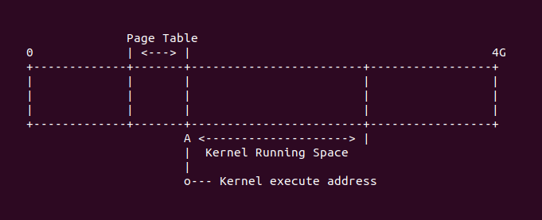

继续执行__setup_mmu中如下代码:
#+begin_src asm
  /**
   * Initialise the page tables, turning on the cacheable and bufferable
   * bits for the RAM area only.
   */
  mov     r0, r3
  mov     r9, r0, lsr #18
  mov     r9, r9, lsl #18         @ start of RAM
  add     r10, r9, #0x10000000    @ a reasonable RAM size
  mov     r1, #0x12               @ XN|U + section mapping
  orr     r1, r1, #3 << 10        @ AP=11
  add     r2, r3, #16384
#+end_src

代码首先将r3寄存器的值存储到r0寄存器，并通过对r0寄存器按(1«18)对齐，获
得RAM的起始地址，然后假设 RAM 的长度大概是 256M，并将 RAM 结束地址存放
在 r10 寄存器中。这里 这样做的目的是：该阶段，内核采用一个临时页表，页
表按 1:1 映射物理地址与虚拟地址，通过计算 获得 RAM 的长度，以此对能真
实映射 RAM 的页表项设置一种标志集；同理对不能映射物理地址的页表项设置
另外一种标志集。接着将 0x12 的值和 (3<<10) 值存储到 r1 寄存器中。将
r3 寄存器 的值加上 16K 存放到 r2 寄存器，主要是为了防止写页表时越界。
上面的左移 18 bit, 再右移 18 bit， 主要是按 1M 页表进行对齐。继续执行
如下代码：
#+begin_src asm
  1:
      cmp     r1, r9           @ if virt > start of RAM
      cmphs   r10, r1          @   && end of RAM > virt
      bic     r1, r1, #0x1c    @ clear XN|U + C + B
      orrlo   r1, r1, #0x10    @ Set XN|U for non-RAM
      orrhs   r1, r1, r6       @ set RAM section settings
      str     r1, [r0], #4     @ 1:1 mapping
      add     r1, r1, #1048576
      teq     r0, r2
      bne     1b
#+end_src

这段代码的主要任务就是设置各个页表项。有前面的代码可以知道，r1 存储着
虚拟地址，并且从虚拟 地址 0 开始。r9 寄存器值存储着物理起始地址。上面
代码的逻辑基本可以归纳为当虚拟地址不在 RAM 对于的物理地址上，那么执行
bic 指令将 r1 寄存器的 0x1c 对应的位清理，然后将 r1 与 0x10 做或运算，
以此标记这类页表；如果虚拟地址在 RAM 对于的物理地址上，那么执行 bic 指
令将 r1 寄存器的 0x1c 对应的位清理，然后将 r6 对应的标志与 r1 相与。经
过上面的处理之后调用 str 指令将 r1 的值写入 r0 寄存器对应的内存里，然
后将 r0 寄存器的值加上 4. 然后将 r1 寄存器 的值加上 1M，如果 r0 的值小
于 r2, 那么跳转到 1 处继续循环写页表。通过上面分析，可以获得 两种页表
的表示分别是： 1) 0xc12 (不映射 RAM) 2)0xc0e (映射 RAM)。
#+begin_src asm
  /**
   * If ever we are running from Flash, then we surely want the cache
   * to be enabled also for our execution instance...  We map 2MB of it
   * so there is no map overlap problem for up to 1 MB compressed kernel.
   * If the execution is in RAM then we would only be duplicating the above.
   */
      orr    r1, r6, #0x04  @ ensure B is set for this
      orr    r1, r1, #3 << 10
      mov    r2, pc
      mov    r2, r2, lsr #20
      orr    r1, r1, r2, lsl #20
      add    r0, r3, r2, lsl #2
      str    r1, [r0], #4
      add    r1, r1, #1048576
      str    r1, [r0]
      mov    pc, lr
  ENDPROC(__setup_mmu)
#+end_src

接下来这段代码主要的目的就是为了区分系统是从 Flash 启动，如果是，那么
就将 RAM 对应的页表 的前 2M 设置特殊的页表标志。此时经过映射之后，r1
指向了虚拟地址 0，然后调用 orr 指令将 r1 寄存器存储特定的标志。通过将
PC 的值传入 r2 寄存器，并计算出 r2 对应的页表中的偏移， 然后写入 r1 中
的值到页表中，然后在将 r1 的值指向下 1M 地址空间，最后将 lr 的值传递给
pc 寄存器，那么函数至此返回。接着返回__setup_mmu的调用点。执行如下代码：
#+begin_src asm
  __armv7_mmu_cache_on:
      mov     r12, lr
  #ifdef CONFIG_MMU
      mrc     p15, 0, r11, c0, c1, 4  @ read ID_MMFR0
      tst     r11, #0xf               @ VMSA
      movne   r6, #CB_BITS | 0x2      @ !XN
      blne    __setup_mmu
      mov     r0, #0
      mcr     p15, 0, r0, c7, c10, 4  @ drain write buffer
      tst     r11, #0xf               @ VMSA
      mcrne   p15, 0, r0, c8, c7, 0   @ flush I,D TLBs
  #endif
#+end_src

从 __setup_mmu 返回之后，代码首先将 r0 寄存器设置为 0，然后调用 mcr 指
令实现以此 DMB， 也就是内存屏障，保证这条指令之前所有内存访问都必须完
成。继续使用 tst 指令确定当前模式是 VMSA 模式。如果是 VMSA 模式，那么
就是调用 mcrne 指令，此时 CP15 调用情况如下图：
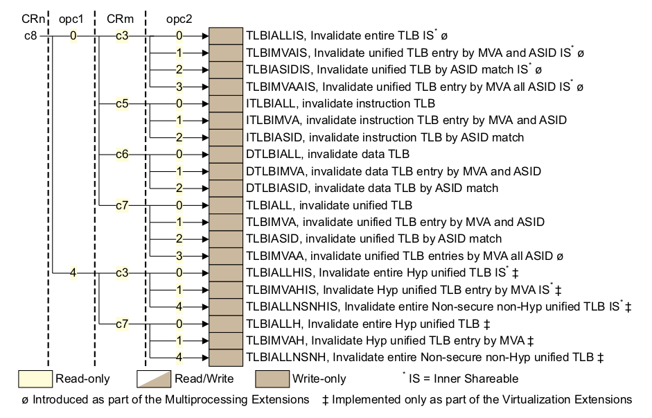

 因此此时选择的是 TLBIALL 寄存器，向该寄存器写入任何值都会影响刷 I-TLB
 和 D-TLB. 这在 MMU 启用之前是必要的。接下来执行的代码是：
 #+begin_src asm
       mrc    p15, 0, r0, c1, c0, 0 @ read control reg
       bic    r0, r0, #1 << 28      @ clear SCTLR.TRE
       orr    r0, r0, #0x5000       @ I-cache enable, RR cache replacement
       orr    r0, r0, #0x003c       @ write buffer
       bic    r0, r0, #2            @ A (no unaligned access fault)
       orr    r0, r0, #1 << 22      @ U (v6 unaligned access model)
                           @ (needed for ARM1176)
 #+end_src

首先通过 mrc 指令读取 CP15 寄存器，该寄存器的布局如下：
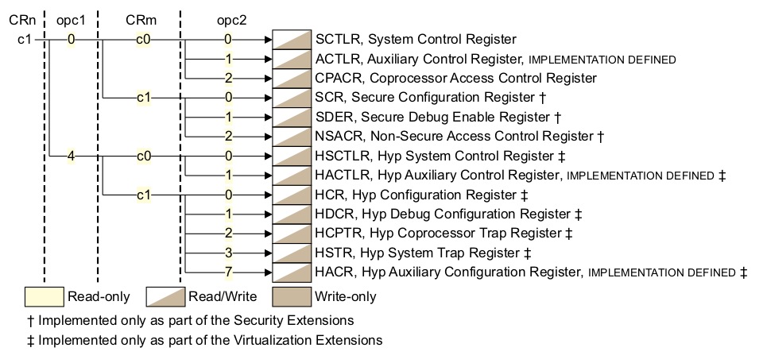

选择 SCTLR 寄存器，其位布局图如下：
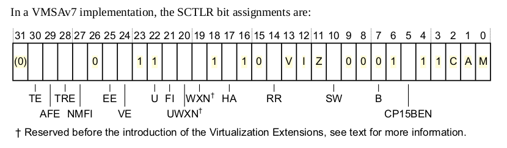

接着就是对 SCTLR 寄存器特定位的操作，首先清楚掉 TRE 位，然后选中
I-cache enable, RR cache 替代算法，写缓存，设置对齐方式，具体细节可以
查看 ARMv7 Reference Manual。接下来执行的代码如下：
#+begin_src asm
  #ifdef CONFIG_MMU
      mrcne   p15, 0, r6, c2, c0, 2   @ read ttb control reg
      orrne   r0, r0, #1              @ MMU enable
      movne   r1, #0xfffffffd         @ domain 0 = client
      bic     r6, r6, #1 << 31        @ 32-bit translation system
      bic     r6, r6, #(7 << 0) | (1 << 4)    @ use only ttbr0
      mcrne   p15, 0, r3, c2, c0, 0   @ load page table pointer
      mcrne   p15, 0, r1, c3, c0, 0   @ load domain access control
      mcrne   p15, 0, r6, c2, c0, 2   @ load ttb control
  #endif
#+end_src

接下来的代码是设置 MMU 最重要的代码，这段代码主要任务就是设置页表的基
地址寄存器，并将该寄存器 的值指向了页表的基地址。首先调用 mrcne 指令，
代表了在 VMSA 模式下，读取 TTB 控制器，对应 的 CP15 c2 寄存器如下：
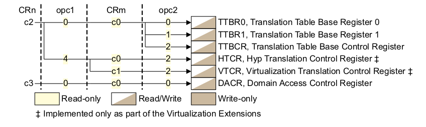

选择了 TTBCR 寄存器，对应的位图如下：
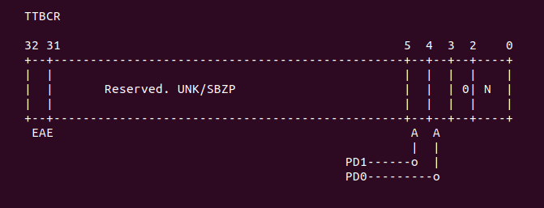

继续上面 r0 寄存器，设置了 r0 最地位，这里对应这 MMU enable 位，置位之
后一旦写入 SCTR 寄存器，那么 MMU 就可以使用了。domain 的访问设置为
client. 对于 TTBCR 寄存器，将 31 bit 清理，以此支持 32 位的地址转换，
然后对 TTBCR 寄存器，清楚低 3 位和第 4 位，以此告诉页表 只是用 TTBR0
作为页表的基地址。接下来是将值写到 CP15 对应的寄存器上，第一条指令是
“mcrne p15, 0, r3, c2, c0, 0”, 这条命令的作用是将页表的基地址存储到
TTBR0 寄存器， 从上面的代码可以知道，r3 寄存器一直存储着页表的基地址。
第二条指令是 “mcrne p15, 0, r1, c3, c0, 0”, 设置了 domain 的访问域。第
三条指令是 “mcrne p15, 0, r6, c2, c0, 2”, 告诉页表控制器， 目前使用的
页表是 32 位装换方式，并且只使用 TTBR0 寄存器作为页表的基地址。接下来
执行的代码是：
#+begin_src asm
      mcr     p15, 0, r0, c7, c5, 4   @ ISB
      mcr     p15, 0, r0, c1, c0, 0   @ load control register
      mrc     p15, 0, r0, c1, c0, 0   @ and read it back
      mov     r0, #0
      mcr     p15, 0, r0, c7, c5, 4   @ ISB
      mov     pc, r12
#+end_src

运行到最后阶段，将这前设置好的值写入到对应的寄存器中。首先执行以此 ISB
指令，将流水线，内存 访问操作全部 flush 一次。接着执行命令 “mcr p15,
0, r0, c1, c0, 0”, 将之前关于 MMU enable/I-cache/D-cache 等在 SCTR 控
制器的配置全部写入到 SCTR 寄存器中，写入之后， 系统立即生效。至此 MMU
和 I-cache 和 D-cache 都能使用。这里再次调用 ISB 指令，将流水线 上的指
令等同步到最新的配置。最后将 r12 的返回地址赋值给 pc，实现函数返回。

在启用 MMU 之后，此时物理地址和虚拟地址按 1:1 映射。回到之前执行代码的
位置继续执行如下 代码：
#+begin_src asm
  restart:
      adr     r0, LC0
      ldmia   r0, {r1, r2, r3, r6, r10, r11, r12}
      ldr     sp, [r0, #28]
#+end_src
这段代码很简单，就是 zImage 阶段创建了一个简单的表 LC0,然后将 LC0 表的
内容分别赋值给指定 的寄存器。LC0 表用于存储 zImage 链接阶段各个重要段
的偏移值，这里首先查看一下 LC0 表的内容：
#+begin_src asm
  .align  2
      .type   LC0, #object
  LC0:
      .word   LC0                     @ r1
      .word   __bss_start             @ r2
      .word   _end                    @ r3
      .word   _edata                  @ r6
      .word   input_data_end - 4      @ r10 (inflated size location)
      .word   _got_start              @ r11
      .word   _got_end                @ ip
      .word   .L_user_stack_end       @ sp
      .word   _end - restart + 16384 + 1024*1024
      .size   LC0, . - LC0
#+end_src
从上面的定义可以知道:
- LC0 + 0: LC0 在 zImage 中的偏移地址
- LC0 + 4: BSS 段起始地址在 zImage 镜像中的偏移地址
- LC0 + 8: BSS 段结束地址在 zImage 镜像中的偏移地址
- LC0 + 12: 压缩内核的长度在 zImage 镜像中的偏移地址
- LC0 + 16: zImage GOT 表起始地址在 zImage 镜像中的偏移地址
- LC0 + 20: zImage GOT 表结束的地址 zImage 镜像中的偏移地址
- LC0 + 24: zImage 堆栈的位置
- LC0 + 28: zImage 重定位的长度
- LC0 + 32: LC0 表长

#+begin_src asm
  /**
   * We might be running at a different address. We need
   * to fix up various pointers.
   */
  sub     r0, r0, r1    @ caclculate the delta offset
  add     r6, r6, r0    @ _edata
  add     r10, r10, r0  @ inflated kernel size location
#+end_src  

由于 LC0 表内的值有的是链接时相对于 zImage 镜像的偏移值，此时开发者需
要通过这些值 加载到内存之后对应的值，因此上面的代码就是用于矫正 LC0 内
的新值。从之前的代码可以知道， r0 寄存器存储的值是 LC0 表在内存中的地
址，此时由于 MMU 已经启用，因此 r0 的值代表 LC0 表的虚拟地址，r1 寄存
器存储着 LC0 相对于 zImage 镜像的偏移值。因此命令 “sub r0, r0, r1” 可
以计算 LC0 表的基础偏移，然后表内各项的偏移都可以通过这个值 进行计算。

r10 寄存器经过矫正之后对应这内核原始大小，那么原始内核大小是如何被存放
到 LC0 表里 呢？回答这个问题首先应该明确几点：解压后的内核就是之前所说
的 Image， Image 有完整的 vmlinux 经过 OBJCOPY 命令生成的二进制文件，
这个 Image 是可以直接在内存上运行的， 所以知道 Image 长度是一个至关重
要的问题。那么下面介绍一下编译系统 Kbuild 是如何 计算 Image 长度呢？

首先 Image 经过压缩之后获得压缩内核 piggy_data，其使用的压缩命令如下：
#+begin_src shell
  $(obj)/piggy_data: $(obj)/../Image FORCE
          $(call if_changed,$(compress-y))
#+end_src

这段代码位于 arch/arm/boot/compressed/Makefile, 这段代码就是 Image 压
缩生成 piggy_data 压缩内核的过程，具体使用哪种压缩方法，通过
compress-y 决定，其定义 也在同一个文件中，如下：
#+begin_src makefile
  compress-$(CONFIG_KERNEL_GZIP) = gzip
  compress-$(CONFIG_KERNEL_LZO)  = lzo
  compress-$(CONFIG_KERNEL_LZMA) = lzma
  compress-$(CONFIG_KERNEL_XZ)   = xzkern
  compress-$(CONFIG_KERNEL_LZ4)  = lz4
#+end_src

从上面的定义可知，内核支持多种压缩方式，其中以 gzip 为例，piggy_data
的压缩命令是：
#+begin_src shell
  $(obj)/piggy_data: $(obj)/../Image FORCE
          $(call if_changed,gzip)
#+end_src

Kbuild 的命令库里查看这个命令的具体过程，Kbuild 的命令库位于源码
scripts/Makefile.lib, gzip 命令如下：
#+begin_src shell
  quiet_cmd_gzip = GZIP    $@
        cmd_gzip = cat $(filter-out FORCE,$^) | gzip -n -f -9 > $@
#+end_src

所以可以看到 gizp 的执行过程，这里有个很重要的概念：压缩工具无论进行何
种压缩算法， 会在压缩文件的最后四个字节存储原始文件的大小，并按大端的
模式存储。例如使用工具分别 查看 Image 的大小以及 piggy_data 的最后四个
字节，如下：
#+begin_src shell
  $ ll arch/arm/boot/Image
      -rwxrwxr-x 1 buddy buddy 11931944 4月   1 07:06 Image*

  $ bless arch/arm/boot/compressed/piggy_data
      EB 11 97 AB C6 BC B8 40 5D 87 38 5B 35 E6 05 45 6A EC 99 66 4F 5F
      49 A3 3F 96 EB A4 1D 2B E9 1A BB 1B D7 B7 78 F5 80 26 4E 4E FF 0F
      A1 10 18 DA 28 11 B6 00
#+end_src

通过上面的数据分析可到，piggy_data 的最后四个字节是 28 11 B6 00, 按小
端调整之后的 值是 0x00B61128, 对应十进制值是 11931944, 数值正好对应
Image 的长度，因此上面的 推论是正确的。这是 piggy_data 的最后四字节存
储着 Image 的长度，根据原理可以知道 Kbuild 编译系统将 piggy.S 汇编文件
将 piggy_data 二进制文件封装成一个汇编文件，并 链接成一个 ELF 文件，并
在 piggy.S 中定义了两个全局符号： “input_data” 和 “input_data_end”, 这
两个符号标记了 piggy.o 里 piggy_data 的起始偏移地址和 终止偏移地址。并
在该目录下的 vmlinux.lds.S 脚本里定义了 .piggydata section, section 内
部也定义了一个变量 __piggy_size_addr, 这个变量正好指向了 piggy_data 最
后 4 个字节。因此在 LC0+32 处定义为 “input_data_end - 4”, 因此以上数据
都可以 知道压缩内核解压之后的长度。其他压缩方法同理。接着执行如下命令：
#+begin_src asm
  /**
   * The kernel build system appends the size of the
   * decompressed kernel at the end of the compressed data
   * in little-endian form.
   */
  ldrb    r9, [r10, #0]
  ldrb    lr, [r10, #1]
  orr     r9, r9, lr, lsl #8
  ldrb    lr, [r10, #2]
  ldrb    r10, [r10, #3]
  orr     r9, r9, lr, lsl #16
  orr     r9, r9, r10, lsl #24
#+end_src

通过上面的分析可以知道，r10 寄存里存储 piggy_data 的最后面四个字节地址，
这个地址 存储着压缩内核解压之后的长度，也就是 Image 的长度，但是其长度
在这四个字节里按大端 格式存储，因此需要上面的代码将大端数据读出转换为
小端格式。代码逻辑很简单，就是使用 ldrb 指令从 r10 对应的地址上读一个
字节，然后调整字节序，最后压缩内核解压之后的长度 存储到 r9 寄存器里。
获得了 Image 长度的正确值后，接着继续执行代码：
#+begin_src asm
  #ifndef CONFIG_ZBOOT_ROM
      /* malloc space is above the relocated stack (64k max) */
      add     sp, sp, r0
      add     r10, sp, #0x10000
  #endif
      mov     r5, #0                  @ init dtb size to 0
#+end_src

这里主要作用是分配 64K 的空间。首先矫正了堆栈的虚拟地址，并且将堆栈之
后增加了 64K 空间 用于 malloc，将 malloc + stack + zImage 的长度存储到
r10 寄存器中。然后将 r5 设置 为 0 供 DTB 使用，但是由于本实践不支持
DTB APPEND 模式，因此接下来执行代码如下：
#+begin_src asm
  /**
   * Check to see if we will overwrite ourselves.
   *   r4  = final kernel address (possibly with LSB set)
   *   r9  = size of decompressed image
   *   r10 = end of this image, including  bss/stack/malloc space if non XIP
   * We basically want:
   *   r4 - 16k page directory >= r10 -> OK
   *   r4 + image length <= address of wont_overwrite -> OK
   * Note: the possible LSB in r4 is harmless here.
   */
      add     r10, r10, #16384
      cmp     r4, r10
      bhs     wont_overwrite
      add     r10, r4, r9
      adr     r9, wont_overwrite
      cmp     r10, r9
      bls     wont_overwrite
#+end_src

这段代码的主要任务是确定当前 zImage 运行的范围会不会与内核解压之后的地
址范围重合，如果 重合，那么 zImage 要做相应的调整，这里涉及到 zImage
重定位到一个新的地址继续运行，这样 zImage 和解压内核相互影响。在执行代
码之前，r4 指向解压内核的起始地址，r9 代表解压 之后内核的长度，r10 寄
存器代表当前 zImage 的长度(该长度也包含了 bss/stack/malloc) 的长度，
因此需要做对比操作。那么在什么情况下不用重定位或重合呢，如下面几种情况：
$$r4-16K >= r10$$

对于这种情况，内存分布如下：
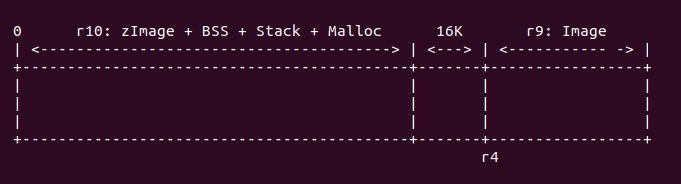

在这种情况下，zImage 运行的地址域与内核解压之后的地址域是不重合的，所
以 zImage 不需要重定位，直接在原始地址上直接运行。
$$r4 + image < wont_overwrite$$

对于这种情况，内存布局如下：
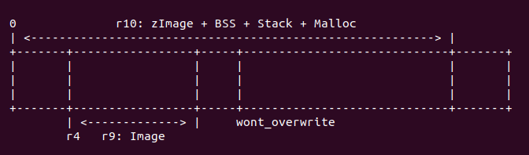

首先调用命令 “add r10, r10, #16384”, 将 r10 的长度再增加 16K，此时 r10
代表 zImage 长度加上 BSS/Stack/Malloc，再加上 16K 的长度，此时 r10 也
可以表示 zImage 运行时完整的长度。接着调用 “cmp r4, r10” 命令，查看此
时 zImage 的长度域与解压内核 长度域之间的关系是否满足 “r4 - 16K >=
r10” 条件, 如果满足，则执行 “bhs wont_overwrite”, 这样 zImage 就不需要
重定位；如果不满足，那么继续确认是否 满足第二个条件，执行命令 “add
r10, r4, r9”, 使 r10 寄存器存储解压内核的终止 物理地址，再调用命令
“adr r9, wont_overwrite” 获得 zImage 中 wont_overwrite 的地址，最后执
行命令 “cmp r10, r9”, 如果 r10 小于 r9, 那么满足第二个条件，则执行
“bls wont_overwrite”, zImage 不需要重定位；反之 zImage 需要重定位。
zImage 与解压之后的内核存在重叠时，zImage 需要重定位，它们 之间的关系
如下：
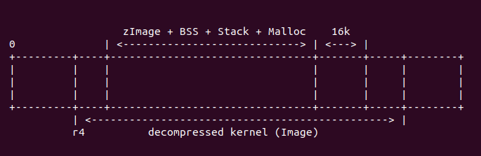
经过上面代码执行，r9 寄存器存储着 wont_overwrite 的地址, r10 寄存器存
储着解压之后 内核的终止地址。接下来运行代码：
#+begin_src asm
  /**
   * Relocate ourselves past the end of the decompressed kernel.
   *   r6  = _edata
   *   r10 = end of the decompressed kernel
   * Because we always copy ahead, we need to do it from the end and go
   * backward in case the source and destination overlap.
   */
      /**
      * Bump to the next 256-byte boundary with the size of
      * the relocation code added. This avoids overwriting
      * ourself when the offset is small.
      */
      add     r10, r10, #((reloc_code_end - restart + 256) & ~255)
      bic     r10, r10, #255

      /* Get start of code we want to copy and align it down. */
      adr     r5, restart
      bic     r5, r5, #31
#+end_src

此时 r10 寄存器存储着解压之后内核的终止地址。”((reloc_code_end -
restart + 256) & ~255)” 表示了 head.S 中 reloc_code_end 的长度，并按
256 字节对齐，运行命令之后，r10 寄存器 存储了解压之后内核的终止地址再
加上 head.s 重定位代码的长度。并将 head.S 中 restart 的地址存储在 r5
寄存器中，并按 32 字节对齐。接下来执行代码：
#+begin_src asm
      sub     r9, r6, r5   @ size to copy
      add     r9, r9, #31  @ rounded up to a multiple
      bic     r9, r9, #31  @ ... of 32 bytes
      add     r6, r9, r5
      add     r9, r9, r10
#+end_src

此处，r6 寄存器表示 zImage 不带 BSS 段的长度，即原始 zImage 的长度。这
里调用命令 “sub r9, r6, r5”，将 zImage 的长度减去需要 head.S 中需要重
定位的长度之后的值， 存储到 r9 寄存器中，并将 r9 寄存器按 32 字节对齐。
接着将 r9 寄存器的值存储到 r6 寄存器中，这样 r6 寄存器存储着 zImage 减
去 head.S 中重定位长度之后的终止地址。接着执行命令 “add r9, r9, r10”,
通过这个命令，r9 存储了 zImage 重定位之后的结束物理地址， 他们之间关系
如下图：
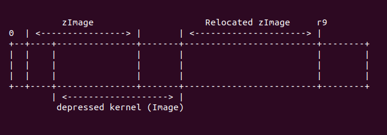

接下来执行代码：
#+begin_src asm
  1:
      ldmdb   r6!, {r0 - r3, r10 - r12, lr}
      cmp     r6, r5
      stmdb   r9!, {r0 - r3, r10 - r12, lr}
      bhi     1b

      /* Preserve offset to relocated code. */
      sub     r6, r9, r6
#+end_src

这段代码的主要任务就是搬运 zImage 到重定位的位置，搬运的内容不包括
zImage 的 BSS/ Stack/Malloc 区域。此时 r6 寄存器存储着 zImage 的减去
head.S 重定位段之后的结束地址。 r9 寄存器存储着解压之后的内核终止地址
加上 zImage 重定位的地址。此时内存布局如下：
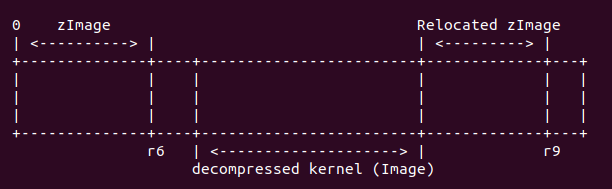

这里使用 ldmdb 从 r6 对应的 zImage 的末尾往重定位 zImage 的末尾拷贝数
据，这里 也就是搬运 zImage 到新的地址。ldmdb 一直循环知道 r6 的地址与
r5 对应的地址重合， 方才停止循环。接下来执行的代码如下：
#+begin_src asm
  #ifndef CONFIG_ZBOOT_ROM
      /* cache_clean_flush may use the satck, so relocated it */
      add     sp, sp, r6
  #endif
#+end_src

并未定义 CONFIG_ZBOOT_ROM 宏情况下，由于接下来要执行 cache_clean_flush
需要使用 堆栈，所以将堆栈指向一个合适的位置，这里将堆栈加上 r6 寄存器
的值。接下来调用 cache_clean_flush. 具体代码如下：
#+begin_src asm
  /**
   * Clean and flush the cache to maintain consistency
   *
   * On exit,
   *  r1, r2, r3, r9, r10, r11, r12 corrupted
   * This routine must preserve:
   *  r4, r6, r7, r8
   */
      .align  5
  cache_clean_flush:
      mov     r3, #16
      b       call_cache_fn
#+end_src

cache_clean_flush 的定义很简单，与 cache_on 一样的机制，都是在 CACHE
表中找到 __armv7_mmu_cache_flush 的入口，具体查找过程，查看前面关于
call_cache_fn 源码解析， 通过 call_cache_fn 之后，会定位到
__armv7_mmu_cache_flush 处，代码如下：
#+begin_src asm
  __armv7_mmu_cache_flush:
      tst     r4, #1
      bne     iflush
      mrc     p15, 0, r10, c0, c1, 5  @ read ID_MMFR1
      tst     r10, #0xf << 16         @ hierarchical cache (ARMv7)
      mov     r10, #0
      beq     hierarchical
      mcr     p15, 0, r10, c7, c14, 0 @ clean+invalidate D
      b       iflush
#+end_src

首先检查 r4 寄存器的最低位是否置位，从前面的代码可以知道，MMU 打开的情
况下，r4 最低位清零； 如果 MMU 未启用，那么 r4 最低位置位。由之前的分
析可知，此处 MMU 已经启用，所以 tst 的结果 未零，那么 “bne iflush” 命
令将不被执行。接下来执行的代码是： “mrc p15, 0, r10, c0, c1, 5”, 此时
CP15 C0 寄存器的布局如下：
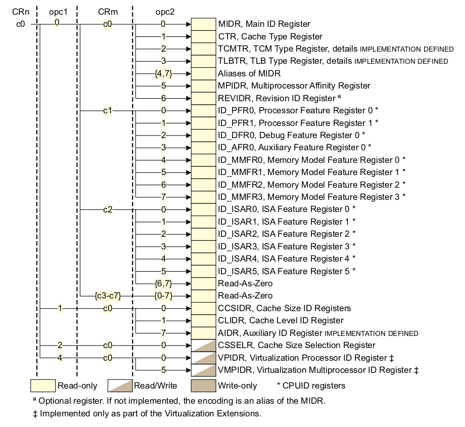

通过上面的代码选中了 ID_MMFR1 寄存器，该寄存器用于指定当前 CACHE 的类
型，其位图如下：
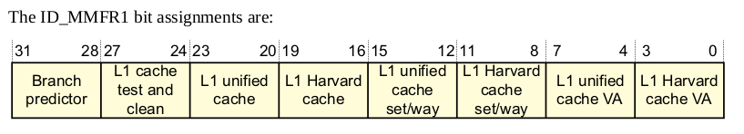

接着调用 tst 命令查看 ID_MMFR1 寄存器的 [19:16] 域，该域表示：
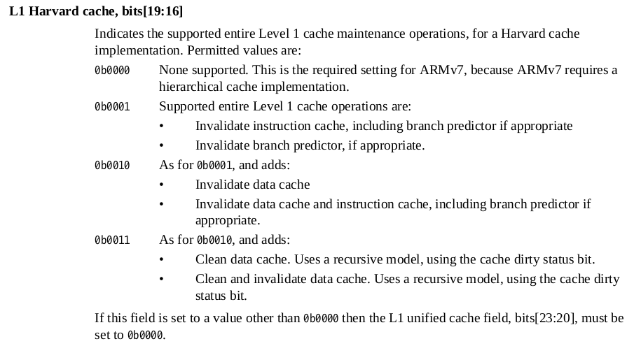

有上面的定义可知，该域用于指示 L1 cache 的维护操作。但在 armv7 中，这
是不需要的，因此 tst 的结果等于 0，那么代码接下来跳转到 hierarchical
处继续执行。跳转到 hierarchical 处继续执行，由于 armv7 的 L1 cache 按
分层管理，要给 cache 进行 flush 操作，首先要了解一下 cache 的基础知识，
这里只介绍必要的知识，更多 cache 知识请查看：
[[https://biscuitos.github.io/blog/ARM-BOOT/#][ARMv7-L1 cache manual]]

L1 cache:在 ARMv7 中，cache 分为了指令 cache (I-Cache) 和数据 cache
(D-cache), cache 是 用来加速内存访问，其逻辑结构如下图：
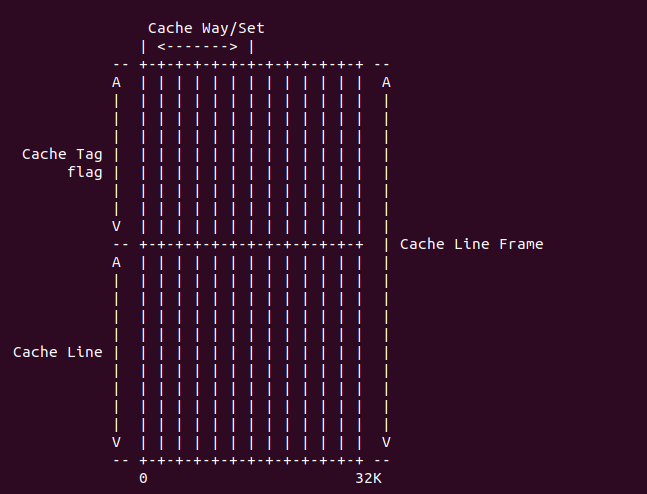

cache 的最小数据单位是 cache line, cache line 的长度成为 cache size；
为了标记每个 cache line，使用的标记叫 cache tag, cache tag、cache line
与一些标志信息组成一个 cache line frame; 多个 cache line frame 组成一
个 cache set；cache 被分成多个 cache set，每个 cache set 含有的 cache
line 数成为 cache way.在 armv7 中要 flush D-cache 按如下逻辑：
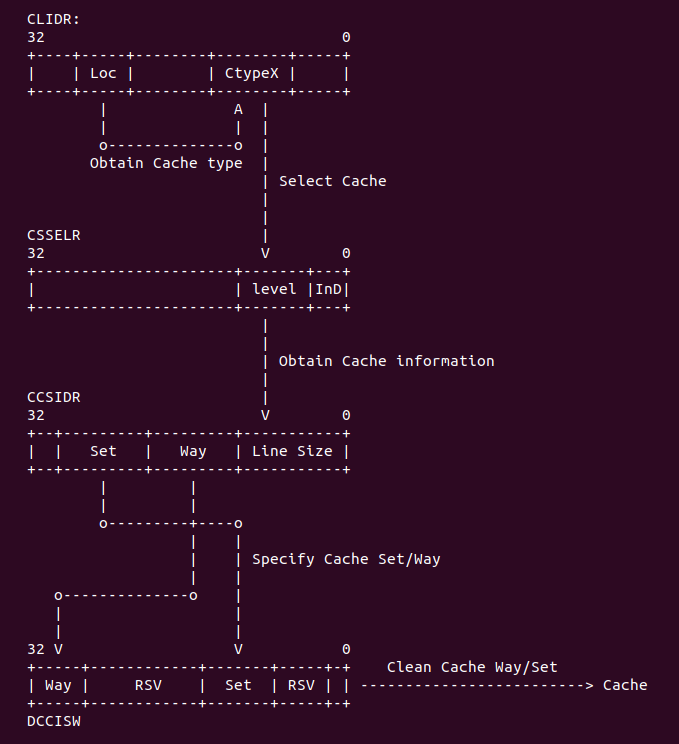

在 armv7 中，首先从 CLIDR 寄存器中读取 LoC 域对应的 Ctype，从中找到
D-cache, 然后 在 CSSELR 寄存器写入 D-cache 的 level 信息之后，CCSIDR
寄存器就指向了所要查找 cache 的信息，这些信息存储在 CCSIDR 寄存器中，
从这个寄存器中可以获得当前 CACHE 的 cache line 数值，cache Set/Way 的
值，通过这些值可以计算出需要 flush 的长度，最后将要清楚的值写入 到
DCCISW 寄存器中，这样该 level 的 cache 就被 flush 完了，接着遍历 flush
下一级 cache。 因此 CACHE 的 flush 逻辑就是这样。接下来通过代码分析具
体过程：
#+begin_src asm
  hierarchical:
      mcr     p15, 0, r10, c7, c10, 5 @ DMB
      stmfd   sp!, {r0-r7, r9-r11}
      mrc     p15, 1, r0, c0, c0, 1   @ read clidr
      ands    r3, r0, #0x7000000      @ extract loc from clidr
      mov     r3, r3, lsr #23         @ left align loc bit field
      beq     finished                @ if loc is 0, then no need to c
      mov     r10, #0                 @ start clean at cache level 0
#+end_src

首先做一次 DMB 内存屏蔽操作，将之前的内存访问都同步。然后使用 stmfd 指
令保存指定的寄存器， 接着调用 mrc 寄存器读取 CP15 C0 寄存器，选择如下：

通过上面选中了 CLIDR 寄存器，该寄存器的布局如下图：
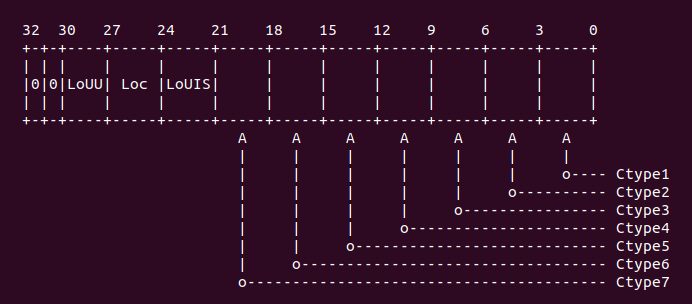
然后执行代码 “ands r3, r0, #0x7000000”, 以此读取 CLIDR [26:24] 域，这
个域用于 LoC (Level of Coherence for the cache hierarchy). 这个域用于
指定一致性数据 cache 所在的 cache Level，然后通过 “mov r3, r3, lsr
#23” 获得 cache level 的具体 数值。如果该值为 0，那么代表没有对应的
cache，直接跳转到 finished 处；如果该值为 0， 那么代码存在对应需要
flush 的 cache，那么继续执行下面的代码不跳转。
#+begin_src asm
  loop1:
      add     r2, r10, r10, lsr #1    @ work out 3x current cache leve
      mov     r1, r0, lsr r2          @ extract cache type bits from c
      and     r1, r1, #7              @ mask of the bits for current c
      cmp     r1, #2                  @ see what cache we have at this
      blt     skip                    @ skip if no cache, or just i-ca
      mcr     p15, 2, r10, c0, c0, 0  @ select current cache level in
      mcr     p15, 0, r10, c7, c5, 4  @ isb to sych the new cssr&csidr
      mcr     p15, 1, r1, c0, c0, 0   @ read the new csidr
#+end_src

由于在 armv7 中 LoC cache 采用分级模式，所以在 flush cache 的时候，需
要从 ctype0 开始 flush，每个 cache ctype 之间相差 3，所以这里使用 “add
r2, r10, r10, lsr #1” 达到遍历下一个 cache 的作用。接着就是对 ctypes
对应的值进行对比，这个值从手册中可以 知道：1) 当该值为 0， 代表没有
cache. 2) 该值为 1 代表指令 cache。 3) 该值为 2 代表数据 cache。4) 该
值为 3 代表指令和数据分离的 cache。 5) 该值为 4 代表 Unified cache。
6) 其他值为 Reserved。如果此时 “cmp r1, #2” 的值小于 2，那么就代表这个
cache 是一个指令 cache 或者没有 cache。如果 r1 寄存器的值小于 2 那么直
接跳转到 skip 处继续执行，如果大于等于 2，那么继续往下执行。接着如果是
数据 cache，那么调用命令 “mcr p15, 2, r10, c0, c0, 0”, 此时CP15 C0 的
布局如下：
[[./pic/armv7-cp1515.png]]

选中的寄存器是 CSSELR 寄存器，其内存布局如下：
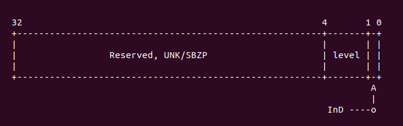

这里用于选择 Cache 的级数，在 armv7 中，只要在 CSSELR 寄存器的 Level
域中选中了 cache Level，那么 CSIDR 寄存器就反应被选中 cache 相关信息。
为了是 CSSELR 写入有效， 这里调用了内存屏蔽指令 ISB，执行完 ISB 之后，
CSIDR 寄存器的值就是反应 CSSELR 选中 的结果，CSSELR 的内存布局如下：
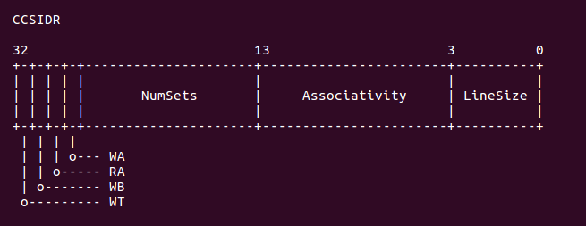

正如上图所示，CSIDR 寄存器包含了当前 cache 的 Set 域，Way 域，以及
line size 域。开发者可以在上面代码中加入适当的断点，然后使用 GDB 进行
调试，调试情况如下：
#+begin_src shell
  (gdb) b BS_debug
      Breakpoint 1 at 0x600102a4: file arch/arm/boot/compressed/head.S, line 341.
  (gdb) c
      Continuing.
      Breakpoint 1, BS_debug () at arch/arm/boot/compressed/head.S:341
      341   add    r2, r10, r10, lsr #1    @ work out 3x current cache level
  (gdb) n
      342   mov    r1, r0, lsr r2  @ extract cache type bits from clidr
  (gdb) info reg r10
      r10   0x0    0
  (gdb) info reg r2
      r2    0x0    0
  (gdb) n
      343   and    r1, r1, #7  @ mask of the bits for current cache only
  (gdb) info reg r1
      r1    0x9000003  150994947
  (gdb) n
      344   cmp    r1, #2      @ see what cache we have at this level
  (gdb) info reg r1
      r1    0x3     3
  (gdb) n
      345   blt    skip  @ skip if no cache, or just i-cache
  (gdb) n
      346   mcr    p15, 2, r10, c0, c0, 0    @ select current cache level in cssr
  (gdb) n
      347   mcr    p15, 0, r10, c7, c5, 4    @ isb to sych the new cssr&csidr
  (gdb) info reg r10
      r10   0x0    0
  (gdb) n
      348   mrc    p15, 1, r1, c0, c0, 0    @ read the new csidr
  (gdb) n
      349   and    r2, r1, #7        @ extract the length of the cache lines
  (gdb) info reg r1
      r1    0xe00fe019          -535830503
#+end_src

从上面的实践可以看出，LoC 所使用的 cache 是一个数据 cache，对应的
Ctype1，并且 Ctype0 的 cache 为 0x3, 将该值写入到 CSIDR 寄存器，就获得
Ctype1 对应的 cache 长度信息。从 r1 读入的值为 0xe00fe019, 从这个数值
中可以知道 Cache 的 set 数为 (0x3F + 1), 也就是该 cache 包含了 128 个
set。每个 set 包含的 cache line 数 (0x3 + 1), 那么该 cache 是 4 way。
cache line size 是 8 字节。接下来执行的 代码是：
#+begin_src asm
      and     r2, r1, #7              @ extract the length of the cache lines
      add     r2, r2, #4              @ add 4 (line length offset)
      ldr     r4, =0x3ff
      ands    r4, r4, r1, lsr #3      @ find maximum number on the way size
      clz     r5, r4                  @ find bit position of way size increment
      ldr     r7, =0x7fff
      ands    r7, r7, r1, lsr #13     @ extract max number of the index size
#+end_src

从之前的分析可以知道，r1 寄存器里面存储着当前 cache 长度相关的信息，首
先使用 “and r2, r1, #7” 获得 cache line 的长度。然后调用 “add r2, r2,
#4”,这条命令的 作用是为了后面 cache flush 特定寄存器写信息的特殊格式要
求，可以参看后面 flush 操作。 接着将常量 0x3ff 赋值给 r4， 然后执行命
令 “ands r4, r4, r1, lsr #3”，通过这条 命令读出 cache way 的信息，接着
调用 “clz r5, r4” 也是为了拼凑一个格式化数据。同理， 将常量 0x7fff 赋
值给 r7，然后获得 cache 的 set 信息。接下来执行的代码如下：
#+begin_src asm
  loop2:
      mov     r9, r4    @ create working copy of max way size
  loop3:
   ARM(orr  r11, r10, r9, lsl r5) @ factor way and cache number into r11
   ARM(orr  r11, r11, r7, lsl r2) @ factor index number into r11
      mcr  p15, 0, r11, c7, c14, 2 @ clean & invalidate by set/way
      subs r9, r9, #1   @ decrement the way
      bge  loop3
      subs r7, r7, #1   @ decrement the index
      bge  loop2
  skip:
      add  r10, r10, #2 @ increment cache number
      cmp  r3, r10
      bgt  loop1
#+end_src

这段代码就是按 set/way 方式 flush cache，这讲解代码之前，先了解 cache
flush 的 方法，armv7 中采用 set/way 方式管理 cache。通过之前 cache 基
本原理可以知道，每个 cache set 包含了 way 个 cache line，而 cache 被均
分成多个 cache set。因此可以将 cache set 理解为行，cache way 理解为列，
所以刷新的时候按行-列的模式刷，因此这里 的代码就是用于实现将所有 set
和 way 都 flush。另外，armv7 中，往特定寄存器写入 set/way 信息就可以刷
新指定的 set/way cache, 这个寄存器就是 DCCISW 寄存器，这个 寄存器的位
图如下：
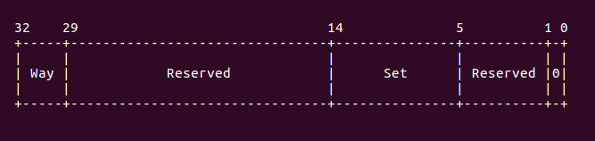

从上图可以知道，要刷新特定的 cache line，那么需要往 DCCISW 寄存器内写
入 Way 和 Set 的信息。因此在分析之前的代码，为什么 line size 的值要加
上 4，以及 way 的值要这么 处理也就知道了，就是为了制作出一个符合
DCCISW 格式的数据。因此上面的代码分析如下： 首先调用 “mov r9, r4”，为
了进行 set 的遍历，接着 “orr r11, r10, r9, lsl r5” 和 “orr r11, r11,
r7, lsl r2” 命令也是为了构建 DCCISW 格式化数据，准备好数据之后， 就将
数据写入到 DCCISW 寄存器里面，使用的命令是 “mcr p15, 0, r11, c7, c14,
2”. 接下来的代码就是遍历所有的 set 以及 set 里面的所有 way，通过上面的
操作，当前 cache 的所有 set/way 就被 flush 完毕。最后到达 skip 处，如
果当前 cache flush 完毕， 那么跳转到 loop1 采用同样的方式遍历下一个
cache。接下来执行的代码是：
#+begin_src asm
  finished:
      ldmfd   sp!, {r0-r7, r9-r11}
      mov     r10, #0                 @ switch back to cache level 0
      mcr     p15, 2, r10, c0, c0, 0  @ select current cache level in cssr
  iflush:
      mcr     p15, 0, r10, c7, c10, 4 @ DSB
      mcr     p15, 0, r10, c7, c5, 0  @ invalidate I+BTB
      mcr     p15, 0, r10, c7, c10, 4 @ DSB
      mcr     p15, 0, r10, c7, c5, 4  @ ISB
      mov     pc, lr
#+end_src

cache flush 完毕之后，就做最后的收尾工作，将期间使用过的寄存器都恢复原
值，然后 将当前 cache 设置为 0。然后刷新 I-cache。首先调用 DSB 内存屏
障，将之访问全部落盘， 然后调用 “mcr p15, 0, r10, c7, c5, 0”, 此时
CP15 C7 的布局如下：
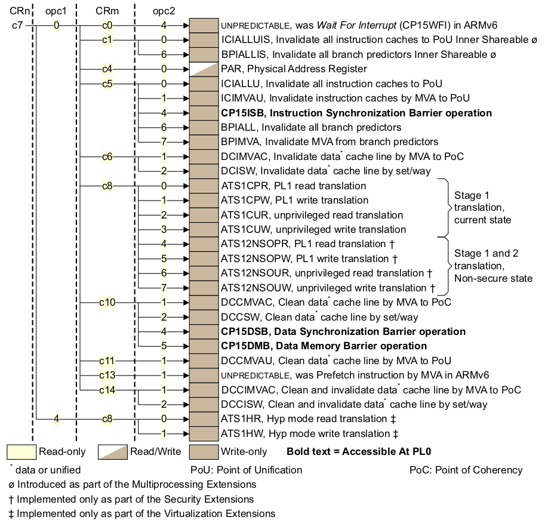

通过上面的命令选中了寄存器：ICIALLU, 向该寄存器写入任意值就会让
I-cache 无效。 接着调用两条内存屏障指令 DSB 和 ISB，让所有改变都生效。
最后将 lr 赋值给 pc，实现 调用返回。支持 armv7 的 flush 操作已经全部完
成。代码继续执行如下：
#+begin_src asm
      badr    r0, restart
      add     r0, r0, r6
      mov     pc, r0
#+end_src

首先获得 restart 的地址，存储到 r0 寄存器内，然后将 r0 寄存器的值加上
r6 偏移值， 以此计算出 restart 重定位之后的地址，最后将该值赋值给 pc，
然后 CPU 就跳转到 restart 重定位处继续执行。

* 文件系统
在移植Linux内核早期时，如果flash等存储设备的驱动还没写好，可以将文件系
统放到内存中运行。此时可以使用ramfs和ramdisk，即将内存的一部分用作文件
系统。

而busybox所起的作用为,制作kernel启动后需要的一些辅助工具,在制作时,具体
是用交叉编译工具编译好busybox,然后将这些工具make install到被制作文件系
统的文件夹中,然后再用genext2fs/mke2fs将这些文件夹打包成文件系统文件,通
过jtag/tftp/emmc等方式load到ddr中,被kernel引导起来,引导成功后输出如下.
#+begin_example
  ## Loading init Ramdisk from Legacy Image at 42000000 ...
     Image Name:   
     Image Type:   ARM Linux RAMDisk Image (gzip compressed)
     Data Size:    2168875 Bytes = 2.1 MiB
     Load Address: 00000000
     Entry Point:  00000000
     Verifying Checksum ... OK
#+end_example
** ramfs
ramfs就是将文件系统和内核一起编译，编译出来的镜像就包括内核本身和文件
系统。内核打开ramfs的配置如图[[img-kernel-ramfs-set]]所示.
#+caption: Kernel中RAMFS配置
#+name: img-kernel-ramfs-set
#+attr_latex: :placement [H] :width 0.6\textwidth
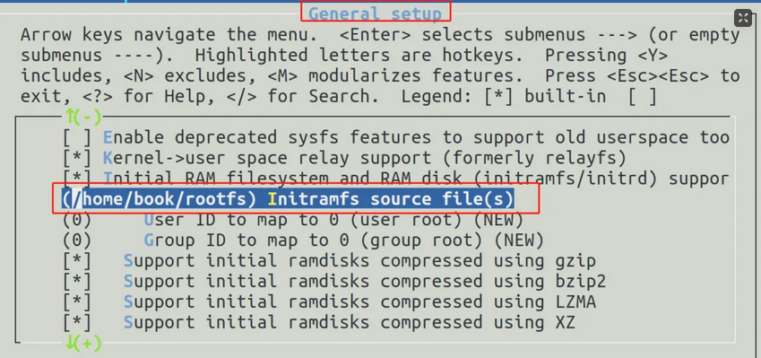

在Initramfs source file(s)选项中，填入文件系统的路径即可。最后，uboot
的bootargs中需要将init=/sbin/init修改为rdinit=/sbin/init，主要就是init
和rdinit的区别。
** ramdisk
ramdisk也是将内存的一部分用作文件系统，只不过不用像上面一样要重新编译
内核。ramdisk制作可以使用genext2fs工具或者mke2fs等工具制作。以下制作过
程,建议都在root权限下进行.
*** genext2fs
genext2fs是主机中的一个工具,用于将某个目录或文件制作成ext2类型的文件系
统镜像.Ubuntu中可以使用apt安装.具体的ram文件系统制作参考以下脚本.
#+begin_src shell
  sudo genext2fs -b 16384 -d /home/book/rootfs ramdisk.image
  sudo gzip –v9 ramdisk.image		# 输出ramdisk.image.gz
  sudo mkimage -A arm -O linux -T ramdisk -C gzip -n 'xx ramdisk filesystem'\
          -d ramdisk.image.gz uramdisk.image.gz
#+end_src
- 先使用genext2fs把/home/book/rootfs制作成一个名为ramdisk.image的
  ramdisk.
- 然后使用gizp压缩ramdisk.image，得到ramdisk.image.gz.
- 最后用mkimage工具生成uramdisk.image.gz给uboot使用.
*** mke2fs
mke2fs实际上和genext2fs类似,制作脚本如下.注意"0x15000000"是设置文件系
统的"load address", 在u-boot对kernel的bootargs配置中需要用到,如果这个
地址不设置,则bootargs中也不能设置,由kernel自己检测得到这个地址.
#+begin_src shell
  # count就是文件系统的大小,bootargs中也有参数做对应
  sudo dd if=/dev/zero of=ramdisk bs=1024 count=8192
  sudo mke2fs -F -v -m0 ramdisk
  sudo mkdir /mnt/loop
  sudo mount -t ext2 ramdisk /mnt/loop
  sudo cp -arf ./ramdiskfs/* /mnt/loop
  sudo umount /mnt/loop
  sudo rm -rf /mnt/loop
  gzip -v9 ramdisk		# 输出ramdisk.gz
  mkimage -A arm -O linux -T ramdisk -C gzip -a 0x15000000\
          -n "ramdisk" -d ramdisk.gz uramdisk.image.gz
#+end_src
** 引导配置
kernel和u-boot中也要做相应的引导配置.
*** u-boot配置
bootargs也可以在kernel的dts配置中指定.
#+begin_src shell
  setenv initrd_high=0xffffffff
  setenv bootargs console=ttyS0,115200 root=/dev/ram0 rw init=/sbin/init; \
      bootm ${loadaddr} ${ramdiskaddr} ${fdtaddr}
#+end_src
- initrd_high为0xffffffff，表示将initrd加载到最高的可用内存地址上。这
  样可以确保在启动过程中有足够的内存空间来加载initrd文件.
- bootargs中，主要是这句：root=/dev/ram rw init=/sbin/init要对.
- bootm(或booti)启动中，loadaddr是内核的加载地址，ramdiskaddr是ramdisk
  的加载地址，fdtaddr是设备树的加载地址.

  
制作好的uramdisk.image.gz文件系统，可以在uboot中，先通过tftp命令将
uramdisk.image.gz加载到某段内存，例如tftp 82000000 uramdisk.image.gz。
最后通过bootxxx(取决于kernel的类型)启动。
*** kernel配置
打开ramfs支持,如图[[img-kernelramfs-set0]]所示.
#+caption: Kernel配置ramfs
#+name: img-kernelramfs-set0
#+attr_latex: :placement [H] :width 0.6\textwidth
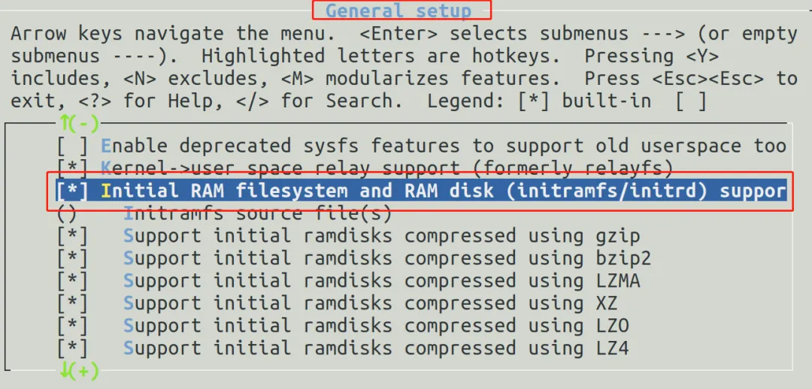

打开ext2文件系统支持,如图[[img-kernelext2-set]]所示.
#+caption: Kernel配置ext2
#+name: img-kernelext2-set
#+attr_latex: :placement [H] :width 0.6\textwidth
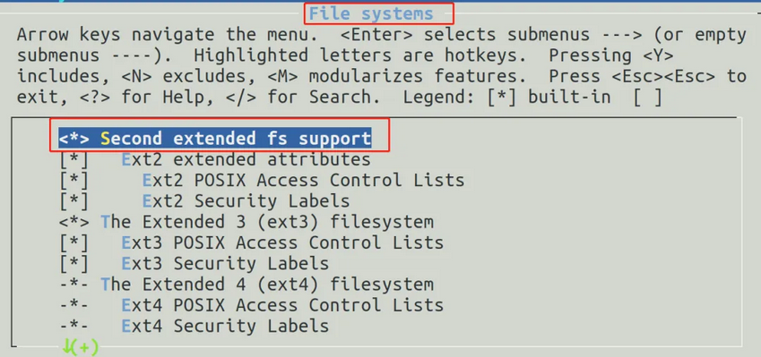

打开ram block支持，并设置大小,如图[[img-kernelext2-size]]所示.
#+caption: Kernel RAMDISK大小配置
#+name: img-kernelext2-size
#+attr_latex: :placement [H] :width 0.6\textwidth
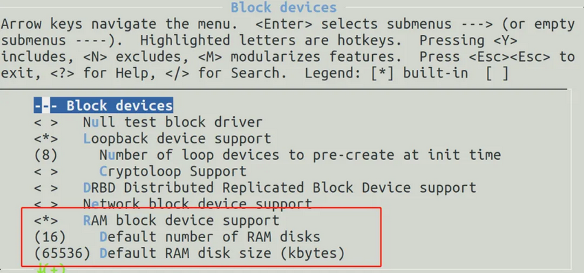
* 驱动
** 框架基础
*** 模块声明
模块声明与描述如下
- MODULE_AUTHOR: 模块作者；
- MODULE_DESCRIPTION: 模块描述；
- MODULE_VERSION： 模块版本；
- MODULE_DEVICE_TABLE：模块设备表，USB、PCI设备驱动常用；
- MODULE_ALIAS：模块别名；
- MODULE_LICENSE： 模块license版权；
- EXPORT_SYMBOL：导出模块符号给其他模块使用；
- EXPORT_SYMBOL_GPL：导出模块符号给其他GPL模块使用；
*** 模块修饰
- module_init： 模块初始化修饰，修饰模块初始化函数；
- module_exit：模块退出修饰；
- module_param：为模块定义参数；
- module_param_array： 为模块定义参数数组；
- 函数修饰
  + __init：修饰的函数会在.initcall.init区段中保存一份函数指针，对应
    module_init模块修饰；
  + __exit: 修饰卸载函数对应module_exit模块修饰；
  + __initdata: 数据也可以被定义为__initdata，对于只是初始化阶段需要的数
    据，内核在初始化完后，也可以释放它们占用的内存；
  + __exitdata: 只是退出阶段采用的数据也可以用__exitdata修饰；

- 宏修饰
  + MOD_INC_USE_COUNT：模块使用计数，增加，Linux2.4中使用；
  + MOD_DEC_USE_COUNT：模块使用计数，减少，Linux2.4中使用；
*** 模块函数
- try_module_get：Linux2.6后，替代MOD_INC_USE_COUNT；
- module_put：Linux2.6后，替代MOD_DEC_USE_COUNT；
*** 模块命令
- insmod： 加载模块，调用module_init修饰的函数；
- rmmod：卸载模块，调用module_exit修饰的函数；
- lsmod：读取模块信息，读取分析/proc/modules；
- modprobe：比insmod强大，加载模块时，会同时加载该模块所依赖的其他模块。
- modprobe -r：卸载模块时，会同时卸载该模块所依赖的其他模块。
- modinfo：获取模块的信息：作者、说明、参数、vermagic等；
*** 模块文件
- /proc/modules: 包含各个模块信息；
- /sys/module/xxx: 模块目录；
- /sys/module/xxx/parameters: 模块参数目录，module_param定义的参数；
- /lib/modules/<kernel-version>/modules.dep: 模块间的依赖关系文件，由
  depmod工具生成；
- /var/log/message: 日志文件可以看到kernel对模块信息的输出；
- /proc/kallsyms: 内核符号表，它记录了符号以及符号所在的内存地址,由
  EXPORT_SYMBOL导出；
- /proc/devices: 文件可以获知系统中注册的设备，第1列为主设备号，第2列
  为设备名；
- /dev/xxx: 查看/dev目录可以获知系统中包含的设备文件，日期的前两列给出
  了对应设备的主设备号和次设备号;
*** vfs
所有的kernel空间操作，都用vfs抽象给用户程序，提供一套open，read，write，
seek等接口。
*** devfs
devfs，设备文件系统，工作在内核空间，Linux2.4内核引入的驱动框架。
- register_chrdev: 注册字符设备，传入主设备号0，系统自动分配主设备号；
- devfs_register: 可以指定次设备号；
- devfs_mk_dir： 创建设备目录；
- devfs_unregister： 撤销设备文件；
*** udev
udev，用户空间设备管理系统，工作在用户空间，Linux2.6内核中引入的驱动框
架；在嵌入式系统中，有一个轻量级版本实现叫mdev；在Android中，也有一个
类似的叫vold，机制一样。
*** sysfs
Linux2.6内核以后引入的sysfs文件系统，sysfs被看成是与proc、devfs和
devpty同类别的文件系统，该文件系统是一个虚拟的文件系统，它可以产生一个
包括所有系统硬件的层级视图，与提供进程和状态信息的proc文件系统十分类似。

sysfs把连接在系统上的设备和总线组织成为一个分级的文件，它们可以由用户
空间存取，向用户空间导出内核数据结构以及它们的属性。sysfs的一个目的就
是展示设备驱动模型中各组件的层次关系，其顶级目录包括block、bus、class、
dev、devices、fs、kernel、power和firmware等，总线、驱动和设备最终都会
落实为sysfs中的1个目录。
** 驱动并发
** 驱动架构
在Linux 2.6以后的设备驱动模型中，需要关心到总线、设备和驱动，驱动只管
驱动，设备只管设备，总线则负责匹配设备和驱动，而驱动则以标准途径拿到板
级信息，进而将各个组件串接起来。在系统每注册一个设备的时候，会寻找与之
匹配的驱动；相反的，在系统每注册一个驱动的时候，会寻找与之匹配的设备，
而匹配由总线完成。

一个现实的Linux设备和驱动通常都需要挂接在一种总线上，对于本身依附于PCI、
USB、I2C等的设备而言，不是问题，但是在嵌入式系统里面，在SoC系统中集成
的独立外设控制器、挂接在SoC内存空间的外设等却不依附于此类总线。由此，
Linux发明了一种虚拟的总线，称为platform总线，相应的设备称为
platform_device，而驱动成为platform_driver。匹配platform_device和
platform_driver有4种可能性
- 基于设备树风格的匹配；
- 基于ACPI风格的匹配；
- 匹配ID表:即platform_device设备名是否出现在platform_driver的ID表内；
- 匹配platform_device设备名和驱动的名字。

platform_device并不是与字符设备、块设备和网络设备并列的概念，而是Linux
系统提供的一种附加手段，通常把在SoC内部集成的I2C、LCD等控制器都归纳为
platform_device，而它们本身就是字符设备。

platform_driver这个结构体中包含probe、remove、一个device_driver实例、
电源管理函数suspend、resume，与platform_driver地位对等的i2c_driver、
spi_driver、usb_driver、pci_driver中都包含了device_driver结构体实例成
员。它其实描述了各种xxx_driver（xxx是总线名）在驱动意义上的一些共性。

** 内存管理
每个进程的用户空间都是完全独立、互不相干，用户进程各自有不同的页表。而
内核空间是由内核负责映射，它并不会跟着进程改变，是固定的。内核空间的虚
拟地址到物理地址映射是被所有进程共享的，内核的虚拟空间独立于其他程序

x86 Linux中1GB的内核地址空间又被划分为几个区域.
- 系统保留映射区：Linux保留内核空间最顶部FIXADDR_TOP~4GB区域作为保留区；
- 专用页面映射区：紧接着最顶端的保留区以下的一段区域为专用页面映射区
  (FIXADDR_START~FIXADDR_TOP)，它的总尺寸和每一页的用途由
  fixed_address枚举结构在编译时预定义，用__fix_to_virt(index)可获取
  专用区内预定义页面的逻辑地址；
- 高端页面映射区：如果系统配置了高端内存，则位于专用页面映射区之下的就
  是一段高端内存映射区，其起始地址为PKMAP_BAS。
- 虚拟内存分配区：在物理区和高端映射区之间为虚拟内存分配器区
  (VMALLOC_START~VMALLOC_END)，用于vmalloc()函数，它的前部与物理内
  存映射区有一个隔离带，后部与高端映射区也有一个隔离带。
- 物理内存映射区：直接映射物理内存(x86为896MB)
  + 常规区域：6MB~896MB之间的为常规区域；
  + DMA区域: 在低于16MB的区域，ISA设备可以做DMA，所以该区域为DMA区域；

arm Linux中1GB的内核地址空间又被划分为几个区域.
- 向量表区：固定为0xffff0000~0xffff0fff；
- vmalloc区：VMALLOC_START~VMALLOC_END-1区域；
- DMA映射区：0xffc00000~0xffefffff区域；
- 常规映射区域：PAGE_OFFSET~high_memory-1区域；
- 高端内存映射区：PKMAP_BASE~PAGE_OFFSET区域；
- 内核模块区：MODULES_VADDR~MODULES_END区域，在PAGE_OFFSET附近16MB区域；
*** slab缓存
slab缓存适用于小数据的内存申请，slab是建立在buddy算法之上的，它从buddy
算法拿到2n页面后再次进行二次管理，这一点和用户空间的C库很像。slab申请
的内存以及基于slab的kmalloc()申请的内存，与物理内存之间也是一个简单的
线性偏移。
- 创建slab缓存：kmem_cache_create；
- 分配slab缓存：kmem_cache_alloc；
- 释放slab缓存：kmem_cache_free；
- 收回slab缓存：kmem_cache_destroy；
*** 内存池
内存池技术也是一种非常经典的用于分配大量小对象的后备缓存技术。
- 创建内存池：mempool_create
- 分配对象：mempool_alloc
- 回收对象：mempool_free
- 回收内存池：mempool_destroy
*** 操作函数
- virt_to_phys: 内核虚拟地址转化物理地址，适用于DMA/常规映射区域；
- phys_to_virt: 物理地址转换内核虚拟地址，适用于DMA/常规映射区域；
- kmalloc: 申请的内存位于DMA和常规区域的映射区，而且在物理上也是连续的，
  它们与真实的物理地址只有一个固定的偏移，和kfree对应.
  + GFP_KERNEL： 在内核空间的进程中申请内存，底层依赖__get_free_pages;
  + GFP_ATOMIC: 在中断处理函数、tasklet和内核定时器等非进程上下文中不
    能阻塞的地方申请内存，若不存在空闲页，则不等待，直接返回;
  + GFP_USER：为用户空间页分配内存，可能阻塞；
  + GFP_HIGHUSER
  + GFP_USER: 从高端内存分配；
  + GFP_DMA：从dma区域分配内存；
  + GFP_NOIO：不允许任何I/O初始化；
  + GFP_NOFS：不允许进行任何文件系统调用；
  + __GFP_COLD: 请求一个较长时间不访问的页；
  + __GFP_NOWARN：当一个分配无法满足时，阻止内核发出警告；
  + __GFP_HIGH：高优先级请求，允许获得被内核保留给紧急状况使用的最后的
    内存页；
  + __GFP_REPEAT：分配失败，则尽力重复尝试；
  + __GFP_NOFAIL：标志只许申请成功，不推荐；
  + __GFP_NORETRY：若申请不到，则立即放弃；
- vmalloc: 在虚拟内存空间给出一块连续的内存区，这片连续的虚拟内存在物
  理内存中并不一定连续，和vfree对应。

** 设备IO
设备寄存器可能位于I/O空间中，也可能位于内存空间中。当位于I/O空间时，通
常被称为I/O端口；当位于内存空间时，对应的内存空间被称为I/O内存。
*** 地址
地址涉及到3种地址概念,系统中，物理地址0在设备端看起来是0x80000000，而
0通常又被映射为虚拟地址0xC0000000，所以同一地址就具备了三重身份：物理
地址0、总线地址0x80000000及虚拟地址0xC0000000。
- 虚拟地址：从CPU核角度看到的是虚拟地址；
- 物理地址：从MMU控制器外围角度上看到的内存地址；
- 总线地址：从设备角度上看到的内存地址，基于DMA的硬件使用的是总线地址
  而不是物理地址；
  + virt_to_bus：虚拟地址到总线地址的转换；

*** 内核空间IO端口
#+caption: IO端口用法
#+name: img-ioportdriver
#+attr_latex: :placement [H] :width 0.6\textwidth
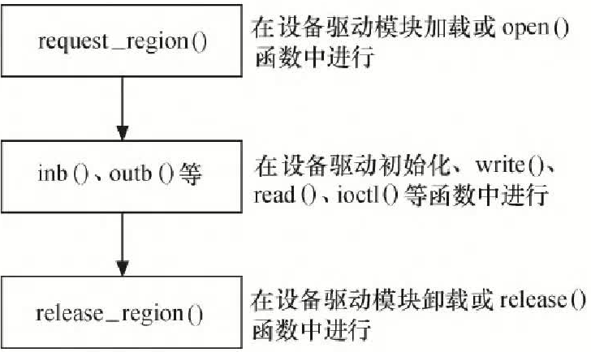

- IO端口申请：request_region；
- IO端口释放：release_region；
- 8位宽读写字节端口
  + inb
  + outb
- 16位宽读写字端口
  + inw
  + outw
- 32位宽读写长字端口
  + inl
  + outl
- 读写一串字节
  + insb：从端口port开始读count个字节，并将读取结果写入addr指向的内存；
  + outsb：将addr指向的内存中的count个字节连续写入以port开始的端口；
- 读写一串字
  + insw
  + outsw
- 读写一串长字
  + insl
  + outsl
*** 内核空间IO内存
在内核中访问I/O内存前（如SPI、USB等控制器的寄存器），需首先使用
ioremap()函数将设备所处的物理地址映射到虚拟地址上,和iounmap对应，
ioremap()有个变体函数是devm_ioremap.

在设备的物理地址（一般都是寄存器）被映射到虚拟地址之后，可以直接通过指
针访问这些地址，但Linux内核推荐用一组标准的API来完成设备内存映射的虚拟
地址的读写
#+caption: IO内存用法
#+name: img-iomemdriver
#+attr_latex: :placement [H] :width 0.6\textwidth
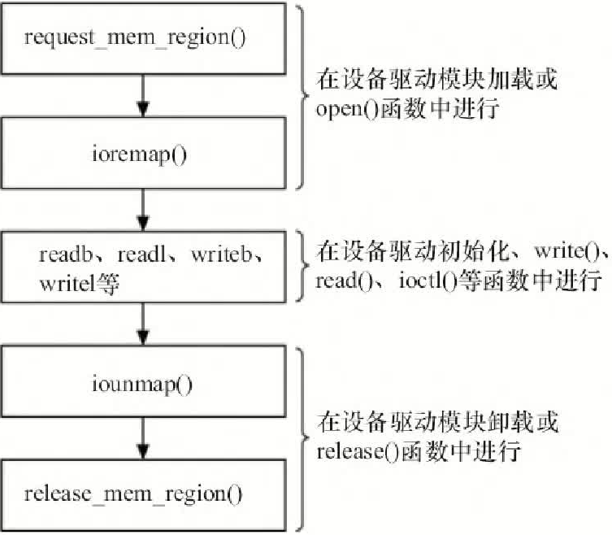
- 申请IO内存：request_mem_region
- 释放IO内存：release_mem_region
- 读寄存器
  + readb_relaxed：读8bit，包含内存屏障；
  + readw_relaxed：读16bit，包含内存屏障；
  + readl_relaxed：读32bit，包含内存屏障；
  + readb：读8bit；
  + readw：读16bit；
  + readl：读32bit；
- 写寄存器
  + writeb_relaxed:写8bit，包含内存屏障； 
  + writew_relaxed:写16bit，包含内存屏障；
  + writel_relaxed:写32bit，包含内存屏障；
  + writeb:写8bit； 
  + writew:写16bit；
  + writel:写32bit；
*** 用户空间IO
大多数设备驱动都不需要提供设备内存到用户空间的映射能力，因为，对于串口
等面向流的设备而言，实现这种映射毫无意义。而对于显示、视频等设备，建立
映射可减少用户空间和内核空间之间的内存复制。常用映射方法如下。
- mmap：实现了这样的一个映射过程：它将用户空间的一段内存与设备内存关联，
  当用户访问用户空间的这段地址范围时，实际上会转化为对设备的访问,和
  munmap对应.
- fault： 在驱动程序中实现VMA的fault函数通常可以为设备提供更加灵活的内
  存映射途径。当访问的页不在内存里，即发生缺页异常时，fault会被内核自
  动调用，而fault的具体行为可以自定义。这是因为当发生缺页异常时，系统
  会经过如下处理过程。
  + 找到缺页的虚拟地址所在的VMA；
  + 如果必要，分配中间页目录表和页表；
  + 如果页表项对应的物理页面不存在，则调用这个VMA的fault（）方法，它返
    回物理页面的页描述符；
  + 将物理页面的地址填充到页表中；
*** 静态映射IO内存
在将Linux移植到目标电路板的过程中，有得会建立外设I/O内存物理地址到虚拟
地址的静态映射，这个映射通过在与电路板对应的map_desc结构体数组中添加新
的成员来完成。
- iotable_init
** 字符驱动
*** 结构体
- cdev结构体: 字符设备的抽象结构体；
  + cdev_init：函数用于初始化cdev的成员，并建立cdev和file_operations之间
  的连接。
  + cdev_alloc：函数用于动态申请一个cdev内存；
  + cdev_put：
  + cdev_add：向系统添加一个cdev，完成字符设备的注册;
  + cdev_del：向系统删除一个cdev，完成字符设备注销;
- file_operations: 结构体中的成员函数是字符设备驱动程序设计的主体内容，
  这些函数实际会在应用程序进行Linux的open()、write()、read()、close()
  等系统调用时最终被内核调用。
  + open
  + llseek:用来修改一个文件的当前读写位置；
  + read
  + write
  + ioctl
  + mmap：函数将设备内存映射到进程的虚拟地址空间中;
  + release：与open对应
  + poll：用于询问设备是否可被非阻塞地立即读写；
*** 函数
- copy_from_user：用户空间向内核空间memory拷贝；
- copy_to_user：内核空间向用户空间memory拷贝；
- get_user：copy_from_user简化版；
- put_user：copy_to_user简化版；
- access_ok：检查用户空间buffer的合法性；

*** 实例模板
- 关于cdev的实现模板。
  #+begin_src c
    struct xxx_dev_t {
        struct cdev cdev;
        //...
    } xxx_dev;
    /* 设备驱动模块加载函数 */
    static int __init xxx_init(void)
    {
        //...
        cdev_init(&xxx_dev.cdev, &xxx_fops); /* 初始化cdev */
        xxx_dev.cdev.owner = THIS_MODULE;
        /* 获取字符设备号 */
        if (xxx_major) {
            register_chrdev_region(xxx_dev_no, 1, DEV_NAME);
        } else {
            alloc_chrdev_region(&xxx_dev_no, 0, 1, DEV_NAME);
        }
  
        ret = cdev_add(&xxx_dev.cdev, xxx_dev_no, 1); /* 注册设备 */
        //...
    }
    /* 设备驱动模块卸载函数*/
    static void __exit xxx_exit(void)
    {
        unregister_chrdev_region(xxx_dev_no, 1); /* 释放占用的设备号 */
        cdev_del(&xxx_dev.cdev); /* 注销设备 */
        //...
    }
  #+end_src
- 关于file_operations的实现模板
  #+begin_src c
    /* 读设备 */
    ssize_t xxx_read(struct file *filp, char __user *buf,size_t count,loff_t*f_pos)
    {
        //...
        copy_to_user(buf, ..., ...);
        //...
    }
    /* 写设备 */
    ssize_t xxx_write(struct file *filp, const char __user *buf, size_t count, loff_t *f_pos)
    {
        //...
        copy_from_user(..., buf, ...);
        //...
    }
    /* ioctl函数 */
    long xxx_ioctl(struct file *filp, unsigned int cmd,unsigned long arg)
    {
        //...
        switch (cmd) {
            case XXX_CMD1:
                //...
                break;
            case XXX_CMD2:
                //...
                break;
            default:
                /* 不能支持的命令 */
                return - ENOTTY;
        }
        return 0;
    }
  #+end_src

** 块驱动
** 网络驱动
* tools
- config: 多种config前端见表格[[tbl-cfgfront]]。
  #+caption: Config前端
  #+name: tbl-cfgfront
  #+attr_latex: :placement [H]
  |--------------+-------------------------------------------------------|
  | Name         | Description                                           |
  |--------------+-------------------------------------------------------|
  |--------------+-------------------------------------------------------|
  | config       | Update config using a line-oriented program           |
  | menuconfig   | Update config using a menu-based program              |
  | xconfig      | Update config using a QT-based front end              |
  | gconfig      | Update config using a GTK-based front end             |
  | oldconfig    | Update config using a provided .config as the base    |
  | randconfig   | New config with random answer to all options          |
  | defconfig    | New config with default answer to all options         |
  | allmodconfig | New config that selects modules, when possible        |
  | allyesconfig | New config in which all options are accepted with yes |
  | allnoconfig  | New minimal config                                    |
  |--------------+-------------------------------------------------------|
* SOC 架构
该SOC集成了2个NODE，每个NODE集成2个Cluster，每个Cluster集成2个物理Core，
每物理Core虚拟出2个逻辑CPU
- SOC
  + Node 0
    1. Cluster 0
       1) Core 0
          a. CPU 0
          b. CPU 1
       2) Core 1
          a. CPU 2
          b. CPU 3
    2. Cluster 1
       1) Core 2
          a. CPU 4
          b. CPU 5
       2) Core 3
          a. CPU 6
          b. CPU 7
  + Node 1
    1. Cluster 2
       1) Core 4
          a. CPU 8
          b. CPU 9
       2) Core 5
          a. CPU 10
          b. CPU 11
    2. Cluster 3
       1) Core 0
          a. CPU 12
          b. CPU 13
       2) Core 7
          a. CPU 14
          b. CPU 15
** MMU
ARMv8的Page Table结构如图[[img-armv8-mmupg]]所示。其分为4级，每级页表有512
个条目，支持如下3种表条目描述符。
- Table descriptor，指向下一级table；
- Page descriptor，指向一个4KB(或64KB、1MB)大小page size的页面；
- Block descriptor，指向一个block size的内存区域；在1级页表中block
  size是1GB，2级页表中block size是2MB。

  
#+caption: ARMv8 Page Table
#+name: img-armv8-mmupg
#+attr_latex: :placement [H] :width 0.6\textwidth
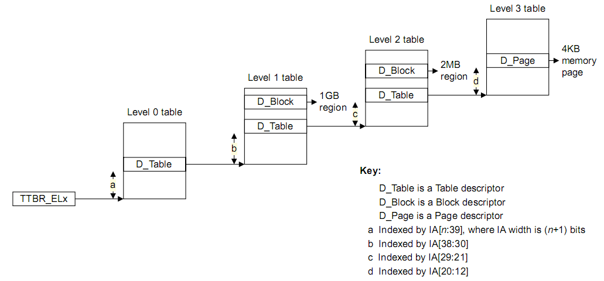
