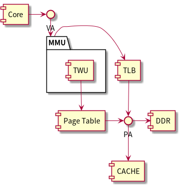
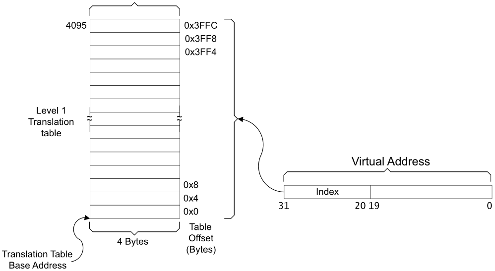
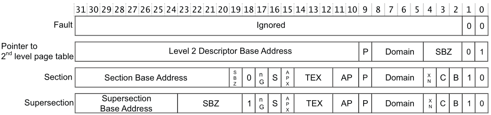
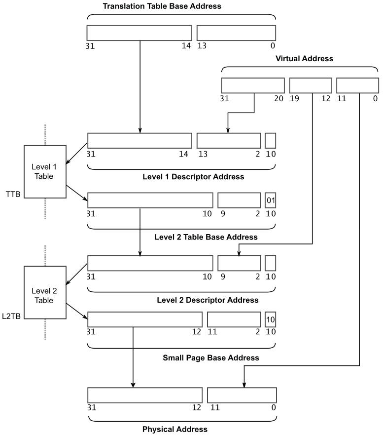

#+title: MMU
# #+subtitle: 
#+author: Joe
#+latex_class: org-latex-pdf 
#+toc: tables 
#+toc: listings 
#+latex: \clearpage\pagenumbering{arabic} 
#+latex: \AddToShipoutPicture{\BackgroundPicture} 
#+options: h:4 ^:{} 
#+startup: overview

* 简介
以运行HelloWorld程序的第—条指令为例:操作系统首先把程序从磁盘/SSD加载到
物理内存中，然后让CPU去执行程序的第—条指令，但是此时该指令存在于内存中。
在使用虚拟内存的情况下, CPU取指令时发出的是指令的虚拟地址，该虚拟地址
被MMU翻译为对应的物理地址，包含该物理地址的内存读请求被发送到物理内存
设备，然后物理内存设备把该物理地址对应的内容（即HelloWorld程序的第一条
指令）发送给CPU。

虚拟内存被组织为一个由存放在磁盘上的N个连续的字节大小的单元组成的数组，
每个字节都有一个唯一的虚拟地址，磁盘上的数组内容被缓存在主存中，根据需
要在磁盘和主存之间传输数据。由DRAM(DDR)的时序，可以发现检索连续字节块
的时间比访问一个字节的时间要短很多；对磁盘来说，从一个扇区读取第一个字
节的时间开销，要比读这个扇区的连续字节要慢10万倍。因此，虚拟内存想要获
取比较高的性能，磁盘上的数据被分割成块，这些块作为磁盘和主存之间的传输
单元。MMU架构如图[[img-mmuarch]]所示.
#+begin_src plantuml :exports results :file ./pic/drw-mmuarch.png
  package "MMU" {
    [TWU]
  }
  [Core] -> VA
  VA -down-> MMU
  MMU -right-> [TLB]
  [TWU] -down-> [Page Table]
  [TLB] -> PA
  [Page Table] -> PA
  PA -> [DDR]
  PA -down-> [CACHE]
#+end_src
#+caption: MMU Architecture
#+name: img-mmuarch
#+attr_latex: :placement [h] :width 0.2\textwidth
#+results:

- TLB: TLB是一种ram介质，类似CACHE，用于缓存经过TWU转换后的物理地址结
  果，从而缩短页表查询的时间；
- TWU: 是一个页表遍历算法模块，页表是由操作系统维护在物理内存中，但是
  页表的遍历查询是由TWU完成的，减少对CPU的消耗，TWU使用TTBRx_ELn找到
  Translation Table(Page Table)，进行[[VA2PA]] 章节的搜索，Page Table存放
  在ddr中。

  
当TLB未命中，并且在页表中没有找到对应的项，或者找到的项被标记
为无效（可能是因为相应的页并没有被加载到物理内存中）时，那么就会发生缺
页异常。这时操作系统需要先将相应的页从磁盘加载到内存中，然后更新页表和
TLB，最后再次尝试转换虚拟地址。任意时刻，虚拟页面的集合分成3个不相交的
子集：
- unallocated(未分配的)：虚拟页面还未分配（未创建）的页；
- cached(缓存的)：已经缓存在DRAM中的已分配页；
- uncached(未缓存的)：未缓存在DRAM中的已分配页；
* TLB
TLB，Translation Lookaside Buffer，旁路快表缓冲器，TLB is a cache of
recently executed page translations within the MMU, shown in figure
[[img-tlb-str]].
#+caption: TLB Structure
#+name: img-tlb-str
#+attr_latex: :placement [H] :width 0.5\textwidth
[[./pic/img-tlb-stru.png]]

- Translation Table Base Address: set to CP15 C2 register
- Translation Table Entry

若操作系统在切换应用程序的过程中刷新TLB，那么应用程序开始执行（被切换
到）的时候总是会发生TLB未命中的情况，进而不可避免地造成性能损失。那么
是否能够避免应用程序切换过程中TLB刷新的开销呢，一种为TLB缓存项打上“标
签”的设计正是为了避免这样的开销。以AArch64体系结构为例，它提供了
ASID（Address Space IDentjher）功能（x86-64上对应的功能称为PCID，
Process Context IDentiher）。具体来说，操作系统可以为不同的应用程序分
配不同的ASID作为应用程序的身份标签，再将这个标签写人应用程序的页表基地
址寄存器中的空闲位（如TTBR0_ELl的高l6位）。同时，TLB中的缓存项也会包含
ASID这个标签,从而使得TLB中属于不同应用程序的缓存项可以被区分开。因此，
在切换页表的过程中，操作系统不再需要清空TLB缓存项。

#+caption: Finding the Address of L1 Translation Table Entry
#+name: img-l1tte
#+attr_latex: :placement [H] :width 0.8\textwidth

* 转换机制
MMU将虚拟地址翻译为物理地址的主要机制有两种。
- 分段机制
- 分页机制
** 分段机制
在分段机制下，操作系统以“段”（一段连续的物理内存）的形式管理/分配物理
内存。应用程序的虚拟地址空间由若干个不同大小的段组成，比如代码段、数据
段等。当CPU访问虚拟地址空间中某一个段的时候，MMU会通过查询段表得到该段
对应的物理内存区域。具体来说,虚拟地址由两部分构成：第一个部分表示段号，
标识着该虚拟地址属于整个虚拟地址空间中的哪一个段；第二个部分表示段内地
址，或称段内偏移，即相对于该段起始地址的偏移量。段表存储着一个虚拟地址
空间中每一个分段的信息，其中包括段起始地址（对应于物理内存中段的起始物
理地址）和段长。在翻译虚拟地址的过程中，MMU首先通过段表基址寄存器找到
段表的位置，结合待翻译虚拟地址中的段号，可以在段表中定位到对应段的信息
（步骤一）;然后取出该段的起始地址（物理地址），加上待翻译虚拟地址中的
段内地址（偏移量），就能够得到最终的物理地址（步骤二）。段表中还存有诸
如段长（可用于检查虚拟地址是否超出合挞范围）等信息。
** 分页机制
另—种机制（即分页机制）被现代操作系统广泛采用。分页机制的基本思想是将
应用程序的虚拟地址空间划分成连续的、等长的虚拟页（显著区别于分段机制下
不同长度的段），同时物理内存也被划分成连续的、等长的物理页。虚拟页和物
理页的页长固定且相等，从而使得操作系统能够很方便地为每个应用程序枚造页
表，即虚拟页到物理页的映射关系表。逻辑上，该机制下的虚拟地址也由两个部
分组成:第—部分标识着虚拟地址的虚拟页号；第二部分标识着虚拟地址的页内偏
移量。在具体的地址翻译过程中，MMU首先解析得到虚拟地址中的虚拟页号，并
通过虚拟页号去该应用程序的页表（页表起始地址存放在页表基地址寄存器中）
中找到对应条目，然后取出条目中存储的物理页号，最后用该物理页号对应的物
理页起始地址加上虚拟地址中的页内偏移量得到最终的物理地址。
*** 页表（Page Table）
每个进程都有一份页表(Page Table),页叫转换表(Translation Table)，作为其
上下文的一部分，页表由一系列页表条目(PTE，page table entry)组成，每个
PTE包含虚拟页和物理页的映射关系。PTE由一个有效位（valid bit）和一个n位
地址字段组成以及其他权限标志位。
- valid bit = 1: 表示该PTE中指向虚拟页映射的物理页的地址位置；
- valid bit = 0: 会产生Page Fault，表示2种可能情况。
  + 地址字段为0，表示该PTE未使用过；
  + 地址字段指向虚拟页所存放在磁盘的位置VA1，该PTE原来指向的物理页被替
    换回VA1了，原来的物理页被用来存放其他虚拟页VA2的数据了，并被记录在
    另一个PTE上。
*** Translation Table Entry Format
#+caption: Translation Table Entry Format
#+name: img-tteformat
#+attr_latex: :placement [H] :width 0.85\textwidth

- TEX: type extension, reference [[tbl-mtcp]];
- S: shareable;
- AP(APX): access permission,reference [[tbl-apencode]];
**** Access Permission
#+caption: Access Permission Encoding
#+name: tbl-apencode
#+attr_latex: :placement [H]
|-----+----+------------+--------------+------------------------|
| APX | AP | Privileged | Unprivileged | Description            |
|-----+----+------------+--------------+------------------------|
|-----+----+------------+--------------+------------------------|
|   0 | 00 | No access  | No access    | Permission fault       |
|   0 | 01 | Read/Write | No access    | Privileged Access only |
|   0 | 10 | Read/Write | Read         | No user-mode write     |
|   0 | 11 | Read/Write | Read/Write   | Full access            |
|   1 | 00 | -          | -            | Reserved               |
|   1 | 01 | Read       | No access    | Privileged Read only   |
|   1 | 10 | Read       | Read         | Read only              |
|   1 | 11 | -          | -            | Reserved               |
|-----+----+------------+--------------+------------------------|

**** Memory Type & Cacheable Properties
#+caption: Memory Type & Cacheable Properties
#+name: tbl-mtcp
#+attr_latex: :placement [H]
|-----+---+---+-----------------------------------------------------+------------------|
| TEX | C | B | Description                                         | Memory type      |
|-----+---+---+-----------------------------------------------------+------------------|
|-----+---+---+-----------------------------------------------------+------------------|
| 000 | 0 | 0 | Strongly-ordered                                    | Strongly-ordered |
| 000 | 0 | 1 | Shareable device                                    | Devicea          |
| 000 | 1 | 0 | Outer and Inner write-through, no allocate on write | Normal           |
| 000 | 1 | 1 | Outer and Inner write-back, no allocate on write    | Normal           |
| 001 | 0 | 0 | Outer and Inner non-cacheable                       | Normal           |
| 001 | - | - | Reserved                                            | -                |
| 010 | 0 | 0 | Non-shareable device                                | Devicea          |
| 010 | - | - | Reserved                                            | -                |
| 011 | - | - | Reserved                                            | -                |
|-----+---+---+-----------------------------------------------------+------------------|
| 1XX | Y | Y | Cached memory                                       | Normal           |
|     |   |   | XX = Outer policy                                   |                  |
|     |   |   | YY = Inner policy                                   |                  |
|-----+---+---+-----------------------------------------------------+------------------|

* VA2PA
** First Translation Table
#+caption: L1 VA to PA 
#+name: img-l1va2pa
#+attr_latex: :placement [H] :width 0.7\textwidth
[[./pic/img-va2pa.png]]

- Section Base Address Descriptor: reference to [[Translation Table Entry Format]].

** Second Translation Table
#+caption: L2 VA to PA 
#+name: img-l2va2pa
#+attr_latex: :placement [H] :width 0.7\textwidth

** Pseudocode
- AlignmentFaultV
  #+begin_src c -n 1
    AlignmentFaultV(bits(32) address, boolean iswrite)
    {
        mva = FCSETranslate(address);
        DataAbort(mva, bits(4) UNKNOWN, boolean UNKNOWN, iswrite, DAbort_Alignment);
    }
  #+end_src
- TranslateAddressV
  #+begin_src c -n -1
    AddressDescriptor TranslateAddressV(bits(32) va, boolean ispriv, boolean iswrite)
    {
        mva = FCSETranslate(va);
        if SCTLR.M == ‘1’ then // MMU is enabled
            (tlbhit, tlbrecord) = CheckTLB(CONTEXTIDR.ASID, mva);
  
        if !tlbhit then
            tlbrecord = TranslationTableWalk(mva, iswrite);
        if CheckDomain(tlbrecord.domain, mva, tlbrecord.sectionnotpage, iswrite) then
            CheckPermission(tlbrecord.perms, mva, tlbrecord.sectionnotpage, iswrite, ispriv);
        else
            tlbrecord = TranslationTableWalk(mva, iswrite);
  
        return tlbrecord.addrdesc;
    }
  #+end_src
- CheckDomain
  #+begin_src c -n 1
    boolean CheckDomain(bits(4) domain, bits(32) mva, boolean sectionnotpage, boolean iswrite)
    {
        bitpos = 2*UInt(domain);
        case DACR<bitpos+1:bitpos> of
            when ‘00’ DataAbort(mva, domain, sectionnotpage, iswrite, DAbort_Domain);
            when ‘01’ permissioncheck = TRUE;
            when ‘10’ UNPREDICTABLE;
            when ‘11’ permissioncheck = FALSE;
        return permissioncheck;
    }
  #+end_src
- TLB operations
  #+begin_src c -n 1
    enumeration TLBRecType = {
        TLBRecType_SmallPage,
        TLBRecType_LargePage,
        TLBRecType_Section,
        TLBRecType_Supersection,
        TLBRecType_MMUDisabled
    };
    type TLBRecord is (
        Permissions perms,
        bit nG, // ‘0’ = Global, ‘1’ = not Global
        bits(4) domain,
        boolean sectionnotpage,
        TLBRecType type,
        AddressDescriptor addrdesc
    )
  #+end_src
- FCSETranslate
  #+begin_src c -n 1 
    bits(32) FCSETranslate(bits(32) va)
    {
        if va<31:25> == ‘0000000’ then
            mva = FCSEIDR.PID : va<24:0>;
        else
            mva = va;
        return mva;
    }
  #+end_src
- TranslationTableWalk
  #+begin_src c -n -1 
    TLBRecord TranslationTableWalk(bits(32) mva, boolean is_write)
    {
        TLBRecord result;
        AddressDescriptor l1descaddr;
        AddressDescriptor l2descaddr;
        if SCTLR.M == ‘1’ then {// MMU is enabled
            domain = bits(4) UNKNOWN; // For Data Abort exceptions found before a domain is known
            // Determine correct Translation Table Base Register to use.
            n = UInt(TTBCR.N);
            if n == 0 || IsZero(mva<31:(32-n)>) then{
                ttbr = TTBR0;
                disabled = (TTBCR.PD0 == ‘1’);
            }else{
                ttbr = TTBR1;
                disabled = (TTBCR.PD1 == ‘1’);
                n = 0; // TTBR1 translation always works like N=0 TTBR0 translation
            }    
            // Check this Translation Table Base Register is not disabled.
            if HaveSecurityExt() && disabled == ‘1’ then
                DataAbort(mva, domain, TRUE, is_write, DAbort_Translation);
  
            // Obtain level 1 descriptor.
            l1descaddr.paddress.physicaladdress = ttbr<31:(14-n)> : mva<(31-n):20> : ‘00’;
            l1descaddr.paddress.physicaladdressext = ‘00000000’;
            l1descaddr.paddress.NS = if IsSecure() then ‘0’ else ‘1’;
            l1descaddr.memattrs.type = MemType_Normal;
            l1descaddr.memattrs.shareable = (ttbr<1> == ‘1’);
            l1descaddr.memattrs.outershareable = (ttbr<5> == ‘0’) && (ttbr<1> == ‘1’);
            l1descaddr.memattrs.outerattrs = ttbr<4:3>;
            if HaveMPExt() then{
                1descaddr.memattrs.innerattrs = ttbr<0>:ttbr<6>;
            }else{
                if ttbr<0> == ‘0’ then
                    l1descaddr.memattrs.innerattrs = ‘00’;
                else
                    IMPLEMENTATION_DEFINED set l1descaddr.memattrs.innerattrs to one of‘01’,’10’,’11’;
            }    
            l1desc = _Mem[l1descaddr,4];
            // Process level 1 descriptor.
            case l1desc<1:0> of
                when ‘00’, ‘11’{ // Fault, Reserved
                    DataAbort(mva, domain, TRUE, is_write, DAbort_Translation);
                }    
                when ‘01’ {// Section or Supersection
                    texcb = l1desc<14:12,3,2>;
                    S = l1desc<16>;
                    ap = l1desc<15,11:10>;
                    xn = l1desc<4>;
                    nG = l1desc<17>;
                    sectionnotpage = TRUE;
                    NS = l1desc<19>;
                    if SCTLR.AFE == ‘1’ && l1desc<10> == ‘0’ then{
                        if SCTLR.HA == ‘0’ then
                            DataAbort(mva, domain, sectionnotpage, is_write, DAbort_AccessFlag);
                        else // Hardware-managed access flag must be set in memory
                            _Mem[l1descaddr,4]<10> = ‘1’;
                    }    
                    if l1desc<18> == ‘0’ then{ // Section: 1MBytes
                        domain = l1desc<8:5>;
                        type = TLBRecType_Section;
                        physicaladdressext = ‘00000000’;
                        physicaladdress = l1desc<31:20> : mva<19:0>;
                    }else{ // Supersection: 16MBytes
                        domain = ‘0000’;
                        type = TLBRecType_Supersection;
                        physicaladdressext = l1desc<8:5,23:20>;
                        physicaladdress = l1desc<31:24> : mva<23:0>;
                    }
                }        
                when ‘10’{ // Large page or Small page
                    domain = l1desc<8:5>;
                    sectionnotpage = FALSE;
                    NS = l1desc<3>;
                    // Obtain level 2 descriptor.
                    l2descaddr.paddress.physicaladdress = l1desc<31:10> : mva<19:12> : ‘00’;
                    l2descaddr.paddress.physicaladdressext = ‘00000000’;
                    l2descaddr.paddress.NS = if IsSecure() then ‘0’ else ‘1’;
                    l2descaddr.memattrs = l1descaddr.memattrs;
                    l2desc = _Mem[l2descaddr,4];
                    // Process level 2 descriptor.
                    if l2desc<1:0> == ‘00’ then
                        DataAbort(mva, domain, sectionnotpage, is_write, DAbort_Translation);
  
                    S = l2desc<10>;
                    ap = l2desc<9,5:4>;
                    nG = l2desc<11>;
                    if SCTLR.AFE == ‘1’ && l2desc<4> == ‘0’ then{
                        if SCTLR.HA == ‘0’ then
                            DataAbort(mva, domain, sectionnotpage, is_write, DAbort_AccessFlag);
                        else // Hardware-managed access flag must be set in memory
                            _Mem[l2descaddr,4]<4> = ‘1’;
                    }    
                    if l2desc<1> == ‘0’ then{ // Large page
                        texcb = l2desc<14:12,3,2>
                        xn = l2desc<15>;
                        type = TLBRecType_LargePage;
                        physicaladdressext = ‘00000000’;
                        physicaladdress = l2desc<31:16> : mva<15:0>;//64KBytes
                    }else{ // Small page
                        texcb = l2desc<8:6,3,2>;
                        xn = l2desc<0>;
                        type = TLBRecType_SmallPage;
                        physicaladdressext = ‘00000000’;
                        physicaladdress = l2desc<31:12> : mva<11:0>;//4KBytes
                    }     
                }
        }else{ // MMU is disabled
            texcb = ‘00000’;
            S = ‘1’;
            ap = bits(3) UNKNOWN;
            xn = bit UNKNOWN;
            nG = bit UNKNOWN;
            domain = bits(4) UNKNOWN;
            sectionnotpage = boolean UNKNOWN;
            type = TLBRecType_MMUDisabled;
            physicaladdress = mva;
            physicaladdressext = ‘00000000’;
            NS = if IsSecure() then ‘0’ else ‘1’;
        }
        // Decode the TEX, C, B and S bits to produce the TLBRecord’s memory attributes.
        if SCTLR.TRE == ‘0’ then{
            if RemapRegsHaveResetValues() then
                result.addrdesc.memattrs = DefaultTEXDecode(texcb, S);
            else
                IMPLEMENTATION_DEFINED setting of result.addrdesc.memattrs;
        }else{
            if SCTLR.M == ‘0’ then
                result.addrdesc.memattrs = DefaultTEXDecode(texcb, S);
            else
                result.addrdesc.memattrs = RemappedTEXDecode(texcb, S);
        }    
        // Set the rest of the TLBRecord, try to add it to the TLB, and return it.
        result.perms.ap = ap;
        result.perms.xn = xn;
        result.nG = nG;
        result.domain = domain;
        result.sectionnotpage = sectionnotpage;
        result.type = type;
        result.addrdesc.paddress.physicaladdress = physicaladdress;
        result.addrdesc.paddress.physicaladdressext = physicaladdressext;
        result.addrdesc.paddress.NS = NS;
        //add it to the TLB
        AssignToTLB(CONTEXTIDR.ASID, mva, result);
        return result;
    }
  #+end_src
** Multi Level Page Table
实际应用中，多使用多级页表。
#+caption: AArch64体系下基于4级页表的地址翻译
[[./pic/img-multlevel-mmu.png]]
当MMU翻译一个虚拟地址的时候。
- 首先根据贞表基地址寄存器中的物理地址找到第0级页表页
- 然后将虚拟地址的虚拟页号0（第47至39位）作为页表项索引，读取第0级页表
  页中的相应页表项;
- MMU按照类似的方式将虚拟地址的虚拟页号l（第38至30位）作为页表项索引，
  继续读取第1级页表页中的相应页表项;
- 往下类推，MMU将在一个第3级页表页中的页表项里面找到该虚拟地址对应的物
  理页号；
- 再结合虚拟地址中的页内偏移量即可获得最终的物理地址。

  
这样的4级页表结构允许页表内存在“空洞”，操作系统可以在虚拟地址被应用程
序使用之后再分配并填写相应的页表页。在这里我们举一个极端的例子来说明多
级页表在内存占用方面的优势。假设整个应用程序的虚拟地址空间中只有两个虚
拟页被使用，分别对应于最低和最高的两个虚拟地址。在使用4级页表后’整个页
表实际上只需要l个0级页表页、2个l级页表页、2个2级页表页、2个3级页表页，
合计7个页表页（即整个页表中大部分都是“空洞”），仅仅占用28KB的物理内存
空间，远小于单级页表的大小。
** 虚拟内存功能
- 共享内存：允许同一个物理页在不同的应用程序间共享，应用程序A的虚拟页
  Vl被映射到物理页P,若应用程序B的虚拟页V2也被映射到物理页P，则物理页P
  是应用程序A和应用程序B的共享内存。应用程序A读取虚拟页V1和应用程序B读
  取虚拟页V2将得到相同的内容，互相也能看到对方修改的内容。共享内存的一
  个基本用途是可以让不同的应用程序之间互相通信，传递数据。
- 写时拷贝：两个应用程序AB拥有很多相同的内存数据（比如加载了相同的动态
  链接库）.如果把这些数据相同的内存页在物理内存P中仅存储—份，然后以只
  读的方式映射给两个程序，那么就能够显著地节约物理内存资源，而如果B需
  要写这份数据页时，OS会将P复制一份成P1，将B的该虚拟页映射到P1进行修改。
- 内存去重：基于写时拷贝机制,操作系统进一步地设计了内存去重功能。操作
  系统可以定期地在内存中扫描具有相同内容的物理页,并且找到映射到这些物
  理页的虚拟页;然后只保留其中一个物理页，并将具有相同内容的其他虚拟页
  都用写时拷贝的方式映射到这个物理页，然后释放其他的物理页以供将来使用。
  该功能通常由操作系统主动发起使用，对于用户态应用程序完全透明。Linux
  操作系统就实现了该功能，称为KSM（Kernel Same-page merge）。不过，内
  存去重功能会对应用程序访存时延造成影响，当应用程序写一个被去重的内存
  页时，既会触发缺页异常，又会导致内存拷贝，从而可能导致性能下降。
- 内存压缩：为了节约内存资源，现代操作系统还引人了压缩算法来对内存数据
  进行压缩。其基本原理是:当内存资源不充足的时候，操作系统选择一些“最近
  不太会使用”的内存页，压缩其中的数据，从而释放出更多空闲内存。当应用
  程序访问被压缩的数据时，操作系统将其解压即可，所有操作都在内存中完成。
  相比于换出内存数据到磁盘，这样的做法既能够更迅速地腾出空闲内存空间，
  又能够更快地恢复被压缩的数据，比如Linux的zswap内存区域就是用来存放压
  缩的数据。
- 大页：大页（huge page）机制能够有效缓解TLB缓存项不够用的问题.大页的
  大小可以是2MB甚至是lGB，相比于4KB大小的页，使用大页可以大幅度减少TLB
  的占用量（如访问2MB内存只需要一个TLB缓存项）。
