#+title: SDIO-SD
# #+subtitle: 
#+author: 李孝超
#+latex_class: org-latex-pdf 
#+toc: tables 
#+toc: listings 
#+latex: \clearpage\pagenumbering{arabic} 
#+latex: \AddToShipoutPicture{\BackgroundPicture} 
#+options: h:4 ^:{} 
#+startup: overview
* 概述
** 简介
SD卡使用卡内智能控制模块进行FLASH操作控制，包括协议、安全算法、数据存
取、ECC算法、缺陷处理和分析、电源管理、时钟管理等，基本结构见图所示
[[img-sandisksd]]。

- SD卡是基于flash的存储卡。
- SD卡和MMC卡的区别在于初始化过程不同。
- SD卡的通信协议包括SD和SPI两类。

#+caption: SD卡基本结构
#+name: img-sandisksd
#+attr_latex: :placement [H] :width 0.6\textwidth
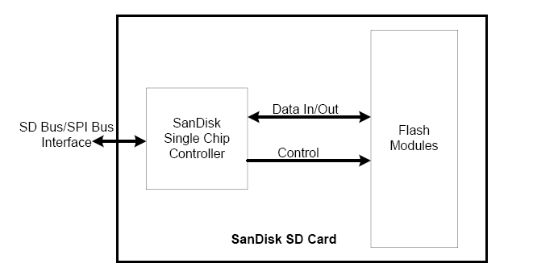

** 功能介绍
- 主机无关的FLASH内存擦除和编程读或写数据，主机只要发送一个带地址的命
  令，然后等待命令完成，主机无需关心具体操作的完成。当采用新型的FLASH
  时，主机代码无需更新。
- Flash每个扇区有大约10万次的写寿命，读没有限制。
- 擦除操作可以加速写操作，因为在写之前会进行擦除。
- 缺陷管理
- 错误恢复
- 电源管理

** SD卡总线模式
*** 操作条件协商
当HOST定义了SD卡不支持的电压范围时，SD卡将处于非活动状态，将忽略所有的
总线传输。要退出非活动状态唯一的方法就是重新上电。
*** SD卡获取和识别
SD卡总线采用的是单主多从结构，总线上所有SD卡共用时钟和电源线。主机依次
分别访问每个卡，每个卡的CID寄存器中已预编程了一个唯一的卡标识号，用来
区分不同的卡。

主机通过READ_CID命令读取CID寄存器。CID寄存器在SD卡生产过程中的测试和格
式化时被编程，主机只能读取该号。

DAT3线上内置的上拉电阻用来侦测卡。在数据传输时电阻断开(使用 ACMD42)。
*** SD卡状态
SD卡状态分别存放在下面两个区域：
- 卡状态（Card Status）：存放在一个32位状态寄存器，在SD卡响应主机命
  令时作为数据传送给主机。
- SD状态（SD_Status）：当主机使用SD_STATUS（ACMD13）命令时，512位以一
  个数据块的方式发送给主机。SD_STATUS还包括了和BUS_WIDTH、安全相关位和
  扩展位等的扩展状态位。
*** SD卡内存组织
通常SD卡内部存储组织如图[[img-sdmemoryorg]]所示。
#+caption: SD卡内存组织
#+name: img-sdmemoryorg
#+attr_latex: :placement [H] :width 0.6\textwidth
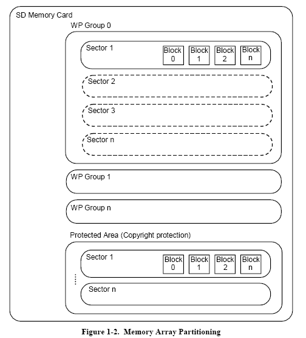

- Block:块大小可以固定，也可以改变，允许的块大小是实际大小等信息存储在
  CSD寄存器。
- Sector:和擦除命令相关，由几个块组成。Sector的大小对每个设备是固定的，
  大小信息存储在CSD寄存器。
- WP Group:写保护单位。大小包括几个group，写保护由一位决定，对每个设备
  大小是固定的，存储在CSD寄存器。

*** 读写操作
- Single Block Mode:主机根据事先定义的长度读写一个数据块。由发送模块产
  生一个16位的CRC校验码，接受端根据校验码进行检验。读操作的块长度受设
  备sector大小 (512 bytes)的限制，但是可以最小为一个字节。不对齐的访问
  是不允许的，每个数据块必须位于单个物理sector内。写操作的大小必须为
  sector大小，起始地址必须与sector边界对齐。
- Multiple Block Mode:主机可以读写多个数据块（相同长度），根据命令中的
  地址读取或写入连续的内存地址。操作通过一个停止传输命令结束。写操作必
  须地址对齐。
- Sector Erase: SD卡数据擦除的最小单位是sector。为了加速擦除操作，多个
  sector可以同时擦除。为了方便选择，第一个指令包含起始地址，第二个指令
  包含结束地址，在地址范围内的所有sector将被擦除。
- Write Protect：写保护，两种写保护方式可供选择，永久保护和临时保护，
  两种方式都可以通过PROGRAM_CSD指令进行设置。永久保护位一旦设置将无法
  清除。
  
  

#+caption: SD卡数据读写
#+name: img-sddatatrans
#+attr_latex: :placement [H] :width 0.6\textwidth
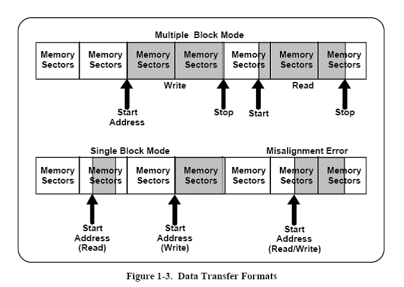
* SD接口描述
** 引脚定义
接口定义如表[[tbl-sdintfc]]所示。数据线(DAT1-DAT3)上电后为输入，
SET_BUS_WIDTH命令执行后作为数据线。即使只有DATA0使用，所有数据线都和外
部上拉电阻连接，否则DATA1 & DATA2（如果未被使用）的振荡输入将引起非期
望的高电流损耗。

#+caption: SD卡接口定义
#+name: tbl-sdintfc
#+attr_latex: :placement [H]
|----------+------+-------------------------|
| Name     | Type | Description             |
|----------+------+-------------------------|
|----------+------+-------------------------|
| CD/DATA3 | I/O  | Card Detect/Data Line 3 |
| CMD      | I/O  | Command/Response        |
| Vss1     | S    | Supply voltage GND      |
| VDD      | S    | Supply voltage          |
| CLK      | I    | Clock                   |
| Vss2     | S    | Supply voltage GND      |
| Data0    | I/O  | Data Line 0             |
| Data1    | I/O  | Data Line 1             |
| Data2    | I/O  | Data Line 2             |
|----------+------+-------------------------|

** 寄存器

|------+------+-------------------------------------|
| 名称 | 宽度 | 描述                                |
|------+------+-------------------------------------|
|------+------+-------------------------------------|
| CID  |  128 | 卡标识号                            |
| RCA  |   16 | 相对卡地址（Relative card address） |
| CSD  |  128 | 卡描述数据:卡操作条件相关的信息数据 |
| SCR  |   64 | SD配置寄存器:SD卡特定信息数据       |
| OCR  |   32 | 操作条件寄存器                      |
|------+------+-------------------------------------|
- 注意：RCA是本地系统中卡的地址，动态变化，在主机初始化的时候确定，SPI
  模式中没有；

*** OCR（Operating Conditions Register）
32位的操作条件寄存器存储了VDD电压范围。SD卡操作电压范围为2~3.6V。然而
从内存中访问数据的电压是2.7~3.6V。OCR显示了卡数据访问电压范围，结构如
表[[tbl-ocrvol]]所示。
#+caption: OCR电压范围
#+name: tbl-ocrvol
#+attr_latex: :placement [H]
|-------+------------------|
| OCR位 | VDD电压范围      |
|-------+------------------|
|-------+------------------|
|   0-3 | 保留             |
|     4 | 1.6~1.7          |
|     5 | 1.7~1.8          |
|     6 | 1.8~1.9          |
|     7 | 1.9~2.0          |
|     8 | 2.0~2.1          |
|     9 | 2.1~2.2          |
|    10 | 2.2~2.3          |
|    11 | 2.3~2.4          |
|    12 | 2.4~2.5          |
|    13 | 2.5~2.6          |
|    14 | 2.6~2.7          |
|    15 | 2.7~1.8          |
|    16 | 2.8~2.9          |
|    17 | 2.9~3.0          |
|    18 | 3.0~3.1          |
|    19 | 3.1~3.2          |
|    20 | 3.2~3.3          |
|    21 | 3.3~3.4          |
|    22 | 3.4~3.5          |
|    23 | 3.5~3.6          |
| 24-30 | 保留             |
|    31 | 卡上电状态位(忙) |
|-------+------------------|

*** CID(Card Identification)
CID寄存器长度为16个字节的卡唯一标识号，该号在卡生产厂家编程后无法修改。
SD和MMC卡的CID寄存器结构不一样，如表[[tbl-cidstru]]示。

#+caption: CID结构
#+name: tbl-cidstru
#+attr_latex: :placement [H]
|-----------------+--------+------+-----------+--------------------------------------+-------------------|
| 名称            | 类型   | 宽度 | CID位     | 内容                                 | CID值             |
|-----------------+--------+------+-----------+--------------------------------------+-------------------|
|-----------------+--------+------+-----------+--------------------------------------+-------------------|
| 厂商ID          | Binary |    8 | [127:120] | SD卡协会管理和分配                   | 0x03              |
| OEM ID(OID)     | ASCII  |   16 | [119:104] | 识别卡的OEM或卡内容，由制造商分配    | 0x53,0x44         |
| 产品名（PNM）   | ASCII  |   40 | [103:64]  | 5个ASCII字符                         | SD128             |
| 产品版本（PRV） | BCD    |    8 | [65:56]   | 2个二进制编码的十进制数              | 产品版本（30）1   |
| 序列号(PSN)     | Binary |   32 | [55:24]   | 32位无符号整数                       | 产品序列号        |
| 保留            |        |    4 | [23:20]   |                                      |                   |
| 生成日期(MDT)   | BCD    |   12 | [19:8]    | yym（从2000年的偏移量）              | 如:Apr 2001=0x014 |
|-----------------+--------+------+-----------+--------------------------------------+-------------------|
| CRC7校验和(CRC) | Binary |    7 | [7:1]     | CRC Calculation: G(x)=x7+3+1         | CRC7              |
|                 |        |      |           | M(x)=(MID-MSB)*x119+...+(CIN-LSB)*x0 |                   |
|                 |        |      |           | CRC[6...0]=Remainder[(M(x)*x7)/G(x)] |                   |
|-----------------+--------+------+-----------+--------------------------------------+-------------------|
| 未用            |        |    1 | [0:0]     |                                      |                   |
|-----------------+--------+------+-----------+--------------------------------------+-------------------|

*** CSD(Card Specific Data)
CSD寄存器包含访问卡数据所需的配置信息。SD卡和MMC卡的CSD不同。
* SD卡协议
SD总线通信是基于命令和数据位流方式的，由一个起始位开始，以一个停止位结束：
- 命令：命令是开始开始操作的标记。命令从主机发送一个卡（寻址命令）或所
  有连接的卡（广播命令）。命令在CMD线上串行传送。
- 响应：响应是从寻址卡或所有连接的卡（同步）发送给主机用来响应接受到的
  命令的标记。命令在CMD线上串行传送。
- 数据：数据可以通过数据线在卡和主机间双向传送。
** 命令传输
命令传输可以有响应，也可以没有响应，如图[[img-sdcmdtrans]]所示。
#+caption: 命令传输
#+name: img-sdcmdtrans
#+attr_latex: :placement [H] :width 0.6\textwidth
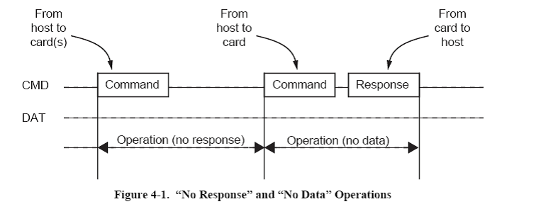
** 数据传输
数据传送采用块方式，数据块后接CRC校验位，操作包括单数据块和多数据块。
多数据块更适合快速写操作，多数据块传输当在CMD线出现停止命令时结束。
数据传输可以在主机端设置采用单数据线或多数据线方式。
*** 多块读传输
#+caption: 多块读传输
#+name: img-sdiodatatrans
#+attr_latex: :placement [H] :width 0.6\textwidth
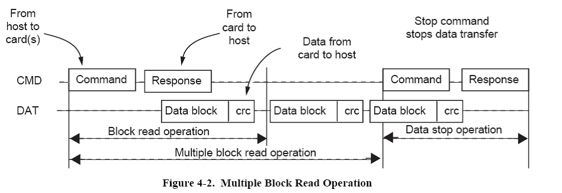
*** 多块写传输
#+caption: 多块写传输
#+name: img-sdiodatawritetrans
#+attr_latex: :placement [H] :width 0.6\textwidth
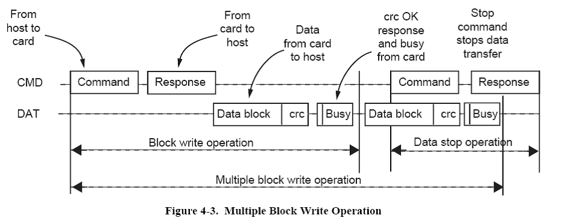

** 传输格式
*** 命令格式
#+caption: 命令报文格式
#+name: img-sdiocmdformat
#+attr_latex: :placement [H] :width 0.6\textwidth
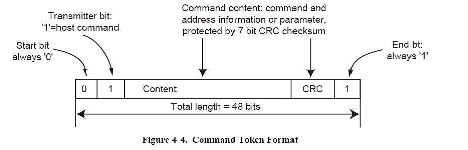

*** 响应格式
#+caption: 响应报文格式
#+name: img-sdioresformat
#+attr_latex: :placement [H] :width 0.6\textwidth
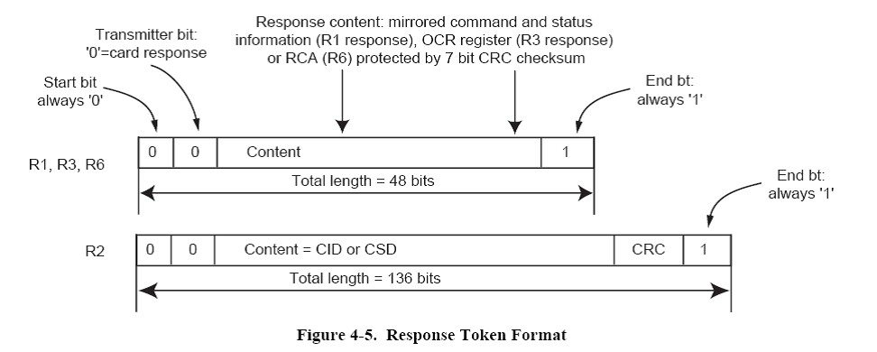

*** 数据格式
#+caption: 数据报文格式
#+name: img-sdiodataformat
#+attr_latex: :placement [H] :width 0.6\textwidth
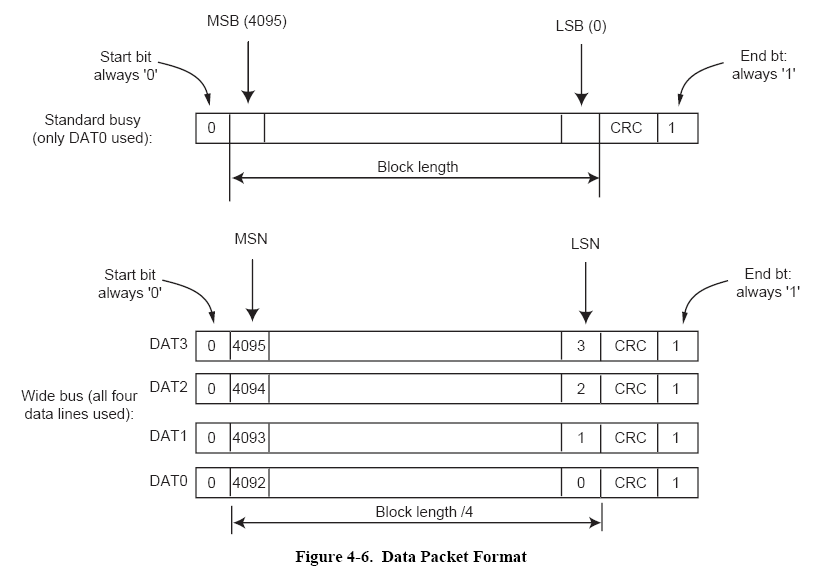
** 传输模式
*** 卡识别模式
#+caption: 卡识别模式
#+name: img-cardindentify
#+attr_latex: :placement [H] :width 0.6\textwidth
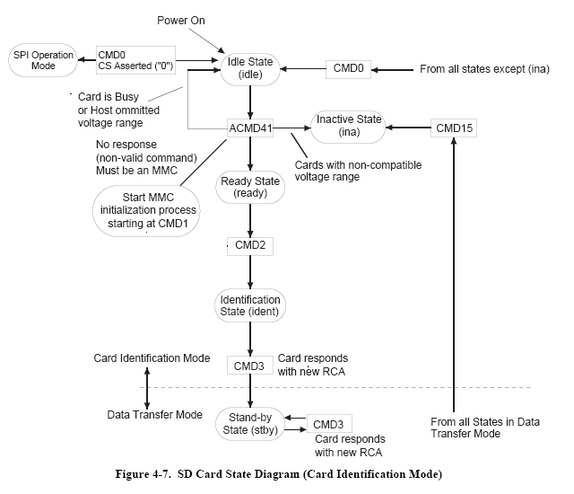
*** 数据传输模式
#+caption: 数据传输模式
#+name: img-cardtransmode
#+attr_latex: :placement [H] :width 0.6\textwidth
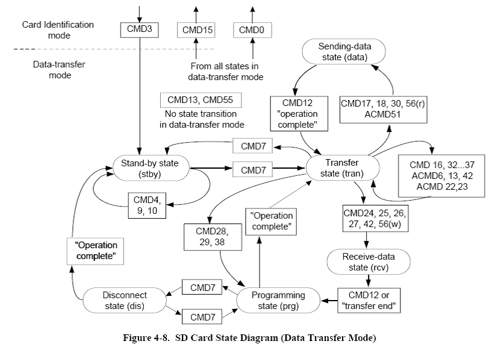
