#+title: SD Part1 物理层
# #+subtitle: 
#+author: Joe
#+latex_class: org-latex-pdf 
#+toc: tables 
#+toc: listings 
#+latex: \clearpage\pagenumbering{arabic} 
#+latex: \AddToShipoutPicture{\BackgroundPicture} 
#+options: h:4 ^:{} 
#+startup: overview
* 概述
SD卡是一种存储卡, 旨在设计来满足消费类电子中音视频固有的要求安全/容量/
性能等. SD卡有一个遵守SDMI安全标准的内容保护机制,快速且高存储容量.SD卡
安全系统使用一套成熟的最新的认证和加密算法来保护以免卡内容被非法使用.
对用户内容的非安全访问也是支持的.

SD卡也支持普通标准如ISO-7816的次级安全系统, 它可以将SD卡接入公共网络和
支持移动电子商务,数字签名应用的系统.

除SD卡外, 还有SDIO卡. SDIO卡规格是单独规定的,叫"SDIO Card
Specification", 可以从SD协会获得. SDIO规格书定义了一种SD卡,它有一个介
于SD IO单元和SD主机之间的接口. SDIO卡可能和它的IO功能一样包含存储能力.
SDIO卡的存储部分应该完全兼容物理层规格. SDIO卡是基于并兼容SD存储卡.这
个兼容性包括机械/电气/功耗/信号/软件. SDIO卡的目标是给移动电子设备提供
低功耗高速数据传输功能. 一个主要目标是IO卡插入进非SDIO主设备不应该导致
物理损坏或设备和软件的损坏,这种情况下,IO卡应该简单的被忽略. 而一旦插入
一个SDIO主设备, 将会通过已有的, 在SDIO规格中描述的带扩展的物理层规格书
中的正常方式检测卡.

基本的SD存储卡通信是基于9针接口(Clock/Command/4xData/3xPower线),这个设
计可以操作于最大频率208MHz和低电压范围. 还有一些通信方法基于差分信号接
口(UHS-II/PCIe/NVMe)是可选的设定. 通信协议作为这个规格一部分定义, 除非
在其他情况指定(如PCIe/NVMe场景).SD规格书划分为几个文档. 其文档结构如图
[[img-sdspecdocstr]]所示.
#+caption: SD规格书文档结构
#+name: img-sdspecdocstr
#+attr_latex: :placement [H] :width 0.6\textwidth
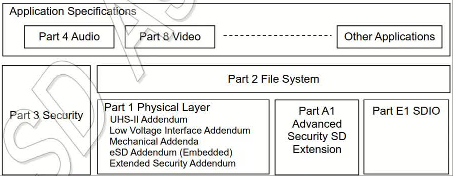
- 音频规定: 这个沿用其他应用规格,描述了特定应用(音频应用)的规定和要求.
- 文件系统规定: 这个规定描述了SD存储卡(用户区和保护区)中保存数据的文件
  格式结构的定义;
- 安全规定: 这个规定描述了内容保护机制和应用相关的支持命令;
- 物理层规定:即本文档, 描述了物理层接口和SD存储卡用到的命令协议. 物理
  层规定的目的是定义SD存储卡,它的环境和处理方法.文档划分为几个部分. 第
  3章给了一个系统性概念的一般概览. SD存储卡的一般性质在第4章描述. 正如
  这个描述定义了一套总体的卡性质, 我们建议并行的使用产品文档. 卡寄存器
  在第5章描述.第6章定义了SD存储卡的硬件接口电气参数. 在第2.00版的第8章
  机械规定的机械规格移到了"Standard Size Mechanical"增编.有3个关于机械
  的增编依赖于形成因数.
  + 标准尺寸机械规格增编;
  + miniSD机械规格增编;
  + microSD机械规格增编;
  UHS-II接口规格在UHS-II增编中定义. SD Express Interface规格在SD物理层
  规格书中定义, 在第7.0版本中介绍.UHS-II或SD Express Interface的定义独
  立于特定的形成因数, 除非在特定的形成因数应用中描述.嵌入式应用中不可
  移除存储设备在eSD增编中定义. SD卡中TCG安全功能在扩展安全增编中定义.
- Mc-EX(Mobile Commerce Extension)接口规定:这部分加在了1.10版本, SD存
  储卡A1部分(参考[[img-sdspecdocstr]])作为SD卡物理层规格书的扩展,并提供了
  移动电子商务扩展命令包传输要求的所有定义(从Mc-EX主侧到SD存储卡及相反)
- SDIO规定:SDIO卡和嵌入式SDIO是基于物理层规定和修改以及扩展来定义的,在
  SDIO规格书的E1部分描述.
* 系统功能
- 针对可移植/静态应用;
- 存储容量
  + Standard Capacity SD存储卡(SDSC): 2GB及以下容量;
  + High Capacity SD存储卡(SDHC): 2GB以上32GB及以下;
  + Extended Capacity SD存储卡(SDXC): 32GB以上2TB及以下;
  + Ultra Capacity SDu存储卡(SDUC): 2TB以上128TB及以下;
- 电压范围
  + High Voltage SD存储卡: 工作电压范围:2.7~3.6V;
  + UHS-II SD存储卡: 工作电压范围VDD1(2.7~3.6V), VDD2(1.7~1.95V);
  + SD Express存储卡: 工作电压范围VDD1(2.7~3.6V), VDD2(1.7~1.95V)还有
    可选的VDD3(1.14~1.3v, 如果支持则代替VDD2);
- 为只读/读写卡设计;
- 总线速度模式: 使用4数据线并行
  + 默认速度模式: 3.3V信号电压, 频率到25MHz可达12.5MB/s;
  + 高速模式: 3.3V信号电压, 频率到50MHz可达25MB/s;
  + SDR12: UHS-I 1.8V信号电压, 频率到25MHz可达12.5MB/s;
  + SDR25: UHS-I 1.8V信号电压, 频率到50MHz可达25MB/s;
  + SDR50: UHS-I 1.8V信号电压, 频率到100MHz可达50MB/s;
  + SDR104: UHS-I 1.8V信号电压, 频率到208MHz可达104MB/s;
  + DDR50: UHS-I 1.8V信号电压, 频率到50MHz可达50MB/s, 双边沿采样;
- 总线速度模式:使用UHS-II差分接口线
  + UHS156: UHS-II RCLK频率范围26MHz~52MHz, 每lane可达1.56Gbps;    
  + UHS624: UHS-II RCLK频率范围26MHz~52MHz, 每lane可达6.24Gbps;    
- 总线速度模式: 使用PCIe差分接口线
  + 带Gen3 1lane的PCIe: 可达985MB/s;
  + 带Gen3 2lane的PCIe: 可达1969MB/s;
  + 带Gen4 1lane的PCIe: 可达1969MB/s;
  + 带Gen4 2lane的PCIe: 可达3938MB/s;
- Switch function命令支持
  + 总线速度模式
  + 命令系统
  + 驱动能力
  + 未来功能;
- 存储域错误校正;
- 读操作期间移除卡片不会损坏卡内容;
- 内容保护机制:遵守最高SDMI标准;
- 密码保护(CMD42-LOCK_UNLOCK);
- 机械开关写保护功能
- 内建写保护功能
  + 永久写保护
  + 临时写保护
  + 写保护直到重启;
- 卡检测(插入/移除);
- 特定应用命令;
- 柔性擦除机制;
- SD Express卡功能
  + PCIe Gen3 或Gen4; 1 lane 或2 lane
    1. 双单点对点串行连接;
    2. 对于Gen3x1总线, 2个差分IO(1RX/1TX),8Gbps传输, 每个方向产生可达985MB/s.
    3. 对于Gen3x2总线, 4个差分IO(2RX/2TX),8Gbps传输, 每个方向产生可达1969MB/s.
    4. 对于Gen4x1总线, 2个差分IO(1RX/1TX),16Gbps传输, 每个方向产生可达1969MB/s.
    5. 对于Gen4x2总线, 4个差分IO(2RX/2TX),16Gbps传输, 每个方向产生可达3938MB/s.
    6. 支持热插拔
    7. 按照标准Mass storage控制器识别(NVMe 设备);
  + 版本1.3的NVM-Express或更新通过PCIe接口支持
    1. 强制支持1.3版本,可选支持1.3a/1.3b/1.3c版本的特性;
    2. NVMe是轻量级协议-为性能设计;
    3. PCIe和NVMe标准的可选标准功能通过Host或卡实现
  + 经典SD UHS-I接口后向兼容支持.
- 基本的SD通信信道的协议属性
  + 6线通信信道(clock/command/4data line);
  + 错误保护的数据传输;
  + 面向单/多块的数据传输;
- SD Express卡通过PCIe接口支持NVMe协议;
- SD存储卡形成因素: 3部分机械增编
- 标准尺寸SD存储卡厚度定义为2.1mm(普通)和1.4mm(薄卡)
- Boot功能,包含boot分区和快速boot
- TCG(Trusted Computing Group)安全包括MBR 遮盖;
- RPMB(重放保护存储块)
* SD卡系统概念
** 读写属性
在读写属性这个术语中, 定义了2类SD存储卡
- 读写卡(Flash卡/一次编程卡(OTP)/多次编程卡(MTP)). 这些卡常以空白卡售
  卖,用于大量数据存储;
- 只读卡(ROM卡),这些卡生产时固化了数据内容,他们常用于分发软件/音视频等;
** 支持电压
操作电压术语, 定义了2类SD存储卡
- 高电压SD存储卡, 工作电压范围为2.7~3.6V;
- UHS-II SD存储卡,工作电压范围VDD1(2.7~3.6V), VDD2(1.7~1.95V)
- 低电压卡(LVS), 工作电压范围支持2.7~3.6V, 但是非差分信号电压范围为1.7~1.95V
- SD Express存储卡, 工作电压范围支持VDD1(2.7~3.6V), 强制支持
  VDD2(1.7~1.95V)和可选的VDD3(1.14~1.30V),如果VDD3支持可以替代VDD2
** 卡容量
*** 用户区,保护区和Boot分区
非CPRM卡意味着常规可写SD卡(SDSC/SDHC/SDXC/SDUC),它不支持CPRM安全特性.
对于非CPRM卡,保护区不能访问;

支持CPRM的SD存储卡有2个可访问的独立区域:用户区和保护区. 用户区是主存区,
保护区经过Part3安全规格书定义的认证后可访问. 卡容量指的是用户区和保护
区的和,不包含Boot分区. SDUC不支持安全特性, 保护区的大小为0,不能被访问.
*** 卡容量分类
卡容量术语定义了4种SD存储卡.
- SDSC标准容量卡(Standard Capacity SD Card), 支持容量可达2G字节(2^{31}
  字节). 所有版本的物理层协议都定义了SDSC卡;
- SDHC高容量卡(High Capacity SD Card),支持大于2G字节(2^{31}字节)到32G
  字节, 在版本2.00的物理层协议中定义;
- SDXC扩展容量卡(Extended Capacity SD Card), 支持大于32G字节(2^{35}字
  节)到2TB字节;  
- SDUC超大容量卡(Ultra Capacity SD Card), 支持大于2T字节(2^{41}字节)到
  128TB字节.

  
注意:
1. 对于Host端能读写SDHC容量,应该也要能读写小于等于2GB的卡;
2. 对于Host端能读写SDXC容量,应该也要能读写小于等于32GB的卡;
** 速度分类
定义了5类速度和卡的最小性能
- Class0: 这类卡不规定性能, 它包含了在版本2.00物理层协议之前的所有经典
  卡类型,不论它的性能;
- Class2: 大于等于2MB/s的性能(1.9MB/s);
- Class4: 大于等于4MB/s的性能(3.8MB/s);
- Class6: 大于等于6MB/s的性能(5.7MB/s);
- Class10: 大于等于10MB/s的性能(9.5MB/s);

注意:性能的单位是1000x1000(Bytes/s),而数据单位是1024x1024(Byte). 这是
因为最大SD总线速率是由最大SD时钟速率规定(25MB/s=25000000Byte/s 在50MHz
时),而数据大小以2为指数. 
** 总线拓扑
空白
** 总线协议
*** SD总线协议
通过SD总线通信是基于命令和数据bit流行, 他们都是由一个起始位发起,以一个
停止位结束, 如图[[img-cmddares]]所示.
- CMD命令: 一个命令是发起一次操作的令牌. 命令是从主发往单个卡(基于
  地址的命令)或给所有连接的卡(广播命令). 一个命令是在CMD线上串行传输.
- Response响应: 一个响应来自一个可寻址的卡或所有连接的卡的令牌, 发给
  Host来回答之前接收到的命令.一个响应是在CMD线上串行传输.
- Data数据: 数据可以从卡到Host进行传输或在相反. 数据是通过数据线传输.

#+caption: 无响应和无数据操作
#+name: img-cmddares
#+attr_latex: :placement [H] :width 0.6\textwidth
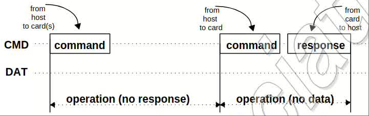

卡寻址是通过在初始化阶段用一个会话地址赋给卡来实现.
CMD/Response/Datablock 在第4章描述. 在SD总线上的基本传输是CMD/Response
传输. 这种类型的总线传输直接在CMD或Response结构中传输信息,而且一些操作
还带有数据令牌.

数据传入/来自SD卡是以块形式完成,如图[[img-dablktra]]所示. 数据块总是跟随
CRC位. 定义了单/多数据块操作. 注意, 多数据块有利于快速写操作. 一个多数
据块传输可以被紧跟在CMD线上的STOP命令终结.HOST端可以配置数据传输使用单
或多数据线.
#+caption: (多)块读操作
#+name: img-dablktra
#+attr_latex: :placement [H] :width 0.6\textwidth
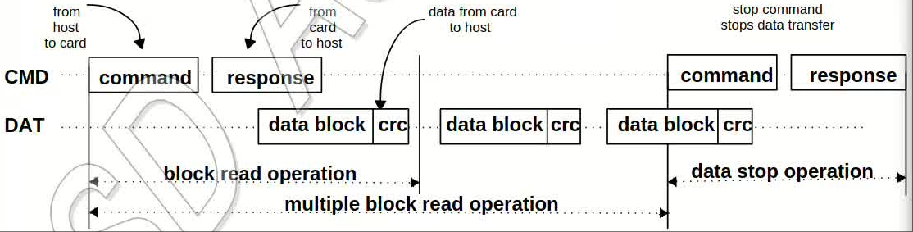

数据块写操作在DAT0数据线上的写期间使用一个简单的busy信号,如图
[[img-sdmultw]]所示,不管传输时使用了几根数据线.
#+caption: (多)块写操作
#+name: img-sdmultw
#+attr_latex: :placement [H] :width 0.6\textwidth
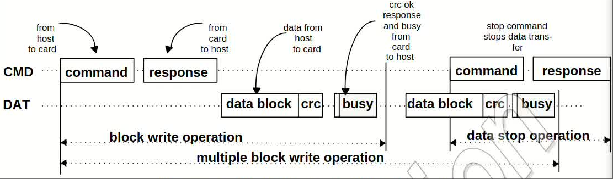

命令令牌的编码如下图[[img-cmdtkform]]所示.每个命令令牌由一个起始位(0)开始
以一个结束位(1)跟随. 总长度48位, 每个令牌由CRC位保护, 这样传输错误可以
被检测和传输重复.
#+caption: 命令令牌格式
#+name: img-cmdtkform
#+attr_latex: :placement [H] :width 0.6\textwidth
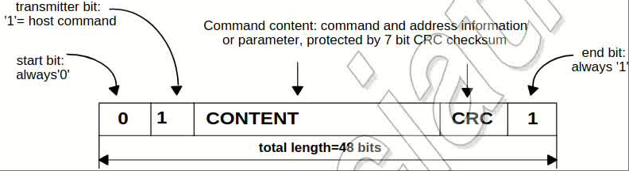

响应令牌有4种编码格式,依赖于它们的内容,如图[[img-respform]]所示. 长度48或
136位. 命令和响应的细节在后续章节描述. 响应的块数据保护CRC算法为16位的
CCITT多项式算法. 所有允许的CRC类型在后续章节描述,命令线上的传输都是以
MSB开始,以LSB结束.
#+caption: 响应令牌格式
#+name: img-respform
#+attr_latex: :placement [H] :width 0.6\textwidth
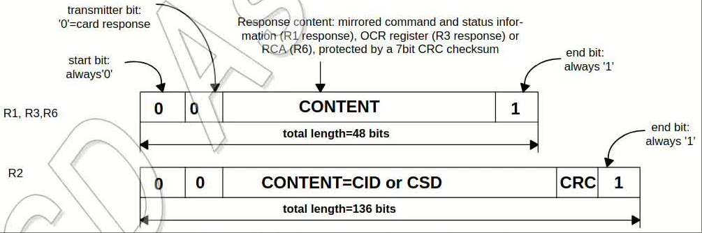

当Wide bus选项被使用, 数据一次传输4位,如图所示, 起始/结束/CRC位在每根
数据线上都会传输. 在每根单独的数据线上的CRC会被单独计算和校验. 而从卡
端发给主端的CRC校验响应和busy指示信号只在DAT0上传输(在这期间不关注
DAT1~DAT3).

对SD卡有2种类型的数据包格式.
- 常用数据(8位宽):这类数据先发LSB,后发MSB,但对于单字节,MSB先发,LSB后
  发,如图[[img-usualdaform]]所示.
  #+caption: 常用数据包格式
  #+name: img-usualdaform
  #+attr_latex: :placement [H] :width 0.6\textwidth
  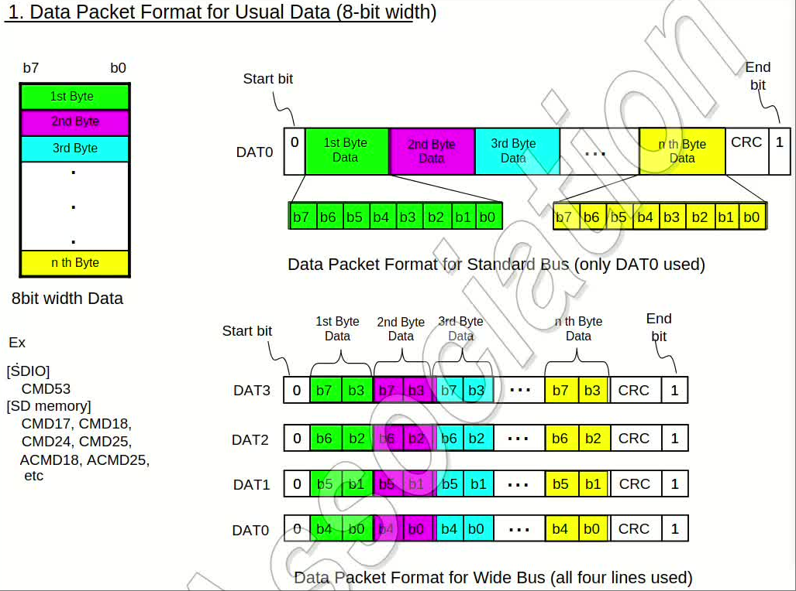
- 宽尺寸数据(SD寄存器数据): 这类数据从MSB开始往外传,如图
  [[img-widedatform]]所示.
  #+caption: 宽尺寸数据格式
  #+name: img-widedatform
  #+attr_latex: :placement [H] :width 0.6\textwidth
  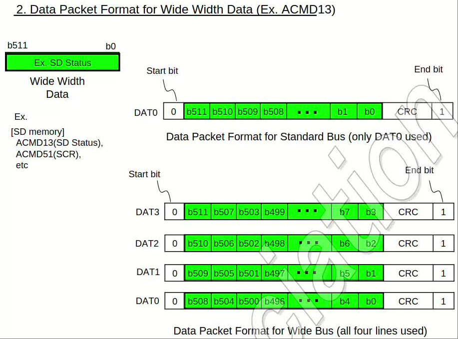
*** SPI总线协议
在后续章节做详细描述.
*** UHS-II总线协议
在UHS-II增编中详细描述.
*** PCIe/NVMe总线协议
在PCIe和NVMe规格书中描述.
* SD卡功能描述
** SD总线引脚分配
SD卡的构成因子是24mm*32mm*2.1mm或24mm*32mm*1.4mm.图[[img-sdshape]]展示了SD
卡的一般标准尺寸形状和接口触点.详细的物理尺寸和机械描述在Part1的机械增
编中给出. MicroSD和miniSD卡的物理尺寸和机械描述以及引脚分配在Part1的
microSD卡增编和Part1的miniSD卡增编中给出.
#+caption: SD卡形状和尺寸
#+name: img-sdshape
#+attr_latex: :placement [H] :width 0.6\textwidth
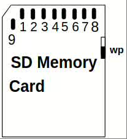

表[[tbl-sdcontact]]定义了卡触点.
#+caption: SD卡触点
#+name: tbl-sdcontact
#+attr_latex: :placement [H]
|-----+----------+--------------------+-----------+--------------------|
| Pin | Name(SD) | Description(SD)    | Name(SPI) | Description(SPI)   |
|-----+----------+--------------------+-----------+--------------------|
|-----+----------+--------------------+-----------+--------------------|
|   1 | CD/DAT3  | CardDetect/Dat3    | CS        | Chip Select        |
|   2 | CMD      | CMD/Response       | DI        | Data in            |
|   3 | VSS1     | Supply voltage GND | VSS       | Supply voltage GND |
|   4 | VDD      | Supply voltage     | VDD       | Supply voltage     |
|   5 | CLK      | Clock              | SCLK      | Clock              |
|   6 | VSS2     | Supply voltage GND | VSS2      | Supply voltage GND |
|   7 | DAT0     | Dat0               | DO        | Data Out           |
|   8 | DAT1     | Dat1               | RSV       |                    |
|   9 | DAT2     | Dat2               | RSV       |                    |
|-----+----------+--------------------+-----------+--------------------|
- 在上电时, DAT1~DAT3为输入. 在完成SET_BUS_WIDTH命令后他们才作为DAT数
  据线进行操作. 主端应该在他们没被使用时保持为输入.
- 对于Pin1, 在上电时,卡内部对这条线有一个50K欧姆的上拉电阻使能. 这个电
  阻有2个功能:卡检测和模式选择.
  + 对于模式选择, 主端可以驱动它为高或把它拉高来选择SD模式. 如果主端想
    选择SPI模式可以把它拉低.
  + 对于卡检测, 主端会检测到它被拉高,在数据传输时, 这个上拉应该由用户
    使用SET_CLR_CARD_DETECT(ACMD42)命令来断开连接.
- DAT1在SDIO模式下, 在所有没有用于数据传输操作期间可以用于卡的中断输出
  (Interrupt Output).
- DAT2在SDIO模式下, 可以被用于读等待信号(Read Wait signal).
  
    
每个卡都有一套寄存器信息,如表[[tbl-sdreg]]所示, SPI模式下,RCA寄存器不使用.
#+caption: SD卡寄存器
#+name: tbl-sdreg
#+attr_latex: :placement [H] :width 0.6\textwidth
|------+-------+----------------------------+-----|
| Name | Width | Description                | Set |
|------+-------+----------------------------+-----|
|------+-------+----------------------------+-----|
| CID  |   128 | 卡识别号                     | 强制 |
| RCA  |    16 | 卡相对地址(卡动态申请,主端批准) | 强制 |
| DSR  |    16 | 配置卡的输出驱动能力          | 可选 |
| CSD  |   128 | 包含卡操作的条件信息          | 强制 |
| SCR  |    64 | 包含卡特殊功能能力信息         | 强制 |
| OCR  |    32 | 操作条件寄存器                | 强制 |
| SSR  |   512 | SD状态寄存器,包含卡私有功能    | 强制 |
| CSR  |    32 | 卡状态信息                   | 强制 |
|------+-------+----------------------------+-----|

主端可以通过关闭再打开电源来复位卡. 每个卡应该有它自己的上电检测电路来
设置自己进入一个定义状态.不用显示的复位信号是必要的.卡也可以通过发送
GO_IDLE(CMD0)命令来复位.图[[img-sdarch]]是SD卡内部结构.
#+caption: SD卡内部架构
#+name: img-sdarch
#+attr_latex: :placement [H] :width 0.6\textwidth
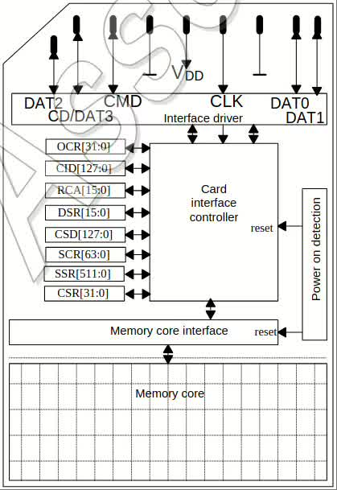
** UHS-II引脚分配
UHS-II卡形状和SD卡一致, 其接口分配里一些再第2行,在第1行也有一些,如图
[[img-uhsiiinf]]所示, 第一行的触点在非UHS-II模式下与表[[tbl-sdcontact]]等效.
#+caption: UHS-II卡形状和接口
#+name: img-uhsiiinf
#+attr_latex: :placement [H] :width 0.6\textwidth
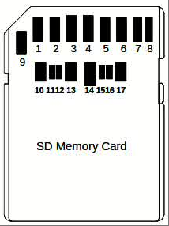

表[[tbl-uhsiipin]]定义了UHS-II的接脚.SD总线接脚Pin7和8用作RCLK差分脚.
#+caption: UHS-II接口触点
#+name: tbl-uhsiipin
#+attr_latex: :placement [H] :width 0.6\textwidth
|-----+-------+-------------------|
| Pin | Name  | Description       |
|-----+-------+-------------------|
|-----+-------+-------------------|
|   4 | VDD1  | 2.7V~3.6V         |
|   7 | RCLK+ | 时钟输入(差分信号)   |
|   8 | RCLK- | 时钟输入(差分信号)   |
|  10 | VSS3  | 地                 |
|  11 | D0+   | 默认输入线(差分信号) |
|  12 | D0-   | 默认输入线(差分信号) |
|  13 | VSS4  | 地                 |
|  14 | VDD2  | 1.7V~1.95V        |
|  15 | D1-   | 默认输出线(差分信号) |
|  16 | D1+   | 默认输出线(差分信号) |
|  17 | VSS5  | 地                 |
|-----+-------+-------------------|

UHS-II卡在UHS-II模式下不应该驱动没有用到的线. 主端不应该让这些没
有用到的线处于浮空状态, 而要把他们保持为确定的高或低状态, 具体的电平依
赖主端实现. 比如, 使用上拉电阻或主端驱动信号线到低电平.当DAT[1:0]用来
提供RCLK, 对CMD和DAT[3:2]信号线, 单独的线控要求使用上拉方法.CLK(没有上
拉电阻)应该被驱动到低.在进入Hibernate模式时, 在关闭VDD1前, 没有用到的
信号线应该被设置为低电平.
** 1-Lane SD Express引脚分配
SD Express卡形状和SD卡一样; PCIe/NVMe接口引脚分配在第二行,共享第一行的
一些触点, 如图[[img-1lanesd]]所示, 物理尺寸和机械机构在Part1机械结构增编中
给出.
#+caption: 1-Lane SD Express卡形状和接口
#+name: img-1lanesd
#+attr_latex: :placement [H] :width 0.6\textwidth
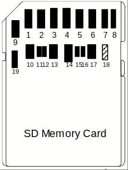
SD Express的microSD尺寸因子也有效, 引脚分配在Part1 microSD卡增编中给出.表
[[tbl-1lsdexpinf]]定义了支持PCIe 1 lane场景下的PCIe接口触点.SD Express卡应
该支持基本的SD接口,允许在非PCIe模式下操作卡. 第一行触点可以用于基本SD
模式(非PCIe模式)并且等效于表[[tbl-sdcontact]]. 注意, SD总线触点Pin7和8用于
PCIe接口的REFCLK并且触点Pin9和1用于CLKREQ和PERST.
#+caption: 1-Lane SD Express接口点分配
#+name: tbl-1lsdexpinf
#+attr_latex: :placement [H] :width 0.6\textwidth
|-----+----------+--------------------------------------------------|
| Pin | Name     | Description                                      |
|-----+----------+--------------------------------------------------|
|-----+----------+--------------------------------------------------|
|   1 | PERST    | PE-Reset是在PCIe Mini CEM规格中定义的给卡的功能性复位 |
|   4 | VDD1     | 2.7V~3.6V                                        |
|   7 | REFCLK+  | 时钟输入(差分信号)                                  |
|   8 | REFCLK-  | 时钟输入(差分信号)                                  |
|   9 | CLKREQ   | 参考时钟请求信号                                    |
|  10 | VSS3     | 地                                                |
|  11 | PCIe TX+ | 卡输入(差分信号)                                    |
|  12 | PCIe TX- | 卡输入(差分信号)                                    |
|  13 | VSS4     | 地                                                |
|  14 | VDD2     | 1.7V~1.95V                                       |
|  15 | PCIe RX+ | 卡输出(差分信号)                                    |
|  16 | PCIe RX- | 卡输出(差分信号)                                    |
|  17 | VSS5     | 地                                                |
|  18 | VDD3     | 1.14V~1.30V(可选)                                 |
|  19 | VDD1a    | 2.7V~3.6V                                        |
|-----+----------+--------------------------------------------------|
- 当卡支持VDD3时Pin18需要实现.VDD3为Standard Size SD Express卡保留;
- Pin19只用于兼容第8.00版本的Part 1物理层规格中的PCIe Gen4;

SD Express卡在PCIe模式下不应该驱动没用到的信号线.主端不应该让这些没用
到的信号线浮空, 要把他们保持为高或低电平. 如何保持信号线电平依赖于主端
实现. CLK(没有上拉电阻)应该驱动到低电平.

PCIe接口的带外信号的引脚功能(CLKREQ和PERST)在PCIe标准中定义. 如果这个
卡检测切换用到逻辑1到0,在卡被插入SD PCIe时被主端检测到, 当SD Express卡
拔除时从0到1转换.
** 2-Lane SD Express引脚分配
图[[img-2lanesd]]展示了2-Lane SD Express卡的形状,物理尺寸和机械细节在Part
1机械增编中给出.
#+caption: 2-Lane SD Express卡形状和接口
#+name: img-2lanesd
#+attr_latex: :placement [H] :width 0.6\textwidth
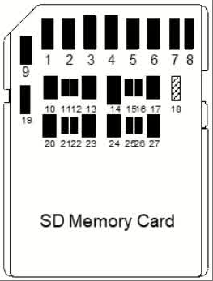

表[[tbl-2lsdexp]]定义了有PCIe 2-Lane的PCIe接口触点.
#+caption: 2-Lane SD Express接口触点
#+name: tbl-2lsdexp
#+attr_latex: :placement [H] :width 0.6\textwidth
|-----+-----------+--------------------------------------------------|
| Pin | Name      | Description                                      |
|-----+-----------+--------------------------------------------------|
|-----+-----------+--------------------------------------------------|
|   1 | PERST     | PE-Reset是在PCIe Mini CEM规格中定义的给卡的功能性复位 |
|   4 | VDD1      | 2.7V~3.6V                                        |
|   7 | REFCLK+   | 时钟输入(差分信号)                                  |
|   8 | REFCLK-   | 时钟输入(差分信号)                                  |
|   9 | CLKREQ    | 参考时钟请求信号                                    |
|  10 | VSS3      | 地                                                |
|  11 | PCIe TX0+ | 卡输入,Lane 0(差分信号)                             |
|  12 | PCIe TX0- | 卡输入,Lane 0(差分信号)                             |
|  13 | VSS4      | 地                                                |
|  14 | VDD2      | 1.7V~1.95V                                       |
|  15 | PCIe RX0- | 卡输出,Lane 0(差分信号)                             |
|  16 | PCIe RX0+ | 卡输出,Lane 0(差分信号)                             |
|  17 | VSS5      | 地                                                |
|  18 | VDD3      | 1.14V~1.30V(可选)                                 |
|  19 | VDD1a     | 2.7V~3.6V(强制)                                   |
|  20 | VSS6      | 地                                                |
|  21 | PCIe TX1+ | 卡输入, Lane 1(差分信号)                            |
|  22 | PCIe TX1- | 卡输入, Lane 1(差分信号)                            |
|  23 | VSS7      | 地                                                |
|  24 | VDD2a     | 1.7V~1.95V                                       |
|  25 | PCIe RX1- | 卡输出, Lane 1(差分信号)                            |
|  26 | PCIe RX1+ | 卡输出, Lane 1(差分信号)                            |
|  27 | VSS8      | 地                                                |
|-----+-----------+--------------------------------------------------|
- 当卡支持VDD3时Pin18需要实现, VDD3为Standard Size SD Express保留;
- Pin19和Pin24对于2-Lane SD Express卡是强制的.

在PCIe模式下SD 接口treatment,带外信号功能和卡检测对2-Lane SD Express卡
也可用.
** ROM卡
ROM卡被定义为只读存储卡,满足下列要求. 一个永久的或临时的写保护的SD卡不
属于这个范畴.
*** 寄存器设置要求
表[[tbl-romregset]]展示了ROM卡的寄存器设置要求.
#+caption: ROM卡的寄存器配置要求
#+name: tbl-romregset
#+attr_latex: :placement [H] :width 0.6\textwidth
|-----------+-----------------+---------+--------------|
| Register  | Field           |   Value | Comment      |
|-----------+-----------------+---------+--------------|
|-----------+-----------------+---------+--------------|
| SD Status | SD_CARD_TYPE    |   0001h | SD ROM 卡     |
|-----------+-----------------+---------+--------------|
|           | CCC bit4        |       0 | Class4 块写   |
|           | CCC bit5        |       0 | Class5 擦除   |
| CSD       | CCC bit6        |       0 | Class6 写保护 |
|           | CCC bit7        |     0或1 | Class7 锁卡   |
|           | PERM_WRITE_PROT |       1 | 永久写保护     |
|-----------+-----------------+---------+--------------|
| SCR       | SD_SECURITY     | 0/2/3/4 | 安全是可选的       |
|-----------+-----------------+---------+--------------|
*** 不支持的命令
ROM卡应该对待这些命令为不支持或非法:CMD24/25/27/28/29/30/32/33/38.
*** 可选命令
ROM卡可选支持如下命令: CMD42, 安全类命令.
- 如果不支持CMD42, CCC的bit7应该被设置为0. CMD42按非法命令对待.
- 当ROM卡支持CMD42, "解锁卡"和"锁卡"功能通过预设密码予以支持. 当接收到
  其他不支持的CMD42功能, 用LOCK_UNLOCK_FAILED来指示.
- 如果不支持安全功能, SD_SECURITY应该设置为0. 安全类命令被当作非法指令
  对待.
- ROM卡不支持对保护区的写和擦. 
*** WP切换
一个全尺寸的ROM卡没有WP切换功能. 
** 超高速卡I(UHS-I)
UHS-I使用4-bit SD总线的单端驱动接口可以提供104MB/s的性能. 卡的格式尺寸
相同, 现有的连接器可以使用.
*** UHS-I卡操作模式
- DS默认速度模式: 默认速度达到25MHz, 3.3V信号电压;
- HS高速模式: 高速模式达到50MHz, 3.3V信号电压;
- SDR12: SDR达到25MHz, 1.8V信号电压;
- SDR25: SDR达到50MHz, 1.8V信号电压;
- SDR50: SDR达到100MHz, 1.8V信号电压;
- SDR104: SDR达到208MHz, 1.8V信号电压;
- DDR50: DDR达到50MHz, 1.8V信号电压;

注意:1.8V信号电压下时序和3.3V不同.
*** UHS-I卡类型
UHS-I支持如下2类卡, UHS-I不能用于SDSC但是可以被用于SDHC/SDXC/SDUC卡.
- UHS50;
- UHS104

图[[img-sduhsicardtype]]和图[[img-sduhsicardtypethr]]展示了UHS-I支持的模式.
DDR50对microSD尺寸格式是强制的,对Standard size SD尺寸是可选的.
#+caption: UHS-I卡类型操作模式vs频率范围
#+name: img-sduhsicardtype
#+attr_latex: :placement [H] :width 0.6\textwidth
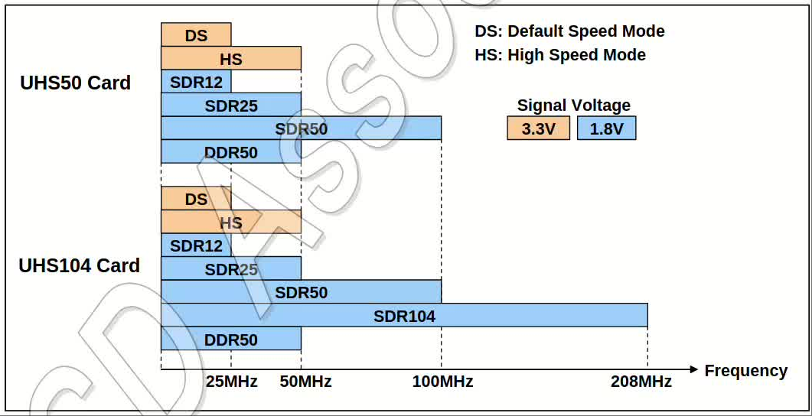

#+caption: UHS-I卡类型操作模式vs吞吐
#+name: img-sduhsicardtypethr
#+attr_latex: :placement [H] :width 0.6\textwidth
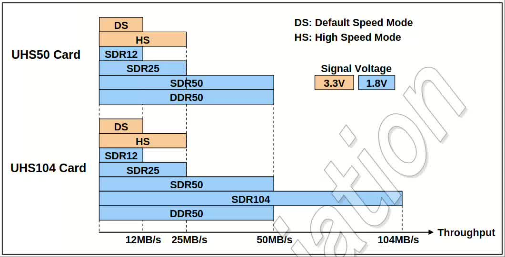
*** UHS-I主和卡结合
主端可以使用SDR50/DDR50/SDR104模式接UHS50/UHS104卡.表[[tbl-uhsihc]]展示了
依赖于主和卡结合情况下的可用UHS性能. 对可卸载的UHS-I卡一条SD总线连接一
张卡. 只有在主支持SDR104模式且是UHS104卡(支持SDR104模式)情况下,最大性
能达到104MB/s是可能的. 如果卡是UHS50卡或如果主不支持SDR104模式,性能限
制到50MB/s(SDR104模式不能使用).主接microSD尺寸格式的UHS50卡/UHS104卡可
以使用DDR50模式,主端类型有.
- SDR-FD: SDR信号, 固定延迟(不能使用tuning);
- SDR-VD: SDR信号, 可变延迟(可以使用tuning);
- DDR: DDR信号;

#+caption: UHS-I主端和卡结合
#+name: tbl-uhsihc
#+attr_latex: :placement [H] :width 0.6\textwidth
|-------------------------+---------------+-----------------------+---------------|
|                         | HOST-SDR-FD   | HOST-SDR-VD           | HOST-DDR(DDR) |
|-------------------------+---------------+-----------------------+---------------|
| UHS50 card microSD      | SDR50<=100MHz | SDR50<=100MHz+tuning  | DDR50<=50MHz  |
| UHS104 card microSD     | SDR50<=100MHz | SDR104<=208MHz+tuning | DDR50<=50MHz  |
| UHS50 card fullsize SD  | SDR50<=100MHz | SDR50<=100MHz+tuning  | Option        |
| UHS104 card fullsize SD | SDR50<=100MHz | SDR104<=208MHz+tuning | Option        |
|-------------------------+---------------+-----------------------+---------------|
*** UHS-I总线速度模式选择命令序列
图[[img-uhsicmdseq]]展示了使用UHS-I的命令序列. 重新上电后, 卡处于3.3V信号
模式.第一条CMD0选择总线模式(SD/SPI模式). 1.8V信号电压模式只能在SD模式
进入. 一旦卡进入1.8V信号模式, 没有再重新上电,卡就不能切换到SPI模式或
3.3V信号模式. 如果卡接受了CMD0,卡就进入Idle态,但是仍然工作在SDR12时序
下. UHS-I只在工作在SD模式,不支持SPI模式.
#+caption: UHS-I的命令序列
#+name: img-uhsicmdseq
#+attr_latex: :placement [H] :width 0.6\textwidth
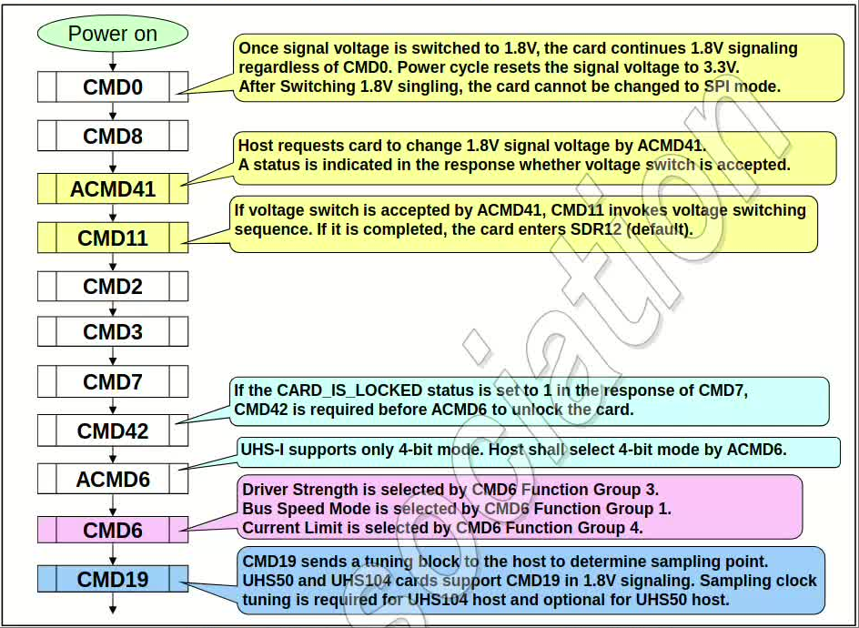

因为高总线速度需要低信号电压, UHS-I在SDR50/DDR50/SDR104下采用1.8V信号
模式.而且卡通过主端提供的3.3V工作, SDCLK/CMD/DAT[3:0]上的1.8V信号电压
转换自这个3.3V电源线. 为了避免主端和卡端电压失配, 在初始化阶段信号电压
通过Switch命令序列进行切换. 不管主端和卡端是否支持1.8V信号模式, 都可以
使用ACMD41. 支持1.8V信号, 则主端和卡端都意味着可以使用UHS-I.

CMD11命令用于调用电压切换序列. 卡进入UHS-I模式,并且卡的输入输出时序在
电压切换命令序列成功执行后进行切换(默认切换到SDR12).

除了CMD42, 在UHS-I下只支持4-bit总线模式. 如果卡锁了, 主端需要在1-bit模
式下使用CMD42解锁,然后发送ACMD6来切换到4-bit总线模式.

主端可以使用CMD6 Function Group3选择合适的输出驱动能力, 可以使用CMD6
Function Group1选择一个UHS-I模式. 每个UHS-I模式由这些条件确定:最大通信
频率/采样边沿(单沿or双沿)/最大功耗. 主端选择某个UHS-I模式,依赖于这些条
件: 产生SDCLK频率的能力/主端提供的功耗能力.

CMD19在卡没有锁时,可以在1.8V信号电压下在tranfer状态下执行.其他情况
下,CMD19会被看作非法命令.
*** UHS-I系统框图
图[[img-uhsiisysdiag]]展示了典型的UHS-I主端系统,它支持卡片插拔.主端有个时
钟发生器,用于给卡提供SDCLK时钟.在写操作场景下, 因为时钟方向和数据方向
相同, 写数据的传输可以和SDCLK同步,尽管传输线上有延迟. 在读场景下,时钟
方向和数据方向相反, 主端收到的读数据被round-trip延迟/输出延迟/主端卡端
的latency,所以对于主端接收数据是很关键的. 因此, 主端需要有Sampling
Clock Generator来接收响应/CRC状态/读的块数据. 
#+caption: UHS-I主和卡系统图
#+name: img-uhsiisysdiag
#+attr_latex: :placement [H] :width 0.6\textwidth
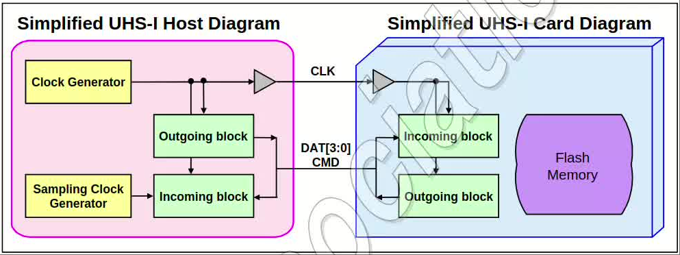
**** 可变采样主端
主端使用可变的Sampling Clock Generator来决定正确的采样点. 主端可以用卡
里面存的预定以的tuning块数据作为找寻正确采样点的辅助. 主端可以用CMD19
tuning命令来读取tuning数据块.这个方法可以在整个频率范围使用. 在低于
25MHz的低频时, 主端访问卡不需要tuning操作.
**** 固定采样主端
主端使用预制的采样点. 这个方法在小于100MHz可用. HOST-SDR-FD可以通过时
钟回环方法来决定采样时钟. UHS50和UHS104卡在低于100MHz频率范围应该符合
t_{ODLY}输出延迟约束.
*** UHS-I卡总线速度小结
表格[[tbl-uhsibusspd]]展示了基于CMD6 function group1选出来的BusSpeedMode的
一些卡要求.
#+caption: UHS-I卡总线速度模式
#+name: tbl-uhsibusspd
#+attr_latex: :placement [H]
|--------------+----------+----------+--------+----------+----------+-----------|
| BusSpeedMode | MaxBus   | MaxClock | Signal | MaxPower | MaxPower |  MaxPower |
|              | Speed    | Freq     |        | SDSC     |     SDHC | SDXC/SDUC |
|--------------+----------+----------+--------+----------+----------+-----------|
|--------------+----------+----------+--------+----------+----------+-----------|
| SDR104       | 104MB/s  | 208MHz   | 1.8V   | -        |     2.88 |      2.88 |
| SDR50        | 50MHz    | 100MHz   | 1.8V   | -        |     1.44 |      1.44 |
| DDR50        | 50MB/s   | 50MHz    | 1.8V   | -        |     1.44 |      1.44 |
| SDR25        | 25MB/s   | 50MHz    | 1.8V   | -        |     0.72 |      0.72 |
| SDR12        | 12.5MB/s | 25MHz    | 1.8V   | -        |     0.36 | 0.36/0.54 |
| HighSpeed    | 25MB/s   | 50MHz    | 3.3V   | 0.72     |     0.72 |      0.72 |
| DefaultSpeed | 12.5MB/s | 25MHz    | 3.3V   | 0.36     |     0.36 | 0.36/0.54 |
|--------------+----------+----------+--------+----------+----------+-----------|
- 支持UHS-I模式的卡应该支持所有的lower UHS-I模式.
- 主端可以用CMD6的PowerLimit功能控制功耗;

表[[tbl-busspdom]]澄清了每个卡容量类型的可选(O)/强制(M)总线速度模式.

#+caption: 总线速度模式的可选和强制
#+name: tbl-busspdom
#+attr_latex: :placement [H] 
|----------------------+----+----+-------+--------+--------------------------|
| Card Class           | DS | HS | SDR50 | SDR104 | DDR50                    |
|----------------------+----+----+-------+--------+--------------------------|
|----------------------+----+----+-------+--------+--------------------------|
| SDSC                 | M  | O  | NA    | NA     | NA                       |
|----------------------+----+----+-------+--------+--------------------------|
| SDHC(Non UHS-I)      | M  | O  | NA    | NA     | NA                       |
| SDHC(UHS50)          | M  | M  | M     | NA     | O(StandardSD)/M(microSD) |
| SDHC(UHS104)         | M  | M  | M     | M      | O(StandardSD)/M(microSD) |
|----------------------+----+----+-------+--------+--------------------------|
| SDXC/SDUC(Non UHS-I) | M  | O  | NA    | NA     | NA                       |
| SDXC/SDUC(UHS50)     | M  | M  | M     | NA     | O(StandardSD)/M(microSD) |
| SDXC/SDUC(UHS104)    | M  | M  | M     | M      | O(StandardSD)/M(microSD) |
|----------------------+----+----+-------+--------+--------------------------|
** 超高速卡II(UHS-II)
*** UHS-II卡操作模式
SD总线接口模式
- DS默认速度模式: 3.3V信号电压, 频率到25MHz可达12.5MB/s;
- HS高速模式: 3.3V信号电压, 频率到50MHz可达25MB/s;
- SDR12: UHS-I 1.8V信号电压, 频率到25MHz可达12.5MB/s;
- SDR25: UHS-I 1.8V信号电压, 频率到50MHz可达25MB/s;
- SDR50: UHS-I 1.8V信号电压, 频率到100MHz可达50MB/s;
- SDR104: UHS-I 1.8V信号电压, 频率到208MHz可达104MB/s;
- DDR50: UHS-I 1.8V信号电压, 频率到50MHz可达50MB/s, 双边沿采样;

UHS-II接口模式
- FD156: 全双工模式, 频率到52MHz可达156MB/s(范围B);
- HD312: 半双工, 2Lane频率52MHz可达312MB/s(范围B),可选的;
- FD312: 全双工模式, 频率到52MHz可达312MB/s(范围C);
- FD624: 全双工模式, 频率到52MHz可达624MB/s(范围D);
*** UHS-II卡类型
UHS-II支持2类卡.UHS-II卡的性能是基于全双工模式因为HD312是可选的,综合见
图[[img-sduhsiiitfspd]]所示.
- UHS156: UHS-II卡在FD156模式下数据速率可达1.56Gbps,在HD312模式下可达312Gbps;
- UHS624: UHS-II卡在FD624模式下数据率可达6.24Gbps.

#+caption: UHS-II卡接口速度
#+name: img-sduhsiiitfspd
#+attr_latex: :placement [H] :width 0.6\textwidth
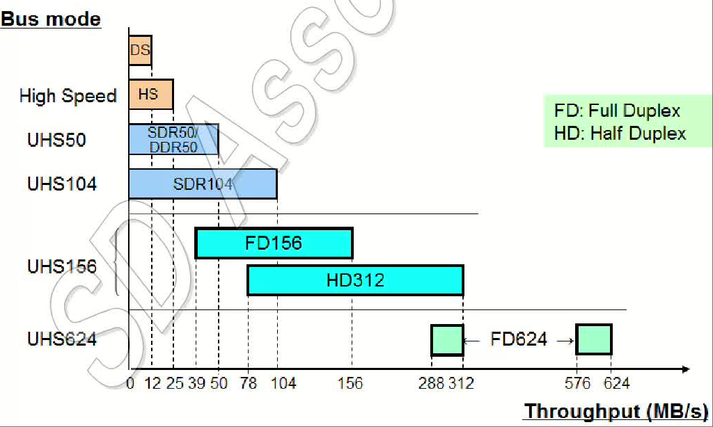
*** UHS-II卡主端和卡结合
UHS-II卡主端和卡结合如表[[tbl-uhsiimc]]所示, 横轴为主端类型,纵轴为卡类型.
#+caption: UHS-II主和卡结合
#+name: tbl-uhsiimc
#+attr_latex: :placement [H] 
|-----------------+------------+------------+------------+-------------|
|                 | UHS-II     | UHS-II     | UHS-II     | UHS-II      |
|                 | FD156      | HD312      | FD624      | HD312&FD624 |
|-----------------+------------+------------+------------+-------------|
| UHS156          | <=1.56Gbps | <=1.56Gbps | <=1.56Gbps | <=1.56Gbps  |
| (no HD312)      |            |            |            |             |
|-----------------+------------+------------+------------+-------------|
| UHS156          | <=1.56Gbps | <=3.12Gbps | <=1.56Gbps | <=3.12Gbps  |
| (HD312 support) |            |            |            |             |
|-----------------+------------+------------+------------+-------------|
| UHS624          | <=1.56Gbps | <=1.56Gbps | <=6.24Gbps | <=6.24Gbps  |
| (no HD312)      |            |            |            |             |
|-----------------+------------+------------+------------+-------------|
| UHS624          | <=1.56Gbps | <=3.12Gbps | <=6.24Gbps | <=6.24Gbps  |
| (HD312 support) |            |            |            |             |
|-----------------+------------+------------+------------+-------------|
*** UHS-II卡接口选择命令序列
支持UHS-II的主端应该支持传统的SD总线接口和UHS-II接口如图
[[img-sditfdetect]]所示. 可移除的UHS-II卡槽应该两种接口都连接.然后UHS-II卡
可能不仅在UH-II模式下还在SD总线模式下初始化.
#+caption: UHS-II接口检测
#+name: img-sditfdetect
#+attr_latex: :placement [H] :width 0.6\textwidth
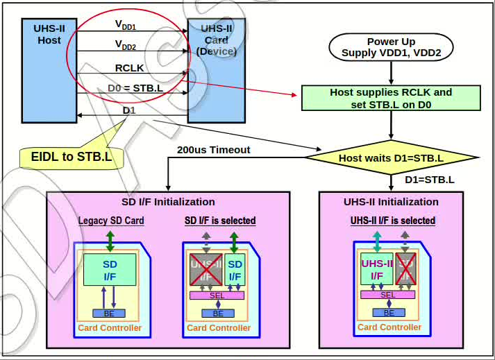

图[[img-sditfdetect]]展示了如何选择UHS-II模式. 上电后, UHS-II卡的SD总线接
口和UHS-II总线接口都是使能的. UHS-II支持主端提供RCLK和走D0 Lane的
STB.L. 主端等待D1 Lane将EIDL变为STB.L.如果在D1 Lane上检测到STB.L, 主端
就开始做UHS-II初始化. 如果D1 Lane超过200us没有改变到STB.L, 主端应该把
卡初始化为SD总线模式. 因为200us的STB.L检测是对每张卡进行, 主端需要基于
UHS-II总线拓扑图来决定需要的总的时间.  

图[[img-sduhsiiinitseq]]展示了对UHS-II卡进行的UHS-II初始化命令序列.
- 第一步:是PHY初始化. PLL激活并同步. 完成PHY初始化周期前, SD总线被禁能.
- 第二步:是设备初始化. 设备的后端功能初始化.
- 第三步:是枚举, 4-bit的唯一设备ID被分配给每个设备, 这样能通过设备ID选
  择设备.
- 第四步:是配置
- 第五步:是SD-TRAN初始化. UHS-II通过SD-TRAN仿造SD命令. SD-TRAN初始化等
  效于SD总线初始化, 但是主端使用UHS-II包格式发送SD命令.UHS-II卡接受大
  多数SD命令除了一些特殊命令. 后续章节有UHS-II下SD命令的差异. 如果收到
  CMD0命令, UHS-II卡从SD-TRAN初始化重新开始.

  
#+caption: UHS-II接口初始化
#+name: img-sduhsiiinitseq
#+attr_latex: :placement [H] :width 0.6\textwidth
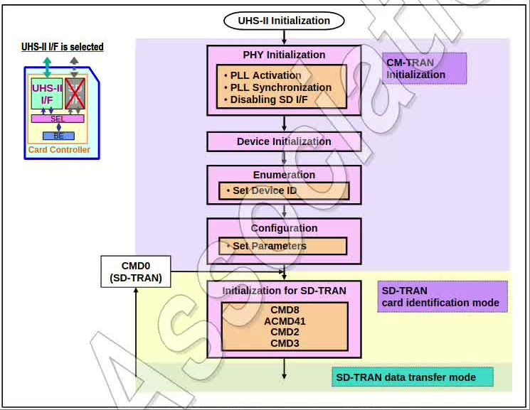

图[[img-sduhsiideact]]展示了UHS-II卡的SD总线模式初始化序列. UHS卡在执行
ACMD41完成前应该禁能UHS-II接口. 如果UHS-II卡在SD接口初始化期间, 提供了
VDD2, 主端应该继续提供VDD2. SD接口开始初始化前, VDD2可以通过重启VDD1来
关闭. 在检测到非UHS-II卡时, 主端可以在任何时候关闭VDD2.
#+caption: UHS-II接口去激活
#+name: img-sduhsiideact
#+attr_latex: :placement [H] :width 0.6\textwidth
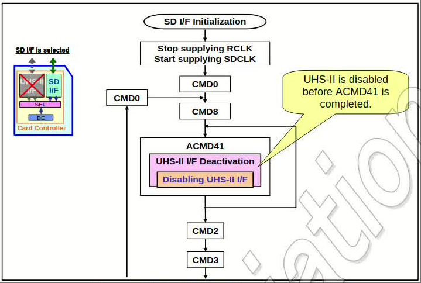
*** UHS-II卡总线速度小结
#+caption: UHS-II卡总线速度小结
#+name: img-sduhsiibusspd
#+attr_latex: :placement [H] :width 0.6\textwidth
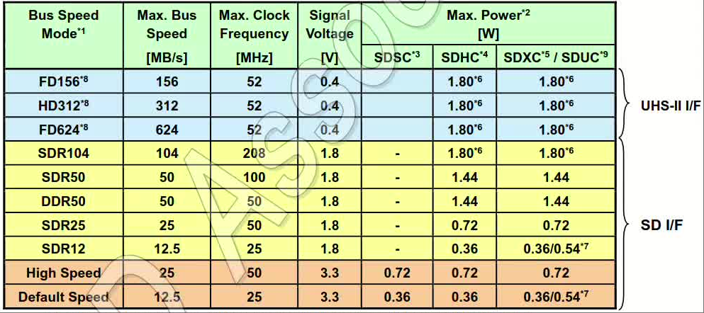
- 支持UHS-I模式的卡应该支持更lower UHS-I模式;
- 主端可以通过CMD6的PowerLimitFunction控制卡的功耗;
- 可移除卡的最大功耗是1.8W,嵌入式卡是2.88W.
- 主端在UHS-II模式下最小功耗要求是0.72W,从PHY初始化时就可以用.

  
表[[img-sdbusspdom]]展示了卡类型和支持的总线速度模式. 建议UHS-II的主端支持
UHS-I模式(至少SDR50)来提供对UHS-I卡的后向兼容.
#+caption: UHS-II总线速度模式的可选和强制
#+name: img-sdbusspdom
#+attr_latex: :placement [H] :width 0.6\textwidth
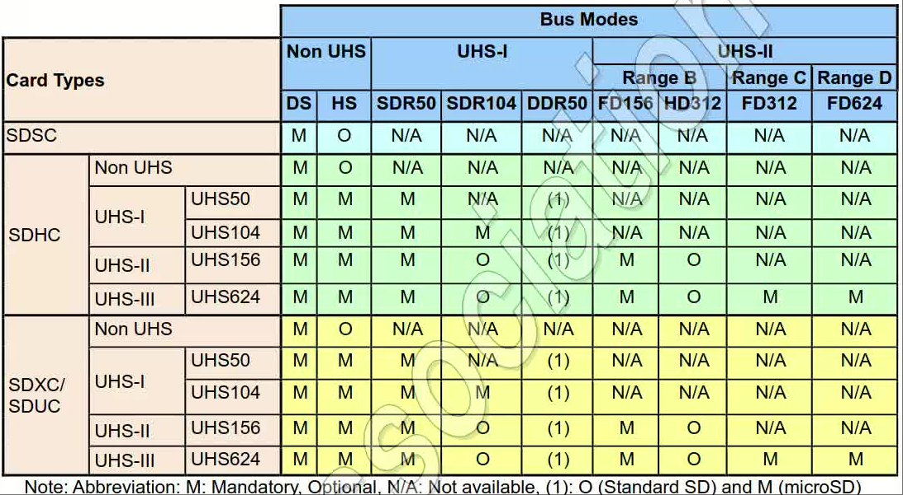
** 应用性能分类
这个规格定义了应用性能类别指示在特定前置条件下卡的最小随机的和持续的性能.
- 应用性能类别1含义
  + 最小卡随机性能是写:500IOPS和读1500IOPS;
  + 最小持续写性能是10MB/s;
- 应用性能类别2含义
  + 最小卡随机性能是写:2000IOPS和读4000IOPS,使用命令队列和Cache特性;
  + 最小持续写性能是10MB(使用命令队列)和Cache特性.

注意随机性能单位[IOPS]指1秒完成的4KB大小I/O操作的数量, 在每个事务中是
用的是256MB地址范围内产生的随机地址.
** Cache
Cache特性通过让卡将主端数据直接接到更快的存储器. 使能了主端Cache应该要
意识到如果Cache里面的内容在下电前没有flush, 可能产生数据丢失.   
** 自管理
自管理方法允许卡内部后台做数据管理, 而主端应该意识到卡会做那些操作然后
做对应的支持. 自管理可以改进卡性能.
** 命令队列
命令队列方法允许主端在数据传输期间提交任务命令. 自主命令队列允许卡重排
任务并且执行由主端基于卡端提供的任务就绪态来触发的任务. 在串行命令队列
模式下,任务按顺序执行.
** 低电压(LV)接口
低电压接口是在1.8V IO模式下使能卡片h初始化,而不是在传统的3.3V IO模式下.
表[[tbl-lvitfbuspd]]给出了卡类型和低电压接口下支持的总线速度模式.
#+caption: 低电压接口总线速度模式可选和强制
#+name: tbl-lvitfbuspd
#+attr_latex: :placement [H] 
|-----------------+-----+----+----+-------+-------+-------+--------+-------+-------+-------+-------|
| Card Class      | SPI | DS | HS | SDR12 | SDR25 | SDR50 | SDR104 | DDR50 | FD156 | HD312 | FD624 |
|-----------------+-----+----+----+-------+-------+-------+--------+-------+-------+-------+-------|
|-----------------+-----+----+----+-------+-------+-------+--------+-------+-------+-------+-------|
| SDHC-LV50       | M   | M  | M  | M     | M     | M     | NA     | ref   | NA    | NA    | NA    |
| SDHC-LV104      | M   | M  | M  | M     | M     | M     | M      | ref   | NA    | NA    | NA    |
| SDHC-LV156      | M   | M  | M  | M     | M     | M     | O      | ref   | M     | O     | NA    |
| SDHC-LV624      | M   | M  | M  | M     | M     | M     | O      | ref   | M     | O     | M     |
|-----------------+-----+----+----+-------+-------+-------+--------+-------+-------+-------+-------|
| SDXC/SDUC-LV50  | M   | M  | M  | M     | M     | M     | NA     | ref   | NA    | NA    | NA    |
| SDXC/SDUC-LV104 | M   | M  | M  | M     | M     | M     | M      | ref   | NA    | NA    | NA    |
| SDXC/SDUC-LV156 | M   | M  | M  | M     | M     | M     | O      | ref   | M     | O     | NA    |
| SDXC/SDUC-LV624 | M   | M  | M  | M     | M     | M     | O      | ref   | M     | O     | M     |
|-----------------+-----+----+----+-------+-------+-------+--------+-------+-------+-------+-------|
** UHS-II高总线速度(UHS-III)
从版本6.00的物理层协议中, 增强的UHS-II总线速度模式,如FD624是新引入的.
FD624最大总线速度是624MB/s."UHS-II"和"UHS-III"代表卡类型, 在UHS-II增编
中规定. UHS-II卡支持Range A和Range B. UHS-III卡支持Range A到Range D.
** SD Express卡类型
SD Express卡在UHS-I模式/PCIe/NVMe接口下支持基本的SD接口. SD Express卡
支持要么PCIe Gen3或Gen4接口,带PCI-SIG定义的要么1Lane或2Lane. 由于空间
有限, 一个有限的必要数量的带外信号适配到PCI-Standard中的SD
Express. PCIe Gen3支持的bit率达8Gbps, 允许每个方向使用128/130编码达到
985MB/s(1Lane)或1969MB/s(2Lane). 另外, PCIe Gen4支持bit率达到16Gbps,允
许每个方向达到1969MB/s(1Lane)或3938MB/s(2Lane),如图[[img-sdeitfspd]]所示.
在PCIe通道上,用到了NVMExpress协议 .
#+caption: SD Express卡接口速度
#+name: img-sdeitfspd
#+attr_latex: :placement [H] :width 0.6\textwidth
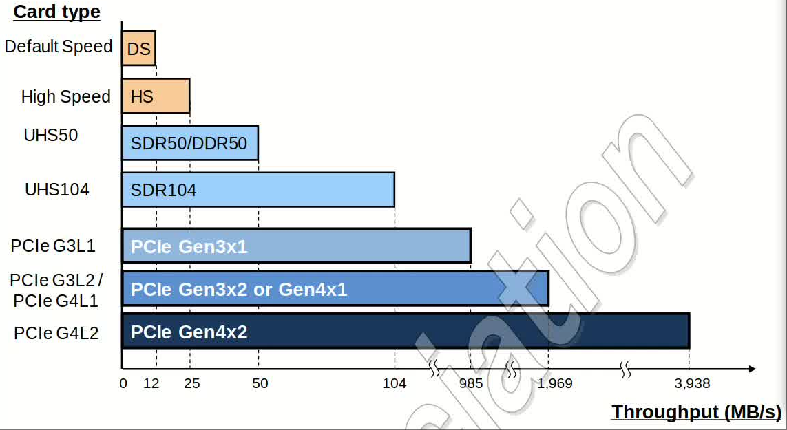

SD Express卡可以支持下面的PCIe接口模式, 表[[tbl-sdecardtype]]定义了SD
Express卡类型和对应需要支持的的PCIe 接口模式.
- Gen3x1: 使用PCIe Generation3, 1Lane;
- Gen3x2: 使用PCIe Generation3, 2Lane;
- Gen4x1: 使用PCIe Generation4, 1Lane;
- Gen4x2: 使用PCIe Generation4, 2Lane;

#+caption: SD Express卡卡类型
#+name: tbl-sdecardtype
#+attr_latex: :placement [H]
|-----------+-----------------------------|
| Card Type | PCIe Interface Mode         |
|-----------+-----------------------------|
|-----------+-----------------------------|
| PCIe G3L1 | Gen3x1                      |
| PCIe G3L2 | Gen3x1,Gen3x2               |
| PCIe G4L1 | Gen3x1,Gen4x1               |
| PCIe G4L2 | Gen3x1,Gen3x2,Gen4x1,Gen4x2 |
|-----------+-----------------------------|
*** SD Express主端和卡结合
表[[tbl-sdehccomb]]是SD Express主端和卡端组合搭配的速率表.横轴是主端类型,
纵轴是卡端类型.
#+caption: SD Express主端和卡结合
#+name: tbl-sdehccomb
#+attr_latex: :placement [H] 
|------------+---------+----------+-----------------+-------------------|
|            | SD      | SD       | SD              | SD                |
|            | (UHS50) | (UHS104) | (UHS-II)        | Express           |
|------------+---------+----------+-----------------+-------------------|
|------------+---------+----------+-----------------+-------------------|
| SD-UHS50   | 50MB/s  | 50MB/s   | 50MB/s          | 50MB/s            |
| SD-UHS104  | 50MB/s  | 104MB/s  | 104MB/s         | 104MB/s           |
| SD-UHS-II  | 50MB/s  | 104MB/s  | ref [[tbl-uhsiimc]] | 104MB/s           |
| SD-Express | 50MB/s  | 104MB/s  | 104MB/s         | ref [[tbl-sdedetail]] |
|------------+---------+----------+-----------------+-------------------|

#+caption: SD Express主端和卡结合(细节)
#+name: tbl-sdedetail
#+attr_latex: :placement [H] 
|-----------+------------+------------+------------+------------|
|           | SD Express | SD Express | SD Express | SD Express |
|           | Gen3x1     | Gen3x2     | Gen4x1     | Gen4x2     |
|-----------+------------+------------+------------+------------|
|-----------+------------+------------+------------+------------|
| PCIe G3L1 | 985MB/s    | 985MB/s    | 985MB/s    | 985MB/s    |
| PCIe G3L2 | 985MB/s    | 1969MB/s   | 985MB/s    | 1969MB/s   |
| PCIe G4L1 | 985MB/s    | 985MB/s    | 1969MB/s   | 1969MB/s   |
| PCIe G4L2 | 985MB/s    | 1969MB/s   | 1969MB/s   | 3938MB/s   |
|-----------+------------+------------+------------+------------|
*** SD Express接口选择和初始化序列
SD Express卡要么在PCIe模式或SD总线模式下初始化. 高度建议通过传统SD总线
来初始化,允许主端用一个简单的方法来检测卡端的兼容性和对PCIe的支持, 并
且切换PCIe.

*** SD Express卡总线速度小结
** 非CPRM卡特性
** Boot功能
** TCG安全
** RPMB
* SD卡功能描述
** 概览
** 卡识别模式
*** 卡复位
*** 操作条件验证
*** 卡初始化和识别过程
**** 初始化命令(ACMD41)
*** 总线信号电压切换序列
**** UHS-I初始化序列
**** 信号电压切换时序
**** 电压切换错误检测时序
**** 电压切换命令
**** Tuning命令
**** UHS-I系统框图示例
** 数据传输模式
*** 总线宽度选择/去选择
**** 2G字节卡
*** 数据读
*** 数据写
*** 擦除/弃(Discard)/FULE
**** 擦除
**** 弃(Discard)
**** 用户区逻辑全擦(FULE)
*** 写保护管理
*** 卡锁/解锁操作
**** 概览
**** 卡归属保护
**** 锁/解锁特别术语
**** 卡行为
**** 锁卡数据结构
**** COP/非COP卡命令序列
**** 卡归属保护流程图
*** CMD42的参数和结果
*** 强制擦除
**** 强制擦除
**** FEP强制擦除
**** 锁卡的强制擦除功能
*** ACMD6和锁/解锁状态的关系
*** 锁卡可接受的命令
**** 卡命令操作细节
**** 扩展命令的特定规则
*** 三类锁/解锁卡
** 内容保护
** 应用特定的命令
*** APP_CMD(CMD55)
*** GEN_CMD(CMD56)
** 切换功能命令
*** 概览
*** Mode0操作-检查功能
*** Mode1操作-设置功能
*** 切换功能状态
*** CMD6数据和其他命令的关系
*** 切换功能流程图
*** 检查示例
*** 切换示例
** 高速模式(25MB/s接口速度)
** 命令系统
** 发送接口条件命令(CMD8)
** 卡容量类型中命令的差异
* 时钟控制
* CRC
* 命令
* 卡状态转换表
* 响应
* SD卡3种状态信息
* 错误条件
* 卡寄存器
* SD卡硬件接口
* SPI模式
* 附件
