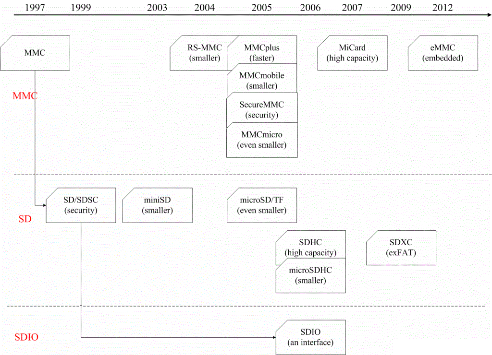
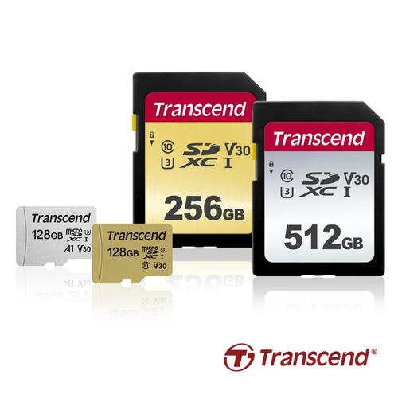
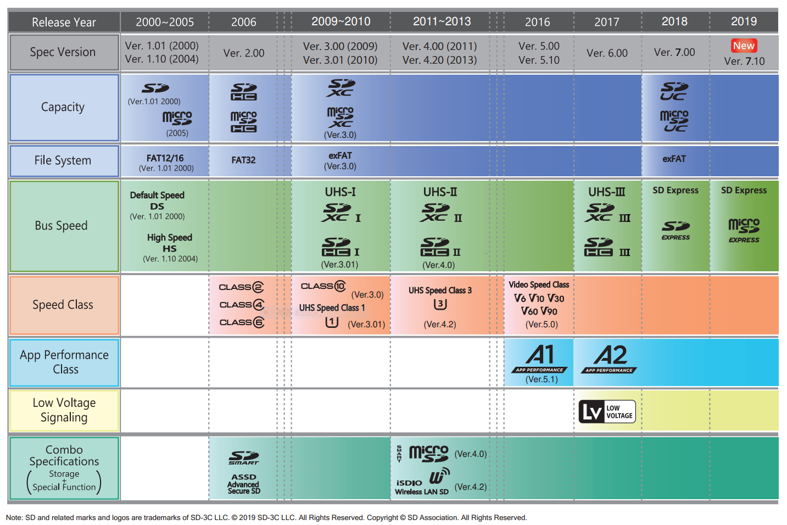
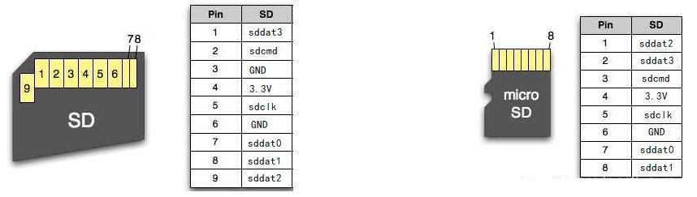
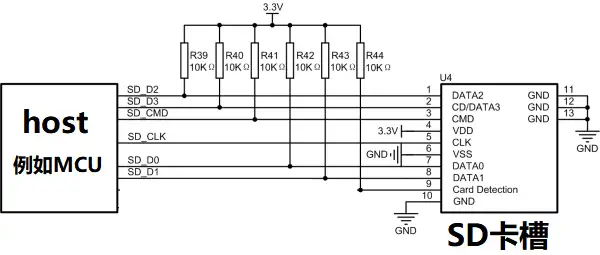
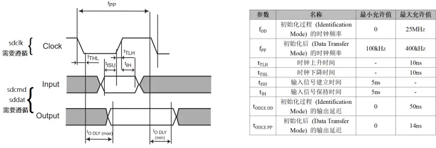
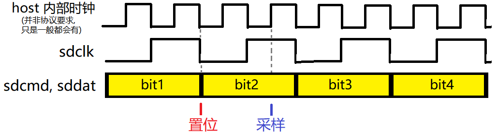

#+title: SDMMC梳理
# #+subtitle: 
#+author: Joe
#+latex_class: org-latex-pdf 
#+toc: tables 
#+toc: listings 
#+latex: \clearpage\pagenumbering{arabic} 
#+latex: \AddToShipoutPicture{\BackgroundPicture} 
#+options: h:4 ^:{} 
#+startup: overview

MMC是MultiMedia Card的简称，从本质上看，它是一种用于固态非易失性存储的
内存卡规范，定义了诸如卡的形态、尺寸、容量、电气信号、和主机之间的通信
协议等内容。

从1997年MMC规范发布至今，基于不同的考量,如物理尺寸、电压范围、管脚数量、
最大容量、数据位宽、Clock频率、安全特性、是否支持SPI Mode、是否支持DDR
Mode等，进化出了MMC、SD、Micro SD、SDIO、eMMC等不同的规范,如图
[[img-sdmmc-hist]]所示；
#+caption: SDMMC发展
#+name: img-sdmmc-hist
#+attr_latex: :placement [H] :width 0.6\textwidth

SD卡基于MMC发展而来，二者最初的外观尺寸也很类似，SD卡比MMC卡厚0.7mm。
早期SD卡对MMC卡的兼容性较强，多数支持SD卡插槽的设备都可以同时支持MMC卡，
反之只有MMC卡插槽的设备不能够支持SD卡。随着MMC卡和 SD卡的发展竞争，二
者之间的差异越来越大，走向了截然不同的发展方向。发展到今天， MMC卡基本
退出了历史舞台，转而走向了嵌入式领域，推出了eMMC（embedded MMC） 标准，
在嵌入式存储方面应用广泛。SD卡在移动存储卡领域的地位越发稳固，不断向大
容量和高速度方向发展，推出了一系列接口标准，目前最新的理论传输速率已达
985MB/s。从二者目前的发展趋势看，eMMC正在被更先进的UFS技术标准取代，SD
的发展前景似乎更为广阔。
* MMC
MMC卡的全称是MultiMedia Card，中文翻译为“多媒体卡”。MMC卡的设计目标是
提供一种“广泛应用于电子玩具、PDA、照相机、智能手机、数字录音机、MP3播
放器、寻呼机等等领域”的通用低成本数据存储和通信媒体。
** MMC 1.x/2.x版本阶段
从目前可检索到的MMC技术文档来看，MMC初始1.0版本的Spec在1996年就已经制
定完成，1997年推出相关产品。从1.0到2.0版本的发展阶段在1996-2000年，该
阶段MMC卡的形态及技术规格没有大的变化，主要是一些内部功能性的演进。这
个阶段MMC卡的主要特性：
- 从目前可检索到的MMC技术文档来看，MMC初始1.0版本的Spec在1996年就已经
  制定完成，1997年推出相关产品。从1.0到2.0版本的发展阶段在1996-2000年，
  该阶段MMC卡的形态及技术规格没有大的变化，主要是一些内部功能性的演进。
  这个阶段MMC卡的主要特性：
  + Size：24mmx32mmx1.4mm；
  + Pins：7pins；
  + Bus Width：1bit；
  + Bus Mode：MMC mode& SPI mode；
  + Voltage：2.7-3.6V；
  + Clock：0–20MHz；
** MMC v3.x版本阶段
*** v3.0
v3.0版本是MMC发展历史上一个重要的版本，该版本相对于1.0/2.0版本有重大变
化。
*** v3.1
但是由于v3.0版本在内部寄存器定义中有严重错误，v3.0版本很快被更新为
v3.1，并且v3.0版本被废弃。v3.1版本新增了两个重要特性：
- 引入Low Voltage规格，支持1.65-1.95V工作电压；
- 增加multiple block read/write特性，提升性能；
*** v3.3 
v3.3版本也是一个重要的版本，该版本新增RS-MMC（Reduced Size MMC）规格，
制定24mm x 18mm x 1.4mm尺寸规格，将MMC 卡的大小减少近一半。RS-MMC只是
物理尺寸的定义，硬件接口没有变化。
** MMC v4.x版本阶段
v4.x系列版本从2004年开始发布，v4.x是MMC最为流行的版本，也是目前为止持
续时间最长的版本，从2004年v4.1发布到2013 v5.0 发布共持续了9年。其间，
JEDEC（Joint Electron Device Engineering Council电子元件工业联合会）
采用MMC4.1标准作为JEDEC的闪存卡标准；随后MMCA（Multi Media Card
Association快闪记忆卡标准组织）正式并入JEDEC，MMC标准由JEDEC主导推进。
目前，从JEDEC官方站点可以下载到的MMC最早版本为v4.1，其直接继承自MMCA的
MMC v4.1版本。
*** MMC v4.1版本
鉴于之前版本的MMC卡性能较差，v4.1版本增加了以下重要的特性以提升性能并
做到向后兼容：
- 工作频率支持三种模式：0-20MHz、0-26MHz、0-52MHz；
- Bus Width支持三种模式：1/4/8bits；
- 定义了最低性能标准：2.4MB/s；
- 向后兼容v3.x版本MMC（1 bit data bus，multicard systems）；
- MMC mode只支持one card per MMC bus;
- SPI mode支持MMC Chip Select Signal，可实现multiple cards per MMC bus；
  提升MMC卡的存储容量；
  

符合v4.1版本规格的MMC卡称为HS MMC（High Speed MMC），由于bus width变化，
所以HS MMC卡的接口增加了6pins，变成 13pins。v4.1版本对市场上的MMC产品
进行了明确的划分，定义了两种MMC卡类型：MMC plus和MMC mobile，只有符合
相应规格的卡片才能使用 MMC plus或MMC mobile logo。MMC plus 和 MMC
mobile应用于不同的使用场景，均向后兼容v3.x 20MHz clock的工作模式.
- MMC plus规格：
  + size：24mmx32mmx1.4mm，全尺寸；
  + Voltage：2.7-3.6V；
  + Pins：13pins；
  + Bus width：1/4/8bits；
  + Bus Mode：MMC mode & SPI mode；
  + Clock：26MHz（52MHz可选）；
  + Performance：不低于2.4MB/s；
- MMC mobile规格：
  + Size：24mmx18mmx1.4mm，符合RS-MMC标准；
  + Voltage：2.7-3.6V/1.65-1.95V，支持Low Voltage模式；
  + Pins：13pins；
  + Bus width：1/4/8bits；
  + Bus Mode：MMC mode & SPI mode；
  + Clock：26MHz（52MHz可选）；
  + Performance：不低于2.4MB/s；
- MMC mirco规格：Samsung于2004年底发布了一款MMC mirco卡，该卡不同于MMC
  Spec中定义的MMC plus和MMC mobile规格，其尺寸降低至：12mm x 14mm x
  1.1mm，大概为RS-MMC的1/3。MMC micro 是Samsung发布的第三方规格，初期
  并没有收录到MMC标准中，依靠Samsung自身的影响力及其轻巧的尺寸占有一定
  的市场地位。

随后，MMCA协会也正式发布了MMCmicro的技术规范。在2005年6月底于瑞士苏黎
世举行的MMCA夏季大会上，MMCA全体参会成员一致同意将MMC micro卡确立为
MMCA新一代标准。继2004年底MMCA发布MMC plus卡和MMC mobile卡之后，全新的
微小尺寸的MMC micro卡可谓是MMC技术的新一代标准。
*** MMC v4.2版本
v4.1版本定义的寻址方式为Byte寻址，理论上可以支持最大容量为4GB。v4.2版
本增加了sector寻址模式，每个sector为512Byte，小于2GB容量的卡采用Byte寻
址模式，大于2GB容量的卡采用sector 寻址模式。同时v4.2版本将Low Voltage
工作电压范围修改为1.7-1.95V。
*** MMC v4.3版本
v4.3版本也是MMC发展史上一个具有里程碑式意义的版本，该版本引入了eMMC规
格定义，支持eMMC boot启动功能，进入嵌入式领域。重新定义了CID寄存器的格
式，以区分Device是eMMC还是MMC卡。虽然MMC Spec并没有正式收录MMC micro卡
的规格，但是在v4.3 Spec还是增加定义了MMC micro的 signal input
capacitance（信号输入电容标准）。

*** MMC v4.4x版本
v4.4版本一个重要的改动是加入了DDR（Dual Data Rate）模式，即信号的双边
采样，在clock的上升沿和下降沿都会采样一次数据。DDR mode将理论传输速率
提升了一倍，达到104MB/s。v4.4版本还新增了RPMB（Replay Protected Memory
Block）功能，用于实现数据的加密读写。RPMB主要用于系统一些关键私密的数
据的存储。接下来的v4.41版本主要增加了Background Operations 和 High
Priority Interrupt两个可选的功能，不强制要求实现。
- Background Operations:赋予MMC/eMMC执行后台操作的能力；
- High Priority Interrupt:允许MMC/eMMC的某些命令执行允许被更高优先级的
  任务中断；
*** eMMC v4.5x版本
v4.5版本是MMC发展史上另一个里程碑式的版本，该版本封面正式移除了MMCA的
logo，只保留了JEDEC的logo，MMCA退出历史舞台。同时v4.5版本移除了MMC卡的
支持，只保留eMMC的规格定义，MMC卡也退出了历史舞台，进入了eMMC标准时代。

v4.5版本其他重要的改进包括：
- 增加HS200 mode，将工作频率提高到200MHz，理论传输速率可达200MB/s；
- 增加Cache功能，进一步提升eMMC的性能；
** eMMC v5.x 版本阶段
该阶段eMMC的发展的主要方向在于提升性能。2013年发布的v5.0版本增加了
HS400 mode，在HS200的基础上增加DDR mode（信号双边采样），将理论传输速
率提升至400MB/s。

2015年发布的v5.1版本增加了Command Queue功能，优化eMMC内部的操作效率，
提升eMMC整体性能。v5.1版本同时发布了一个Command Queue Host Controller
Interface（CQHCI）标准，用于Host端实现Command Queue硬件支持的设计标准。
另外v5.1版本新增了HS400ES mode，在HS400 mode的基础上提高了CMD Responce
接收到可靠性。
** 小结
MMC发展到今天，只剩下嵌入式应用的eMMC标准，但是在2015年v5.1版本发布后，
已经有4年没有更新标准了。eMMC如果想进一步提升性能，就需要采用更高频率
的clock，对于eMMC使用的并行接口而言，可能会遇到信号完整性等方面的瓶颈。

2016年JEDEC发布的UFS存储标准采用差分串行总线取代了eMMC的并行接口，可以
达到远超eMMC的性能，有替代eMMC的趋势。目前在高端手持移动设备领域，UFS
正在逐步替代eMMC；在车机、低成本/低端的手持设备以及其他一些嵌入式设备
中，eMMC还占有较高的应用比例。eMMC和UFS目前都是JEDEC在维护开发，不存在
竞争关系，从现状看，eMMC再推出革命性的版本升级的可能性不大。因此，可以
猜测未来的发展趋势：eMMC可能会逐步被UFS取代，成为过时的技术；eMMC也会
长期存在于一些低成本或对存储性能要求不高的设备上。
* SD
SD（Secure Digital Memory Card）卡是在MMC卡基础上发展起来的，中文名
称为：安全数字存储卡。SD卡发布之初，与MMC卡的最大区别就在安全Secure上，
其支持SDMI标准，可提供保护SD卡上存储的音乐版权等功能。SD卡于1999年开发
研制，Panasonic、Sandisk和Toshiba于2000年成立了SDA（SD Association）
协会主导SD卡的标准制定。到目前为止，SD卡的标准已经发展到v7.0，在移动存
储卡领域已经占据主导性地位。
** v1.xx版本阶段
v1.xx版本阶段从2000年开始，持续到2006年v2.xx版本发布。也许是受益于后发
优势，SD卡在初始v1.00版本就支持了双电压操作模式和1/4bits bus width，上
市之初其被市场接纳程度就超过同期的MMC卡。SD卡初始发布的v1.00版本规格的
主要特性有：
- Size：24mm x 32mm x 2.1mm（Normal）/24mm x 32mm x 1.4mm（Thin）;
- Pins：9pins;
- Bus Width：1/4bits;
- Bus Mode：SD mode & SPI mode;
- Voltage：2.0 - 3.6V/1.6 - 3.6V;
- Clock：0 – 25MHz;
- Performance：10MB/s;

为了应对RS-MMC的市场竞争，2003年由SanDisk率先推出了miniSD，尺寸为：
21.5mm x 20mm x 1.4mm，号称当时最小尺寸的Nand存储卡。SD卡和MMC卡在竞
争中向前发展，2004年发布的SD v1.10版本的主要竞争对手是MMC v4.x标准。

SD v1.10引入了High Speed mode，将Clock频率提升到0-50MHz，最大理论性能
为25MB/s，兼容MMC v2.11标准。同时推出TransFlash Card，又称T-Flash 或者
TF卡，后来统一为microSD卡。microSD的尺寸只有：11mm x15mm x1mm。至此，
SD的物理尺寸一共有三种：SD、miniSD、microSD，在后来的市场筛选中只保留
了SD和mircoSD两种标准，也就是现在可以买到的两种SD卡,如图[[img-sdtype]]所示;
#+caption: SD卡类型
#+name: img-sdtype
#+attr_latex: :placement [H] :width 0.6\textwidth

** v2.xx版本阶段
SD卡和MMC卡类似，在三个方向发展进化：速度，容量，尺寸。v1.xx版本阶段，
SD卡的尺寸规格已基本定型，2006年推出的v2.00标准将SD卡的容量扩展到32GB，
将SD卡容量分为SD/SDHC两种规格：
- SD：Standard Capacity SD Memory Card，指2GB及以下容量的SD卡；
- SDHC：High Capacity SD Memory Card，指2GB – 32GB容量的SD卡；
** v3.xx版本阶段
2009年开始发布的v3.xx版本是SD卡发展历史上很重要的一个阶段，虽然现在SD
卡标准已发展到v7.xx，但是v3.xx依然非常流行。v3.xx在v2.xx版本的基础上有
如下重大更新：
- 新增SDXC容量标准，SDXC规格的SD卡容量为32GB – 2TB；
- 引入UHS-I（Ultra High Speed）总线标准，将Clock提升到208MHz，最高理论
  传输速率为104MB/s；
  

到v3.xx版本，SD卡基本分类：
- 容量：SD（0-2GB），SDHC（2 - 32GB），SDXC（32GB – 2TB）；
- 速度：Default（0 - 25MHz），High Speed mode（0-50MHz），
  UHS-I（0-208MHz）；
  
** v4.xx版本阶段
从v3.xx版本到v4.xx版本，可以算作SD卡发展到一个分水岭。在v3.xx版本，SD
卡支持的Bus规格都是4bits宽度的并行总线，最高工作频率达到208MHz，理论传
输速率可达104MB/s。和eMMC遇到的问题一样，v3.xx版本的SD标准想进一步提高
传输速率的话，4bits的并行总线会成为其阻力。因此v4.xx版本引入了UHS-II
mode，该mode使用了低电压串行差分总线技术，将理论传输速率提升至312MB/s，
支持全双工模式，单路理论速率为1.56Gbps。
** 快速发展阶段
v4.20版本之后，SD标准进入了一个快速发展阶段，图[[img-sdhist]]中这张SD技术
演进图可以很好地展示其发展脉络；
#+caption: SD卡历史
#+name: img-sdhist
#+attr_latex: :placement [H] :width 0.6\textwidth

- v5.xx版本统一了SD卡容量和速度的分类规范；
- v6.xx版本引入了新的速度模式，UHS-III，将理论传输速率提升至524MB/s；
- v7.xx版本在速度和容量都有升级，推出了SDUC容量规格，总线传输支持PCIe，
  理论传输速率提升到940MB/s；
** 小结
从SD标准的技术发展现状和市场现有的SD卡产品来看，标准的制定已经远远领先
于产品技术的发展。当下SD卡的发展方向无非就是更大的容量和更快的速度，这
两个发展方向都依赖于固态存储的技术进步。SD标准已经将传输管道做得足够粗，
接下来就看各SD卡厂商如何填满这个粗管道，有效利用其传输性能。

* SDIO
SDIO是在SD卡接口的基础上发展起来的外设接口，SDIO接口兼容以前的SD卡，并
且可以连接SDIO接口的设备，目前根据SDIO协议的SPEC，SDIO接口支持的设备总
类有WIFI、Bluetooth、GPS等等。

** SDIO总线引脚定义
SDIO是Host(主机)和SDIO接口设备(比如SD卡)之间的通信总线，包括6根信号，
这些信号的电平标准为3.3V, 如表[[tbl-sdline]]所示;
#+caption: SDIO 总线定义
#+attr_latex: :placement [H]
#+name: tbl-sdline
|--------+------------------------------------------+-------------|
| 名称    | 方向                                      | 描述         |
|--------+------------------------------------------+-------------|
|--------+------------------------------------------+-------------|
| SDCMD  | 当发起命令时Host输出；当响应时SDIO接口设备输出 | 传输命令和响应 |
| SDCLK  | 由主机产生                                 | 时钟信号      |
| SDDAT0 | 当写数据时Host输出；当读数据时SDIO接口设备输出 | Dataline0   |
| SDDAT1 | 当写数据时Host输出；当读数据时SDIO接口设备输出 | Dataline1   |
| SDDAT2 | 当写数据时Host输出；当读数据时SDIO接口设备输出 | Dataline2   |
| SDDAT3 | 当写数据时Host输出；当读数据时SDIO接口设备输出 | Dataline3   |
|--------+------------------------------------------+-------------|

图[[img-sddiff]]展示了SD卡和microSD卡的SDIO信号定义。SD卡（9个引脚）和
microSD卡（8个引脚）除了外形尺寸外，功能上没有差别。
#+caption: SD类型差别
#+attr_latex: :placement [H] :width 0.6\textwidth
#+name: img-sddiff

图[[img-sdconn]]是SD卡接口电路设计示意图。其中sdcmd和sddat0~3是双向信号，
需要通过电阻上拉到3.3V。当Host和SD卡都不驱动时，这些信号为弱上拉的高电
平。除了SDIO的6根信号外，SD卡还需要3.3V的电源供电。
#+caption: SD连接线
#+attr_latex: :placement [H] :width 0.6\textwidth
#+name: img-sdconn

** 信号时序
SDIO是同步总线，信号（sdcmd, sddat）的置位和采样都要和时钟（sdclk）同
步，每个时钟周期中的每个信号可以传输1bit，需要满足一定的时序来保证信号
的接收端能够正确的采样数据。SD2.0版本（SD和SDHC，它们都遵循SD2.0协议）
规范规定SD卡需要满足如图[[img-sdsignal]]时序；
#+caption: SD信号图
#+name: img-sdsignal
#+attr_latex: :placement [H] :width 0.6\textwidth

*** 时钟要求
初始化操作是通过向 card 发送一个命令序列来实现的, 对于时钟 （sdclk）：
- 在SD卡初始化过程中，时钟频率最低是100kHz（周期10000ns），最高不能超
  过400kHz（周期2500ns）；
- 初始化完成后，时钟频率最低不限，最高不能超过25MHz（周期40ns）;
- 时钟的上升和下降时间不能超过10ns；
*** Host2SD卡时序要求
sdcmd和sddat都是双向信号，在两个方向上都要满足上面图中的时序要求。当SD
卡输入时Host2SD卡，例如Host通过sdcmd发送命令给SD卡，这些信号会在sdclk
的上升沿被输入端采样。建立时间tISU和保持时间tIH的最小要求5ns ，换句话
说，上升沿之前5ns到之后5ns这段时间之间要让信号稳定下来，避免SD采到不稳
定的数据。考虑到时钟周期最小为40ns ，从下降沿到上升沿之间有20ns的时间，
我们可以让Host在下降沿置位（更新）数据，很容易满足这个要求。
*** SD2Host时序要求
当SD卡输出时(SD2Host，例如SD卡通过sdcmd发送响应给Host)，这些信号会在
sdclk的下降沿被更新。此时需要分别考虑初始化前后两种情况：
- 在初始化过程中，SD卡端的输出延迟tODLY,OD（从时钟下降沿到信号稳定）
  最大为50ns。考虑到在初始化过程中的时钟周期最小为2500ns ，从下降沿到
  上升沿之间有1250ns的时间，因此可以让Host在时钟上升沿采样数据，可以采
  样到稳定的数据。
- 在初始化后，SD卡端的输出延迟tODLY,PP最大为14ns。考虑到此时的时钟周期
  最小为40ns，从下降沿到上升沿只有20ns的时间，我们讨论Host的采样时机的
  3种方案：
  + Host在下降沿后的上升沿采样数据，则建立时间只有20-14=6ns。考虑到从
    Host到SD卡一个来回的走线延迟（Host发出时钟下降沿到SD卡收到时钟下降
    沿并更新信号到更新的信号传回Host），6ns的时间可能不够宽裕；
  + Host在下降沿后的下一个下降沿采样数据，则建立时间有40-14=26ns，非
    常宽裕。但有可能违反Host采样所需的保持时间(取决于Host IO的保持时
    间要求)，虽然一般来讲违反的概率不大；
  + 如果Host内部有一个比sdclk更快的时钟（一般是整个Host控制器的驱动时
    钟)，可以在上升沿到下降沿的中点采样数据，则建立时间有30-14=16ns，
    比较宽裕，同时保证保持时间不被违反,如图[[img-hosttiming]]所示；
    #+caption: Host时序要求
    #+name: img-hosttiming
    #+attr_latex: :placement [H] :width 0.6\textwidth
    

为了满足SDIO总线的时序，Host输出时应该在sdclk的下降沿将信号（sdcmd,
sddat）置位。Host输入时应该在sdclk的下降沿采样（SD卡置位的下降沿的下
一个下降沿）；或者在上升沿到下降沿的中点采样(SD卡置位的下降沿的下一个
上升沿到下一个下降沿)。

