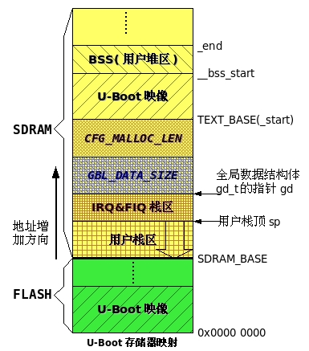
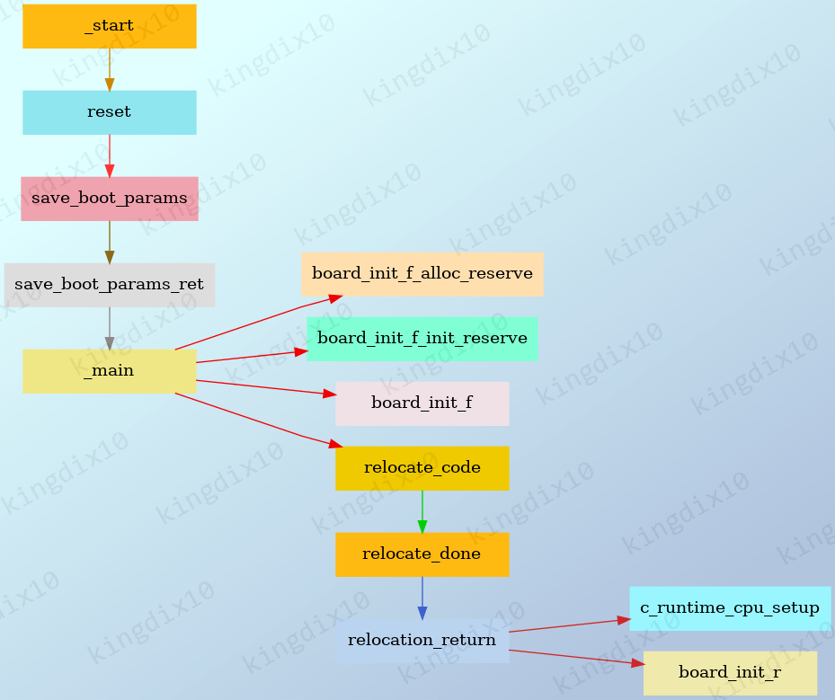
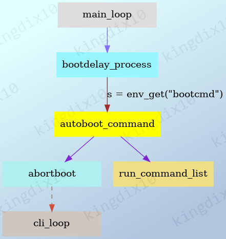
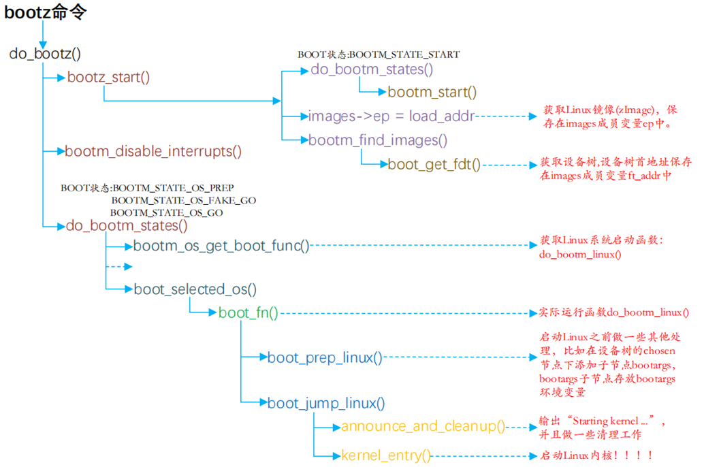
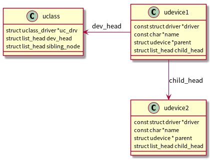
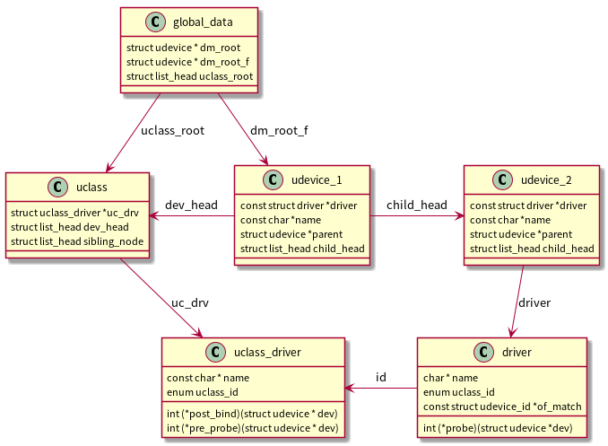

#+title: U-Boot分析
# #+subtitle: 
#+author: Joe
#+latex_class: org-latex-pdf 
#+toc: tables 
#+toc: listings 
#+latex: \clearpage\pagenumbering{arabic} 
#+latex: \AddToShipoutPicture{\BackgroundPicture} 
#+options: h:4 ^:{} 
#+startup: overview
* 工具
** 交叉编译工具链
- arm-none-eabi-xxx
** 调试工具GDB
*** GDB用法
- 适配器：JLink(Ubuntu版本)
- GDB Server： JLinkGDBServerCLExe。
  #+begin_src shell
    JLinkGDBServerCLExe -device CORTEX-A9 -if JTAG
  #+end_src
- GDB：arm-none-eabi-gdb
  #+begin_src shell
    arm-none-eabi-gdb -i=mi u-boot 	# u-boot is a elf file
  #+end_src
*** GDB命令
+ 连接Server：src_sh[[:exports code]]{target remote localhost:2331} 
+ 加载u-boot：load，此时pc被设置为entry地址，可以进行调试运行，注意
  u-boot是带调试信息的elf，而u-boot.elf不带调试信息没法进行调试；
+ file: 加载镜像，包括符号表；src_sh[:exports code]{file u-boot};
+ symbol-file：
  1. 删除加载的镜像：src_sh[:exports code]{symbol-file};
  2. 加载镜像，而且解析符号地址时统一使用relocaddr基准：
     src_sh[:exports code]{add-symbol-file u-boot relocaddr}，
     relocaddr在gd_t的全局数据结构中;
+ restore: 在gdb环境下，该指令可以把文件写入某个地址，如把dtb写入地址
  0x200000, src_sh[:exports code]{restore dtb_xxx binary 0x200000}.其
  中地址0x200000可以用gdb导入的符号表符号代替；
+ print: 可以输出符号表符号的值，如下，其中$引用寄存器r9的值；
  src_sh[:exports code]{p ((gd_t*)$r9)->dm_root}
  1. p $regname: 打印某个寄存器的值；
+ i registers: 打印输出core的寄存器值
  1. i all-registers: 打印的寄存器范围更广
  2. i registers x1: 打印出某个寄存器的值；
+ set print pretty on：格式化打印
+ set remotelogfile remote.log: remote server的日志记录到文件
+ set breakpoint auto-hw on：断点自动设置为硬件断点
+ set debug remote 1：设置调试日志级别
** Term工具
*** 普通串口
#+begin_src shell
  M-x serial-term
  Device: /dev/ttyACM0
  Speed: 115200
#+end_src
*** 网络串口
#+begin_src shell
  # 1. socat安装
  apt install socat
  # 2. 在终端中转发网络串口到本地/tmp/ttyNET0
  socat pty,link=/tmp/ttyNET0,rawer tcp:192.168.1.100:8080
  # 3. 使用serial-term连接ttyNET0
#+end_src
* 设备树
device tree 分2种。
- 文本型的dt，解析起来比较慢，读写友好；
- 二进制型的fdt，解析传输较快，读写不友好
** DTS&DTSI

DTS文件是一个树状结构
- 结构上由node和properties构成；
- 每个node都有1个parent node（除了根node）；
- 每个node包含若干properties，由key-value对构成；

DTSI文件类似c语言的头文件，可以被其他dts/dtsi文件包含；
#+begin_src c -n 1
  #address-cells = <1>;
  #size-cells = <1>;

  aliases {
      ethernet0 = &fec1;
      i2c = &i2c1;
  };

  i2c1: i2c@30a20000 {
      #address-cells = <1>;
      #size-cells = <0>;
      compatible = "fsl,imx8mm-i2c", "fsl,imx21-i2c";
      reg = <0x0 0x30a20000 0x0 0x10000>;
      interrupts = <GIC_SPI 35 IRQ_TYPE_LEVEL_HIGH>;
      clocks = <&clk IMX8MM_CLK_I2C1_ROOT>;
      status = "disabled";//没有激活
  };

  //对label i2c1的引用
  &i2c1 {
      clock-frequency = <400000>;
      pinctrl-names = "default";
      pinctrl-0 = <&pinctrl_i2c1>;//对label pinctrl_i2c1的引用
      status = "okay";//激活
      pmic: bd71837@4b {//孩子node，表示pmic挂载i2c总线上
          reg = <0x4b>;//i2c总线设备地址
          compatible = "rohm,bd71840", "rohm,bd71837";
          //PMIC BD71837 PMIC_nINT GPIO1_IO3
          pinctrl-0 = <&pinctrl_pmic>;
          gpio_intr = <&gpio1 3 GPIO_ACTIVE_LOW>;
          gpo {
              rohm,drv = <0x0C>;
          };
      };
  };
#+end_src

dts文件可以通过dtc程序转换为dtb格式的二进制文件，命令为
src_sh[:exports code]{make dtbs}。DTC的源代码位于内核的scripts/dtc⽬录
中，在Linux内核使能了设备树的情况下，编译内核的时候主机⼯具DTC会被编译
出来，对应于scripts/dtc/Makefile中“hostprogs-y：=dtc”这⼀hostprogs的编
译⽬标。当然，DTC也可以在Ubuntu中单独安装，命令为
src_sh[:exports code]{sudo apt-get install device-tree-compiler}。

DTC也可以“反汇编”.dtb⽂件为.dts⽂件，其指令格式如下。
src_sh[:exports code]{dtc -I dtb -O dts -o xxx.dts xxx.dtb}.

*** 节点Node
例如上面一个node。
- 标签label：如i2c1，标签可以在其他地方用来引用该node；
- 节点名称node name：如i2c@30a20000，节点名称必须唯一，如果该node没有
  地址，可以不包含地址部分，name使用“ofnode_get_name”读取；

  
特殊节点
- aliases：用于u-boot或kernel中使用1个简短的名字来引用完整的节点路径，
  但是在dts文件内部不能用它来引用节点（使用的是label来引用）；
- chosen：
- clocks：
- firmware：
  
*** 属性Property
property是key-value对，其中key是由1到31个字符构成，value可以取值如下。
- 空值empty value：此时只有key，表示该key是一个bool属性（true/false）；
- 字符串string value：如status；
- 字符串列表string list：如compatible，每个value值由逗号“,”隔开；
- 属性组cell property array：如上面的reg、gpio_intr，由“<...>”构成；
- 二进制数据binary data：如address=[00 1A F1 01 04 15]，由“[...]”构成；

具体的属性值，可以由API 读取“ofnode_get_property()”。
#+begin_src c -n 1 
  /{
      compatible = "acme,coyotes-revenge";
      #address-cells = <1>;
      #size-cells = <1>;
      interrupt-parent = <&intc>;

      cpus {
          #address-cells = <1>;
          #size-cells = <0>;
          cpu@0 {
              compatible = "arm,cortex-a9";
              reg = <0>;
          };
          cpu@1 {
              compatible = "arm,cortex-a9";
              reg = <1>;
          };
      };

      serial@101f0000 {
          compatible = "arm,pl011";
          reg = <0x101f0000 0x1000 >;
          interrupts = <1 0>;//由intc中的#interrupt-cells决定个数
      };

      serial@101f2000 {
          compatible = "arm,pl011";
          reg = <0x101f2000 0x1000 >;
          interrupts = <2 0>;
      };

      gpio@101f3000 {
          compatible = "arm,pl061";
          reg = <0x101f3000 0x1000
              0x101f4000 0x0010>;
          interrupts = <3 0>;
      };

      intc: interrupt-controller@10140000 {
          compatible = "arm,pl190";
          reg = <0x10140000 0x1000 >;
          interrupt-controller;
          #interrupt-cells = <2>;
      };

      spi@10115000 {
          compatible = "arm,pl022";
          reg = <0x10115000 0x1000 >;
          interrupts = <4 0>;
      };

      external-bus {
          #address-cells = <2>
          #size-cells = <1>;
          ranges = <0 0/*子设备地址*/ 0x10100000/*cpu地址空间的地址*/ 0x10000/*空间length*/ // Chipselect 1, Ethernet
                    1 0/*子设备地址*/ 0x10160000/*cpu地址空间的地址*/ 0x10000/*空间length*/ // Chipselect 2, i2c controlle
                    2 0/*子设备地址*/ 0x30000000/*cpu地址空间的地址*/ 0x4000000/*空间length*/>; // Chipselect 3, NOR Flash

          ethernet@0,0 {
              compatible = "smc,smc91c111";
              reg = <0 0 0x1000>;//address为0 0，length为0x1000
              interrupts = <5 2>, <6 3>;
              interrupt-names = "eth-tx", "eth-rx";//用名字命名5,6号中断
          };

          i2c@1,0 {
              compatible = "acme,a1234-i2c-bus";
              #address-cells = <1>;
              #size-cells = <0>;
              reg = <1 0 0x1000>;//address为1 0，length为0x1000
              interrupts = <6 2>;
              rtc@58 {
                  compatible = "maxim,ds1338";
                  reg = <58>;
                  interrupts = <7 3>;
              };
          };

          flash@2,0 {
              compatible = "samsung,k8f1315ebm", "cfi-flash";
              reg = <2 0 0x4000000>;//address为2 0，length为0x4000000
          };
      };
   };
#+end_src
**** status
- disabled：表示该node在kernel中没有激活；
- okay：表示激活，另外没有status属性也等效status=okay；

在API中，读取status的状态判断该node是否启用。
#+begin_src c -n 1
  int fdtdec_get_is_enabled(const void *blob, int node)
  {
          const char * cell;
          cell = fdt_getprop(blob, node, "status", NULL);
          if (cell)
                  return strcmp(cell, "okay") == 0;
          return 1;
  }
#+end_src
**** compatible
⽤于将设备和驱动绑定起来，该字段由函数。
src_c[:exports]{of_find_compatible_node()}来查找。

注意即使有compatible属性，在initf_dm阶段还需要有[[预加载属性]]比如
bootph-all才会进行加载，否则只能在initr_dm阶段加载。

通常对于总线类节点（如SPI，IIC等），如果其下挂接了其他设备，需要在
bind时（也就是compatible属性必须要有）指定的uclass_drv的post_bind钩子
函数中对下一级的device进行扫描绑定。

**** #address-cells
决定了⼦节点reg属性中地址信息所占⽤的字⻓（32位），比如章节[[DTS&DTSI]]的
dts描述中i2c1的#address-cells为1，表示子节点pmic中reg的起始地址所占用
的字长为1个word；

**** #size-cells
决定了⼦节点reg属性中⻓度信息所占的字⻓(32 位)，比如章节[[DTS&DTSI]]的dts
描述中i2c1的#size-cells为1，表示子节点pmic中reg的地址长度所占用的字长
为0个word，没有长度的值，相当于设置了起始地址而没有设置地址长度；
**** reg
reg属性都是和地址有关的内容，有两种：起始地址和地址⻓度，reg属性的格式
⼀为：src_c[:exports code]{reg = <addr1 len1 addr2 len2...>}，比如章节
[[DTS&DTSI]]的i2c1自身的reg属性，reg的这个属性值表示从addr到addrN+lenN-1的
地址范围都属于这个节点。
- #address-cells=<1>, #size-cells=<0>，表示length字段为空;
- #address-cells=<2>，#size-cells=<1>，表示形如reg=<0 00 0x1000>；
**** ranges
external-bus的ranges属性定义了经过external-bus桥后的地址范围如何映射到
CPU内存区域。ranges是地址转换表，其中的每个项⽬是⼀个⼦地址、⽗地址以
及在⼦地址空间的⼤小的映射。映射表中的⼦地址、⽗地址分别采⽤⼦地址空间
的#address-cells和⽗地址空间的#address-cells⼤小。对于本例而⾔，⼦地址
空间的#address-cells为2，⽗地址空间的#address-cells值为1，因此对于“0 0
0x10100000 0x10000”
- 前2个cell：为external-bus桥后external-bus上⽚选0偏移0，(⼦地址)
- 第3个cell表⽰external-bus上⽚选0偏移0的地址空间被映射到CPU的本地总
  线的0x10100000位置， （⽗地址）；
- 第4个cell表⽰映射的⼤小为0x10000。 ranges后⾯两个项⽬的含义可以类
  推。（⻓度length）；
**** #interrupt-cells
#interrupt-cells与#address-cells和#size-cells相似，它表明连接此中断控
制器的设备(interrupt-controller)的中断属性的cell⼤小。
**** interrupt-parent
设备节点通过它来指定它所依附的中断控制器的phandle，当节点没有指定
interrupt-parent时，则从⽗级节点继承。对于本例而⾔，根节点指定了
interrupt-parent=<&intc>；其对应于“intc:interrupt-controller@10140000”，
而根节点的⼦节点并未指定interrupt-parent，因此它们都继承了intc，即位于
0x10140000的中断控制器中。
**** interrupts
⽤到了中断的设备节点，通过它指定中断号、触发⽅法等，这个属性具体含有多
少个cell，由它依附的中断控制器节点的#interrupt-cells属性决定。
**** interrupt-names
可以通过interrupt-names来命令设备中的多个中断号，并且用的
platform_get_irq_byname来获取对应的中断，比如
#+begin_src c -n 1 
  int eth_irq_init(struct platform_device *pdev,struct eth_engine * peth)
  {
      peth->txirq = platform_get_irq_byname(pdev, "eth-tx");
      peth->rxirq = platform_get_irq_byname(pdev, "eth-rx");
  }
#+end_src
**** #gpio-cells
类似于interrupt-cells，在gpio-controller里面定义需要用到gpio的cell数
量，比如wp-gpios=<&gpio1 1>，表示使用GPIO1，且为高电平，类似interrupts
属性。
**** clock-names
类似interrupt-names
**** 预加载属性
以下属性可以提前initf_dm中进行加载绑定，否则需要在initr_dm中进行绑定。
- bootph-all
- bootph-some-ram
- bootph-pre-ram
- bootph-pre-sram
- "u-boot,dm-pre-reloc"
- "u-boot,dm-pre-proper"
- "u-boot,dm-spl"
- "u-boot,dm-tpl"
- "u-boot,dm-vpl"

*** 其他
- 删除node：在某个已经定义好的node上加上这个，可以删除该node
  #+begin_src c -n 1
    &gpio1 {
        /delete-node/ sd1_vselect_gpio;//编译时不使用
    }
  #+end_src
- 删除property：
  #+begin_src c -n 1
    &gpio_buff{
        hog_DIR_WL_DEV_WAKE{
            gpio-hog;
            gpios =<9 0>;
            /delete-property/ output-low;//编译时不使用
            output-high;
        };
    };
  #+end_src
- 引用其他文件：src_sh[:exports code]{/include/ "soc.dtsi"};
** flat device tree
fdt结构如表所示，整体分为fdt header，fill_area，dt_struct和dt_strings
四个区域。
|------------+-------------------+-----------------|
|            | magic(0xd00dfeed) |                 |
|            | totalsize         |                 |
|            | off_dt_struct     | dt_struct的偏移  |
| fdt header | off_dt_strings    | dt_strings的偏移 |
|            | off_mem_rsvmap    | fill_area的偏移  |
|            | version           |                 |
|            | last_comp_version |                 |
|            | boot_cpuid_phys   |                 |
|            | size_dt_strings   | dt_strings的size |
|            | size_dt_struct    | dt_struct的size  |
|------------+-------------------+-----------------|
| fill_area  | 0                 | fill 0          |
|            | ...               |                 |
|------------+-------------------+-----------------|
| dt_struct  | ...               |                 |
|------------+-------------------+-----------------|
| dt_strings | ...               |                 |
|------------+-------------------+-----------------|
*** fdt header
flat型device tree有一个头部结构叫fdt_header，其结构如下。
#+begin_src c -n 1
  struct fdt_header {
          fdt32_t magic;             // magic word FDT_MAGIC 
          fdt32_t totalsize;         // total size of DT block 
          fdt32_t off_dt_struct;   // offset to structure 
          fdt32_t off_dt_strings;  // offset to strings 
          fdt32_t off_mem_rsvmap;  // offset to memory reserve map 
          fdt32_t version;		 // format version 
          fdt32_t last_comp_version;	 // last compatible version 
          // version 2 fields below 
          fdt32_t boot_cpuid_phys;	 // Which physical CPU id we're booting on 
          // version 3 fields below 
          fdt32_t size_dt_strings;	 // size of the strings block 
          // version 17 fields below 
          fdt32_t size_dt_struct;		 // size of the structure block 
  };
#+end_src
*** fill area
全部填充0.
*** dt_struct
- struct fdt_node_header：节点（node）信息使用fdt_node_header结构体描
  述
  #+begin_src c -n 1
    struct fdt_node_header{
        fdt32_t tag;
        char name[0];
    }
  #+end_src
- struct fdt_property：节点属性（property）使用fdt_property结构体描述
  #+begin_src c -n 1 
    struct fdt_property {
        fdt32_t tag;
        fdt32_t len;
        fdt32_t nameoff;
        char data[0];
    }
  #+end_src 

tag是标识node的起始结束等信息的标志位，name指向node名称的首地址，有如
下tag
- FDT_BEGIN_NODE：标识结点的起始
- FDT_END_NODE：标识结点的结束；
- FDT_PROP：标识结点下面的属性起始符
- FDT_NOP
- FDT_END
*** dt_strings
** API
*** 寻找节点
根据兼容属性，获得设备节点。遍历设备树中的设备节点，看看哪个节点的类型、
兼容属性与本函数的输⼊参数匹配，在⼤多数情况下，from、type为NULL，则表
⽰遍历了所有节点
#+begin_src c -n 1 
  //node定义
  struct device_node {
          const char *name;
          const char *type;
          phandle phandle;
          const char *full_name;

          struct property *properties;
          struct device_node *parent;
          struct device_node *child;
          struct device_node *sibling;
  };

  struct device_node *of_find_compatible_node(struct device_node *from,
                                              const char *type,
                                              const char * compatible);
  const char * ofnode_get_name(ofnode node)
#+end_src
*** 读取属性
读取设备节点np的属性名，为propname，属性类型为8、16、32、64位整型数组。
#+begin_src c -n 1 
  int of_property_read_u8_array(const struct device_node *np,
                                const char *propname,
                                u8 *out_values,
                                size_t sz);
  int of_property_read_u16_array(...);
  int of_property_read_u32_array(...);
  int of_property_read_u64(...);
#+end_src
*** 内存映射
API可以直接通过设备节点进⾏设备内存区间的ioremap()，index是内存段的索
引。若设备节点的reg属性有多段，可通过index标⽰要ioremap()的是哪⼀段，
在只有1段的情况，index为0。采⽤设备树后，⼀些设备驱动通过of_iomap()，
而不再通过传统的ioremap()进⾏映射。
#+begin_src c -n 1 
  void __iomem *of_iomap(struct device_node * node, int index);
#+end_src
*** 解析中断
通过设备树获得设备的中断号，实际上是从.dts中的interrupts属性⾥解析出中
断号。若设备使⽤了多个中断，index指定中断的索引号。
#+begin_src c -n 1
  unsigned int irq_of_parse_and_map(struct device_node * dev, int index);
#+end_src
*** 获取与节点对应的platform_device
在可以拿到device_node的情况下，如果想反向获取对应的platform_device，可
使⽤API。当然，在已知platform_device的情况下，想获取device_node则易如
反掌。
#+begin_src c -n 1 
  struct platform_device *of_find_device_by_node(struct device_node *np);
#+end_src
** 命令
在U-Boot的shell命令中,可以用fdt命令操作和展示设备树信息.
#+begin_src shell
  # 设置设备树地址
  fdt addr 0x0b000000
  # 预留64KB空间
  fdt resize 0x10000     
  # 创建自定义节点
  fdt mknode / mydevice
  fdt set /mydevice compatible "vendor,device"
  fdt set /mydevice reg <0x1c28000 0x1000>
  fdt set /mydevice interrupts <0 42 4>
  # 查看设备树地址
  fdt addr
  # 清除设备树设置
  fdt addr -c
#+end_src

几个设备树命令区别如表[[tbl-dtscmddiff]]所示,其参数如表[[tbl-dtbcmdarg]]所示.
#+caption: 设备树命令区别
#+name: tbl-dtscmddiff
#+attr_latex: :placement [H] :width 0.6\textwidth
|--------+-------------+------------+------------------|
| 特性    | fdt addr    | fdt resize | fdt apply        |
|--------+-------------+------------+------------------|
|--------+-------------+------------+------------------|
| 操作对象 | 内存地址      | 设备树大小   | 设备树内容         |
| 执行前提 | 设备树已加载  | 已设置地址   | 已设置地址且resize |
| 影响范围 | 全局         | 内存布局     | 节点/属性          |
| 错误类型 | 地址无效      | 内存不足     | 语法/兼容性        |
| 调试方法 | fdt addr查看 | fdt memory | fdt list         |
|--------+-------------+------------+------------------|

#+caption: 设备树命令参数
#+name: tbl-dtbcmdarg
#+attr_latex: :placement
|------------+--------+------------+---------|
| 命令        | 参数    | 作用        | 返回值   |
|------------+--------+------------+---------|
|------------+--------+------------+---------|
| fdt addr   | <addr> | 设置地址     | 成功/失败 |
|            | 无参数  | 显示当前地址 | 地址值   |
|            | -c     | 清除设置     | 无       |
| fdt resize | <size> | 指定新大小   | 成功/失败 |
|            | 无参数  | 默认+4KB    | 成功/失败 |
| fdt apply  | <addr> | 应用overlay | 成功/失败 |
|------------+--------+------------+---------|

* Kconfig
编译完后，Kconfig会生成文件“autoconf.h”头文件，以下工具宏，用于识别文
件“./include/generated/autoconf.h”里面的宏定义。
- CONFIG_VAL(macro)：得到宏配置macro的具体值；
- IS_ENABLED(macro)：如果宏配置macro定义了返回1，否则0；
- IF_ENABLED_INT(option, int_option)：如果宏配置option定义了，则返回宏
  配置int_option的值；
- CONFIG_IS_ENABLED(macro)：和IS_ENABLED类似；
- CONFIG_IF_ENABLED_INT(option, int_option)：和IF_ENABLED_INT类似；
* 内存布局
图[[img-u-boot-mem]]中是U-Boot的常见内存布局,其实漏了一个部分，就是在Flash
中，一般情况在紧跟U-Boot映像的后面，还有一个存放环境变量的区域(不过这
个区域好像是可选可不选的)，一般都是在Flash中取一个sector来存放环境变量。
#+caption: U-Boot内存布局
#+name: img-u-boot-mem
#+attr_latex: :placement [H] :width 0.6\textwidth

- U-Boot映像：U-Boot烧写进flash的映像，在U-Boot的术语中，这部分的大小
  叫做monitor_size.所以在U-Boot中，这个二进制文件就叫做monitor.这个
  U-Boot映像会被运送到RAM中，从图中也可以看见RAM中有一块也是U-Boot映像。
- 环境变量区域：环境变量存放在Flash和RAM中各一份，在Flash中一般存放在
  紧随Monitor也即U-Boot镜像的下一个sector中，存储一些诸如IP地址等信息，
  在程序被拷贝到RAM中时，环境变量也同时被拷贝到RAM中。
- CFG_MALLOC_LEN：这个区域是用来存放堆数据和环境变量的，这个区域是紧接
  着RAM中的U-Boot镜像的，从图中也可以看出，在U-Boot的基地址往下开辟了
  这一段区域。环境变量在本来保存在Flash中，在系统初始化的时候，flash中
  的这些环境变量也同样被复制到RAM中，在系统运行的时候，可以修改RAM中的
  值来改变系统的环境变量，但是掉电重启后，还是用的Flash中的设定值，当
  然也可以写flash来改变默认的环境变量。
- GBL_DATA_SIZE:这个区域是紧接着CFG_MALLOC_LEN数据段的，从图上也可以看
  出来，这一段是用来存放一个gd_t数据结构的，这个数据是一个U-Boot中用到
  的数据结构，用来存放系统的一些信息
- 另外，在SDRAM_BASE开始的地址上，一般存放着二级跳转中断向量，这些中断
  向量一般是用来为uclinux等操作系统用的。
- 其他的如栈的分布如图[[img-u-boot-mem]]所示。
* 启动流程
U-Boot启动主流程如图[[img-uboot-flow]]所示.
#+caption: U-Boot启动流程
#+name: img-uboot-flow
#+attr_latex: :placement [H] :width 0.6\textwidth

** 重要结构
*** 全局变量
global_data全局变量定义如下。
#+begin_src c -n 1
  struct global_data {
      struct bd_info * bd;//board information
      unsigned long flags;//global data flags, See &enum gd_flags
      unsigned int baudrate;//baud rate of the serial interface
      unsigned long cpu_clk;//CPU clock rate in Hz
      unsigned long bus_clk;//platform clock rate in Hz
      unsigned long pci_clk;//PCI clock rate in Hz
      unsigned long mem_clk;//memory clock rate in Hz
  #if CONFIG_IS_ENABLED(VIDEO)
      unsigned long fb_base;//base address of frame buffer memory
  #endif
  #if defined(CONFIG_POST)
      //is a bit mask defining which POST tests are recorded
      unsigned long post_log_word;//@post_log_word: active POST tests
      //POST results is a bit mask with the POST results. A bit with value 1
      //indicates successful execution.
      unsigned long post_log_res;
      unsigned long post_init_f_time;//time in ms when post_init_f() started
  #endif
  #ifdef CONFIG_BOARD_TYPES
      //If a U-Boot configuration supports multiple board types, the actual
      //board type may be stored in this field.
      unsigned long board_type;//board type
  #endif
      //value 1 indicates that serial_init() was called and a console is available.
      //value 0 indicates that console input and output drivers shall not be called.
      unsigned long have_console;//console is available
  #if CONFIG_IS_ENABLED(PRE_CONSOLE_BUFFER)
      //pre-console buffer index, indicates the current position of the
      //buffer used to collect output before the console becomes
      //available. When negative, the pre-console buffer is
      //temporarily disabled (used when the pre-console buffer is
      //being written out, to prevent adding its contents to itself).
      long precon_buf_idx;
  #endif
      //address of environment structure,contains the address of the
      //structure holding the environment variables.
      unsigned long env_addr;
      unsigned long env_valid;//environment is valid
      //bit mask indicating environment locations, defines which bit
      //relates to which location
      unsigned long env_has_init;
      int env_load_prio;//priority of the loaded environment
      unsigned long ram_base;//base address of RAM used by U-Boot
      phys_addr_t ram_top;//top address of RAM used by U-Boot
      //@relocaddr: start address of U-Boot in RAM
      //After relocation this field indicates the address to which U-Boot
      //has been relocated. It can be displayed using the bdinfo command.
      //Its value is needed to display the source code when debugging with
      //GDB using the 'add-symbol-file u-boot <relocaddr>' command.
      unsigned long relocaddr;
      phys_size_t ram_size;//RAM size in bytes
      unsigned long mon_len;//monitor length in bytes
      unsigned long irq_sp;//IRQ stack pointer
      unsigned long start_addr_sp;//initial stack pointer address
      unsigned long reloc_off;//relocation offset
      struct global_data *new_gd;//pointer to relocated global data
  #ifdef CONFIG_DM
      struct udevice *dm_root;//root instance for Driver Model
      struct udevice *dm_root_f;//pre-relocation root instance
      //head of core tree when uclasses are not in read-only memory.
      //When uclasses are in read-only memory, @uclass_root_s is not used and
      //points to the root node generated by dtoc.
      struct list_head uclass_root_s;
      //pointer to head of core tree, if uclasses are in read-only memory and
      //cannot be adjusted to use @uclass_root as a list head.
      //When not in read-only memory, @uclass_root_s is used to hold the
      //uclass root, and @uclass_root points to the address of
      //@uclass_root_s.
      struct list_head *uclass_root;
  # if CONFIG_IS_ENABLED(OF_PLATDATA_DRIVER_RT)
      struct driver_rt *dm_driver_rt;//Dynamic info about the driver 
  # endif
  #if CONFIG_IS_ENABLED(OF_PLATDATA_RT)
      struct udevice_rt *dm_udevice_rt;//Dynamic info about the udevice 
      //Base address of the priv/plat region used when udevices and
      //uclasses are in read-only memory. This is NULL if not used
      void *dm_priv_base;
  # endif
  #endif
  #ifdef CONFIG_TIMER
      struct udevice *timer;//timer instance for Driver Model
  #endif
      const void *fdt_blob;//U-Boot's own device tree, NULL if none
      void *new_fdt;//relocated device tree
      unsigned long fdt_size;//space reserved for relocated device space
      enum fdt_source_t fdt_src;//Source of FDT
  #if CONFIG_IS_ENABLED(OF_LIVE)
      struct device_node *of_root;//root node of the live tree
  #endif
  #if CONFIG_IS_ENABLED(MULTI_DTB_FIT)
      const void *multi_dtb_fit;//pointer to uncompressed multi-dtb FIT image
  #endif
      //The jump table contains pointers to exported functions. A pointer to
      //the jump table is passed to standalone applications.
      struct jt_funcs *jt;
      char env_buf[32];//buffer for env_get() before reloc
  #ifdef CONFIG_TRACE
      //trace buffer:When tracing function in U-Boot this field points
      // to the buffer recording the function calls.
      void *trace_buff;
  #endif
  #if CONFIG_IS_ENABLED(SYS_I2C_LEGACY)
      int cur_i2c_bus;//currently used I2C bus
  #endif
      unsigned int timebase_h;//high 32 bits of timer
      unsigned int timebase_l;//low 32 bits of timer
  #if CONFIG_VAL(SYS_MALLOC_F_LEN)
      unsigned long malloc_base;//base address of early malloc()
      unsigned long malloc_limit;//limit address of early malloc()
      unsigned long malloc_ptr;//current address of early malloc()
  #endif
  #ifdef CONFIG_PCI
      struct pci_controller *hose;//PCI hose for early use
      phys_addr_t pci_ram_top;//top of region accessible to PCI
  #endif
  #ifdef CONFIG_PCI_BOOTDELAY
      //delay time before scanning of PIC hose expired
      //If CONFIG_PCI_BOOTDELAY=y, pci_hose_scan() waits for the number of
      //milliseconds defined by environment variable pcidelay before
      //scanning. Once this delay has expired the flag @pcidelay_done is set to 1.
      int pcidelay_done;
  #endif
      struct udevice *cur_serial_dev;//current serial device
      struct arch_global_data arch;//architecture-specific data
  #ifdef CONFIG_CONSOLE_RECORD
      //@console_out: output buffer for console recording
      //This buffer is used to collect output during console recording.
      struct membuff console_out;
      //input buffer for console recording, If console recording is
      // activated, this buffer can be used to emulate input.
      struct membuff console_in;
  #endif
  #if CONFIG_IS_ENABLED(VIDEO)
      ulong video_top;//top of video frame buffer area
      ulong video_bottom; //bottom of video frame buffer area
  #endif
  #ifdef CONFIG_BOOTSTAGE
      struct bootstage_data *bootstage; //boot stage information
      struct bootstage_data *new_bootstage;//relocated boot stage information
  #endif
  #ifdef CONFIG_LOG
      //@log_drop_count: number of dropped log messages
      //This counter is incremented for each log message which can not
      //be processed because logging is not yet available as signaled by
      //flag %GD_FLG_LOG_READY in @flags.
      int log_drop_count;
      //@default_log_level: default logging level
      //For logging devices without filters @default_log_level defines the
      //logging level, cf. &enum log_level_t.
      int default_log_level;
      struct list_head log_head;  //list of logging devices
      //@log_fmt: bit mask for logging format
      //The @log_fmt bit mask selects the fields to be shown in log messages.
      //&enum log_fmt defines the bits of the bit mask.
      int log_fmt;
      //@processing_msg: a log message is being processed
      //This flag is used to suppress the creation of additional messages
      //while another message is being processed.
      bool processing_msg;
      //@logc_prev: logging category of previous message
      //This value is used as logging category for continuation messages.
      int logc_prev;
      //@logl_prev: logging level of the previous message
      //This value is used as logging level for continuation messages.
      int logl_prev;
      //@log_cont: Previous log line did not finished wtih \n
      //This allows for chained log messages on the same line
      bool log_cont;
  #endif
  #if CONFIG_IS_ENABLED(BLOBLIST)
      struct bloblist_hdr *bloblist;//blob list information
      struct bloblist_hdr *new_bloblist;// relocated blob list information
  #endif
  #if CONFIG_IS_ENABLED(HANDOFF)
      struct spl_handoff *spl_handoff;// SPL hand-off information
  #endif
  #if defined(CONFIG_TRANSLATION_OFFSET)
      fdt_addr_t translation_offset;//optional translation offset
  #endif
  #ifdef CONFIG_ACPI
      struct acpi_ctx *acpi_ctx;//ACPI context pointer
      ulong acpi_start;//Start address of ACPI tables
  #endif
  #if CONFIG_IS_ENABLED(GENERATE_SMBIOS_TABLE)
      char * smbios_version;//Points to SMBIOS type 0 version
  #endif
  #if CONFIG_IS_ENABLED(EVENT)
      struct event_state event_state;//Points to the current state of events
  #endif
  #ifdef CONFIG_CYCLIC
      struct hlist_head cyclic_list;//list of registered cyclic functions
  #endif
      struct list_head dmtag_list;//List of DM tags
  };
#+end_src
*** 全局变量标志
对全局变量操作时，有一些重要标志。
#+begin_src c -n 1
  enum gd_flags {
          //@GD_FLG_RELOC: code was relocated to RAM
          GD_FLG_RELOC = 0x00001,
          //@GD_FLG_DEVINIT: devices have been initialized
          GD_FLG_DEVINIT = 0x00002,
          //@GD_FLG_SILENT: silent mode
          GD_FLG_SILENT = 0x00004,
          //@GD_FLG_POSTFAIL: critical POST test failed
          GD_FLG_POSTFAIL = 0x00008,
          //@GD_FLG_POSTSTOP: POST sequence aborted
          GD_FLG_POSTSTOP = 0x00010,
          //@GD_FLG_LOGINIT: log Buffer has been initialized
          GD_FLG_LOGINIT = 0x00020,
      //@GD_FLG_DISABLE_CONSOLE: disable console (in & out)
          GD_FLG_DISABLE_CONSOLE = 0x00040,
          //@GD_FLG_ENV_READY: environment imported into hash table
          GD_FLG_ENV_READY = 0x00080,
          //@GD_FLG_SERIAL_READY: pre-relocation serial console ready
          GD_FLG_SERIAL_READY = 0x00100,
          //@GD_FLG_FULL_MALLOC_INIT: full malloc() is ready
          GD_FLG_FULL_MALLOC_INIT = 0x00200,
          //@GD_FLG_SPL_INIT: spl_init() has been called
          GD_FLG_SPL_INIT = 0x00400,
          //@GD_FLG_SKIP_RELOC: don't relocate
          GD_FLG_SKIP_RELOC = 0x00800,
          //@GD_FLG_RECORD: record console
          GD_FLG_RECORD = 0x01000,
          //@GD_FLG_RECORD_OVF: record console overflow
          GD_FLG_RECORD_OVF = 0x02000,
          //@GD_FLG_ENV_DEFAULT: default variable flag
          GD_FLG_ENV_DEFAULT = 0x04000,
          //@GD_FLG_SPL_EARLY_INIT: early SPL initialization is done
          GD_FLG_SPL_EARLY_INIT = 0x08000,
          //@GD_FLG_LOG_READY: log system is ready for use
          GD_FLG_LOG_READY = 0x10000,
          //@GD_FLG_CYCLIC_RUNNING: cyclic_run is in progress
          GD_FLG_CYCLIC_RUNNING = 0x20000,
          //@GD_FLG_SKIP_LL_INIT: don't perform low-level initialization
          GD_FLG_SKIP_LL_INIT = 0x40000,
          //@GD_FLG_SMP_READY: SMP initialization is complete
          GD_FLG_SMP_READY = 0x80000,
          //@GD_FLG_FDT_CHANGED: Device tree change has been detected by tests
          GD_FLG_FDT_CHANGED = 0x100000,
          //@GD_FLG_OF_TAG_MIGRATE: Device tree has old u-boot,dm- tags
          GD_FLG_OF_TAG_MIGRATE = 0x200000,
  };
#+end_src

*** 存储分配
- sram
  |------+-------------------+----------------------------|
  | Item | Content           | Size                       |
  |------+-------------------+----------------------------|
  |------+-------------------+----------------------------|
  |    1 | malloc分配区      | 0x1000Bytes                |
  |------+-------------------+----------------------------|
  |    2 | global_data数据区 | (216+15)&(~0xF) = 224Bytes |
  |------+-------------------+----------------------------|
  |    3 | IRQ栈区           |                            |
  |------+-------------------+----------------------------|
  |    4 | 用户栈区          |                            |
  |------+-------------------+----------------------------|
  + 由Item1到Itemx为ram地址减小方向；
  + Item1的顶部是ram的top地址，长度SYS_MALLOC_F_LEN，可在menuconfig配置；
  + Item2的起始地址保存在R9，整个区域保存u-boot全局数据；
- dram(ddr)
  |------+----------------------+--------+----------------|
  | Item | Content              | Option | Size           |
  |------+----------------------+--------+----------------|
  |------+----------------------+--------+----------------|
  |    1 | video占用空间        | config | menuconfig配置 |
  |------+----------------------+--------+----------------|
  |    2 | trace占用空间        | config | menuconfig配置 |
  |------+----------------------+--------+----------------|
  |    3 | uboot relocate空间   | must   | code搬移的大小 |
  |------+----------------------+--------+----------------|
  |    4 | malloc分配区         | must   | 和sram大小一致 |
  |------+----------------------+--------+----------------|
  |    5 | struct bd_info占用区 | must   | bd_info大小    |
  |------+----------------------+--------+----------------|
  |    6 | global_data数据区    | must   | 和sram大小一致 |
  |------+----------------------+--------+----------------|
  |    7 | fdt数据区            | config |                |
  |------+----------------------+--------+----------------|
  |    8 | bootstage空间        | config |                |
  |------+----------------------+--------+----------------|
  |    9 | bloblist空间         | config |                |
  |------+----------------------+--------+----------------|
  |   10 | arch架构相关数据     | config |                |
  |------+----------------------+--------+----------------|
  |   11 | IRQ栈区              | must   | 16Bytes        |
  |------+----------------------+--------+----------------|
  |   12 | 用户栈区             | must   |                |
  |------+----------------------+--------+----------------|
  |------+----------------------+--------+----------------|
  |   13 | dtb                  |        |                |
  |   14 | kernel空间           |        |                |
  |------+----------------------+--------+----------------|
  + Item7：如果为分离式的fdt则不需要，如果是embed式，具体放在符号表的
    “__dtb_dt_begin”代表的地址的后面；
  + Item13：如果采用分离式dtb，则在u-boot末尾存放dtb，具体放在符号表的
    "_end"代表的地址的后面；
  + Item14：为剩下的空间，留给kernel使用。

** vector.S
入口点在vector.S (arch/arm/lib/vector.S)，该文件布局了中断向量，也是
*_start* 标号的定义点。
#+begin_src asm -n 1 
  _start:
      ARM_VECTORS

  .macro ARM_VECTORS
  b	reset			;jump to start.S
  ldr	pc, _undefined_instruction
  ldr	pc, _software_interrupt
  ldr	pc, _prefetch_abort
  ldr	pc, _data_abort
  ldr	pc, _not_used
  ldr	pc, _irq
  ldr	pc, _fiq
  .endm
#+end_src 
** start.S
经过vector.S 的向量表定义后，复位后将跳转到start.S的reset标号处，进行
多个关于core的初始化，如cache/mmu/hyper等core相关的配置。
#+begin_src asm -n 1 
          .globl	reset
  reset:
          b	save_boot_params
#+end_src
- 关闭FIQ/IRQ，进入SVC模式；
  #+begin_src asm -n 1 
        mrs	r0, cpsr
        and	r1, r0, #0x1f		@ mask mode bits
        teq	r1, #0x1a		@ test for HYP mode
        bicne	r0, r0, #0x1f		@ clear all mode bits
        orrne	r0, r0, #0x13		@ set SVC mode
        orr	r0, r0, #0xc0		@ disable FIQ and IRQ
        msr	cpsr,r0
  #+end_src
- 设置vector
  #+begin_src asm -n 1 
        @ Set V=0 in CP15 SCTLR register - for VBAR to point to vector 
        mrc	p15, 0, r0, c1, c0, 0	@ Read CP15 SCTLR Register
        bic	r0, #CR_V		@ V = 0
        mcr	p15, 0, r0, c1, c0, 0	@ Write CP15 SCTLR Register
        @ Set vector address in CP15 VBAR register 
        ldr	r0, =_start		;_start is entry point
        mcr	p15, 0, r0, c12, c0, 0	@Set VBAR
  #+end_src
- 配置CP15: bl cpu_init_cp15
  + 禁止cache
    #+begin_src asm -n 1 
          @Invalidate L1 I/D
          mov	r0, #0			@ set up for MCR
          mcr	p15, 0, r0, c8, c7, 0	@ invalidate TLBs
          mcr	p15, 0, r0, c7, c5, 0	@ invalidate icache
          mcr	p15, 0, r0, c7, c5, 6	@ invalidate BP array
          dsb
          isb
    #+end_src
  + 禁止MMU
    #+begin_src asm -n 1 
          @ disable MMU stuff and caches
          mrc	p15, 0, r0, c1, c0, 0
          bic	r0, r0, #0x00002000	@ clear bits 13 (--V-)
          bic	r0, r0, #0x00000007	@ clear bits 2:0 (-CAM)
          orr	r0, r0, #0x00000002	@ set bit 1 (--A-) Align
          orr	r0, r0, #0x00000800	@ set bit 11 (Z---) BTB
          bic	r0, r0, #0x00001000	@ clear bit 12 (I) I-cache
          mcr	p15, 0, r0, c1, c0, 0
    #+end_src
  + 早期设置SP
    #+begin_src asm -n 1 
          @Early stack for ERRATA that needs into call C code 
          ldr	r0, =(SYS_INIT_SP_ADDR)
          bic	r0, r0, #7	@ 8-byte alignment for ABI compliance 
          mov	sp, r0
    #+end_src
- 做部分低级初始化bl cpu_init_crit    
  #+begin_src asm -n 1 
    ENTRY(lowlevel_init)
            @ Enable the the VFP 
            mrc	p15, 0, r1, c1, c0, 2
            orr	r1, r1, #(0x3 << 20)
            orr	r1, r1, #(0x3 << 20)
            mcr	p15, 0, r1, c1, c0, 2
            isb
            fmrx	r1, FPEXC
            orr	r1,r1, #(1<<30)
            fmxr	FPEXC, r1
            @ Move back to caller 
            mov	pc, lr
    ENDPROC(lowlevel_init)
  #+end_src
- 调用crt0.S（arch/arm/lib/crt0.S）中的_main: bl _main
** crt0.S 
*** 调用board_init_f_alloc_reserve
该函数用于预留malloc和全局变量gd的ram空间。
- top 参数传入的是原始栈顶地址。
- global_data全局变量开辟在栈空间的高位段上。
- 返回的top修正后的地址重新写入SP寄存器.
- 并写入R9寄存器，后续访问global_data，直接通过R9取得地址进行访问。
#+begin_src c -n 1
  ulong board_init_f_alloc_reserve(ulong top)
  {
      //Reserve early malloc arena
  #ifndef CFG_MALLOC_F_ADDR
  #if CONFIG_VAL(SYS_MALLOC_F_LEN)
      top -= CONFIG_VAL(SYS_MALLOC_F_LEN);
  #endif
  #endif
      //LAST : reserve GD (rounded up to a multiple of 16 bytes)
      top = rounddown(top-sizeof(struct global_data), 16);
      return top;
  }
#+end_src

在每个需要访问global_data全局变量的模块文件中，都可以放入声明
“DECLARE_GLOBAL_DATA_PTR”，就可以通过gd指针访问global_data。
#+begin_src c
  #define DECLARE_GLOBAL_DATA_PTR    register volatile gd_t * gd asm ("r9")
#+end_src

*** 调用board_init_f_init_reserve
该函数用于初始化全局变量gd（初始化为0），并重新设置malloc和sp地址。
- 先对global_data区域进行清零。
- 然后将global_data区域以上区域当作malloc分配区域
- 并将起始地址记载在gd->malloc_base。

#+begin_src c -n 1
  void board_init_f_init_reserve(ulong base)
  {
      struct global_data *gd_ptr;
      //clear GD entirely and set it up.
      //Use gd_ptr, as gd may not be properly set yet.
      gd_ptr = (struct global_data * )base;
      //zero the area
      memset(gd_ptr, '\0', sizeof(*gd));
      //set GD unless architecture did it already
      if (CONFIG_IS_ENABLED(SYS_REPORT_STACK_F_USAGE))
      {
          board_init_f_init_stack_protection_addr(base);
      }
      //next alloc will be higher by one GD plus 16-byte alignment
      base += roundup(sizeof(struct global_data), 16);
      //record early malloc arena start.
      //Use gd as it is now properly set for all architectures.
  #if CONFIG_VAL(SYS_MALLOC_F_LEN)
      //go down one 'early malloc arena'
      gd->malloc_base = base;
  #endif
      if (CONFIG_IS_ENABLED(SYS_REPORT_STACK_F_USAGE))
      {
          board_init_f_init_stack_protection();
      }
  }
#+end_src
*** 调用debug_uart_init
该uart初始化可选配，用于早期debug使用uart。
- board_debug_uart_init: 通常做模块时钟，引脚复用配置；
- _debug_uart_init：进行uart初始化；

#+begin_src c -n 1
  //Now define some functions - this should be inserted into the serial driver
  #define DEBUG_UART_FUNCS                                                \
      static inline void _printch(int ch)                              \
      {                                                                   \
          if (ch == '\n')                                                 \
              _debug_uart_putc('\r');                                     \
          _debug_uart_putc(ch);                                           \
      }                                                                   \
      void printch(int ch)                                              \
      {                                                                   \
          _printch(ch);                                                   \
      }                                                                   \
      void printascii(const char * str)                                \
      {                                                                   \
          while (* str)                                                   \
              _printch(*str++);                                           \
      }                                                                   \
      static inline void printhex1(unsigned int digit)                \
      {                                                                   \
          digit &= 0xf;                                                   \
          _debug_uart_putc(digit > 9 ? digit - 10 + 'a' : digit + '0');   \
      }                                                                   \
      static inline void printhex(unsigned int value, int digits)    \
      {                                                                   \
          while (digits-- > 0)                                            \
              printhex1(value >> (4 * digits));                           \
      }                                                                   \
      void printhex2(unsigned int value)                               \
      {                                                                   \
          printhex(value, 2);                                             \
      }                                                                   \
      void printhex4(unsigned int value)                               \
      {                                                                   \
          printhex(value, 4);                                             \
      }                                                                   \
      void printhex8(unsigned int value)                               \
      {                                                                   \
          printhex(value, 8);                                             \
      }                                                                   \
      void printdec(unsigned int value)                                \
      {                                                                   \
          if (value > 10) {                                               \
              printdec(value / 10);                                       \
              value %= 10;                                                \
          } else if (value == 10) {                                       \
              _debug_uart_putc('1');                                      \
              value = 0;                                                  \
          }                                                               \
          _debug_uart_putc('0' + value);                                  \
      }                                                                   \
      void debug_uart_init(void)                                       \
      {                                                                   \
          board_debug_uart_init();                                        \
          _debug_uart_init();                                             \
          _DEBUG_UART_ANNOUNCE                                            \
      }                                                           
#+end_src
*** 调用board_f
见[[board_f.c]]章节。
*** 调用relocate_code
做relocate操作
*** 调用c_runtime_cpu_setup
做c运行时准备
*** 标志性输出
- coloured_LED_init
- red_led_on
*** 调用board_init_r
- 先做进入board_init_r的参数准备
  + 新的gd_t全局变量地址存入r0；
  + relocate地址存入r1；
- 调用board_init_r；

** board_f.c
在_main中完成了上述配置后，就开始调用board_init_f做更多的板级模块初始
化。实质就是顺序调用函数数组init_sequence_f里面的每个初始化序列函数。
初化失败将被hang住。
#+begin_src c -n 1
  void board_init_f(ulong boot_flags)
  {
          gd->flags = boot_flags;
          gd->have_console = 0;
          if (initcall_run_list(init_sequence_f))
                  hang();
  }
#+end_src
*** init_sequence_f
init_sequence_f初始化序列中包含若干初始化入口函数。
#+begin_src c -n 1
  static const init_fnc_t init_sequence_f[] = {
      setup_mon_len,
  #ifdef CONFIG_OF_CONTROL
      fdtdec_setup,
  #endif
  #ifdef CONFIG_TRACE_EARLY
      trace_early_init,
  #endif
      initf_malloc,
      log_init,
      initf_bootstage,       // uses its own timer, so does not need DM 
      event_init,
  #ifdef CONFIG_BLOBLIST
      bloblist_init,
  #endif
      setup_spl_handoff,
  #if defined(CONFIG_CONSOLE_RECORD_INIT_F)
      console_record_init,
  #endif
  #if defined(CONFIG_HAVE_FSP)
      arch_fsp_init,
  #endif
      arch_cpu_init,              // basic arch cpu dependent setup 
      mach_cpu_init,              // SoC/machine dependent CPU setup 
      initf_dm,
  #if defined(CONFIG_BOARD_EARLY_INIT_F)
      board_early_init_f,
  #endif
  #if defined(CONFIG_PPC) || defined(CONFIG_SYS_FSL_CLK) || defined(CONFIG_M68K)
      // get CPU and bus clocks according to the environment variable 
      get_clocks,                 // get CPU and bus clocks (etc.) 
  #endif
  #if !defined(CONFIG_M68K) || (defined(CONFIG_M68K) && !defined(CONFIG_MCFTMR))
      timer_init,                 // initialize timer 
  #endif
  #if defined(CONFIG_BOARD_POSTCLK_INIT)
      board_postclk_init,
  #endif
      env_init,                   // initialize environment 
      init_baud_rate, // initialze baudrate settings 
      serial_init,    // serial communications setup 
      console_init_f, // stage 1 init of console 
      display_options,            // say that we are here 
      display_text_info,          // show debugging info if required 
      checkcpu,
  #if defined(CONFIG_SYSRESET)
      print_resetinfo,
  #endif
  #if defined(CONFIG_DISPLAY_CPUINFO)
      print_cpuinfo,              // display cpu info (and speed) 
  #endif
  #if defined(CONFIG_DTB_RESELECT)
      embedded_dtb_select,
  #endif
  #if defined(CONFIG_DISPLAY_BOARDINFO)
      show_board_info,
  #endif
      INIT_FUNC_WATCHDOG_INIT
      misc_init_f,
      INIT_FUNC_WATCHDOG_RESET
  #if CONFIG_IS_ENABLED(SYS_I2C_LEGACY)
      init_func_i2c,
  #endif
  #if defined(CONFIG_VID) && !defined(CONFIG_SPL)
      init_func_vid,
  #endif
      announce_dram_init,
      dram_init,		// configure available RAM banks 
  #ifdef CONFIG_POST
      post_init_f,
  #endif
      INIT_FUNC_WATCHDOG_RESET
  #if defined(CFG_SYS_DRAM_TEST)
      testdram,
  #endif // CFG_SYS_DRAM_TEST 
      INIT_FUNC_WATCHDOG_RESET
  #ifdef CONFIG_POST
      init_post,
  #endif
      INIT_FUNC_WATCHDOG_RESET
      // Now that we have DRAM mapped and working, we can
      // relocate the code and continue running from DRAM.
      //
      // Reserve memory at end of RAM for (top down in that order):
      //  - area that won't get touched by U-Boot and Linux (optional)
      //  - kernel log buffer
      //  - protected RAM
      //  - LCD framebuffer
      //  - monitor code
      //  - board info struct
      setup_dest_addr,
  #ifdef CONFIG_OF_BOARD_FIXUP
      fix_fdt,
  #endif
  #ifdef CFG_PRAM
      reserve_pram,
  #endif
      reserve_round_4k,
      arch_reserve_mmu,
      reserve_video,
      reserve_trace,
      reserve_uboot,
      reserve_malloc,
      reserve_board,
      reserve_global_data,
      reserve_fdt,
      reserve_bootstage,
      reserve_bloblist,
      reserve_arch,
      reserve_stacks,
      dram_init_banksize,
      show_dram_config,
      INIT_FUNC_WATCHDOG_RESET
      setup_bdinfo,
      display_new_sp,
      INIT_FUNC_WATCHDOG_RESET
      reloc_fdt,
      reloc_bootstage,
      reloc_bloblist,
      setup_reloc,
  #if defined(CONFIG_X86) || defined(CONFIG_ARC)
      copy_uboot_to_ram,
      do_elf_reloc_fixups,
  #endif
      clear_bss,
      // Deregister all cyclic functions before relocation, so that
      // gd->cyclic_list does not contain any references to pre-relocation
      // devices. Drivers will register their cyclic functions anew when the
      // devices are probed again.
      //
      // This should happen as late as possible so that the window where a
      // watchdog device is not serviced is as small as possible.
      cyclic_unregister_all,
  #if !defined(CONFIG_ARM) && !defined(CONFIG_SANDBOX) && \
      !CONFIG_IS_ENABLED(X86_64)
      jump_to_copy,
  #endif
      NULL,
  };
#+end_src
*** setup_mon_len
用于设置global_data中的monitor length，实质就是__bss_end段到_start的长
度，？很奇怪，不是整个bin的大小，而只是一部分。
*** fdtdec_setup
flat device tree 描述符配置，在gd->fdt_blob全局变量中记录dtb的起始地址
（__dtb_dt_begin）。找到fdt blob地址后，校验fdt header中的各种信息，保
证此fdt是合格有效的device tree数据，具体见[[设备树]]章节。然后通过
fdtdec_board_setup进行板级匹配（虽然此函数是空的）。
#+begin_src c -n 1 
  int fdtdec_setup(void)
  {
      int ret;
      // 根据fdt存放的类型，找到fdt blob的存放地址
      //The devicetree is typically appended to U-Boot
      if (IS_ENABLED(CONFIG_OF_SEPARATE)) {
          gd->fdt_blob = fdt_find_separate();
          gd->fdt_src = FDTSRC_SEPARATE;
      } else { // embed dtb in ELF file for testing / development 
          gd->fdt_blob = dtb_dt_embedded();
          gd->fdt_src = FDTSRC_EMBED;
      }
      // Allow the board to override the fdt address. 
      if (IS_ENABLED(CONFIG_OF_BOARD)) {
          gd->fdt_blob = board_fdt_blob_setup(&ret);
          if (ret)
              return ret;
          gd->fdt_src = FDTSRC_BOARD;
      }
      // Allow the early environment to override the fdt address 
      if (!IS_ENABLED(CONFIG_SPL_BUILD)) {
          ulong addr;
          //查找环境变量fdtcontroladdr的值
          addr = env_get_hex("fdtcontroladdr", 0);
          if (addr) {
              gd->fdt_blob = map_sysmem(addr, 0);
              gd->fdt_src = FDTSRC_ENV;
          }
      }
      if (CONFIG_IS_ENABLED(MULTI_DTB_FIT))
          setup_multi_dtb_fit();
      //根据找到的fdt blob地址，进行各种参数校验，如
      //blob起始地址4字节对齐，fdt header头的各种参数校验（magic key/version...）
      ret = fdtdec_prepare_fdt(gd->fdt_blob);
      if (!ret)
          //校验通过后做各种板级配置，目前为空操作
          ret = fdtdec_board_setup(gd->fdt_blob);
      //如果为MULTI_DTB_FIT配置，则把blob地址存放到oftree_list数组中
      oftree_reset();
      return ret;
  }
#+end_src
*** initf_malloc
设置malloc可用空间大小，校验malloc起始地址。
#+begin_src c  -n 1
  int initf_malloc(void)
  {
  #if CONFIG_VAL(SYS_MALLOC_F_LEN)
          assert(gd->malloc_base);	// Set up by crt0.S
          gd->malloc_limit = CONFIG_VAL(SYS_MALLOC_F_LEN);
          gd->malloc_ptr = 0;
  #endif
          return 0;
  }
#+end_src

*** initf_bootstage
初始化u-boot启动阶段，记录各个阶段的时刻点，便于后续做启动分析。
#+begin_src c -n 1 
  static int initf_bootstage(void)
  {
      bool from_spl = IS_ENABLED(CONFIG_SPL_BOOTSTAGE) &&
          IS_ENABLED(CONFIG_BOOTSTAGE_STASH);
      int ret;
      //获取bootstage保存的变量(malloc分配)
      ret = bootstage_init(!from_spl);
      if (ret)
          return ret;
      if (from_spl) {
          const void * stash = map_sysmem(CONFIG_BOOTSTAGE_STASH_ADDR,
                                         CONFIG_BOOTSTAGE_STASH_SIZE);
          ret = bootstage_unstash(stash, CONFIG_BOOTSTAGE_STASH_SIZE);
          if (ret && ret != -ENOENT) {
              debug("Failed to unstash bootstage: err=%d\n", ret);
              return ret;
          }
      }
      //记录下BOOTSTAGE_ID_START_UBOOT_F阶段的时刻点和ID名字
      bootstage_mark_name(BOOTSTAGE_ID_START_UBOOT_F, "board_init_f");
      return 0;
  }
#+end_src
*** initf_dm
初始化driver mode。具体见[[驱动模型（DM）]]章节，主要是函数
dm_init_and_scan
- dm_init: DM初始化，实质就是建立root设备和class_root（root设备的操作
  类class）。注意驱动分device的driver和uclass的class_driver。
  + device_bind_by_name：通过driver_info->name查找和device信息匹配的
    driver，然后calloc创建对应的udevice和uclass并利用driver的id找到
    uclass_driver，进行绑定，最后挂在gd->dm_root和gd->uclass_root，并
    进一步把driver挂到创建的udevice上，把class_driver挂在class上。整个
    构造查找过程为：driver_info.name->driver.id->uclass_driver，而
    device和uclass都使用calloc在堆上生成，并挂接对应的驱动等元素，最终
    将uclass_driver汇集到uclass上，将uclass汇集到udevice上，将driver汇
    集到udevice上。 
    1. lists_driver_lookup_name: 根据name查找（map文件中的driver符号）
    2. device_bind_common: driver和udevice(指针挂接)，class和
       class_driver(指针挂接)，class和udevice绑定（指针挂接）
       1) calloc在堆里创建device，dev，
       2) 初始化device（INIT_LIST_HEAD）；
       3) 挂接平台数据dev_set_plat(dev,plat)
       4) 挂接驱动数据dev->driver_data=driver_data
       5) 设置device名字dev->name：实际就是查找driver的名字name；
       6) 挂接node,dev_set_ofnode(dev,node)
       7) 挂接parent，dev->parent
       8) 挂接驱动dev->driver（map文件中找到的那个）
       9) 挂接uclass，dev->uclass（driver的id查找或在堆上新增的class）
       10) calloc申请uclass_driver的平台数据(per_device_plat_auto)
       11) 挂接到dev上，dev_set_uclass_plat(dev,ptr)
       12) 将dev挂到父设备(gd->dm_root开始)的child列表
           中:list_add_tail(&dev->sibling_node, &parent->child_head);
       13) uclass_bind_device：uclass绑定device；
           #+begin_verse
             1) 将dev所在的uclass node挂到 dev的uclass列表中
                list_add_tail(&dev->uclass_node, &uc->dev_head);
             2) 找到dev的parent的uclass drive：dev->parent->uclass->uc_drv
             3) 执行uc_drv->child_post_bind(dev)回掉
           #+end_verse
       14) 回调dev自己驱动bind回掉drv->bind：//driver与device绑定；
       15) 回调parent的child_post_bind:parent->driver->child_post_bind(dev);
       16) 回调uclass_driver的post_bind: uc->uc_drv->post_bind(dev);
       17) 最后设置上绑定标志：dev_or_flags(dev, DM_FLAG_BOUND);
  + device_probe: 对root设备执行probe操作；       
- dm_scan_plat: 从平台设备中解析udevice和uclass，实质就是从代码中静态
  定义的driver_info来绑定设备，和root设备绑定流程一致，从map文件中一堆
  定义的“U_BOOT_DRVINFO”，driver_info来绑定udevice
  + lists_bind_drivers
- dm_extended_scan_fdt：从dtb中逐个解析node(udevice)和driver进行匹配挂接
  + dm_scan_fdt->dm_scan_fdt_node
    1. fdtdec_get_is_enabled: status状态判断okay和disable，没有status也是okey
    2. lists_bind_fdt：实现driver和udevice的绑定，只绑定具有compatible
       属性的node，总共2大循环嵌套，第一层轮询dts里面的某个node的
       compatible里面的属性列表compat1，第二层轮训被使能的driver（会在
       map文件中列出）的compatible列表compat2，不停的用compat1去比较
       compat2，直到找到对应的compat2，就继续往下进行绑定。
       #+begin_src c -n 1 
         int lists_bind_fdt(struct udevice * parent, ofnode node, struct udevice ** devp,
                            struct driver *drv, bool pre_reloc_only)
         {
             struct driver *driver = ll_entry_start(struct driver, driver);
             const int n_ents = ll_entry_count(struct driver, driver);
             //...
             compat_list = ofnode_get_property(node, "compatible", &compat_length);
             //寻找compatible属性，没有就返回
             if (!compat_list) {
                 if (compat_length == -FDT_ERR_NOTFOUND) {
                     log_debug("Device '%s' has no compatible string\n",name);
                     return 0;
                 }
                 return compat_length;
             }
             //Walk through the compatible string list, attempting to match each
             //compatible string in order such that we match in order of priority
             //from the first string to the last.
             //第1层循环，dts里面node的compatible列表
             for (i = 0; i < compat_length; i += strlen(compat) + 1) {
                 compat = compat_list + i;
                 //第2层循环，代码里面编译的所有compatible，检查匹配
                 for (entry = driver; entry != driver + n_ents; entry++) {
                     ret = driver_check_compatible(entry->of_match, &id,compat);
                     if (!ret) break;
                 }
                 //检查pre_reloc属性
                 if (pre_reloc_only) {
                     if (!ofnode_pre_reloc(node) &&
                         !(entry->flags & DM_FLAG_PRE_RELOC)) {
                         log_debug("Skipping device pre-relocation\n");
                         return 0;
                     }
                 }
                 //开始绑定device和driver
                 ret = device_bind_with_driver_data(parent, entry, name,
                                                    id ? id->data : 0, 
                                                    node,
                                                    &dev);
                 break;
             }
             return result;
         }
       #+end_src 
       1) ofnode_get_name：获取结点名称
       2) ofnode_get_property：获取结点属性
       3) driver_check_compatible：检查匹配情况
       4) device_bind_with_driver_data->device_bind_common： driver和
          udevice绑定
  + dm_scan_fdt_ofnode_path：绑定特定的节点
    1. "/chosen"
    2. "/clocks"
    3. "/firmware"
- dm_scan_other：解析特殊udevice和uclass
- dm_probe_devices：对扫描挂接后的所有设备及子设备，进行probe调用生效。
  #+begin_src c -n 1 
    list_for_each_entry(child, &dev->child_head, sibling_node)
    {
        dm_probe_devices(child, pre_reloc_only);
    }
  #+end_src
*** env_init
环境变量初始化操作，通过遍历各个存储地的环境变量结构，进行初始化，如果
没有，则使用默认的环境变量default_environment列表来操作。
#+begin_src c -n 1 
  int env_init(void)
  {
      struct env_driver * drv;
      int ret = -ENOENT;
      int prio;
      for (prio = 0; (drv = env_driver_lookup(ENVOP_INIT, prio)); prio++) {
          if (!drv->init || !(ret = drv->init()))
              env_set_inited(drv->location);
          if (ret == -ENOENT)
              env_set_inited(drv->location);
          debug("%s: Environment %s init done (ret=%d)\n", __func__,
                drv->name, ret);
          if (gd->env_valid == ENV_INVALID)
              ret = -ENOENT;
      }
      if (!prio)
          return -ENODEV;
      if (ret == -ENOENT) {
          gd->env_addr = (ulong)&default_environment[0];//默认环境变量
          gd->env_valid = ENV_VALID;
          return 0;
      }
      return ret;
  }
#+end_src
*** init_baud_rate
获取环境变量里面的波特率，如果没有，就使用menuconfig里面设置的波特率。
作为后级串口初始化时的波特率参数。
#+begin_src c -n 1 
  static int init_baud_rate(void)
  {
      gd->baudrate = env_get_ulong("baudrate", 10, CONFIG_BAUDRATE);
      return 0;
  }
#+end_src
*** serial_init
串口初始化。
int serial_init(void)
{
#if CONFIG_IS_ENABLED(SERIAL_PRESENT)
	serial_find_console_or_panic();
	gd->flags |= GD_FLG_SERIAL_READY;
	serial_setbrg();
#endif
	return 0;
}
*** dram_init
- 第一步：读取dts里面的memory节点
- 第二步：本地ddr初始化
#+begin_src c -n 1
  int dram_init(void)
  {
      //读取dts里面的memory节点
      if (fdtdec_setup_mem_size_base() != 0)
          return -EINVAL;
      //本地ddr初始化
      hwd_ddrc_init();
      return 0;
  }
#+end_src
*** reserve_xxx
- reserve_round_4k:在ddr（dram）上的relocate的起始地址需要4K对齐。
- reserve_video:在ddr（dram）上为video保留空间。
- reserve_trace:在ddr（dram）上为trace保留空间。
- reserve_uboot
  在ddr（dram）上为relocate保留空间。
  #+begin_src c -n 1 
    static int reserve_uboot(void)
    {
        if (!(gd->flags & GD_FLG_SKIP_RELOC)) {
            //reserve memory for U-Boot code, data & bss
            //round down to next 4 kB limit
            gd->relocaddr -= gd->mon_len;
            gd->relocaddr &= ~(4096 - 1);
        }
        gd->start_addr_sp = gd->relocaddr;
        return 0;
    }
  #+end_src
- reserve_malloc
- reserve_board
- reserve_global_data,
- reserve_fdt,
- reserve_bootstage,
- reserve_bloblist,
- reserve_arch,
- reserve_stacks,
*** reloc_xxx
- reloc_fdt: 如果非embed的fdt，则需要做relocate到dram(ddr)中。
- reloc_bootstage: 在relocate前存的bootstage也要做relocate。
*** setup_reloc
- 搬移gd数据到relocate区域的gd区。
- 其他计算；
** board_r.c 
*** 初始化列表
类似init_sequence_f，逐个调用init_sequence_r里面的函数。注意里面有WDT
的操作，防止系统被复位。
#+begin_src c -n 1
  static init_fnc_t init_sequence_r[] = {
      initr_trace,
      initr_reloc,
      event_init,
  #if defined(CONFIG_ARM) || defined(CONFIG_RISCV)
      initr_caches,
      //Note: For Freescale LS2 SoCs, new MMU table is created in DDR.
      //	 A temporary mapping of IFC high region is since removed,
      //	 so environmental variables in NOR flash is not available
      //	 until board_init() is called below to remap IFC to high
      //	 region.
  #endif
      initr_reloc_global_data,
  #if IS_ENABLED(CONFIG_NEEDS_MANUAL_RELOC) && CONFIG_IS_ENABLED(EVENT)
      event_manual_reloc,
  #endif
  #if defined(CONFIG_SYS_INIT_RAM_LOCK) && defined(CONFIG_E500)
      initr_unlock_ram_in_cache,
  #endif
      initr_barrier,
      initr_malloc,
      log_init,
      initr_bootstage,	// Needs malloc() but has its own timer 
  #if defined(CONFIG_CONSOLE_RECORD)
      console_record_init,
  #endif
  #ifdef CONFIG_SYS_NONCACHED_MEMORY
      noncached_init,
  #endif
      initr_of_live,
  #ifdef CONFIG_DM
      initr_dm,
  #endif
  #ifdef CONFIG_ADDR_MAP
      init_addr_map,
  #endif
  #if defined(CONFIG_ARM) || defined(CONFIG_RISCV) || defined(CONFIG_SANDBOX)
      board_init,	// Setup chipselects 
  #endif
      //TODO: printing of the clock inforamtion of the board is now
      //implemented as part of bdinfo command. Currently only support for
      //davinci SOC's is added. Remove this check once all the board
      //implement this.
  #ifdef CONFIG_CLOCKS
      set_cpu_clk_info, // Setup clock information 
  #endif
  #ifdef CONFIG_EFI_LOADER
      efi_memory_init,
  #endif
      initr_binman,
  #ifdef CONFIG_FSP_VERSION2
      arch_fsp_init_r,
  #endif
      initr_dm_devices,
      stdio_init_tables,
      serial_initialize,
      initr_announce,
      dm_announce,
  #if CONFIG_IS_ENABLED(WDT)
      initr_watchdog,
  #endif
      INIT_FUNC_WATCHDOG_RESET
  #if defined(CONFIG_NEEDS_MANUAL_RELOC) && defined(CONFIG_BLOCK_CACHE)
      blkcache_init,
  #endif
  #ifdef CONFIG_NEEDS_MANUAL_RELOC
      initr_manual_reloc_cmdtable,
  #endif
      arch_initr_trap,
  #if defined(CONFIG_BOARD_EARLY_INIT_R)
      board_early_init_r,
  #endif
      INIT_FUNC_WATCHDOG_RESET
  #ifdef CONFIG_POST
      post_output_backlog,
  #endif
      INIT_FUNC_WATCHDOG_RESET
  #if defined(CONFIG_PCI_INIT_R) && defined(CONFIG_SYS_EARLY_PCI_INIT)
      //Do early PCI configuration _before_ the flash gets initialised,
      //because PCU resources are crucial for flash access on some boards.
      pci_init,
  #endif
  #ifdef CONFIG_ARCH_EARLY_INIT_R
      arch_early_init_r,
  #endif
      power_init_board,
  #ifdef CONFIG_MTD_NOR_FLASH
      initr_flash,
  #endif
      INIT_FUNC_WATCHDOG_RESET
  #if defined(CONFIG_PPC) || defined(CONFIG_M68K) || defined(CONFIG_X86)
      //initialize higher level parts of CPU like time base and timers
      cpu_init_r,
  #endif
  #ifdef CONFIG_EFI_LOADER
      efi_init_early,
  #endif
  #ifdef CONFIG_CMD_NAND
      initr_nand,
  #endif
  #ifdef CONFIG_CMD_ONENAND
      initr_onenand,
  #endif
  #ifdef CONFIG_MMC
      initr_mmc,
  #endif
  #ifdef CONFIG_XEN
      xen_init,
  #endif
  #ifdef CONFIG_PVBLOCK
      initr_pvblock,
  #endif
      initr_env,
  #ifdef CONFIG_SYS_MALLOC_BOOTPARAMS
      initr_malloc_bootparams,
  #endif
      INIT_FUNC_WATCHDOG_RESET
      cpu_secondary_init_r,
  #if defined(CONFIG_ID_EEPROM)
      mac_read_from_eeprom,
  #endif
      INIT_FUNC_WATCHDOG_RESET
  #if defined(CONFIG_PCI_INIT_R) && !defined(CONFIG_SYS_EARLY_PCI_INIT)
      //Do pci configuration
      pci_init,
  #endif
      stdio_add_devices,
      jumptable_init,
  #ifdef CONFIG_API
      api_init,
  #endif
      console_init_r,		// fully init console as a device 
  #ifdef CONFIG_DISPLAY_BOARDINFO_LATE
      console_announce_r,
      show_board_info,
  #endif
  #ifdef CONFIG_ARCH_MISC_INIT
      arch_misc_init,		// miscellaneous arch-dependent init 
  #endif
  #ifdef CONFIG_MISC_INIT_R
      misc_init_r,		// miscellaneous platform-dependent init 
  #endif
      INIT_FUNC_WATCHDOG_RESET
  #ifdef CONFIG_CMD_KGDB
      kgdb_init,
  #endif
      interrupt_init,
  #if defined(CONFIG_MICROBLAZE) || defined(CONFIG_M68K)
      timer_init,		// initialize timer 
  #endif
  #if defined(CONFIG_LED_STATUS)
      initr_status_led,
  #endif
      //PPC has a udelay(20) here dating from 2002. Why?
  #ifdef CONFIG_BOARD_LATE_INIT
      board_late_init,
  #endif
  #if defined(CONFIG_SCSI) && !defined(CONFIG_DM_SCSI)
      INIT_FUNC_WATCHDOG_RESET
      initr_scsi,
  #endif
  #ifdef CONFIG_BITBANGMII
      bb_miiphy_init,
  #endif
  #ifdef CONFIG_PCI_ENDPOINT
      pci_ep_init,
  #endif
  #ifdef CONFIG_CMD_NET
      INIT_FUNC_WATCHDOG_RESET
      initr_net,
  #endif
  #ifdef CONFIG_POST
      initr_post,
  #endif
  #ifdef CONFIG_LAST_STAGE_INIT
      INIT_FUNC_WATCHDOG_RESET
      //Some parts can be only initialized if all others (like
      //Interrupts) are up and running (i.e. the PC-style ISA
      //keyboard).
      last_stage_init,
  #endif
  #if defined(CFG_PRAM)
      initr_mem,
  #endif
      run_main_loop,
  };
#+end_src
*** initr_flash
- flash_init
*** initr_dm
** main_loop
U-Boot Main Loop流程图如图[[img-main-loop]]所示,具体代码如下.
#+caption: U-Boot Main Loop流程图
#+name: img-main-loop
#+attr_latex: :placement [H] :width 0.6\textwidth

#+begin_src c -n  1 
  void main_loop(void)
  {
      const char *s;
      bootstage_mark_name(BOOTSTAGE_ID_MAIN_LOOP, "main_loop");

      if (IS_ENABLED(CONFIG_VERSION_VARIABLE))
          env_set("ver", version_string);  // set version variable 

      cli_init();
      if (IS_ENABLED(CONFIG_USE_PREBOOT))
          run_preboot_environment_command();
      if (IS_ENABLED(CONFIG_UPDATE_TFTP))
          update_tftp(0UL, NULL, NULL);// tftp
      if (IS_ENABLED(CONFIG_EFI_CAPSULE_ON_DISK_EARLY)) {
          //efi_init_early() already called
          if (efi_init_obj_list() == EFI_SUCCESS)
              efi_launch_capsules();
      }
      s = bootdelay_process();// boot delay
      if (cli_process_fdt(&s))
          cli_secure_boot_cmd(s);

      autoboot_command(s);
      cli_loop();//command
      panic("No CLI available");
  }
#+end_src
* 引导流程
U-Boot对Kernel的引导流程,大体相同,以bootz为例,如图[[img-uboot-boot]]所示.
#+caption: Bootz引导流程
#+name: img-uboot-boot
#+attr_latex: :placement [H] :width 0.6\textwidth

* 驱动模型（DM）
u-boot也引入了驱动模型（Driver Model：DM），这种驱动模型为驱动的定义和
访问接口提供了统一的方法。提高驱动间的兼容性和访问的标准型，u-boot驱动
模型和Linux kernel的设备驱动模型类似。

** 生效配置
某个设备的驱动是否生效，需要若干步骤配置。
- 全局驱动模型开关，通过menuconfig设置“Device Drivers-> Generic Driver
  Options->Enable Driver Model”，最终配置在.config文件中，CONFIG_DM=y。
- 特定驱动的开关，全局开关打开后，对于不同的驱动模块，可以使能或者禁能
  如MMC，menuconfig配置后，.config文件中显示CONFIG_DM_MMC=y
  + 在对应的源文件中，可以判断#if !CONFIG_IS_ENABLED(DM_MMC)，来判断是
    否打开该驱动。
  + 在Makefile中，可以通过obj-$(CONFIG_$(SPL_)DM_MMC)+=mmc_uclass.o，
    来判断是否将驱动模型加入编译过程。
- dts文件中该设备的node需要有compatible属性；
- dts文件中该设备的node需要有status属性且为okay状态，或者无status属性
  使用默认的生效状态；
- 有对应node compatible属性的c驱动代码，其中必须有U_BOOT_DRIVER定义的
  结构体，且of_match中包含这个compatible字符串；
** 数据结构
首先是global_data中3个管理驱动模型的变量。
- dm_root: 驱动模型的根设备，struct udevice类型，管理udevice设备信息，
  通常需要根据设备信息找到驱动driver，再挂接到这个根设备上(指针上)，通
  过API src_c[:execution code]{device_bind_common}进行绑定；
- dm_root_f: 重定向前的根设备，struct udevice类型，管理udevice设备信
  息，进入initr_dm后会把dm_root备份到dm_root_f；
- uclass_root: uclass 链表头，管理uclass驱动类，在dm_init中做如下动作
  #+begin_src c -n 1 
    uc_drv = lists_uclass_lookup(id);//通过UCLASS_ROOT的ID找到uclass_driver
    uc = calloc(1, sizeof(* uc));//申请uclass的存储空间
    uc.uc_drv = uc_drv;//绑定uclass_driver到uclass
    DM_UCLASS_ROOT_NON_CONST = uc//挂接uclass到gd_t全局变量
    //uclass_bind_device中：
    dev = calloc(1, sizeof(struct udevice));
    dev->driver = drv;//查找到的_u_boot_list_2_driver_2_root_driver
    dev->uclass = uc;//root设备挂接uclass
    //将dev->uclass_node挂接到gd_t全局变量中uclass结构中
    list_add_tail(&dev->uclass_node, &uc->dev_head);
    //最后将申请的dev根设备挂到gd_t全部变量dm_root上
    DM_ROOT_NON_CONST = dev
  #+end_src
- uclass_root_s: 

同一类的udevice由uclass_id归结为一类uclass。uclass_driver提供统一的操
作接口来操作这类udevice，也就是uclass_driver是操作uclass的驱动。而面对
特定的udevice时，是由device tree描述定义，由compatible字符串结合识别，
而compatible字符串又由udevice_id结构体来定义描述，并将udevice和driver
绑定起来，driver用于定义这个设备的具体操作。所有的udevice都挂接在gd的
dm_root上，如果udevice还有子udevice，则挂接在父udevice上。所有的
uclass_driver都挂接在gd的uclass_root上。
*** uclass
uclass定义管理某类型的驱动类别，如GPIO、IIC，该类型下可以有若干个
udevice的driver，再比如cortex-a9内核的global timer和wdt timer就具有相
同的操作类uclass，通过dev_head进行链接，driver操作接口，由struct
uclass_driver统一定义（具体由UCLASS_DRIVER来定义）。若干个uclass构成了
u-boot的驱动模型，uclass_driver为每类uclass设备提供统一的操作接口，而
uclass_driver中每个特定的driver由U_BOOT_DRIVER来定义，具体是某个厂商根
据uclass_driver的操作接口要求而写的模块驱动程序。
#+begin_src c -n 1 
  struct uclass {
      void *priv;//uclass的私有数据
      struct uclass_driver * uc_drv;//uclass类的操作函数集合
      struct list_head dev_head;//该uclass的所有设备
      struct list_head sibling_node; //下一个uclass的节点
  };
#+end_src

uclass 是 uboot 自动生成的，并且不是所有 uclass 都会生成，有对应
uclass_driver 并且有被 udevice 匹配到的 uclass 才会生成。所有生成的
uclass都会被挂载 gd->uclass_root 链表上，直接遍历链表 gd->uclass_root
链表的sibling_node元素，并且根据 uclass_id 来获取到相应的 uclass，如果
没有遍历到，就使用uclass_add根据uclass_id来添加对应的uclass到链表上。
#+begin_src c
  // 从gd->uclass_root链表获取对应的uclass
  int uclass_get(enum uclass_id key, struct uclass * * ucp);
  // 根据id创建uclass，并在map中找到对应的uclass_drv挂接到uclass；
  int uclass_add(enum uclass_id id, struct uclass * * ucp);
#+end_src

最终每类设备的uclass创建后都是新设备类靠前挂接在gd->uclass_root上，新
设备类再挂接之前创建的旧的其他设备类。
*** uclass_driver
为类似的device提供统一的driver接口，主要通过UCLASS_DRIVER来定义。
#+begin_src c -n 1 
  struct uclass_driver {
      const char * name; // 该uclass_driver的命令
      enum uclass_id id; // 对应的uclass id
      // 以下函数指针主要是调用时机的区别 
      int (*post_bind)(struct udevice * dev); // 在udevice被绑定到该uclass之后调用
      int (*pre_unbind)(struct udevice * dev); // 在udevice被解绑出该uclass之前调用
      int (*pre_probe)(struct udevice * dev); // 在该uclass的一个udevice进行probe之前
      int (*post_probe)(struct udevice * dev); // 在该uclass的一个udevice进行probe之后
      int (*pre_remove)(struct udevice * dev);// 在该uclass的一个udevice进行remove之前
      int (*child_post_bind)(struct udevice * dev); // 在该uclass的一个udevice的一个子
      int (*child_pre_probe)(struct udevice * dev); // 在该uclass的一个udevice的一个子
      int (*init)(struct uclass * class); // 安装该uclass的时候调用
      int (*destroy)(struct uclass *class); // 销毁该uclass的时候调用
      int priv_auto_alloc_size; // 需要为对应的uclass分配多少私有数据
      int per_device_auto_alloc_size; //
      int per_device_platdata_auto_alloc_size; //
      int per_child_auto_alloc_size; //
      int per_child_platdata_auto_alloc_size; //
      const void *ops; //操作集合
      uint32_t flags; // 标识为
  };
#+end_src

以pinctrl为例。
#+begin_src c -n 1 
  UCLASS_DRIVER(pinctrl) = {
      .id = UCLASS_PINCTRL,
      .post_bind = pinctrl_post_bind,
      .flags = DM_UC_FLAG_SEQ_ALIAS,
      .name = "pinctrl",
  };
  // Declare a new uclass_driver 
  #define UCLASS_DRIVER(_name)                           \
      ll_entry_declare(struct uclass_driver, _name, uclass)
  #define ll_entry_declare(_type, _name, _list)\
      _type _u_boot_list_2_##_list##_2_##_name __aligned(4)
#+end_src

最终转换出来如下，由结构体可得，其定义之后都被存放在了段
._u_boot_list_2_uclass_2_pinctrl中，
#+begin_src c -n 1 
  //同时存放在段._u_boot_list_2_uclass_2_pinctrl中，也就是section段的内容
  struct uclass_driver _u_boot_list_2_uclass_2_pinctrl = {
      .id = UCLASS_PINCTRL,
      .post_bind = pinctrl_post_bind,
      .flags = DM_UC_FLAG_SEQ_ALIAS,
      .name = "pinctrl",
  }
#+end_src

从u-boot.map文件中可以看到，使用uclass_1和uclass_3来界定所有driver也就
是uclass_2段
#+begin_src shell
  .u_boot_list_2_uclass_1		0x0000000013040c58	0x0	driver/build-in.o 
  .u_boot_list_2_uclass_2_blk	0x0000000013040c58	0x4c	driver/build-in.o 
                                  0x0000000013040c58		_u_boot_list_2_uclass_2_blk
  .u_boot_list_2_uclass_2_pinctrl	0x0000000013040cxx	0x4c	driver/build-in.o 
                                  0x0000000013040cxx		_u_boot_list_2_uclass_2_pinctrl
  .u_boot_list_2_uclass_2_gpio	0x0000000013040cxx	0x4c	driver/build-in.o 
                                  0x0000000013040cxx		_u_boot_list_2_uclass_2_gpio
  ... ...  
  .u_boot_list_2_uclass_3		0x0000000013040cxx	0x0	driver/build-in.o 
#+end_src
*** uclass_id
uclass_id用来区分不同类型的驱动。定义了若干种类型ID
#+begin_src c -n 1 
  enum uclass_id {
          // These are used internally by driver model 
          UCLASS_ROOT = 0,
          UCLASS_DEMO,
          UCLASS_TEST,
          UCLASS_TEST_FDT,
          UCLASS_TEST_FDT_MANUAL,
          UCLASS_TEST_BUS,
          UCLASS_TEST_PROBE,
          UCLASS_TEST_DUMMY,
          UCLASS_TEST_DEVRES,
          UCLASS_TEST_ACPI,
          UCLASS_SPI_EMUL,	// sandbox SPI device emulator 
          UCLASS_I2C_EMUL,	// sandbox I2C device emulator 
          UCLASS_I2C_EMUL_PARENT,	// parent for I2C device emulators 
          UCLASS_PCI_EMUL,	// sandbox PCI device emulator 
          UCLASS_PCI_EMUL_PARENT,	// parent for PCI device emulators 
          UCLASS_USB_EMUL,	// sandbox USB bus device emulator 
          UCLASS_AXI_EMUL,	// sandbox AXI bus device emulator 

          // U-Boot uclasses start here - in alphabetical order 
          UCLASS_ACPI_PMC,	// (x86) Power-management controller (PMC) 
          UCLASS_ADC,		// Analog-to-digital converter 
          UCLASS_AHCI,		// SATA disk controller 
          UCLASS_AUDIO_CODEC,	// Audio codec with control and data path 
          UCLASS_AXI,		// AXI bus 
          UCLASS_BLK,		// Block device 
          UCLASS_BLKMAP,		// Composable virtual block device 
          UCLASS_BOOTCOUNT,       // Bootcount backing store 
          UCLASS_BOOTDEV,		// Boot device for locating an OS to boot 
          UCLASS_BOOTMETH,	// Bootmethod for booting an OS 
          UCLASS_BOOTSTD,		// Standard boot driver 
          UCLASS_BUTTON,		// Button 
          UCLASS_CACHE,		// Cache controller 
          UCLASS_CLK,		// Clock source, e.g. used by peripherals 
          UCLASS_CPU,		// CPU, typically part of an SoC 
          UCLASS_CROS_EC,		// Chrome OS EC 
          UCLASS_DISPLAY,		// Display (e.g. DisplayPort, HDMI) 
          UCLASS_DMA,		// Direct Memory Access 
          UCLASS_DSA,		// Distributed (Ethernet) Switch Architecture 
          UCLASS_DSI_HOST,	// Display Serial Interface host 
          UCLASS_ECDSA,		// Elliptic curve cryptographic device 
          UCLASS_EFI_LOADER,	// Devices created by UEFI applications 
          UCLASS_EFI_MEDIA,	// Devices provided by UEFI firmware 
          UCLASS_ETH,		// Ethernet device 
          UCLASS_ETH_PHY,		// Ethernet PHY device 
          UCLASS_EXTCON,		// External Connector Class 
          UCLASS_FIRMWARE,	// Firmware 
          UCLASS_FPGA,		// FPGA device 
          UCLASS_FUZZING_ENGINE,	// Fuzzing engine 
          UCLASS_FS_FIRMWARE_LOADER,		// Generic loader 
          UCLASS_FWU_MDATA,	// FWU Metadata Access 
          UCLASS_GPIO,		// Bank of general-purpose I/O pins 
          UCLASS_HASH,		// Hash device 
          UCLASS_HWSPINLOCK,	// Hardware semaphores 
          UCLASS_HOST,		// Sandbox host device 
          UCLASS_I2C,		// I2C bus 
          UCLASS_I2C_EEPROM,	// I2C EEPROM device 
          UCLASS_I2C_GENERIC,	// Generic I2C device 
          UCLASS_I2C_MUX,		// I2C multiplexer 
          UCLASS_I2S,		// I2S bus 
          UCLASS_IDE,		// IDE device 
          UCLASS_IOMMU,		// IOMMU 
          UCLASS_IRQ,		// Interrupt controller 
          UCLASS_KEYBOARD,	// Keyboard input device 
          UCLASS_LED,		// Light-emitting diode (LED) 
          UCLASS_LPC,		// x86 'low pin count' interface 
          UCLASS_MAILBOX,		// Mailbox controller 
          UCLASS_MASS_STORAGE,	// Mass storage device 
          UCLASS_MDIO,		// MDIO bus 
          UCLASS_MDIO_MUX,	// MDIO MUX/switch 
          UCLASS_MEMORY,		// Memory Controller device 
          UCLASS_MISC,		// Miscellaneous device 
          UCLASS_MMC,		// SD / MMC card or chip 
          UCLASS_MOD_EXP,		// RSA Mod Exp device 
          UCLASS_MTD,		// Memory Technology Device (MTD) device 
          UCLASS_MUX,		// Multiplexer device 
          UCLASS_NOP,		// No-op devices 
          UCLASS_NORTHBRIDGE,	// Intel Northbridge / SDRAM controller 
          UCLASS_NVME,		// NVM Express device 
          UCLASS_NVMXIP,		// NVM XIP devices 
          UCLASS_P2SB,		// (x86) Primary-to-Sideband Bus 
          UCLASS_PANEL,		// Display panel, such as an LCD 
          UCLASS_PANEL_BACKLIGHT,	// Backlight controller for panel 
          UCLASS_PARTITION,	// Logical disk partition device 
          UCLASS_PCH,		// x86 platform controller hub 
          UCLASS_PCI,		// PCI bus 
          UCLASS_PCI_EP,		// PCI endpoint device 
          UCLASS_PCI_GENERIC,	// Generic PCI bus device 
          UCLASS_PHY,		// Physical Layer (PHY) device 
          UCLASS_PINCONFIG,	// Pin configuration node device 
          UCLASS_PINCTRL,		// Pinctrl (pin muxing/configuration) device 
          UCLASS_PMIC,		// PMIC I/O device 
          UCLASS_POWER_DOMAIN,	// (SoC) Power domains 
          UCLASS_PVBLOCK,		// Xen virtual block device 
          UCLASS_PWM,		// Pulse-width modulator 
          UCLASS_PWRSEQ,		// Power sequence device 
          UCLASS_QFW,		// QEMU firmware config device 
          UCLASS_RAM,		// RAM controller 
          UCLASS_REBOOT_MODE,	// Reboot mode 
          UCLASS_REGULATOR,	// Regulator device 
          UCLASS_REMOTEPROC,	// Remote Processor device 
          UCLASS_RESET,		// Reset controller device 
          UCLASS_RNG,		// Random Number Generator 
          UCLASS_RTC,		// Real time clock device 
          UCLASS_SCMI_AGENT,	// Interface with an SCMI server 
          UCLASS_SCSI,		// SCSI device 
          UCLASS_SERIAL,		// Serial UART 
          UCLASS_SIMPLE_BUS,	// Bus with child devices 
          UCLASS_SMEM,		// Shared memory interface 
          UCLASS_SOC,		// SOC Device 
          UCLASS_SOUND,		// Playing simple sounds 
          UCLASS_SPI,		// SPI bus 
          UCLASS_SPI_FLASH,	// SPI flash 
          UCLASS_SPI_GENERIC,	// Generic SPI flash target 
          UCLASS_SPMI,		// System Power Management Interface bus 
          UCLASS_SYSCON,		// System configuration device 
          UCLASS_SYSINFO,		// Device information from hardware 
          UCLASS_SYSRESET,	// System reset device 
          UCLASS_TEE,		// Trusted Execution Environment device 
          UCLASS_THERMAL,		// Thermal sensor 
          UCLASS_TIMER,		// Timer device 
          UCLASS_TPM,		// Trusted Platform Module TIS interface 
          UCLASS_UFS,		// Universal Flash Storage 
          UCLASS_USB,		// USB bus 
          UCLASS_USB_DEV_GENERIC,	// USB generic device 
          UCLASS_USB_HUB,		// USB hub 
          UCLASS_USB_GADGET_GENERIC,	// USB generic device 
          UCLASS_VIDEO,		// Video or LCD device 
          UCLASS_VIDEO_BRIDGE,	// Video bridge, e.g. DisplayPort to LVDS 
          UCLASS_VIDEO_CONSOLE,	// Text console driver for video device 
          UCLASS_VIDEO_OSD,	// On-screen display 
          UCLASS_VIRTIO,		// VirtIO transport device 
          UCLASS_W1,		// Dallas 1-Wire bus 
          UCLASS_W1_EEPROM,	// one-wire EEPROMs 
          UCLASS_WDT,		// Watchdog Timer driver 

          UCLASS_COUNT,
          UCLASS_INVALID = -1,
  };
#+end_src
*** udevice
udevice为驱动模型最终操作的对象。代码中调用 U_BOOT_DEVICE 宏来定义设备
资源，实际为一个设备实例。将设备描述信息写在对应的DTS文件中，然后编译
成DTB，最终由uboot解析设备树后动态生成的。
#+begin_src c -n 1 
  struct udevice {
      const struct driver *driver;//device对应的driver
      const char *name;//driver的名称
      void *plat_;
      void *parent_plat_;
      void *uclass_plat_;
      ulong driver_data;
      struct udevice *parent;//父设备
      void *priv_;//私有数据指针
      struct uclass *uclass;//驱动所属的uclass
      void *uclass_priv_;
      void *parent_priv_;
      struct list_head uclass_node;
      struct list_head child_head;
      struct list_head sibling_node;
  #if !CONFIG_IS_ENABLED(OF_PLATDATA_RT)
      u32 flags_;
  #endif
      int seq_;
  #if CONFIG_IS_ENABLED(OF_REAL)
      ofnode node_;//设备树节点
  #endif
  #if CONFIG_IS_ENABLED(DEVRES)
      struct list_head devres_head;
  #endif
  #if CONFIG_IS_ENABLED(DM_DMA)
      ulong dma_offset;
  #endif
  #if CONFIG_IS_ENABLED(IOMMU)
      struct udevice *iommu;
  #endif
  };
#+end_src

最终udevice会连接到对应的uclass中，uclass用来管理同一类的驱动，另外，
有父子关系的udevice，还会连接到udevice->child_head链表下，方便调用。
#+begin_src plantuml :exports results :file ./pic/uclass-udevice-conn.png
  uclass <-left- udevice1: dev_head
  udevice1 --> udevice2: child_head
  uclass : struct uclass_driver *uc_drv
  uclass : struct list_head dev_head
  uclass : struct list_head sibling_node

  udevice1 : const struct driver *driver
  udevice1 : const char *name
  udevice1 : struct udevice *parent
  udevice1 : struct list_head child_head

  udevice2 : const struct driver *driver
  udevice2 : const char *name
  udevice2 : struct udevice * parent
  udevice2 : struct list_head child_head
#+end_src 
#+caption: uclass和udevice关系
#+name: drw-uclassudevice
#+attr_latex: :placement [H] :width 0.6\textwidth
#+results:

*** driver
driver对象，通过U_BOOT_DRIVER来定义，与uclass_driver有点类似，注意区别。
#+begin_src c -n 1 
  struct driver {
          char *name;//驱动名称,dts中的node name
          enum uclass_id id;//驱动所对应的uclass_id
          const struct udevice_id * of_match;//匹配函数
          int (*bind)(struct udevice * dev);//绑定函数
          int (*probe)(struct udevice * dev);//注册函数
          int (*remove)(struct udevice * dev);
          int (*unbind)(struct udevice * dev);
          int (*of_to_plat)(struct udevice * dev); //将plat_auto转换为本驱动的实际含义
          int (*child_post_bind)(struct udevice * dev);
          int (*child_pre_probe)(struct udevice * dev);
          int (*child_post_remove)(struct udevice *dev);
          int priv_auto;          
          int plat_auto;//驱动需要的数据区，malloc申请
          int per_child_auto;
          int per_child_plat_auto;
          const void * ops;	// driver-specific operations 
          uint32_t flags;
  #if CONFIG_IS_ENABLED(ACPIGEN)
          struct acpi_ops *acpi_ops;
  #endif
  };
#+end_src
- bind：在创建device设备时调用；
- probe：创建完device后，由专门的probe阶段进行调用；

以pinctrl为例。
#+begin_src c -n 1 
  U_BOOT_DRIVER(xxx_pinctrl) = {
      .name = "xxx_pinctrl",
      .id = UCLASS_PINCTRL,
      .of_match = xxxxxx_pinctrl_match,
      .priv_auto_alloc_size = sizeof(struct xxx_pinctrl),
      .ops = xxxxxx_pinctrl_ops,
      .probe = xxxxxx_v2s_pinctrl_probe,
      .remove = xxxxxx_v2s_pinctrl_remove,
  };
  //Declare a new U-Boot driver
  #define U_BOOT_DRIVER(_name)                       \
      ll_entry_declare(struct driver, _name, driver)

  #define ll_entry_declare(_type, _name, _list)                           \
      _type _u_boot_list_2_##_list##_2_##_name __aligned(4)               \
      __attribute__((unused, section(".u_boot_list_2_"#_list"_2_"#_name)))
#+end_src
最终转换出来如下
#+begin_src c -n 1 
  //同时存放在段._u_boot_list_2_driver_2_xxx_pinctrl中
  struct driver _u_boot_list_2_driver_2_xxx_pinctrl = {
      .name = "xxx_pinctrl",
      .id = UCLASS_PINCTRL,
      .of_match = xxxxxx_pinctrl_match,
      .priv_auto_alloc_size = sizeof(struct xxx_pinctrl),
      .ops = xxxxxx_pinctrl_ops,
      .probe = xxxxxx_pinctrl_probe,
      .remove = xxxxxx_pinctrl_remove,
  }
#+end_src

同样可知，其定义之后都被存放在了段._u_boot_list_2_driver_2_xxx中。在
u-boot.map中可以搜索到，类似uclass_driver，所有driver结构体以列表形式
被放在._u_boot_list_2_driver_1和._u_boot_list_2_driver_3之间。综上
uclass、udevice、driver、uclass_driver几者之间的关系如图所示。
#+begin_src plantuml :exports results :file ./pic/drw-dm-struct.png
  global_data --> uclass: uclass_root
  global_data --> udevice_1: dm_root_f
  uclass <-left- udevice_1: dev_head
  udevice_1 -right-> udevice_2: child_head
  udevice_2 --> driver: driver
  driver -left-> uclass_driver: id
  uclass --> uclass_driver: uc_drv

  global_data : struct udevice * dm_root  
  global_data : struct udevice * dm_root_f  
  global_data : struct list_head uclass_root

  uclass : struct uclass_driver *uc_drv
  uclass : struct list_head dev_head
  uclass : struct list_head sibling_node

  udevice_1 : const struct driver *driver
  udevice_1 : const char *name
  udevice_1 : struct udevice *parent
  udevice_1 : struct list_head child_head

  udevice_2 : const struct driver *driver
  udevice_2 : const char *name
  udevice_2 : struct udevice *parent
  udevice_2 : struct list_head child_head

  driver : char * name
  driver : enum uclass_id
  driver : int (*probe)(struct udevice *dev)
  driver : const struct udevice_id *of_match

  uclass_driver : const char * name
  uclass_driver : enum uclass_id
  uclass_driver : int (*post_bind)(struct udevice * dev)
  uclass_driver : int (*pre_probe)(struct udevice * dev)
#+end_src
#+caption: uclass/udevice/uclass_driver/driver关系
#+name: drw-dm-relate
#+attr_latex: :placement [H] :width 0.6\textwidth
#+results:

当定义了若干的udevice和driver后，使用uclass和uclass_driver来结合
udevice和driver。通过这两个结构体的引入，可以将毫不相关的 udevice 是
driver 关联起来。udevice 与 driver 的绑定：通过驱动的 of_match 和
compatible 属性来配对，绑定。
- uclass：设备组公共属性对象，作为 udevice 的一个属性，主要用来管理某
  个驱动类的所有的设备。
- uclass_driver：设备组公共行为对象， uclass 的驱动程序，主要将 uclass
  管理的设备和驱动实现绑定、注册，移除等操作。
- udevice 与 uclass 的绑定： udevice 内的 driver 下的 uclass_id ，来与
  uclass 对应的uclass_driver 的 uclass_id 进行匹配。
- uclass 与 uclass_driver的绑定：已知udevice内的driver下的uclass_id，
  创建uclass 的同时，通过uclass_id 找到对应的uclass_driver 对象，然
  后将 uclass_driver绑定到 uclass 上。
  
*** udevice_id
实质上就是compatible字符串，注意和uclass_id的区别。
#+begin_src c  -n 1 
  struct udevice_id {
     const char * compatible;
     ulong data;
  };
#+end_src
*** driver_info
API device_bind_by_name可以通过driver_info.name来绑定udevice。
#+begin_src c  -n 1 
  struct driver_info {
          const char * name;
          const void * plat;
  #if CONFIG_IS_ENABLED(OF_PLATDATA)
          unsigned short plat_size;
          short parent_idx;
  #endif
  };
#+end_src
*** ofnode
#+begin_src c -n 1
  typedef union ofnode_union {
          struct device_node * np;
          long of_offset;
  } ofnode;
#+end_src
*** device_node
#+begin_src c -n 1 
    struct device_node {
            const char *name;
            const char *type;
            phandle phandle;
            const char *full_name;

            struct property *properties;
            struct device_node *parent;
            struct device_node *child;
            struct device_node * sibling;
    };
#+end_src
*** ofprop
#+begin_src c -n 1
  struct ofprop {
          ofnode node;
          union {
                  int offset;
                  const struct property * prop;
          };
  };
#+end_src
*** property
#+begin_src c -n 1
  struct property {
          char * name;
          int length;
          void * value;
          struct property * next;
  };
#+end_src
*** oftree
#+begin_src c -n 1
  typedef union oftree_union {
          struct device_node *np;
          void * fdt;
  } oftree;
#+end_src

** 重要函数
这个函数可以在memory中找到编译器编译进memory中的驱动模块信息。比如串口
serial。注册时使用名字“serial_hwd”(U_BOOT_DRIVER(serial_hwd)), 编译出
来后map文件可以看到，驱动会按照__u_boot_list_2_xxx的结构进行摆放。其
中__u_boot_list_2_driver_1和__u_boot_list_2_driver_3是搜索时用的起始和
结束标记，__u_boot_list_2_driver_2_xxx就是注册的各个驱动。

使用函数lists_driver_lookup_name("serial_hwd")就可以搜索
到__u_boot_list_2_driver_2_serial_hwd地址，进而得到这个驱动信息，找到
各驱动函数。

#+begin_src c  -n 1 
  // u-boot.map file:
  //   __u_boot_list_2_driver_1
  //                  0x00000000fff2d730        0x0 drivers/core/dump.o
  //   __u_boot_list_2_driver_2_arm_twd_timer
  //                  0x00000000fff2d730       0x44 drivers/timer/arm_twd_timer.o
  //                  0x00000000fff2d730                _u_boot_list_2_driver_2_arm_twd_timer
  //  ......
  //   __u_boot_list_2_driver_2_root_driver
  //                  0x00000000fff2d8c8       0x44 drivers/core/root.o
  //                  0x00000000fff2d8c8                _u_boot_list_2_driver_2_root_driver
  //   __u_boot_list_2_driver_2_serial_hwd
  //                  0x00000000fff2d90c       0x44 drivers/serial/serial_hwd.o
  //                  0x00000000fff2d90c                _u_boot_list_2_driver_2_serial_hwd
  //   __u_boot_list_2_driver_2_simple_bus
  //                  0x00000000fff2d950       0x44 drivers/core/simple-bus.o
  //                  0x00000000fff2d950                _u_boot_list_2_driver_2_simple_bus
  //  ......
  //   __u_boot_list_2_driver_3
  //                  0x00000000fff2d9d8        0x0 drivers/core/lists.o

  U_BOOT_DRIVER(serial_hwd) = {
          .name	= "serial_hwd",
          .id	= UCLASS_SERIAL,
          .of_match = hwd_serial_ids,
          .of_to_plat = hwd_serial_of_to_plat,
          .plat_auto	= sizeof(struct hwd_uart_plat),
          .probe = hwd_serial_probe,
          .ops	= &hwd_serial_ops,
  };

  struct driver *lists_driver_lookup_name(const char *name)
  {
          struct driver *drv = ll_entry_start(struct driver, driver);
          const int n_ents = ll_entry_count(struct driver, driver);
          struct driver *entry;

          for (entry = drv; entry != drv + n_ents; entry++) {
                  if (!strcmp(name, entry->name))
                          return entry;
          }
          return NULL;
  }

  #define ll_entry_start(_type, _list)                            \
      ({                                                              \
          static char start[0] __aligned(CONFIG_LINKER_LIST_ALIGN)	\
              __attribute__((unused))                                 \
              __section("__u_boot_list_2_"#_list"_1");                \
          _type * tmp = (_type *)&start;                              \
          asm("":"+r"(tmp));                                          \
          tmp;                                                        \
      })

  #define ll_entry_count(_type, _list)                        \
          ({                                                      \
                  _type *start = ll_entry_start(_type, _list);		\
                  _type * end = ll_entry_end(_type, _list);            \
                  unsigned int _ll_result = end - start;              \
                  _ll_result;                                         \
          })
#+end_src
*** dm_scan_plat
算是一种代码中静态配置的device，由driver_info配置给出，具体是扫描所有的map文
件中的driver_info，提取出来，再进行“device_bind_by_name”绑定设备。
#+begin_src c -n 1 
  static int bind_drivers_pass(struct udevice *parent, bool pre_reloc_only)
  {
      //找到map中固化的需要加载的driver info
      struct driver_info *info = ll_entry_start(struct driver_info, driver_info);
      const int n_ents = ll_entry_count(struct driver_info, driver_info);
      bool missing_parent = false;
      int result = 0, idx, ret;
      //Do one iteration through the driver_info records. For of-platdata,
      //bind only devices whose parent is already bound. If we find any
      //device we can't bind, set missing_parent to true, which will cause
      //this function to be called again.
      for (idx = 0; idx < n_ents; idx++) {
          struct udevice *par = parent, *dev;
          const struct driver_info *entry = info + idx;
          struct driver_rt *drt = gd_dm_driver_rt() + idx;
          if (CONFIG_IS_ENABLED(OF_PLATDATA)) {
              int parent_idx = driver_info_parent_id(entry);
              if (drt->dev) continue;
              if (CONFIG_IS_ENABLED(OF_PLATDATA_PARENT) && parent_idx != -1) {
                  struct driver_rt * parent_drt;
                  parent_drt = gd_dm_driver_rt() + parent_idx;
                  if (!parent_drt->dev) {
                      missing_parent = true;
                      continue;
                  }
                  par = parent_drt->dev;
              }
          }
          //绑定固化的driver
          ret = device_bind_by_name(par, pre_reloc_only, entry, &dev);
          if (!ret) {
              if (CONFIG_IS_ENABLED(OF_PLATDATA)) drt->dev = dev;
          } else if (ret != -EPERM) {
              dm_warn("No match for driver '%s'\n", entry->name);
              if (!result || ret != -ENOENT) result = ret;
          }
      }
      return result ? result : missing_parent ? -EAGAIN : 0;
  }
#+end_src
*** dm_extended_scan
扫描device tree。
- 第一步：针对每个node（从根node / 开始）不停的递归调用
  dm_scan_fdt_node扫描每个node下面的prop属性（尤其是compatible属性），
  找到对应的设备驱动挂接；
- 第二步，针对特定的node进行dm_scan_fdt_node扫描绑定；
  + "/chosen"
  + "/clocks"
  + "/firmware"
#+begin_src c -n 1
  int dm_extended_scan(bool pre_reloc_only)
  {
      int ret, i;
      const char * const nodes[] = {
              "/chosen",
              "/clocks",
              "/firmware"
      };

      ret = dm_scan_fdt(pre_reloc_only);
      if (ret) {
              debug("dm_scan_fdt() failed: %d\n", ret);
              return ret;
      }

      //Some nodes aren't devices themselves but may contain some
      for (i = 0; i < ARRAY_SIZE(nodes); i++) {
              ret = dm_scan_fdt_ofnode_path(nodes[i], pre_reloc_only);
              if (ret) {
                      debug("dm_scan_fdt() scan for %s failed: %d\n",
                            nodes[i], ret);
                      return ret;
              }
      }
      return ret;
  }
#+end_src

*** dm_scan_other
*** dm_scan_fdt_node
该API可以扫描绑定入参dev下挂接的其他device，由此衍生出3类API
- dm_scan_fdt：入参是gd->dm_root根设备，直接扫描整个fdt设备树；
- dm_scan_fdt_dev：入参是某个dev（类似IIC，SPI等总线），可以扫描其下挂
  接的其他设备，通常可以作为该类dev的UCLASS_DRV中bind类的挂接函数，表
  示继续进行下级设备的扫描绑定；
- dm_scan_fdt_ofnode_path：有由入参的path路径，从gd->dm_root根设备去直
  接找到这个dev并挂接；
*** device_bind_common
这是device绑定的核心函数。
#+begin_src c -n 1 
  static int device_bind_common(struct udevice *parent,//如果是根设备，使用gd->dm_root，
                                //否则使用每个dts文件的设备生产的udevice
                                const struct driver *drv,//该设备在map文件中的U_BOOT_DRIVER 
                                const char *name,//设备名字，dts文件中为node名字（非label名）
                                void * plat,
                                ulong driver_data,
                                ofnode node,//对应的dts文件node
                                uint of_plat_size,
                                struct udevice ** devp)//生成的device对象返回指针
  {
          struct udevice * dev;
          struct uclass * uc;
          int size, ret = 0;
          bool auto_seq = true;
          void *ptr;

          if (CONFIG_IS_ENABLED(OF_PLATDATA_NO_BIND)) return -ENOSYS;
          if (devp) * devp = NULL;
          if (!name) return -EINVAL;
          //根据id在堆上查找已有的该类设备的uclass，没有的话会在堆上使用
          //uclass_add创建一个uclass，并挂接对应的uclass_driver，并将整个
          //uclass挂接到gd->dm_uclass_root上
          ret = uclass_get(drv->id, &uc);
          if (ret) {
                  debug("Missing uclass for driver %s\n", drv->name);
                  return ret;
          }
          //创建设备
          dev = calloc(1, sizeof(struct udevice));
          if (!dev)
                  return -ENOMEM;
          //初始化dev，各个子元素指向dev
          INIT_LIST_HEAD(&dev->sibling_node);
          INIT_LIST_HEAD(&dev->child_head);
          INIT_LIST_HEAD(&dev->uclass_node);
  #if CONFIG_IS_ENABLED(DEVRES)
          INIT_LIST_HEAD(&dev->devres_head);
  #endif
          dev_set_plat(dev, plat);
          dev->driver_data = driver_data;
          dev->name = name;//设备名
          dev_set_ofnode(dev, node);//设备node
          dev->parent = parent;//设备的父设备
          dev->driver = drv;//设备的驱动
          dev->uclass = uc;//设备的uclass类
          dev->seq_ = -1;
          if (CONFIG_IS_ENABLED(DM_SEQ_ALIAS) &&
              (uc->uc_drv->flags & DM_UC_FLAG_SEQ_ALIAS)) {
                  //Some devices, such as a SPI bus, I2C bus and serial ports
                  //are numbered using aliases.
                  if (CONFIG_IS_ENABLED(OF_CONTROL) &&
                      !CONFIG_IS_ENABLED(OF_PLATDATA)) {
                          if (uc->uc_drv->name && ofnode_valid(node)) {
                                  if (!dev_read_alias_seq(dev, &dev->seq_)) {
                                          auto_seq = false;
                                          log_debug("   - seq=%d\n", dev->seq_);
                                          }
                          }
                  }
          }
          //该uclass类下的设备可能很多，为当前设备提供一个序号seq
          if (auto_seq && !(uc->uc_drv->flags & DM_UC_FLAG_NO_AUTO_SEQ))
                  dev->seq_ = uclass_find_next_free_seq(uc);
          //Check if we need to allocate plat
          if (drv->plat_auto) {//堆上申请的drv数据区域
                  bool alloc = !plat;
                  //For of-platdata, we try use the existing data, but if
                  //plat_auto is larger, we must allocate a new space
                  if (CONFIG_IS_ENABLED(OF_PLATDATA)) {
                          if (of_plat_size)
                                  dev_or_flags(dev, DM_FLAG_OF_PLATDATA);
                          if (of_plat_size < drv->plat_auto)
                                  alloc = true;
                  }
                  if (alloc) {
                          dev_or_flags(dev, DM_FLAG_ALLOC_PDATA);
                          ptr = calloc(1, drv->plat_auto);
                          if (!ptr) {
                                  ret = -ENOMEM;
                                  goto fail_alloc1;
                          }
                          //For of-platdata, copy the old plat into the new space
                          if (CONFIG_IS_ENABLED(OF_PLATDATA) && plat)
                                  memcpy(ptr, plat, of_plat_size);
                          dev_set_plat(dev, ptr);//设置数据区
                  }
          }
          size = uc->uc_drv->per_device_plat_auto;
          if (size) {//uclass driver的数据区申请
                  dev_or_flags(dev, DM_FLAG_ALLOC_UCLASS_PDATA);
                  ptr = calloc(1, size);
                  if (!ptr) {
                          ret = -ENOMEM;
                          goto fail_alloc2;
                  }
                  dev_set_uclass_plat(dev, ptr);//设置数据区
          }
          if (parent) {
                  size = parent->driver->per_child_plat_auto;//父设备驱动为每个子设备要求的数据区
                  if (!size)
                          size = parent->uclass->uc_drv->per_child_plat_auto;//父设备uclass驱动为每个子设备要求的数据区
                  if (size) {
                          dev_or_flags(dev, DM_FLAG_ALLOC_PARENT_PDATA);
                          ptr = calloc(1, size);
                          if (!ptr) {
                                  ret = -ENOMEM;
                                  goto fail_alloc3;
                          }
                          dev_set_parent_plat(dev, ptr);//设置数据区
                  }
                  //put dev into parent's successor list
                  list_add_tail(&dev->sibling_node, &parent->child_head);
          }
          //执行当前dev的parent的uclass的uclass driver中的child_post_bind接口
          ret = uclass_bind_device(dev);
          if (ret)
                  goto fail_uclass_bind;
          //if we fail to bind we remove device from successors and free it
          if (drv->bind) {
                  ret = drv->bind(dev);//执行驱动的bind接口
                  if (ret)
                          goto fail_bind;
          }
          if (parent && parent->driver->child_post_bind) {
                  ret = parent->driver->child_post_bind(dev);//执行父驱动的child_post_bind接口
                  if (ret)
                          goto fail_child_post_bind;
          }
          if (uc->uc_drv->post_bind) {
                  ret = uc->uc_drv->post_bind(dev);//执行uclass driver的post_bind接口
                  if (ret)
                          goto fail_uclass_post_bind;
          }
          if (parent)
                  pr_debug("Bound device %s to %s\n", dev->name, parent->name);
          if (devp)
                  ,*devp = dev;
          dev_or_flags(dev, DM_FLAG_BOUND);
          return 0;
  fail_uclass_post_bind:
          // There is no child unbind() method, so no clean-up required 
  fail_child_post_bind:
          if (CONFIG_IS_ENABLED(DM_DEVICE_REMOVE)) {
                  if (drv->unbind && drv->unbind(dev)) {
                          dm_warn("unbind() method failed on dev '%s' on error path\n",
                                  dev->name);
                  }
          }
  fail_bind:
          if (CONFIG_IS_ENABLED(DM_DEVICE_REMOVE)) {
                  if (uclass_unbind_device(dev)) {
                          dm_warn("Failed to unbind dev '%s' on error path\n",
                                  dev->name);
                  }
          }
  fail_uclass_bind:
          if (CONFIG_IS_ENABLED(DM_DEVICE_REMOVE)) {
                  list_del(&dev->sibling_node);
                  if (dev_get_flags(dev) & DM_FLAG_ALLOC_PARENT_PDATA) {
                          free(dev_get_parent_plat(dev));
                          dev_set_parent_plat(dev, NULL);
                  }
          }
  fail_alloc3:
          if (CONFIG_IS_ENABLED(DM_DEVICE_REMOVE)) {
                  if (dev_get_flags(dev) & DM_FLAG_ALLOC_UCLASS_PDATA) {
                          free(dev_get_uclass_plat(dev));
                          dev_set_uclass_plat(dev, NULL);
                  }
          }
  fail_alloc2:
          if (CONFIG_IS_ENABLED(DM_DEVICE_REMOVE)) {
                  if (dev_get_flags(dev) & DM_FLAG_ALLOC_PDATA) {
                          free(dev_get_plat(dev));
                          dev_set_plat(dev, NULL);
                  }
          }
  fail_alloc1:
          devres_release_all(dev);
          free(dev);
          return ret;
  }
#+end_src
*** dm_probe_devices
当dm_init中建立了root设备和root设备的uclass后，并在
dm_scan_plat扫描建立代码中的固定device和uclass的绑定(bind)关系，
dm_extended_scan_fdt扫描建立dts中的device和uclass的绑定（bind）关系后，
由这个API统一从root设备扫描各个设备进行probe操作（root设备的probe操作
已在dm_init中完成，保证root设备的完全可用），最终实质是调用
device_probe进行每个device的probe操作，但是真正的被dm_probe_devices函
数probe的驱动需要在驱动里面配置“DM_FLAG_PROBE_AFTER_BIND”标志才会probe。
#+begin_src c -n 1 
  int device_probe(struct udevice *dev)
  {
      const struct driver *drv;   int ret;
      if (!dev) return -EINVAL;
      if (dev_get_flags(dev) & DM_FLAG_ACTIVATED) return 0;
      drv = dev->driver;
      ret = device_of_to_plat(dev);
      if (ret) goto fail;
      //Ensure all parents are probed
      if (dev->parent) {//执行parent的probe函数
          ret = device_probe(dev->parent);
          if (ret) goto fail;
          //The device might have already been probed during
          //the call to device_probe() on its parent device
          //(e.g. PCI bridge devices). Test the flags again
          //so that we don't mess up the device.
          if (dev_get_flags(dev) & DM_FLAG_ACTIVATED)
              return 0;
      }
      if (CONFIG_IS_ENABLED(POWER_DOMAIN) && dev->parent &&
          (device_get_uclass_id(dev) != UCLASS_POWER_DOMAIN) &&
          !(drv->flags & DM_FLAG_DEFAULT_PD_CTRL_OFF)) {
          ret = dev_power_domain_on(dev);
          if (ret) goto fail;
      }
      //Process pinctrl for everything except the root device, and
      //continue regardless of the result of pinctrl. Don't process pinctrl
      //settings for pinctrl devices since the device may not yet be
      //probed.
      //This call can produce some non-intuitive results. For example, on an
      //x86 device where dev is the main PCI bus, the pinctrl device may be
      //child or grandchild of that bus, meaning that the child will be
      //probed here. If the child happens to be the P2SB and the pinctrl
      //device is a child of that, then both the pinctrl and P2SB will be
      //probed by this call. This works because the DM_FLAG_ACTIVATED flag
      //is set just above. However, the PCI bus' probe() method and
      //associated uclass methods have not yet been called.
      if (dev->parent && device_get_uclass_id(dev) != UCLASS_PINCTRL) {
          ret = pinctrl_select_state(dev, "default");
          if (ret && ret != -ENOSYS)
              log_debug("Device '%s' failed to configure default pinctrl: %d (%s)\n",
                        dev->name, ret, errno_str(ret));
      }
      if (CONFIG_IS_ENABLED(IOMMU) && dev->parent &&
          (device_get_uclass_id(dev) != UCLASS_IOMMU)) {
          ret = dev_iommu_enable(dev);
          if (ret) goto fail;
      }
      ret = device_get_dma_constraints(dev);
      if (ret) goto fail;
      ret = uclass_pre_probe_device(dev);
      if (ret) goto fail;
      if (dev->parent && dev->parent->driver->child_pre_probe) {
          ret = dev->parent->driver->child_pre_probe(dev);
          if (ret) goto fail;
      }
      //Only handle devices that have a valid ofnode
      if (dev_has_ofnode(dev)) {
          //Process 'assigned-{clocks/clock-parents/clock-rates}' properties
          ret = clk_set_defaults(dev, CLK_DEFAULTS_PRE);//设置device的时钟
          if (ret) goto fail;
      }
      if (drv->probe) {//执行device的probe
          ret = drv->probe(dev);
          if (ret) goto fail;
      }
      ret = uclass_post_probe_device(dev);
      if (ret) goto fail_uclass;
      if (dev->parent && device_get_uclass_id(dev) == UCLASS_PINCTRL) {
          ret = pinctrl_select_state(dev, "default");//设置device的IO功能
          if (ret && ret != -ENOSYS)
              log_debug("Device '%s' failed to configure default pinctrl: %d (%s)\n",
                        dev->name, ret, errno_str(ret));
      }
      return 0;
  fail_uclass:
      if (device_remove(dev, DM_REMOVE_NORMAL)) {
          dm_warn("%s: Device '%s' failed to remove on error path\n",
                  __func__, dev->name);
      }
  fail:
      dev_bic_flags(dev, DM_FLAG_ACTIVATED);
      device_free(dev);
      return ret;
  }
#+end_src
** 重要驱动
*** pinctrl
#+begin_src c -n 1 
  struct pinctrl_ops {
      //@get_pins_count: Get the number of selectable pins
      //@dev: Pinctrl device to use
      //This function is necessary to parse the "pins" property in DTS.
      //@Return:
      //	number of selectable named pins available in this driver
      int (*get_pins_count)(struct udevice *dev);
      //@get_pin_name: Get the name of a pin
      //@dev: Pinctrl device of the pin
      //@selector: The pin selector
      //This function is called by the core to figure out which pin it will
      //do operations to. This function is necessary to parse the "pins"
      //property in DTS.
      //@Return: const pointer to the name of the pin
      const char * (* get_pin_name)(struct udevice * dev, unsigned selector);
      //@get_groups_count: Get the number of selectable groups
      //@dev: Pinctrl device to use
      //This function is necessary to parse the "groups" property in DTS.
      //@Return:
      //	number of selectable named groups available in the driver
      int (*get_groups_count)(struct udevice *dev);
      //@get_group_name: Get the name of a group
      //@dev: Pinctrl device of the group
      //@selector: The group selector
      //This function is called by the core to figure out which group it
      //will do operations to. This function is necessary to parse the
      //"groups" property in DTS.
      //@Return: Pointer to the name of the group
      const char *(* get_group_name)(struct udevice * dev, unsigned selector);
      //@get_functions_count: Get the number of selectable functions
      //@dev: Pinctrl device to use
      //This function is necessary for pin-muxing.
      //@Return:
      //	number of selectable named functions available in this driver
      int (*get_functions_count)(struct udevice *dev);
      //@get_function_name: Get the name of a function
      //@dev: Pinmux device of the function
      //@selector: The function selector
      //This function is called by the core to figure out which mux setting
      //it will map a certain device to. This function is necessary for
      //pin-muxing.
      //@Return:
      //	Pointer to the function name of the muxing selector
      const char *(* get_function_name)(struct udevice * dev,unsigned selector);
      //@pinmux_set: Mux a pin to a function
      //@dev: Pinctrl device to use
      //@pin_selector: The pin selector
      //@func_selector: The func selector
      //On simple controllers one of @pin_selector or @func_selector may be
      //ignored. This function is necessary for pin-muxing against a single pin.
      //@Return: 0 if OK, or negative error code on failure
      int (*pinmux_set)(struct udevice * dev, unsigned pin_selector, unsigned func_selector);
      //@pinmux_group_set: Mux a group of pins to a function
      //@dev: Pinctrl device to use
      //@group_selector: The group selector
      //@func_selector: The func selector
      //On simple controllers one of @group_selector or @func_selector may be
      //ignored. This function is necessary for pin-muxing against a group of pins.
      //@Return: 0 if OK, or negative error code on failure
      int (*pinmux_group_set)(struct udevice * dev, unsigned group_selector, unsigned func_selector);
      //@pinmux_property_set: Enable a pinmux group
      //@dev: Pinctrl device to use
      //@pinmux_group: A u32 representing the pin identifier and mux
      //               settings. The exact format of a pinmux group is left
      //               up to the driver.
      //Mux a single pin to a single function based on a driver-specific
      //pinmux group. This function is necessary for parsing the "pinmux"
      //property in DTS, and for pin-muxing against a pinmux group.
      //@Return:
      //	Pin selector for the muxed pin if OK, or negative error code on
      //	failure
      int (*pinmux_property_set)(struct udevice *dev, u32 pinmux_group);
      //@pinconf_num_params:
      //	Number of driver-specific parameters to be parsed from device
      //	trees. This member is necessary for pin configuration.
      unsigned int pinconf_num_params;

      //@pinconf_params:
      //	List of driver-specific parameters to be parsed from the device
      //	tree. This member is necessary for pin configuration.
      const struct pinconf_param * pinconf_params;
      //@pinconf_set: Configure an individual pin with a parameter
      //@dev: Pinctrl device to use
      //@pin_selector: The pin selector
      //@param: An &enum pin_config_param from @pinconf_params
      //@argument: The argument to this param from the device tree, or
      //           @pinconf_params.default_value
      //This function is necessary for pin configuration against a single pin.
      //@Return: 0 if OK, or negative error code on failure
      int (*pinconf_set)(struct udevice * dev, unsigned pin_selector,
                         unsigned param, unsigned argument);
      //@pinconf_group_set: Configure all pins in a group with a parameter
      //@dev: Pinctrl device to use
      //@pin_selector: The group selector
      //@param: A &enum pin_config_param from
      //        @pinconf_params
      //@argument: The argument to this param from the device tree, or
      //           @pinconf_params.default_value
      //This function is necessary for pin configuration against a group of pins.
      //@Return: 0 if OK, or negative error code on failure
      int (*pinconf_group_set)(struct udevice * dev, unsigned group_selector,
                               unsigned param, unsigned argument);
      //@set_state: Configure a pinctrl device
      //@dev: Pinctrl device to use
      //@config: Pseudo device pointing a config node
      //This function is required to be implemented by all pinctrl drivers.
      //Drivers may set this member to pinctrl_generic_set_state(), which
      //will call other functions in &struct pinctrl_ops to parse
      //@config.
      //@Return: 0 if OK, or negative error code on failure
      int (*set_state)(struct udevice *dev, struct udevice * config);
      //@set_state_simple: Configure a pinctrl device
      //@dev: Pinctrl device to use
      //@config: Pseudo-device pointing a config node
      //This function is usually a simpler version of set_state(). Only the
      //first pinctrl device on the system is supported by this function.
      //@Return: 0 if OK, or negative error code on failure
      int (*set_state_simple)(struct udevice *dev, struct udevice * periph);
      //@request: Request a particular pinctrl function
      //@dev: Device to adjust (%UCLASS_PINCTRL)
      //@func: Function number (driver-specific)
      //This activates the selected function.
      //@Return: 0 if OK, or negative error code on failure
      int (*request)(struct udevice * dev, int func, int flags);
      //@get_periph_id: Get the peripheral ID for a device
      //@dev: Pinctrl device to use for decoding
      //@periph: Device to check
      //This generally looks at the peripheral's device tree node to work
      //out the peripheral ID. The return value is normally interpreted as
      //&enum periph_id. so long as this is defined by the platform (which it
      //should be).
      //@Return:
      //	Peripheral ID of @periph, or %-ENOENT on error
      int (*get_periph_id)(struct udevice *dev, struct udevice * periph);
      //@get_gpio_mux: Get the mux value for a particular GPIO
      //@dev: Pinctrl device to use
      //@banknum: GPIO bank number
      //@index: GPIO index within the bank
      //This allows the raw mux value for a GPIO to be obtained. It is
      //useful for displaying the function being used by that GPIO, such
      //as with the 'gpio' command. This function is internal to the GPIO
      //subsystem and should not be used by generic code. Typically it is
      //used by a GPIO driver with knowledge of the SoC pinctrl setup.
      //@Return: Mux value (SoC-specific, e.g. 0 for input, 1 for output)
      int (*get_gpio_mux)(struct udevice * dev, int banknum, int index);
      //@get_pin_muxing: Show pin muxing
      //@dev: Pinctrl device to use
      //@selector: Pin selector
      //@buf: Buffer to fill with pin muxing description
      //@size: Size of @buf
      //This allows to display the muxing of a given pin. It's useful for
      //debug purposes to know if a pin is configured as GPIO or as an
      //alternate function and which one. Typically it is used by a PINCTRL
      //driver with knowledge of the SoC pinctrl setup.
      //@Return: 0 if OK, or negative error code on failure
      int (*get_pin_muxing)(struct udevice * dev, unsigned int selector,
                            char * buf, int size);
      //@gpio_request_enable: Request and enable GPIO on a certain pin.
      //@dev: Pinctrl device to use
      //@selector: Pin selector
      //Implement this only if you can mux every pin individually as GPIO.
      //The affected GPIO range is passed along with an offset(pin number)
      //into that specific GPIO range - function selectors and pin groups are
      //orthogonal to this, the core will however make sure the pins do not
      //collide.
      //@Return: 0 if OK, or negative error code on failure
      int (*gpio_request_enable)(struct udevice * dev, unsigned int selector);
      //@gpio_disable_free: Free up GPIO muxing on a certain pin.
      //@dev: Pinctrl device to use
      //@selector: Pin selector
      //This function is the reverse of @gpio_request_enable.
      //@Return: 0 if OK, or negative error code on failure
      int (*gpio_disable_free)(struct udevice *dev, unsigned int selector);
  };

#+end_src
* 环境变量（Environment）
- 默认环境变量
  默认的环境变量如下。
  #+begin_src c -n 1
    static char default_environment[] =
    {
        ENV_CALLBACK_VAR "="    CONFIG_ENV_CALLBACK_LIST_DEFAULT  "\0"
        ENV_FLAGS_VAR "="       CONFIG_ENV_FLAGS_LIST_DEFAULT     "\0"
        "bootargs="             CONFIG_BOOTARGS                   "\0"
        "bootcmd="              CONFIG_BOOTCOMMAND	          "\0"
        "bootdelay="            __stringify(CONFIG_BOOTDEL        "\0"
        "baudrate="             __stringify(CONFIG_BAUDRAT        "\0"
        "loads_echo="           __stringify(CONFIG_LOADS_E        "\0"
        "ethprime="             CONFIG_ETHPRIME                   "\0"
        "ipaddr="               CONFIG_IPADDR		          "\0"
        "serverip="             CONFIG_SERVERIP                   "\0"
        "autoload=0"                                              "\0"
        "preboot="              CONFIG_PREBOOT                    "\0"
        "rootpath="             CONFIG_ROOTPATH                   "\0"
        "gatewayip="            CONFIG_GATEWAYIP		            
        "netmask="              CONFIG_NETMASK                    "\0"
        "hostname="             CONFIG_HOSTNAME                   "\0"
        "bootfile="             CONFIG_BOOTFILE                   "\0"
        "loadaddr="             __stringify(CONFIG_SYS_LOAD_ADDR) "\0"
        "pcidelay="             __stringify(CONFIG_PCI_BOOTDELAY) "\0"
        "arch="                 CONFIG_SYS_ARCH                   "\0"
        "cpu="                  CONFIG_SYS_CPU                    "\0"
        "board="                CONFIG_SYS_BOARD                  "\0"
        "board_name="           CONFIG_SYS_BOARD                  "\0"
        "vendor="               CONFIG_SYS_VENDOR                 "\0"
        "soc="                  CONFIG_SYS_SOC                    "\0"
        "env_fdt_path="         CONFIG_ENV_FDT_PATH               "\0"
        "bootlimit="      __stringify(CONFIG_BOOTCOUNT_BOOTLIMIT) "\0"
        "mtdids="              CONFIG_MTDIDS_DEFAULT              "\0"
        "mtdparts="             CONFIG_MTDPARTS_DEFAULT           "\0"
        CONFIG_EXTRA_ENV_TEXT //This is created in the Makefile
        CFG_EXTRA_ENV_SETTINGS                                    "\0"
    }
  #+end_src
- 环境变量存储位置
  #+begin_src c -n 1
    enum env_location {
            ENVL_UNKNOWN,
            ENVL_EEPROM,
            ENVL_EXT4,
            ENVL_FAT,
            ENVL_FLASH,
            ENVL_MMC,
            ENVL_NAND,
            ENVL_NVRAM,
            ENVL_ONENAND,
            ENVL_REMOTE,
            ENVL_SPI_FLASH,
            ENVL_UBI,
            ENVL_NOWHERE,
            ENVL_COUNT,
    };
  #+end_src
- 环境变量驱动结构体
  #+begin_src c -n 1 
    struct env_driver {
            const char * name;
            enum env_location location;

            //load() - Load the environment from storage
            //This method is required for loading environment
            //@return 0 if OK, -ve on error
            int (* load)(void);

            //save() - Save the environment to storage
            //This method is required for 'saveenv' to work.
            //@return 0 if OK, -ve on error
            int (* save)(void);

            //erase() - Erase the environment on storage
            //This method is optional and required for 'eraseenv' to work.
            //@return 0 if OK, -ve on error
            int (* erase)(void);

            //init() - Set up the initial pre-relocation environment
            //This method is optional.
            //@return 0 if OK, -ENOENT if no initial environment could be found,
            //other -ve on error
            int (* init)(void);
    };
    //驱动声明
    #define U_BOOT_ENV_LOCATION(_name)					\
            ll_entry_declare(struct env_driver, _name, env_driver)
  #+end_src
- 环境变量操作
  #+begin_src c -n 1 
  enum env_operation {
      ENVOP_GET_CHAR,	// we want to call the get_char function 
      ENVOP_INIT,	// we want to call the init function 
      ENVOP_LOAD,	// we want to call the load function 
      ENVOP_SAVE,	// we want to call the save function 
      ENVOP_ERASE,	// we want to call the erase function 
  };
  #+end_src

** bootcmd
bootcmd保存着u-boot默认命令，u-boot倒计时结束以后就会执行bootcmd中的命
令。这些命令一般都是用来启动Linux内核的，比如读取SD或者eMMC中的Linux内
核镜像文件和设备树文件到DDR中，然后启动Linux内核。可以在u-boot启动以后
进入命令行设置bootcmd环境变量的值。如果QSPI中没有保存bootcmd的值，那么
u-boot就会使用默认的值，开发板第一次运行u-boot的时候都会使用默认值来设
置bootcmd环境变量，默认环境变量在文件include/env_default.h中定义。
** bootargs
bootargs保存着u-boot传递给Linux内核的参数.如下.
#+begin_src shell
  setenv bootargs "console=ttySTM1,115200 earlycon root=/dev/ram0 \
         rootfstype=ext2 init=/linuxrc rw initrd=0x15000040,0x8000000 \
         memreserve=0x30000000, 0x10000000"
#+end_src
- console: 用来设置Linux终端，也就是通过什么设备来和Linux进行交互，是
  串口还是LCD屏幕。如果是串口的话应该是串口几等等。一般设置串口作为
  Linux终端，这样我们就可以在电脑上通过串口工具来和Linux交互了。这里设
  置console为ttyPS0，在Linux下，一切皆文件。ttyPS0 后面有个",115200"，
  这是设置串口的波特率，console= ttyPS0,115200综合起来就是设置ttyPS0
  （也就是串口 0）作为Linux的终端，并且串口波特率设置为115200。
- root:用来设置根文件系统的位置，root=/dev/mmcblk0p2 用于指明根文件系
  统存放在mmcblk0设备的分区2中。
- rootwait: root后面有"rootwait rw"，rootwait表示等待mmc设备初始化完成
  以后再挂载，否则的话mmc设备还没初始化完成就挂载根文件系统会出错的。
  rw表示根文件系统是可以读写的，不加rw的话可能无法在根文件系统中进行写
  操作，只能进行读操作.
- rootfstype: 此选项一般配置root一起使用，rootfstype用于指定根文件系统
  类型，如果根文件系统为ext格式的话此选项无所谓。如果根文件系统是yaffs、
  jffs或ubifs的话就需要设置此选项，指定根文件系统的类型,如果是ramdisk,
  这里的配型必须和ramdisk生成时用的类型参数一致。
- loglevel: 将控制台⽇志级别设置为最⾼级别8，以确保会在控制台上看到所
  有内核消息。
- panic: 内核恐慌时的如果⼤于零，则给出重新启动前的秒数；如果为零，则
  永远等待（这是默认值)；或者如果它⼩于零，它会⽴即重新启动。
- quiet: 将控制台⽇志级别设置为静默，抑制除紧急消息。由于⼤多数设备都
  有串⾏控制台，因此需要是时候输出所有这些字符串了。减少了使⽤此选项的
  消息可减少启动时间。
- rdinit: 从ramdisk运⾏的init程序。它默认为/init
- ro: 以只读⽅式安装根设备。对虚拟磁盘没有影响，这始终是读/写。
- rootdelay: 尝试挂载根设备前等待的秒数；默认为零。
- rw: 以读写⽅式挂载根设备（默认）。
- mem=xxM: 指定内存的⼤⼩，⾮必须选项
- ramdisk=xxxxx: 不推荐ramdisk 驱动，创建的ramdisk的size，默认情况下是
  4M
- ramdisk_size=xxxxx: 推荐;
- initrd, noinitrd: 如果没有使⽤ramdisk启动系统，则需要使⽤noinitrd参
  数。如果使⽤了ramdisk启动系统，就需要指定initrd=r_addr,size 这⾥
  r_addr表⽰initrd在内存中的位置，size表⽰initrd的⼤⼩。
- init: 指定内核启动后，进⼊系统中运⾏的第⼀个脚本，⼀般init=/linuxrc,
  或者init=/etc/preinit，preinit的内容⼀般是创建console,null设备节点，
  运⾏init程序，挂载⼀些⽂件系统等等操作。
* 命令（CMD）
** 重要结构
每个命令定义时采用的结构如下。
#+begin_src c -n 1
  struct cmd_tbl {
      char * name;		// Command Name			
      int maxargs;	// maximum number of arguments	
      //Same as ->cmd() except the command
      //tells us if it can be repeated.
      //Replaces the old ->repeatable field
      //which was not able to make
      //repeatable property different for
      //the main command and sub-commands.
      int (* cmd_rep)(struct cmd_tbl *cmd,
                      int flags,
                      int argc,
                      char *const argv[],
                      int * repeatable);
      // Implementation function	
      int (* cmd)(struct cmd_tbl *cmd,
                  int flags,
                  int argc,
                  char *const argv[]);
      char *usage; // Usage message (short)	
  #ifdef	CONFIG_SYS_LONGHELP
      const char * help; // Help  message (long)	
  #endif
  #ifdef CONFIG_AUTO_COMPLETE
      // do auto completion on the arguments 
      int (* complete)(int argc,
                       char *const argv[],
                       char last_char,
                       int maxv,
                       char * cmdv[]);
  #endif
  };
#+end_src
** 命令定义
通过使用宏src_c[:exports code]{U_BOOT_CMD}定义如下，最终定义出map文件
中列的符号如"__u_boot_list_2_cmd_2_xxx"的命令变量。
- name： 命令名字；
- _maxargs: 最大参数数量；
- _rep: 是否可以重复；
- _cmd: 具体的命令执行函数；
- _usage: 命令帮助简介；
- _help: 命令详细帮助；
#+begin_src c -n 1 
  // u-boot.map file:
  // __u_boot_list_2_cmd_1          0x00000000fff2ba34  0x0 common/command.o
  // __u_boot_list_2_cmd_2_bdinfo   0x00000000fff2ba4c      _u_boot_list_2_cmd_2_bdinfo
  // ...
  // __u_boot_list_2_cmd_2_version  0x00000000fff2bc8c      _u_boot_list_2_cmd_2_version
  // __u_boot_list_2_cmd_3          0x00000000fff2bca4  0x0 cmd/help.o
  // include "command.h"
  #define U_BOOT_CMD(_name, _maxargs, _rep, _cmd, _usage, _help)          \
          U_BOOT_CMD_COMPLETE(_name, _maxargs, _rep, _cmd, _usage, _help, NULL)

  #define U_BOOT_CMD_COMPLETE(_name, _maxargs, _rep, _cmd, _usage, _help, _comp) \
          ll_entry_declare(struct cmd_tbl, _name, cmd) =			\
                  U_BOOT_CMD_MKENT_COMPLETE(_name, _maxargs, _rep, _cmd,	\
                                                  _usage, _help, _comp);

  #define U_BOOT_CMD_MKENT_COMPLETE(_name, _maxargs, _rep, _cmd,_usage, _help, _comp) \
                  { #_name, _maxargs,					\
                   _rep ? cmd_always_repeatable : cmd_never_repeatable,	\
                   _cmd, _usage, _CMD_HELP(_help) _CMD_COMPLETE(_comp) }
  # define _CMD_HELP(x) x,
  # define _CMD_COMPLETE(x) x,
  //具体命令定义"bdinfo"
  U_BOOT_CMD(bdinfo, 1, 1, do_bdinfo,
          "print Board Info structure",
          "");
#+end_src
** 命令使用
在使用时，遵循如下步骤
- 通过src_c[:exports code]{getc}函数不停的收集串口输入的命令字符，并存
  于缓存的buffer中；
- 解析buffer中的每个字符，剔除非法字符，转换特殊符号，分割多个命令，获
  取到每个命令的名字name；
- 通过如下的find_cmd，将符号表中的命令变量逐一进行name字段对比，找到cmd；
- 使用cmd的cmd_rep回调调用该命令的具体执行；
#+begin_src c -n 1 
  struct cmd_tbl * find_cmd_tbl(const char * cmd, struct cmd_tbl * table,int table_len)
  {
  #ifdef CONFIG_CMDLINE
          struct cmd_tbl * cmdtp;
          struct cmd_tbl * cmdtp_temp = table;	// Init value 
          const char * p;
          int len;
          int n_found = 0;

          if (!cmd)
                  return NULL;
          //Some commands allow length modifiers (like "cp.b");
          //compare command name only until first dot.
          len = ((p = strchr(cmd, '.')) == NULL) ? strlen (cmd) : (p - cmd);

          for (cmdtp = table; cmdtp != table + table_len; cmdtp++) {
                  if (strncmp(cmd, cmdtp->name, len) == 0) {
                          if (len == strlen(cmdtp->name))
                                  return cmdtp;	// full match 
                          cmdtp_temp = cmdtp;	// abbreviated command ? 
                          n_found++;
                  }
          }
          if (n_found == 1) {			// exactly one match 
                  return cmdtp_temp;
          }
  #endif 
          return NULL;	// not found or ambiguous command 
  }

  struct cmd_tbl * find_cmd(const char * cmd)
  {
          struct cmd_tbl * start = ll_entry_start(struct cmd_tbl, cmd);
          const int len = ll_entry_count(struct cmd_tbl, cmd);
          return find_cmd_tbl(cmd, start, len);
  }

  static int cmd_call(struct cmd_tbl *cmdtp, int flag, int argc,
                      char *const argv[], int * repeatable)
  {
          int result;
          result = cmdtp->cmd_rep(cmdtp, flag, argc, argv, repeatable);
          if (result)
                  debug("Command failed, result=%d\n", result);
          return result;
  }
#+end_src
** 注意事项
- 多条命令使用";"分割；
** 重要命令
*** bootxxx
关于引导Kernel的boot命令变种有很多,主要的命令见表[[tbl-bootxxx]]所示.
#+caption: Boot引导命令
#+name: tbl-bootxxx
#+attr_latex: :placement [H]
|---------+----------+-------------------------------|
| 命令     | 内核镜像   | 描述                           |
|---------+----------+-------------------------------|
|---------+----------+-------------------------------|
| boot    |          | 读取环境变量bootcmd来引导内核镜像 |
| booti   | Image    | 引导ARM64内核镜像               |
| bootm   | uImage   | 引导u-boot自定义的内核镜像       |
| bootz   | zImage   | 引导ARM内核镜像                 |
| bootefi | Image.gz | 引导ARM64压缩内核镜像            |
|---------+----------+-------------------------------|
*** bootz
对于ARM来讲，可以通过命令来启动内核
src_sh[:exports code]{bootz kernel_addr initrd_address dtb_address}，
- kernel_addr：为内核映像的地址(Image)；
- initrd_address：第⼆个参数为initrd的地址，若不存在initrd，可以⽤“-”
  符号代替。Linux初始RAM磁盘（initrd）是在系统引导过程中挂载的⼀个临时
  根⽂件系统，⽤来⽀持两阶段的引导过程。initrd⽂件中包含了各种可执⾏程
  序和驱动程序，它们可以⽤来挂载实际的根⽂件系统，然后再将这个 initrd
  RAM磁盘卸载，并释放内存。在很多嵌⼊式Linux系统中，initrd 就是最终的
  根⽂件系统。
- dtb_address：作为bootz或者bootm的最后⼀个参数；

*** cp
将源地址数据拷贝到目的地址，支持拷贝进入flash。
*** env
执行环境变量里面对应的命令
#+begin_src c -n 1
  static int do_env(struct cmd_tbl *cmdtp, int flag, int argc, char *const argv[])
  {
      struct cmd_tbl * cp;
      if (argc < 2) return CMD_RET_USAGE;
      //drop initial "env" arg
      argc--;
      argv++;
      cp = find_cmd_tbl(argv[0], cmd_env_sub, ARRAY_SIZE(cmd_env_sub));
      if (cp) return cp->cmd(cmdtp, flag, argc, argv);
      return CMD_RET_USAGE;
  }
#+end_src
*** go
go命令用于运行在参数中给定的address函数。
#+begin_src c -n 1 
  unsigned long do_go_exec(ulong (*entry)(int, char * const []), int argc,
                           char *const argv[])
  {
      return entry (argc, argv);
  }

  static int do_go(struct cmd_tbl *cmdtp, int flag, int argc, char *const argv[])
  {
      ulong	addr, rc;
      int     rcode = 0;
      if (argc < 2) return CMD_RET_USAGE;
      addr = hextoul(argv[1], NULL);
      printf ("## Starting application at 0x%08lX ...\n", addr);
      flush();
      //pass address parameter as argv[0] (aka command name),
      //and all remaining args
      rc = do_go_exec ((void * )addr, argc - 1, argv + 1);
      if (rc != 0) rcode = 1;
      printf ("## Application terminated, rc = 0x%lX\n", rc);
      return rcode;
  }

#+end_src
*** loadx/y/b
通过串口，使用xmode/ymode/kermit协议把数据下载到memory中。
*** loop
*** md
*** mm
*** printenv
*** reset
reset命令清理完环境后，做cpu复位，其中reset_cpu函数可以用户自定义。
#+begin_src c -n 1 
  int do_reset(struct cmd_tbl *cmdtp, int flag, int argc, char * const argv[])
  {
      puts ("resetting ...\n");
      flush();
      disable_interrupts();
      reset_misc();
      reset_cpu();
      /*NOTREACHED*/
      return 0;
  }
#+end_src
*** run
run命令用于运行command，该command存于环境变量中。
#+begin_src c -n 1
  int do_run(struct cmd_tbl *cmdtp, int flag, int argc, char *const argv[])
  {
      int i, ret;
      if (argc < 2) return CMD_RET_USAGE;
      for (i = 1; i < argc; ++i) {
          char * arg;
          arg = env_get(argv[i]);
          if (arg == NULL) {
              printf("## Error: \"%s\" not defined\n", argv[i]);
              return 1;
          }
          ret = run_command(arg, flag | CMD_FLAG_ENV);
          if (ret) return ret;
      }
      return 0;
  }
#+end_src
*** setenv
*** fdt
- addr: 设置dtb的地址，src_sh[:exports code]{fdt addr 0xXXX};
- print: 输出dtb的dts格式，src_sh[:exports code]{fdt print};
*** dm
dm命令可以很直观的画出dts设备的挂接关系。
src_sh[:exports code]{dm tree}
* 事件（Event）
事件Event，用于在某些阶段，需要做一些回调处理，通过event_register挂接
对应的处理函数。并在发生该阶段事件的地方使用event_notify_null来触发调
用该事件的执行函数。系统默认的事件类型如
src_c[:exports code]{enum event_t}。事件机制用的较少。

** 事件注册
注意事件是注册在堆上，并挂接到gd->event_state上。
#+begin_src c -n 1
  enum event_t {
      EVT_NONE,
      EVT_TEST,
      //Events related to driver model
      EVT_DM_POST_INIT_F,
      EVT_DM_PRE_PROBE,
      EVT_DM_POST_PROBE,
      EVT_DM_PRE_REMOVE,
      EVT_DM_POST_REMOVE,
      //Init hooks
      EVT_MISC_INIT_F,
      //Device tree fixups before booting
      EVT_FT_FIXUP,
      //To be called once, before calling main_loop()
      EVT_MAIN_LOOP,
      EVT_COUNT
  };

  int event_register(const char *id, enum event_t type, event_handler_t func, void *ctx)
  {
      struct event_state *state = gd_event_state();
      struct event_spy * spy;
      spy = malloc(sizeof(* spy));
      if (!spy)
          return log_msg_ret("alloc", -ENOMEM);
      spy->id = id;
      spy->type = type;
      spy->func = func;
      spy->ctx = ctx;
      list_add_tail(&spy->sibling_node, &state->spy_head);
      return 0;
  }
#+end_src
** 事件调用
#+begin_src c -n 1
  int event_notify_null(enum event_t type)
  {
      return event_notify(type, NULL, 0);
  }

  int event_notify(enum event_t type, void *data, int size)
  {
      struct event event;
      int ret;
      event.type = type;
      if (size > sizeof(event.data))
          return log_msg_ret("size", -E2BIG);
      memcpy(&event.data, data, size);
      ret = notify_static(&event);
      if (ret)
          return log_msg_ret("sta", ret);
      if (CONFIG_IS_ENABLED(EVENT_DYNAMIC)) {
          ret = notify_dynamic(&event);
          if (ret)
              return log_msg_ret("dyn", ret);
      }
      return 0;
  }

  static int notify_static(struct event *ev)
  {
      struct evspy_info *start =
          ll_entry_start(struct evspy_info, evspy_info);
      const int n_ents = ll_entry_count(struct evspy_info, evspy_info);
      struct evspy_info *spy;
      for (spy = start; spy != start + n_ents; spy++) {
          if (spy->type == ev->type) {
              int ret;
              log_debug("Sending event %x/%s to spy '%s'\n", ev->type,
                        event_type_name(ev->type), event_spy_id(spy));
              ret = spy->func(NULL, ev);
              //TODO: Handle various return codes to
              //- claim an event (no others will see it)
              //- return an error from the event
              if (ret)
                  return log_msg_ret("spy", ret);
          }
      }
      return 0;
  }

  static int notify_dynamic(struct event *ev)
  {
      struct event_state *state = gd_event_state();
      struct event_spy *spy, *next;
      list_for_each_entry_safe(spy, next, &state->spy_head, sibling_node) {
          if (spy->type == ev->type) {
              int ret;
              log_debug("Sending event %x/%s to spy '%s'\n", ev->type,
                        event_type_name(ev->type), spy->id);
              ret = spy->func(spy->ctx, ev);
              //TODO: Handle various return codes to
              //- claim an event (no others will see it)
              //- return an error from the event
              if (ret)
                  return log_msg_ret("spy", ret);
          }
      }
      return 0;
  }
#+end_src
* Trace
Trace和Stage有点类似。但是Trace，可以通过在运行时修改变量
"trace_enabled"，进行trace打开，进而调试。u-boot实际用的较少。
#+begin_src c -n 1
  static char trace_enabled __section(".data");
  static char trace_inited __section(".data");
#+end_src
* Stage
** 用法
- 正常记录：当进入u-boot某个关键流程阶段时，可以使用
  src_c[:exports code]{bootstage_mark}记录函数名；
  + 函数记录：src_c[:exports code]{#define bootstage_mark(id) bootstage_mark_name(id, __func__)}
  + 特定记录：当进入某些特定环节，做特定记录
    #+begin_src c -n 1
      bootstage_mark_name(BOOTSTAGE_ID_BOOTM_HANDOFF, "start_kernel");
      bootstage_mark_name(BOOTSTAGE_ID_END_TPL, "end tpl");
      bootstage_mark_name(BOOTSTAGE_ID_BOOTM_START, "bootm_start");
      bootstage_mark_name(BOOTSTAGE_KERNELREAD_START, "tftp_start");
      bootstage_mark_name(BOOTSTAGE_KERNELREAD_STOP, "tftp_done");
      bootstage_mark_name(BOOTSTAGE_ID_USB_START, "usb_start");
      bootstage_mark_name(BOOTSTAGE_ID_START_UBOOT_F, "board_init_f");
      bootstage_mark_name(BOOTSTAGE_ID_START_UBOOT_R, "board_init_r");
      bootstage_mark_name(BOOTSTAGE_ID_MAIN_LOOP, "main_loop");
      bootstage_mark_name(get_bootstage_id(false), "end phase");
      bootstage_mark_name(BOOTSTAGE_ID_BOOTP_STOP, "bootp_stop");
      bootstage_mark_name(BOOTSTAGE_ID_BOOTP_START, "bootp_start");
      bootstage_mark_name(BOOTSTAGE_ID_ETH_START, "eth_start");
    #+end_src

- 错误记录：当进入某些异常流程阶段是，记录函数名
  #+begin_src c -n 1
    bootstage_error(BOOTSTAGE_ID_FIT_TYPE);
    bootstage_error(BOOTSTAGE_ID_FIT_COMPRESSION);
    bootstage_error(BOOTSTAGE_ID_FIT_OS);
    bootstage_error(BOOTSTAGE_ID_FIT_LOADADDR);
    bootstage_error(BOOTSTAGE_ID_DECOMP_IMAGE);
    bootstage_error(BOOTSTAGE_ID_OVERWRITTEN);
    bootstage_error(BOOTSTAGE_ID_CHECK_BOOT_OS);
    bootstage_error(BOOTSTAGE_ID_DECOMP_UNIMPL);
    bootstage_error(BOOTSTAGE_ID_CHECK_MAGIC);
    bootstage_error(BOOTSTAGE_ID_CHECK_HEADER);
    bootstage_error(BOOTSTAGE_ID_CHECK_CHECKSUM);
    bootstage_error(BOOTSTAGE_ID_CHECK_ARCH);
    bootstage_error(BOOTSTAGE_ID_CHECK_IMAGETYPE);
    bootstage_error(BOOTSTAGE_ID_FIT_KERNEL_INFO);
    bootstage_error(BOOTSTAGE_ID_BOOT_OS_RETURNED);
    bootstage_error(BOOTSTAGE_ID_RD_MAGIC);
    bootstage_error(BOOTSTAGE_ID_RD_HDR_CHECKSUM);
    bootstage_error(BOOTSTAGE_ID_RD_CHECKSUM);
    bootstage_error(BOOTSTAGE_ID_RAMDISK);
    bootstage_error(bootstage_id + BOOTSTAGE_SUB_FORMAT);
    bootstage_error(bootstage_id + BOOTSTAGE_SUB_SUBNODE);
    bootstage_error(bootstage_id + BOOTSTAGE_SUB_HASH);
    bootstage_error(bootstage_id + BOOTSTAGE_SUB_CHECK_ARCH);
    bootstage_error(bootstage_id + BOOTSTAGE_SUB_CHECK_ALL);
    bootstage_error(bootstage_id + BOOTSTAGE_SUB_GET_DATA);
    bootstage_error(bootstage_id + BOOTSTAGE_SUB_LOAD);
    bootstage_error(BOOTSTAGE_ID_IDE_ADDR);
    bootstage_error(BOOTSTAGE_ID_IDE_TYPE);
    bootstage_error(BOOTSTAGE_ID_IDE_PART_READ);
    bootstage_error(BOOTSTAGE_ID_IDE_CHECKSUM);
    bootstage_error(BOOTSTAGE_ID_IDE_FORMAT);
    bootstage_error(BOOTSTAGE_ID_IDE_READ);
    bootstage_error(BOOTSTAGE_ID_IDE_FIT_READ);
    bootstage_error(BOOTSTAGE_ID_NAND_SUFFIX);
    bootstage_error(BOOTSTAGE_ID_NAND_HDR_READ);
    bootstage_error(BOOTSTAGE_ID_NAND_TYPE);
    bootstage_error(BOOTSTAGE_ID_NAND_READ);
    bootstage_error(BOOTSTAGE_ID_NAND_FIT_READ);
    bootstage_error(BOOTSTAGE_ID_NAND_SUFFIX);
    bootstage_error(BOOTSTAGE_ID_NAND_BOOT_DEVICE);
    bootstage_error(BOOTSTAGE_ID_NAND_AVAILABLE);
    bootstage_error(BOOTSTAGE_ID_NET_START);
    bootstage_error(BOOTSTAGE_ID_NET_NETLOOP_OK);
    bootstage_error(BOOTSTAGE_ID_NET_LOADED);
    bootstage_error(BOOTSTAGE_ID_NET_DONE_ERR);
    bootstage_error(BOOTSTAGE_ID_NET_CHECKSUM);
    bootstage_error(BOOTSTAGE_ID_NEED_RESET);
    bootstage_error(BOOTSTAGE_ID_NET_ETH_START);
    bootstage_error(BOOTSTAGE_ID_POST_FAIL_R);
  #+end_src

实际使用时，通过导出内存？还是u-boot命令输出内存调测？
** 原理
由src_c[:exports code]{struct bootstage_data}做整个记录的结构，该结构
由malloc申请内存并挂在gd上，每个记录记载在
src_c[:exports code]{struct bootstage_record}里面，最后识别出u-boot的
若干关键阶段并用src_c[:exports code]{enum bootstage_id}作为ID记号，每
次记录时，如果有相同的ID存在，则不再记录，否则找到一个recode，记录当前
的时间戳"time_us"，名"name"，以及ID。

#+begin_src c -n 1
  enum {
          RECORD_COUNT = CONFIG_VAL(BOOTSTAGE_RECORD_COUNT),
  };

  struct bootstage_record {
          ulong time_us;
          uint32_t start_us;
          const char * name;
          int flags;		// see enum bootstage_flags 
          enum bootstage_id id;
  };

  struct bootstage_data {
          uint rec_count;
          uint next_id;
          struct bootstage_record record[RECORD_COUNT];
  };

#+end_src

* 编译
** u_boot_list
*** u_boot_list_2类型
u-boot可以通过ll_entry_declare定义如下的数据结构变量，并存放在section
中__u_boot_list_2_#_list_2_#_name。
- ll_entry_declare(struct udevice,          _name,      udevice)；
  + DM_DEVICE_INST
- ll_entry_declare(struct driver,           _name,      driver)；
  + U_BOOT_DRIVER
- ll_entry_declare(struct driver_info,      _name,      driver_info)；
  + U_BOOT_DRVINFO
- ll_entry_declare(struct uclass_driver,    _name,      uclass_driver)；
  + UCLASS_DRIVER
- ll_entry_declare(struct uclass,           _name,      uclass)；
  + DM_UCLASS_INST
- ll_entry_declare(struct sandbox_state_io, _name,      state_io)；
  + SANDBOX_STATE_IO
- ll_entry_declare(struct blk_driver,       _name,      blk_driver)；
  + U_BOOT_LEGACY_BLK
- ll_entry_declare(struct bootdev_hunter,   _name,      bootdev_hunter)；
  + BOOTDEV_HUNTER
- ll_entry_declare(struct cmd_tbl,          _name,      cmd)；
  + U_BOOT_CMD_COMPLETE
  + U_BOOT_CMDREP_COMPLETE
- ll_entry_declare(struct acpi_writer,      _name,      acpi_writer)；
  + ACPI_WRITER
- ll_entry_declare(struct efi_unit_test,    _name,      efi_unit_test)；
  + EFI_UNIT_TEST
- ll_entry_declare(struct env_clbk_tbl,     name,       env_clbk)
  + U_BOOT_ENV_CALLBACK
- ll_entry_declare(struct env_driver,       _name,      env_driver)；
  + U_BOOT_ENV_LOCATION
- ll_entry_declare(struct evspy_info,       _type##3##_func, ；
  + EVENT_SPY
- ll_entry_declare(struct g_dnl_bind_callback, ；
  + DECLARE_GADGET_BIND_CALLBACK
- ll_entry_declare(struct i2c_adapter,      _name,      i2c) ；
  + U_BOOT_I2C_ADAP_COMPLETE
- ll_entry_declare(struct crypto_algo,      _name,      cryptos)；
  + U_BOOT_CRYPTO_ALGO
- ll_entry_declare(struct padding_algo,     _name,      paddings)；
  + U_BOOT_PADDING_ALGO
- ll_entry_declare(struct fit_loadable_tbl, _function,  fit_loadable)；
  + U_BOOT_FIT_LOADABLE_HANDLER
- ll_entry_declare(struct arm_smccc_feature,_name,      arm_smccc_feature)；
  + ARM_SMCCC_FEATURE_DRIVER
- ll_entry_declare(struct log_driver,       _name,      log_driver)；
  + LOG_DRIVER
- ll_entry_declare(struct part_driver,      _name,      part_driver)；
  + U_BOOT_PART_TYPE
- ll_entry_declare(struct pci_driver_entry, _name,      pci_driver_entry)；
  + U_BOOT_PCI_DEVICE
- ll_entry_declare(struct phy_driver,       _name,      phy_driver)；
  + U_BOOT_PHY_DRIVER
- ll_entry_declare(struct spl_image_loader, _name,      spl_image_loader)；
  + SPL_LOAD_IMAGE
- ll_entry_declare(struct optee_service,    _name,      optee_service)；
  + OPTEE_SERVICE_DRIVER
- ll_entry_declare(struct fuzz_test,        _name,      fuzz_tests)；
  + FUZZ_TEST
- ll_entry_declare(struct unit_test,        _name,      ut##_suite)；
  + UNIT_TEST
- ll_entry_declare(struct usb_driver_entry, _name,      usb_driver_entry)；
  + U_BOOT_USB_DEVICE
- ll_entry_declare(struct w1_driver_entry,  _name,      w1_driver_entry)；
  + U_BOOT_W1_DEVICE

*** u_boot_list_1类型
暂未使用
*** u_boot_list_3类型
暂未使用
** uclass_driver
- UCLASS_DRIVER(bootdev)
- UCLASS_DRIVER(bootmeth)
- UCLASS_DRIVER(bootstd)
- UCLASS_DRIVER(usb_hub)
- UCLASS_DRIVER(usb_mass_storage)
- UCLASS_DRIVER(partition)
- UCLASS_DRIVER(adc)
- UCLASS_DRIVER(ahci)
- UCLASS_DRIVER(axi_emul)
- UCLASS_DRIVER(axi)
- UCLASS_DRIVER(blk)
- UCLASS_DRIVER(blkmap)
- UCLASS_DRIVER(efi_media)
- UCLASS_DRIVER(host)
- UCLASS_DRIVER(ide)
- UCLASS_DRIVER(bootcount)
- UCLASS_DRIVER(button)
- UCLASS_DRIVER(cache)
- UCLASS_DRIVER(clk)
- UCLASS_DRIVER(root)
- UCLASS_DRIVER(simple_bus)
- UCLASS_DRIVER(syscon)
- UCLASS_DRIVER(nop)
- UCLASS_DRIVER(cpu)
- UCLASS_DRIVER(hash)
- UCLASS_DRIVER(mod_exp)
- UCLASS_DRIVER(demo)
- UCLASS_DRIVER(dma)
- UCLASS_DRIVER(extcon)
- UCLASS_DRIVER(firmware)
- UCLASS_DRIVER(scmi_agent)
- UCLASS_DRIVER(fpga)
- UCLASS_DRIVER(fuzzing_engine)
- UCLASS_DRIVER(fwu_mdata)
- UCLASS_DRIVER(gpio)
- UCLASS_DRIVER(hwspinlock)
- UCLASS_DRIVER(i2c_emul)
- UCLASS_DRIVER(i2c_emul_parent)
- UCLASS_DRIVER(i2c)
- UCLASS_DRIVER(i2c_generic)
- UCLASS_DRIVER(i2c_mux)
- UCLASS_DRIVER(keyboard)
- UCLASS_DRIVER(iommu)
- UCLASS_DRIVER(led)
- UCLASS_DRIVER(mailbox)
- UCLASS_DRIVER(memory)
- UCLASS_DRIVER(cros_ec)
- UCLASS_DRIVER(fs_loader)
- UCLASS_DRIVER(i2c_eeprom)
- UCLASS_DRIVER(irq)
- UCLASS_DRIVER(misc)
- UCLASS_DRIVER(p2sb)
- UCLASS_DRIVER(pwrseq)
- UCLASS_DRIVER(qfw)
- UCLASS_DRIVER(mmc)
- UCLASS_DRIVER(mtd)
- UCLASS_DRIVER(nvmxip)
- UCLASS_DRIVER(spi_flash)
- UCLASS_DRIVER(mux)
- UCLASS_DRIVER(eth_phy_generic)
- UCLASS_DRIVER(nvme)
- UCLASS_DRIVER(pch)
- UCLASS_DRIVER(pci_emul)
- UCLASS_DRIVER(pci_emul_parent)
- UCLASS_DRIVER(pci)
- UCLASS_DRIVER(pci_generic)
- UCLASS_DRIVER(pci_ep)
- UCLASS_DRIVER(phy)
- UCLASS_DRIVER(pinconfig)
- UCLASS_DRIVER(pinctrl)
- UCLASS_DRIVER(acpi_pmc)
- UCLASS_DRIVER(power_domain)
- UCLASS_DRIVER(pmic)
- UCLASS_DRIVER(regulator)
- UCLASS_DRIVER(pwm)
- UCLASS_DRIVER(ram)
- UCLASS_DRIVER(reboot_mode)
- UCLASS_DRIVER(rproc)
- UCLASS_DRIVER(reset)
- UCLASS_DRIVER(rng)
- UCLASS_DRIVER(rtc)
- UCLASS_DRIVER(scsi)
- UCLASS_DRIVER(serial)
- UCLASS_DRIVER(smem)
- UCLASS_DRIVER(soc)
- UCLASS_DRIVER(audio_codec)
- UCLASS_DRIVER(i2s)
- UCLASS_DRIVER(sound)
- UCLASS_DRIVER(spi_emul)
- UCLASS_DRIVER(spi)
- UCLASS_DRIVER(spi_generic)
- UCLASS_DRIVER(spmi)
- UCLASS_DRIVER(sysinfo)
- UCLASS_DRIVER(sysreset)
- UCLASS_DRIVER(tee)
- UCLASS_DRIVER(thermal)
- UCLASS_DRIVER(timer)
- UCLASS_DRIVER(tpm)
- UCLASS_DRIVER(ufs)
- UCLASS_DRIVER(usb_emul)
- UCLASS_DRIVER(usb_gadget_generic)
- UCLASS_DRIVER(usb)
- UCLASS_DRIVER(usb_dev_generic)
- UCLASS_DRIVER(backlight)
- UCLASS_DRIVER(video_bridge)
- UCLASS_DRIVER(display)
- UCLASS_DRIVER(dsi_host)
- UCLASS_DRIVER(panel)
- UCLASS_DRIVER(vidconsole)
- UCLASS_DRIVER(video)
- UCLASS_DRIVER(video_osd)
- UCLASS_DRIVER(virtio)
- UCLASS_DRIVER(w1_eeprom)
- UCLASS_DRIVER(w1)
- UCLASS_DRIVER(wdt)
- UCLASS_DRIVER(pvblock)
- UCLASS_DRIVER(ecdsa)
- UCLASS_DRIVER(efi)
- UCLASS_DRIVER(dsa)
- UCLASS_DRIVER(ethernet)
- UCLASS_DRIVER(mdio_mux)
- UCLASS_DRIVER(mdio)
- UCLASS_DRIVER(fdt_dummy)

** driver_info
- U_BOOT_DRVINFO(imx6_thermal)
- U_BOOT_DRVINFO(imx7_thermal)
- U_BOOT_DRVINFO(lpc32xx_gpios)
- U_BOOT_DRVINFO(am33xx_spi)
- U_BOOT_DRVINFO(stm32mp_rom_api_ecdsa)
- U_BOOT_DRVINFO(ns16550_com1)
- U_BOOT_DRVINFO(tegra_gpios)
- U_BOOT_DRVINFO(soc_xilinx_versal_net)
- U_BOOT_DRVINFO(soc_xilinx_versal)
- U_BOOT_DRVINFO(soc_xilinx_zynqmp)
- U_BOOT_DRVINFO(integrator_serials)
- U_BOOT_DRVINFO(total_compute_serials)
- U_BOOT_DRVINFO(vexpress_serials)
- U_BOOT_DRVINFO(at91sam9260_serial)
- U_BOOT_DRVINFO(thunderx_serial0)
- U_BOOT_DRVINFO(cm_fx6_serial)
- U_BOOT_DRVINFO(omapl138_uart)
- U_BOOT_DRVINFO(omapl138_mmc)
- U_BOOT_DRVINFO(ls1012a_pfe0)
- U_BOOT_DRVINFO(hikey_seriala)
- U_BOOT_DRVINFO(hikey960_serial0)
- U_BOOT_DRVINFO(poplar_serial)
- U_BOOT_DRVINFO(igep_uart)
- U_BOOT_DRVINFO(sniper_serial)
- U_BOOT_DRVINFO(at91sam9260_serial)
- U_BOOT_DRVINFO(stv09911_serials)
- U_BOOT_DRVINFO(coldfire_serial)
- U_BOOT_DRVINFO(am335x_eth)
- U_BOOT_DRVINFO(am335x_mmc0)
- U_BOOT_DRVINFO(am335x_mmc1)
- U_BOOT_DRVINFO(devkit8000_uart)
- U_BOOT_DRVINFO(mxc_serial)
- U_BOOT_DRVINFO(fsl_rsa)
- U_BOOT_DRVINFO(hash_sw)
- U_BOOT_DRVINFO(mod_exp_sw)
- U_BOOT_DRVINFO(button_kbd)
- U_BOOT_DRVINFO(qfw_sandbox)
- U_BOOT_DRVINFO(proc_3_demo)
- U_BOOT_DRVINFO(rtc_emul)
- U_BOOT_DRVINFO(serial_sandbox_non_fdt)
- U_BOOT_DRVINFO(smh_serial)
- U_BOOT_DRVINFO(sysreset_sandbox_non_fdt)
- U_BOOT_DRVINFO(sandbox_timer_non_fdt)
- U_BOOT_DRVINFO(sunxi_de2)
- U_BOOT_DRVINFO(sunxi_lcd)
* 更新                                                             :noexport:
- arch/arm/mach-hwd/include/mach/hardware.h
  #+begin_src c
    //Bootmode setting values
    #define HWD_BM_MASK		0x7
    #define HWD_BM_QSPI		0x1
    #define HWD_BM_NOR		0x2
    #define HWD_BM_NAND		0x4
    #define HWD_BM_SD                 0x5
    #define HWD_BM_JTAG		0x0
  #+end_src

* ETH驱动                                                          :noexport:
UCLASS_DRIVER(ethernet) = {
	.name		= "ethernet",
	.id		= UCLASS_ETH,
	.post_bind	= eth_post_bind,
	.pre_unbind	= eth_pre_unbind,
	.post_probe	= eth_post_probe,
	.pre_remove	= eth_pre_remove,
	.priv_auto	= sizeof(struct eth_uclass_priv),
	.per_device_auto	= sizeof(struct eth_device_priv),
	.flags		= DM_UC_FLAG_SEQ_ALIAS,
};

