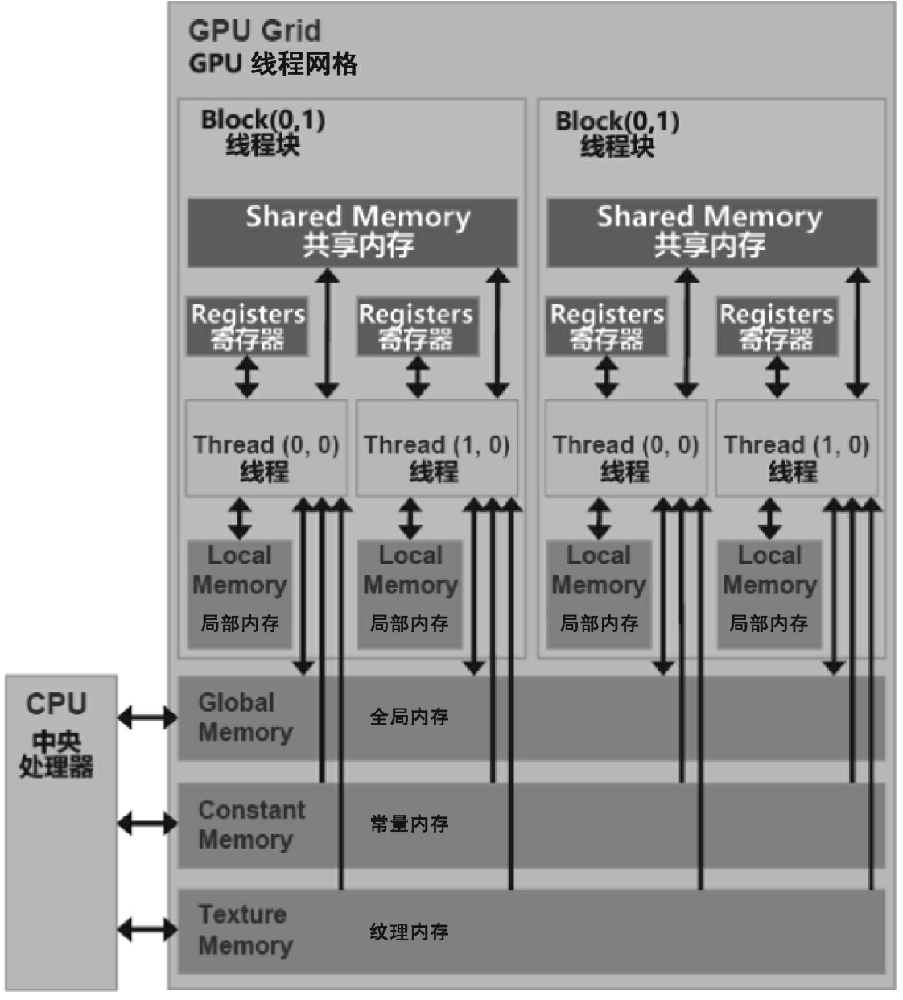
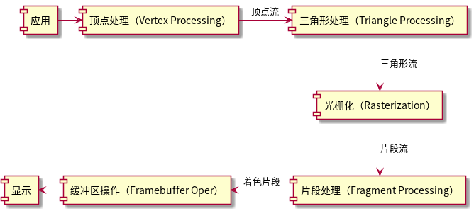

#+title: xPU
#+subtitle: NPU&GPU
#+author: Joe
#+latex_class: org-latex-pdf 
#+toc: tables 
#+toc: listings 
#+latex: \clearpage\pagenumbering{arabic} 
#+latex: \AddToShipoutPicture{\BackgroundPicture} 
#+options: h:4 ^:{} 
#+startup: overview
* xPU简介
CPU的设计以指令控制为核心，以整数计算为基础，衍生出了浮点单元和SIMD单
元，近几年少数CPU集成了矩阵单元。GPU的设计通过SIMT前端的指令管理方式和SIMD
后端的执行模式，以高吞吐量的浮点计算为主，衍生出矩阵单元，以适应AI计算任务中
庞大的矩阵计算需求。
- NPU：neural PU； 
- DPU：data PU；
- GPU：graphic PU；
- TPU：tensor PU；
** 名词
- TOP500：以FP64双精度算力的FLOPS作为评判标准；
- FLOPS：floating point Operation per second；
  + MFLOPS：Mega FLOPS
  + GFLOPS：Giga FLOPS
  + TFLOPS：Tera FLOPS
  + PFLOPS：Peta FLOPS
  + EFLOPS：Exa FLOPS
  + ZFLOPS：Zetta FLOPS
- MLPerf：Machine learning perf，一个公开的、行业标准的基准测试套件，
  用于衡量人工智能领域的机器学习硬件、软件和服务的性能；由MLCommons社
  区维护；
- RNN-T：Recurrent Neural Network Transducer，一种端到端的序列到序列的
  学习模型；
- BERT：Bidirectional encoder representations from transformers,通过
  Transformer结构捕捉文本中的双向关系；
- RoCe：RDMA over converged Ethernet，以太网上的协议；
- RDMA：Remote direct memory Access，以太网上的协议；
- DLRM：deep learning recommendation model；
- CPI：Cycle per instruction，平均指令周期数；
- IPC：instruction per clock/Cycle，每个时钟周期内的指令数；
- 流水线寄存器：是用来在每个流水线阶段之间存储指令的中间状态的器件，理
  解为C语言函数的变量；
- Superscalar：超标量，x86处理器的译码单元可以同时处理多个指令译码，然
  后将译码后的微指令通过发射单元并行发射给执行单元，提高并行度和性能；
- inclusive cache：包含性缓存，一份数据在本级及下级缓存中都有一份；
- exclusive cache：独占性缓存，一份数据只会出现在本级缓存中；
- MMX: multi media extension，intel MMX指令集；
- SSE：streaming SIMD extension，intel SSE指令集；
- AVX：advanced vector extension，intel AVX 指令集；
- APX：advanced performance extension，intel APX指令集；
- AMX：advanced matrix extension，intel AMX指令集；
- SVE：scalable vector extension，arm SVE指令集；
- PTX：parallel thread execution，并行线程执行指令集；
- SASS：streaming assembly shader，NVIDIA GPU低级指令集；
- SDF：scalable data fabric，可扩展数据互联；
- SCF：scalable control fabric，可扩展控制互联；
- CCX：cache coherent exchange，缓存一致性交换；
- CCM：cache coherent master，缓存一致性主控制器；
- UMC：uniform Memory Controller，统一内存控制器；
- UMA：uniform memory access，统一内存访问；
- NUMA：Non-Uniform Memory Access，非统一内存访问；
- NoC：Networks on Chip，片上网络；
- NMC：Near memory computing，近存计算；
- CXL：Compute Express link，计算快速链；
- SIMD：single instruction multiple data，单指令多数据处理；
- SIMT：single instruction multiple threads，单指令多线程；
- Scalar：标量是一个单独的数值，它没有方向和维度。标量可被视作零维张量。
- Vector：向量是有方向和大小的量。它由一组有序的标量组成，可以在空间中
  被表示为一个有限维度的坐标向量。向量可被表示为一维数组。向量可被视作
  一维张量。
- Matrix：矩阵是一个二维数组，包含多行和多列的数字。它可被视为一个平面，
  表示多维数据的关系或变换。矩阵可被视作二维张量。
- Tensor：张量是一个多维数组，可以具有任意维度。它是由一组数字按照规则
  排列组成的数据结构。在数学和物理中，张量被广泛用于描述多维数据和多维
  空间中的物理量。例如，二维矩阵是一个二维张量，三维图像是一个三维张量。
  张量的每个元素都可以是标量、向量或其他更高维度的张量。
- MindSpore：是华为提出的AI框架，与TensorFlow、PyTorch、PaddlePaddle等
  框架并列，是一个开源的深度学习训练和推理框架。
- GDDR：Graphics DDR；
- HBM：high bandwidth memory；
- TSV：through silicon via；
- CXL：compute Express link，对标PCIe；
** GPU
NVIDIA的GPU经历了若干代。
- G80
- G92
- GT200
- Fermi
- Maxwell
- Kepler
- Pascal

华为的NPU芯片发展
- Ascend 910：320TFLOPS，310W功耗，7nm，1228mm^2，用于训练场景；
- Ascend 310：16TFLOPS，12nm，用于推理场景；

华为Atlas 900超级计算机，分布式训练系统昇腾集群，采用华为HCCS处理器、
最新的PCIe 4.0总线、100 Gb/s RoCE接口等3类高速互连方式，形成高速集群网
络，每台Atlas 900超级计算机由数千颗Ascend 910组成，每个节点都采用“华为
Kunpeng 920+Ascend 910”的CPU+AI加速芯片的组合。

GPU的经典结构为,访问速度由快到慢，其架构如图[[img-gpuarch]]所示。
- 寄存器：Register，属于每个CUDA计算核心独享的片上存储资源；
- 缓存：Cache，L1和L2缓存；
- 共享内存：Shared Memory，在每个SM内部多个线程可共享的缓存；
- 显存：DRAM（DDR），也被称为全局内存(GlobalMemory) ，可拆分为
  + 局部内存：LocalMemory；
  + 常量内存：Constant Memory；
- 纹理内存：Texture Memory，完全为图形而生，但在GPGPU应用中也能被调用；

#+caption: GPU存储体系
#+name: img-gpuarch
#+attr_latex: :placement [H] :width 0.6\textwidth

#+caption: GPU存储体系特点
#+name: tbl-gpumem
#+attr_latex: :placement [H]
|---------+--------+-----+-------+---------+---------|
| 存储类型 | GPU片内 | 缓冲 | RW权限 | 服务范围 | 声明周期 |
|---------+--------+-----+-------+---------+---------|
|---------+--------+-----+-------+---------+---------|
| 寄存器   | 是      | 否   | RW    | 1个线程  | 线程     |
| 局部内存 | 否      | 2   | RW    | 1个线程  | 线程     |
| 共享内存 | 是      | 否   | RW    | 线程块   | 线程块   |
| 全局内存 | 否      | 1   | RW    | 所有线程 | 主机管理 |
| 常亮内存 | 否      | 是   | R     | 所有线程 | 主机管理 |
| 纹理内存 | 否      | 是   | R     | 所有线程 | 主机管理 |
|---------+--------+-----+-------+---------+---------|
*** 线程
当主机端(CPU)启动一个内核函数时，会转移到GPU上执行，并产生大量的线程。
为了方便管理这些线程，CUDA采用了一种层次结构。所有由一个内核函数启动的
线程都被统称为一个线程网格，而线程网格由多个线程块组成，每个线程块中又
包含多个线程。这种层次结构可以是1D、2D或3D的，根据应用的需要进行选择。
- 线程：最小的并行执行单元，一个线程负责执行一部分程序代码；
- 线程块：多个线程组织成一个线程块，是SM硬件单元，可以理解为GPU上的完
  整功能单元，GPU中资源管理的基本单位；
- 线程束：每个线程块中以线程束作为一次执行的单位；
- 线程网格：多个线程块组织成一个线程网格，是一个完整的GPU芯片+DRAM显存，
  可以理解为一张完整的显卡；

为了区分不同的线程，CUDA运行时为每个线程分配了两个坐标变量，即
BlockIdx 和 ThreadIdx。这两个变量都是结构体类型的，其中包含了 x、y、z
共3个字段。这3个字段对应着不同的维度，在线程网格和线程块的组织方式中起
到了标识的作用。BlockIdx表示线程块在线程网格中的索引，ThreadIdx表示线
程在线程块中的索引。通过这两个变量，可以确定每个线程在各自维度上的坐标。

*** T&L处理
- Transform（变换）：该阶段负责几何变换，即将顶点从一个坐标空间变换到
  另一个坐标空间（旋转、平移、缩放等），它处理的阶段如下。
  + 模型变换：将物体从对象空间变换到世界空间，每个3D物体（例如游戏中的
    角色或建筑物）都有其自己的局部坐标系，这被称为模型空间。在这个模型
    空间中，物体的原点通常是其中心点或某个关键点。模型变换是将物体从其
    模型空间变换到一个统一的世界空间，其中所有物体都被放置在一个大的3D
    场景中。这涉及对物体进行旋转、平移和缩放操作，以确定它在整个3D世界
    中的位置、方向和大小。；
  + 视图变换：从世界空间变换到摄像机空间，一旦所有物体都被放置在世界空
    间中，下一步就是确定观察者（或相机）如何查看这个世界。观察变换负责
    将整个3D世界从世界空间转换到观察空间，使得相机位于原点，并且正面朝
    向一个特定方向，它会考虑相机的位置、方向。；
  + 投影变换：从摄像机空间变换到屏幕空间，将3D世界投影到2D屏幕上就要使
    用投影变换。投影变换将观察空间的3D场景变换到一个被称为裁剪空间的空
    间中。在这个空间中，所有即将显示在屏幕上的物体都位于一个定义的立方
    体内（通常被称为裁剪体或视椎体）。这个变换也定义了是使用正射投影还
    是透视投影。；
- Lighting（光照）：该阶段根据场景中的光源、材质属性以及顶点的位置和法
  线，计算顶点的颜色和亮度。
*** 光栅化
光栅化Rasterization，是将矢量顶点组成的图形进行像素化的过程，它是一个
桥梁，连接了3D顶点数据和2D屏幕像素，需要经过若干过程。
#+begin_src plantuml :exports results :file ./pic/drw-rast.png
  [应用] -> [顶点处理（Vertex Processing）]
  [顶点处理（Vertex Processing）] -> [三角形处理（Triangle Processing）]: 顶点流    
  [三角形处理（Triangle Processing）] -down-> [光栅化（Rasterization）]: 三角形流    
  [光栅化（Rasterization）]-down->[片段处理（Fragment Processing）]:片段流
  [片段处理（Fragment Processing）]-left->[缓冲区操作（Framebuffer Oper）]: 着色片段
  [缓冲区操作（Framebuffer Oper）]-left->[显示]
#+end_src
#+caption: 光栅化过程
#+name: drw-rast
#+attr_latex: :placement [H] :width 0.6\textwidth
#+results:

而光栅化过程需的详细步骤如下。
- 屏幕映射：三角形的顶点坐标（在裁剪空间中）会映射到屏幕坐标系，这通常
  涉及透视除法和视口变换(Viewport Transformation)，将3D空间中的坐标变
  换为屏幕上的2D像素坐标。
- 边界确定：在知道三角形顶点在屏幕上的位置后，就可以确定三角形的边界框。
  这是一个矩形区域，包含了整个三角形，用于进一步优化遍历过程，因为只有
  在这个框内的像素才可能被三角形所覆盖。
- 三角形遍历：系统遍历边界框内的每个像素，以确定它们是否在三角形内部。
  判断像素是否在三角形内部的常用方法是边测试：对于三角形的每条边都可以
  使用线性方程来描述；测试屏幕上的点（像素中心）是否在该方程的正确一侧，
  如果屏幕上的点在3条边的正确一侧，则它位于三角形内部。
- 片段生成：在三角形内部的每个像素都会生成一个片段。这个片段会包含屏幕
  上的位置信息及其他与该位置相关的数据。例如，通过插值三角形顶点的数据
  （如颜色、纹理坐标等），为每个片段生成相应的数据。
** 存储互联
*** DDR
*** GDDR
*** HBM
HBM主要通过硅通孔(Through Silicon Via, TSV)技术进行芯片堆叠，即将数个
DRAM裸片像楼层一样垂直堆叠以提高吞吐量并克服单一封装内带宽的限制
- HBM1
- HBM2
- HBM3
*** PCIe
*** CXL
Intel推出的设备（内存、加速器）互联标准，和PCIe协议共用物理层和电气层，
改进了协议层。通过CXL接口，CPU可以与多个CXL设备进行通信，实现高性能的
数据交换和协同计算。CXL还提供了一种统一的内存访问模型，使得CXL设备能够
共享和访问其他CPU的内存。而传统的PCIe总线的内存是被CPU所独占的，或者说
是割裂的，CXL对异构计算平台的性能扩展有极大帮助，内存不再限于单节点几
百GB或者几个TB，而是可以通过CXL技术扩展到目前的10～100倍。它包含3个子
协议。
- CXL.io：该子协议在功能上等同于PCIe协议，是PCIe 5.0协议的增强版本，可
  用于初始化、连接、设备发现和枚举，以及寄存器访问；
- CXL.cache：该子协议可以用于将内存缓存到外部设备中，构建出多级存储系
  统，以提高系统的性能；
- CXL.memory：在需要更大内存容量的AI服务器中，CXL.memory子协议可以将
  CXL内存作为主内存使用，以扩展内存容量；
*** NVLink

* 算法
表格[[tbl-mlperft2]]是MLPerf Training v2.0的8个经典算法项目。
#+caption: 算法项目
#+name: tbl-mlperft2
#+attr_latex: :placement [H] 
|------------+---------+-------------------|
| 项目        | 发布时间 | 领域               |
|------------+---------+-------------------|
|------------+---------+-------------------|
| ResNet     |    2015 | 图像识别           |
| SSD        |    2016 | 轻量级目标物体检测 |
| Mask R-CNN |    2017 | 重量级目标物体检测 |
| U-Net3D    |    2015 | 医学图像分割       |
| RNN-T      |    2014 | 语音识别           |
| BERT       |    2018 | 自然语言理解       |
| DLRM       |    2019 | 智能推荐算法       |
| MiniGo     |    2016 | 强化学习              |
|------------+---------+-------------------|

- ResNet：核心思想是通过“残差学习”来避免深度神经网络的退化问题。在残差
  块中，输入会被跳过一层或多层与该层的输出相加，这有助于梯度的反向传播
  和避免梯度消失问题；ResNet对深度学习领域产生了深远影响，成为之后许多
  模型的基础。其设计允许研究者训练非常深的神经网络，从而大大提高图像识
  别的准确性。
- SSD：核心思想是在多个尺度的特征图上进行目标检测，每个特征图都负责检
  测不同尺寸的对象。这使得SSD可以在一个前向传递中同时检测出多个尺寸的
  对象；SSD提供了一个高效和准确的目标检测方案，并被广泛用于实时目标检
  测的应用中。
- Mask R-CNN：基于Faster R-CNN在原来的框架上增加了一个并行的分支来预测
  对象掩码。这使得它可以在单次前向传递中同时进行目标检测和实例分割；
  Mask R-CNN推动了实例分割技术的发展，并被广泛应用于需要细粒度对象识别
  的场景中。
- U-Net3D：U-Net3D包括一个收缩路径，用来捕获上下文信息，还包括一个对称
  的扩展路径，用来精确的分割定位。由于其特点，模型可以利用很少的标注数
  据进行训练；U-Net3D对医学图像分割产生了巨大的影响，很多后续工作都以
  此为基础进行扩展和改进。
- RNN-T：RNN-T是一种端到端的序列到序列的学习模型，适用于语音识别等任务，
  RNN-T不需要先进行声学模型和语言模型的预训练，可直接从原始音频转到文
  本；它大大简化了语音识别的训练流程，被许多商业系统采用。
- BERT：通过Transformer结构捕捉文本中的双向关系，与传统单向模型不同，
  BERT能够同时考虑文本左右两侧的上下文；BERT开创了自然语言新纪元，成为
  许多NLP任务新的基线，被广泛用于搜索引擎、聊天机器人领域。
- DLRM：结合了分类和连续特征，通过嵌入表达和MLP（多层感知机）进行推荐；
  该模型在许多大型商业推荐系统中被采用，有效提高了推荐的精度。
- MiniGo：MiniGo是Google DeepMind围棋AI AlphaGo的轻量版，它利用蒙特卡
  罗树搜索（MCTS）和深度学习来模拟围棋的博弈过程，通过强化学习的训练，
  模型能够自我对弈提高策略。

