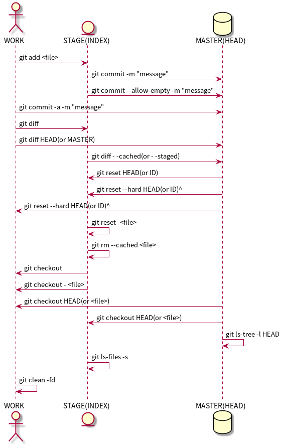

#+MACRO: version 2.0
#+MACRO: updated last updated 4 March 2014
#+title: 工具
#+author: 比克曼
#+subauthor: 第二作者 
#+email: bitman@163.com
#+latex_class: org-latex-pdf 
#+latex: \newpage 
#+toc: tables 
#+latex: \clearpage\pagenumbering{arabic} 
#+options: h:4 
#+startup: overview
#+startup: hideblocks
#+startup: align
#+startup: logdone
#+options: ':t email:t author:t 
#+toc: tables
#+latex_header: \setcounter{tocdepth}{5}
#+latex_header: \setcounter{secnumdepth}{5}

#+keywords: emacs keil iar
#+creator: creator-bitsman 
#+DESCRIPTION: description-bitsman
#+SUBTITLE: 这里会做一些emacs测试

* emacs
** 安装
- gnuserv安装：将emacs目录拷贝后，在系统环境变量中增加HOME键值等于emacs路径
  (d:\emacs)，即可； 
- 自动安装插件：M-x package-list-packages获取插件包列表，enter进入选中插件，
  点击install开始安装；
- 重新加载配置文件(pymacs)：M-x load-library RET pymacs RET
- emacs配置即时生效: 不重启Emacs让新修改的配置内容生效
  + M-x eval-last-sexp 使当前 elisp 配置中光标前的那一条语句立刻生效；
  + M-x eval-region 使当前 elisp 配置中选中的 region 中的语句立刻生效；
  + M-x eval-buffer 使当前的 buffer 中的设置语句立刻生效；
  + M-x load-file ~/.emacs 载入 .emacs 文件，从而使其中的设置生效，要
    生效其它 elisp 文件只需要把 .emacs 文件名换成其它的即可。
*** Win编译安装
以64位为例。首先安装x86_64版的MSYS2。安装后运行安装目录里的
msys2_shell.bat，会看到一个BASH的命令行窗口。使用命令安装所需的包：
#+BEGIN_SRC shell -n 
  pacman -S base-devel mingw-w64-x86_64-toolchain \
         mingw-w64-x86_64-xpm-nox\
         mingw-w64-x86_64-libtiff \
         mingw-w64-x86_64-giflib\
         mingw-w64-x86_64-libpng \
         mingw-w64-x86_64-libjpeg-turbo\
         mingw-w64-x86_64-librsvg \
         mingw-w64-x86_64-libxml2\
         mingw-w64-x86_64-gnutls
#+END_SRC

其中，除了前两项外其他是可选的。它们的功能分别是
- 基础：base-devel mingw-w64-x86_64-toolchain
- 图形库:
  + mingw-w64-x86_64-libtiff
  + mingw-w64-x86_64-giflib
  + mingw-w64-x86_64-libpng
  + mingw-w64-x86_64-libjpeg-turbo
  + mingw-w64-x86_64-librsvg
- 用于Libxml2： mingw-w64-x86_64-libxml2
- 用于GnuTLS： mingw-w64-x86_64-gnutls

emacs源码可以在ftp或者github上获得；

下面就是编译安装了。运行开始菜单中的mingw64_shell，注意必须是它，这会
启动一个MinGW-w64的环境。cd到源码所在的目录，运行下面的命令编译Emacs并
且安装到C:\emacs。如果是从开发版编译，第一行是必须的，否则
#+BEGIN_SRC shell
  ./autogen.sh
  PKG_CONFIG_PATH=/mingw64/lib/pkgconfig ./configure --host=x86_64-w64-mingw32 \
                 --target=x86_64-w64-mingw32\
                 --build=x86_64-w64-mingw32\
                 --with-wide-int \
                 --with-jpeg\
                 --with-xpm\
                 --with-png\
                 --with-tiff\
                 --with-rsvg\
                 --with-xml2 \
                 --with-gnutls\
                 --with-xft\
                 --without-imagemagick\
                 --with-modules
  make
  make install prefix=/c/emacs
#+END_SRC

如果成功的话C:\emacs目录里就有编译好的Emacs。因为编译时用了很多第三方
库, 所以编译的这个Emacs是需要那些DLL才能运行的。如果系统里面MSYS2已经
被添加到PATH环境变量里(例如PATH里包含了C:\msys2\mingw64\bin)了这不是问
题，但如果环境变量里没有或者想在其他电脑上用，需要用下面的命令复制所需
的DLL到Emacs所在目录：
#+BEGIN_SRC shell
  cp /mingw64/bin/{libwinpthread-*.dll,libXpm-noX*.dll,libdbus-*.dll} /c/emacs/bin
  cp /mingw64/bin/{libgomp-*.dll,libgcc_s_seh-*.dll,libglib-*.dll} /c/emacs/bin
  cp /mingw64/bin/{libintl-*.dll,libiconv-*.dll,libgobject-*.dll} /c/emacs/bin
  cp /mingw64/bin/{libffi-*.dll,libgdk_pixbuf-*.dll,libgio-*.dll} /c/emacs/bin
  cp /mingw64/bin/{libgmodule-*.dll,zlib*.dll,librsvg-*.dll} /c/emacs/bin
  cp /mingw64/bin/{libcairo-*.dll,libcroco-*.dll,libpango-*.dll} /c/emacs/bin
  cp /mingw64/bin/{libpangocairo-*.dll,libxml2-*.dll,libfontconfig-*.dll} /c/emacs/bin
  cp /mingw64/bin/{libfreetype-*.dll,libpixman-*.dll,libpng*.dll} /c/emacs/bin
  cp /mingw64/bin/{libpangoft*.dll,libpangowin32-*.dll,liblzma-*.dll} /c/emacs/bin
  cp /mingw64/bin/{libexpat-*.dll,libharfbuzz-*.dll,libgnutls-*.dll} /c/emacs/bin
  cp /mingw64/bin/{libgnutlsxx-*.dll,libtiff-*.dll,libtiffxx-*.dll} /c/emacs/bin
  cp /mingw64/bin/{libjpeg-*.dll,libgif-*.dll,libbz2-*.dll,libjbig-*.dll} /c/emacs/bin
  cp /mingw64/bin/{libgmp-*.dll,libhogweed-*.dll,libnettle-*.dll} /c/emacs/bin
  cp /mingw64/bin/{libp11-kit-*.dll,libtasn1-*.dll} /c/emacs/bin
#+END_SRC
** 基本操作
*** 按键命令
- 按键自定义方式
  1. 定义全局按键
     #+begin_src lisp
     (global-set-key "\M-;" 'qiang-comment-dwim-line)
     #+end_src
  2. 定义模式相关的快捷键：如下定义一个快捷键，只有在org-mode中起作用
     #+begin_src lisp
     (define-key org-mode-map (kbd "C-S-a") 'org-archive-subtree)
     #+end_src
  3. 同一个按键适用于多个模式：表示只在text-mode和org-mode里打开flyspell的功能，并且绑定了C-c C-v按键，这里用到了 dolist
     函数来遍历需要设置的mode      
     #+begin_src lisp
     (dolist (hook '(text-mode-hook org-mode-hook))
              (add-hook hook
                    (lambda ()
                        (flyspell-mode 1)
                        (local-set-key (kbd "C-c C-v") flyspell-goto-next-error))))
     #+end_src
  4. 使用local-set-key做局部绑定，暂定；
- 定义自己的M-x指令：如下指令进行M-x gtd，可以打开相应的文件；
  #+begin_src lisp
   (defun gtd ()
    (interactive)
    (find-file "c:/homes/charles/gtd/gtd/mygtd.org"))
  #+end_src
- 表格\ref{tbl-emacs-inf}总结了平时需要的快捷键、模式、命令等操作；
  #+caption: emacs使用汇总
  #+label: tbl-emacs-inf
  #+attr_latex: placement=[H] :environment longtable
  |---------+-----------+--------------------------------+--------------------------------+-------------------|
  | 模式     | 按键       | 函数                            | 功能                            | 备注               |
  |---------+-----------+--------------------------------+--------------------------------+-------------------|
  |         | C-c a     | org-agenda                     | 进入org模式的agenda             |                   |
  |         | C-c b     | org-iswitchb                   | 进入org模式的iswitchb           |                   |
  |         | C-c c     | org-capture                    | 进入org模式的capture            |                   |
  |         | C-c l     | org-store-link                 | 进入org模式的org-store-link     |                   |
  |---------+-----------+--------------------------------+--------------------------------+-------------------|
  |         | F9        | emacs-maximize                 | 窗口最大化                      | 实际上延时后最大化 |
  |         | C-F9      | emacs-normal                   | 窗口大小还原                    |                   |
  |---------+-----------+--------------------------------+--------------------------------+-------------------|
  |         | C-x 4 4   | split-window-h2v2              | 窗口分成4份，水平2份垂直2份      |                   |
  |         | C-x 4 3   | split-window-h2v1              | 窗口分成3份，水平2份垂直1份      |                   |
  |         | C-x 4 5   | split-window-h1v2              | 窗口分成3份，水平1份垂直2份      |                   |
  |         | M-j       | split-window-rotate            | 窗口顺时针旋转                  |                   |
  |         | M-S-j     | split-window-hv-turn           | 窗口逆时针旋转                  |                   |
  |---------+-----------+--------------------------------+--------------------------------+-------------------|
  |         | M-g       | goto-line                      | 跳转到某行                      |                   |
  |---------+-----------+--------------------------------+--------------------------------+-------------------|
  |         | C-,       | scroll-left                    | 屏幕左移命令                    |                   |
  |         | C-.       | scroll-right                   | 屏幕右移命令                    |                   |
  |---------+-----------+--------------------------------+--------------------------------+-------------------|
  |         | F3        | repeat-complex-command         | 重复上一命令                    |                   |
  |         | C-x z     |                                |                                |                   |
  |---------+-----------+--------------------------------+--------------------------------+-------------------|
  |         | F8        | eshell                         | 打开eshell                      |                   |
  |         | C-F8      | open-eshell-other-buffer       | 在另一个buffer里面打开eshell    |                   |
  |---------+-----------+--------------------------------+--------------------------------+-------------------|
  |         | C-;       | set-mark-command               | 设置标记起始位置                | 原来绑定在C-SPC上  |
  |---------+-----------+--------------------------------+--------------------------------+-------------------|
  |         | F2        | ecb-hide-ecb-windows           | ecb模式窗口隐藏                 |                   |
  |         | C-F2      | ecb-show-ecb-windows           | ecb模式窗口显示                 |                   |
  |---------+-----------+--------------------------------+--------------------------------+-------------------|
  |         | M-;       | user-comment-dwim-line         | 代码注释                        |                   |
  |---------+-----------+--------------------------------+--------------------------------+-------------------|
  |         | F7        | quick-compile                  | 编译                            | 设置编译C          |
  |---------+-----------+--------------------------------+--------------------------------+-------------------|
  |         | F10       | my-transparent                 | 设置或者取消emacs透明           |                   |
  |---------+-----------+--------------------------------+--------------------------------+-------------------|
  |         | C-c 1     | org-time-stamp                 | org模式时间戳                   |                   |
  |---------+-----------+--------------------------------+--------------------------------+-------------------|
  |         | C-c d     | insert-current-date            | 插入当前日期                    |                   |
  |         | C-c t     | insert-current-time            | 插入当前时间                    |                   |
  |---------+-----------+--------------------------------+--------------------------------+-------------------|
  |         | C-F1      | manual-entry                   | 进入manual                      |                   |
  |         | F1        | open-key-info-file             | 进入自定义快捷键帮助             |                   |
  |---------+-----------+--------------------------------+--------------------------------+-------------------|
  |         |           | byte-compile-file              | 编译elisp文件                   |                   |
  |         |           | describe-current-coding-system | 显示当前buffer的编码格式        |                   |
  |         | C-x RET f |                                | 改变当前buffer的编码格式        |                   |
  |---------+-----------+--------------------------------+--------------------------------+-------------------|
  |         | C-x {     |                                | 往左加宽buffer尺寸              |                   |
  |         | C-x }     |                                | 往右加宽buffer尺寸              |                   |
  |         | C-x ^     |                                | 往上加高buffer尺寸              |                   |
  |---------+-----------+--------------------------------+--------------------------------+-------------------|
  | 目录模式 | n         |                                | 向下查看文件                    |                   |
  | C-x d   | p         |                                | 向上查看文件                    |                   |
  |         | >         |                                | 向下查看目录                    |                   |
  |         | <         |                                | 向上查看目录                    |                   |
  |         | ^         |                                | 返回上一级目录                  |                   |
  |         | M-(       |                                | 向下查看已标记                  |                   |
  |         | M-)       |                                | 向上查看已标记                  |                   |
  |         | g         |                                | 刷新                            |                   |
  |         | s         |                                | 切换名称/日期排序方式            |                   |
  |         | i         |                                | 当前窗口下面打开该子目录         |                   |
  |         | v         |                                | 查看当前文件（当前窗口）         |                   |
  |         | o         |                                | 查看当前文件（另一窗口）         |                   |
  |         | y         |                                | 查看当前文件类型                |                   |
  |         | 等号       |                                | 比较文件，相当于shell下的diff    |                   |
  |         | m         |                                | 标记（mark）                    |                   |
  |         | u         |                                | 取消标记                        |                   |
  |         | U         |                                | 取消所有标记                    |                   |
  |         | * /       |                                | 标记所有文件夹                  |                   |
  |         | * *       |                                | 标记所有可执行文件              |                   |
  |         | * @       |                                | 标记所有符号链接                |                   |
  |         | * c       |                                | 改变标记的符号                  |                   |
  |         | % m       |                                | 根据正则表达式改变标记文件       |                   |
  |         | % g       |                                | 根据正则表达式改变标记文件的内容 |                   |
  |         | d         |                                | 标记为删除                      |                   |
  |         | ~         |                                | 标记所有备份文件为删除           |                   |
  |         | #         |                                | 将存盘文件标记为删除             |                   |
  |         | & d       |                                | 根据正则表达式标记删除           |                   |
  |         | X         |                                | 执行标记的操作                  |                   |
  |         | +         |                                | 新建目录                        |                   |
  |         | C-x C-q   |                                | 将文件列表设置为只读             |                   |
  |         | D         |                                | 删除文件                        | 标记（m）后的操作  |
  |         | C         |                                | 拷贝                            | 标记（m）后的操作  |
  |         | O         |                                | 改变用户                        | 标记（m）后的操作  |
  |         | G         |                                | 改变群组                        | 标记（m）后的操作  |
  |         | S         |                                | 符号链接                        | 标记（m）后的操作  |
  |         | H         |                                | 硬链接                          | 标记（m）后的操作  |
  |         | Z         |                                | 压缩                            | 标记（m）后的操作  |
  |         | W         |                                | 复制文件名                      | 标记（m）后的操作  |
  |         | K         |                                | 删除行，刷新后可恢复             | 标记（m）后的操作  |
  |---------+-----------+--------------------------------+--------------------------------+-------------------|
  |         |           | revert-buffer                  | 刷新buffer                      |                   |
  |         |           | emacs -q                       | 进入emacs默认最小配置           | 启动emacs时使用    |
  |         |           | eval-current-buffer            | 当前配置立马生效                |                   |
  |         |           | rename-buffer                  | 重命名当前buffer                |                   |
  |---------+-----------+--------------------------------+--------------------------------+-------------------|
*** 其他
- 在eshell中使用$PATH$可以输出当前emacs的路径path；
- 查询当前模式:C-h m或者M-x describe-mode ;
- el源文件编译:对于emacs某些包，有生成的elc的编译文件，emacs启动时，调用elc启动速度会更快，但是如果修改了源文件el，则可
  以使用M-x：byte-recompile-directory来重新编译，才能将修改的地方起作用。比如org mode中修改latex的生成模式函数
  org-export-latex-make-header
- 右键菜单配置打开命令：在注册表\HKEY\_CLASSES\_ROOT\AllFilesystemObjects\shell\下面新建一项Emacs，再在下面新建command项，
  看起来应该是这样：\HKEY\_CLASSES\_ROOT\AllFilesystemObjects\shell\Emacs\command\ 然后把command项右边的默认值设为
  Path\gnuclientw.exe，并加上"%1"
- emacs配置立马生效: 可以M-x eval-current-buffer立马生效;
- 查看emacs占用资源：M-x profiler-start 然后选cpu+mem然后执行
  profiler-report；
*** 计算器
- 计算器模式1：M-x calc进入，输入"10"回车"d2，这个d2会把窗口中的所有数字显示为二进制形式，所有的数字都会以"2#"开头,以表
  示它们是二进制形式。如果要重新用十进制显示，则输入"d0"即可，同样，也可以用"d8""，"d6"来显示八进制和十六进制的格式。如
  果要进行进制转换，比如讲二进制的1010转换为十六进制，可以这样先d6设定16进制模式，然后再minibuffer中输入2#1010，回车；
- 计算器模式2：M-x quick-calc进入，启动后会在minibuffer里提示输入数学计算式，回车就显示结果；
*** 图片
- 导入图片见图\ref{img-pic-test}:可以通过调节width=.1\ linewidth来限制图片输出的大小, 其中.1表示倍率，或者使用scale=0.2
  进行调节
  #+caption: emacs导图测试 
  #+label: img-pic-test
  #+attr_latex: placement=[H] scale=0.2
  [[./img/emacs1.jpg]]
*** 字体
- eshell 查看系统字体:eshell:fc-list(或者fc-list.exe) (空格) :lang=zh-cn
*** 编码
- 设置编码格式:使用快捷键：C-x RET f 然后可以用 TAB 显示所有存在的编码。这个命令会改变文件！如果只是出现乱码，并且不想改
  变文件本身，可以用命令C-x RET r ( M-x revert-buffer-with-coding-system)来用指定的编码重新读入这个文件。不改变当前文件
  编码，但将该文件另存为utf-8编码格式：C-x RET c(M-x universal-coding-system-argument ) utf-8
- 对于org-mode导出HTML时，如果org-mode是gbk/utf-8，则导出的HTML也是gbk/utf-8；
*** 外部程序
使用M-x shell-command然后输入win下程序，可以调用执行之。也可以绑定到
按键上。 
** elisp
*** 变量
- list：
  要得到一个list，可以使用下面的方式，第3种方式如果不加单引号，elisp将
  会把1当成函数把2和3当成参数，结果就会报错。
  1. (list 1 2 3)：产生一个list对象，且每次产生的都是新的对象
  2. (quote (1 2 3))：产生一个list对象，但每次产生的对象可能都是指向同
     一个
  3. '(1 2 3)：相同quote方式。
- 全局变量
  + defvar:定义全局变量
- 局部变量
  + let：定义局部变量
- 作用域(scope)
- 生存期(extent)
*** 符号 
elisp中符号(symbol)是一个Lisp对象，它是一个数据结构，由以下4个部分组成，
- name：symbol的名字
- value cell：作为一个动态变量，symbol的值
- function cell：作为一个函数，它的函数值
- property list：属性列表

symbol的标识符直接在Lisp代码中出现，会被读取为一个符号（symbol）， 然
后在不同的上下文中 ，Lisp求值器会看情况取出value cell或者function cell
的内容， 作为该符号（symbol）的值（value）。如果某一个函数接受符号
（symbol）而不是它的值（value）作为参数，我们就得引用（quote）它， 即，
我们使用引用，可以创建一个符号（symbol）字面量（literal）。symbol-name
函数可以用来获取符号（symbol）x的name，
#+BEGIN_SRC emacs-lisp
  (symbol-name 'x)
#+END_SRC
*** 表达式
形如(+ 1 2)叫表达式，从左到右位于第一个位置的元素，表示
- 一个函数：其参数必需要先求值完毕
- 一个宏：其参数有自己的对参数的求值策略
- 一个内置的特殊命令：其参数有自己的对参数的求值策略
其他位置的元素称为参数；

*** 函数
- interactive: 该特殊表表示该函数可以做交互，且定义函数参数类型。
  + 星号*：表示如果有错误，就产生一个错误消息；
  + p：表示传送给函数的参数的是一个处理过的前缀参量的值，前缀参量用
    C-u值的形式传递
  + cxx: 指交互表达式希望产生一个提示xx并且后续的参数将是一个字符
  + r：使emacs将位点所在区域的开始值和结束值作为函数的两个参数；
  + Bxx：告诉emacs用缓冲区的名字作为函数的参数,并用xx作为提示
- concat：将字符串连接，如下
  #+begin_src lisp
  (concat "gcc" "-W -o")
  #+end_src
- file-name-sans-extension: 获得文件名，除了后缀名；
- buffer-file-name: 获得文件名，带后缀名；
- current-buffer: 当前buffer名；
- progn: 该函数使其每个参数表达式被逐一求值，并返回最后1个表达式的值
- p: 末尾带p(predicate)的函数一般都是判断函数，返回true或false;
*** 功能
- 获取buffer文件名: 行[[(extn)]]带有后缀名，行[[(noextn)]]不带后缀名；
  #+begin_src lisp -n -r
  (buffer-file-name (current-buffer)) (ref:extn)
  (file-name-sans-extension (buffer-file-name (current-buffer))) (ref:noextn)
  #+end_src
** org-mode
# <<org-mode>>
org-mode在线[[http://orgmode.org/org.html][帮助文档]]。
*** 可视化
- 初始可视化：在org文档的开始，加上#+startup: overview, 其中overview可以是
  如下选项
  1. overview：只显示第一级标题；
  2. content：显示所有标题；
  3. showall：显示所有标题和正文；
  4. showeverything：显示所有标题和正文, 雷同showall；
*** 抽屉
使用抽屉drawer，在导出时，drawer里面的文字不会被到导出, 可以在里面放入一些
注解, 可以使用命令'org-insert-property-drawer' 
:PROPERTIES:
抽屉内部
:END:
*** 块
代码块可以设置#+startup: hideblocks, 做初始化折叠或打开。可以有如下选项
1. hideblocks：隐藏代码块；
2. nohideblocks：显示代码块；
*** 脚注
脚注注解可以放在任何正文位置，脚注形式有；
- 脚注一, 普通序号脚注[fn:1];
- 脚注二，带名字脚注[fn:second];
- 脚注三, 匿名脚注[fn:: 匿名脚注]; 
- 脚注四，带描述的脚注[fn:four: 带描述的脚注]; 
[fn:1] 普通序号脚注
[fn:second] 带名字脚注
*** 序号
- 无序号：无序号符号可以是'-'和'+'和'*'；
- 有序号：可以是'1.'和'1)';
- 描述 :: 对序号的描述；
*** 字体
试试 *粗体* ，试试 /斜体/ ,  试试删除线  +删除线+ ，试试 _下划线_, 试试下标 H_{2}O 试试上标 E=mc^2 ，等宽字体 =git=, ~code~
*** 公式
1. 公式：在本行，$a^2+b^2=c^2$
2. 公式：在本行，\(a^2 + b^2 = c^2\)
3. 公式：单独成行。$$a^2 + b^2 = c^2$$
4. 公式：单独成行。\[a^2 + b^2 = c^2\]
5. 公式：在本行，\(\sqrt{2}\)
6. 和公式：$$a=\sum_{i=0}^{n}a_{i}$$
7. 分数公式：$$\frac{x}{y}$$
8. 输入equ，然后按tab也可以进入begin end模式，编辑公式，可以有标号，可以设
   置label标签引用。
*** 表格
**** 内建表格 
- 固定列宽：可以在某列中写入<n>，n表示n个英文字符宽度，超出宽度的字符将隐
  藏，并且以'=>'结尾, 使用鼠标将光标移到'=>'上，emacs将弹出小窗口显示内容，
  如果要编辑，可以使用C-c ', 可以在文件头使用#+startup: align来显示与否
  1. align: 隐藏多余的字符；
  2. noalign：显示多余的字符；
- 表格对齐
  1. '<r>': 表格右对齐；
  2. '<c>': 表格左对齐；
  3. '<l>': 表格左对齐；
- 表格合并：在一空行中，首列使用'/', 将需要合并的列用'<>'括起来，则导出的文
  档中合并了的列，将会有垂直线显示；
**** 表格插件
可以使用table-mode，命令table-insert可以插入一个n行n列的表格，
table-span-cell可以合并单元格。 
**** 表格第三方
可以将内建表格用在其他mode中,只需要配置.
#+begin_src lisp
(add-hook 'message-mode-hook 'turn-on-orgtbl)
#+end_src
**** 表格计算
- 行表示：第2行：@2;
- 列表示：第2列：$2;
- 表格表示：第2行第2列：@2$2, 或者B2;
- 打开表格符号帮助：C-c ?;
- 显示行列帮助：C-c };
- 公式引用：在表格下方的计算公式上使用C-c C-c，或者在表格中使用C-u C-c *;
- 表格中输入计算公式：在表格中使用=表示列计算方式，使用:=表格单个表格计算公式；
- 在mini buffer中输入公式：列计算模式C-c =，表格计算模式C-u C-c = ;
- 在单独的buffer中输入公式：C-c ';
- 求平均值函数vmean:例如:=vmean($2..$3)；
*** 画图
- ditaa测试：如果要支持中文，org文档需为utf-8的格式，这是java调用ditaa.jar
  时的默认格式, 效果如图\ref{img-test}所示 
  #+caption: 测试画图
  #+label: img-test
  #+attr_latex: placement=[H] scale=0.3
  #+begin_src ditaa :file ./img/img-zhongwen.png :cmdline -r -o
  +----------------+     +--------------+    /-----------\
  |  cBLU blue     |     |  cRED        |    |  cGRE     |
  |                |---> |  red         |--->|  green    |-------+
  +----------------+     +--------------+    \-----------/       |
                                                                 |
                            +------------------+  <--------------+
                            |    cBLU          |                 :
                            |    o item1       |                 |
                            |    o item2       |                 v
                            |    o item3       |   +--------------+
                            +------------------+   |   cRED       |
                                                   +--------------+
  #+end_src
- gnuplot，见图\ref{img-gnuplot-test}所示：
  #+caption: 测试图
  #+label: img-gnuplot-test
  #+attr_latex: placement=[H] scale=0.5
  #+begin_src gnuplot :exports results :file ./img/img-gnuplot-test.png
  reset
  set title "Putting it All Together"
  set xlabel "X"
  set xrange [-8:8]
  set xtics -8,2,8
  set ylabel "Y"
  set yrange [-20:70]
  set ytics -20,10,70
  f(x) = x**2
  g(x) = x**3
  h(x) = 10*sqrt(abs(x))
  plot f(x) w lp lw 1, g(x) w p lw 2, h(x) w l lw 3
  #+end_src
  引用表格画图：表格见表\ref{tbl-data-plot}所示。
  #+label: tbl-data-plot
  #+plot: title: "example table" ind: 1 type: 2d with: lines
  #+tblname: data-plot
  | independent var | first dependent var | second dependent var |
  |-----------------+---------------------+----------------------|
  |             0.1 |               0.425 |                0.375 |
  |             0.2 |              0.3125 |               0.3375 |
  |             0.3 |          0.24999993 |           0.28333338 |
  |             0.4 |               0.275 |              0.28125 |
  |             0.5 |                0.26 |                 0.27 |
  |             0.6 |          0.25833338 |           0.24999993 |
  |             0.7 |          0.24642845 |           0.23928553 |
  |             0.8 |             0.23125 |               0.2375 |
  |             0.9 |          0.23333323 |            0.2333332 |
  |               1 |              0.2225 |                 0.22 |
  |             1.1 |          0.20909075 |           0.22272708 |
  |             1.2 |          0.19999998 |           0.21458333 |
  |             1.3 |          0.19615368 |           0.21730748 |
  |             1.4 |          0.18571433 |           0.21071435 |
  |             1.5 |          0.19000008 |            0.2150001 |
  |             1.6 |           0.1828125 |            0.2046875 |
  |             1.7 |          0.18088253 |            0.1985296 |
  |             1.8 |          0.17916675 |           0.18888898 |
  |             1.9 |          0.19342103 |           0.21315783 |
  |               2 |                0.19 |              0.21625 |
  |             2.1 |          0.18214268 |           0.20714265 |
  |             2.2 |          0.17727275 |            0.2022727 |
  |             2.3 |           0.1739131 |            0.1989131 |
  |             2.4 |          0.16770833 |            0.1916667 |
  |             2.5 |               0.164 |                0.188 |
  |             2.6 |          0.15769238 |           0.18076923 |
  |             2.7 |           0.1592591 |            0.1888887 |
  |             2.8 |           0.1598214 |           0.18928565 |
  |             2.9 |          0.15603453 |            0.1844828 |
  |-----------------+---------------------+----------------------|
  
  #+begin_src gnuplot :var data=data-plot :exports results :file ./img/data-plot.png
    reset
    set title "example table"
    set xlabel "X" 
    set ylabel "Y"
    plot data u 1:2 w l lw 1 title 'first dependent var', \
         data u 1:3 w l lw 1 title 'second dependent var'
    
  #+end_src
*** 链接
- 链接之间跳转：C-c C-x n和C-c C-x p
- 内部链接：只需要在某个需要链接到的地方使用# <<target>>，设置一个标点，再
  在使用的地方，使用像[[][]]这样的格式去定位标点，并给出描述符，或者直接使
  用快捷键C-c C-l添加该点，比如已经在org-mode标题处设置了标点，然后使用
  [[][]]定位过去就是 [[org-mode]], 并且可以使用C-c &返回来, 使用C-c C-o可以打开
  标点。
- 辐射链接：使用3个尖括号括起的锚点，可以将文档中所有的锚点链接起来，比如
  <<<buffer>>> ;
- 外部链接：包括链接到文件、网址、email等
- 包含：可以在头部使用#+include:"path/file"包含某个文件，比如org，然后就可
  以将所有的org文件包含到一个文件里面统一导出；后面添加一定的开关可以导入特
  定的数据，比如添加 _src c_ ，可以导入c代码；使用 _lines_ 关键字可以导入文
  件的某几行
*** gtd
gtd状态之间转换可以使用快捷键C-c C-t;  
- 工作流状态: 对于一个工作流可以使用 _sequence_ 的工作流设置状态如, 其中竖
  线用于分割，一边是用于需要动作的，一边只是记录不需要动作。颜色也有不同，
  如果没有竖线，最后一个状态将代表DONE状态
  #+begin_src emacs-lisp
  (setq org-todo-keywords '((sequence "TODO" "VERIFY" "|" "DONE")))
  #+end_src
- 工作类型: 使用 _type_ 设置工作类型如
  #+begin_src emacs-lisp
  (setq org-todo-keywords '((type "Fred" "Sara" "Lucy" "|" "DONE")))
  #+end_src
- 文件个性化状态：针对每个org文件设置状态切换关键字，在org头设置如下, 行
  (all-todo)可以定义两种关键字，行(seq-todo)可以定义工作流状态，行
  (type-todo)可以定义工作类型。
  #+begin_src emacs-lisp -n -r
  #+TODO: TODO FEEDBACK VERIFY | DONE CANCELED (ref: all-todo)
  #+SEQ_TODO: TODO FEEDBACK VERIFY | DONE CANCELED (ref: seq-todo)
  #+TYP_TODO: Fred Sara Lucy Mike | DONE            (ref: type-todo)
  #+end_src
- 状态样式：各种状态可以设置不同的颜色，字体等如
  #+begin_src emacs-lisp
  (setq org-todo-keyword-faces
        '(("TODO" . org-warning) ("STARTED" . "yellow")
         ("CANCELED" . (:foreground "blue" :weight bold))))
  #+end_src
*** 换行
一般使用一个空行表示换行，也可以使用latex的斜杠par，如果需要在某个行强行折
行，可以使用两个斜杠。如果想写类似诗句一样的格式可以使用如下方式
#+BEGIN_VERSE
Great clouds overhead
Tiny black birds rise and fall
Snow covers Emacs
   
         -- AlexSchroeder
#+END_VERSE
*** babel
1. verse: 见换行一节的用法
2. quote：如果从别的文章中引用一段话，通常需要将这些语句左右都流出一定空间，
   如下面所示
   #+begin_quote
   Everything should be made as simple as possible,
   but not any simpler -- Albert Einstein
   #+end_quote
3. center: 如果需要将某些文字中心对齐，可以使用如下方式
   #+BEGIN_CENTER
   Everything should be made as simple as possible, \\
   but not any simpler
   #+END_CENTER
4. example: 里面的文字不会被解析，原样导出
   #+begin_example
   Some example from a text_file.
   #+end_example
   也可以在首行使用冒号加一个空格后面添加文字作为一个简化方式，如
   : Some example from a text_file.
5. src: 可以放入一些代码, 使用-n或者+n会对代码标记行号, 其中-n会使代码行号
   重新计数，+n从上一个代码片段累计计数，使用-r表示可以引用行号，只需要在某
   行末尾使用（ref：name），在引用的地方使用C-c C-l 输入连接（name）就可引
   用了。使用-i可以对某些代码做合理缩进 
   #+BEGIN_SRC emacs-lisp -n -r
     (save-excursion                  (ref:sc)
        (goto-char (point-min)))      (ref:jump)
   #+END_SRC
   In line [[(sc)]] we remember the current position. Line [[(jump)][(jump)]]
   jumps to point-min.
*** 宏
可以在org中定义宏，类似c的宏，然后可以在段落、标题、引用块、表格、列表中使
用。系统内建的宏有
1. title：org文档的标题；
2. author：org文档的作者；
3. email：邮件地址；
4. date：日期戳，还可以定义时间戳的格式，参考[[http://orgmode.org/org.html#Macro-replacement][宏帮助文档]]；
5. time: 时间戳，同date；
6. modification-time：date和time的叠加；
7. input-file：This macro refers to the filename of the exported file；
8. property：属性，暂未知；
9. select\_tags: 如果在节标题中做了tag标注，可以使用这个来选择性的导出某些
   节。
10. exclude\_tags: 和select\_tags相反；
*** 注释
可以使用快捷键C-c ; 将某个小节注释掉，导出时不会出现在导出文档中。
‘#+BEGIN\_COMMENT’ ... ‘#+END\_COMMENT’好像不起作用； 
*** 导出
- org-mode转换到pdf需要在org-mode文件中头部使用如下头;
  #+begin_src emacs-lisp
    #+ title: 我的记事本
    #+ author: lxc
    #+ latex_class: org-latex-pdf
    #+ latex: \newpage
  #+end_src
- 中文首行缩进2格：可以在上一自然段末尾使用斜线加par或者在两个自然段直接空两行。
- 换最新版本orgmode，可以将标题首页和目录分开；
- 由于org文档转换为latex文本时，中间需要软件iconv将之转换为utf-8格式，而org
  源文档是gbk格式，所以如果将org文档由gbk格式转换为了别的格式，比如utf-8，
  则需要修改iconv的转换命令，详细见org个配置文档“my-org-mode.el” 
- 如果需要修改org文档中嵌入的代码宽度高度，可以修改"my-org-mode.el"中的如下
  代码"页边距"
  #+begin_src emacs-lisp
	\lstset{numbers=left, %设置行号位置
          numberstyle=\\tiny, %设置行号大小
	 		keywordstyle=\\color{blue}, %设置关键字颜色
	 		commentstyle=\\color[cmyk]{1,0,1,0}, %设置注释颜色
	        frame=single, %设置边框格式
	        escapeinside=``, %逃逸字符(1左面的键)，用于显示中文
	        breaklines, %自动折行
	        extendedchars=false, %解决代码跨页时,章节标题，页眉汉字不显示
	        xleftmargin=10em,xrightmargin=5em, aboveskip=0.5em, %设置页边距
	        tabsize=4, %设置tab空格数
	        showspaces=false} %不显示空格
  #+end_src
- 大纲级别:若需导出更深入的大纲级别,可设置 _org-export-headline-levels_
  或者在文件头使用
  #+begin_src emacs-lisp
  #+options: h:4
  #+end_src
- 目录：
  1. 可以设置目录的生成级别或者不导出目录，可设置 _org-export-with-toc_
     或者在每个文件中使用
     #+begin_src emacs-lisp
     #+OPTIONS: toc:2          only inlcude two levels in TOC
     #+OPTIONS: toc:nil        no default TOC at all
     #+end_src
  2. 可以设置目录导出成list或者table
     #+begin_src emacs-lisp
     #+TOC: listings           build a list of images
     #+TOC: tables             build a list of tables
     #+end_src
**** 配置
可以使用 _\#+opinion_ 等关键字对文档导出做配置，也可以将这些配置写入某个 _filename_
文件中，然后在头使用 _\#+setupfile: filename_ 加载这些配置。
- 关键字：见宏，或见表\ref{tbl-key-words}所示；
  #+caption: 配置关键字
  #+label: tbl-key-words
  #+attr_latex: placement=[H]
  |--------------------------+---------------------------------------------------------------------------|
  | 项                        | 说明                                                                       |
  |--------------------------+---------------------------------------------------------------------------|
  |--------------------------+---------------------------------------------------------------------------|
  | #+TITLE:                 | the title to be shown (default is the buffer name)                        |
  | #+AUTHOR:                | the author (default taken from user-full-name)                            |
  | #+DATE:                  | a date, an Org timestamp119, or a format string for format-time-string    |
  | #+EMAIL:                 | his/her email address (default from user-mail-address)                    |
  | #+DESCRIPTION:           | 某些pdf软件可以查看pdf的属性，属性包括文章描述                               |
  | #+KEYWORDS:              | 某些pdf软件可以查看pdf的属性，属性包括文章关键字                             |
  | #+LANGUAGE:              | language for HTML, e.g. ‘en’ (org-export-default-language)                |
  | #+TEXT:                  | Some descriptive text to be inserted at the beginning.                    |
  | #+TEXT:                  | Several lines may be given.                                               |
  | #+OPTIONS:               | H:2 num:t toc:t \backslash{}n:nil @:t ::t     \vert{}:t ^:t f:t TeX:t ... |
  |--------------------------+---------------------------------------------------------------------------|
  | #+BIND:                  | lisp-var lisp-val, e.g.: org-export-latex-low-levels itemize              |
  |                          | You need to confirm using these, or configure org-export-allow-BIND       |
  |--------------------------+---------------------------------------------------------------------------|
  | #+LINK\_UP:              | the ``up'' link of an exported page                                       |
  | #+LINK\_HOME:            | the ``home'' link of an exported page                                     |
  | #+LATEX\_HEADER:         | extra line(s) for the LaTeX header, like \usepackage{xyz}                 |
  | #+EXPORT\_SELECT\_TAGS:  | Tags that select a tree for export                                        |
  | #+EXPORT\_EXCLUDE\_TAGS: | Tags that exclude a tree from export                                      |
  | #+XSLT:                  | the XSLT stylesheet used by DocBook exporter to generate FO file          |
  |--------------------------+---------------------------------------------------------------------------|
- options: 带一定的[[http://orgmode.org/org.html#Export-settings][参数]] 可以配置不同的导出形式, 见表\ref{tbl-option-para},
  比如后面跟 _email:nil_ 表示导出的文档不带email地址， _email:t_ 表示带地址。
  #+caption: option项的参数说明
  #+label: tbl-option-para
  #+attr_latex: placement=[H]
  |-------------+-------------------------------------------------------------------|
  | 项           | 说明                                                               |
  |-------------+-------------------------------------------------------------------|
  |-------------+-------------------------------------------------------------------|
  | H:          | set the number of headline levels for export                      |
  | num:        | turn on/off section-numbers                                       |
  | toc:        | turn on/off table of contents, or set level limit (integer)       |
  | \n:         | turn on/off line-break-preservation (DOES NOT WORK)               |
  | @:          | turn on/off quoted HTML tags                                      |
  | ::          | turn on/off fixed-width sections                                  |
  | \vert{} :   | turn on/off tables                                                |
  |-------------+-------------------------------------------------------------------|
  | \land{}:    | turn on/off TeX-like syntax for sub- and superscripts.  If        |
  |             | you write "^:{}", a_{b} will be interpreted, but                  |
  |             | the simple a_b will be left as it is.                             |
  |-------------+-------------------------------------------------------------------|
  | \mathrm{-}: | turn on/off conversion of special strings.                        |
  | f:          | turn on/off footnotes like this[1].                               |
  | todo:       | turn on/off inclusion of TODO keywords into exported text         |
  |-------------+-------------------------------------------------------------------|
  | tasks:      | turn on/off inclusion of tasks (TODO items), can be nil to remove |
  |             | all tasks, todo to remove DONE tasks, or list of kwds to keep     |
  |-------------+-------------------------------------------------------------------|
  | pri:        | turn on/off priority cookies                                      |
  | tags:       | turn on/off inclusion of tags, may also be not-in-toc             |
  | <:          | turn on/off inclusion of any time/date stamps like DEADLINES      |
  | *:          | turn on/off emphasized text (bold, italic, underlined)            |
  | TeX:        | turn on/off simple TeX macros in plain text                       |
  | LaTeX:      | configure export of LaTeX fragments.  Default auto                |
  | skip:       | turn on/off skipping the text before the first heading            |
  | author:     | turn on/off inclusion of author name/email into exported file     |
  | email:      | turn on/off inclusion of author email into exported file          |
  | creator     | turn on/off inclusion of creator info into exported file          |
  | timestamp:  | turn on/off inclusion creation time into exported file            |
  | d:          | turn on/off inclusion of drawers                                  |
  |-------------+-------------------------------------------------------------------|
- 标题级数：使用如下配置可以设置标题显示级数，使用option的h参数不够。
  #+begin_src lisp
  #+latex_header: \setcounter{tocdepth}{5}
  #+latex_header: \setcounter{secnumdepth}{5}
  #+end_src

**** beamer
不用#+latex_class也可以导出幻灯片，见[[http://orgmode.org/org.html#A-Beamer-Example][代码]]。
**** pdf
可以设置一些导出配置选项
- DESCRIPTION：文档的描述；
- LATEX\_CLASS：预定义的一些latex配置；
- LATEX\_CLASS\_OPTIONS: 配置选项；
- LATEX\_HEADER: 添加一些latex包；
- LATEX\_HEADER\_EXTRA: 添加的一些其他配置；
- KEYWORDS：文档关键字；
- SUBTITLE：文档小标题；
- 装了完整版ctex，用org-mode导出是可能还是会有错误，多半是缺乏字体引起。
**** html
**** 特殊符号
- 表格里面的竖线: latex命令\vert{}; 
- 表格里面的横线：latex命令\mathrm{-};
- 表格里面的上尖括号：latex命令\land{}；
- 表格里面的左尖括号：latex命令\textless{};
- 表格里面的右尖括号：latex命令\textgreater{}; 
*** latex
可以使用cdlatex完成输入latex的各种模块。使用快捷键C-c {可以输入equation等的
模块。
*** capture
除了官方教程，这里有一篇不错的[[https://www.zmonster.me/2018/02/28/org-mode-capture.html#org1a3d856][应用笔记]]。

** python-mode
- 进入交互python模式：进入某个buffer，M-x python-mode，然后C-c C-z即可进入交互模式，也可以在buffer里面写好程序，在C-c
  C-z直接运行buffer的代码；
** dired-mode
- 压缩文件：使用m标记待压缩的文件，按！进入minishell，输命令zip
  test.zip * 就可以完成压缩，
  回车就压缩到test.zip里面了。其他如7z类似；
- 正则标记：使用快捷键 %+m；
- 目录编辑模式：C-x C-q进入目录编辑模式，可以批量修改文件名，按C-c C-c
  或者C-x C-s保存生效
** git
使用了git-emacs的插件，将命令M-x git-status绑定在了F1键上。
*** 配置
- 使用M-x git-config-init 配置用户名和email；
- 如果github使用https方式，则在环境变量中设置HOME变量，值是某目录；
- 在该目录下新建文件_netrc；
- 在_netrc中写入
  #+begin_src c
    machine github.com
    login bitman@163.com
    password github的登录密码
  #+end_src
- 进入eshell使用命令设置远端仓库的别名；
  #+begin_src c
  git remote add learn https://github.com/bitsman/bitsman.github.io.git 
  #+end_src
- 然后就可以使用git bash进行免输入密码push；
*** push
1. 进入git仓库，或者打开仓库里面的文件；
2. 按F1；
3. 使用p/n等进行上下移动，选中修改过的文件使用a键添加进仓库；
4. 使用c键进行commit；
5. 在跳出的buffer中写入日志；
6. 使用C-c C-c进行commit；
7. 使用点.键调出git bash，输入push learn master推送到远端；
** dynamic-load
该功能只有在emacs25以上才有，经过编译安装时，使用--with-modules来做
configure，这个emacs才具备dynamic load dll或者so的能力，默认是关闭的。
具备了该功能后，就写c模块。如下两个例子。
*** demo1
- c文件
  #+BEGIN_SRC c -n  
    #include "emacs-module.h"//头文件从源码src文件夹下获得
  
    /* Declare mandatory GPL symbol.  */
    int plugin_is_GPL_compatible;
  
    /* New emacs lisp function. All function exposed to Emacs must have this prototype. */
    static emacs_value
    Fmymod_test (emacs_env *env, int nargs, emacs_value args[], void *data)
    {
        return env->make_integer (env, 43);
    }
  
    /* Bind NAME to FUN.  */
    static void
    bind_function (emacs_env *env, const char *name, emacs_value Sfun)
    {
        /* Set the function cell of the symbol named NAME to SFUN using
           the 'fset' function.  */
  
        /* Convert the strings to symbols by interning them */
        emacs_value Qfset = env->intern (env, "fset");
        emacs_value Qsym = env->intern (env, name);
  
        /* Prepare the arguments array */
        emacs_value args[] = { Qsym, Sfun };
  
        /* Make the call (2 == nb of arguments) */
        env->funcall (env, Qfset, 2, args);
    }
  
    /* Provide FEATURE to Emacs.  */
    static void
    provide (emacs_env *env, const char *feature)
    {
        /* call 'provide' with FEATURE converted to a symbol */
  
        emacs_value Qfeat = env->intern (env, feature);
        emacs_value Qprovide = env->intern (env, "provide");
        emacs_value args[] = { Qfeat };
  
        env->funcall (env, Qprovide, 1, args);
    }
  
    int
    emacs_module_init (struct emacs_runtime *ert)
    {
        emacs_env *env = ert->get_environment (ert);
  
        /* create a lambda (returns an emacs_value) */
        emacs_value fun = env->make_function (env,
                                              0,      /* min. number of arguments */
                                              0,      /* max. number of arguments */
                                              Fmymod_test,/* actual function pointer */
                                              "doc",      /* docstring */
                                              NULL /* user pointer of your choice (data param in Fmymod_test) */
                                              );
  
        bind_function (env, "mymod-test", fun);
        provide (env, "mymod");
  
        /* loaded successfully */
        return 0;
    }
  #+END_SRC
- Makefile
  #+BEGIN_SRC makefile
    # path to the emacs source dir
    # (you can provide it here or on the command line)
    # ROOT    = e:/emacs-26.1
    CC      = gcc
    LD      = gcc
    CFLAGS  = -ggdb3 -Wall
    LDFLAGS =

    all: mymod.dll

    # make shared library out of the object file
    %.dll: %.o
            $(LD) -shared $(LDFLAGS) -o $@ $<

    # compile source file to object file
    %.o: %.c
            $(CC) $(CFLAGS) -fPIC -c $<
            # $(CC) $(CFLAGS) -I$(ROOT)/src -fPIC -c $<
  #+END_SRC
- run:经过make编译后，生成mymod.dll，然后再草稿buffer中使用如下方式就
  能打印出结果。
  #+BEGIN_SRC emacs-lisp
    (add-to-list 'load-path "path/to/dll")
    (require 'mymod)
    (mymod-test)
  #+END_SRC
  
*** demo2
- c文件
  #+BEGIN_SRC c -n
    #include "emacs-module.h"
    int plugin_is_GPL_compatible;
    /* Provide FEATURE to Emacs.  */
    static void
    provide (emacs_env *env, const char *feature)
    {
        /* call 'provide' with FEATURE converted to a symbol */

        emacs_value Qfeat = env->intern (env, feature);
        emacs_value Qprovide = env->intern (env, "provide");
        emacs_value args[] = { Qfeat };

        env->funcall (env, Qprovide, 1, args);
    }

    int
    emacs_module_init(struct emacs_runtime *ert)
    {
        emacs_env *env = ert->get_environment(ert);
        emacs_value message = env->intern(env, "message");
        const char hi[] = "Hello, cruel world!";
        emacs_value string = env->make_string(env, hi, sizeof(hi) - 1);
        env->funcall(env, message, 1, &string);
        provide (env, "emtest");

        return 0;
    }

  #+END_SRC
- Makefile
  #+BEGIN_SRC makefile
    # path to the emacs source dir
    # (you can provide it here or on the command line)
    # ROOT    = e:/emacs-26.1
    CC      = gcc
    LD      = gcc
    CFLAGS  = -ggdb3 -Wall
    LDFLAGS =

    all: emtest.dll

    # make shared library out of the object file
    %.dll: %.o
            $(LD) -shared $(LDFLAGS) -o $@ $<

    # compile source file to object file
    %.o: %.c
            $(CC) $(CFLAGS) -fPIC -c $<
            # $(CC) $(CFLAGS) -I$(ROOT)/src -fPIC -c $<
  #+END_SRC
- run:经过make编译后，生成emtest.dll，然后再草稿buffer中使用如下方式就
  能打印出结果。
  #+BEGIN_SRC emacs-lisp
    (add-to-list 'load-path "path/to/dll")
    (require 'emtest)
  #+END_SRC

* latex
** 方法
# - 固定latex插入的图片位置
#   #+begin_src latex
#     \subsubsection{\kai{metis的数据流图}}
#     \begin{figure}[H]%注意是大写的H哦
#         \centering
#         \includegraphics[width=1.2\textwidth]{eps/metis_dataflow.eps}
#         \caption{metis dataflow}
#         \label{metis_dataflaw}
#     \end{figure}
#   #+end_src
** 符号
*** 数学模式重音符号
[[./img/shuxuemoshizhongyinfu.jpg]]
*** 小写希腊字母
[[./img/xiaoxiexilazimu.jpg]]
*** 大写希腊字母
[[./img/daxiexilazimu.jpg]]
*** 二元关系符
可以在前面加上\ not来得到其否定形式。
[[./img/eryuanguanxifu.jpg]]
*** 二元运算符
[[./img/eryuanyunsuanfu.jpg]]
*** 大尺寸运算符
[[./img/dachicunyunsuanfu.jpg]]
*** 箭头
[[./img/jiantou.jpg]]
*** 定界符
[[./img/dingjiefu.jpg]]
*** 大尺寸定界符
[[./img/dachicundingjiefu.jpg]]
*** 其他符号
[[./img/qitafuhao.jpg]]
*** 非数学符号
[[./img/feishuxuefuhao.jpg]]
*** AMS定界符
[[./img/amsdingjiefu.jpg]]
*** AMS希腊和希伯来字母
[[./img/amsxilahexibolaizimu.jpg]]
*** AMS二元关系符
[[./img/amseryuanguanxifu.jpg]]
*** AMS箭头
[[./img/amsjiantou.jpg]]
*** AMS二元否定关系符和箭头
[[./img/amseryuanfoudingguanxifuhejiantou.jpg]]
*** AMS二元运算符
[[./img/amseryuanyunsuanfu.jpg]]
*** AMS其他符号
[[./img/amsqitafuhao.jpg]]
*** 微积分符号
1. \(\int_{0}^{n}\)
2. \(\sum_{i=0}^{n}\)
3. \(\sum\limits_{i=0}^{n}\)
4. \(\mathrm{d}x\)
* keil
- 设置emacs编辑器：在Customer Tools Menu菜单中，Command设置emacs路径，在Argument中!E代表编辑当前文件；在Menu Content中新
  建个命令emacs(&E), 括号里面的代表快捷键.
* iar
- 设置emacs编辑器：在Configure Tool中Menu Content中新建个命令emacs(&E), 括号里面的代表快捷键，在Command中设置emacs路径，
  在Argument中 \$FILE_PATH\$ 代表编辑当前文件.  
* git
** gitolite
Linux下git server目前有3种解决方案。
- Gitosis：轻量级， 开源项目，使用SSH公钥认证，只能做到库级的权限控
  制。目前项目已经停止开发，不再维护。 
- Gitolite：轻量级，开源项目，使用SSH公钥认证，能做到分支级的权限控制。  
- Git+Repo+Gerrit:超级重量级，集版本控制，库管理和代码审核为一身。可管
  理大型及超大型项目

对于一般项目的git管理，gitolite是个不错的选择。
*** 安装基础包
#+BEGIN_SRC shell
  yum install perl openssh git
#+END_SRC
*** 创建git用户
系统中创建git用户。
#+BEGIN_SRC shell
  adduser git 
  passwd git
#+END_SRC
*** 安装gitolite
- 切换到git用户：
  #+BEGIN_SRC shell
    su – git
  #+END_SRC
- 创建文件夹bin
  #+BEGIN_SRC shell
    mkdir /home/git/bin
  #+END_SRC
- 从github克隆gitolite的源码
  #+BEGIN_SRC shell
    git clone https://github.com/sitaramc/gitolite.git
  #+END_SRC
- 安装gitolite
  #+BEGIN_SRC shell
    ./gitolite/install -to /home/git/bin/
  #+END_SRC

至此gitolite的安装安装，可以查看bin目录里的内容。
*** 配置gitolite管理员
- 管理员公玥复制到服务器:密钥产生方式查询网络
  #+BEGIN_SRC shell
    cp id_rsa.pub /tmp/admin.pub
  #+END_SRC
- 在服务器切换回git用户，为gitolite配置管理员
  #+BEGIN_SRC shell
    /home/git/bin/gitolite setup -pk /tmp/admin.pub 
  #+END_SRC
*** 配置SSH
- 修改sshd配置文件(/etc/ssh/sshd_config)，找到以下内容，并去掉注释
  符"#"，其中authorized_keys文件是gitolite管理所有git用户公玥的文件，
  里面包含了刚刚设置的gitolite管理员账户公玥。
  #+BEGIN_SRC shell
    RSAAuthentication yes
    PubkeyAuthentication yes
    AuthorizedKeysFile  /home/git/.ssh/authorized_keys
  #+END_SRC
- 重启ssh服务
  #+BEGIN_SRC shell
    service sshd restart
  #+END_SRC
*** 使用git-shell来限制用户ssh登陆
出于安全的考虑，我们最好限制用户只能进行git push/pull，但无法登陆。这
可以使用git-shell来完成(好像这一节不起作用)
- 查看一下git-shell的位置
  #+BEGIN_SRC shell
    which git-shell
  #+END_SRC
- 将git-shell的路径添加到 /etc/shells文件中
- 修改git用户的shell：
  #+BEGIN_SRC shell
    sudo chsh git
  #+END_SRC
*** 克隆 gitolite-admin 管理库
管理员在本机克隆Gitolite管理库
#+BEGIN_SRC shell
  git clone git@yourServerIP:gitolite-admin.git
#+END_SRC
可以看到在管理库gitolite-admin里，有两个目录， conf/和keydir/，其中
conf/下面有个名为gitolite.conf的配置文件。 
- conf/gitolite.conf 用于Git项目配置，访问权限设置。
- keydir/ 用于存储用户的SSH public key(公钥）。
*** 权限
- C：代表创建，仅在通配符版本库授权时使用，用于指定谁可以创建与通配符
  匹配的版本库
- R：R为只读
- RW：RW为读写权限
- RW+：RW+代表除了拥有读写权限，还可以强制执行推送，强制更新，创建和删
  除引用
- RWC：RW+C
- RWD：RW+D，D代表允许删除和正则匹配的引用
- RWCD：RW+CD

传统模式的引用授权：指的是在授权指令中只采用R、RW和RW+的传统授权关键字， 
而不包括扩展授权指令。传统的授权指令没有把分支的创建和分支删除权限细分，
而是和写操作及强制推送操作混杂在一起。
#+BEGIN_SRC shell
  1  @administrators = jiangxin admin
  2  @dev                  = dev1 dev2 badboy
  3  @test                  = test1 test2
  4
  5  repo    test/repo1
  6          RW+           = @administrators
  7          RW master refs/heads/feature/ = @dev
  8          R                 = @test
#+END_SRC

- 第6行:对于版本库test/repo1，管理员组用户jiangxin和admin可以读写任意
  分支、强制推送，以及创建和删除引用。 
- 第7行:用户组@dev除了对master和refs/heads/feature/开头的引用具有读写
  权限外，实际上可以读取所有引用。这是因为读取操作授权阶段无法获知引用。   
- 第8行:用户组@test对版本库拥有只读授权。

扩展模式的引用授权，指的是该版本库的授权指令出现了下列授权关键字中的一
个或多个：RWC、RWD、RWCD、RW+C、RW+D、RW+CD，将分支的创建权限和删除权
限从读写权限中分离出来，从而可对分支进行更为精细的权限控制。  
- 非快进式推送必须拥有上述关键字中的+方可授权。
- 创建引用必须拥有上述关键字中的C方可授权。
- 删除引用必须拥有上述关键字中的D方可授权。
即引用的创建和删除使用了单独的授权关键字，和写权限和强制推送权限分开。
#+BEGIN_SRC shell
  1   repo    test/repo2
  2           RW+C = @administrators
  3           RW+   = @dev
  4           RW      = @test
  5
  6   repo    test/repo3
  7           RW+CD  = @administrators
  8           RW+C    = @dev
  9           RW         = @test
#+END_SRC

库test/repo2.git具有如下的授权：
- 第2行:用户组@administrators中的用户，具有创建和删除引用的权限，并且
  能强制推送。其中创建引用来自授权关键字中的C，删除引用来自授权关键中
  的+，因为该版本库授权指令中没有出现D，因而删除应用授权沿用传统授权关
  键字。
- 第3行，用户组@dev中的用户，不能创建引用，但可以删除引用，并且可以强
  制推送。因为第2行授权关键字中字符C的出现，使得创建引用采用扩展授权关
  键字，因而用户组@dev不具有创建引用的权限。
- 第4行，用户组@test中的用户，拥有读写权限，但是不能创建引用，不能删除
  引用，也不能强制推送。

库test/repo3.git具有如下的授权：
- 第7行，用户组@administrators中的用户，具有创建和删除引用的权限，并且
  能强制推送。其中创建引用来自授权关键字中的C，删除引用来自授权关键中
  的D。
- 第8行，用户组@dev中的用户，可以创建引用，并能够强制推送，但不能删除
  引用。因为第7行授权关键字中字符C和D的出现，使得创建和删除引用都采用
  扩展授权关键字，因而用户组@dev不具有删除引用的权限。
- 第9行，用户组@test中的用户，可以推送到任何引用，但是不能创建引用，不
  能删除引用，也不能强制推送。 

对路径的写授权, 在授权文件中，如果一个版本库的授权指令中的正则引用字段
出现了以"NAME/"开头的引用，则表明该授权指令是针对路径进行的写授权，并
且该版本库要进行基于路径的写授权判断。
#+BEGIN_SRC shell
  1  repo foo
  2      RW                 =   @junior_devs @senior_devs
  3
  4      RW  NAME/          =   @senior_devs
  5      -   NAME/Makefile  =   @junior_devs
  6      RW  NAME/          =   @junior_devs
#+END_SRC
- 第2行，初级程序员@junior_devs和高级程序员@senior_devs可以对版本库foo
  进行读写操作。 
- 第4行，设定高级程序员@senior_devs对所有文件（NAME/）进行写操作。
- 第5行和第6行，设定初级程序员@junior_devs对除了根目录的Makefile文件外
  的其他文件具有写权限。
*** 查询操作
利用ssh可以查询自己的账户有哪些库和权限
#+BEGIN_SRC shell
  ssh git@ip help			# 查询该账户可以运行哪些命令
  ssh git@ip info			# 查询该账户有哪些库和权限
#+END_SRC
*** 修改库名
分两步操作。
- 服务器修改库名：使用账号登入gitolite服务器，mv A.git B.git,修改库名。
- 配置文件修改库名：编辑gitolite-admin/conf/gitolite.conf里面的A为B，
  并提交服务器。
*** 删除库
分两步操作。
- 配置文件删除库：删除gitolite-admin/conf/gitolite.conf里面的库，并提
  交gitolite服务器；
- 服务器删除库：使用账号进入gitolite服务器，删除对应的git库

** account
- key:
  + generate private key and public key,keys place into dir "~/.ssh/";
    #+BEGIN_SRC shell
      ssh-keygen -t rsa -C "your_email@163.com" 
    #+END_SRC
  + upload public key to github setting;
  + test connection
    #+BEGIN_SRC shell
      ssh -T git@github.com
    #+END_SRC
- multiple remote sit for one repo:
  1. remote origin
     #+BEGIN_SRC shell 
       git remote remove origin
     #+END_SRC
  2. add remote repo site
     #+BEGIN_SRC shell
       git remote add github git@github.com:bitsman/xxxx.git
       git remote add gitee git@gitee.com:bitsman/xxxx.git
     #+END_SRC
  3. check setting
     #+BEGIN_SRC shell
       git remote -v
     #+END_SRC
  4. pull/push repo
     #+BEGIN_SRC shell
       git pull/push gitee master
       git pull/push github master
     #+END_SRC

** local repository creation
- git init: repository initialize
- git add test.txt testdir: add files or dir
- git commit -m "log": commit with log message
- git push -u origin master
** role
interaction flow is like figure [[imggititactf]].
#+BEGIN_SRC plantuml :exports results :file ./img/cmdflow.png
  actor "WORK" as W
  entity "STAGE(INDEX)" as S
  database "MASTER(HEAD)" as M

  W -> S: git add <file>
  S -> M: git commit -m "message"
  S -> M: git commit --allow-empty -m "message"
  W -> M: git commit -a -m "message"
  W -> S: git diff
  W -> M: git diff HEAD(or MASTER)
  S -> M: git diff - -cached(or - -staged)
  S <- M: git reset HEAD(or ID)
  S <- M: git reset --hard HEAD(or ID)^
  W <- M: git reset --hard HEAD(or ID)^
  S <->S: git reset -<file>
  S -> S: git rm --cached <file>
  W <- S: git checkout
  W <- S: git checkout - <file>
  W <- M: git checkout HEAD(or <file>)
  S <- M: git checkout HEAD(or <file>)
  M <-> M: git ls-tree -l HEAD
  S <-> S: git ls-files -s
  W <-> W: git clean -fd
#+END_SRC
#+CAPTION: Git Interaction Flow
#+NAME: imggititactf
#+attr_latex: :placement [H] :width 0.6\textwidth
#+results:

** command
*** git目录结构
版本库.git目录，见表[[tblgitrepostr]]所示。
#+CAPTION: GIT库分支操作
#+NAME: tblgitrepostr
#+attr_latex: :placement [H]
|----------------+---------+----------+--------+-------------------------------------|
| L1             | L2      | L3       | L4     | Description                         |
|----------------+---------+----------+--------+-------------------------------------|
|----------------+---------+----------+--------+-------------------------------------|
| index          |         |          |        | 记录了STAGE区状态                    |
| COMMIT_EDITMSG |         |          |        | 保存了上次提交日志                   |
| config         |         |          |        | 版本库级的git配置文件,注册信息        |
| description    |         |          |        | 库的描述信息                         |
| gitk.cache     |         |          |        |                                     |
| HEAD           |         |          |        | 内容："ref: refs/heads/master"       |
| hooks          |         |          |        | 各种hook shell脚本                   |
| info           |         |          |        |                                     |
| ORIG_HEAD      |         |          |        | 内容是某commit ID                    |
|----------------+---------+----------+--------+-------------------------------------|
| logs           |         |          |        |                                     |
|                | HEAD    |          |        | 最新的commit message                 |
|                | refs    | heads    |        |                                     |
|                |         |          | master | master指向某commit message           |
|                |         |          | brch1  | brch1指向某commit message            |
|                |         |          | ...    | ...                                 |
|                |         | stash    |        |                                     |
|----------------+---------+----------+--------+-------------------------------------|
| objects        |         |          |        | 保存了文件副本                       |
|                | ID[0:1] | ID[2:38] |        | ID[0:1]:ID的前两位做目录名           |
|                |         |          |        | ID[2:38]:ID的剩余位做文件名          |
|                | pack    |          |        |                                     |
|                |         | ...      |        | remote库打包后的文件                 |
|----------------+---------+----------+--------+-------------------------------------|
| refs           |         |          |        |                                     |
|                | heads   |          |        |                                     |
|                |         | master   |        | master分支指向某commit ID            |
|                |         | branch1  |        | 其他分支名指向某commit ID            |
|                |         | ...      |        | ...                                 |
|                | tags    |          |        |                                     |
|                |         | tag1     |        | 里程碑1:内容是某commit ID            |
|                |         | tag2     |        | 里程碑2:内容是某commit ID            |
|                |         | ...      |        |                                     |
|                | remotes |          |        |                                     |
|                |         | origin   |        |                                     |
|                |         |          | HEAD   | 内容:ref: refs/remotes/origin/master |
|                |         |          | master | master分支指向某commit ID            |
|                |         |          | ...    | ...                                 |
|                | stash   |          |        | 保存的stash:内容是某commit ID        |
|----------------+---------+----------+--------+-------------------------------------|
- index: 实际上是一个包含文件索引的目录树，记录了文件名和时间戳、文件
  长度等文件状态信息，但是没有存储文件内容；
- objects: blob对象的hash ID的前两位做目录名，剩余的38位做文件名
- refs:保存引用的命名空间

**** objects目录关系
#+CAPTION: OBJECTS目录关系
#+NAME: tblobj
#+attr_latex: :placement [H]
|------------+-------------------+------------|
| Commit     | Tree(Index)       | Blob       |
|------------+-------------------+------------|
|------------+-------------------+------------|
| ID:e695606 | ID:f58da          | ID:fd3c069 |
| Tree:f58da | (xxx.txt):fd3c069 |            |
| Parent:a0c |                   |            |
| Author:lxc |                   |            |
|------------+-------------------+------------|
| ID:a0c     | ...               | ...        |
| Tree:190d8 |                   |            |
| Parent:9e8 |                   |            |
| Author:lxc |                   |            |
|------------+-------------------+------------|
- Parent:a0c找到ID:a0c，即找到上一次commit；
- Tree:f58da找到Tree(Index):f58da; 
- Tree(Index):f58da里面的fd3c069找到具体的文件内容(Blob):fd3c069;
**** refs目录关系 
***** heads
目录下保存所有分支的"游标"文件, 主分支游标文件名是master，文件内容是某
个commit ID
***** tags
目录下保存所有里程碑的"游标"文件，文件内容是某个commit ID。
**** logs
***** HEAD
指向某个分支的log记录
***** refs
指向每个分支的log记录
****** heads
******* master
master文件保存master分支的log记录；
*** git配置文件
git配置文件一共分为3级，一级是系统级，一级是全局，一级是项目级，其关系
见表[[tblgitcfgfile]]所示。
#+CAPTION: GIT配置文件
#+NAME: tblgitcfgfile
#+attr_latex: :placement [H]
|----------+------------+----------+------------------------------------------|
| Position | Item       | Priority | Description                              |
|----------+------------+----------+------------------------------------------|
|----------+------------+----------+------------------------------------------|
| .git     | config     | High     | .git目录下的config是版本库级别的配置文件   |
| ~        | .gitconfig | Middle   | 用户主目录下的.gitconfig是全局性的配置文件 |
| /etc     | gitconfig  | Low      | linux下gitconfig是系统级的配置文件         |
|----------+------------+----------+------------------------------------------|
*** git文件状态
git stage -s结果解析，两个M还可以叠加，见表[[tblgitfilestat]]所示。
#+CAPTION: GIT文件状态
#+NAME: tblgitfilestat
#+attr_latex: :placement [H]
|-------+-------+-------------------------------|
| Mark0 | Mark1 | Description                   |
|-------+-------+-------------------------------|
|-------+-------+-------------------------------|
|       | M     | 文件在STAGE区和WORK区对比有改动 |
| M     |       | 文件在HEAD区和STAGE区对比有改动 |
|-------+-------+-------------------------------|
*** git文件比较
git可以使用diff命令比较多个空间的文件状态。
#+CAPTION: GIT文件比较命令
#+attr_latex: :placement [H]
|------+-------+------+---------+---------+------+------+------------------------------|
| WORK | STAGE | HEAD | commit1 | commit2 | tag1 | tag2 | cmd                          |
|------+-------+------+---------+---------+------+------+------------------------------|
|------+-------+------+---------+---------+------+------+------------------------------|
| *    | *     |      |         |         |      |      | diff                         |
|------+-------+------+---------+---------+------+------+------------------------------|
| *    |       | *    |         |         |      |      | diff HEAD                    |
| *    |       | *    |         |         |      |      | diff master                  |
|------+-------+------+---------+---------+------+------+------------------------------|
|      | *     | *    |         |         |      |      | diff --staged                |
|      | *     | *    |         |         |      |      | diff --cached                |
|      |       |      |         |         |      |      | diff --cached HEAD           |
|------+-------+------+---------+---------+------+------+------------------------------|
|      |       |      |         |         | *    | *    | diff tag1 tag2               |
| *    |       |      |         |         | *    |      | diff tag1                    |
|      | *     |      |         |         | *    |      | diff --cached tag1           |
|      |       |      | *       | *       |      |      | diff commit1 commit2 -- file |
|      |       |      |         |         |      |      |                              |
|------+-------+------+---------+---------+------+------+------------------------------|
*** git文件添加
#+CAPTION: GIT文件添加
#+attr_latex:  :placement [H]
|------+-------+------+---------------+---------------------------------|
| WORK | STAGE | HEAD | cmd           | Description                     |
|------+-------+------+---------------+---------------------------------|
|------+-------+------+---------------+---------------------------------|
| from | to    |      | add [file]    | 文件添加                         |
|      |       |      | add -u [path] | 添加path中所有已跟踪的文件修改    |
|      |       |      | add .         | add all new file in current dir |
|------+-------+------+---------------+---------------------------------|
*** git文件提交
#+CAPTION: GIT文件提交
#+attr_latex:  :placement [H]
|------+-------+------+-------------------------+---------------------|
| WORK | STAGE | HEAD | cmd                     | Description         |
|------+-------+------+-------------------------+---------------------|
|------+-------+------+-------------------------+---------------------|
|      | from  | to   | commit -m "log"         | 文件添加             |
|      | from  | to   | commit --amend -m "log" | 覆盖上次commit的提交 |
|------+-------+------+-------------------------+---------------------|
*** git文件回滚
#+CAPTION: GIT文件回滚
#+attr_latex:  :placement [H]
|------+-------+------+----------------------+------------------------|
| WORK | STAGE | HEAD | cmd                  | description            |
|------+-------+------+----------------------+------------------------|
|------+-------+------+----------------------+------------------------|
| to   | from  |      | checkout .           | 文件回滚                |
| to   | from  |      | checkout -- .        | 文件回滚                |
| to   | from  |      | checkout -- <file>   | 文件回滚                |
| to   | to    | from | checkout HEAD .      | 文件回滚, 不修改HEAD    |
| to   | to    | from | checkout HEAD <file> | 文件回滚                |
|------+-------+------+----------------------+------------------------|
|      | to    | from | reset HEAD           | 目录树回滚              |
| to   | to    | to   | reset --hard ID_old  | 都回滚到ID_old          |
|      |       | to   | reset --soft ID_old  | 回滚HEAD到ID_old        |
|      | to    | to   | reset --mixed ID_old | 回滚HEAD和STAGE到ID_old |
|------+-------+------+----------------------+------------------------|

*** git文件删除
#+CAPTION: GIT文件删除
#+attr_latex:  :placement [H]
|------+-------+------+--------------------+-------------|
| WORK | STAGE | HEAD | cmd                | description |
|------+-------+------+--------------------+-------------|
|------+-------+------+--------------------+-------------|
|      | rm    |      | rm --cached <file> | 文件删除     |
|------+-------+------+--------------------+-------------|

*** git文件追溯
- git blame file：会对文件逐行显示，在每行的行首显示此行最早是在那个
  commit ID引入，由谁引入。 
*** git分支操作
git branch -v：查看当前分支，即查看HEAD当前指向(master或其他分支)
#+CAPTION: GIT分支操作
#+attr_latex:  :placement [H]
|------+-------+------+-----------------------------+-------------------------------------|
| WORK | STAGE | HEAD | cmd                         | description                         |
|------+-------+------+-----------------------------+-------------------------------------|
|------+-------+------+-----------------------------+-------------------------------------|
| to   | to    | from | checkout <name>             | 检出name分支到WORK和STAGE            |
|      |       |      |                             | HEAD指向brch分                       |
|------+-------+------+-----------------------------+-------------------------------------|
| to   | to    | diff | checkout HEAD               | 汇总WORK和STAGE与当前分支的差异       |
| to   | to    |      | checkout <name> -- <file>   | name分支的file覆盖当前分的WORK和STAGE |
|------+-------+------+-----------------------------+-------------------------------------|
|      |       |      | branch                      | 显示本地分支, *表示当前分支           |
|      |       |      | branch -v                   | 显示更详细的本地分支                  |
|------+-------+------+-----------------------------+-------------------------------------|
|      |       | *    | branch <name>               | 基于head创建名为name的分支           |
|      |       |      | branch <name> <id>          | 基于commit id创建名为name的分支      |
|      |       |      | checkout --orphan <name>    | 创建空白分支                         |
|      |       |      | checkout -b <name>          | 创建并切换分支                       |
|------+-------+------+-----------------------------+-------------------------------------|
|      |       |      | branch -d <name>            | 删除已合并的name分支                 |
|      |       |      | branch -D <name>            | 强制删除name分支                     |
|------+-------+------+-----------------------------+-------------------------------------|
|      |       |      | branch -m <oldn> <newn>     | 重命名分支oldn为newn                 |
|      |       |      | branch -M <oldn> <newn>     | 强制重命名分支oldn为newn             |
|------+-------+------+-----------------------------+-------------------------------------|
|      |       |      | push origin <name>          | 将name分支推送到远程共享              |
|      |       |      | pull origin <name>          | 拉取远程name分支到本地               |
|------+-------+------+-----------------------------+-------------------------------------|
|      |       |      | push origin  :<name>        | 将远程的name分支删除                 |
|      |       |      | push origin --delete <name> | （同上）将远程的name分支删除          |
|      |       |      | branch -a                   | 查询所有分支（包括远分支）            |
|      |       |      | branch -r                   | 查询所有远程分支                     |
|------+-------+------+-----------------------------+-------------------------------------|
**** 创建空白分支
一般在旧分支上是不能创建空白分支，可以使用--orphan参数创建空白分支.空
白分支也是以父分支为基础，但是空白分支上没有父分支的log，也可以不包含
父支的文件。
#+BEGIN_SRC shell -n 
  # 创建空白分支
  git checkout --orphan black-branch-name
  # 删除当前所有文件
  git rm -rf .
  # 添加新文件
  git add README.md
  git commit -m "new black branch"
  # 推送远程
  git push origin black-branch-name
  # 将只有上一条log日志
  git log
#+END_SRC
*** git暂存操作
git暂存通常用户暂时保存当前工作环境，处理好冲突等事务后，再恢复环境继
续当前事务。
#+CAPTION: GIT暂存操作
#+attr_latex:  :placement [H]
|------+-------+------+---------+--------------------------+--------------|
| WORK | STAGE | HEAD | stash   | cmd                      | description  |
|------+-------+------+---------+--------------------------+--------------|
|------+-------+------+---------+--------------------------+--------------|
| from | from  |      | to      | stash                    | 暂存          |
| to   |       |      | from    | stash pop stash1         | 将stash1恢复  |
| to   | to    |      | from    | stash pop --index stash1 | 将stash1恢复  |
|      |       |      | rm      | stash drop [stash1]      | 删除stash1    |
|      |       |      | rm      | stash clear              | 删除所有stash |
|      |       |      | display | stash list               | 显示所有stash |
|------+-------+------+---------+--------------------------+--------------|

*** git标签操作
标签即tag，也叫里程碑，是对当前工程的一种状态命名。
#+CAPTION: GIT标签操作
#+attr_latex:  :placement [H]
|-------------------------------------+-------------------------------|
| cmd                                 | description                   |
|-------------------------------------+-------------------------------|
|-------------------------------------+-------------------------------|
| git tag <tagname> [ID]              | 对ID创建里程碑                 |
|-------------------------------------+-------------------------------|
| git tag -a <tagname> [ID]           | 创建带msg的里程碑(弹出编辑框)   |
| git tag -m <msg> <tagname> [ID]     | 同上(自动带上msg)              |
|-------------------------------------+-------------------------------|
| git tag -s <tagname> [ID]           | 创建带GPG签名的里程碑          |
| git tag -u <pri-key> <tagname> [ID] | 创建带GPG签名的里程碑(pri-key) |
|-------------------------------------+-------------------------------|
| git tag -d <tagname>                | 删除里程碑                     |
|-------------------------------------+-------------------------------|
| git push origin <tagname>           | 推送tag到远程库                |
| git push origin refs/tags/*         | 推送所有tag到远程库            |
| git push origin  :<tagname>         | 删除远程库的里程碑             |
|-------------------------------------+-------------------------------|
*** git克隆操作
#+CAPTION: GIT克隆操作
#+attr_latex:  :placement [H]
|-------+-------+--------------------------------+---------------------------|
| path1 | path2 | cmd                            | Description               |
|-------+-------+--------------------------------+---------------------------|
|-------+-------+--------------------------------+---------------------------|
|       |       | git remote -v                  | 可以在path2中获取注册信息   |
| from  | to    | git clone /path1 /path2        | 对等克隆,path2可以是remote |
| from  | to    | git clone --bare /path1 /path2 | 裸克隆,path2可以是remote   |
|       | *     | git init --bare /path2         | 在path2中创建1个裸克隆     |
|-------+-------+--------------------------------+---------------------------|

*** git拉取操作
pull操作=fetch操作+merge操作
#+CAPTION: GIT拉取操作
#+attr_latex:  :placement [H]
|-------+-------+----------+----------------------------|
| path1 | path2 | cmd      | Description                |
|-------+-------+----------+----------------------------|
|-------+-------+----------+----------------------------|
| from  | to    | git pull | pull path1中的提交到path2中 |
|-------+-------+----------+----------------------------|

*** git获取操作
获取操作即fetch操作, 只更新到.git/refs/remotes/origin/master
#+CAPTION: GIT获取操作
#+attr_latex:  :placement [H]
|--------+---------------------------------+-----------|
| remote | .git/refs/remotes/origin/master | cmd       |
|--------+---------------------------------+-----------|
|--------+---------------------------------+-----------|
| from   | to                              | git fetch |
|--------+---------------------------------+-----------|

*** git冲突操作
git pull时遇到冲突时，需要分步解决冲突
- 拉取：git fetch：拉取远程分支到refs/remotes/origin/master
- 合并：git merge origin/master:合并远程分支到本地head分支(heads/master)
- 解决冲突：
  + 自动解决冲突
  + 手动解决冲突：需要手动编辑文件或重命名文件
*** git合并操作
合并操作即merge操作，通常需要做冲突处理。
#+CAPTION: GIT合并操作
#+attr_latex:  :placement [H]
|------------------+--------+---------------------+--------------------------------|
| .git/refs/master | master | cmd                 |                                |
|------------------+--------+---------------------+--------------------------------|
|------------------+--------+---------------------+--------------------------------|
| to               | from   | merge origin/master | 将fetch来的master合到本地master |
|------------------+--------+---------------------+--------------------------------|
*** git变基操作
一般都是将其他分支合并到master分支，变基操作是将master分支拉到其他分支，
将其他分支变成master分支；
#+CAPTION: GIT变基操作
#+attr_latex:  :placement [H]
|---------+--------+------------------+------------------------|
| branch1 | master | cmd              | Description            |
|---------+--------+------------------+------------------------|
|---------+--------+------------------+------------------------|
| *       |        | checkout branch1 | 先切换到其他分支        |
| to      | from   | rebase master    | 将master分支变到branch1 |
|---------+--------+------------------+------------------------|

说明：
- 变基操作可能遇到冲突，需要合并操作；

*** git推送操作
#+CAPTION: GIT推送操作
#+attr_latex:  :placement [H]
|-------+-------+------------------------+------------------------------|
| path1 | path2 | cmd                    | Description                  |
|-------+-------+------------------------+------------------------------|
|-------+-------+------------------------+------------------------------|
| from  | to    | git push /path2        | (裸克隆)push path1到path2中   |
| from  | to    | git push /path2 master | (init克隆)push path1到path2中 |
|-------+-------+------------------------+------------------------------|

*** git二分查找
git可以采用二分法查找某个commit是否引入bug，二分查找还支持run子命令自
动行自动化测例；
- git bisect start: 二分查找开始
- git bisect bad ID1: 将commit ID1标记为有bug的状态
- git bisect good ID2: 将commit ID2标记为无bug状态，git自动更新到ID1到
  ID2中间位置的一个commit，继续测试并标记bad或者good，最终找到bug初始
  出现位置;
- git bisect reset: 撤销二分查找在库中遗留的临时文件，恢复查找前的状态；

*** git归档操作
- 基于最新提交建立归档文件: git archive -o latest.zip HEAD
- 只将目录src和doc建立归档: git archive -o latest.tar HEAD src doc
- 基于里程碑mytagname归档，且在归档中的文件添加目录前缀:
  git archive -o latest.zip --prefix=bitman/ mytagname
*** git子模块
所有的子模块可以独立建立git，以及独立的权限控制。
- 子模块建库：像普通git一样的建库，上传文件；
- 父项目建库：
  + 像普通git一样的建库；
  + 添加子模块：git submodule add <url> <local path> 添加子模块，并生
    成.gitmodules
  + 子模块初始化：git submodule init, 将.gitmodules子模块初始化
    入.git/config中。
  + 子模块更新：git submodule update, 将子模块git库的.git文件夹更新到
    父项目.git/modules中, 同时拉取子模块文件
  + 子模块上传：和普通文件/文件夹一样的上传子模块，尤其需要上
    传.gitmodules文件
  + 其他操作和“父项目克隆”操作一致

- 父项目克隆：
  + 克隆的项目库只包含.gitmodules文件记录了子模块信息，子模块具体文件
    暂未实际拉取。
  + 子模块初始化：git submodule init, 将.gitmodules子模块初始化
    入.git/config中。
  + 子模块更新：git submodule update, 将子模块git库的.git文件夹更新到
    父项目.git/modules中, 同时拉取子模块文件
  + 子模块拉取：
    1. 所有子模块拉取：git submodule foreach git pull
    2. 单个子模块拉取：进入对应子模块目录，git pull
* ssh
** 建立互信
以下只在Linux上做了测试，好像两个机子必须用相同的账户名，测试用的root
账。
- A机生成ssh-key
  #+BEGIN_SRC shell
    # 生成id_rsa和id_rsa.pub
    ssh-kengen -t rsa -C "bitman@163"
  #+END_SRC
- 建立互信通道：将A机的公钥拷贝到B机的.ssh/authorized_keys中，期间需要
  输入B机账户(root)密码。
  #+BEGIN_SRC shell
    ssh-copy-id -i ~/.ssh/id_rsa.pub 192.168.0.25
  #+END_SRC
- 通道测试:A机拷贝文件到B机root目录下。
  #+BEGIN_SRC shell
    scp test.txt root@192.168.0.25:/root 
  #+END_SRC
- 如果要建立双向互信，B机也要同样在A机注册密钥
** 获取shell
ssh可以利用公私密钥和目标服务器建立绑定，在服务器上保存客户端对应的公
钥，然后可以在客户端使用简单方式获取服务器的shell。步骤
- 服务器(centos)建立测试账户：
  #+BEGIN_SRC shell
    # -s: 指定shell
    # -g: 将gituser添加到gitgroup中
    # 假定server地址叫ip
    useradd -s /bin/bash -g gitgroup gituser 
    pass gituser # 设置账户密码password1
  #+END_SRC
- 客户端生成和上传公钥到服务器
  #+BEGIN_SRC shell
    # 如果客户端的~/.ssh已经有公私密钥，则直接copy公钥
    # 如果客户端的没有，则生成后copy公钥
    # 需要输入上面的账户密码password1
    # 由此建立了账户绑定
    ssh-copy-id gituser@ip
  #+END_SRC
- 客户端ssh登录服务器账户
  #+BEGIN_SRC shell
    # 后台会使用客户端的私钥和服务器的公钥做校验
    # 登录成功，直接获取到gituser的/bin/bash
    ssh gituser@ip
  #+END_SRC

* jenkins
- 单个git库被触发的设置：
  1. 打开Jenkins的触发条件“Poll SCM”,可以不用填值;
  2. 保证git服务器和Jenkins服务器网络通畅；
  3. 在该git库的.git/hooks/中新建post-receive脚本
     #+BEGIN_SRC shell
       #!/bin/sh
       # jenkins_username: 用户登陆Jenkins的用户名
       # Jenkins_username_tokenvalue:在Jenkins用户管理中设置的该用户的token值
       # ip:port:Jenkins服务器地址
       # jobname: Jenkins中该用户的job名称
       # token_name: 在Jenkins用户管理中设置的该用户的token名称
       curl -X POST http://jenkins_username:jenkins_username_tokenvalue@ip:port/job/jobname/build?token=token_name
     #+END_SRC
  4. 这样对该git库提交，就会触发该job
- 批量git库设置触发：
  1. 打开Jenkins的触发条件“Poll SCM”,可以不用填值;
  2. 保证git服务器和Jenkins服务器网络通畅；
  3. 进入git服务器的 ~/.gitolite/hooks/common，编辑post-receive
     #+BEGIN_SRC shell
       #!/bin/sh
       JENKINS_URL=http://ip:port
       GIT_URL=git@ip2:port2
       echo -n "Notifying Jenkins..."
       wget -q $JENKINS_URL/git/notifyCommit\?url=$GIT_URL:$GL_REPO -O /dev/null
       echo "done."
     #+END_SRC
  4. 运行命令gitolite setup。为每个git库建立软连接到该脚本，这样在做库
     的clone，pull时该脚本也不会被拉到本地。
* share
利用python脚本可以做简单的文件夹共享(包括其子目录)
- 支持下载、上传
- 使用方法：将脚本放在需要共享的顶层目录，并运行。
- 在其他电脑上浏览器中输入http://ip:8000 即可打开共享目录
- ip将在python脚本第一行输出。
- 只在局域网内测试过。

#+BEGIN_SRC python
  # -*- coding: utf-8 -*-
  #!/usr/bin/env python3
  """Simple HTTP Server With Upload.

  This module builds on BaseHTTPServer by implementing the standard GET
  and HEAD requests in a fairly straightforward manner.

  see: https://gist.github.com/UniIsland/3346170
  """
 
 
  __version__ = "0.1"
  __all__ = ["SimpleHTTPRequestHandler"]
 
  import os
  import posixpath
  import http.server
  import urllib.request, urllib.parse, urllib.error
  import cgi
  import shutil
  import mimetypes
  import re
  from io import BytesIO
  import socket
 
 
  class SimpleHTTPRequestHandler(http.server.BaseHTTPRequestHandler):
 
      """Simple HTTP request handler with GET/HEAD/POST commands.

      This serves files from the current directory and any of its
      subdirectories.  The MIME type for files is determined by
      calling the .guess_type() method. And can reveive file uploaded
      by client.

      The GET/HEAD/POST requests are identical except that the HEAD
      request omits the actual contents of the file.

      """
 
      server_version = "SimpleHTTPWithUpload/" + __version__
 
      def do_GET(self):
          """Serve a GET request."""
          f = self.send_head()
          if f:
              self.copyfile(f, self.wfile)
              f.close()
 
      def do_HEAD(self):
          """Serve a HEAD request."""
          f = self.send_head()
          if f:
              f.close()
 
      def do_POST(self):
          """Serve a POST request."""
          r, info = self.deal_post_data()
          print((r, info, "by: ", self.client_address))
          f = BytesIO()
          f.write(b'<!DOCTYPE html PUBLIC "-//W3C//DTD HTML 3.2 Final//EN">')
          f.write(b"<html>\n<title>Upload Result Page</title>\n")
          f.write(b"<body>\n<h2>Upload Result Page</h2>\n")
          f.write(b"
\n")
          if r:
              f.write(b"<strong>Success:</strong>")
          else:
              f.write(b"<strong>Failed:</strong>")
          f.write(info.encode())
          f.write((" <a href=\"%s\">back</a>" % self.headers['referer']).encode())
          f.write(b"
<small>Powerd By: bones7456, check new version at ")
          f.write(b"<a href=\"http://li2z.cn/?s=SimpleHTTPServerWithUpload\">")
          f.write(b"here</a>.</small></body>\n</html>\n")
          length = f.tell()
          f.seek(0)
          self.send_response(200)
          self.send_header("Content-type", "text/html")
          self.send_header("Content-Length", str(length))
          self.end_headers()
          if f:
              self.copyfile(f, self.wfile)
              f.close()
        
      def deal_post_data(self):
          content_type = self.headers['content-type']
          if not content_type:
              return (False, "Content-Type header doesn't contain boundary")
          boundary = content_type.split("=")[1].encode()
          remainbytes = int(self.headers['content-length'])
          line = self.rfile.readline()
          remainbytes -= len(line)
          if not boundary in line:
              return (False, "Content NOT begin with boundary")
          line = self.rfile.readline()
          remainbytes -= len(line)
          fn = re.findall(r'Content-Disposition.*name="file"; filename="(.*)"', line.decode())
          if not fn:
              return (False, "Can't find out file name...")
          path = self.translate_path(self.path)
          fn = os.path.join(path, fn[0])
          line = self.rfile.readline()
          remainbytes -= len(line)
          line = self.rfile.readline()
          remainbytes -= len(line)
          try:
              out = open(fn, 'wb')
          except IOError:
              return (False, "Can't create file to write, do you have permission to write?")
                
          preline = self.rfile.readline()
          remainbytes -= len(preline)
          while remainbytes > 0:
              line = self.rfile.readline()
              remainbytes -= len(line)
              if boundary in line:
                  preline = preline[0:-1]
                  if preline.endswith(b'\r'):
                      preline = preline[0:-1]
                  out.write(preline)
                  out.close()
                  return (True, "File '%s' upload success!" % fn)
              else:
                  out.write(preline)
                  preline = line
          return (False, "Unexpect Ends of data.")
 
      def send_head(self):
          """Common code for GET and HEAD commands.

          This sends the response code and MIME headers.

          Return value is either a file object (which has to be copied
          to the outputfile by the caller unless the command was HEAD,
          and must be closed by the caller under all circumstances), or
          None, in which case the caller has nothing further to do.

          """
          path = self.translate_path(self.path)
          f = None
          if os.path.isdir(path):
              if not self.path.endswith('/'):
                  # redirect browser - doing basically what apache does
                  self.send_response(301)
                  self.send_header("Location", self.path + "/")
                  self.end_headers()
                  return None
              for index in "index.html", "index.htm":
                  index = os.path.join(path, index)
                  if os.path.exists(index):
                      path = index
                      break
              else:
                  return self.list_directory(path)
          ctype = self.guess_type(path)
          try:
              # Always read in binary mode. Opening files in text mode may cause
              # newline translations, making the actual size of the content
              # transmitted *less* than the content-length!
              f = open(path, 'rb')
          except IOError:
              self.send_error(404, "File not found")
              return None
          self.send_response(200)
          self.send_header("Content-type", ctype)
          fs = os.fstat(f.fileno())
          self.send_header("Content-Length", str(fs[6]))
          self.send_header("Last-Modified", self.date_time_string(fs.st_mtime))
          self.end_headers()
          return f
 
      def list_directory(self, path):
          """Helper to produce a directory listing (absent index.html).

          Return value is either a file object, or None (indicating an
          error).  In either case, the headers are sent, making the
          interface the same as for send_head().

          """
          try:
              list = os.listdir(path)
          except os.error:
              self.send_error(404, "No permission to list directory")
              return None
          list.sort(key=lambda a: a.lower())
          f = BytesIO()
          displaypath = cgi.escape(urllib.parse.unquote(self.path))
          f.write(b'<!DOCTYPE html PUBLIC "-//W3C//DTD HTML 3.2 Final//EN">')
          f.write(("<html>\n<title>Directory listing for %s</title>\n" % displaypath).encode())
          f.write(("<body>\n<h2>Directory listing for %s</h2>\n" % displaypath).encode())
          f.write(b"
\n")
          f.write(b"<form ENCTYPE=\"multipart/form-data\" method=\"post\">")
          f.write(b"<input name=\"file\" type=\"file\"/>")
          f.write(b"<input type=\"submit\" value=\"upload\"/></form>\n")
          f.write(b"
\n<ul>\n")
          for name in list:
              fullname = os.path.join(path, name)
              displayname = linkname = name
              # Append / for directories or @ for symbolic links
              if os.path.isdir(fullname):
                  displayname = name + "/"
                  linkname = name + "/"
              if os.path.islink(fullname):
                  displayname = name + "@"
                  # Note: a link to a directory displays with @ and links with /
              f.write(('<li><a href="%s">%s</a>\n'
                      % (urllib.parse.quote(linkname), cgi.escape(displayname))).encode())
          f.write(b"</ul>\n
\n</body>\n</html>\n")
          length = f.tell()
          f.seek(0)
          self.send_response(200)
          self.send_header("Content-type", "text/html")
          self.send_header("Content-Length", str(length))
          self.end_headers()
          return f
 
      def translate_path(self, path):
          """Translate a /-separated PATH to the local filename syntax.

          Components that mean special things to the local file system
          (e.g. drive or directory names) are ignored.  (XXX They should
          probably be diagnosed.)

          """
          # abandon query parameters
          path = path.split('?',1)[0]
          path = path.split('#',1)[0]
          path = posixpath.normpath(urllib.parse.unquote(path))
          words = path.split('/')
          words = [_f for _f in words if _f]
          path = os.getcwd()
          for word in words:
              drive, word = os.path.splitdrive(word)
              head, word = os.path.split(word)
              if word in (os.curdir, os.pardir): continue
              path = os.path.join(path, word)
          return path
 
      def copyfile(self, source, outputfile):
          """Copy all data between two file objects.

          The SOURCE argument is a file object open for reading
          (or anything with a read() method) and the DESTINATION
          argument is a file object open for writing (or
          anything with a write() method).

          The only reason for overriding this would be to change
          the block size or perhaps to replace newlines by CRLF
          -- note however that this the default server uses this
          to copy binary data as well.

          """
          shutil.copyfileobj(source, outputfile)
 
      def guess_type(self, path):
          """Guess the type of a file.

          Argument is a PATH (a filename).

          Return value is a string of the form type/subtype,
          usable for a MIME Content-type header.

          The default implementation looks the file's extension
          up in the table self.extensions_map, using application/octet-stream
          as a default; however it would be permissible (if
          slow) to look inside the data to make a better guess.

          """
 
          base, ext = posixpath.splitext(path)
          if ext in self.extensions_map:
              return self.extensions_map[ext]
          ext = ext.lower()
          if ext in self.extensions_map:
              return self.extensions_map[ext]
          else:
              return self.extensions_map['']
 
      if not mimetypes.inited:
          mimetypes.init() # try to read system mime.types
      extensions_map = mimetypes.types_map.copy()
      extensions_map.update({
          '': 'application/octet-stream', # Default
          '.py': 'text/plain',
          '.c': 'text/plain',
          '.h': 'text/plain',
          })
 
 
  def test(HandlerClass = SimpleHTTPRequestHandler,
           ServerClass = http.server.HTTPServer):
      http.server.test(HandlerClass, ServerClass)

  def get_server_ip():
      hostname = socket.gethostname()
      ip = socket.gethostbyname(hostname)
      print("Server IP: %s" %ip)
 
  if __name__ == '__main__':
      get_server_ip()
      test()  

#+END_SRC
* ipython
** 模块自动加载
ipython默认情况下不会自动重新加载模块，这样在高频繁的改动情况下会很不
方便，而autoreload可以解决这个问题。 
- 在命令行执行:ipython profile create创建配置文件
  ~/.ipython/profile_default/ipython_config.py
- 在配置文件中添加配置：
  #+BEGIN_SRC shell -n 
    c.InteractiveShellApp.exec_lines=['%load_ext autoreload','%autoreload 2']
  #+END_SRC

